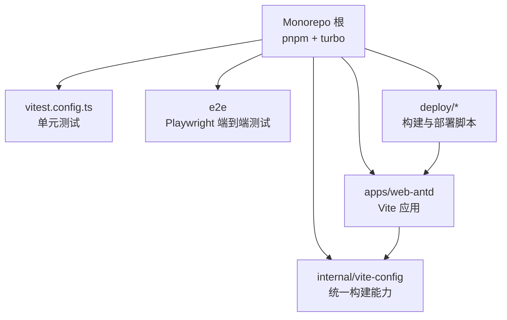
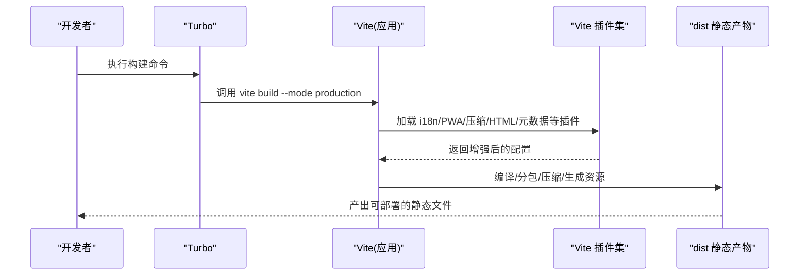
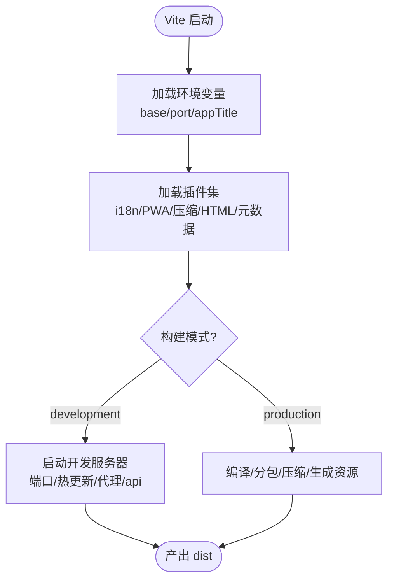
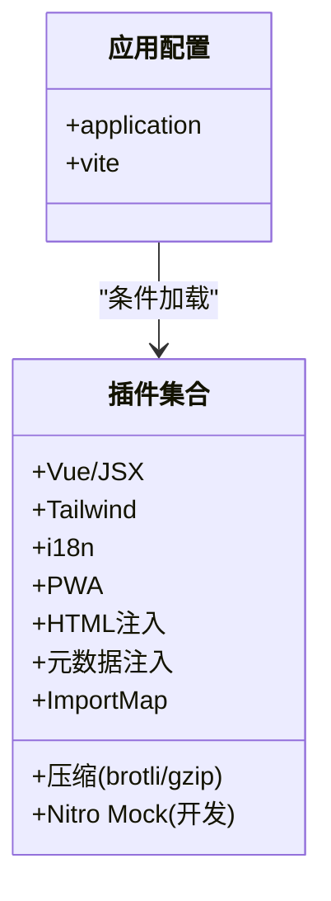
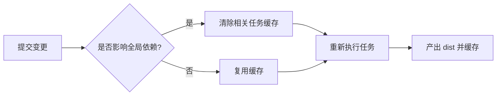
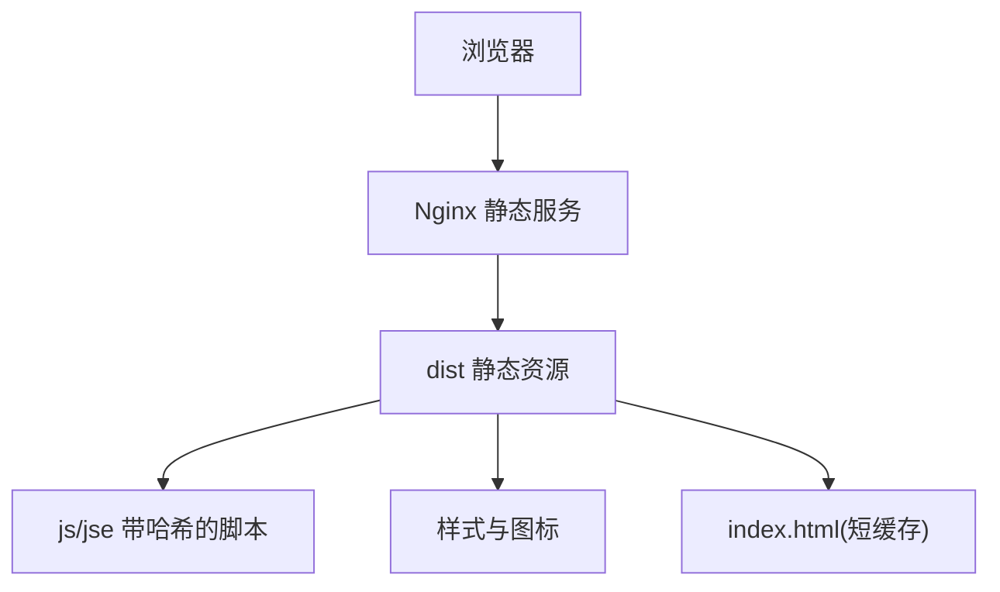
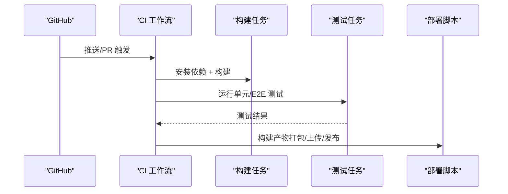
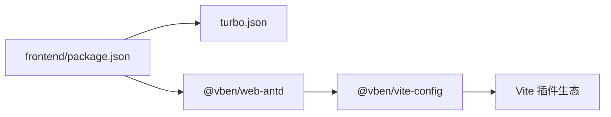

# 构建与部署

<cite>
**本文引用的文件**
- [frontend/package.json](file://frontend/package.json)
- [frontend/turbo.json](file://frontend/turbo.json)
- [frontend/vitest.config.ts](file://frontend/vitest.config.ts)
- [frontend/apps/web-antd/vite.config.ts](file://frontend/apps/web-antd/vite.config.ts)
- [frontend/apps/web-antd/package.json](file://frontend/apps/web-antd/package.json)
- [frontend/internal/vite-config/src/config/application.ts](file://frontend/internal/vite-config/src/config/application.ts)
- [frontend/internal/vite-config/src/plugins/index.ts](file://frontend/internal/vite-config/src/plugins/index.ts)
- [frontend/internal/vite-config/package.json](file://frontend/internal/vite-config/package.json)
- [deploy/nginx.conf](file://deploy/nginx.conf)
- [deploy/build-and-deploy.sh](file://deploy/build-and-deploy.sh)
- [deploy/deploy.sh](file://deploy/deploy.sh)
- [deploy/docker-compose.dev.yml](file://deploy/docker-compose.dev.yml)
- [.github/workflows/ci.yml](file://.github/workflows/ci.yml)
</cite>

## 目录
1. [简介](#简介)
2. [项目结构](#项目结构)
3. [核心组件](#核心组件)
4. [架构总览](#架构总览)
5. [详细组件分析](#详细组件分析)
6. [依赖关系分析](#依赖关系分析)
7. [性能考虑](#性能考虑)
8. [故障排查指南](#故障排查指南)
9. [结论](#结论)
10. [附录](#附录)

## 简介
本文件面向前端构建与部署，系统性说明基于 Vite 的构建配置、Turbo 任务编排、多环境构建策略，以及开发/生产环境的差异、静态资源处理、代码分割、产物结构与 CDN 缓存策略。同时覆盖 CI/CD 流水线集成、自动化测试与代码质量检查，并提供新增构建目标、优化构建性能与常见问题的实操指引。

## 项目结构
前端采用 Monorepo 组织，使用 pnpm workspace + Turbo 进行任务编排；应用位于 apps/web-antd，统一构建能力封装在 internal/vite-config；测试通过 Vitest（单元）与 Playwright（E2E）完成；部署脚本集中于 deploy 目录，Nginx 作为静态站点服务器。

**图示来源**
- [frontend/package.json:27-59](file://frontend/package.json#L27-L59)
- [frontend/turbo.json:15-46](file://frontend/turbo.json#L15-L46)
- [frontend/apps/web-antd/vite.config.ts:1-23](file://frontend/apps/web-antd/vite.config.ts#L1-L23)
- [frontend/internal/vite-config/src/config/application.ts:17-98](file://frontend/internal/vite-config/src/config/application.ts#L17-L98)

**章节来源**
- [frontend/package.json:27-59](file://frontend/package.json#L27-L59)
- [frontend/turbo.json:15-46](file://frontend/turbo.json#L15-L46)

## 核心组件
- 任务编排：Turbo 定义 build、preview、build:analyze、dev、typecheck 等任务及输出缓存规则，并通过全局依赖与环境变量控制缓存失效。
- 应用构建：apps/web-antd 通过 @vben/vite-config 的 defineConfig 装配插件与构建选项，支持 PWA、压缩、i18n、HTML 注入、元数据注入、ImportMap、打包体积可视化等。
- 开发代理：Vite dev server 将 /api 请求代理到后端 127.0.0.1:17101，并开启 WebSocket 支持。
- 测试：Vitess 配置启用 happy-dom 环境，排除 e2e 与 dist 等目录；E2E 使用 Playwright。
- 部署：deploy 目录提供 Nginx 配置与构建/部署脚本，用于生成静态产物并部署到 Web 服务器。

**章节来源**
- [frontend/turbo.json:15-46](file://frontend/turbo.json#L15-L46)
- [frontend/internal/vite-config/src/config/application.ts:17-98](file://frontend/internal/vite-config/src/config/application.ts#L17-L98)
- [frontend/internal/vite-config/src/plugins/index.ts:95-228](file://frontend/internal/vite-config/src/plugins/index.ts#L95-L228)
- [frontend/apps/web-antd/vite.config.ts:1-23](file://frontend/apps/web-antd/vite.config.ts#L1-L23)
- [frontend/vitest.config.ts:5-28](file://frontend/vitest.config.ts#L5-L28)
- [frontend/apps/web-antd/package.json:18-28](file://frontend/apps/web-antd/package.json#L18-L28)

## 架构总览
下图展示从源码到静态产物的构建链路，以及开发与生产的关键差异点。

**图示来源**
- [frontend/package.json:27-35](file://frontend/package.json#L27-L35)
- [frontend/apps/web-antd/package.json:18-21](file://frontend/apps/web-antd/package.json#L18-L21)
- [frontend/internal/vite-config/src/plugins/index.ts:95-228](file://frontend/internal/vite-config/src/plugins/index.ts#L95-L228)
- [frontend/internal/vite-config/src/config/application.ts:17-98](file://frontend/internal/vite-config/src/config/application.ts#L17-L98)

## 详细组件分析

### Vite 构建配置（应用层）
- 入口：apps/web-antd/vite.config.ts 通过 @vben/vite-config 的 defineConfig 返回 application 与 vite 扩展配置。
- 开发代理：/api 转发至 http://127.0.0.1:17101，并启用 ws 以支持 WebSocket。
- 基础路径与端口：由 internal/vite-config 读取环境变量并设置 base 与 server.port。
- 构建目标与产物命名：target 为 es2015；资源文件按 ext/name-hash 命名，JS chunk 与入口分别输出到 js/ 与 jse/ 目录，生产模式关闭调试器。

**图示来源**
- [frontend/apps/web-antd/vite.config.ts:1-23](file://frontend/apps/web-antd/vite.config.ts#L1-L23)
- [frontend/internal/vite-config/src/config/application.ts:17-98](file://frontend/internal/vite-config/src/config/application.ts#L17-L98)
- [frontend/internal/vite-config/src/plugins/index.ts:95-228](file://frontend/internal/vite-config/src/plugins/index.ts#L95-L228)

**章节来源**
- [frontend/apps/web-antd/vite.config.ts:1-23](file://frontend/apps/web-antd/vite.config.ts#L1-L23)
- [frontend/internal/vite-config/src/config/application.ts:17-98](file://frontend/internal/vite-config/src/config/application.ts#L17-L98)

### Vite 插件体系与功能
- 通用插件：Vue/JSX、Tailwind、开发工具、元数据注入、包体积可视化（构建时）。
- 应用插件：i18n、PWA、HTML 注入、License、ImportMap、额外应用配置、归档打包、Dayjs 按需、VxeTable 懒加载、Nitro Mock（仅开发）。
- 压缩：可选 brotli/gzip 双格式输出，保留原始文件以便服务端托管。

**图示来源**
- [frontend/internal/vite-config/src/plugins/index.ts:51-228](file://frontend/internal/vite-config/src/plugins/index.ts#L51-L228)
- [frontend/internal/vite-config/package.json:29-58](file://frontend/internal/vite-config/package.json#L29-L58)

**章节来源**
- [frontend/internal/vite-config/src/plugins/index.ts:51-228](file://frontend/internal/vite-config/src/plugins/index.ts#L51-L228)
- [frontend/internal/vite-config/package.json:29-58](file://frontend/internal/vite-config/package.json#L29-L58)

### Turbo 任务编排与缓存
- 全局依赖：锁定 pnpm-lock.yaml、各 .env.*local、tsconfig、internal/vite-config 与 scripts 变更影响缓存。
- 任务定义：
  - build：依赖上游包的 ^build，输出 dist 与 zip。
  - preview：依赖 ^build，输出 dist。
  - build:analyze：依赖 ^build，输出 dist。
  - dev：无缓存、持久化。
  - typecheck：无输出。
- 全局环境变量：NODE_ENV 参与缓存键计算。

**图示来源**
- [frontend/turbo.json:1-46](file://frontend/turbo.json#L1-L46)

**章节来源**
- [frontend/turbo.json:1-46](file://frontend/turbo.json#L1-L46)

### 多环境构建策略
- 模式区分：通过 vite build --mode development|production|analyze 切换行为。
- 环境变量：internal/vite-config 会加载并转换环境变量（如 appTitle/base/port），并在构建时注入到应用。
- 分析模式：build:analyze 启用包体积可视化，便于定位大依赖。

**章节来源**
- [frontend/apps/web-antd/package.json:18-21](file://frontend/apps/web-antd/package.json#L18-L21)
- [frontend/internal/vite-config/src/config/application.ts:17-98](file://frontend/internal/vite-config/src/config/application.ts#L17-L98)

### 开发环境配置
- 代理：/api -> http://127.0.0.1:17101，ws=true，解决跨域与本地联调问题。
- 预热：开发模式下对关键文件进行预热，提升首屏速度。
- 插件：开发时启用 Vue DevTools、打印信息、Nitro Mock（若启用）。

**章节来源**
- [frontend/apps/web-antd/vite.config.ts:6-20](file://frontend/apps/web-antd/vite.config.ts#L6-L20)
- [frontend/internal/vite-config/src/config/application.ts:79-90](file://frontend/internal/vite-config/src/config/application.ts#L79-L90)
- [frontend/internal/vite-config/src/plugins/index.ts:154-167](file://frontend/internal/vite-config/src/plugins/index.ts#L154-L167)

### 生产环境优化
- 压缩：可选 brotli/gzip 双格式，便于 CDN/反向代理做内容协商。
- 分包：JS chunk 与资源文件带 hash，利于浏览器长期缓存。
- 目标：es2015 兼容主流现代浏览器。
- 元数据与 HTML：注入应用元信息与加载态，提升体验与可观测性。

**章节来源**
- [frontend/internal/vite-config/src/plugins/index.ts:186-200](file://frontend/internal/vite-config/src/plugins/index.ts#L186-L200)
- [frontend/internal/vite-config/src/config/application.ts:60-76](file://frontend/internal/vite-config/src/config/application.ts#L60-L76)

### 静态资源处理与代码分割
- 资源命名：[ext]/[name]-[hash].[ext]，避免缓存污染。
- JS 分包：chunkFileNames 与 entryFileNames 均带 hash，配合路由懒加载实现按需加载。
- 第三方库：可通过 ImportMap 或按需引入减少初始包体。

**章节来源**
- [frontend/internal/vite-config/src/config/application.ts:60-76](file://frontend/internal/vite-config/src/config/application.ts#L60-L76)
- [frontend/internal/vite-config/src/plugins/index.ts:207-210](file://frontend/internal/vite-config/src/plugins/index.ts#L207-L210)

### 部署产物结构与 CDN/缓存策略
- 产物位置：dist 目录包含 index.html、js、jse、资源目录等。
- 服务器：Nginx 作为静态站点服务器，建议开启 gzip/brotli 与长缓存策略（对带 hash 的资源）。
- 缓存：HTML 不缓存或短缓存，静态资源根据 hash 长期缓存。

**图示来源**
- [deploy/nginx.conf](file://deploy/nginx.conf)
- [frontend/internal/vite-config/src/config/application.ts:60-76](file://frontend/internal/vite-config/src/config/application.ts#L60-L76)

**章节来源**
- [deploy/nginx.conf](file://deploy/nginx.conf)
- [frontend/internal/vite-config/src/config/application.ts:60-76](file://frontend/internal/vite-config/src/config/application.ts#L60-L76)

### CI/CD 流水线集成
- GitHub Actions：.github/workflows/ci.yml 用于触发构建与测试流程。
- 本地脚本：deploy/build-and-deploy.sh、deploy/deploy.sh 提供一键构建与部署能力。
- 容器化：docker-compose.dev.yml 可用于本地集成环境与依赖模拟。

**图示来源**
- [.github/workflows/ci.yml](file://.github/workflows/ci.yml)
- [deploy/build-and-deploy.sh](file://deploy/build-and-deploy.sh)
- [deploy/deploy.sh](file://deploy/deploy.sh)
- [deploy/docker-compose.dev.yml](file://deploy/docker-compose.dev.yml)

**章节来源**
- [.github/workflows/ci.yml](file://.github/workflows/ci.yml)
- [deploy/build-and-deploy.sh](file://deploy/build-and-deploy.sh)
- [deploy/deploy.sh](file://deploy/deploy.sh)
- [deploy/docker-compose.dev.yml](file://deploy/docker-compose.dev.yml)

## 依赖关系分析
- 顶层 package.json 通过 turbo 驱动 monorepo 构建，scripts 暴露 build、build:analyze、dev 等入口。
- apps/web-antd 依赖 internal/vite-config 提供的统一构建能力。
- internal/vite-config 依赖多个 Vite 插件与工具，形成“配置即插件”的可插拔架构。

**图示来源**
- [frontend/package.json:27-59](file://frontend/package.json#L27-L59)
- [frontend/turbo.json:15-46](file://frontend/turbo.json#L15-L46)
- [frontend/apps/web-antd/package.json:18-28](file://frontend/apps/web-antd/package.json#L18-L28)
- [frontend/internal/vite-config/package.json:29-58](file://frontend/internal/vite-config/package.json#L29-L58)

**章节来源**
- [frontend/package.json:27-59](file://frontend/package.json#L27-L59)
- [frontend/turbo.json:15-46](file://frontend/turbo.json#L15-L46)
- [frontend/apps/web-antd/package.json:18-28](file://frontend/apps/web-antd/package.json#L18-L28)
- [frontend/internal/vite-config/package.json:29-58](file://frontend/internal/vite-config/package.json#L29-L58)

## 性能考虑
- 构建性能
  - 使用 Turbo 的任务缓存与并行执行，减少重复构建时间。
  - 合理拆分路由与组件，利用懒加载降低首包体积。
  - 借助 build:analyze 定期分析依赖体积，剔除无用依赖。
- 运行时性能
  - 启用 Brotli/Gzip 压缩，结合 CDN 内容协商提升传输效率。
  - 对带 hash 的静态资源设置长期缓存，HTML 短缓存或 no-cache。
  - 开发阶段预热关键文件，缩短冷启动时间。
- 内存与稳定性
  - 构建脚本已设置较大的 Node 堆大小，避免大型项目 OOM。

[本节为通用指导，无需具体文件引用]

## 故障排查指南
- 构建失败
  - 清理缓存：删除 node_modules/.cache 或 pnpm 缓存后重试。
  - 检查环境变量：确认 mode 与 .env.* 文件正确加载。
  - 查看分析结果：运行 build:analyze 定位大依赖。
- 代理异常
  - 确认后端服务监听 127.0.0.1:17101，且未被其他进程占用。
  - 检查防火墙与 IPv4/IPv6 绑定，确保代理可达。
- 缓存命中问题
  - 修改 internal/vite-config 或脚本会影响全局依赖，导致缓存失效；必要时手动清理缓存。
- 测试失败
  - 单元测试：确认 happy-dom 环境配置与排除规则。
  - E2E：确保浏览器驱动安装与测试环境可用。

**章节来源**
- [frontend/vitest.config.ts:5-28](file://frontend/vitest.config.ts#L5-L28)
- [frontend/apps/web-antd/vite.config.ts:6-20](file://frontend/apps/web-antd/vite.config.ts#L6-L20)
- [frontend/turbo.json:1-13](file://frontend/turbo.json#L1-L13)

## 结论
本项目通过 Turborepo 统一编排、@vben/vite-config 集中管理构建能力，实现了开发高效、生产优化的前端工程化方案。借助 PWA、压缩、分包与 CDN 缓存策略，兼顾了首屏性能与长期缓存收益。CI/CD 与本地脚本打通了从代码到上线的完整链路，便于持续交付与回滚。

[本节为总结性内容，无需具体文件引用]

## 附录

### 实操示例

- 新增构建目标（例如 staging）
  - 在 apps/web-antd 的 package.json 中添加脚本，指定 --mode staging。
  - 在 internal/vite-config 的环境加载逻辑中补充 staging 对应的环境变量映射。
  - 在部署脚本中增加 staging 分支的构建与发布步骤。

- 优化构建性能
  - 启用 build:analyze 定期分析依赖体积。
  - 拆分大模块为路由级懒加载。
  - 调整压缩策略（brotli/gzip）与服务端缓存头。

- 解决常见问题
  - 代理 502：确认后端地址与端口，优先使用 127.0.0.1 而非 localhost。
  - 缓存未生效：检查资源文件名是否包含 hash，HTML 是否短缓存。
  - 构建内存不足：适当提高 NODE_OPTIONS 堆大小。

**章节来源**
- [frontend/apps/web-antd/package.json:18-21](file://frontend/apps/web-antd/package.json#L18-L21)
- [frontend/internal/vite-config/src/config/application.ts:17-98](file://frontend/internal/vite-config/src/config/application.ts#L17-L98)
- [frontend/apps/web-antd/vite.config.ts:6-20](file://frontend/apps/web-antd/vite.config.ts#L6-L20)
- [deploy/build-and-deploy.sh](file://deploy/build-and-deploy.sh)
- [deploy/deploy.sh](file://deploy/deploy.sh)