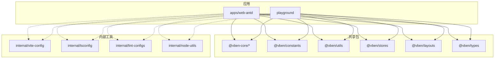
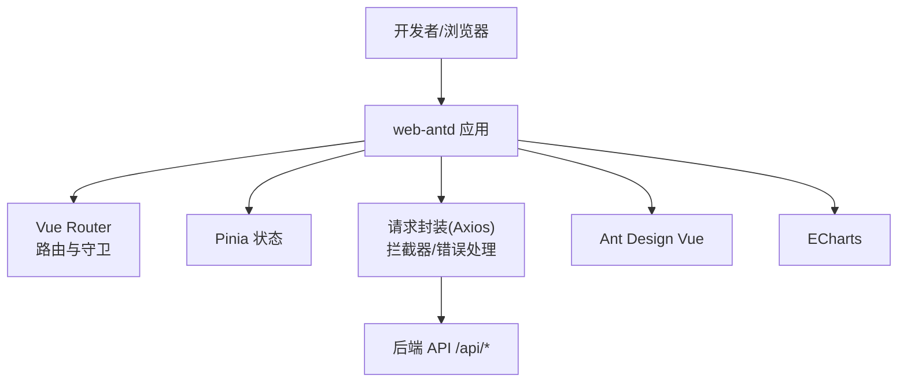
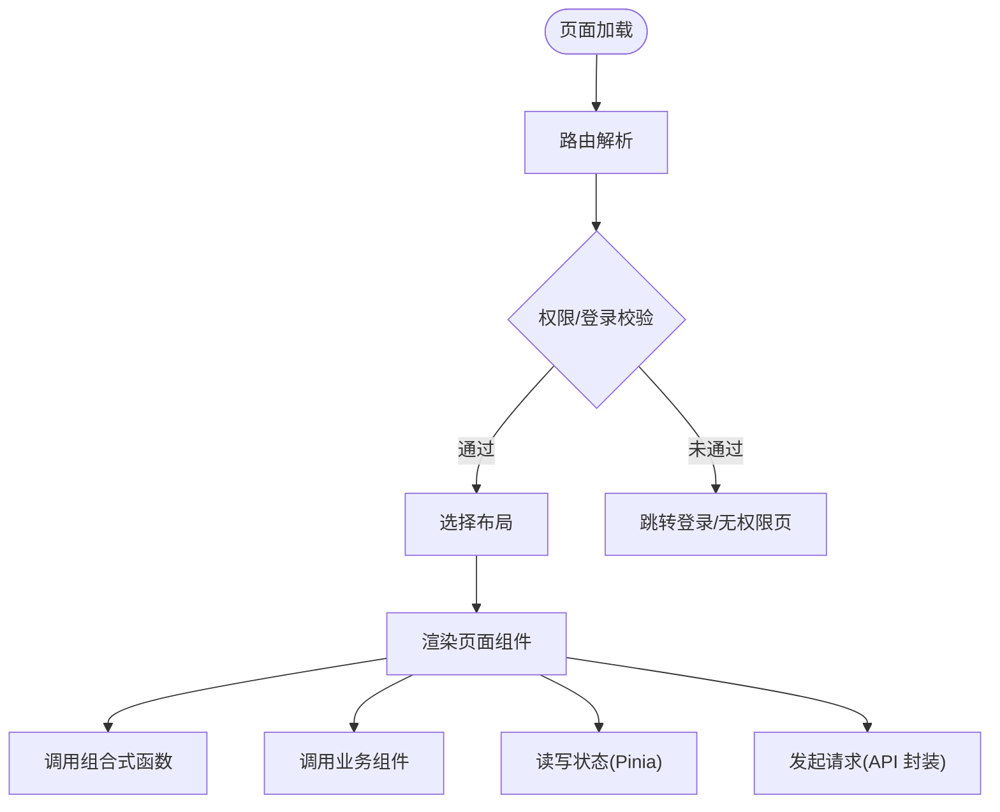
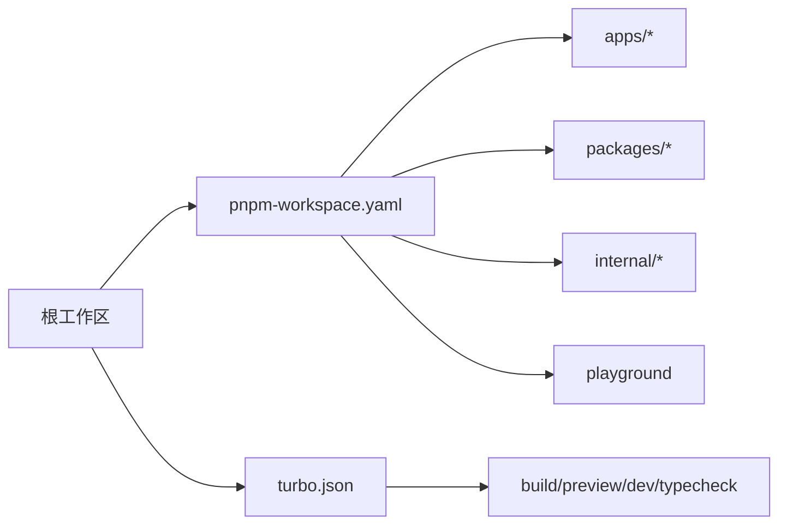
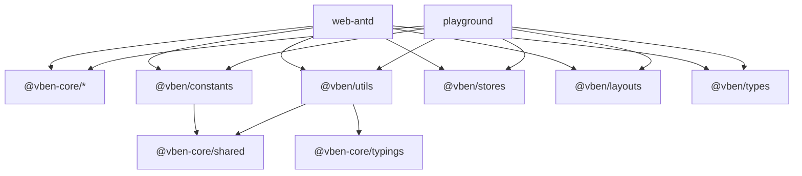

# 项目结构

<cite>
**本文引用的文件**
- [frontend/package.json](file://frontend/package.json)
- [frontend/pnpm-workspace.yaml](file://frontend/pnpm-workspace.yaml)
- [frontend/turbo.json](file://frontend/turbo.json)
- [apps/web-antd/package.json](file://apps/web-antd/package.json)
- [apps/web-antd/vite.config.ts](file://apps/web-antd/vite.config.ts)
- [apps/web-antd/src/router/index.ts](file://apps/web-antd/src/router/index.ts)
- [apps/web-antd/src/store/index.ts](file://apps/web-antd/src/store/index.ts)
- [packages/@core/base/shared/package.json](file://packages/@core/base/shared/package.json)
- [packages/constants/package.json](file://packages/constants/package.json)
- [packages/utils/package.json](file://packages/utils/package.json)
- [playground/package.json](file://playground/package.json)
</cite>

## 目录
1. [简介](#简介)
2. [项目结构](#项目结构)
3. [核心组件](#核心组件)
4. [架构总览](#架构总览)
5. [详细组件分析](#详细组件分析)
6. [依赖关系分析](#依赖关系分析)
7. [性能与构建产物](#性能与构建产物)
8. [故障排查指南](#故障排查指南)
9. [结论](#结论)
10. [附录](#附录)

## 简介
本仓库采用 monorepo 组织前端工程，使用 pnpm workspace + Turbo 进行包管理与任务编排。主应用为 apps/web-antd（基于 Ant Design Vue），共享能力沉淀在 packages/*，内部工具与配置集中在 internal/*，playground 用于快速验证与演示。本文聚焦前端结构、职责划分、包管理策略、代码组织原则以及构建产物与部署规划。

## 项目结构
整体采用分层与按功能模块相结合的目录组织方式：
- apps/web-antd：业务主应用，包含页面、布局、路由、状态、API 封装、业务组件与组合式函数等。
- packages/*：可复用的共享包，如常量、类型、工具、UI Kit、偏好设置、样式等。
- internal/*：仅在本仓库内使用的内部工具与统一配置（Vite 配置、TS 基础配置、Lint 规则、Node 工具等）。
- playground：示例/演示应用，复用 packages 与 internal 能力，便于快速验证。

**图表来源**
- [frontend/pnpm-workspace.yaml:1-14](file://frontend/pnpm-workspace.yaml#L1-L14)
- [apps/web-antd/package.json:33-55](file://apps/web-antd/package.json#L33-L55)
- [playground/package.json:31-55](file://playground/package.json#L31-L55)

**章节来源**
- [frontend/pnpm-workspace.yaml:1-14](file://frontend/pnpm-workspace.yaml#L1-L14)
- [frontend/package.json:27-59](file://frontend/package.json#L27-L59)

## 核心组件
- 主应用（apps/web-antd）
  - 职责：承载完整业务界面与流程，集成路由、状态、API 层、业务组件与页面。
  - 关键入口：Vite 应用配置、路由实例、Store 导出、开发代理。
- 共享包（packages/*）
  - 职责：提供跨应用复用的能力，包括设计系统、UI 组件、常量、类型、工具、偏好设置、存储等。
  - 典型包：@vben-core/*、@vben/constants、@vben/utils、@vben/stores、@vben/layouts、@vben/types。
- 内部工具（internal/*）
  - 职责：统一构建与开发体验，如 Vite 配置、TS 基础配置、Lint 规则、Node 工具脚本等。
- 示例应用（playground）
  - 职责：快速验证 UI/交互与能力组合，复用共享包与内部配置。

**章节来源**
- [apps/web-antd/package.json:33-55](file://apps/web-antd/package.json#L33-L55)
- [packages/constants/package.json:16-24](file://packages/constants/package.json#L16-L24)
- [packages/utils/package.json:16-26](file://packages/utils/package.json#L16-L26)
- [playground/package.json:31-55](file://playground/package.json#L31-L55)

## 架构总览
前端以 Vite 为构建与开发服务器，通过 @vben/vite-config 统一配置；Vue Router 负责路由与守卫；Pinia 作为状态管理；Axios 封装请求并集中处理拦截；Ant Design Vue 提供 UI 组件；ECharts 用于数据可视化。

**图表来源**
- [apps/web-antd/vite.config.ts:6-20](file://apps/web-antd/vite.config.ts#L6-L20)
- [apps/web-antd/src/router/index.ts:15-35](file://apps/web-antd/src/router/index.ts#L15-L35)
- [apps/web-antd/package.json:33-55](file://apps/web-antd/package.json#L33-L55)

## 详细组件分析

### 应用内部结构（apps/web-antd/src）
- src/views：页面级组件，按业务域划分（如 loop、diagnosis、metric、handling、monitor、reports、system 等），每个子目录对应一个功能模块的视图集合。
- src/components：业务组件，按领域细分（clpm、loop、metric、monitor、plant-node），提供可复用的 UI 与交互逻辑。
- src/composables：组合式函数，封装跨组件的通用逻辑（如轮询、虚拟列表、主题、角色、上下文、实时数据等）。
- src/api：API 接口封装，按模块拆分（auth、dashboard、loop、diagnosis、metric、tuning、system 等），并提供统一的请求封装与类型定义。
- src/store：状态管理，当前导出 auth 相关状态，便于扩展全局状态。
- src/router：路由配置与守卫，支持 hash/history 模式切换，挂载初始路由并创建守卫。
- src/layouts：布局组件，提供基础布局与认证布局，供页面嵌套使用。

**图表来源**
- [apps/web-antd/src/router/index.ts:15-35](file://apps/web-antd/src/router/index.ts#L15-L35)
- [apps/web-antd/src/store/index.ts:1-2](file://apps/web-antd/src/store/index.ts#L1-L2)

**章节来源**
- [apps/web-antd/src/router/index.ts:15-35](file://apps/web-antd/src/router/index.ts#L15-L35)
- [apps/web-antd/src/store/index.ts:1-2](file://apps/web-antd/src/store/index.ts#L1-L2)

### 包管理策略（pnpm workspace + Turborepo）
- 工作区定义：通过 pnpm-workspace.yaml 声明所有参与构建的包与应用，包括 internal、packages、apps、playground、docs、scripts 等。
- 依赖提升与覆盖：publicHoistPattern 提升常用工具到根节点；overrides/catalog 统一管理第三方依赖版本，避免冲突。
- 任务编排：turbo.json 定义 build、preview、dev、typecheck 等任务的依赖顺序与输出缓存，确保增量构建与并行执行。
- 包间依赖：主应用与 playground 通过 workspace:* 引用共享包，保证本地开发与联调一致性。

**图表来源**
- [frontend/pnpm-workspace.yaml:1-14](file://frontend/pnpm-workspace.yaml#L1-L14)
- [frontend/turbo.json:15-46](file://frontend/turbo.json#L15-L46)

**章节来源**
- [frontend/pnpm-workspace.yaml:16-39](file://frontend/pnpm-workspace.yaml#L16-L39)
- [frontend/turbo.json:15-46](file://frontend/turbo.json#L15-L46)
- [frontend/package.json:27-59](file://frontend/package.json#L27-L59)

### 代码组织原则
- 按功能模块划分：views、components、composables、api 均按业务域拆分子目录，降低耦合度。
- 文件命名规范：组件使用 .vue，组合式函数以 use- 前缀，API 文件按模块命名，便于检索与维护。
- 目录层级设计：应用层（apps）、共享层（packages）、内部工具（internal）清晰分层，职责单一。
- 类型与常量：通过 packages/types、packages/constants 集中管理，减少重复定义。

[本节为概念性说明，不直接引用具体文件]

### 构建产物结构与部署目录规划
- 构建产物：各应用构建后生成 dist 目录，Turborepo 将 dist/** 标记为构建输出，便于缓存与发布。
- 预览与分析：支持 preview 与 analyze 模式，便于本地预览与体积分析。
- 部署建议：将 dist 目录部署至静态资源服务器或容器镜像中；结合 Nginx 反向代理与缓存策略优化访问性能。

**章节来源**
- [frontend/turbo.json:15-23](file://frontend/turbo.json#L15-L23)
- [apps/web-antd/package.json:18-28](file://apps/web-antd/package.json#L18-L28)

## 依赖关系分析
- 主应用依赖：
  - 共享包：@vben/access、@vben/common-ui、@vben/constants、@vben/hooks、@vben/icons、@vben/layouts、@vben/locales、@vben/plugins、@vben/preferences、@vben/request、@vben/stores、@vben/styles、@vben/types、@vben/utils。
  - 运行时依赖：vue、vue-router、pinia、ant-design-vue、echarts、dayjs、@vueuse/core。
- 共享包依赖：
  - @vben/constants 依赖 @vben-core/shared。
  - @vben/utils 依赖 @vben-core/shared、@vben-core/typings、vue-router。
- 示例应用依赖：
  - playground 同样依赖上述共享包，并使用 antdv-next 作为替代 UI 库进行对比验证。

**图表来源**
- [apps/web-antd/package.json:33-55](file://apps/web-antd/package.json#L33-L55)
- [packages/constants/package.json:22-24](file://packages/constants/package.json#L22-L24)
- [packages/utils/package.json:22-26](file://packages/utils/package.json#L22-L26)
- [playground/package.json:31-55](file://playground/package.json#L31-L55)

**章节来源**
- [apps/web-antd/package.json:33-55](file://apps/web-antd/package.json#L33-L55)
- [packages/constants/package.json:22-24](file://packages/constants/package.json#L22-L24)
- [packages/utils/package.json:22-26](file://packages/utils/package.json#L22-L26)
- [playground/package.json:31-55](file://playground/package.json#L31-L55)

## 性能与构建产物
- 增量构建与缓存：Turborepo 根据任务输出（dist/**）进行缓存，提升二次构建速度。
- 依赖去重与提升：pnpm publicHoistPattern 提升常用工具到根节点，减少重复安装与体积。
- 构建分析：支持 build:analyze 模式，便于定位大体积依赖与优化空间。
- 开发体验：Vite 开发服务器配合代理转发至后端，提升联调效率。

**章节来源**
- [frontend/turbo.json:15-46](file://frontend/turbo.json#L15-L46)
- [frontend/pnpm-workspace.yaml:16-29](file://frontend/pnpm-workspace.yaml#L16-L29)
- [apps/web-antd/vite.config.ts:6-20](file://apps/web-antd/vite.config.ts#L6-L20)

## 故障排查指南
- 路由问题：检查路由历史模式与环境变量配置，确认守卫逻辑是否正确放行。
- 请求失败：核对 Vite 代理目标地址与后端端口，确认 /api 前缀与后端路由一致。
- 依赖冲突：使用 pnpm catalog 与 overrides 统一版本，必要时通过 conflicts catalogs 隔离冲突依赖。
- 构建失败：查看 Turbo 任务输出与缓存失效原因，清理缓存后重试。

**章节来源**
- [apps/web-antd/src/router/index.ts:15-35](file://apps/web-antd/src/router/index.ts#L15-L35)
- [apps/web-antd/vite.config.ts:6-20](file://apps/web-antd/vite.config.ts#L6-L20)
- [frontend/pnpm-workspace.yaml:31-39](file://frontend/pnpm-workspace.yaml#L31-L39)

## 结论
该前端 monorepo 通过清晰的层次划分与模块化组织，实现了高内聚低耦合的工程结构。共享包与内部工具提升了复用性与一致性，Turbo 与 pnpm workspace 保障了高效的构建与依赖管理。主应用遵循按功能模块划分的组织原则，便于团队协作与长期演进。

[本节为总结性内容，不直接引用具体文件]

## 附录
- 环境变量与模式：通过 vite.config.ts 中的 environment 与 mode 控制开发/生产行为。
- 测试与 E2E：应用与示例均集成 Vitest 与 Playwright，支持单元与端到端测试。
- 文档站点：docs 目录可作为知识沉淀与对外文档中心。

[本节为补充信息，不直接引用具体文件]