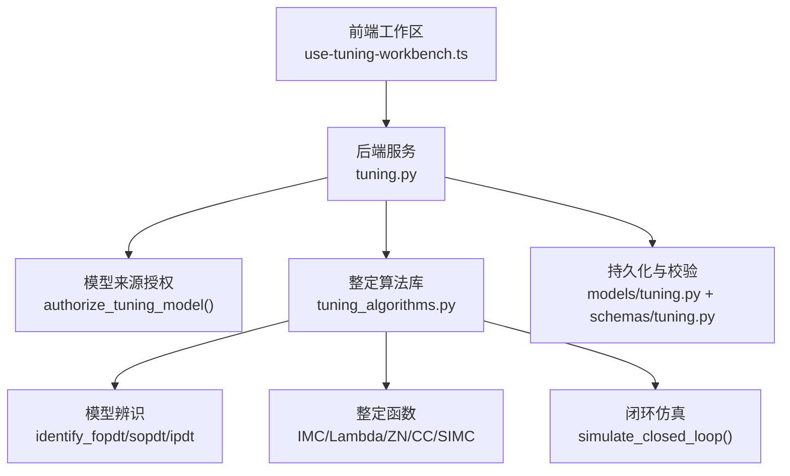
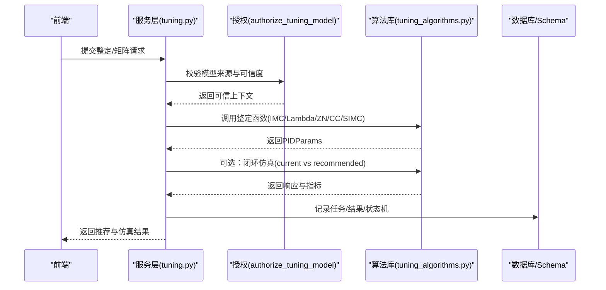
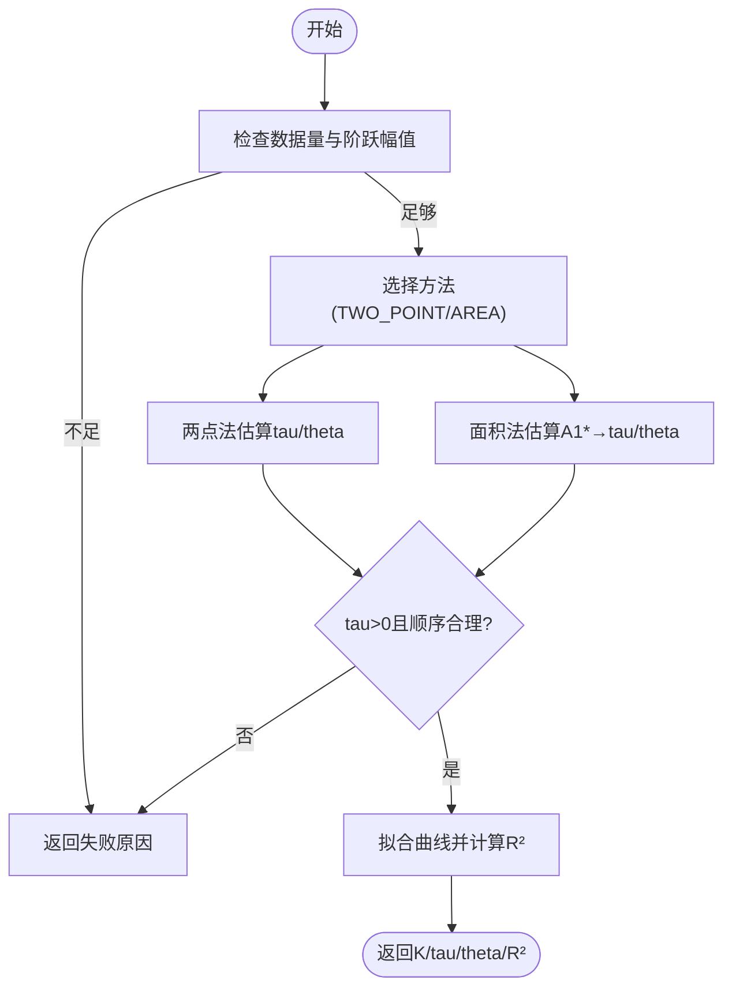
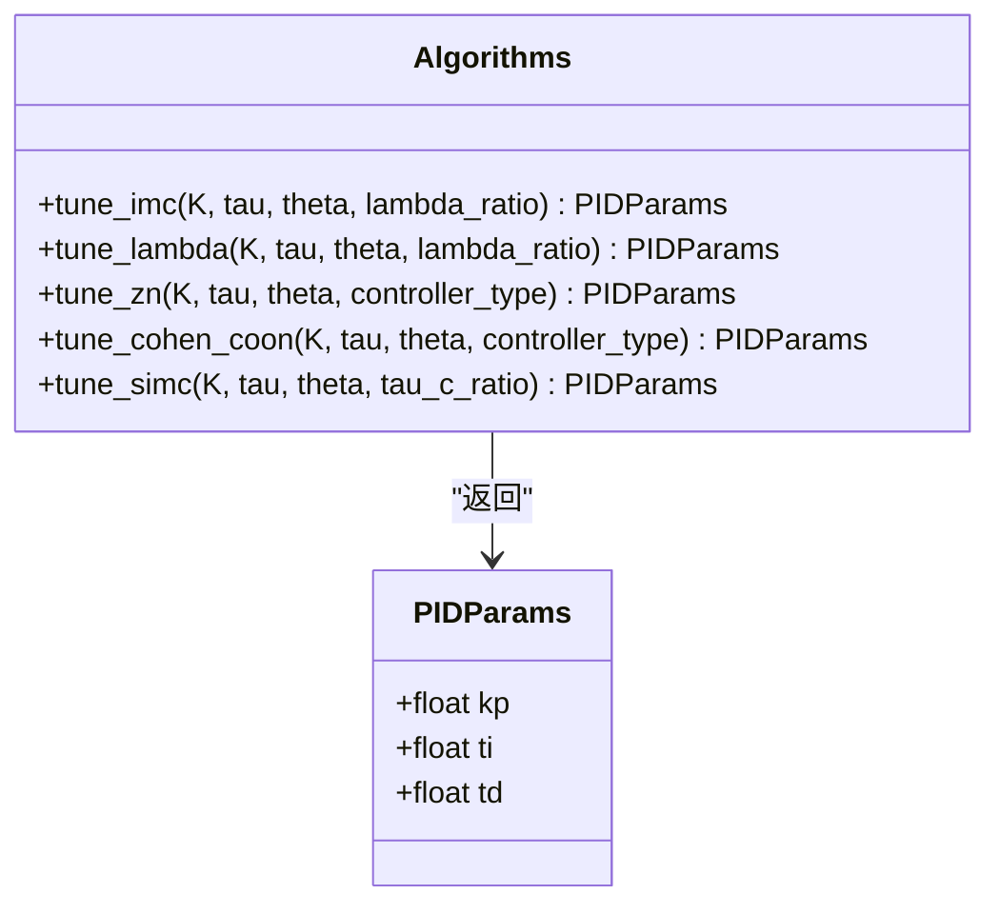
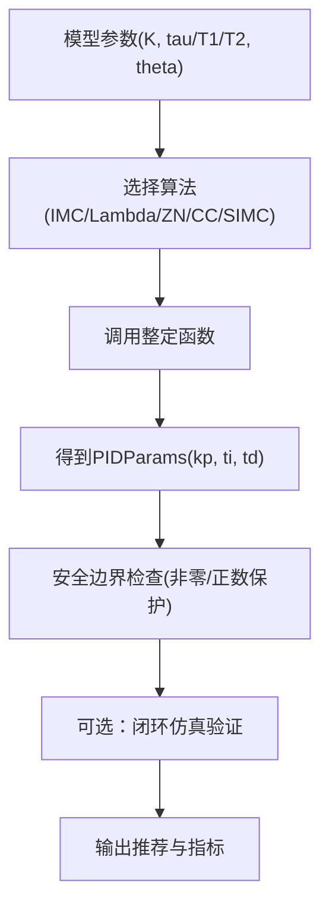
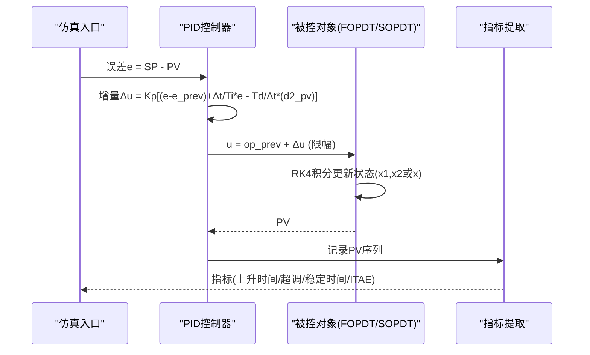
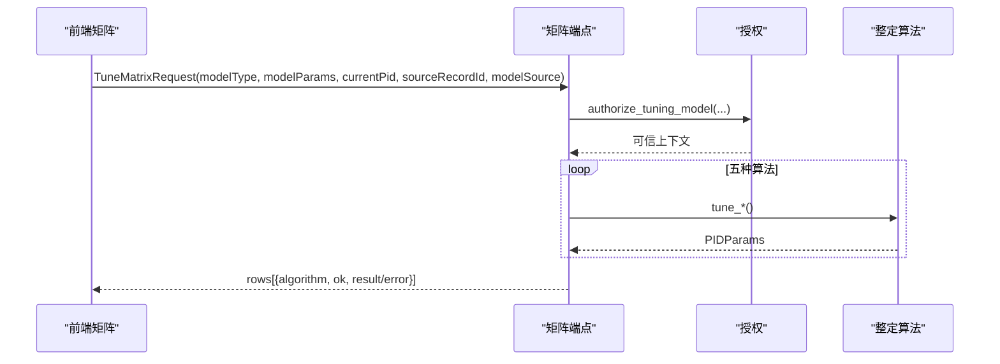
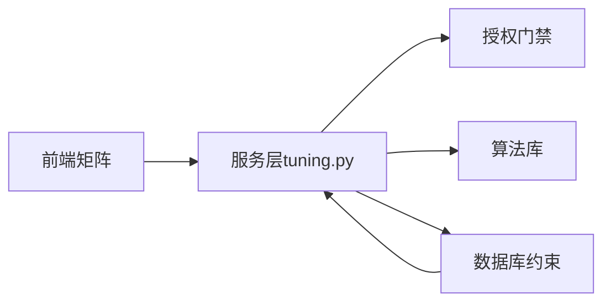

# PID参数整定算法

<cite>
**本文引用的文件**
- [tuning_algorithms.py](file://backend/app/services/tuning_algorithms.py)
- [tuning.py](file://backend/app/services/tuning.py)
- [tuning.py（模型）](file://backend/app/models/tuning.py)
- [tuning.py（Schema）](file://backend/app/schemas/tuning.py)
- [关键算法设计说明.md](file://docs/设计文档/03-ADS/关键算法设计说明.md)
- [PID整定体系设计草稿.md](file://docs/归档文档/控制回路性能评估诊断与PID整定算法体系设计-v0.1草稿-2026-06-21.md)
- [test_tuning_reference.py](file://backend/tests/compliance/test_tuning_reference.py)
- [use-tuning-workbench.ts](file://frontend/apps/web-antd/src/views/tuning/composables/use-tuning-workbench.ts)
</cite>

## 目录
1. [简介](#简介)
2. [项目结构](#项目结构)
3. [核心组件](#核心组件)
4. [架构总览](#架构总览)
5. [详细组件分析](#详细组件分析)
6. [依赖关系分析](#依赖关系分析)
7. [性能考虑](#性能考虑)
8. [故障排查指南](#故障排查指南)
9. [结论](#结论)
10. [附录：算法选择与调优实践](#附录：算法选择与调优实践)

## 简介
本文件面向CLPM后端PID整定模块，系统化阐述不同整定方法的数学原理、适用场景与计算公式；给出从过程模型到PID参数的映射流程；并总结参数限制检查、安全边界验证与推荐策略。内容严格基于仓库中已实现的整定算法与服务编排逻辑，便于工程落地与合规审计。

## 项目结构
整定能力由“服务层 + 算法实现 + 数据模型/Scheme + 前端矩阵”构成：
- 算法实现：FOPDT/SOPDT/IPDT辨识、IMC/Lambda/Z-N/Cohen-Coon/SIMC整定、闭环仿真（RK4+增量式PID）。
- 服务编排：模型来源授权、历史数据辨识路径、单算法与全矩阵整定调用、风险评估与回退建议。
- 数据契约：数据库表约束、API请求/响应Schema、方法元信息。
- 前端矩阵：一次请求计算多算法结果，支持手动整定行与仿真对比。

图表来源
- [tuning.py:104-297](file://backend/app/services/tuning.py#L104-L297)
- [tuning_algorithms.py:85-147](file://backend/app/services/tuning_algorithms.py#L85-L147)
- [tuning_algorithms.py:497-652](file://backend/app/services/tuning_algorithms.py#L497-L652)
- [tuning_algorithms.py:660-749](file://backend/app/services/tuning_algorithms.py#L660-L749)
- [tuning.py（模型）:31-115](file://backend/app/models/tuning.py#L31-L115)
- [tuning.py（Schema）:27-87](file://backend/app/schemas/tuning.py#L27-L87)

章节来源
- [tuning.py:104-297](file://backend/app/services/tuning.py#L104-L297)
- [tuning_algorithms.py:1-11](file://backend/app/services/tuning_algorithms.py#L1-L11)
- [tuning.py（Schema）:27-87](file://backend/app/schemas/tuning.py#L27-L87)

## 核心组件
- 模型辨识
  - FOPDT：两点法/面积法，输出K、tau、theta，含拟合度R²与失败原因。
  - SOPDT：非线性最小二乘拟合，T1/T2标准形优先，兼容旧τ/ξ形，含R²阈值门控。
  - IPDT：线性段斜率估计K与延迟θ。
- 整定算法
  - IMC：Padé近似后的一阶内模控制规则，可调λ=λ_ratio×θ。
  - Lambda：一阶自调节PI，λ=λ_ratio×τ。
  - Ziegler-Nichols：开环反应曲线法，支持P/PI/PID控制器类型。
  - Cohen-Coon：考虑滞后/惯性比，对大滞后有效，提供P/PI/PID分支。
  - SIMC：Skogestad简化IMC，FOPDT下为PI，Ti封顶min(τ, 4(θ+τc))。
- 闭环仿真
  - RK4积分，支持FOPDT/SOPDT（标准形优先），自动细分子步保证精度。
  - 增量式PID，微分作用于PV消除derivative kick，输出限幅[-100,100]。
  - 指标：上升时间、超调、稳定时间、ITAE及改善幅度。

章节来源
- [tuning_algorithms.py:85-147](file://backend/app/services/tuning_algorithms.py#L85-L147)
- [tuning_algorithms.py:310-389](file://backend/app/services/tuning_algorithms.py#L310-L389)
- [tuning_algorithms.py:443-489](file://backend/app/services/tuning_algorithms.py#L443-L489)
- [tuning_algorithms.py:497-652](file://backend/app/services/tuning_algorithms.py#L497-L652)
- [tuning_algorithms.py:660-749](file://backend/app/services/tuning_algorithms.py#L660-L749)
- [tuning_algorithms.py:752-917](file://backend/app/services/tuning_algorithms.py#L752-L917)

## 架构总览
整定链路包含“模型来源授权 → 模型辨识/复用 → 多算法整定 → 闭环仿真 → 风险与回退建议”。

图表来源
- [tuning.py:104-297](file://backend/app/services/tuning.py#L104-L297)
- [tuning.py:1223-1248](file://backend/app/services/tuning.py#L1223-L1248)
- [tuning_algorithms.py:497-652](file://backend/app/services/tuning_algorithms.py#L497-L652)
- [tuning_algorithms.py:660-749](file://backend/app/services/tuning_algorithms.py#L660-L749)
- [tuning.py（模型）:31-115](file://backend/app/models/tuning.py#L31-L115)

## 详细组件分析

### 模型辨识（FOPDT/SOPDT/IPDT）
- FOPDT
  - 两点法：取28.3%/63.2%点估算tau与theta；失败回退至20%/60%。
  - 面积法：归一化面积A1*=τ+θ，避免滞后重复计入。
  - 输出含拟合度R²与失败原因，禁止带病参数进入下游。
- SOPDT
  - 以FOPDT结果为初值，Nelder-Mead优化T1/T2/θ，要求R²≥阈值。
  - 标准形优先（T1/T2），兼容旧τ/ξ形式；负或零时间常数拒绝。
- IPDT
  - 线性段斜率估计K，检测响应起点得θ。

图表来源
- [tuning_algorithms.py:85-147](file://backend/app/services/tuning_algorithms.py#L85-L147)
- [tuning_algorithms.py:163-259](file://backend/app/services/tuning_algorithms.py#L163-L259)
- [tuning_algorithms.py:310-389](file://backend/app/services/tuning_algorithms.py#L310-L389)
- [tuning_algorithms.py:443-489](file://backend/app/services/tuning_algorithms.py#L443-L489)

章节来源
- [tuning_algorithms.py:85-147](file://backend/app/services/tuning_algorithms.py#L85-L147)
- [tuning_algorithms.py:310-389](file://backend/app/services/tuning_algorithms.py#L310-L389)
- [tuning_algorithms.py:443-489](file://backend/app/services/tuning_algorithms.py#L443-L489)

### 整定算法与公式
- IMC（内模控制）
  - 使用一阶Padé近似延迟，FOPDT的IMC-PID规则：Kp=(τ+θ/2)/(K·(λ+θ/2))，Ti=τ+θ/2，Td=τθ/(2(τ+θ/2))。
  - λ=λ_ratio×θ，默认λ_ratio=1.0；对异常输入做兜底保护。
- Lambda（期望闭环时间）
  - 一阶自调节PI：Kc=τ/(K·(λ+θ))，Ti=τ，Td=0。
  - λ=λ_ratio×τ，默认λ_ratio=1.0。
- Ziegler-Nichols（开环反应曲线）
  - R=K/tau，按P/PI/PID分支计算Kp、Ti、Td；对r_theta=0做保护。
- Cohen-Coon
  - 考虑θ/τ比值，提供P/PI/PID分支；当θ/τ超出[0.1,2.0]时记录警告。
- SIMC（简化IMC）
  - FOPDT下为PI：Kc=(1/K)·τ/(θ+τc)，Ti=min(τ, 4(θ+τc))，Td=0；τc=tau_c_ratio×θ。

图表来源
- [tuning_algorithms.py:497-652](file://backend/app/services/tuning_algorithms.py#L497-L652)

章节来源
- [tuning_algorithms.py:497-652](file://backend/app/services/tuning_algorithms.py#L497-L652)
- [关键算法设计说明.md:2313-2369](file://docs/设计文档/03-ADS/关键算法设计说明.md#L2313-L2369)
- [test_tuning_reference.py:27-60](file://backend/tests/compliance/test_tuning_reference.py#L27-L60)

### 模型到PID参数的转换流程
- 输入：过程模型（FOPDT/SOPDT/IPDT）参数K、tau/T1/T2、theta。
- 选择算法：根据对象特性与目标（速度/鲁棒性折中）选择IMC/Lambda/SIMC等。
- 计算映射：通过对应整定函数将模型参数映射为PIDParams（kp、ti、td）。
- 安全校验：各函数内部对K、tau、theta进行非零/正数保护，避免除零与发散。

图表来源
- [tuning_algorithms.py:497-652](file://backend/app/services/tuning_algorithms.py#L497-L652)
- [tuning_algorithms.py:660-749](file://backend/app/services/tuning_algorithms.py#L660-L749)

章节来源
- [tuning_algorithms.py:497-652](file://backend/app/services/tuning_algorithms.py#L497-L652)
- [tuning_algorithms.py:660-749](file://backend/app/services/tuning_algorithms.py#L660-L749)

### 闭环仿真与指标提取
- 数值积分：RK4，必要时自动细分子步以保证精度（子步长≤最快时间常数/4）。
- 控制器形式：增量式PID，微分作用于PV，消除SP阶跃引起的derivative kick。
- 输出限幅：[-100,100]，模拟执行器饱和。
- 指标：上升时间、超调、稳定时间、ITAE；计算当前与推荐方案的改善幅度。

图表来源
- [tuning_algorithms.py:752-917](file://backend/app/services/tuning_algorithms.py#L752-L917)
- [tuning_algorithms.py:920-988](file://backend/app/services/tuning_algorithms.py#L920-L988)

章节来源
- [tuning_algorithms.py:752-917](file://backend/app/services/tuning_algorithms.py#L752-L917)
- [tuning_algorithms.py:920-988](file://backend/app/services/tuning_algorithms.py#L920-L988)

### 参数整定矩阵与前端交互
- 矩阵端点：一次请求计算IMC/Lambda/ZN/Cohen-Coon/SIMC五组结果，单行失败不阻断。
- 前端行为：构建请求体（模型类型、参数、当前PID、来源标记），接收rows并追加“手动整定”行作为第6行。
- 数据来源：IDENTIFICATION_RECORD/STEP_EXPERIMENT/MANUAL，需通过服务端授权门禁。

图表来源
- [tuning.py:1223-1248](file://backend/app/services/tuning.py#L1223-L1248)
- [use-tuning-workbench.ts:374-423](file://frontend/apps/web-antd/src/views/tuning/composables/use-tuning-workbench.ts#L374-L423)
- [tuning.py（Schema）:270-289](file://backend/app/schemas/tuning.py#L270-L289)

章节来源
- [use-tuning-workbench.ts:374-423](file://frontend/apps/web-antd/src/views/tuning/composables/use-tuning-workbench.ts#L374-L423)
- [tuning.py:1223-1248](file://backend/app/services/tuning.py#L1223-L1248)
- [tuning.py（Schema）:270-289](file://backend/app/schemas/tuning.py#L270-L289)

## 依赖关系分析
- 服务层依赖算法库提供的辨识与整定函数，并通过授权门禁确保模型来源可信。
- 数据库约束限定model_type、algorithm、status、identify_method、data_source等枚举值，防止非法状态。
- 前端矩阵依赖后端矩阵端点返回的统一rows结构，并追加手动整定行。

图表来源
- [tuning.py:104-297](file://backend/app/services/tuning.py#L104-L297)
- [tuning.py（模型）:31-115](file://backend/app/models/tuning.py#L31-L115)
- [tuning.py（Schema）:27-87](file://backend/app/schemas/tuning.py#L27-L87)

章节来源
- [tuning.py:104-297](file://backend/app/services/tuning.py#L104-L297)
- [tuning.py（模型）:31-115](file://backend/app/models/tuning.py#L31-L115)
- [tuning.py（Schema）:27-87](file://backend/app/schemas/tuning.py#L27-L87)

## 性能考虑
- 仿真步长自适应细分：当sim_step超过最快时间常数/4时自动增加子步，保证RK4精度。
- 拟合质量门控：SOPDT要求R²不低于阈值，否则判定辨识失败。
- 大数据处理：历史辨识路径通过DataPlanner获取预处理信号，减少无效计算。
- 指标计算复杂度：指标提取为O(N)，整体仿真为O(N×n_sub)。

[本节为通用性能讨论，不直接分析具体文件]

## 故障排查指南
- 辨识失败
  - 数据点不足或阶跃幅值为零：检查pv/op长度与mv_step。
  - 增益无效或R²过低：检查噪声、稳态漂移与拟合质量。
- 整定异常
  - 参数为零或负导致除零：各整定函数已内置兜底保护，但仍需检查输入合理性。
  - Cohen-Coon θ/τ超出推荐范围：记录警告，谨慎使用。
- 仿真不稳定
  - 步长过大：观察是否触发自动细分；必要时减小sim_step。
  - 输出限幅：检查执行器饱和导致的非线性影响。
- 来源授权失败
  - 缺少sourceRecordId或状态未完成：确认辨识记录存在且状态为IDENTIFIED/SIMULATED/COMPLETED。
  - 置信度不足：仅A/B级或通过风险确认后放行。

章节来源
- [tuning_algorithms.py:85-147](file://backend/app/services/tuning_algorithms.py#L85-L147)
- [tuning_algorithms.py:310-389](file://backend/app/services/tuning_algorithms.py#L310-L389)
- [tuning_algorithms.py:586-623](file://backend/app/services/tuning_algorithms.py#L586-L623)
- [tuning_algorithms.py:752-917](file://backend/app/services/tuning_algorithms.py#L752-L917)
- [tuning.py:104-297](file://backend/app/services/tuning.py#L104-L297)

## 结论
本模块实现了从过程模型辨识到多算法整定与闭环仿真的完整链路，具备严格的来源授权、参数安全保护与质量门控。IMC/Lambda/SIMC作为首选方法，Z-N与Cohen-Coon用于对比与初值；闭环仿真提供客观的性能评估依据。结合前端矩阵与人工整定行，形成可解释、可回退、可审计的工程化整定方案。

[本节为总结性内容，不直接分析具体文件]

## 附录：算法选择与调优实践
- 算法选择指南
  - IMC/Lambda：显式速度-鲁棒折中，适合大多数工业过程；优先使用。
  - SIMC：简洁实用，FOPDT下为PI，Ti封顶避免过大积分时间。
  - Z-N：简单可复现，但通常较激进，适合作为对比或初值。
  - Cohen-Coon：对大滞后系统有效，注意θ/τ范围与模型误差敏感性。
- 参数调优最佳实践
  - 先验检查：传感器量程/校准、阀门方向/行程、DCS控制器形式已知。
  - 模型质量：确保辨识通过独立验证（R²、残差检验、激励充分）。
  - 安全边界：输出限幅、超调与调节时间约束；高风险回路专项评估。
  - 仿真验证：比较当前与推荐方案，关注上升时间、超调、稳定时间与ITAE改善。
  - 实施与回退：生成建议、风险、回退值与证据包；实施后监测验证，必要时回退。

章节来源
- [PID整定体系设计草稿.md:350-412](file://docs/归档文档/控制回路性能评估诊断与PID整定算法体系设计-v0.1草稿-2026-06-21.md#L350-L412)
- [关键算法设计说明.md:2313-2369](file://docs/设计文档/03-ADS/关键算法设计说明.md#L2313-L2369)
- [tuning_algorithms.py:1006-1062](file://backend/app/services/tuning_algorithms.py#L1006-L1062)