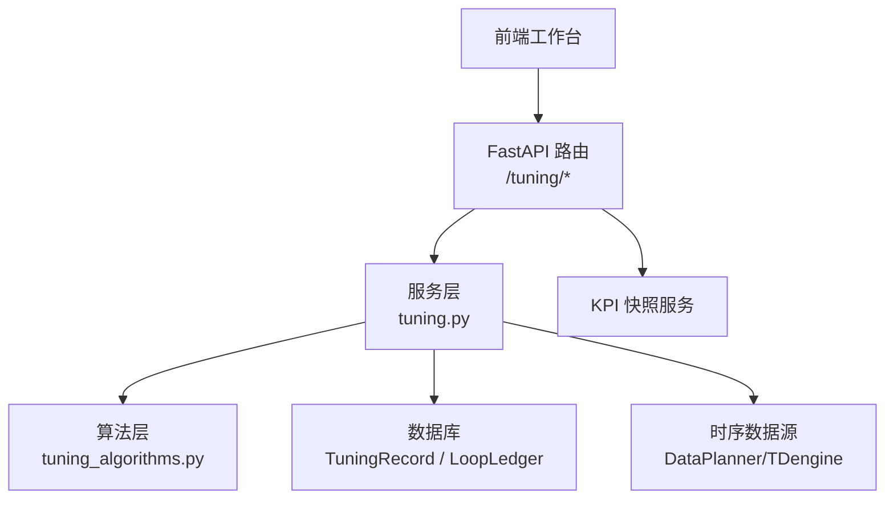
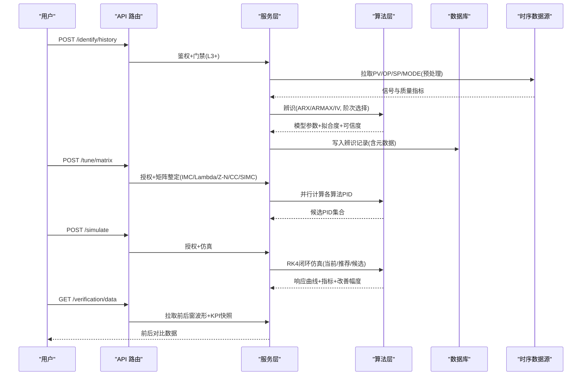
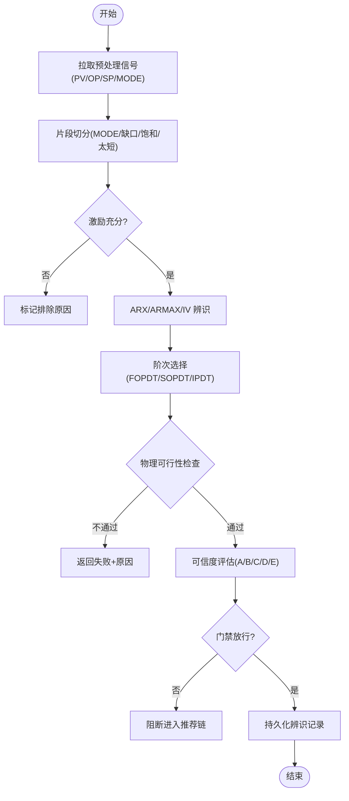
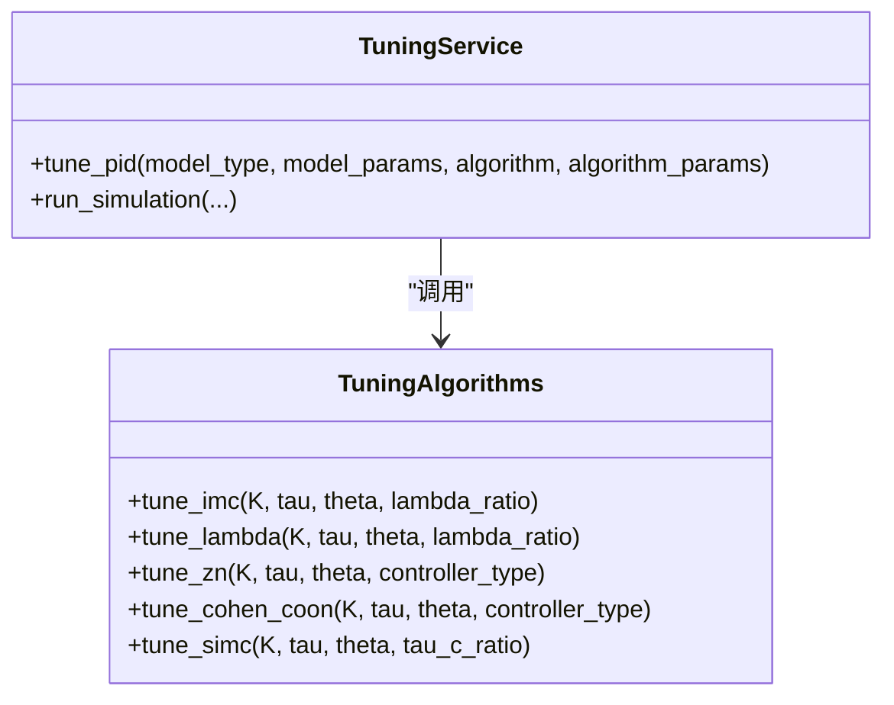
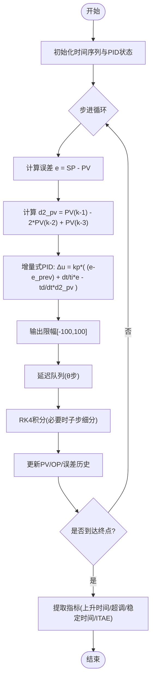
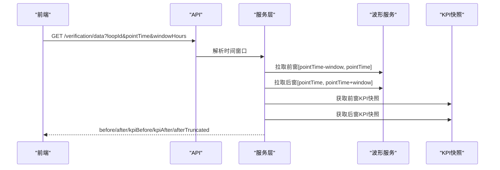
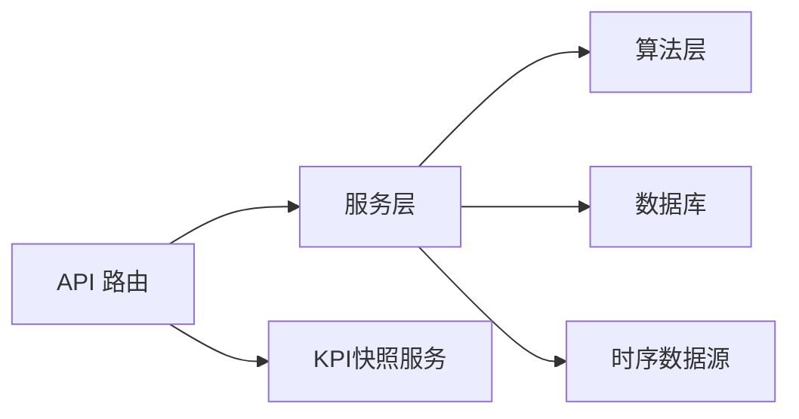

# 回路整定模块

<cite>
**本文引用的文件**
- [backend/app/services/tuning.py](file://backend/app/services/tuning.py)
- [backend/app/services/tuning_algorithms.py](file://backend/app/services/tuning_algorithms.py)
- [backend/app/api/v1/endpoints/tuning.py](file://backend/app/api/v1/endpoints/tuning.py)
- [backend/app/models/tuning.py](file://backend/app/models/tuning.py)
- [backend/app/schemas/tuning.py](file://backend/app/schemas/tuning.py)
</cite>

## 目录
1. [简介](#简介)
2. [项目结构](#项目结构)
3. [核心组件](#核心组件)
4. [架构总览](#架构总览)
5. [详细组件分析](#详细组件分析)
6. [依赖关系分析](#依赖关系分析)
7. [性能考量](#性能考量)
8. [故障排查指南](#故障排查指南)
9. [结论](#结论)
10. [附录：配置与调优指南](#附录配置与调优指南)

## 简介
本技术文档面向“回路整定模块”，围绕单页工作台“辨识→矩阵→仿真→确认”的完整工作流，系统阐述模型辨识算法（ARX/ARMAX/IV、阶次选择、物理可行性检查）、PID 参数整定算法矩阵（不同策略的计算方法与适用性判断）、闭环仿真验证机制（RK4 数值积分、前后窗曲线对比、X-Y 散点图分析）、效果验证量化指标（KPI 前后对比、自控率提升曲线、装置标杆对比），以及适用性门禁（L3 以下入口 disabled）与错误码处理。文末提供整定算法配置参数说明与调优建议。

## 项目结构
整定模块由 API 层、服务层、算法实现层、数据模型与 Schema 组成：
- API 层：路由定义、权限校验、门禁拦截、异步任务编排与响应封装
- 服务层：整定流程编排、历史数据预处理与片段预览、模型来源授权、任务管理
- 算法层：FOPDT/SOPDT/IPDT 辨识、IMC/Lambda/Z-N/Cohen-Coon/SIMC 整定、闭环仿真（RK4）
- 模型与 Schema：数据库表结构与请求/响应契约

**图表来源**
- [backend/app/api/v1/endpoints/tuning.py:136-448](file://backend/app/api/v1/endpoints/tuning.py#L136-L448)
- [backend/app/services/tuning.py:305-737](file://backend/app/services/tuning.py#L305-L737)
- [backend/app/services/tuning_algorithms.py:660-917](file://backend/app/services/tuning_algorithms.py#L660-L917)
- [backend/app/models/tuning.py:31-114](file://backend/app/models/tuning.py#L31-L114)

**章节来源**
- [backend/app/api/v1/endpoints/tuning.py:1-17](file://backend/app/api/v1/endpoints/tuning.py#L1-L17)
- [backend/app/services/tuning.py:1-47](file://backend/app/services/tuning.py#L1-L47)
- [backend/app/services/tuning_algorithms.py:1-26](file://backend/app/services/tuning_algorithms.py#L1-L26)
- [backend/app/models/tuning.py:1-114](file://backend/app/models/tuning.py#L1-L114)
- [backend/app/schemas/tuning.py:1-87](file://backend/app/schemas/tuning.py#L1-L87)

## 核心组件
- 模型来源授权器：强制要求可溯源的模型来源（IDENTIFICATION_RECORD/STEP_EXPERIMENT/MANUAL），校验记录状态、可信度等级、方法凭据与参数一致性，阻断不可信或越权调用
- 历史数据辨识管线：通过 DataPlanner 获取 PV/OP/SP/MODE，执行激励检测与片段切分，调用 tuning_identification 算法栈完成 ARX/ARMAX/IV 辨识与阶次选择
- PID 整定矩阵：对同一模型并行计算 IMC/Lambda/Z-N/Cohen-Coon/SIMC 五组参数，支持手动整定与识别仅模式
- 闭环仿真引擎：基于 FOPDT/SOPDT 对象 + 增量式 PID + RK4 数值积分，输出当前 PID 与推荐 PID 的响应曲线与指标，并支持多候选 PID 对比
- 效果验证接口：拉取前后窗波形与 KPI 快照，用于前后对比与可视化
- 任务管理与进度：持久化整定记录、异步任务提交与取消、进度查询

**章节来源**
- [backend/app/services/tuning.py:104-297](file://backend/app/services/tuning.py#L104-L297)
- [backend/app/services/tuning.py:645-737](file://backend/app/services/tuning.py#L645-L737)
- [backend/app/services/tuning_algorithms.py:497-653](file://backend/app/services/tuning_algorithms.py#L497-L653)
- [backend/app/services/tuning_algorithms.py:660-917](file://backend/app/services/tuning_algorithms.py#L660-L917)
- [backend/app/api/v1/endpoints/tuning.py:471-509](file://backend/app/api/v1/endpoints/tuning.py#L471-L509)

## 架构总览
整定工作台单页流程：
- 辨识：从历史数据或阶跃实验提取过程模型（FOPDT/SOPDT/IPDT），评估拟合度与可信度
- 矩阵：对同一模型并行计算多种 PID 整定策略的参数，形成候选集
- 仿真：用 RK4 在闭环中仿真当前 PID 与推荐 PID（或多候选）的响应，计算上升时间、超调、稳定时间、ITAE 等指标
- 确认：结合前后窗波形与 KPI 快照进行效果验证，必要时回退或实施

**图表来源**
- [backend/app/api/v1/endpoints/tuning.py:181-242](file://backend/app/api/v1/endpoints/tuning.py#L181-L242)
- [backend/app/api/v1/endpoints/tuning.py:319-358](file://backend/app/api/v1/endpoints/tuning.py#L319-L358)
- [backend/app/api/v1/endpoints/tuning.py:366-448](file://backend/app/api/v1/endpoints/tuning.py#L366-L448)
- [backend/app/api/v1/endpoints/tuning.py:471-509](file://backend/app/api/v1/endpoints/tuning.py#L471-L509)
- [backend/app/services/tuning.py:645-737](file://backend/app/services/tuning.py#L645-L737)
- [backend/app/services/tuning_algorithms.py:660-917](file://backend/app/services/tuning_algorithms.py#L660-L917)

## 详细组件分析

### 模型辨识（历史数据路径与阶跃路径）
- 历史数据路径：通过 DataPlanner 获取 PV/OP/SP/MODE，按 MODE/缺口/饱和/太短切分片段，对可辨识片段执行激励检测与 ARX/ARMAX/IV 辨识；自动选择最优阶次（FOPDT/SOPDT/IPDT），输出拟合度与可信度，并与数据质量可信度取较低者作为最终评级
- 阶跃路径：窗口内检测唯一 MV 阶跃，使用两点法/面积法（FOPDT）、非线性最小二乘（SOPDT）、线性回归（IPDT）辨识，严格校验参数物理可行（K≠0、τ>0、θ≥0、拟合度>0）
- 可信度与门禁：仅 A/B 级或经风险确认的 C 级结果进入推荐链；THETA_SOURCE=HEURISTIC_2TS 被阻断；HISTORICAL_IV 已升级为生产方法（CLIVC）

**图表来源**
- [backend/app/services/tuning.py:325-437](file://backend/app/services/tuning.py#L325-L437)
- [backend/app/services/tuning.py:767-857](file://backend/app/services/tuning.py#L767-L857)
- [backend/app/services/tuning.py:865-992](file://backend/app/services/tuning.py#L865-L992)
- [backend/app/services/tuning.py:995-1118](file://backend/app/services/tuning.py#L995-L1118)
- [backend/app/services/tuning.py:1121-1164](file://backend/app/services/tuning.py#L1121-L1164)

**章节来源**
- [backend/app/services/tuning.py:645-737](file://backend/app/services/tuning.py#L645-L737)
- [backend/app/services/tuning.py:865-992](file://backend/app/services/tuning.py#L865-L992)
- [backend/app/services/tuning.py:995-1118](file://backend/app/services/tuning.py#L995-L1118)
- [backend/app/services/tuning.py:1121-1164](file://backend/app/services/tuning.py#L1121-L1164)

### PID 参数整定算法矩阵
- IMC：基于 Morari & Zafiriou 内模控制原理，使用一阶 Padé 近似延迟，参数 λ = lambdaRatio × θ
- Lambda：期望闭环时间常数整定，λ = lambdaRatio × τ，适合一阶自调节过程
- Ziegler-Nichols：开环反应曲线法，支持 P/PI/PID 控制器类型
- Cohen-Coon：大滞后系统整定，θ/τ > 0.5 时优于 Z-N
- SIMC：Skogestad 简化 IMC，PI 控制，τc = tauCRatio × θ
- 矩阵执行：一次请求并行计算五种算法，单行失败不阻断，前端置灰该行

**图表来源**
- [backend/app/services/tuning_algorithms.py:497-653](file://backend/app/services/tuning_algorithms.py#L497-L653)
- [backend/app/services/tuning.py:1188-1277](file://backend/app/services/tuning.py#L1188-L1277)
- [backend/app/api/v1/endpoints/tuning.py:319-358](file://backend/app/api/v1/endpoints/tuning.py#L319-L358)

**章节来源**
- [backend/app/services/tuning_algorithms.py:497-653](file://backend/app/services/tuning_algorithms.py#L497-L653)
- [backend/app/services/tuning.py:1188-1277](file://backend/app/services/tuning.py#L1188-L1277)
- [backend/app/api/v1/endpoints/tuning.py:319-358](file://backend/app/api/v1/endpoints/tuning.py#L319-L358)

### 闭环仿真验证机制
- 数值积分：采用四阶 Runge-Kutta（RK4），当仿真步长超过最快时间常数的 1/4 时自动细分子步以保证精度
- 对象模型：支持 FOPDT 与 SOPDT（标准形 T1/T2 优先，兼容旧形 τ/ξ）
- PID 实现：增量式 PID，微分项作用于测量值 PV 以消除设定值阶跃引起的 derivative kick；输出限幅 [-100, 100]
- 指标提取：上升时间（10%→90%）、超调量、稳定时间（±2% 带）、ITAE；计算改善幅度
- 多候选对比：支持传入多组 PID（label+参数），分别仿真并返回 candidateResponses

**图表来源**
- [backend/app/services/tuning_algorithms.py:752-917](file://backend/app/services/tuning_algorithms.py#L752-L917)
- [backend/app/services/tuning_algorithms.py:920-988](file://backend/app/services/tuning_algorithms.py#L920-L988)

**章节来源**
- [backend/app/services/tuning_algorithms.py:660-917](file://backend/app/services/tuning_algorithms.py#L660-L917)
- [backend/app/services/tuning_algorithms.py:920-988](file://backend/app/services/tuning_algorithms.py#L920-L988)

### 效果验证与量化指标
- 前后窗曲线：拉取 pointTime 前后 windowHours 的 SP/PV/OP 波形，用于直观对比
- KPI 快照：前后窗内最新 KPI 摘要，用于自动化指标对比
- 后窗截断：若 after 超出当前时刻，标注 afterTruncated=true
- 指标维度：上升时间、超调、稳定时间、ITAE；改善幅度百分比

**图表来源**
- [backend/app/api/v1/endpoints/tuning.py:471-509](file://backend/app/api/v1/endpoints/tuning.py#L471-L509)

**章节来源**
- [backend/app/api/v1/endpoints/tuning.py:471-509](file://backend/app/api/v1/endpoints/tuning.py#L471-L509)

### 适用性门禁与错误码处理
- 适用性门禁：L0/L1/L2 回路禁止进入写端点（辨识/整定/仿真），抛出 ERR_TUNING_FITNESS_INSUFFICIENT，提示需先处理控制状态或在诊断后再尝试
- 模型来源门禁：必须提供可验证 sourceRecordId 或 STEP_EXPERIMENT 证据；MANUAL 需显式风险确认；历史辨识仅放行 HISTORICAL_ARX/ARMAX/IV
- 常见错误码：
  - ERR_TUNING_DATA_INSUFFICIENT：数据不足
  - ERR_TUNING_STEP_INVALID：非有效单阶跃
  - ERR_TUNING_IDENTIFICATION_FAILED：辨识结果无效
  - ERR_TUNING_SOURCE_REQUIRED/INVALID/NOT_FOUND/UNVERIFIED：模型来源问题
  - ERR_TUNING_MODEL_MISMATCH：请求模型与服务端记录不一致
  - ERR_TUNING_THETA_HEURISTIC_BLOCKED：纯滞后来自启发估计，阻断
  - ERR_TUNING_CONFIDENCE_BLOCKED：可信度不满足推荐链要求
  - ERR_INVALID_ALGORITHM：不支持的整定算法
  - ERR_MODEL_PARAMS_MISSING：模型参数缺失或为零

**章节来源**
- [backend/app/api/v1/endpoints/tuning.py:97-128](file://backend/app/api/v1/endpoints/tuning.py#L97-L128)
- [backend/app/services/tuning.py:104-297](file://backend/app/services/tuning.py#L104-L297)
- [backend/app/services/tuning.py:687-692](file://backend/app/services/tuning.py#L687-L692)
- [backend/app/services/tuning.py:923-992](file://backend/app/services/tuning.py#L923-L992)
- [backend/app/services/tuning.py:1177-1277](file://backend/app/services/tuning.py#L1177-L1277)

## 依赖关系分析
- API 依赖服务层进行业务编排与门禁校验
- 服务层依赖算法层执行辨识、整定与仿真
- 服务层依赖数据库持久化整定记录与任务状态
- 服务层依赖时序数据源（DataPlanner/TDengine）获取历史信号
- 效果验证依赖 KPI 快照服务

**图表来源**
- [backend/app/api/v1/endpoints/tuning.py:67-85](file://backend/app/api/v1/endpoints/tuning.py#L67-L85)
- [backend/app/services/tuning.py:28-47](file://backend/app/services/tuning.py#L28-L47)

**章节来源**
- [backend/app/api/v1/endpoints/tuning.py:67-85](file://backend/app/api/v1/endpoints/tuning.py#L67-L85)
- [backend/app/services/tuning.py:28-47](file://backend/app/services/tuning.py#L28-L47)

## 性能考量
- 数据预处理：DataPlanner 复用 L1 缓存与 MetricDataBundleAssembler，减少重复查询
- 重采样优化：SP/MODE 重采样到 PVOP 网格，避免 naive .timestamp() 慢路径，处理乱序与外推
- 仿真精度：RK4 自动细分子步，保证步长不超过最快时间常数的 1/4
- 矩阵整定：并行计算五种算法，单行失败不阻断整体响应
- 有效性评估：valid_rate 统一为回路级口径，与诊断/KPI 链路口径一致

**章节来源**
- [backend/app/services/tuning.py:305-437](file://backend/app/services/tuning.py#L305-L437)
- [backend/app/services/tuning.py:440-642](file://backend/app/services/tuning.py#L440-L642)
- [backend/app/services/tuning_algorithms.py:851-861](file://backend/app/services/tuning_algorithms.py#L851-L861)
- [backend/app/api/v1/endpoints/tuning.py:319-358](file://backend/app/api/v1/endpoints/tuning.py#L319-L358)

## 故障排查指南
- 数据不足：检查窗口长度与有效点数，确保至少 50 个有效数据点（历史路径）或 20 个点（阶跃路径）
- 阶跃无效：确认窗口包含稳定基线、唯一 MV 阶跃、保持段与显著 PV 响应；排除缓慢漂移与多阶跃
- 辨识失败：查看拟合度与可信度；SOPDT 要求 R² ≥ 0.5；THETA_SOURCE=HEURISTIC_2TS 会被阻断
- 模型不匹配：确保请求模型参数与服务端记录一致；禁止替换辨识结果
- 门禁阻断：L3 以下回路需先处理控制状态；C 级结果需显式风险确认
- 仿真异常：检查模型参数物理可行性（K≠0、τ>0、θ≥0）；调整 sim_step 与 setpoint_step

**章节来源**
- [backend/app/services/tuning.py:687-692](file://backend/app/services/tuning.py#L687-L692)
- [backend/app/services/tuning.py:923-992](file://backend/app/services/tuning.py#L923-L992)
- [backend/app/services/tuning.py:995-1118](file://backend/app/services/tuning.py#L995-L1118)
- [backend/app/services/tuning.py:104-297](file://backend/app/services/tuning.py#L104-L297)
- [backend/app/api/v1/endpoints/tuning.py:97-128](file://backend/app/api/v1/endpoints/tuning.py#L97-L128)

## 结论
本模块实现了从历史数据或阶跃实验到 PID 整定与闭环仿真的完整链路，具备严格的模型来源授权、物理可行性检查与适用性门禁，支持多算法矩阵与多候选 PID 对比，并通过前后窗波形与 KPI 快照进行效果验证。该设计兼顾工程实用性与安全性，适用于工业控制回路的在线整定与持续优化。

## 附录：配置与调优指南
- 辨识策略：AUTO（优先历史，失败兜底阶跃）、HISTORY_ONLY、STEP_ONLY
- 候选模型类型：默认 [FOPDT, SOPDT]，可扩展 IPDT
- 纯滞后预估值：thetaEstimate 可传入，None 时使用 2Ts 启发值并将可信度封顶 C
- 整定算法参数：
  - IMC/LAMBDA：lambdaRatio（默认 1.0，范围 0.1~5.0）
  - ZN/COHEN_COON：controllerType（P/PI/PID）
  - SIMC：tauCRatio（默认 1.0，范围 0.1~5.0）
- 仿真参数：simDuration（秒）、simStep（秒）、setpointStep（幅值）、disturbanceType（step/none）
- 调优建议：
  - 大滞后系统优先 Cohen-Coon 或 SIMC
  - 一阶自调节过程优先 Lambda 或 IMC
  - 根据现场响应调整 lambdaRatio/tauCRatio 以平衡鲁棒性与快速性
  - 仿真步长过大将触发自动细分，建议设置合理 simStep 以提升效率

**章节来源**
- [backend/app/schemas/tuning.py:106-123](file://backend/app/schemas/tuning.py#L106-L123)
- [backend/app/schemas/tuning.py:224-290](file://backend/app/schemas/tuning.py#L224-L290)
- [backend/app/schemas/tuning.py:297-345](file://backend/app/schemas/tuning.py#L297-L345)
- [backend/app/services/tuning_algorithms.py:1006-1062](file://backend/app/services/tuning_algorithms.py#L1006-L1062)
- [backend/app/services/tuning.py:1188-1277](file://backend/app/services/tuning.py#L1188-L1277)