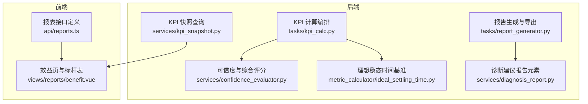
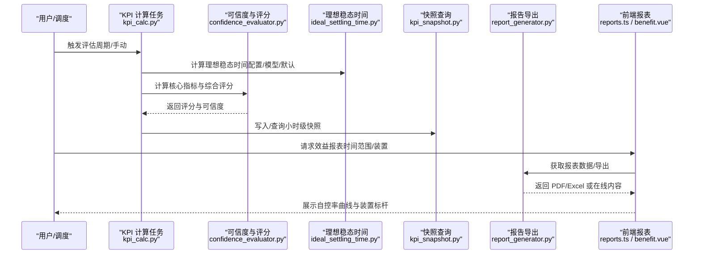
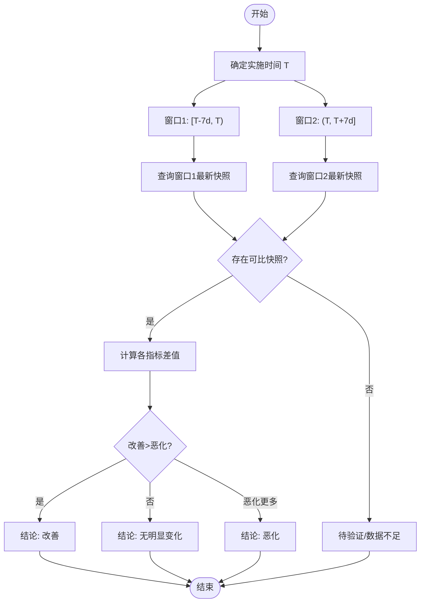
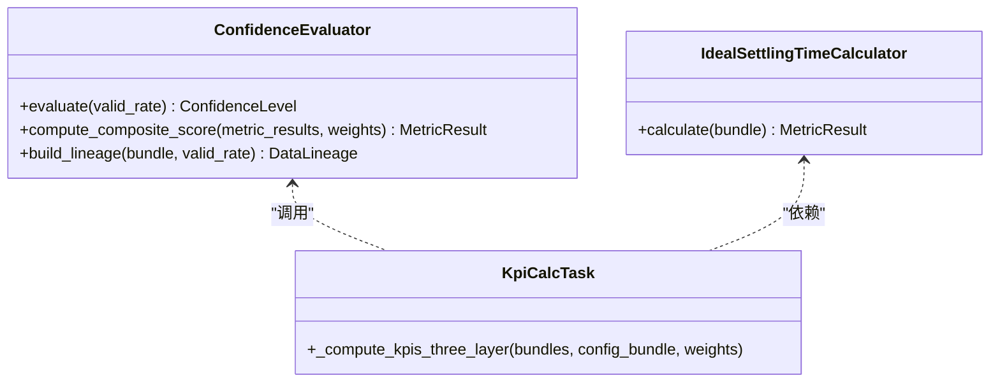
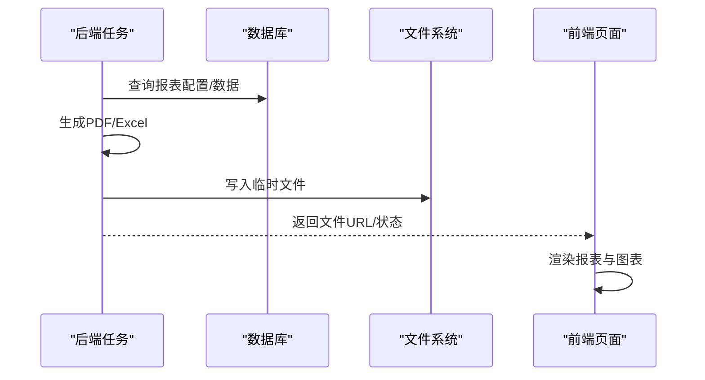
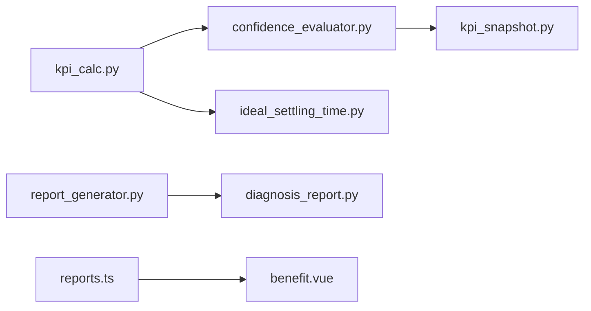

# 效果验证评估

<cite>
**本文引用的文件**
- [backend/app/services/confidence_evaluator.py](file://backend/app/services/confidence_evaluator.py)
- [backend/app/services/kpi_snapshot.py](file://backend/app/services/kpi_snapshot.py)
- [backend/app/tasks/report_generator.py](file://backend/app/tasks/report_generator.py)
- [backend/app/services/diagnosis_report.py](file://backend/app/services/diagnosis_report.py)
- [backend/app/tasks/kpi_calc.py](file://backend/app/tasks/kpi_calc.py)
- [backend/app/services/metric_calculator/ideal_settling_time.py](file://backend/app/services/metric_calculator/ideal_settling_time.py)
- [backend/tests/test_workbench_summary.py](file://backend/tests/test_workbench_summary.py)
- [backend/tests/test_metric_calculator/test_scenario_comparison.py](file://backend/tests/test_metric_calculator/test_scenario_comparison.py)
- [backend/tests/compliance/test_b5_stability_rate.py](file://backend/tests/compliance/test_b5_stability_rate.py)
- [backend/tests/test_tuning_identification.py](file://backend/tests/test_tuning_identification.py)
- [backend/scripts/benchmark_metrics.py](file://backend/scripts/benchmark_metrics.py)
- [frontend/apps/web-antd/src/api/reports.ts](file://frontend/apps/web-antd/src/api/reports.ts)
- [frontend/apps/web-antd/src/views/reports/benefit.vue](file://frontend/apps/web-antd/src/views/reports/benefit.vue)
</cite>

## 目录
1. [引言](#引言)
2. [项目结构](#项目结构)
3. [核心组件](#核心组件)
4. [架构总览](#架构总览)
5. [详细组件分析](#详细组件分析)
6. [依赖关系分析](#依赖关系分析)
7. [性能考量](#性能考量)
8. [故障排查指南](#故障排查指南)
9. [结论](#结论)
10. [附录](#附录)

## 引言
本文件面向“效果验证评估”的落地与使用，围绕量化指标体系、历史数据对比机制、统计显著性与置信区间、以及报告生成与可视化展示进行系统化说明。目标是在整定实施前后建立可追溯的性能基线，通过自控率提升曲线与装置标杆对比，给出稳定、快速、准确等多维度的效果评估结论，并保证结果的可重复与可审计。

## 项目结构
效果验证评估涉及后端指标计算、可信度与综合评分、快照查询、报告导出与前端可视化等模块。关键路径如下：
- 指标计算与编排：三层指标（无依赖层、依赖层、综合评分）由任务编排执行。
- 可信度与综合评分：基于有效数据率判定等级，按权重计算综合评分，并以有效自控率为折扣因子。
- 历史快照对比：在实施时间窗前后各取一周窗口，拉取最新有分数的快照用于对比。
- 报告与可视化：后端异步生成 PDF/Excel，前端提供效益报表页面与装置标杆表。

**图表来源**
- [backend/app/tasks/kpi_calc.py:1622-1645](file://backend/app/tasks/kpi_calc.py#L1622-L1645)
- [backend/app/services/confidence_evaluator.py:253-475](file://backend/app/services/confidence_evaluator.py#L253-L475)
- [backend/app/services/metric_calculator/ideal_settling_time.py:1-37](file://backend/app/services/metric_calculator/ideal_settling_time.py#L1-L37)
- [backend/app/services/kpi_snapshot.py:25-69](file://backend/app/services/kpi_snapshot.py#L25-L69)
- [backend/app/tasks/report_generator.py:125-246](file://backend/app/tasks/report_generator.py#L125-L246)
- [backend/app/services/diagnosis_report.py:229-257](file://backend/app/services/diagnosis_report.py#L229-L257)
- [frontend/apps/web-antd/src/api/reports.ts:165-224](file://frontend/apps/web-antd/src/api/reports.ts#L165-L224)
- [frontend/apps/web-antd/src/views/reports/benefit.vue:274-325](file://frontend/apps/web-antd/src/views/reports/benefit.vue#L274-L325)

**章节来源**
- [backend/app/tasks/kpi_calc.py:1622-1645](file://backend/app/tasks/kpi_calc.py#L1622-L1645)
- [backend/app/services/confidence_evaluator.py:253-475](file://backend/app/services/confidence_evaluator.py#L253-L475)
- [backend/app/services/kpi_snapshot.py:25-69](file://backend/app/services/kpi_snapshot.py#L25-L69)
- [backend/app/tasks/report_generator.py:125-246](file://backend/app/tasks/report_generator.py#L125-L246)
- [frontend/apps/web-antd/src/api/reports.ts:165-224](file://frontend/apps/web-antd/src/api/reports.ts#L165-L224)
- [frontend/apps/web-antd/src/views/reports/benefit.vue:274-325](file://frontend/apps/web-antd/src/views/reports/benefit.vue#L274-L325)

## 核心组件
- 三层指标编排：Layer1 无依赖指标（含理想稳态时间），Layer2 依赖指标（稳定率、快速率），Layer3 综合评分。
- 可信度评估：基于有效数据率划分 A/B/C/D/E，E 级视为不可信；支持运行时阈值动态同步。
- 综合评分：P = (A·a + F·f + S·s)/(a+f+s) × R，其中 R 为有效自控率；缺失或 E 级则整体 INCONCLUSIVE。
- 快照对比：在 T-7d~T 与 T~T+7d 两个窗口内取最新有分数快照，构建实施前后对比。
- 报告与可视化：后端异步生成 PDF/Excel，前端展示自控率提升曲线与装置标杆对比。

**章节来源**
- [backend/app/tasks/kpi_calc.py:1622-1645](file://backend/app/tasks/kpi_calc.py#L1622-L1645)
- [backend/app/services/confidence_evaluator.py:253-475](file://backend/app/services/confidence_evaluator.py#L253-L475)
- [backend/app/services/kpi_snapshot.py:25-69](file://backend/app/services/kpi_snapshot.py#L25-L69)
- [backend/app/tasks/report_generator.py:125-246](file://backend/app/tasks/report_generator.py#L125-L246)
- [frontend/apps/web-antd/src/api/reports.ts:165-224](file://frontend/apps/web-antd/src/api/reports.ts#L165-L224)

## 架构总览
效果验证评估的数据流从数据采集到指标计算、可信度判定、综合评分、快照存储，再到报告导出与前端可视化，形成闭环。

**图表来源**
- [backend/app/tasks/kpi_calc.py:1622-1645](file://backend/app/tasks/kpi_calc.py#L1622-L1645)
- [backend/app/services/confidence_evaluator.py:253-475](file://backend/app/services/confidence_evaluator.py#L253-L475)
- [backend/app/services/metric_calculator/ideal_settling_time.py:1-37](file://backend/app/services/metric_calculator/ideal_settling_time.py#L1-L37)
- [backend/app/services/kpi_snapshot.py:25-69](file://backend/app/services/kpi_snapshot.py#L25-L69)
- [backend/app/tasks/report_generator.py:125-246](file://backend/app/tasks/report_generator.py#L125-L246)
- [frontend/apps/web-antd/src/api/reports.ts:165-224](file://frontend/apps/web-antd/src/api/reports.ts#L165-L224)
- [frontend/apps/web-antd/src/views/reports/benefit.vue:274-325](file://frontend/apps/web-antd/src/views/reports/benefit.vue#L274-L325)

## 详细组件分析

### 指标体系与 KPI 前后对比
- 核心 KPI：准确率、快速率、平稳率；辅助 KPI：好值率、振荡率、饱和率、稳态误差等；综合评分以有效自控率为折扣因子。
- 前后对比：以实施时间为界，前后各取 7 天窗口，分别取窗口内最新有分数快照，比较综合评分与各核心 KPI 的变化方向与幅度。
- 结论判定：改善/恶化/无明显变化，依据改善指标数与恶化指标数对比；同时考虑数据充分性。

**图表来源**
- [backend/app/services/kpi_snapshot.py:25-69](file://backend/app/services/kpi_snapshot.py#L25-L69)
- [backend/tests/test_workbench_summary.py:785-999](file://backend/tests/test_workbench_summary.py#L785-L999)

**章节来源**
- [backend/app/services/kpi_snapshot.py:25-69](file://backend/app/services/kpi_snapshot.py#L25-L69)
- [backend/tests/test_workbench_summary.py:785-999](file://backend/tests/test_workbench_summary.py#L785-L999)

### 自控率提升曲线
- 数据来源：效益报表接口返回 autoRateCurve，包含日期与对应自控率、综合评分点。
- 展示方式：前端以折线图呈现趋势，便于观察整定后自控率的持续改善情况。
- 适用场景：全厂/装置/单元多粒度聚合，结合装置标杆表横向对比。

**章节来源**
- [frontend/apps/web-antd/src/api/reports.ts:165-224](file://frontend/apps/web-antd/src/api/reports.ts#L165-L224)
- [frontend/apps/web-antd/src/views/reports/benefit.vue:274-325](file://frontend/apps/web-antd/src/views/reports/benefit.vue#L274-L325)

### 装置标杆对比
- 指标维度：装置平均评分、平均自控率、与基线的差值（avgDelta）。
- 展示方式：表格形式列出装置排名与变化，颜色标识正负变化。
- 用途：识别高潜力装置与落后装置，指导治理优先级。

**章节来源**
- [frontend/apps/web-antd/src/api/reports.ts:165-224](file://frontend/apps/web-antd/src/api/reports.ts#L165-L224)
- [frontend/apps/web-antd/src/views/reports/benefit.vue:274-325](file://frontend/apps/web-antd/src/views/reports/benefit.vue#L274-L325)

### 多维度性能指标（稳定性、快速性、准确性）
- 稳定性：稳定率，基于偏差序列标准差的指数公式，确保 ddof=1 口径一致。
- 快速性：快速率，依赖实际稳态时间与理想稳态时间的比值，受控制类型影响。
- 准确性：准确率，关注最大偏差百分位策略，避免对 e_max 做不当截断。
- 综合评分：加权平均后乘以有效自控率折扣，缺失或低可信度时整体不可信。

**图表来源**
- [backend/app/services/confidence_evaluator.py:253-475](file://backend/app/services/confidence_evaluator.py#L253-L475)
- [backend/app/services/metric_calculator/ideal_settling_time.py:1-37](file://backend/app/services/metric_calculator/ideal_settling_time.py#L1-L37)
- [backend/app/tasks/kpi_calc.py:1622-1645](file://backend/app/tasks/kpi_calc.py#L1622-L1645)

**章节来源**
- [backend/tests/compliance/test_b5_stability_rate.py:36-63](file://backend/tests/compliance/test_b5_stability_rate.py#L36-L63)
- [backend/app/services/confidence_evaluator.py:253-475](file://backend/app/services/confidence_evaluator.py#L253-L475)
- [backend/app/services/metric_calculator/ideal_settling_time.py:1-37](file://backend/app/services/metric_calculator/ideal_settling_time.py#L1-L37)
- [backend/app/tasks/kpi_calc.py:1622-1645](file://backend/app/tasks/kpi_calc.py#L1622-L1645)

### 历史数据对比机制（基线与趋势）
- 基线建立：以实施时间 T 为界，前窗 [T-7d, T) 作为基线，后窗 (T, T+7d] 作为验证期。
- 趋势分析：通过 autoRateCurve 与 benchmark 列表，观察自控率与综合评分的趋势变化及装置间差异。
- 数据质量：快照仅取有 score 的最新记录，确保可比性；若任一窗口无快照则标记待验证。

**章节来源**
- [backend/app/services/kpi_snapshot.py:25-69](file://backend/app/services/kpi_snapshot.py#L25-L69)
- [frontend/apps/web-antd/src/api/reports.ts:165-224](file://frontend/apps/web-antd/src/api/reports.ts#L165-L224)

### 统计显著性检验与置信区间
- 参数不确定性：辨识过程输出参数协方差与 Monte Carlo 传播，得到 95% 置信区间，用于评估模型参数的可靠性。
- 白噪声检验：残差序列经 Ljung-Box 检验，判断是否恢复白噪声，间接反映模型拟合质量。
- 应用意义：在效果验证中，若关键参数 CI 覆盖真值且残差通过白噪声检验，可增强结论可信度。

**章节来源**
- [backend/tests/test_tuning_identification.py:2109-2142](file://backend/tests/test_tuning_identification.py#L2109-L2142)
- [backend/tests/test_tuning_identification.py:1919-1933](file://backend/tests/test_tuning_identification.py#L1919-L1933)

### 结果可靠性评估
- 可信度等级：基于有效数据率划分 A/B/C/D/E，E 级视为不可信；D 级接近边界会触发告警。
- 综合评分处理：核心指标缺失或 E 级导致整体 INCONCLUSIVE；权重为 0 的核心指标不参与评分。
- 数据血缘：每个指标附带采样频率、聚合策略、质量策略、tagGroup、数据块 ID、valid_rate、预处理版本、算法版本，便于审计与回溯。

**章节来源**
- [backend/app/services/confidence_evaluator.py:165-221](file://backend/app/services/confidence_evaluator.py#L165-L221)
- [backend/app/services/confidence_evaluator.py:253-475](file://backend/app/services/confidence_evaluator.py#L253-L475)

### 效果报告生成与可视化展示方案
- 报告生成：Celery 定时任务按班/日/周/月周期生成 PDF 报告，支持自定义模板；失败自动重试，业务错误不重试。
- 诊断建议书：异步生成 PDF，进度通过 TaskTracker 回写，支持大回路导出避免网关超时。
- 前端展示：效益报表接口返回 kpiComparison、autoRateCurve、benchmark；页面以表格与折线图展示装置标杆与趋势。

**图表来源**
- [backend/app/tasks/report_generator.py:125-246](file://backend/app/tasks/report_generator.py#L125-L246)
- [backend/app/tasks/report_generator.py:714-800](file://backend/app/tasks/report_generator.py#L714-L800)
- [frontend/apps/web-antd/src/api/reports.ts:165-224](file://frontend/apps/web-antd/src/api/reports.ts#L165-L224)
- [frontend/apps/web-antd/src/views/reports/benefit.vue:274-325](file://frontend/apps/web-antd/src/views/reports/benefit.vue#L274-L325)

**章节来源**
- [backend/app/tasks/report_generator.py:125-246](file://backend/app/tasks/report_generator.py#L125-L246)
- [backend/app/tasks/report_generator.py:714-800](file://backend/app/tasks/report_generator.py#L714-L800)
- [backend/app/services/diagnosis_report.py:229-257](file://backend/app/services/diagnosis_report.py#L229-L257)
- [frontend/apps/web-antd/src/api/reports.ts:165-224](file://frontend/apps/web-antd/src/api/reports.ts#L165-L224)
- [frontend/apps/web-antd/src/views/reports/benefit.vue:274-325](file://frontend/apps/web-antd/src/views/reports/benefit.vue#L274-L325)

## 依赖关系分析
- 指标依赖链：快速率依赖稳态时间与理想稳态时间；稳定率依赖偏差序列；综合评分依赖核心指标与有效自控率。
- 服务耦合：KPI 计算任务依赖可信度评估器与理想稳态时间计算器；快照查询服务于前后端对比；报告生成依赖诊断报告元素。
- 外部集成：TDengine 查询原始时序数据；Redis 用于可信度阈值广播与去重；Celery Beat 定时调度。

**图表来源**
- [backend/app/tasks/kpi_calc.py:1622-1645](file://backend/app/tasks/kpi_calc.py#L1622-L1645)
- [backend/app/services/confidence_evaluator.py:253-475](file://backend/app/services/confidence_evaluator.py#L253-L475)
- [backend/app/services/metric_calculator/ideal_settling_time.py:1-37](file://backend/app/services/metric_calculator/ideal_settling_time.py#L1-L37)
- [backend/app/services/kpi_snapshot.py:25-69](file://backend/app/services/kpi_snapshot.py#L25-L69)
- [backend/app/tasks/report_generator.py:125-246](file://backend/app/tasks/report_generator.py#L125-L246)
- [backend/app/services/diagnosis_report.py:229-257](file://backend/app/services/diagnosis_report.py#L229-L257)
- [frontend/apps/web-antd/src/api/reports.ts:165-224](file://frontend/apps/web-antd/src/api/reports.ts#L165-L224)
- [frontend/apps/web-antd/src/views/reports/benefit.vue:274-325](file://frontend/apps/web-antd/src/views/reports/benefit.vue#L274-L325)

**章节来源**
- [backend/app/tasks/kpi_calc.py:1622-1645](file://backend/app/tasks/kpi_calc.py#L1622-L1645)
- [backend/app/services/confidence_evaluator.py:253-475](file://backend/app/services/confidence_evaluator.py#L253-L475)
- [backend/app/services/metric_calculator/ideal_settling_time.py:1-37](file://backend/app/services/metric_calculator/ideal_settling_time.py#L1-L37)
- [backend/app/services/kpi_snapshot.py:25-69](file://backend/app/services/kpi_snapshot.py#L25-L69)
- [backend/app/tasks/report_generator.py:125-246](file://backend/app/tasks/report_generator.py#L125-L246)
- [backend/app/services/diagnosis_report.py:229-257](file://backend/app/services/diagnosis_report.py#L229-L257)
- [frontend/apps/web-antd/src/api/reports.ts:165-224](file://frontend/apps/web-antd/src/api/reports.ts#L165-L224)
- [frontend/apps/web-antd/src/views/reports/benefit.vue:274-325](file://frontend/apps/web-antd/src/views/reports/benefit.vue#L274-L325)

## 性能考量
- 指标计算性能：脚本对 12 个 KPI 在不同控制类型与数据规模下进行计时，推断时间复杂度，支撑容量规划。
- 批量处理：预处理管道与指标计算分离，便于并行化与缓存优化。
- 报告导出：异步任务与重试机制降低长耗时操作对主流程的影响。

**章节来源**
- [backend/scripts/benchmark_metrics.py:1-200](file://backend/scripts/benchmark_metrics.py#L1-L200)
- [backend/app/tasks/report_generator.py:125-246](file://backend/app/tasks/report_generator.py#L125-L246)

## 故障排查指南
- 数据质量告警：当有效数据率落入 D 级临近区间时触发告警，提示检查数据源完整性。
- 综合评分不可信：若核心指标缺失或 E 级，综合评分整体不可信，需检查数据质量与前置指标。
- 报告生成失败：业务错误不重试，系统错误自动重试；查看任务状态与日志定位问题。

**章节来源**
- [backend/app/services/confidence_evaluator.py:165-221](file://backend/app/services/confidence_evaluator.py#L165-L221)
- [backend/app/services/confidence_evaluator.py:253-475](file://backend/app/services/confidence_evaluator.py#L253-L475)
- [backend/app/tasks/report_generator.py:125-246](file://backend/app/tasks/report_generator.py#L125-L246)

## 结论
本效果验证评估体系以三层指标编排为核心，结合可信度评估与综合评分，构建了实施前后的历史基线与趋势分析能力。通过自控率提升曲线与装置标杆对比，能够直观呈现整定效果；借助参数不确定性与白噪声检验，增强了结果可靠性。报告导出与前端可视化提供了完整的闭环体验，便于管理层与工程师进行决策与治理。

## 附录
- 场景对比测试：不同场景下关键指标具备可分性，确保数据集设计意图可实现。
- 合规性校验：稳定率计算遵循国标附录 B.5，确保数学表达与口径一致性。

**章节来源**
- [backend/tests/test_metric_calculator/test_scenario_comparison.py:1-209](file://backend/tests/test_metric_calculator/test_scenario_comparison.py#L1-L209)
- [backend/tests/compliance/test_b5_stability_rate.py:36-63](file://backend/tests/compliance/test_b5_stability_rate.py#L36-L63)