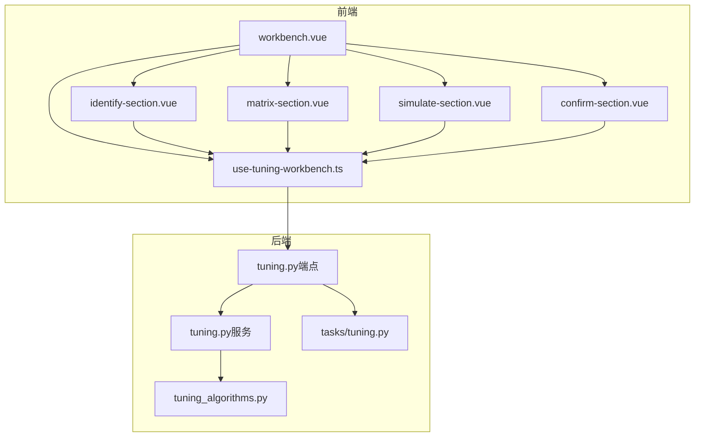
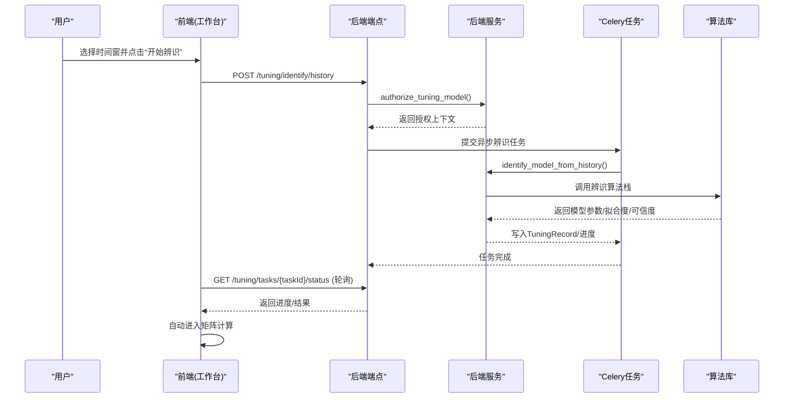
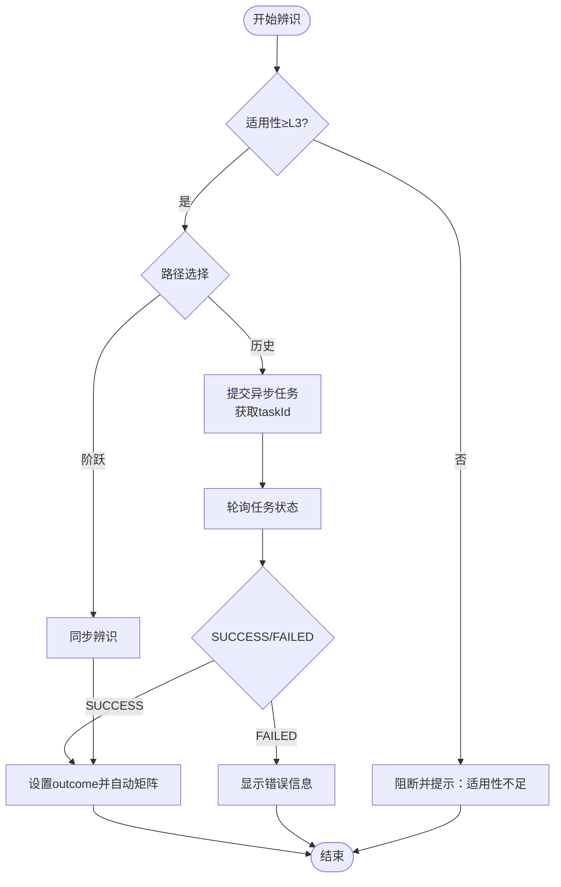
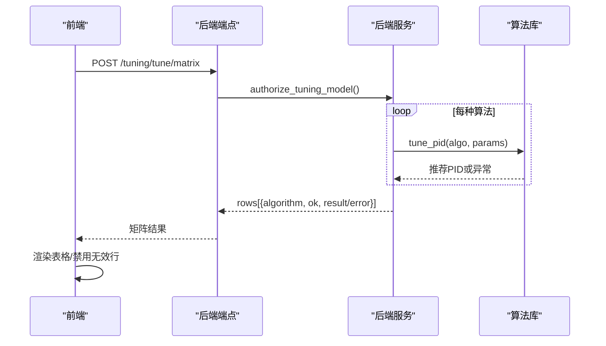
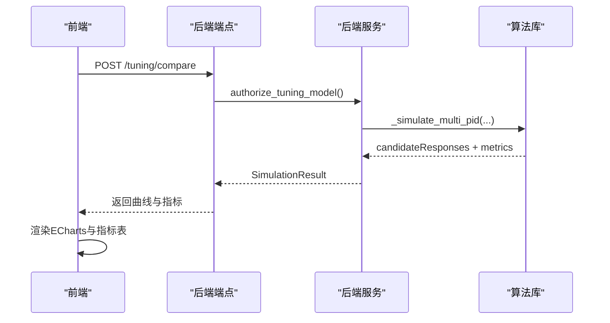
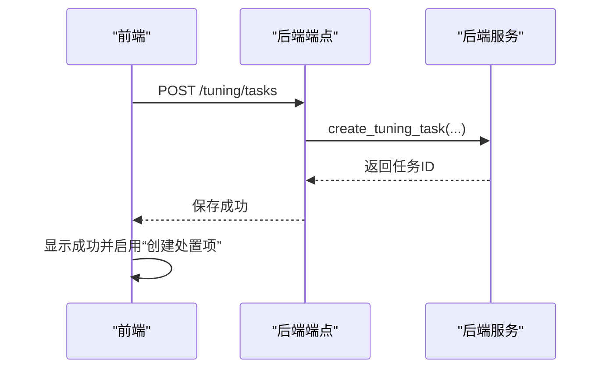
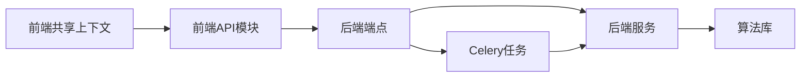

# 整定工作台流程

<cite>
**本文引用的文件**
- [workbench.vue](file://frontend/apps/web-antd/src/views/tuning/workbench.vue)
- [use-tuning-workbench.ts](file://frontend/apps/web-antd/src/views/tuning/composables/use-tuning-workbench.ts)
- [identify-section.vue](file://frontend/apps/web-antd/src/views/tuning/components/identify-section.vue)
- [matrix-section.vue](file://frontend/apps/web-antd/src/views/tuning/components/matrix-section.vue)
- [simulate-section.vue](file://frontend/apps/web-antd/src/views/tuning/components/simulate-section.vue)
- [confirm-section.vue](file://frontend/apps/web-antd/src/views/tuning/components/confirm-section.vue)
- [tuning.py（端点）](file://backend/app/api/v1/endpoints/tuning.py)
- [tuning.py（服务）](file://backend/app/services/tuning.py)
- [tuning_algorithms.py](file://backend/app/services/tuning_algorithms.py)
- [tasks/tuning.py](file://backend/app/tasks/tuning.py)
</cite>

## 目录
1. [简介](#简介)
2. [项目结构](#项目结构)
3. [核心组件](#核心组件)
4. [架构总览](#架构总览)
5. [详细组件分析](#详细组件分析)
6. [依赖关系分析](#依赖关系分析)
7. [性能考虑](#性能考虑)
8. [故障排查指南](#故障排查指南)
9. [结论](#结论)

## 简介
本文件面向“整定工作台”的端到端用户旅程，围绕单页四锚点工作流“辨识→矩阵→仿真→确认”，系统化说明：
- 每个步骤的状态管理、数据流转与用户交互逻辑
- 适用性门禁检查机制（L3以下入口disabled）、错误码处理与用户提示
- 前端组件状态同步、后端服务调用时序与异常处理策略
- 完整的API调用序列图与错误处理流程图

该工作流通过前端共享上下文（composable）串联四个锚点组件，后端提供辨识、矩阵、仿真、保存等接口，并通过Celery异步任务支撑历史辨识与长耗时计算。

## 项目结构
整定工作台由前端页面容器与四个锚点组件构成，核心状态集中在跨锚点共享的composable中；后端以FastAPI端点暴露能力，服务层封装业务逻辑，Celery任务承担异步计算。

图表来源
- [workbench.vue:138-143](file://frontend/apps/web-antd/src/views/tuning/workbench.vue#L138-L143)
- [use-tuning-workbench.ts:94-126](file://frontend/apps/web-antd/src/views/tuning/composables/use-tuning-workbench.ts#L94-L126)
- [tuning.py（端点）:150-242](file://backend/app/api/v1/endpoints/tuning.py#L150-L242)
- [tuning.py（服务）:104-297](file://backend/app/services/tuning.py#L104-L297)
- [tuning_algorithms.py:679-724](file://backend/app/services/tuning_algorithms.py#L679-L724)
- [tasks/tuning.py:358-404](file://backend/app/tasks/tuning.py#L358-L404)

章节来源
- [workbench.vue:138-143](file://frontend/apps/web-antd/src/views/tuning/workbench.vue#L138-L143)
- [use-tuning-workbench.ts:94-126](file://frontend/apps/web-antd/src/views/tuning/composables/use-tuning-workbench.ts#L94-L126)

## 核心组件
- 页面容器 workbench.vue：负责装置树、回路清单、建议列表加载；路由参数预填；四锚点导航与诊断基线展示；入口门禁（L0/L1阻止，L2提示）。
- 共享上下文 use-tuning-workbench.ts：维护全局状态（loopId、currentPid、fitnessLevel/tags、各阶段进度与结果），实现辨识、矩阵、仿真、保存的主流程与门禁计算（canTune/canSimulate/canConfirm）。
- 锚点组件：
  - identify-section.vue：选择时间窗与路径（历史/阶跃），触发辨识并展示结果卡、可信度徽标、D/E级警示。
  - matrix-section.vue：展示算法矩阵行（含当前PID对照），支持参数微调与单行重算，限制勾选数量。
  - simulate-section.vue：基于选定候选组执行多PID对比仿真，渲染曲线与指标表。
  - confirm-section.vue：选择最终方案并保存，跳转处置模块创建闭环项。

章节来源
- [workbench.vue:95-130](file://frontend/apps/web-antd/src/views/tuning/workbench.vue#L95-L130)
- [use-tuning-workbench.ts:205-232](file://frontend/apps/web-antd/src/views/tuning/composables/use-tuning-workbench.ts#L205-L232)
- [identify-section.vue:78-88](file://frontend/apps/web-antd/src/views/tuning/components/identify-section.vue#L78-L88)
- [matrix-section.vue:65-69](file://frontend/apps/web-antd/src/views/tuning/components/matrix-section.vue#L65-L69)
- [simulate-section.vue:111-114](file://frontend/apps/web-antd/src/views/tuning/components/simulate-section.vue#L111-L114)
- [confirm-section.vue:26-46](file://frontend/apps/web-antd/src/views/tuning/components/confirm-section.vue#L26-L46)

## 架构总览
整定工作台采用“前端共享状态 + 后端分层服务 + 异步任务”的架构：
- 前端：单一页面四锚点，状态集中管理，按钮禁用/启用由门禁计算属性驱动。
- 后端：端点负责鉴权、参数校验、门禁拦截；服务层完成模型授权、算法调用、仿真计算；Celery任务承载历史辨识与整定仿真长耗时流程。
- 数据流：前端发起请求 → 端点校验 → 服务层执行业务 → 任务异步推进 → 前端轮询/回调更新UI。

图表来源
- [tuning.py（端点）:181-242](file://backend/app/api/v1/endpoints/tuning.py#L181-L242)
- [tuning.py（服务）:645-737](file://backend/app/services/tuning.py#L645-L737)
- [tasks/tuning.py:358-404](file://backend/app/tasks/tuning.py#L358-L404)
- [use-tuning-workbench.ts:324-372](file://frontend/apps/web-antd/src/views/tuning/composables/use-tuning-workbench.ts#L324-L372)

## 详细组件分析

### ① 过程辨识（历史/阶跃双路径）
- 用户交互：选择时间窗与路径（默认历史），点击“开始辨识”。
- 状态管理：identifying/identifyProgress/identifyStage/identifyTaskId/outcome/identifyError。
- 数据流转：
  - 历史路径：POST /tuning/identify/history → 返回taskId → 轮询 /tuning/tasks/{taskId}/status → 成功时设置outcome并自动触发矩阵。
  - 阶跃路径：POST /tuning/identify → 同步返回模型参数与recordId。
- 门禁与提示：
  - 入口按钮受tuningDisabled控制（L0/L1禁用），Tooltip显示原因；L2条件异常弹出warning Toast。
  - 后端对L3以下直接抛出ERR_TUNING_FITNESS_INSUFFICIENT。
- 错误处理：识别失败或数据不足时设置identifyError；D/E级置信度在界面给出警示并禁止下游。

图表来源
- [use-tuning-workbench.ts:291-372](file://frontend/apps/web-antd/src/views/tuning/composables/use-tuning-workbench.ts#L291-L372)
- [tuning.py（端点）:150-242](file://backend/app/api/v1/endpoints/tuning.py#L150-L242)
- [tuning.py（服务）:645-737](file://backend/app/services/tuning.py#L645-L737)
- [tasks/tuning.py:154-355](file://backend/app/tasks/tuning.py#L154-L355)

章节来源
- [identify-section.vue:78-88](file://frontend/apps/web-antd/src/views/tuning/components/identify-section.vue#L78-L88)
- [use-tuning-workbench.ts:291-372](file://frontend/apps/web-antd/src/views/tuning/composables/use-tuning-workbench.ts#L291-L372)
- [tuning.py（端点）:150-242](file://backend/app/api/v1/endpoints/tuning.py#L150-L242)

### ② 整定矩阵（全算法对比）
- 用户交互：展示5种算法+手动整定行，支持参数微调与单行重算；最多勾选5组进入仿真。
- 状态管理：matrixRows/matrixLoading/matrixError/currentPidMissing。
- 数据流转：
  - 调用 /tuning/tune/matrix 一次性计算多算法推荐PID；首行固定当前PID对照（来自回路详情）。
  - 单行重算调用 /tune（单算法），传入算法特定参数（如lambdaRatio/tauCRatio）。
- 门禁与提示：
  - canTune依赖outcome且非D/E级，同时受L0/L1门禁限制。
  - currentPidMissing时给出警告并禁用确认区。
- 错误处理：单算法失败不阻断矩阵其余行，行内显示错误提示。

图表来源
- [tuning.py（端点）:319-358](file://backend/app/api/v1/endpoints/tuning.py#L319-L358)
- [tuning.py（服务）:104-297](file://backend/app/services/tuning.py#L104-L297)
- [matrix-section.vue:65-69](file://frontend/apps/web-antd/src/views/tuning/components/matrix-section.vue#L65-L69)
- [use-tuning-workbench.ts:374-467](file://frontend/apps/web-antd/src/views/tuning/composables/use-tuning-workbench.ts#L374-L467)

章节来源
- [matrix-section.vue:65-69](file://frontend/apps/web-antd/src/views/tuning/components/matrix-section.vue#L65-L69)
- [use-tuning-workbench.ts:374-467](file://frontend/apps/web-antd/src/views/tuning/composables/use-tuning-workbench.ts#L374-L467)
- [tuning.py（端点）:319-358](file://backend/app/api/v1/endpoints/tuning.py#L319-L358)

### ③ 仿真对比（多PID叠加）
- 用户交互：勾选1~5组推荐参数，点击“开始仿真”。
- 状态管理：simulating/simResult/simCandidates/simError/finalLabel。
- 数据流转：
  - 调用 /tuning/compare 进行多PID对比仿真，返回candidateResponses（每条PID的响应曲线与指标）。
  - 前端使用ECharts渲染叠加曲线（当前=灰，推荐组按序取色）与指标表。
- 门禁与提示：
  - canSimulate要求canTune且至少1组有效勾选且不超上限。
  - L0/L1硬拦截；L2弹出warning Toast。
- 错误处理：仿真失败设置simError；未满足条件时提示先勾选。

图表来源
- [tuning.py（端点）:405-448](file://backend/app/api/v1/endpoints/tuning.py#L405-L448)
- [tuning_algorithms.py:679-724](file://backend/app/services/tuning_algorithms.py#L679-L724)
- [simulate-section.vue:46-82](file://frontend/apps/web-antd/src/views/tuning/components/simulate-section.vue#L46-L82)
- [use-tuning-workbench.ts:476-533](file://frontend/apps/web-antd/src/views/tuning/composables/use-tuning-workbench.ts#L476-L533)

章节来源
- [simulate-section.vue:111-114](file://frontend/apps/web-antd/src/views/tuning/components/simulate-section.vue#L111-L114)
- [use-tuning-workbench.ts:476-533](file://frontend/apps/web-antd/src/views/tuning/composables/use-tuning-workbench.ts#L476-L533)
- [tuning.py（端点）:405-448](file://backend/app/api/v1/endpoints/tuning.py#L405-L448)

### ④ 方案确认（保存与闭环）
- 用户交互：从仿真候选中选择最终方案，点击“保存方案”，成功后可跳转处置模块创建闭环项。
- 状态管理：finalLabel/saving/savedRecordId。
- 数据流转：
  - 调用 /tuning/tasks 保存整定任务（SIMULATED），携带模型、算法、推荐PID、仿真结果等元数据。
  - 成功后记录savedRecordId，并引导跳转 /handling?create=tuning&loopId=xx&tuningRecordId=xx。
- 门禁与提示：
  - canConfirm要求有仿真结果且已选择最终方案且未保存中。
  - 保存失败提示错误；成功提示并允许创建处置项。

图表来源
- [tuning.py（端点）:602-643](file://backend/app/api/v1/endpoints/tuning.py#L602-L643)
- [confirm-section.vue:26-46](file://frontend/apps/web-antd/src/views/tuning/components/confirm-section.vue#L26-L46)
- [use-tuning-workbench.ts:535-572](file://frontend/apps/web-antd/src/views/tuning/composables/use-tuning-workbench.ts#L535-L572)

章节来源
- [confirm-section.vue:26-46](file://frontend/apps/web-antd/src/views/tuning/components/confirm-section.vue#L26-L46)
- [use-tuning-workbench.ts:535-572](file://frontend/apps/web-antd/src/views/tuning/composables/use-tuning-workbench.ts#L535-L572)
- [tuning.py（端点）:602-643](file://backend/app/api/v1/endpoints/tuning.py#L602-L643)

## 依赖关系分析
- 前端依赖：
  - workbench.vue 依赖四个锚点组件与共享上下文；各锚点通过ctx访问状态与方法。
  - 共享上下文依赖API模块（loop/tuning/handling/diagnosis）与常量配置。
- 后端依赖：
  - 端点依赖服务层与权限/数据库依赖；服务层依赖算法库与数据源（DataPlanner/TDengine）。
  - Celery任务依赖服务层进度与持久化（TuningRecord/process_model_version）。
- 耦合与解耦：
  - 前后端通过REST API解耦；异步任务通过Redis进度桥接前后端状态。
  - 服务层通过authorize_tuning_model统一模型来源与可信度校验，避免裸参数绕过。

图表来源
- [use-tuning-workbench.ts:14-23](file://frontend/apps/web-antd/src/views/tuning/composables/use-tuning-workbench.ts#L14-L23)
- [tuning.py（端点）:27-85](file://backend/app/api/v1/endpoints/tuning.py#L27-L85)
- [tuning.py（服务）:25-46](file://backend/app/services/tuning.py#L25-L46)
- [tasks/tuning.py:16-34](file://backend/app/tasks/tuning.py#L16-L34)

章节来源
- [use-tuning-workbench.ts:14-23](file://frontend/apps/web-antd/src/views/tuning/composables/use-tuning-workbench.ts#L14-L23)
- [tuning.py（端点）:27-85](file://backend/app/api/v1/endpoints/tuning.py#L27-L85)

## 性能考虑
- 前端：
  - 并行拉取回路详情与fitness，减少首屏等待。
  - 矩阵行重算仅针对单行，避免全量刷新。
  - ECharts渲染仅在结果变化时触发，避免频繁重绘。
- 后端：
  - 历史辨识走异步任务，前端轮询进度，避免阻塞HTTP连接。
  - 矩阵计算一次调用多算法，减少往返次数。
  - DataPlanner复用缓存与批量查询，降低TDengine压力。
- 建议：
  - 对大窗口历史数据辨识增加超时与取消能力。
  - 对仿真曲线长度做采样或分段渲染，提升前端性能。

## 故障排查指南
- 适用性门禁阻断（L0/L1/L2）：
  - 现象：入口按钮disabled或弹出error/warning；后端返回ERR_TUNING_FITNESS_INSUFFICIENT。
  - 排查：检查getLoopMonitorListApi返回的fitnessLevel与tags；修正控制状态后再试。
- 辨识失败：
  - 现象：identifyError显示“数据不足或激励不足”；任务状态FAILED。
  - 排查：调整时间窗或更换路径（历史/阶跃）；查看后端日志中的reason。
- 矩阵计算部分失败：
  - 现象：某行显示“计算失败”；其他行正常。
  - 排查：检查该行算法参数是否合理；尝试单行重算。
- 仿真失败：
  - 现象：simError提示“仿真失败”；无曲线与指标。
  - 排查：确认已勾选有效候选组；检查模型参数与PID合理性。
- 保存失败：
  - 现象：保存按钮不可用或报错。
  - 排查：确认已选择最终方案；检查后端返回的错误码（如参数缺失）。

章节来源
- [tuning.py（端点）:97-128](file://backend/app/api/v1/endpoints/tuning.py#L97-L128)
- [use-tuning-workbench.ts:128-203](file://frontend/apps/web-antd/src/views/tuning/composables/use-tuning-workbench.ts#L128-L203)
- [tasks/tuning.py:192-216](file://backend/app/tasks/tuning.py#L192-L216)

## 结论
整定工作台通过单页四锚点设计，将“辨识→矩阵→仿真→确认”流程紧密串联，结合前端门禁与后端L3以下阻断，确保整定建议在合适的数据与控制条件下进行。异步任务与进度轮询提升了用户体验，而统一的模型授权与错误码体系保障了流程的可控性与可追溯性。后续可进一步优化大数据量下的渲染与计算性能，并增强用户引导与错误自愈能力。