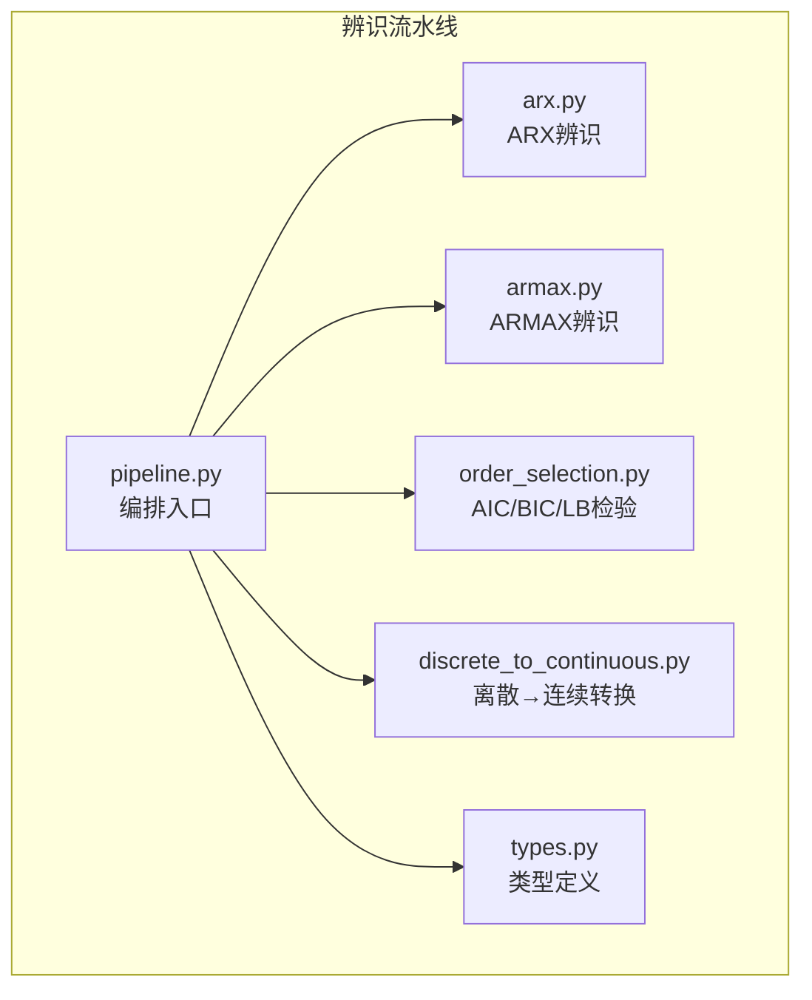
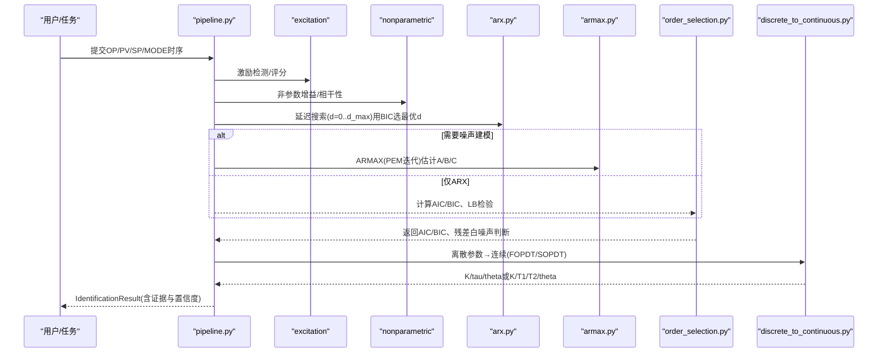
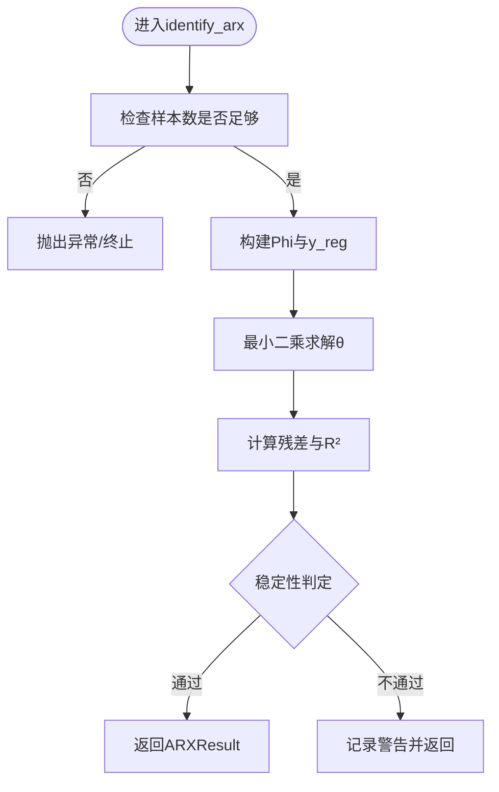
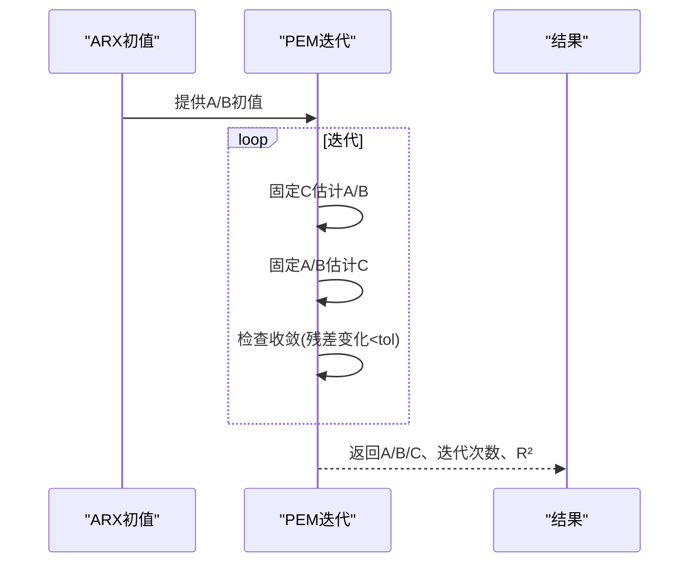
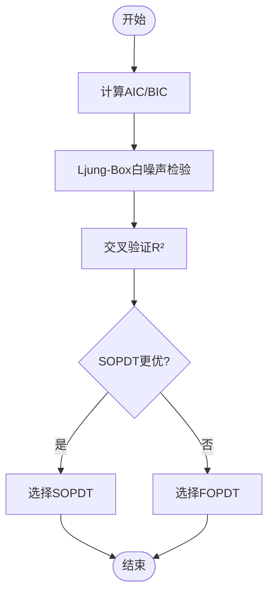
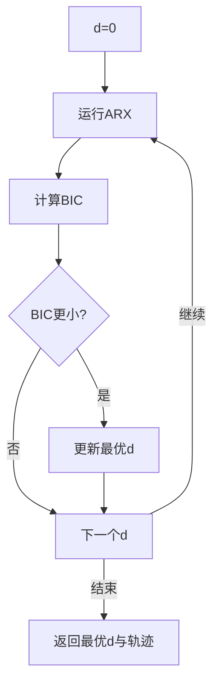
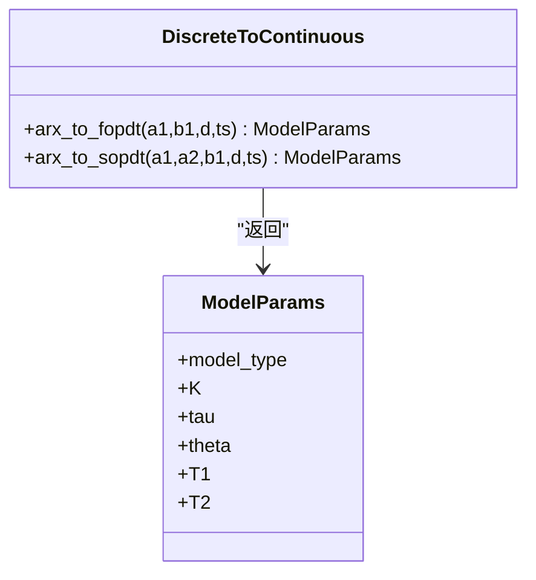
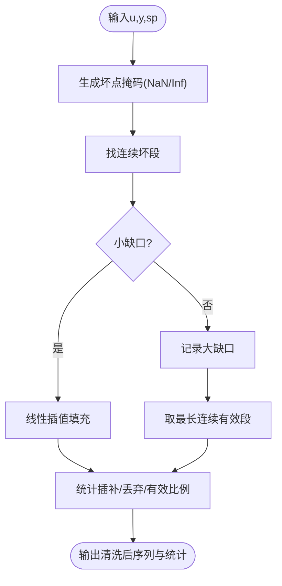
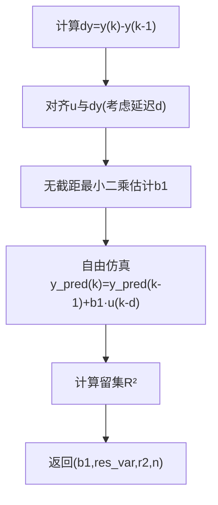
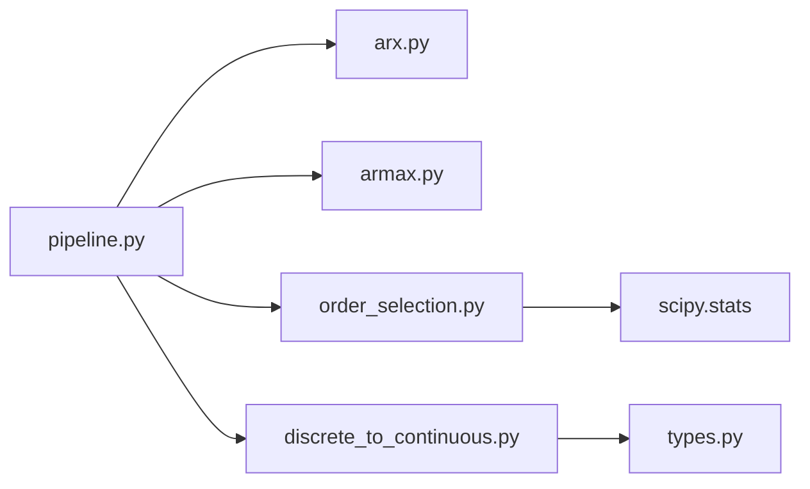

# ARX/ARMAX辨识算法

<cite>
**本文引用的文件**
- [arx.py](file://backend/app/services/tuning_identification/arx.py)
- [armax.py](file://backend/app/services/tuning_identification/armax.py)
- [order_selection.py](file://backend/app/services/tuning_identification/order_selection.py)
- [pipeline.py](file://backend/app/services/tuning_identification/pipeline.py)
- [discrete_to_continuous.py](file://backend/app/services/tuning_identification/discrete_to_continuous.py)
- [types.py](file://backend/app/services/tuning_identification/types.py)
- [test_tuning_identification.py](file://backend/tests/test_tuning_identification.py)
</cite>

## 目录
1. [简介](#简介)
2. [项目结构](#项目结构)
3. [核心组件](#核心组件)
4. [架构总览](#架构总览)
5. [详细组件分析](#详细组件分析)
6. [依赖关系分析](#依赖关系分析)
7. [性能与调优建议](#性能与调优建议)
8. [故障排查指南](#故障排查指南)
9. [结论](#结论)
10. [附录](#附录)

## 简介
本技术文档围绕ARX（自回归外生输入）与ARMAX（自回归移动平均外生输入）辨识算法，系统阐述其数学原理、参数估计方法、最小二乘实现、阶次选择策略（AIC/BIC）、信号预处理、离散到连续模型转换（FOPDT/SOPDT/IPDT自动识别），以及参数调优与性能优化建议。内容基于工程实现，确保可落地、可追溯。

## 项目结构
辨识相关代码位于后端服务模块的tuning_identification子系统中，采用分层组织：
- 层3：参数化辨识（ARX、ARMAX、IV等）
- 层4：阶次选择与模型择优（AIC/BIC、Ljung-Box、交叉验证、Occam削减）
- 层5：离散→连续参数转换（FOPDT/SOPDT）
- 层1/2：数据清洗、激励检测、非参数粗估、可信度评估
- 类型定义：统一的数据结构与模型枚举

**图表来源**
- [pipeline.py:1-50](file://backend/app/services/tuning_identification/pipeline.py#L1-L50)
- [arx.py:1-101](file://backend/app/services/tuning_identification/arx.py#L1-L101)
- [armax.py:1-200](file://backend/app/services/tuning_identification/armax.py#L1-L200)
- [order_selection.py:1-140](file://backend/app/services/tuning_identification/order_selection.py#L1-L140)
- [discrete_to_continuous.py:1-125](file://backend/app/services/tuning_identification/discrete_to_continuous.py#L1-L125)
- [types.py:1-200](file://backend/app/services/tuning_identification/types.py#L1-L200)

**章节来源**
- [pipeline.py:1-50](file://backend/app/services/tuning_identification/pipeline.py#L1-L50)

## 核心组件
- ARX辨识：线性最小二乘估计A(z⁻¹)、B(z⁻¹)，输出残差方差、R²、稳定性判定。
- ARMAX辨识：在ARX基础上引入C(z⁻¹)噪声项，使用迭代PEM（预测误差法）交替估计A/B与C直至收敛。
- 阶次选择：AIC/BIC信息准则、Ljung-Box白噪声检验、交叉验证R²、Occam削减（SOPDT升级条件）。
- 离散→连续转换：一阶转FOPDT（K、tau、theta），二阶转SOPDT（K、T1、T2、theta），含复极点/不稳定保护。
- 流水线编排：延迟搜索（BIC选d）、自由仿真留集评估、物理可行性检查、可信度综合评估。

**章节来源**
- [arx.py:21-101](file://backend/app/services/tuning_identification/arx.py#L21-L101)
- [order_selection.py:22-140](file://backend/app/services/tuning_identification/order_selection.py#L22-L140)
- [discrete_to_continuous.py:17-125](file://backend/app/services/tuning_identification/discrete_to_continuous.py#L17-L125)
- [pipeline.py:823-999](file://backend/app/services/tuning_identification/pipeline.py#L823-L999)

## 架构总览
辨识流水线从历史OP/PV序列出发，执行激励检测→非参数粗估→参数化辨识（ARX/ARMAX/IV）→阶次选择→离散→连续转换→可信度评估，最终输出模型参数与证据链（AIC/BIC/R²/合理性标记）。

**图表来源**
- [pipeline.py:1-50](file://backend/app/services/tuning_identification/pipeline.py#L1-L50)
- [pipeline.py:823-999](file://backend/app/services/tuning_identification/pipeline.py#L823-L999)
- [order_selection.py:35-140](file://backend/app/services/tuning_identification/order_selection.py#L35-L140)
- [discrete_to_continuous.py:17-125](file://backend/app/services/tuning_identification/discrete_to_continuous.py#L17-L125)

## 详细组件分析

### ARX辨识（最小二乘）
- 模型形式：A(z⁻¹)y(t) = B(z⁻¹)u(t-d) + e(t)
- 估计方法：构造回归矩阵Phi与目标向量y_reg，使用最小二乘解析解θ=(ΦᵀΦ)⁻¹Φᵀy_reg
- 输出：A/B系数、纯滞后d、残差方差、样本数、R²；提供稳定性判定（一阶a1<0稳定，高阶简化判据）
- 复杂度：构建Phi为O(n·(na+nb))，最小二乘求解主要成本在矩阵运算

**图表来源**
- [arx.py:41-101](file://backend/app/services/tuning_identification/arx.py#L41-L101)

**章节来源**
- [arx.py:21-101](file://backend/app/services/tuning_identification/arx.py#L21-L101)

### ARMAX辨识（PEM迭代）
- 模型形式：A(z⁻¹)y(t) = B(z⁻¹)u(t-d) + C(z⁻¹)e(t)
- 估计方法：以ARX结果为初值，固定C估计A/B，固定A/B估计C，交替迭代至收敛（最大迭代次数与容差控制）
- 适用场景：噪声有色时提升拟合质量；测试覆盖返回系数长度、迭代次数、R²比较等

**图表来源**
- [armax.py:1-200](file://backend/app/services/tuning_identification/armax.py#L1-L200)
- [test_tuning_identification.py:480-511](file://backend/tests/test_tuning_identification.py#L480-L511)

**章节来源**
- [armax.py:1-200](file://backend/app/services/tuning_identification/armax.py#L1-L200)
- [test_tuning_identification.py:480-511](file://backend/tests/test_tuning_identification.py#L480-L511)

### 阶次选择与模型择优（AIC/BIC、LB检验、交叉验证、Occam）
- AIC/BIC：基于残差方差与参数个数惩罚，越小越优；用于延迟d搜索与模型比较
- Ljung-Box Q检验：对残差进行白噪声检验，p>0.05认为模型充分
- 交叉验证：前70%训练、后30%验证，计算自由仿真R²评估泛化能力
- Occam削减：SOPDT优于FOPDT需满足R²相对提升>5%且BIC下降

**图表来源**
- [order_selection.py:35-140](file://backend/app/services/tuning_identification/order_selection.py#L35-L140)
- [pipeline.py:543-563](file://backend/app/services/tuning_identification/pipeline.py#L543-L563)

**章节来源**
- [order_selection.py:22-140](file://backend/app/services/tuning_identification/order_selection.py#L22-L140)
- [pipeline.py:543-563](file://backend/app/services/tuning_identification/pipeline.py#L543-L563)

### 延迟搜索与自由仿真评估
- 延迟搜索：对d=0..d_max运行ARX，按BIC选择最优d，记录搜索轨迹供审计
- 自由仿真：用预测输出反馈计算留出集R²，避免方程误差偏乐观

**图表来源**
- [pipeline.py:823-862](file://backend/app/services/tuning_identification/pipeline.py#L823-L862)
- [pipeline.py:865-917](file://backend/app/services/tuning_identification/pipeline.py#L865-L917)

**章节来源**
- [pipeline.py:823-917](file://backend/app/services/tuning_identification/pipeline.py#L823-L917)

### 离散→连续模型转换（FOPDT/SOPDT）
- FOPDT：由一阶ARX(a1,b1,d,ts)得K=b1/(1+a1)、tau=-ts/ln(-a1)、theta=d·ts；要求a1<0稳定
- SOPDT：由二阶ARX(a1,a2,b1,d,ts)求离散极点p1,p2，映射到连续s_i=ln(p_i)/ts，T_i=-1/s_i；要求实极点且稳定，复极点拒绝
- 保护：零增益、发散、不稳定均抛异常，保证后续整定安全

**图表来源**
- [discrete_to_continuous.py:17-125](file://backend/app/services/tuning_identification/discrete_to_continuous.py#L17-L125)
- [types.py:1-200](file://backend/app/services/tuning_identification/types.py#L1-L200)

**章节来源**
- [discrete_to_continuous.py:17-125](file://backend/app/services/tuning_identification/discrete_to_continuous.py#L17-L125)

### 信号预处理（坏点清洗与插值）
- 小缺口线性插值：连续坏点小于阈值且两端有效则插补
- 大缺口切分：取最长连续有效段，统计原始点数、插补点数、丢弃点数、有效比例
- 目的：保证辨识所需配对时序的质量与连续性

**图表来源**
- [pipeline.py:93-199](file://backend/app/services/tuning_identification/pipeline.py#L93-L199)

**章节来源**
- [pipeline.py:93-199](file://backend/app/services/tuning_identification/pipeline.py#L93-L199)

### IPDT识别（积分过程）
- 差分线性回归：dy(k)=b1·u(k-d)，无截距最小二乘估计b1=K·ts
- 自由仿真：积分累积预测，严格检验K偏差导致的漂移
- 用途：作为IPDT模型的候选识别路径

**图表来源**
- [pipeline.py:920-997](file://backend/app/services/tuning_identification/pipeline.py#L920-L997)

**章节来源**
- [pipeline.py:920-997](file://backend/app/services/tuning_identification/pipeline.py#L920-L997)

## 依赖关系分析
- pipeline.py聚合多个子模块：ARX/ARMAX辨识、阶次选择、离散→连续转换、激励与非参数分析、物理可行性检查
- order_selection.py依赖scipy.stats进行LB检验
- discrete_to_continuous.py依赖types.py中的ModelParams与ModelType
- 测试用例覆盖ARMAX行为、FOPDT/SOPDT/IPDT边界条件

**图表来源**
- [pipeline.py:1-50](file://backend/app/services/tuning_identification/pipeline.py#L1-L50)
- [order_selection.py:1-140](file://backend/app/services/tuning_identification/order_selection.py#L1-L140)
- [discrete_to_continuous.py:1-125](file://backend/app/services/tuning_identification/discrete_to_continuous.py#L1-L125)

**章节来源**
- [pipeline.py:1-50](file://backend/app/services/tuning_identification/pipeline.py#L1-L50)

## 性能与调优建议
- 数据准备
  - 确保采样时间ts一致，去均值后再做回归，减少常数项影响
  - 坏点清洗优先，避免NaN/Inf污染Phi矩阵
- 阶次与延迟
  - 先通过BIC搜索最优d，再在na、nb范围内扫描；优先尝试低阶模型（Occam原则）
  - 若LB检验p值偏低，考虑增加nc（ARMAX）或提高na/nb
- 数值稳定
  - 避免近奇异Phi（输入激励不足会导致病态），必要时增加PRBS或阶跃激励
  - 对SOPDT转换，复极点直接拒绝，改用FOPDT或振荡模型
- 验证与可信度
  - 使用自由仿真R²与交叉验证R²双重评估，避免过拟合
  - 结合非参数增益一致性检查（符号与量级），防止参数化模型误判

[本节为通用指导，不直接分析具体文件]

## 故障排查指南
- 数据不足
  - ARX要求至少max(na, nb+d)+10个样本；不足将抛出异常，需延长采集或降低阶次
- 数值异常
  - 1+a1接近零导致K发散；ln(-a1)接近零导致tau发散；复极点导致SOPDT转换失败
- 模型不稳定
  - a1≥0或连续极点非负，均视为不稳定，需检查激励或重新估计
- 拟合不佳
  - 自由仿真R²显著低于训练R²，可能存在过拟合或噪声有色，考虑ARMAX或改进激励

**章节来源**
- [arx.py:65-101](file://backend/app/services/tuning_identification/arx.py#L65-L101)
- [discrete_to_continuous.py:32-107](file://backend/app/services/tuning_identification/discrete_to_continuous.py#L32-L107)
- [pipeline.py:823-917](file://backend/app/services/tuning_identification/pipeline.py#L823-L917)

## 结论
该辨识体系以ARX为基础，扩展至ARMAX以处理有色噪声；通过AIC/BIC与LB检验进行阶次与模型择优，并以自由仿真与交叉验证保障泛化能力；离散→连续转换提供FOPDT/SOPDT参数，支持后续整定。整体流程具备完善的异常保护与可信度评估，适用于工业控制回路的在线/离线辨识。

[本节为总结性内容，不直接分析具体文件]

## 附录
- 关键函数路径参考
  - ARX辨识：[arx.py:41-101](file://backend/app/services/tuning_identification/arx.py#L41-L101)
  - ARMAX辨识：[armax.py:1-200](file://backend/app/services/tuning_identification/armax.py#L1-L200)
  - AIC/BIC与LB检验：[order_selection.py:35-140](file://backend/app/services/tuning_identification/order_selection.py#L35-L140)
  - 延迟搜索与自由仿真：[pipeline.py:823-917](file://backend/app/services/tuning_identification/pipeline.py#L823-L917)
  - 离散→连续转换：[discrete_to_continuous.py:17-125](file://backend/app/services/tuning_identification/discrete_to_continuous.py#L17-L125)
  - 类型定义：[types.py:1-200](file://backend/app/services/tuning_identification/types.py#L1-L200)
  - 测试用例：[test_tuning_identification.py:480-511](file://backend/tests/test_tuning_identification.py#L480-L511)

[本节为索引性内容，不直接分析具体文件]