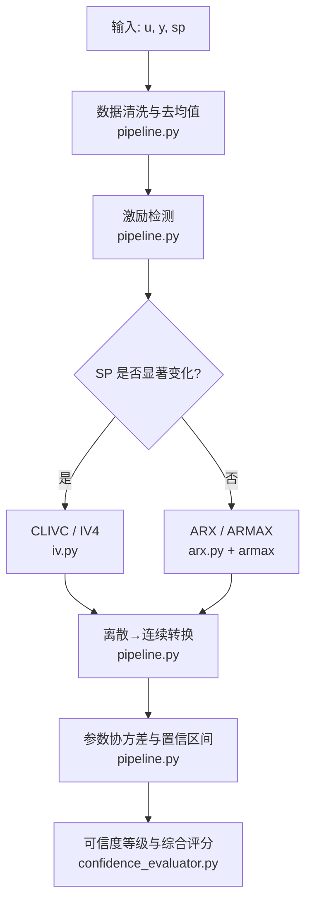
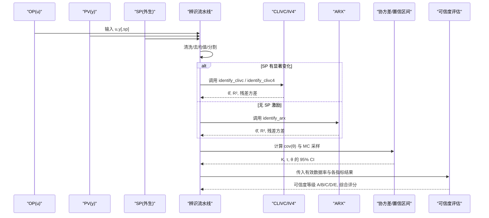
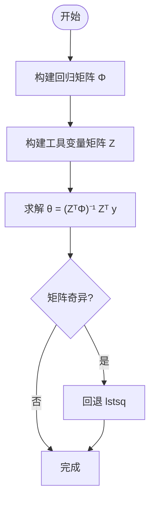
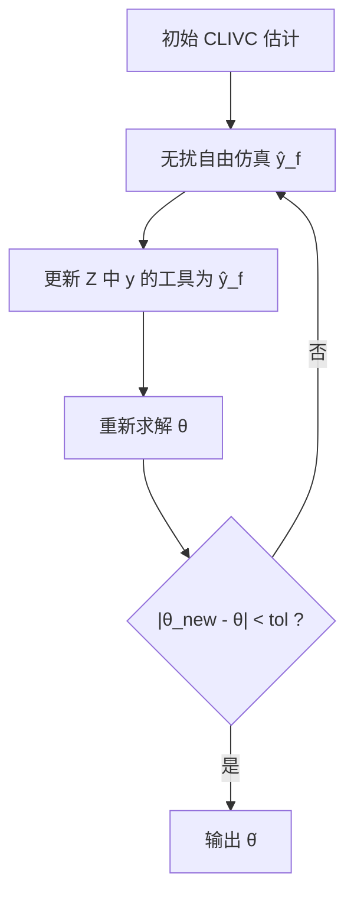
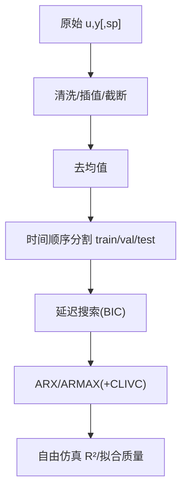
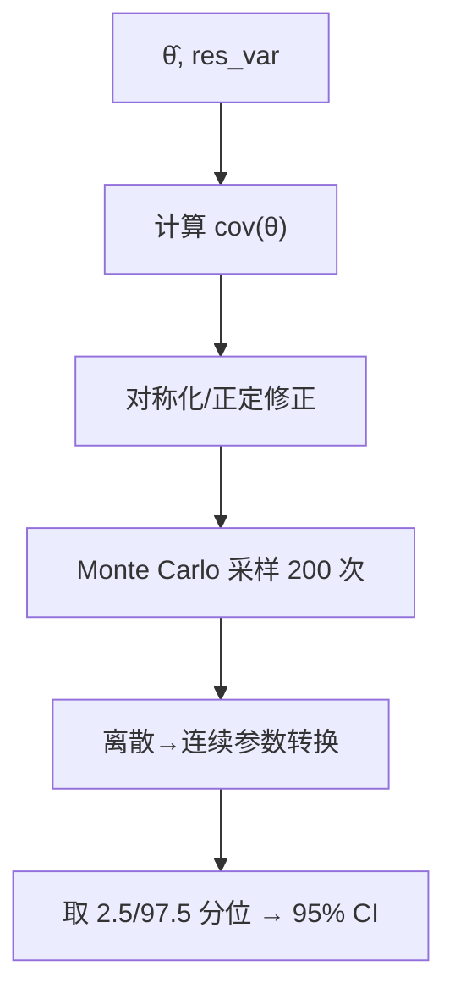
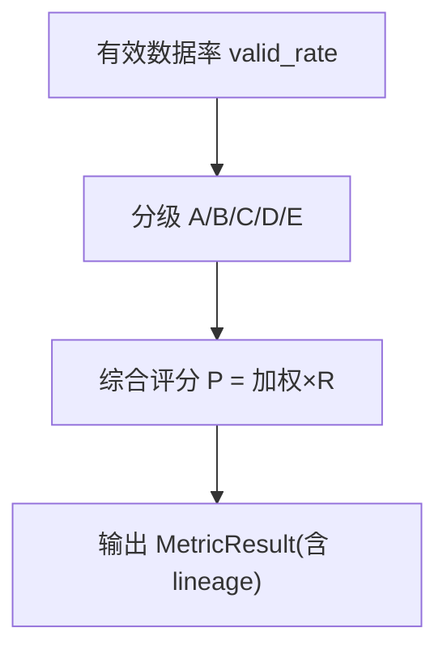
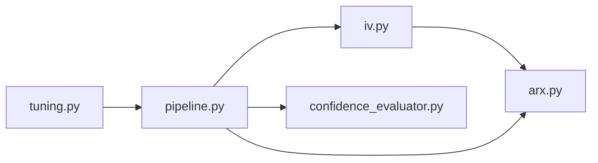

# IV辨识算法

<cite>
**本文引用的文件**
- [iv.py](file://backend/app/services/tuning_identification/iv.py)
- [pipeline.py](file://backend/app/services/tuning_identification/pipeline.py)
- [arx.py](file://backend/app/services/tuning_identification/arx.py)
- [confidence_evaluator.py](file://backend/app/services/confidence_evaluator.py)
- [tuning.py](file://backend/app/services/tuning.py)
- [test_tuning_identification.py](file://backend/tests/test_tuning_identification.py)
</cite>

## 目录
1. [简介](#简介)
2. [项目结构](#项目结构)
3. [核心组件](#核心组件)
4. [架构总览](#架构总览)
5. [详细组件分析](#详细组件分析)
6. [依赖关系分析](#依赖关系分析)
7. [性能与数值稳定性](#性能与数值稳定性)
8. [故障排查指南](#故障排查指南)
9. [结论](#结论)
10. [附录：与其他方法的对比与选用建议](#附录与其他方法的对比与选用建议)

## 简介
本技术文档围绕闭环控制系统中的工具变量（IV）辨识，重点阐述可证明闭环一致的 CLIVC 方法及其迭代精炼版本（IV4），并给出在工程流水线中的实现流程、置信度评估机制以及与 ARX/ARMAX 等方法的对比与选用原则。CLIVC 利用外生设定值 SP 作为工具变量源，满足 E[Z·ε]=0 的一致性条件，从而在闭环下消除 u 与扰动相关性导致的有偏估计问题；IV4 通过无扰自由仿真 ŷ_f 提升工具变量与回归量的相关性，进一步降低估计方差。

## 项目结构
- 辨识核心：iv.py 提供 CLIVC 与 IV4 的闭环一致估计；arx.py 提供 ARX 最小二乘基线；pipeline.py 将激励检测、数据清洗、训练/验证分割、延迟搜索、候选模型生成、协方差与置信区间计算串联为完整流水线。
- 可信度评估：confidence_evaluator.py 提供基于有效数据率的可信度等级判定、综合评分与阈值动态同步。
- 集成入口：tuning.py 标注 CLIVC 的生产就绪能力状态，并在整体调参与识别流程中启用。
- 测试支撑：test_tuning_identification.py 覆盖闭环仿真、激励检测、阶次选择、非参数粗估与端到端 pipeline 验证。

**图表来源**
- [pipeline.py:266-396](file://backend/app/services/tuning_identification/pipeline.py#L266-L396)
- [iv.py:41-211](file://backend/app/services/tuning_identification/iv.py#L41-L211)
- [arx.py:41-100](file://backend/app/services/tuning_identification/arx.py#L41-L100)
- [confidence_evaluator.py:165-221](file://backend/app/services/confidence_evaluator.py#L165-L221)

**章节来源**
- [pipeline.py:266-396](file://backend/app/services/tuning_identification/pipeline.py#L266-L396)
- [iv.py:1-211](file://backend/app/services/tuning_identification/iv.py#L1-L211)
- [arx.py:1-100](file://backend/app/services/tuning_identification/arx.py#L1-L100)
- [confidence_evaluator.py:165-221](file://backend/app/services/confidence_evaluator.py#L165-L221)

## 核心组件
- CLIVC 估计器：使用外生 SP 构造工具变量矩阵 Z，构建 Phi 与 Z 的正规方程求解 θ_IV，保证一致性。
- IV4 迭代器：以 CLIVC 初值为基础，用当前模型对 SP 做无扰自由仿真得到 ŷ_f，替换 y 的工具变量以提升效率，收敛后输出更稳定的估计。
- ARX 基线：最小二乘估计，用于初值、延迟搜索与对照比较。
- 流水线编排：负责数据清洗、去均值、训练/验证/测试分割、延迟搜索、候选模型生成、协方差与置信区间计算、可信度评估。
- 可信度评估：依据有效数据率划分 A/B/C/D/E 等级，并提供综合评分与阈值动态同步。

**章节来源**
- [iv.py:41-211](file://backend/app/services/tuning_identification/iv.py#L41-L211)
- [pipeline.py:680-789](file://backend/app/services/tuning_identification/pipeline.py#L680-L789)
- [confidence_evaluator.py:165-221](file://backend/app/services/confidence_evaluator.py#L165-L221)

## 架构总览
下图展示从原始序列到最终模型与置信度的端到端流程，包括闭环一致性的关键节点与置信区间传播。

**图表来源**
- [pipeline.py:266-396](file://backend/app/services/tuning_identification/pipeline.py#L266-L396)
- [iv.py:41-211](file://backend/app/services/tuning_identification/iv.py#L41-L211)
- [arx.py:41-100](file://backend/app/services/tuning_identification/arx.py#L41-L100)
- [pipeline.py:680-789](file://backend/app/services/tuning_identification/pipeline.py#L680-L789)
- [confidence_evaluator.py:165-221](file://backend/app/services/confidence_evaluator.py#L165-L221)

## 详细组件分析

### CLIVC 数学基础与一致性保证
- 闭环偏差来源：u(k)=C·[sp(k)−y(k)]，u 经 y 与扰动 ν 相关，导致 ARX 估计有偏。
- 工具变量构造：Z 中将内生量 -y(k-j) 替换为 -sp(k-j)，u(k-d-j) 替换为 sp(k-d-j)。由于 sp 外生于过程扰动，满足 E[Z·ε]=0，从而获得一致估计。
- 解法：θ_IV = (ZᵀΦ)⁻¹ Zᵀ y，若矩阵奇异则回退最小二乘近似。

**图表来源**
- [iv.py:41-119](file://backend/app/services/tuning_identification/iv.py#L41-L119)

**章节来源**
- [iv.py:41-119](file://backend/app/services/tuning_identification/iv.py#L41-L119)

### IV4 迭代精炼
- 动机：原始 CLIVC 使用 SP 作工具变量方差较大；用模型预测的无扰自由仿真 ŷ_f 替代 y 的工具变量，提高相关性，降低方差，同时保持一致性。
- 流程：初始 CLIVC → 用当前模型对 SP 做无扰自由仿真 → 更新 Z → 重新求解 → 收敛判断（参数相对变化 < tol）。

**图表来源**
- [iv.py:122-211](file://backend/app/services/tuning_identification/iv.py#L122-L211)
- [iv.py:214-243](file://backend/app/services/tuning_identification/iv.py#L214-L243)

**章节来源**
- [iv.py:122-211](file://backend/app/services/tuning_identification/iv.py#L122-L211)
- [iv.py:214-243](file://backend/app/services/tuning_identification/iv.py#L214-L243)

### 流水线中的数据分段与处理
- 数据清洗：小缺口线性插值，大缺口取最长连续段；清洗后统计有效点数，不足则中止。
- 去均值：u、y、sp 均去均值，避免偏置导致增益估计偏差。
- 训练/验证/测试分割：按时间顺序 60/20/20（短数据退化为 70/30），保留时序自相关。
- 延迟搜索：对 d=0..d_max 跑 ARX，用 BIC 选最优 d。
- 候选模型：总是运行 ARX/ARMAX；当 SP 有显著变化时加入 CLIVC，形成透明化对比集。

**图表来源**
- [pipeline.py:278-348](file://backend/app/services/tuning_identification/pipeline.py#L278-L348)
- [pipeline.py:386-446](file://backend/app/services/tuning_identification/pipeline.py#L386-L446)
- [pipeline.py:823-862](file://backend/app/services/tuning_identification/pipeline.py#L823-L862)

**章节来源**
- [pipeline.py:278-348](file://backend/app/services/tuning_identification/pipeline.py#L278-L348)
- [pipeline.py:386-446](file://backend/app/services/tuning_identification/pipeline.py#L386-L446)
- [pipeline.py:823-862](file://backend/app/services/tuning_identification/pipeline.py#L823-L862)

### 参数估计与协方差/置信区间
- ARX 协方差：cov(θ) = σ²·(ΦᵀΦ)⁻¹。
- CLIVC 协方差：cov(θ) = σ²·(ZᵀΦ)⁻¹·(ZᵀZ)·(ΦᵀZ)⁻¹。
- Monte Carlo 传播：从 N(θ̂, cov) 采样 200 次，转换为连续域参数（K, τ, θ），取 2.5/97.5 分位得 95% 置信区间。
- 数值稳定：对称化协方差矩阵，负特征值正则化，不稳定采样点跳过。

**图表来源**
- [pipeline.py:680-789](file://backend/app/services/tuning_identification/pipeline.py#L680-L789)

**章节来源**
- [pipeline.py:680-789](file://backend/app/services/tuning_identification/pipeline.py#L680-L789)

### 置信度评估机制
- 有效数据率分级：A≥0.95，B∈[0.80,0.95)，C∈[0.60,0.80)，D∈[0.20,0.60)，E<0.20（INCONCLUSIVE）。
- 综合评分：P = (A·a + F·f + S·s)/(a+f+s) × R，R 为有效自控率折扣因子；缺失或 E 级则整体 INCONCLUSIVE。
- 阈值动态同步：通过 Redis pub/sub 广播阈值更新，进程内缓存与兜底加载。

**图表来源**
- [confidence_evaluator.py:165-221](file://backend/app/services/confidence_evaluator.py#L165-L221)
- [confidence_evaluator.py:253-475](file://backend/app/services/confidence_evaluator.py#L253-L475)

**章节来源**
- [confidence_evaluator.py:165-221](file://backend/app/services/confidence_evaluator.py#L165-L221)
- [confidence_evaluator.py:253-475](file://backend/app/services/confidence_evaluator.py#L253-L475)

### 闭环反馈影响的处理与偏差消除
- 问题：闭环下 u 与扰动相关，直接最小二乘（ARX）产生有偏估计。
- 解决：CLIVC 用外生 SP 构造工具变量，满足 E[Z·ε]=0；IV4 用无扰仿真 ŷ_f 提升工具变量相关性，进一步降低方差。
- 实践要点：SP 需去均值；当 SP 无显著变化时不启用 CLIVC，退回 ARX/ARMAX 基线。

**章节来源**
- [iv.py:41-119](file://backend/app/services/tuning_identification/iv.py#L41-L119)
- [iv.py:122-211](file://backend/app/services/tuning_identification/iv.py#L122-L211)
- [pipeline.py:294-314](file://backend/app/services/tuning_identification/pipeline.py#L294-L314)

## 依赖关系分析
- iv.py 依赖 arx.py 提供 ARX 初值（早期原型中使用）；pipeline.py 统一调度 ARX/ARMAX/CLIVC，并负责协方差与置信区间计算。
- confidence_evaluator.py 独立于辨识模块，接收各指标结果进行可信度判定与综合评分。
- tuning.py 标记 CLIVC 生产就绪能力，驱动整体识别流程。

**图表来源**
- [iv.py:1-211](file://backend/app/services/tuning_identification/iv.py#L1-L211)
- [pipeline.py:386-446](file://backend/app/services/tuning_identification/pipeline.py#L386-L446)
- [confidence_evaluator.py:165-221](file://backend/app/services/confidence_evaluator.py#L165-L221)
- [tuning.py:230-233](file://backend/app/services/tuning.py#L230-L233)

**章节来源**
- [iv.py:1-211](file://backend/app/services/tuning_identification/iv.py#L1-L211)
- [pipeline.py:386-446](file://backend/app/services/tuning_identification/pipeline.py#L386-L446)
- [confidence_evaluator.py:165-221](file://backend/app/services/confidence_evaluator.py#L165-L221)
- [tuning.py:230-233](file://backend/app/services/tuning.py#L230-L233)

## 性能与数值稳定性
- 矩阵奇异回退：CLIVC/IV4 在求解失败时回退 lstsq，避免崩溃。
- 发散保护：IV4 无扰仿真中对不稳定模型进行截断，防止 NaN 污染工具变量。
- 协方差正定化：对称化与负特征值正则化，确保蒙特卡洛采样可行。
- 短数据退化：训练/验证分割在数据不足时退化为 70/30，保障基本辨识可用。

**章节来源**
- [iv.py:95-102](file://backend/app/services/tuning_identification/iv.py#L95-L102)
- [iv.py:238-243](file://backend/app/services/tuning_identification/iv.py#L238-L243)
- [pipeline.py:740-747](file://backend/app/services/tuning_identification/pipeline.py#L740-L747)
- [pipeline.py:334-348](file://backend/app/services/tuning_identification/pipeline.py#L334-L348)

## 故障排查指南
- 数据不足：当清洗后有效点数少于阈值（如 50）时，辨识中止；检查传感器完整性与通信中断。
- 矩阵奇异：CLIVC/IV4 求解失败会记录警告并回退；检查 SP 激励强度与去均值是否正确。
- 协方差不可逆：对称化与正则化仍失败时返回 None；考虑增加数据长度或调整模型阶次。
- 置信度 E 级：有效数据率过低导致 INCONCLUSIVE；需回溯数据质量与预处理策略。

**章节来源**
- [pipeline.py:278-292](file://backend/app/services/tuning_identification/pipeline.py#L278-L292)
- [iv.py:95-102](file://backend/app/services/tuning_identification/iv.py#L95-L102)
- [pipeline.py:740-747](file://backend/app/services/tuning_identification/pipeline.py#L740-L747)
- [confidence_evaluator.py:165-221](file://backend/app/services/confidence_evaluator.py#L165-L221)

## 结论
CLIVC 通过外生 SP 构造工具变量，在闭环下提供一致且无偏的过程辨识；IV4 借助无扰自由仿真进一步提升估计效率与稳定性。工程流水线将激励检测、数据清洗、延迟搜索、候选模型生成与置信区间计算整合，结合可信度评估形成闭环质量控制。对于存在 SP 激励的闭环历史数据，优先采用 CLIVC；在缺乏激励或数据质量较低时，ARX/ARMAX 作为基线与审计对照。

## 附录：与其他方法的对比与选用建议
- ARX：最小二乘，计算简单，但在闭环下有偏；适用于开环或激励充分且扰动与输入无关的场景。
- ARMAX：引入扰动建模，适合噪声结构复杂但仍有足够激励的数据。
- CLIVC：闭环一致，要求 SP 外生且有显著变化；推荐在闭环历史数据中优先使用。
- IV4：在 CLIVC 基础上提升效率，适合需要更高精度与更低方差的场景。

选用原则：
- 有 SP 激励且数据质量良好：首选 CLIVC/IV4。
- 无 SP 激励或激励不足：使用 ARX/ARMAX，并结合非参数粗估与相干性辅助门禁。
- 数据质量低（valid_rate 低）：先改善数据质量，否则结果可能落入 E 级（INCONCLUSIVE）。

**章节来源**
- [pipeline.py:386-446](file://backend/app/services/tuning_identification/pipeline.py#L386-L446)
- [confidence_evaluator.py:165-221](file://backend/app/services/confidence_evaluator.py#L165-L221)
- [test_tuning_identification.py:1-200](file://backend/tests/test_tuning_identification.py#L1-L200)