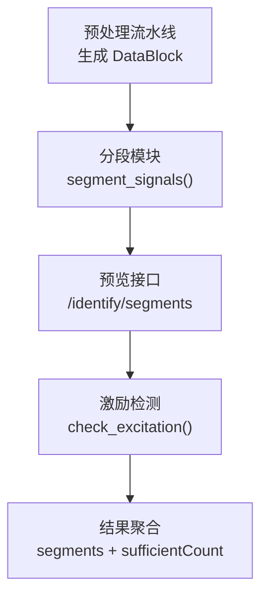
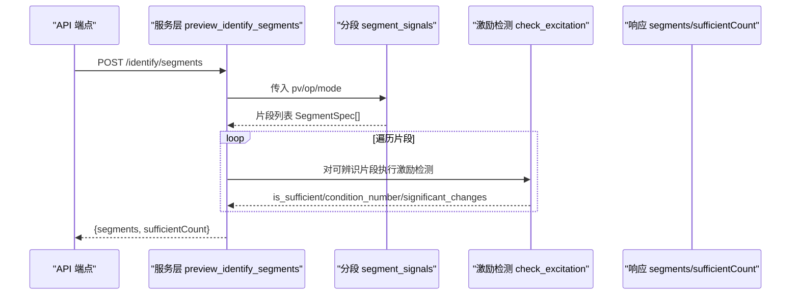
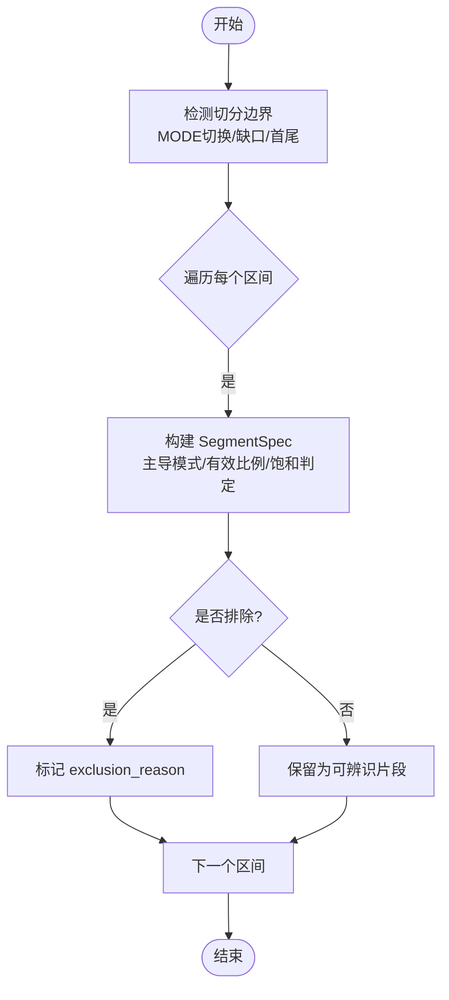
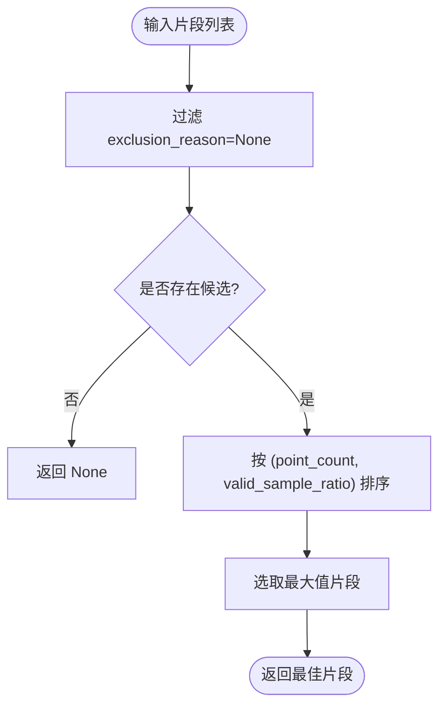
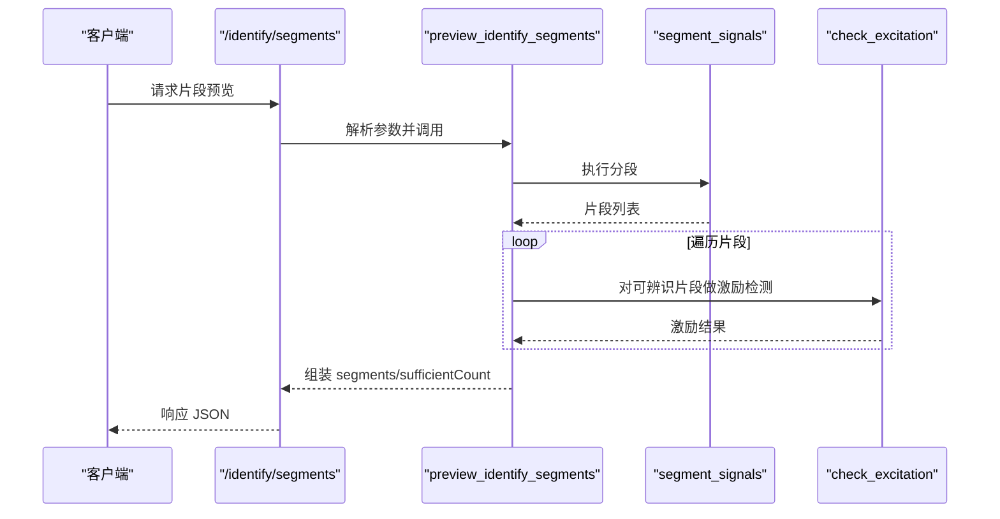
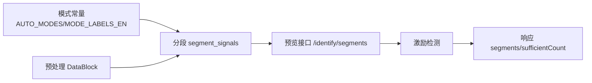

# 数据分段策略

<cite>
**本文引用的文件**
- [segmentation.py](file://backend/app/services/tuning_identification/segmentation.py)
- [test_tuning_segmentation.py](file://backend/tests/test_tuning_segmentation.py)
- [tuning.py](file://backend/app/services/tuning.py)
- [tuning.py（端点）](file://backend/app/api/v1/endpoints/tuning.py)
- [types.py](file://backend/app/services/tuning_identification/types.py)
- [pipeline.py（预处理）](file://backend/app/services/preprocessing/pipeline.py)
</cite>

## 目录
1. [引言](#引言)
2. [项目结构](#项目结构)
3. [核心组件](#核心组件)
4. [架构总览](#架构总览)
5. [详细组件分析](#详细组件分析)
6. [依赖关系分析](#依赖关系分析)
7. [性能考量](#性能考量)
8. [故障排查指南](#故障排查指南)
9. [结论](#结论)
10. [附录：工业过程配置建议与最佳实践](#附录工业过程配置建议与最佳实践)

## 引言
本技术文档围绕“数据分段策略”展开，聚焦于辨识前事件切片的质量控制与可辨识片段选择。其目标是：
- 解释为何需要对非线性系统、时变系统和多工况数据进行分段；
- 说明自动分段算法：基于模式切换、数据缺口与执行器饱和等事件边界的检测；
- 阐述分段质量控制：如何评估每个分段的代表性（有效样本比例、主导模式、激励充分性）；
- 提供分段合并策略与最优分段数确定思路；
- 给出面向不同工业过程的配置建议与最佳实践。

## 项目结构
与数据分段直接相关的代码主要位于后端服务层：
- 分段核心实现：按 MODE/缺口/饱和事件边界切分信号，生成 SegmentSpec 列表；
- 预览接口：对时间窗口执行分段与激励检测，返回可辨识片段清单；
- 类型定义：SegmentInfo、ExcitationCheckResult 等用于后续辨识流程；
- 预处理流水线：上游质量码识别与连续段索引，为分段提供输入基础。

图表来源
- [pipeline.py（预处理）:197-232](file://backend/app/services/preprocessing/pipeline.py#L197-L232)
- [segmentation.py:45-106](file://backend/app/services/tuning_identification/segmentation.py#L45-L106)
- [tuning.py（服务）:810-850](file://backend/app/services/tuning.py#L810-L850)
- [tuning.py（端点）:245-261](file://backend/app/api/v1/endpoints/tuning.py#L245-L261)

章节来源
- [segmentation.py:1-246](file://backend/app/services/tuning_identification/segmentation.py#L1-L246)
- [tuning.py（服务）:779-850](file://backend/app/services/tuning.py#L779-L850)
- [tuning.py（端点）:223-261](file://backend/app/api/v1/endpoints/tuning.py#L223-L261)
- [pipeline.py（预处理）:197-232](file://backend/app/services/preprocessing/pipeline.py#L197-L232)

## 核心组件
- 分段函数 segment_signals：按 MODE 切换、PV/OP 数据缺口、OP 饱和事件边界进行切分，输出 SegmentSpec 列表；
- 片段规格 SegmentSpec：包含起止索引、主导模式、是否自控、排除原因、有效样本比例、点数；
- 最佳片段选择 select_best_segment：从可辨识片段中挑选点数最多且有效样本比例最高的片段；
- 预览接口 /identify/segments：对给定时间窗执行分段与激励检测，返回片段清单与统计；
- 类型 SegmentInfo/ExcitationCheckResult：承载片段与激励检测结果，供后续辨识管线使用。

章节来源
- [segmentation.py:27-43](file://backend/app/services/tuning_identification/segmentation.py#L27-L43)
- [segmentation.py:45-106](file://backend/app/services/tuning_identification/segmentation.py#L45-L106)
- [segmentation.py:225-243](file://backend/app/services/tuning_identification/segmentation.py#L225-L243)
- [types.py:122-141](file://backend/app/services/tuning_identification/types.py#L122-L141)
- [tuning.py（端点）:245-261](file://backend/app/api/v1/endpoints/tuning.py#L245-L261)

## 架构总览
数据分段在辨识流水线中的位置如下：
- 上游预处理产出同轴后的 PV/OP/MODE 序列及有效性掩码；
- 分段模块依据事件边界切分为候选片段；
- 对每个候选片段执行激励检测，计算条件数与显著变化次数；
- 汇总片段清单、统计充分片段数量，并可选择最佳片段进入后续辨识。

图表来源
- [tuning.py（端点）:245-261](file://backend/app/api/v1/endpoints/tuning.py#L245-L261)
- [tuning.py（服务）:810-850](file://backend/app/services/tuning.py#L810-L850)
- [segmentation.py:45-106](file://backend/app/services/tuning_identification/segmentation.py#L45-L106)

## 详细组件分析

### 分段算法：事件边界检测与片段标注
- 切分边界来源：
  - MODE 切换：将 NaN mode 视为与任何合法模式不同，触发切分；
  - 数据缺口：PV/OP 出现 NaN/inf 的起止点作为新段起点；
  - OP 饱和：当提供 op_min/op_max 时，若超过阈值比例的点贴近上下限，则标记为饱和段。
- 片段标注规则（优先级）：
  - MANUAL_MODE：手动模式片段不反映对象动态，予以排除；
  - DATA_GAP：有效样本比例低于阈值（默认 50%）的片段排除；
  - OP_SATURATION：阀门饱和段无调节动态，排除；
  - TOO_SHORT：点数不足（默认最小 50 点）排除；
  - None：可辨识片段。

图表来源
- [segmentation.py:109-146](file://backend/app/services/tuning_identification/segmentation.py#L109-L146)
- [segmentation.py:149-207](file://backend/app/services/tuning_identification/segmentation.py#L149-L207)
- [segmentation.py:210-223](file://backend/app/services/tuning_identification/segmentation.py#L210-L223)

章节来源
- [segmentation.py:45-106](file://backend/app/services/tuning_identification/segmentation.py#L45-L106)
- [segmentation.py:109-207](file://backend/app/services/tuning_identification/segmentation.py#L109-L207)
- [segmentation.py:210-223](file://backend/app/services/tuning_identification/segmentation.py#L210-L223)

### 最佳片段选择策略
- 仅考虑未被排除的可辨识片段；
- 优先选择点数最多的片段；
- 点数相同的情况下，选择有效样本比例更高的片段。

图表来源
- [segmentation.py:225-243](file://backend/app/services/tuning_identification/segmentation.py#L225-L243)

章节来源
- [segmentation.py:225-243](file://backend/app/services/tuning_identification/segmentation.py#L225-L243)

### 预览接口与激励检测集成
- 端点 /identify/segments 接收 loopId、startTime、endTime；
- 服务层获取预处理信号 pv/op/mode，调用分段函数得到片段；
- 对每个可辨识片段执行激励检测，计算 excitationScore、conditionNumber、isSufficient；
- 返回片段清单与 sufficientCount（充分激励片段数）。

图表来源
- [tuning.py（端点）:245-261](file://backend/app/api/v1/endpoints/tuning.py#L245-L261)
- [tuning.py（服务）:810-850](file://backend/app/services/tuning.py#L810-L850)

章节来源
- [tuning.py（端点）:245-261](file://backend/app/api/v1/endpoints/tuning.py#L245-L261)
- [tuning.py（服务）:810-850](file://backend/app/services/tuning.py#L810-L850)

### 数据类型与模型证据
- SegmentInfo：记录片段起止、主导模式与激励检测结果；
- ExcitationCheckResult：包含是否充分、显著变化次数、条件数、置信度等级；
- IdentificationResult：封装辨识成功与否、最佳模型、候选模型、片段集合与证据摘要。

章节来源
- [types.py:122-141](file://backend/app/services/tuning_identification/types.py#L122-L141)
- [types.py:221-232](file://backend/app/services/tuning_identification/types.py#L221-L232)

## 依赖关系分析
- 分段模块依赖模式常量（AUTO_MODES、MODE_LABELS_EN）以判断主导模式与是否计入自控率；
- 预览接口依赖预处理流水线输出的同轴信号与有效性信息；
- 激励检测依赖 OP/PV 序列，计算条件数与显著变化次数；
- 结果通过 API 响应结构序列化返回。

图表来源
- [segmentation.py:15-24](file://backend/app/services/tuning_identification/segmentation.py#L15-L24)
- [pipeline.py（预处理）:197-232](file://backend/app/services/preprocessing/pipeline.py#L197-L232)
- [tuning.py（服务）:810-850](file://backend/app/services/tuning.py#L810-L850)
- [tuning.py（端点）:245-261](file://backend/app/api/v1/endpoints/tuning.py#L245-L261)

章节来源
- [segmentation.py:15-24](file://backend/app/services/tuning_identification/segmentation.py#L15-L24)
- [pipeline.py（预处理）:197-232](file://backend/app/services/preprocessing/pipeline.py#L197-L232)
- [tuning.py（服务）:810-850](file://backend/app/services/tuning.py#L810-L850)
- [tuning.py（端点）:245-261](file://backend/app/api/v1/endpoints/tuning.py#L245-L261)

## 性能考量
- 向量化处理：分段与缺口检测使用 NumPy 向量运算，避免逐点循环；
- 饱和检测阈值：通过 margin 与 ratio 控制灵敏度，减少误判；
- 片段筛选：先排除不可辨识片段，再对少量候选执行激励检测，降低计算开销；
- 大数据场景：可通过调整 min_segment_points 与采样频率平衡精度与性能。

[本节为通用指导，无需特定文件引用]

## 故障排查指南
- 全手动模式或全部片段被排除：检查 mode 序列与 AUTO_MODES 映射；确认是否存在大量 MANUAL 片段；
- 数据缺口过多：检查 PV/OP 有效性掩码，确认 NaN/inf 清洗逻辑；
- 饱和误判：核对 op_min/op_max 量程设置与 _OP_SATURATION_MARGIN/_OP_SATURATION_RATIO；
- 片段过短：调低 min_segment_points 或延长采集窗口；
- 激励不足：关注 condition_number 与 significant_changes，必要时增加扰动或延长观测时间。

章节来源
- [test_tuning_segmentation.py:29-81](file://backend/tests/test_tuning_segmentation.py#L29-L81)
- [test_tuning_segmentation.py:83-117](file://backend/tests/test_tuning_segmentation.py#L83-L117)
- [test_tuning_segmentation.py:119-153](file://backend/tests/test_tuning_segmentation.py#L119-L153)
- [test_tuning_segmentation.py:155-182](file://backend/tests/test_tuning_segmentation.py#L155-L182)
- [test_tuning_segmentation.py:184-229](file://backend/tests/test_tuning_segmentation.py#L184-L229)
- [test_tuning_segmentation.py:231-268](file://backend/tests/test_tuning_segmentation.py#L231-L268)

## 结论
本方案通过事件驱动的分段策略，将历史运行数据切分为可辨识片段，结合激励检测与质量控制指标，确保后续辨识与整定建立在高质量数据基础上。该策略适用于非线性、时变与多工况过程，具备可扩展性与工程可操作性。

[本节为总结性内容，无需特定文件引用]

## 附录：工业过程配置建议与最佳实践
- 阀位控制（流量/压力）：
  - 提供准确 op_min/op_max，启用饱和检测；
  - 适当提高 _OP_SATURATION_RATIO（如 0.85）以减少误判；
  - 设置 min_segment_points ≥ 50，保证辨识稳定性。
- 温度控制（大惯性）：
  - 放宽 min_segment_points（如 80–120），适应慢过程；
  - 关注 DATA_GAP 阈值，允许更长的噪声段；
  - 激励检测 d（滞后）由 pipeline 搜索，预览时可固定较小值。
- 液位控制（积分特性）：
  - 支持 IPDT 候选模型；
  - 饱和检测需谨慎，避免将积分段误判为饱和；
  - 关注显著变化次数，确保有足够阶跃或 PRBS 扰动。
- 多工况切换频繁：
  - 强化 MODE 切换切分，确保每工况独立片段；
  - 合并策略：相似片段可按主导模式与激励分数聚类，合并后重新评估代表性；
  - 最优分段数：以 sufficientCount 最大为目标，同时控制片段总数避免碎片化。

[本节为通用指导，无需特定文件引用]