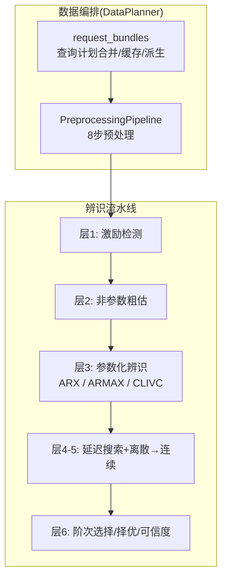
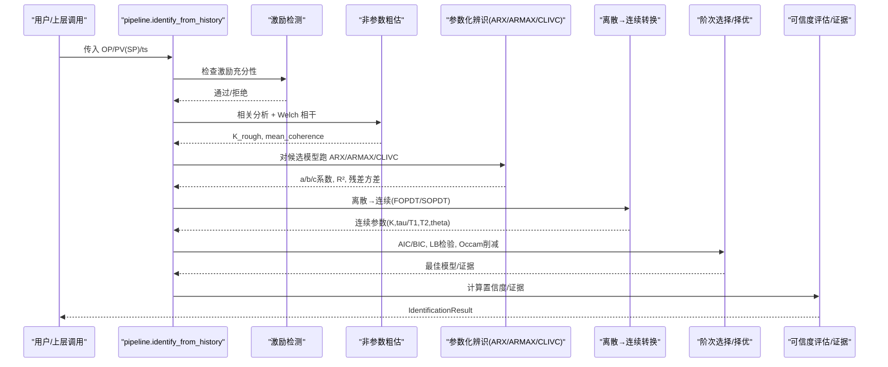
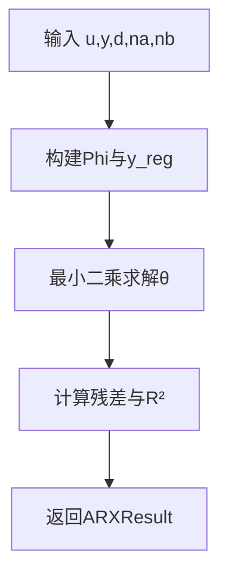
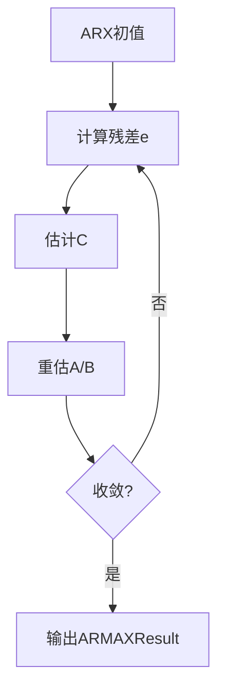
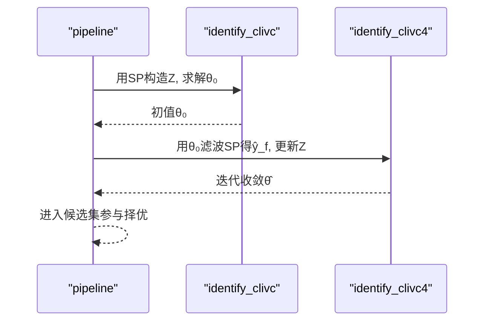
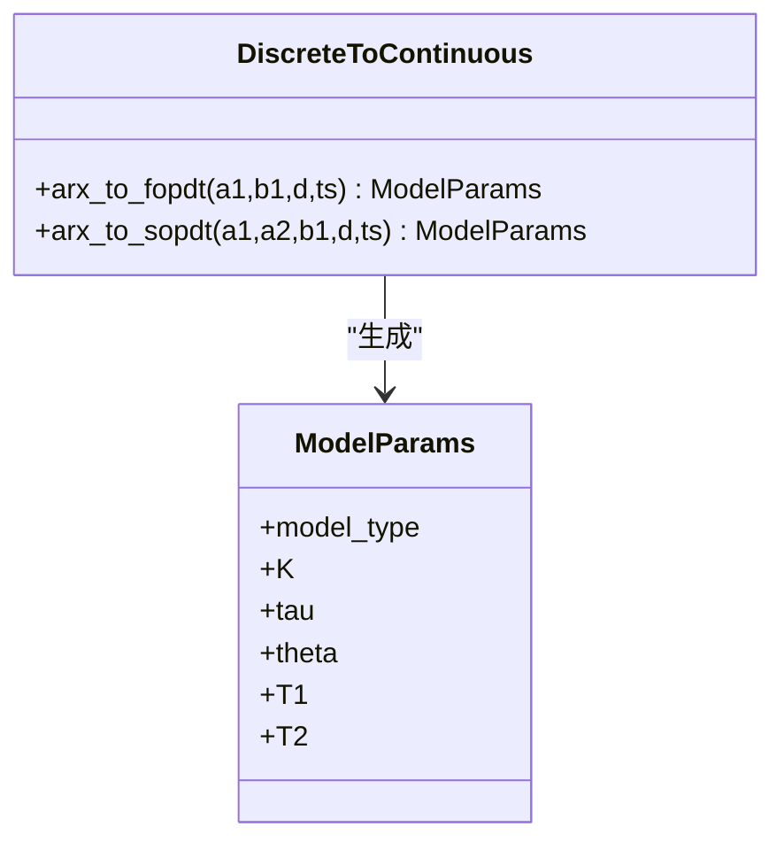
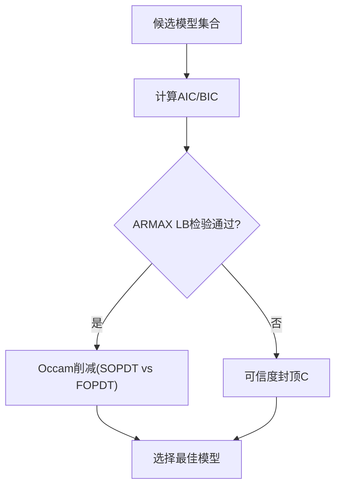
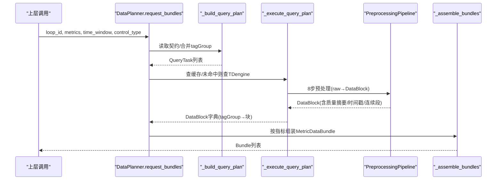
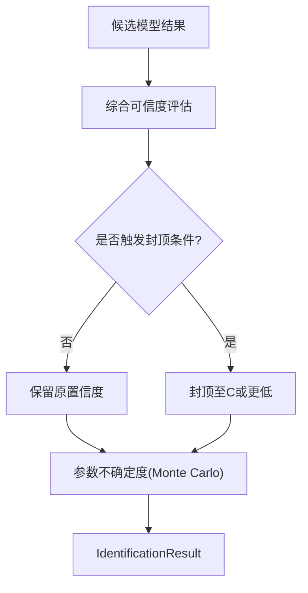
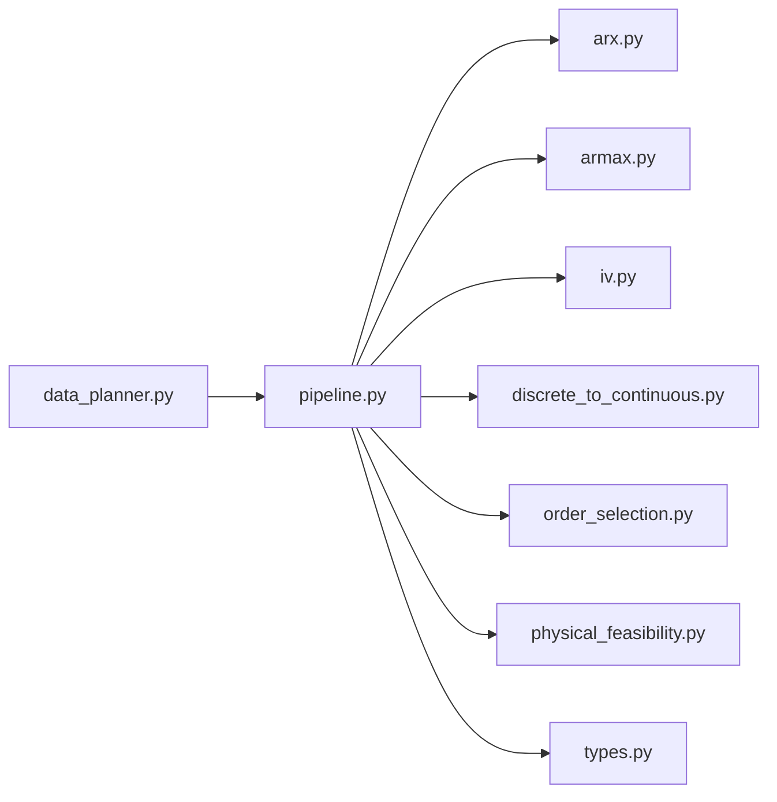

# 模型辨识算法

<cite>
**本文引用的文件**
- [pipeline.py](file://backend/app/services/tuning_identification/pipeline.py)
- [arx.py](file://backend/app/services/tuning_identification/arx.py)
- [armax.py](file://backend/app/services/tuning_identification/armax.py)
- [iv.py](file://backend/app/services/tuning_identification/iv.py)
- [discrete_to_continuous.py](file://backend/app/services/tuning_identification/discrete_to_continuous.py)
- [order_selection.py](file://backend/app/services/tuning_identification/order_selection.py)
- [physical_feasibility.py](file://backend/app/services/tuning_identification/physical_feasibility.py)
- [types.py](file://backend/app/services/tuning_identification/types.py)
- [data_planner.py](file://backend/app/services/data_planner.py)
</cite>

## 目录
1. [简介](#简介)
2. [项目结构](#项目结构)
3. [核心组件](#核心组件)
4. [架构总览](#架构总览)
5. [详细组件分析](#详细组件分析)
6. [依赖关系分析](#依赖关系分析)
7. [性能考虑](#性能考虑)
8. [故障排查指南](#故障排查指南)
9. [结论](#结论)
10. [附录](#附录)

## 简介
本技术文档面向过程控制回路的过程对象辨识，系统阐述 ARX、ARMAX、IV（含可证明闭环一致的 CLIVC）三类方法的数学原理与工程实现；说明阶次选择策略、物理可行性检查与模型类型判断（FOPDT/SOPDT/IPDT）；详解 DataPlanner 的 8 步预处理流程、信号质量评估与时间戳对齐；给出 CLIVC 的实现原理与置信度评估方法；并提供参数调优与性能优化建议。

## 项目结构
辨识模块位于后端服务 tuning_identification 子包，采用“层式流水线”组织：数据清洗→激励检测→非参数粗估→参数化辨识（ARX/ARMAX/CLIVC）→离散到连续转换→阶次选择与择优→可信度评估与证据输出。DataPlanner 提供指标驱动的数据编排与 8 步预处理，为辨识提供高质量时序输入。

**图表来源**
- [data_planner.py:208-346](file://backend/app/services/data_planner.py#L208-L346)
- [pipeline.py:209-658](file://backend/app/services/tuning_identification/pipeline.py#L209-L658)

**章节来源**
- [data_planner.py:1-40](file://backend/app/services/data_planner.py#L1-L40)
- [pipeline.py:1-75](file://backend/app/services/tuning_identification/pipeline.py#L1-L75)

## 核心组件
- 辨识入口与流水线编排：identify_from_history 串联激励检测、非参数粗估、参数化辨识、延迟搜索、离散到连续转换、可信度评估与证据构建。
- 参数化辨识器：
  - ARX：最小二乘解析解，用于基线与初值。
  - ARMAX：预测误差法（PEM），显式建模扰动通道 C。
  - IV（CLIVC/IV4）：外生 SP 作为工具变量，满足闭环一致性；IV4 迭代用无扰仿真 ŷ_f 提升效率。
- 离散到连续转换：将 ARX/IV/ARMAX 的离散参数转换为 FOPDT/SOPDT 连续域参数，并进行稳定性与合理性校验。
- 阶次选择与择优：AIC/BIC、Ljung-Box 白性检验、Occam 削减（SOPDT 优于 FOPDT 需相对 R² 提升 >5% 且 BIC 下降）。
- 物理可行性门禁：负增益与非最小相位零点标记并封顶可信度。
- 数据类型与证据：统一的结构化结果、候选模型、证据（训练/验证/留出集分割、自由仿真 R²、NRMSE、残差检验、数据哈希等）。

**章节来源**
- [pipeline.py:209-658](file://backend/app/services/tuning_identification/pipeline.py#L209-L658)
- [arx.py:21-101](file://backend/app/services/tuning_identification/arx.py#L21-L101)
- [armax.py:21-136](file://backend/app/services/tuning_identification/armax.py#L21-L136)
- [iv.py:28-211](file://backend/app/services/tuning_identification/iv.py#L28-L211)
- [discrete_to_continuous.py:17-107](file://backend/app/services/tuning_identification/discrete_to_continuous.py#L17-L107)
- [order_selection.py:35-140](file://backend/app/services/tuning_identification/order_selection.py#L35-L140)
- [physical_feasibility.py:34-103](file://backend/app/services/tuning_identification/physical_feasibility.py#L34-L103)
- [types.py:10-273](file://backend/app/services/tuning_identification/types.py#L10-L273)

## 架构总览
辨识流水线以“层”为单位组织，每层职责清晰、可独立测试与替换：
- 层1：激励检测（条件数、显著变化次数）
- 层2：非参数粗估（相关分析与 Welch 谱相干辅助）
- 层3：参数化辨识（ARX/ARMAX/CLIVC 并行候选）
- 层4-5：延迟搜索（BIC 选最优 d）、离散→连续转换（FOPDT/SOPDT）
- 层6：阶次选择与择优（AIC/BIC、LB 检验、Occam 削减）、可信度评估与证据生成

**图表来源**
- [pipeline.py:355-658](file://backend/app/services/tuning_identification/pipeline.py#L355-L658)
- [order_selection.py:35-140](file://backend/app/services/tuning_identification/order_selection.py#L35-L140)

## 详细组件分析

### ARX 辨识（线性最小二乘）
- 模型形式：A(z⁻¹)y(t) = B(z⁻¹)u(t-d) + e(t)
- 实现要点：构造回归矩阵 Φ，最小二乘求解 θ；计算残差方差与 R²；支持一阶/高阶稳定判定。
- 适用场景：数据干净时单独使用；为 ARMAX/IV 提供初值；阶次扫描快速试算。

**图表来源**
- [arx.py:41-101](file://backend/app/services/tuning_identification/arx.py#L41-L101)

**章节来源**
- [arx.py:21-101](file://backend/app/services/tuning_identification/arx.py#L21-L101)

### ARMAX 辨识（预测误差法 PEM）
- 模型形式：A(z⁻¹)y(t) = B(z⁻¹)u(t-d) + C(z⁻¹)e(t)
- 实现要点：先 ARX 得初始 A/B；估计残差 e；估 C；重估 A/B；交替迭代至收敛；输出 c_coeffs 用于后续一步预测误差白性检验。
- 优势：显式噪声模型，适合负载扰动主导场景。

**图表来源**
- [armax.py:35-136](file://backend/app/services/tuning_identification/armax.py#L35-L136)

**章节来源**
- [armax.py:21-136](file://backend/app/services/tuning_identification/armax.py#L21-L136)

### CLIVC（可证明闭环一致的工具变量法）
- 一致性证明：闭环下 u 与扰动 ν 相关导致 ARX 有偏；SP 外生于过程扰动，满足 E[sp·ν]=0；方程误差 e=A·ν，故 E[sp·e]=0，可用 SP 作工具变量得到一致估计。
- 实现要点：
  - identify_clivc：构造 Z（用 SP 替换内生 y/u 的回归量），求解 θ_IV=(ZᵀΦ)⁻¹Zᵀy。
  - identify_clivc4：迭代用模型对 SP 做无扰自由仿真 ŷ_f 作为 y 的工具变量，提升相关性、降低方差，保持一致性。
- 生产集成：当检测到 SP 存在显著变化时启用 CLIVC 进入候选集，与 ARX/ARMAX 并列供审计比较。

**图表来源**
- [iv.py:41-211](file://backend/app/services/tuning_identification/iv.py#L41-L211)
- [pipeline.py:389-466](file://backend/app/services/tuning_identification/pipeline.py#L389-L466)

**章节来源**
- [iv.py:28-211](file://backend/app/services/tuning_identification/iv.py#L28-L211)
- [pipeline.py:266-300](file://backend/app/services/tuning_identification/pipeline.py#L266-L300)

### 离散→连续转换与模型类型判断
- FOPDT：由 a1,b1,d 计算 τ=−Ts/ln(−a1)、K=b1/(1+a1)、θ=d·Ts；要求 a1<0（稳定）。
- SOPDT：求离散极点 p1,p2，转连续 s_i=ln|p_i|/Ts，T_i=−1/s_i；要求实极点且稳定；复共轭极点（振荡/欠阻尼）直接拒绝。
- IPDT：在 pipeline 中走专用差分辨识分支（不与 FOPDT/SOPDT 共用 ARX→连续链）。
- 物理可行性：负增益与非最小相位零点不直接拒绝，但标记并封顶可信度。

**图表来源**
- [discrete_to_continuous.py:17-107](file://backend/app/services/tuning_identification/discrete_to_continuous.py#L17-L107)
- [types.py:69-93](file://backend/app/services/tuning_identification/types.py#L69-L93)

**章节来源**
- [discrete_to_continuous.py:17-107](file://backend/app/services/tuning_identification/discrete_to_continuous.py#L17-L107)
- [physical_feasibility.py:34-103](file://backend/app/services/tuning_identification/physical_feasibility.py#L34-L103)
- [pipeline.py:399-422](file://backend/app/services/tuning_identification/pipeline.py#L399-L422)

### 阶次选择与模型择优
- 信息准则：AIC/BIC 用于复杂模型惩罚，优先更简洁模型。
- 残差白性：ARMAX 用 Ljung-Box 检验一步预测误差 ε；ARX/IV 用残差-输入独立性检验（避免闭环有色残差的误判）。
- Occam 削减：SOPDT 优于 FOPDT 需 R²_val 相对提升 >5% 且 BIC 下降。
- 延迟搜索：对 d=0..d_max 跑 ARX，用 BIC 选最优 d；已知 SOPDT na=2 存在退化问题，当前仍输出供审计。

**图表来源**
- [order_selection.py:35-140](file://backend/app/services/tuning_identification/order_selection.py#L35-L140)
- [pipeline.py:506-637](file://backend/app/services/tuning_identification/pipeline.py#L506-L637)

**章节来源**
- [order_selection.py:35-140](file://backend/app/services/tuning_identification/order_selection.py#L35-L140)
- [pipeline.py:506-637](file://backend/app/services/tuning_identification/pipeline.py#L506-L637)

### DataPlanner 集成：8 步预处理、信号质量评估与时间戳对齐
- 8 步预处理：从原始时序到 DataBlock，包含去噪、坏点处理、有效性编码、异常原因码、质量摘要等（由 PreprocessingPipeline.process 执行）。
- 信号质量评估：quality_summary.valid_rate 等指标用于后续可信度与指标计算；低相干（Welch）辅助封顶可信度。
- 时间戳对齐：BASE 与 HF tagGroup 复用 BASE 的时间戳与连续段，派生 DataBlock 继承 BASE 的 timestamps、consecutive_segments、config_version，保证多信号对齐。
- 查询计划合并：按 tagGroup 分组指标，合并 tags；所有控制类型复用 BASE，减少 TDengine 查询次数。

**图表来源**
- [data_planner.py:208-346](file://backend/app/services/data_planner.py#L208-L346)
- [data_planner.py:393-495](file://backend/app/services/data_planner.py#L393-L495)
- [data_planner.py:512-606](file://backend/app/services/data_planner.py#L512-L606)
- [data_planner.py:608-674](file://backend/app/services/data_planner.py#L608-L674)
- [data_planner.py:680-728](file://backend/app/services/data_planner.py#L680-L728)
- [data_planner.py:734-769](file://backend/app/services/data_planner.py#L734-L769)

**章节来源**
- [data_planner.py:1-40](file://backend/app/services/data_planner.py#L1-L40)
- [data_planner.py:208-346](file://backend/app/services/data_planner.py#L208-L346)
- [data_planner.py:393-495](file://backend/app/services/data_planner.py#L393-L495)
- [data_planner.py:512-606](file://backend/app/services/data_planner.py#L512-L606)
- [data_planner.py:608-674](file://backend/app/services/data_planner.py#L608-L674)
- [data_planner.py:680-728](file://backend/app/services/data_planner.py#L680-L728)
- [data_planner.py:734-769](file://backend/app/services/data_planner.py#L734-L769)

### 置信度评估与参数不确定度
- 置信度维度：拟合度（验证集自由仿真 R²）、残差白性/独立性、激励充分性、Welch 相干辅助、物理可行性、θ 来源（启发式 2Ts 封顶 C）。
- 参数不确定度：ARX/CLIVC 基于协方差传播 + Monte Carlo 采样（200 次）到连续域参数，输出 K/τ/θ 的 95% 置信区间；ARMAX/IPDT 暂缺解析协方差。

**图表来源**
- [pipeline.py:543-605](file://backend/app/services/tuning_identification/pipeline.py#L543-L605)
- [pipeline.py:670-789](file://backend/app/services/tuning_identification/pipeline.py#L670-L789)

**章节来源**
- [pipeline.py:543-605](file://backend/app/services/tuning_identification/pipeline.py#L543-L605)
- [pipeline.py:670-789](file://backend/app/services/tuning_identification/pipeline.py#L670-L789)

## 依赖关系分析
- 模块内耦合：pipeline 聚合 arx/armax/iv/discrete_to_continuous/order_selection/physical_feasibility/types，形成强内聚的辨识栈。
- 外部依赖：numpy/scipy 用于数值计算与统计检验；DataPlanner 依赖 PreprocessingPipeline 与缓存层（L1/L2）。
- 循环依赖：未发现明显循环导入；各层函数式接口清晰。

**图表来源**
- [pipeline.py:16-49](file://backend/app/services/tuning_identification/pipeline.py#L16-L49)
- [data_planner.py:52-65](file://backend/app/services/data_planner.py#L52-L65)

**章节来源**
- [pipeline.py:16-49](file://backend/app/services/tuning_identification/pipeline.py#L16-L49)
- [data_planner.py:52-65](file://backend/app/services/data_planner.py#L52-L65)

## 性能考虑
- 数据清洗：小缺口线性插值、大缺口取最长连续有效段，避免硬拒绝导致辨识失败；清洗后点数不足直接返回，节省算力。
- 训练/验证/留出集分割：时间顺序 60/20/20（短数据退化为 70/30），避免随机打乱破坏自相关。
- 延迟搜索范围：d_max 上限 60 且不超过数据长度 1/4，平衡搜索空间与稳定性。
- 并行与缓存：DataPlanner 并行执行非复用任务；tagGroup 复用 BASE 减少 TDengine 查询；L1/L2 缓存命中跳过重复计算。
- 数值稳定性：协方差矩阵对称化与正定修正；不稳定模型自由仿真截断保护；复共轭极点直接拒绝。

[本节为通用指导，无需特定文件引用]

## 故障排查指南
- 激励不足：检查显著变化次数与条件数；确认数据窗口覆盖足够动态。
- 数据不足/清洗后过少：检查坏点比例与大缺口数量；必要时调整 max_interp_gap。
- 离散→连续转换失败：检查 a1/a2 稳定性、复极点、K≈0、1+a1+a2≈0 等边界条件。
- 物理可行性未通过：关注负增益与非最小相位零点；结合工艺背景复核符号与零点位置。
- 残差检验失败：ARMAX 查看 LB p 值；ARX/IV 检查残差-输入相关性；必要时增加 nc 或改用 CLIVC。
- 低相干：Welch 相干均值低于阈值提示弱线性/低信噪比，可信度封顶 C；检查传感器噪声与闭环干扰。

**章节来源**
- [pipeline.py:355-364](file://backend/app/services/tuning_identification/pipeline.py#L355-L364)
- [pipeline.py:278-292](file://backend/app/services/tuning_identification/pipeline.py#L278-L292)
- [discrete_to_continuous.py:32-107](file://backend/app/services/tuning_identification/discrete_to_continuous.py#L32-L107)
- [physical_feasibility.py:52-71](file://backend/app/services/tuning_identification/physical_feasibility.py#L52-L71)
- [order_selection.py:49-74](file://backend/app/services/tuning_identification/order_selection.py#L49-L74)

## 结论
本方案以分层流水线整合 ARX/ARMAX/CLIVC 辨识，结合非参数粗估、延迟搜索、离散到连续转换、物理可行性与 Occam 削减，形成稳健的过程对象识别体系。DataPlanner 的 8 步预处理与 tagGroup 复用保障输入质量与系统性能。CLIVC 提供闭环一致的工具变量估计，配合置信度评估与参数不确定度输出，使模型选择透明可审计。推荐在生产环境中优先使用 CLIVC（当 SP 激励存在），并以 ARX/ARMAX 作为基线对照。

[本节为总结性内容，无需特定文件引用]

## 附录

### 算法参数调优指南
- 采样周期 ts：确保有限正数；θ 预估值可为 None（使用 2Ts 启发）或显式给定（提高可追溯性）。
- 延迟搜索 d_max：默认 min(n_u//4, 60)；若已知 θ，可在 ±3 邻域精搜。
- 阶次 na/nb：FOPDT 用 na=1,nb=1；SOPDT 用 na=2,nb=1；IPDT 走专用分支。
- ARMAX 噪声阶次 nc：默认 1；若负载扰动显著可尝试增大 nc 并观察 LB p 值。
- CLIVC 迭代：max_iter=5、tol=1e-6；ŷ_f 工具变量提升效率，注意发散保护。
- 可信度阈值：R²_A/B/C/D 分级；低相干阈值 0.3；残差可忽略阈值 0.999。

**章节来源**
- [pipeline.py:224-264](file://backend/app/services/tuning_identification/pipeline.py#L224-L264)
- [pipeline.py:320-349](file://backend/app/services/tuning_identification/pipeline.py#L320-L349)
- [pipeline.py:399-466](file://backend/app/services/tuning_identification/pipeline.py#L399-L466)
- [iv.py:122-211](file://backend/app/services/tuning_identification/iv.py#L122-L211)
- [pipeline.py:55-74](file://backend/app/services/tuning_identification/pipeline.py#L55-L74)

### 性能优化建议
- 数据层面：利用 DataPlanner 的 tagGroup 复用与 L1/L2 缓存；避免重复查询；空 DataBlock 不写缓存。
- 算法层面：短数据退化为 70/30 分割；延迟搜索限制 d_max；ARMAX 迭代收敛阈值合理设置。
- 数值层面：协方差矩阵正定修正；不稳定模型自由仿真截断；复共轭极点直接拒绝。
- 工程层面：批量计算时预加载 OP 限位；配置版本纳入缓存 Key，避免脏读。

**章节来源**
- [data_planner.py:247-300](file://backend/app/services/data_planner.py#L247-L300)
- [data_planner.py:512-606](file://backend/app/services/data_planner.py#L512-L606)
- [pipeline.py:334-349](file://backend/app/services/tuning_identification/pipeline.py#L334-L349)
- [pipeline.py:670-789](file://backend/app/services/tuning_identification/pipeline.py#L670-L789)