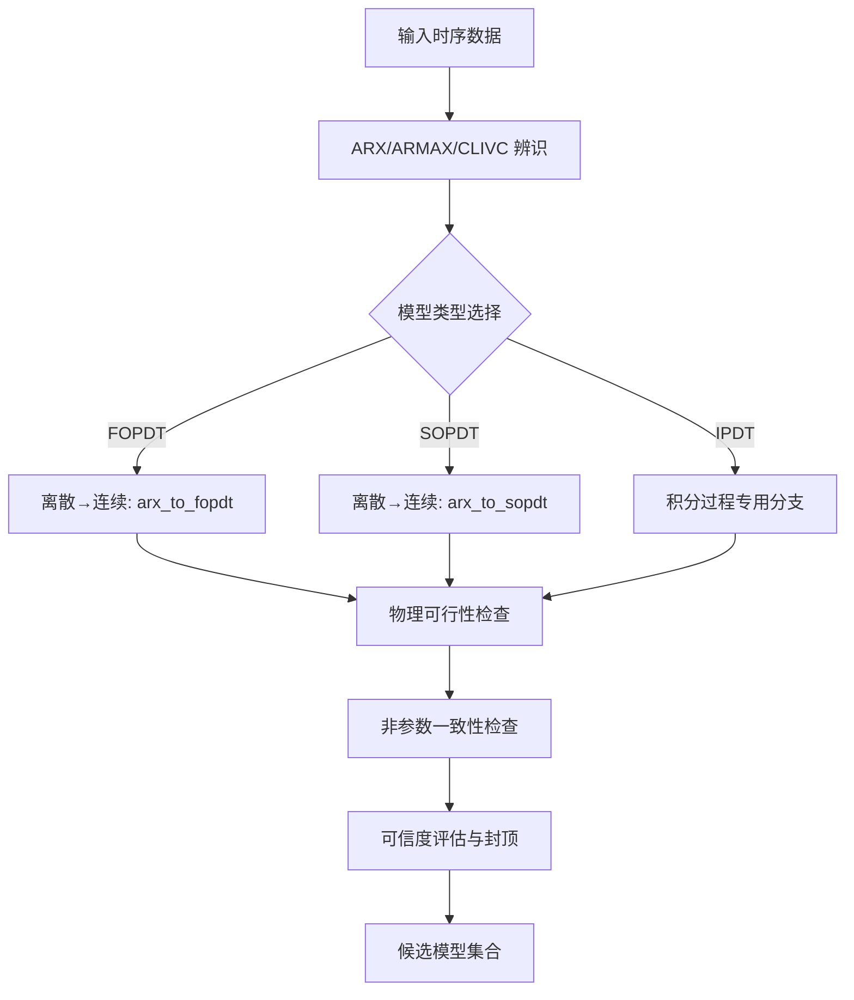
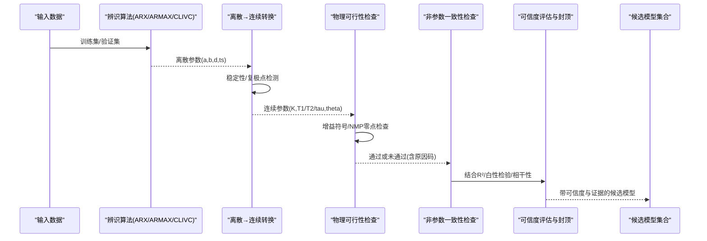
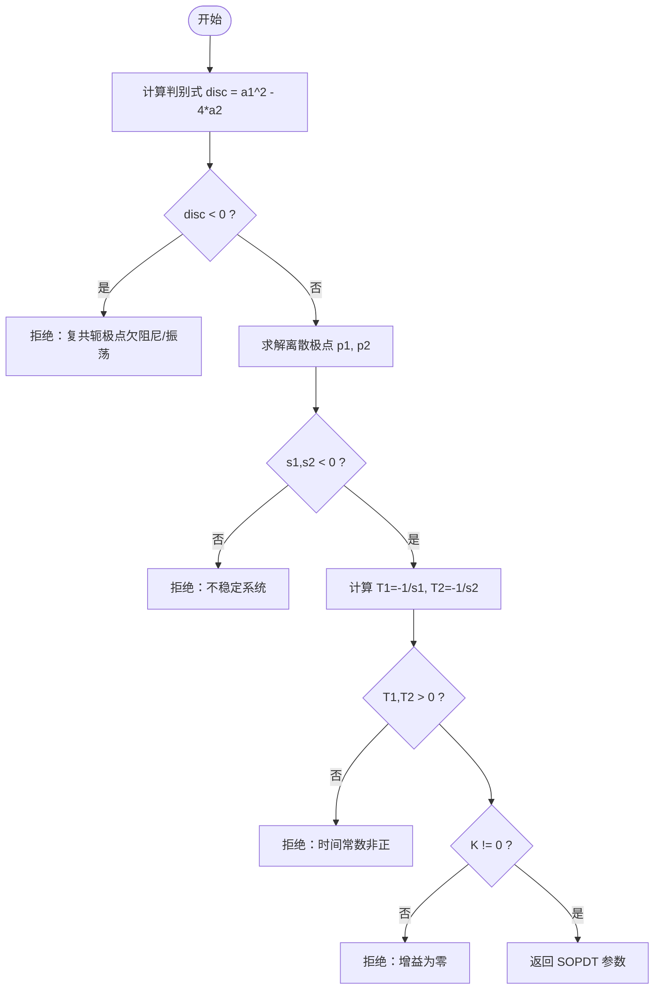
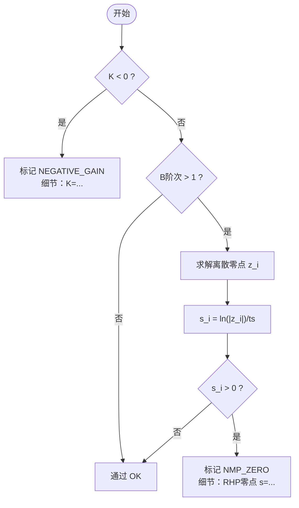
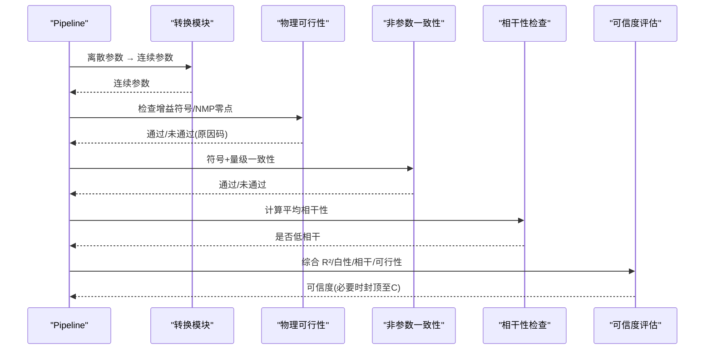
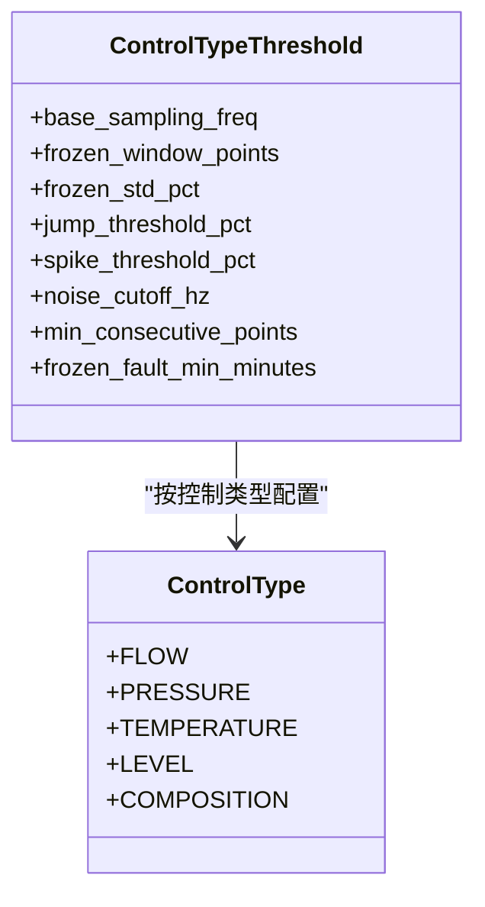
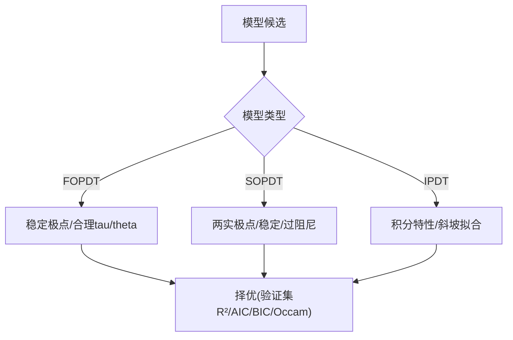

# 物理可行性检查

<cite>
**本文引用的文件**
- [backend/app/services/tuning_identification/physical_feasibility.py](file://backend/app/services/tuning_identification/physical_feasibility.py)
- [backend/app/services/tuning_identification/discrete_to_continuous.py](file://backend/app/services/tuning_identification/discrete_to_continuous.py)
- [backend/app/services/tuning_identification/pipeline.py](file://backend/app/services/tuning_identification/pipeline.py)
- [backend/app/services/tuning_algorithms.py](file://backend/app/services/tuning_algorithms.py)
- [backend/app/services/preprocessing/thresholds.py](file://backend/app/services/preprocessing/thresholds.py)
- [backend/app/utils/ideal_settling_time.py](file://backend/app/utils/ideal_settling_time.py)
- [backend/app/contracts/data_types.py](file://backend/app/contracts/data_types.py)
- [backend/tests/test_tuning_identification.py](file://backend/tests/test_tuning_identification.py)
- [backend/tests/test_tuning.py](file://backend/tests/test_tuning.py)
</cite>

## 目录
1. [简介](#简介)
2. [项目结构](#项目结构)
3. [核心组件](#核心组件)
4. [架构总览](#架构总览)
5. [详细组件分析](#详细组件分析)
6. [依赖关系分析](#依赖关系分析)
7. [性能与稳定性考虑](#性能与稳定性考虑)
8. [故障排查指南](#故障排查指南)
9. [结论](#结论)
10. [附录：配置与扩展指南](#附录：配置与扩展指南)

## 简介
本技术文档围绕“物理可行性检查机制”展开，系统阐述如何验证辨识结果是否符合物理规律，覆盖增益符号检查、时滞范围验证、稳定性约束、模型结构合理性（FOPDT/SOPDT/IPDT）评估、参数物理意义校验，以及异常检测与修正建议。同时给出不同过程类型（液位、温度、压力等）的物理约束与边界限制，并提供可配置的阈值与自定义规则扩展方法。

## 项目结构
本项目在辨识流水线中嵌入“离散→连续转换 + 物理可行性门禁 + 非参数一致性检查 + 可信度封顶”的完整防线，确保只有符合物理规律的模型进入下游整定与仿真环节。关键位置包括：
- 离散到连续转换：对 FOPDT/SOPDT 进行极点稳定性与复极点检测，拒绝不稳定或欠阻尼系统被伪装为过阻尼 SOPDT。
- 物理可行性门禁：对转换后的模型参数进行增益符号与非最小相位零点检查，标记并封顶可信度。
- 非参数一致性检查：与独立的相关分析粗估交叉校验 K 的符号与量级。
- 阈值与异常值检测：按控制类型提供异常值检测阈值表，支持运行时覆盖。
- 理想稳态时间计算：基于模型参数与控制类型估算期望响应时间，辅助合理性判断。

图表来源
- [backend/app/services/tuning_identification/pipeline.py:398-489](file://backend/app/services/tuning_identification/pipeline.py#L398-L489)
- [backend/app/services/tuning_identification/discrete_to_continuous.py:17-107](file://backend/app/services/tuning_identification/discrete_to_continuous.py#L17-L107)
- [backend/app/services/tuning_identification/physical_feasibility.py:34-71](file://backend/app/services/tuning_identification/physical_feasibility.py#L34-L71)

章节来源
- [backend/app/services/tuning_identification/pipeline.py:398-649](file://backend/app/services/tuning_identification/pipeline.py#L398-L649)
- [backend/app/services/tuning_identification/discrete_to_continuous.py:17-107](file://backend/app/services/tuning_identification/discrete_to_continuous.py#L17-L107)
- [backend/app/services/tuning_identification/physical_feasibility.py:34-71](file://backend/app/services/tuning_identification/physical_feasibility.py#L34-L71)

## 核心组件
- 离散→连续转换模块：实现 FOPDT/SOPDT 从离散 ARX/ARMAX 参数到连续时间参数的转换，并进行稳定性与复极点检测。
- 物理可行性检查模块：对增益符号与非最小相位零点进行检查，输出通过/未通过及原因码。
- 辨识流水线：串联多种辨识算法、模型选择、残差检验、可信度评估与封顶策略。
- 异常值检测阈值表：按控制类型（流量/压力/温度/液位/成分）提供默认阈值，支持运行时覆盖。
- 理想稳态时间计算：根据模型参数与控制类型估算期望响应时间，用于合理性评估。

章节来源
- [backend/app/services/tuning_identification/discrete_to_continuous.py:17-107](file://backend/app/services/tuning_identification/discrete_to_continuous.py#L17-L107)
- [backend/app/services/tuning_identification/physical_feasibility.py:34-71](file://backend/app/services/tuning_identification/physical_feasibility.py#L34-L71)
- [backend/app/services/tuning_identification/pipeline.py:450-649](file://backend/app/services/tuning_identification/pipeline.py#L450-L649)
- [backend/app/services/preprocessing/thresholds.py:66-122](file://backend/app/services/preprocessing/thresholds.py#L66-L122)
- [backend/app/utils/ideal_settling_time.py:176-201](file://backend/app/utils/ideal_settling_time.py#L176-L201)

## 架构总览
下图展示辨识流水线中的物理可行性检查在整体流程中的位置与作用：

图表来源
- [backend/app/services/tuning_identification/pipeline.py:450-649](file://backend/app/services/tuning_identification/pipeline.py#L450-L649)
- [backend/app/services/tuning_identification/discrete_to_continuous.py:17-107](file://backend/app/services/tuning_identification/discrete_to_continuous.py#L17-L107)
- [backend/app/services/tuning_identification/physical_feasibility.py:34-71](file://backend/app/services/tuning_identification/physical_feasibility.py#L34-L71)

## 详细组件分析

### 离散→连续转换（FOPDT/SOPDT）
- FOPDT 转换要求稳定系统（a1 < 0），计算 tau = -Ts / ln(-a1)，K = b1 / (1 + a1)，theta = d * Ts；若 tau <= 0 或 K == 0 则拒绝。
- SOPDT 转换需判别复共轭极点（disc = a1^2 - 4*a2 < 0），若存在则拒绝（欠阻尼/振荡系统不得伪装为过阻尼 SOPDT）。随后求解离散极点 p1,p2，转换为连续极点 s_i = ln(p_i)/Ts，要求 s_i < 0（稳定），T_i = -1/s_i > 0，且 K != 0。

图表来源
- [backend/app/services/tuning_identification/discrete_to_continuous.py:54-107](file://backend/app/services/tuning_identification/discrete_to_continuous.py#L54-L107)

章节来源
- [backend/app/services/tuning_identification/discrete_to_continuous.py:17-107](file://backend/app/services/tuning_identification/discrete_to_continuous.py#L17-L107)

### 物理可行性检查（P2-012）
- 负增益检查：若 K < 0，标记为 NEGATIVE_GAIN，允许但需人工复核，并在可信度评估阶段封顶至 C 级。
- 非最小相位零点检查：当 B 多项式阶次 > 1 时，求解离散零点 z_i，转换为连续零点 s_i = ln(|z_i|)/ts，若 s_i > 0 则为 RHP 零点（逆向响应），标记为 NMP_ZERO，同样封顶可信度。
- 设计原则：负增益与 NMP 零点在物理上可能（如逆向作用过程、液位假响应），不应直接拒绝，但绝不能伪装成正常正增益最小相位模型静默放行。

图表来源
- [backend/app/services/tuning_identification/physical_feasibility.py:34-71](file://backend/app/services/tuning_identification/physical_feasibility.py#L34-L71)
- [backend/app/services/tuning_identification/physical_feasibility.py:74-103](file://backend/app/services/tuning_identification/physical_feasibility.py#L74-L103)

章节来源
- [backend/app/services/tuning_identification/physical_feasibility.py:34-71](file://backend/app/services/tuning_identification/physical_feasibility.py#L34-L71)

### 辨识流水线与可信度封顶
- 流水线在离散→连续转换后调用物理可行性检查，并将未通过的原因码附加到候选模型的 reason 字段。
- 非参数一致性检查（符号+量级）与低相干性（Welch 相干）作为辅助门禁，未通过时将可信度封顶至 C 级。
- 对于 theta 由启发式两点法估计的情况，可信度也封顶至 C 级。
- 最终候选模型集合包含所有成功候选，由 Occam 准则择优。

图表来源
- [backend/app/services/tuning_identification/pipeline.py:450-649](file://backend/app/services/tuning_identification/pipeline.py#L450-L649)

章节来源
- [backend/app/services/tuning_identification/pipeline.py:450-649](file://backend/app/services/tuning_identification/pipeline.py#L450-L649)

### 不同类型过程的物理约束与边界限制
- 控制类型枚举：流量(FC)、压力(PC)、温度(TC)、液位(LC)、成分(CC)。
- 异常值检测阈值表：针对不同控制类型设置不同的冻结窗口、跳变/尖峰阈值、噪声截止频率、最短连续有效点数等。
- 理想稳态时间：基于模型参数与控制类型估算期望响应时间，公式为 T' = α · (τ + θ)，其中 α 可根据控制类型与保守策略调整。

图表来源
- [backend/app/contracts/data_types.py:25-36](file://backend/app/contracts/data_types.py#L25-L36)
- [backend/app/services/preprocessing/thresholds.py:26-55](file://backend/app/services/preprocessing/thresholds.py#L26-L55)
- [backend/app/services/preprocessing/thresholds.py:66-122](file://backend/app/services/preprocessing/thresholds.py#L66-L122)
- [backend/app/utils/ideal_settling_time.py:176-201](file://backend/app/utils/ideal_settling_time.py#L176-L201)

章节来源
- [backend/app/contracts/data_types.py:25-36](file://backend/app/contracts/data_types.py#L25-L36)
- [backend/app/services/preprocessing/thresholds.py:66-122](file://backend/app/services/preprocessing/thresholds.py#L66-L122)
- [backend/app/utils/ideal_settling_time.py:176-201](file://backend/app/utils/ideal_settling_time.py#L176-L201)

### 模型结构合理性判断（FOPDT/SOPDT/IPDT）
- FOPDT：适用于一阶惯性加纯滞后过程，要求稳定极点与合理的时间常数。
- SOPDT：适用于二阶过阻尼过程，必须满足两个实极点且稳定；复共轭极点（欠阻尼）应拒绝。
- IPDT：适用于积分过程，自由仿真跟踪斜坡变化，拟合度显著优于 FOPDT。
- 模型选择：通过验证集自由仿真 R²、AIC/BIC、Occam 准则择优；积分过程优先选择 IPDT。

图表来源
- [backend/app/services/tuning_identification/discrete_to_continuous.py:17-107](file://backend/app/services/tuning_identification/discrete_to_continuous.py#L17-L107)
- [backend/app/services/tuning_identification/pipeline.py:398-425](file://backend/app/services/tuning_identification/pipeline.py#L398-L425)
- [backend/tests/test_tuning_identification.py:1721-1746](file://backend/tests/test_tuning_identification.py#L1721-L1746)

章节来源
- [backend/app/services/tuning_identification/discrete_to_continuous.py:17-107](file://backend/app/services/tuning_identification/discrete_to_continuous.py#L17-L107)
- [backend/app/services/tuning_identification/pipeline.py:398-425](file://backend/app/services/tuning_identification/pipeline.py#L398-L425)
- [backend/tests/test_tuning_identification.py:1721-1746](file://backend/tests/test_tuning_identification.py#L1721-L1746)

### 常见物理约束的配置方法与自定义规则添加指南
- 异常值检测阈值：通过 set_threshold_overrides 对指定控制类型的阈值进行运行时覆盖，支持 base_sampling_freq、frozen_window_points、frozen_std_pct、jump_threshold_pct、spike_threshold_pct、noise_cutoff_hz、min_consecutive_points 等字段。
- 检测开关：通过 set_detector_switches 启用/禁用 8 类异常值检测（nan、out_of_range、frozen、jump、spike、ts_anomaly、qc_bad、hf_noise）。
- 自定义约束：可在 pipeline 中插入新的检查步骤（例如新增物理边界、工程经验规则），将检查结果纳入 reason_codes 与可信度封顶逻辑。

章节来源
- [backend/app/services/preprocessing/thresholds.py:184-286](file://backend/app/services/preprocessing/thresholds.py#L184-L286)
- [backend/app/services/tuning_identification/pipeline.py:450-649](file://backend/app/services/tuning_identification/pipeline.py#L450-L649)

## 依赖关系分析
- 离散→连续转换依赖数值稳定性判断与二次方程求解。
- 物理可行性检查依赖 B 多项式零点求解（可选 numpy）。
- 辨识流水线依赖多种辨识算法、残差检验、信息准则与 Occam 准则。
- 异常值检测阈值表依赖控制类型枚举与运行时配置缓存。

图表来源
- [backend/app/services/tuning_identification/discrete_to_continuous.py:17-107](file://backend/app/services/tuning_identification/discrete_to_continuous.py#L17-L107)
- [backend/app/services/tuning_identification/physical_feasibility.py:34-71](file://backend/app/services/tuning_identification/physical_feasibility.py#L34-L71)
- [backend/app/services/preprocessing/thresholds.py:66-122](file://backend/app/services/preprocessing/thresholds.py#L66-L122)
- [backend/app/services/tuning_identification/pipeline.py:450-649](file://backend/app/services/tuning_identification/pipeline.py#L450-L649)

章节来源
- [backend/app/services/tuning_identification/discrete_to_continuous.py:17-107](file://backend/app/services/tuning_identification/discrete_to_continuous.py#L17-L107)
- [backend/app/services/tuning_identification/physical_feasibility.py:34-71](file://backend/app/services/tuning_identification/physical_feasibility.py#L34-L71)
- [backend/app/services/preprocessing/thresholds.py:66-122](file://backend/app/services/preprocessing/thresholds.py#L66-L122)
- [backend/app/services/tuning_identification/pipeline.py:450-649](file://backend/app/services/tuning_identification/pipeline.py#L450-L649)

## 性能与稳定性考虑
- 数值稳定性：离散→连续转换中对分母接近零、对数发散、复根等情况进行严格保护，避免不稳定或无效参数进入下游。
- 计算开销：B 多项式零点求解使用 numpy.roots，仅在必要时引入；若失败则跳过 NMP 检查，保证鲁棒性。
- 热路径优化：异常值检测阈值与开关采用进程内缓存，避免每回路每窗口查库，提升吞吐。
- 可信度封顶：对不可行或非一致性的模型统一封顶至 C 级，降低误用风险。

章节来源
- [backend/app/services/tuning_identification/discrete_to_continuous.py:17-107](file://backend/app/services/tuning_identification/discrete_to_continuous.py#L17-L107)
- [backend/app/services/tuning_identification/physical_feasibility.py:74-103](file://backend/app/services/tuning_identification/physical_feasibility.py#L74-L103)
- [backend/app/services/preprocessing/thresholds.py:218-286](file://backend/app/services/preprocessing/thresholds.py#L218-L286)
- [backend/app/services/tuning_identification/pipeline.py:543-558](file://backend/app/services/tuning_identification/pipeline.py#L543-L558)

## 故障排查指南
- 复共轭极点被拒绝：检查二阶系统判别式 disc 是否为负；若为负，说明系统欠阻尼/振荡，应改用 FOPDT 或振荡模型。
- 负增益标记：确认过程是否确实为逆向作用；若为符号错误，需检查 PV/MV 极性。
- 非最小相位零点：检查 B 多项式系数是否合理；若存在 RHP 零点，需人工复核并记录原因码。
- 阈值不生效：确认 set_threshold_overrides 是否正确调用，且覆盖字段在 PARAM_FIELDS 列表中。
- 测试用例参考：
  - 复共轭极点拒绝：参见测试用例中对 arx_to_sopdt 的断言。
  - 负增益标记与可信度封顶：参见测试用例中对 NEGATIVE_GAIN 的断言。
  - 积分过程优先选择 IPDT：参见测试用例中对 IPDT 优于 FOPDT 的断言。

章节来源
- [backend/tests/test_tuning_identification.py:1237-1257](file://backend/tests/test_tuning_identification.py#L1237-L1257)
- [backend/tests/test_tuning_identification.py:1721-1746](file://backend/tests/test_tuning_identification.py#L1721-L1746)
- [backend/tests/test_tuning.py:811-837](file://backend/tests/test_tuning.py#L811-L837)

## 结论
本项目的物理可行性检查机制通过“离散→连续转换 + 物理可行性门禁 + 非参数一致性检查 + 可信度封顶”的多层防线，确保辨识结果符合物理规律。针对不同过程类型提供合理的阈值与边界限制，并通过可配置的异常值检测与自定义规则扩展，满足工程实践需求。建议在部署前充分验证阈值配置与自定义规则，并结合测试用例进行回归验证。

## 附录：配置与扩展指南
- 配置异常值检测阈值：
  - 使用 set_threshold_overrides 对指定控制类型的阈值进行覆盖。
  - 支持的覆盖字段包括 base_sampling_freq、frozen_window_points、frozen_std_pct、jump_threshold_pct、spike_threshold_pct、noise_cutoff_hz、min_consecutive_points。
- 启用/禁用检测开关：
  - 使用 set_detector_switches 控制 8 类异常值检测的开关。
- 自定义约束规则：
  - 在 pipeline 中插入新的检查步骤，将检查结果纳入 reason_codes 与可信度封顶逻辑。
  - 结合 ideal_settling_time 的计算结果，对期望响应时间进行合理性判断。

章节来源
- [backend/app/services/preprocessing/thresholds.py:184-286](file://backend/app/services/preprocessing/thresholds.py#L184-L286)
- [backend/app/utils/ideal_settling_time.py:176-201](file://backend/app/utils/ideal_settling_time.py#L176-L201)
- [backend/app/services/tuning_identification/pipeline.py:450-649](file://backend/app/services/tuning_identification/pipeline.py#L450-L649)