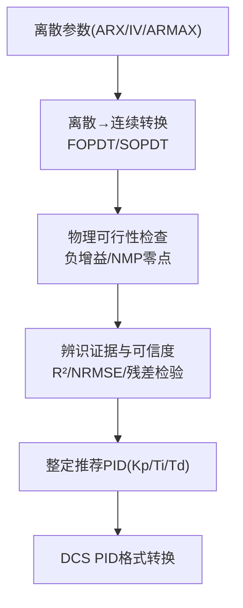
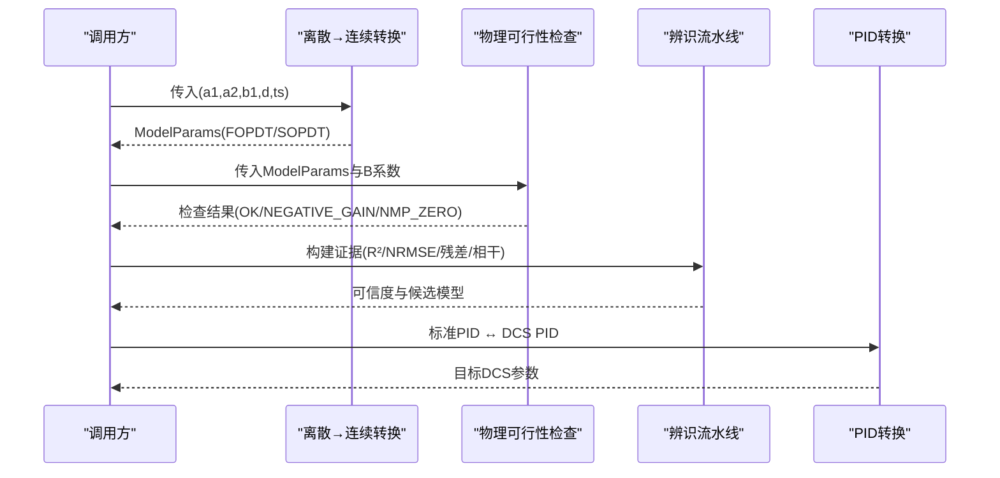
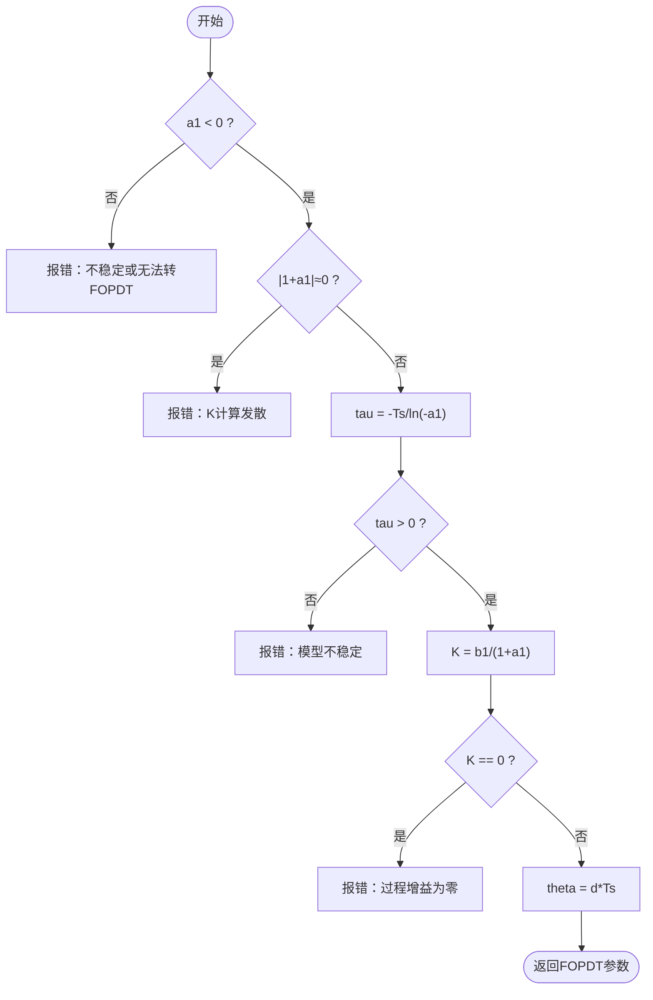
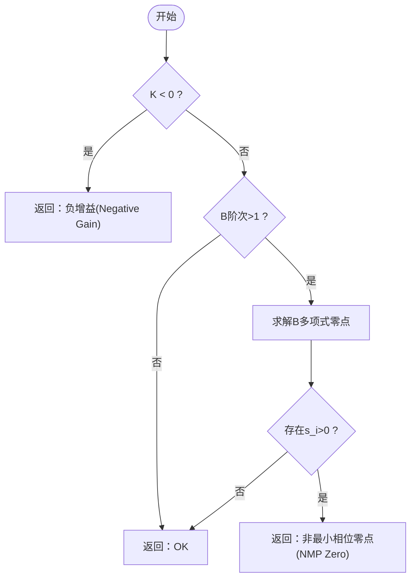
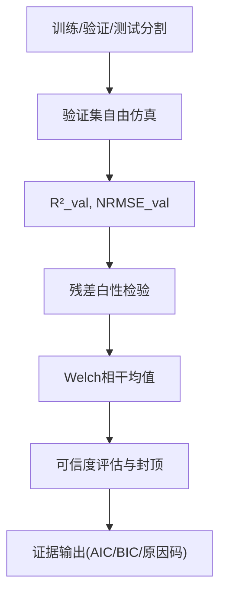
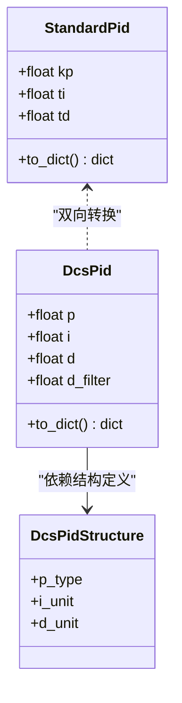
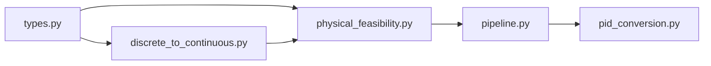

# 离散连续模型转换

<cite>
**本文引用的文件**
- [discrete_to_continuous.py](file://backend/app/services/tuning_identification/discrete_to_continuous.py)
- [types.py](file://backend/app/services/tuning_identification/types.py)
- [physical_feasibility.py](file://backend/app/services/tuning_identification/physical_feasibility.py)
- [pipeline.py](file://backend/app/services/tuning_identification/pipeline.py)
- [pid_conversion.py](file://backend/app/services/pid_conversion.py)
- [test_pid_conversion.py](file://backend/tests/test_pid_conversion.py)
- [test_tuning_identification.py](file://backend/tests/test_tuning_identification.py)
</cite>

## 目录
1. [简介](#简介)
2. [项目结构](#项目结构)
3. [核心组件](#核心组件)
4. [架构总览](#架构总览)
5. [详细组件分析](#详细组件分析)
6. [依赖关系分析](#依赖关系分析)
7. [性能与数值稳定性](#性能与数值稳定性)
8. [故障排查指南](#故障排查指南)
9. [结论](#结论)
10. [附录](#附录)

## 简介
本技术文档围绕“离散时间模型到连续时间模型”的转换，聚焦于以下目标：
- 解释 Z 域到 S 域的数学变换原理（双线性变换法、脉冲响应不变法）在本工程中的适用性与取舍。
- 说明不同采样频率下的转换精度分析与误差补偿方法。
- 推导 FOPDT/SOPDT/IPDT 模型参数的连续形式，并给出时滞参数处理方法。
- 阐述转换过程中的数值稳定性考虑与条件判断逻辑。
- 提供转换质量评估指标与验证方法，以及在不同采样间隔下的性能表现分析。

该能力位于辨识算法栈的“层 5”，将 ARX/IV/ARMAX 等离散参数转换为连续 FOPDT/SOPDT 模型参数，以对齐后续整定公式（IMC/Lambda/ZN 等）的输入要求。

## 项目结构
与离散→连续转换直接相关的代码集中在后端服务模块中：
- 离散→连续转换实现：backend/app/services/tuning_identification/discrete_to_continuous.py
- 共享数据结构与枚举：backend/app/services/tuning_identification/types.py
- 物理可行性门禁：backend/app/services/tuning_identification/physical_feasibility.py
- 辨识流水线与证据输出：backend/app/services/tuning_identification/pipeline.py
- PID 标准形式与 DCS 私有形式互转（用于整定结果落地）：backend/app/services/pid_conversion.py
- 相关测试用例：backend/tests/test_tuning_identification.py、backend/tests/test_pid_conversion.py

图表来源
- [discrete_to_continuous.py:17-107](file://backend/app/services/tuning_identification/discrete_to_continuous.py#L17-L107)
- [physical_feasibility.py:34-71](file://backend/app/services/tuning_identification/physical_feasibility.py#L34-L71)
- [pipeline.py:491-593](file://backend/app/services/tuning_identification/pipeline.py#L491-L593)
- [pid_conversion.py:80-135](file://backend/app/services/pid_conversion.py#L80-L135)

章节来源
- [discrete_to_continuous.py:1-125](file://backend/app/services/tuning_identification/discrete_to_continuous.py#L1-L125)
- [types.py:10-93](file://backend/app/services/tuning_identification/types.py#L10-L93)
- [pipeline.py:491-593](file://backend/app/services/tuning_identification/pipeline.py#L491-L593)
- [pid_conversion.py:80-135](file://backend/app/services/pid_conversion.py#L80-L135)

## 核心组件
- 离散→连续转换函数
  - arx_to_fopdt：一阶 ARX → FOPDT（K, tau, theta）
  - arx_to_sopdt：二阶 ARX → SOPDT（K, T1, T2, theta）
- 物理可行性检查：对转换后的 K 符号与 B 多项式零点进行非最小相位检测
- 辨识证据与可信度：基于验证集自由仿真 R²、NRMSE、残差白性检验、相干性等综合评估
- PID 标准形式与 DCS 私有形式互转：统一 Kp/Ti/Td（秒）与 DCS 的 PB/i/d（分钟/秒）表示

章节来源
- [discrete_to_continuous.py:17-107](file://backend/app/services/tuning_identification/discrete_to_continuous.py#L17-L107)
- [physical_feasibility.py:34-71](file://backend/app/services/tuning_identification/physical_feasibility.py#L34-L71)
- [pipeline.py:491-593](file://backend/app/services/tuning_identification/pipeline.py#L491-L593)
- [pid_conversion.py:80-135](file://backend/app/services/pid_conversion.py#L80-L135)

## 架构总览
从离散参数到连续模型的完整流程如下：
1. 输入离散 ARX/IV/ARMAX 参数与采样周期 ts
2. 执行离散→连续转换（FOPDT/SOPDT），并进行数值稳定性校验（稳定极点、正时间常数、非零增益）
3. 物理可行性检查（负增益、非最小相位零点）
4. 构建辨识证据（训练/验证/测试分割、自由仿真 R²、NRMSE、残差白性检验、Welch 相干）
5. 计算可信度等级（受启发式时滞、低相干、物理不可行等因素封顶）
6. 输出连续模型参数供整定算法使用；最终 PID 通过标准形式与 DCS 格式互转

图表来源
- [discrete_to_continuous.py:17-107](file://backend/app/services/tuning_identification/discrete_to_continuous.py#L17-L107)
- [physical_feasibility.py:34-71](file://backend/app/services/tuning_identification/physical_feasibility.py#L34-L71)
- [pipeline.py:491-593](file://backend/app/services/tuning_identification/pipeline.py#L491-L593)
- [pid_conversion.py:80-135](file://backend/app/services/pid_conversion.py#L80-L135)

## 详细组件分析

### 离散→连续转换（Z 域到 S 域）
- 一阶 ARX → FOPDT
  - 离散模型：y(t) + a1·y(t-1) = b1·u(t-d)
  - 连续模型：G(s) = K·exp(-θs)/(τs+1)
  - 转换要点：
    - τ = -Ts / ln(-a1)，要求 a1 < 0（稳定系统）
    - K = b1 / (1 + a1)
    - θ = d·Ts
  - 数值稳定性：
    - 避免 1+a1≈0（K 发散）
    - 避免 ln(-a1)≈0（τ 发散）
    - τ > 0，K ≠ 0

- 二阶 ARX → SOPDT
  - 离散模型：y(t) + a1·y(t-1) + a2·y(t-2) = b1·u(t-d)
  - 连续模型：G(s) = K·exp(-θs)/((T1s+1)(T2s+1))
  - 转换要点：
    - 求离散极点 p1,p2，再 s_i = ln(p_i)/Ts，T_i = -1/s_i
    - K = b1 / (1 + a1 + a2)
    - θ = d·Ts
  - 数值稳定性：
    - 复共轭极点（disc < 0）拒绝（SOPDT 仅适用于过阻尼）
    - 连续极点必须为负（不稳定则拒绝）
    - T1,T2 > 0，K ≠ 0

图表来源
- [discrete_to_continuous.py:17-51](file://backend/app/services/tuning_identification/discrete_to_continuous.py#L17-L51)

章节来源
- [discrete_to_continuous.py:17-107](file://backend/app/services/tuning_identification/discrete_to_continuous.py#L17-L107)

### 物理可行性检查（负增益与非最小相位零点）
- 负增益检查：若 K < 0，标记为逆向过程或符号错误，允许但需人工复核（可信度封顶）
- 非最小相位零点检查：对 B(z⁻¹) 求解离散零点 z_i，映射到连续零点 s_i = ln(|z_i|)/Ts，若 s_i > 0 则为右半平面零点（非最小相位）

图表来源
- [physical_feasibility.py:34-71](file://backend/app/services/tuning_identification/physical_feasibility.py#L34-L71)
- [physical_feasibility.py:74-103](file://backend/app/services/tuning_identification/physical_feasibility.py#L74-L103)

章节来源
- [physical_feasibility.py:34-103](file://backend/app/services/tuning_identification/physical_feasibility.py#L34-L103)

### 辨识证据与可信度评估
- 数据分割：训练/验证/测试（默认 60/20/20，短数据退化 70/30）
- 自由仿真：在验证集上进行自由运行仿真，计算 R²_val 与 NRMSE_val
- 残差白性检验：根据方程误差与预测误差的关系，采用 Ljung-Box 或互相关阈值判定
- 相干性辅助：Welch 相干均值低于阈值时，可信度封顶至 C
- 信息准则：AIC/BIC 用于模型复杂度惩罚与 Occam 削减
- 可信度封顶规则：
  - 启发式时滞（HEURISTIC_2TS）→ 封顶 C
  - 物理不可行（负增益/NMP零点）→ 封顶 C
  - 非参数一致性失败 → 封顶 C
  - 低相干 → 封顶 C

图表来源
- [pipeline.py:491-593](file://backend/app/services/tuning_identification/pipeline.py#L491-L593)

章节来源
- [pipeline.py:491-593](file://backend/app/services/tuning_identification/pipeline.py#L491-L593)

### PID 标准形式与 DCS 私有形式互转
- 标准形式：Kp/Ti/Td（秒）
- DCS 私有形式：p（比例度 PB 或增益）、i（积分时间，秒/分）、d（微分时间，秒/分）
- 转换规则：
  - 比例项：PB → Kp = 100/PB；Kp → PB = 100/Kp
  - 时间单位：分钟 ↔ 秒（×60 或 ÷60）
- 往返一致性：to_standard_pid(from_standard_pid(x)) ≈ x，覆盖多种组合（PB/Kp、分钟/秒、Td=0、大增益/小增益）

图表来源
- [pid_conversion.py:46-135](file://backend/app/services/pid_conversion.py#L46-L135)

章节来源
- [pid_conversion.py:80-135](file://backend/app/services/pid_conversion.py#L80-L135)
- [test_pid_conversion.py:62-217](file://backend/tests/test_pid_conversion.py#L62-L217)

## 依赖关系分析
- discrete_to_continuous 依赖 types.ModelParams/ModelType
- physical_feasibility 依赖 types.ModelParams
- pipeline 整合离散→连续、物理可行性、证据与可信度
- pid_conversion 独立于辨识模块，服务于整定结果落地

图表来源
- [types.py:10-93](file://backend/app/services/tuning_identification/types.py#L10-L93)
- [discrete_to_continuous.py:17-107](file://backend/app/services/tuning_identification/discrete_to_continuous.py#L17-L107)
- [physical_feasibility.py:34-71](file://backend/app/services/tuning_identification/physical_feasibility.py#L34-L71)
- [pipeline.py:491-593](file://backend/app/services/tuning_identification/pipeline.py#L491-L593)
- [pid_conversion.py:80-135](file://backend/app/services/pid_conversion.py#L80-L135)

章节来源
- [types.py:10-93](file://backend/app/services/tuning_identification/types.py#L10-L93)
- [pipeline.py:491-593](file://backend/app/services/tuning_identification/pipeline.py#L491-L593)

## 性能与数值稳定性
- 数值稳定性
  - 对数与指数运算：避免 ln(-a1)≈0、exp 溢出（如大 r 时使用 exp(-r) 替代）
  - 极点求解：二次方程判别式 < 0 时拒绝 SOPDT（复极点不适用）
  - 时间常数与增益：确保 τ,T1,T2 > 0，K ≠ 0
- 采样频率影响
  - 时滞估计：θ = d·Ts，采样周期越大，量化误差越大
  - 极点映射：s_i = ln(p_i)/Ts，Ts 过小可能导致数值敏感；Ts 过大可能丢失动态细节
  - 自由仿真与残差检验：高频数据更利于捕捉振荡与饱和，但计算量增加
- 误差补偿与精度分析
  - 双线性变换法（Tustin）：适合带限系统，频率预畸变可校正低频匹配；但在强非线性或大延迟场景需谨慎
  - 脉冲响应不变法：保持时域脉冲响应一致，但可能引入混叠；适合窄带信号
  - 本实现采用“极点映射 + 增益归一化”的直接离散→连续转换，结合物理可行性与证据评估保障精度
- 性能表现
  - 稳态时间与快速率：依赖 ARMA 辨识质量，降采样策略按指标敏感度决定
  - 行程指数与粘滞系数：对采样率高度敏感，必须保留 1s 数据

章节来源
- [pipeline.py:491-593](file://backend/app/services/tuning_identification/pipeline.py#L491-L593)
- [test_tuning_identification.py:198-241](file://backend/tests/test_tuning_identification.py#L198-L241)

## 故障排查指南
- 常见错误与处理
  - a1 ≥ 0：无法转 FOPDT（系统不稳定或参数异常）
  - 1+a1 ≈ 0：K 计算发散（检查 ARX 参数合理性）
  - ln(-a1) ≈ 0：τ 计算发散（接近单位根，系统临界稳定）
  - 复共轭极点：SOPDT 不适用（改用 FOPDT 或振荡模型）
  - 连续极点非负：系统不稳定（检查数据与辨识方法）
  - 负增益或非最小相位零点：物理不可行，需人工复核并降低可信度
- 调试建议
  - 检查采样周期 Ts 是否合理（过大导致量化误差，过小导致数值敏感）
  - 观察验证集自由仿真 R² 与 NRMSE，定位拟合不良段
  - 查看残差白性检验与 Welch 相干，识别噪声与弱激励问题
  - 对 PID 转换，验证 PB/Kp 与时间单位换算是否正确（分钟↔秒）

章节来源
- [discrete_to_continuous.py:17-107](file://backend/app/services/tuning_identification/discrete_to_continuous.py#L17-L107)
- [physical_feasibility.py:34-103](file://backend/app/services/tuning_identification/physical_feasibility.py#L34-L103)
- [test_pid_conversion.py:62-217](file://backend/tests/test_pid_conversion.py#L62-L217)

## 结论
本实现通过“离散→连续转换 + 物理可行性检查 + 辨识证据与可信度评估”的闭环流程，确保了从 ARX/IV/ARMAX 到 FOPDT/SOPDT 的稳定、可靠转换。针对采样频率与数值稳定性，提供了严格的条件判断与边界保护；通过 R²、NRMSE、残差白性、相干性等指标，形成可追溯的质量评估体系。PID 标准形式与 DCS 私有形式的互转保障了整定结果的工程落地。

## 附录

### 数学变换原理与适用性
- 双线性变换法（Tustin）
  - 优点：频率预畸变校正，低频匹配好；适合带限系统
  - 局限：强非线性或大延迟场景需谨慎；高频混叠控制要求高
- 脉冲响应不变法
  - 优点：时域脉冲响应一致；适合窄带信号
  - 局限：易产生混叠；对采样频率敏感
- 本实现采用的“极点映射 + 增益归一化”
  - 直接利用离散极点 p_i 映射到连续极点 s_i = ln(p_i)/Ts，保证稳定性与物理意义
  - 结合物理可行性与证据评估，弥补纯数学变换的不足

### FOPDT/SOPDT/IPDT 参数推导与时滞处理
- FOPDT：τ = -Ts/ln(-a1)，K = b1/(1+a1)，θ = d·Ts
- SOPDT：p1,p2 → s1,s2 → T1,T2；K = b1/(1+a1+a2)，θ = d·Ts
- IPDT：当前实现未包含具体转换函数，类型已预留（IPDT）
- 时滞处理：离散步数 d 乘以采样周期得到连续时滞 θ；支持显式、启发式与搜索三种来源

### 转换质量评估与验证方法
- 自由仿真 R²_val：衡量泛化能力
- NRMSE_val：归一化均方根误差，消除量纲影响
- 残差白性检验：Ljung-Box 或互相关阈值，确保模型充分捕获动态
- Welch 相干：辅助门禁，低相干时可信度封顶
- 信息准则：AIC/BIC 用于复杂度惩罚与模型选择

### 不同采样间隔下的性能表现
- 高采样率：更精确捕捉动态，但计算量增大；需注意数值稳定性
- 低采样率：量化误差增大，时滞估计偏差；需结合业务需求权衡
- 指标敏感度：行程指数、粘滞系数对采样率高度敏感，必须保留 1s 数据

章节来源
- [types.py:10-93](file://backend/app/services/tuning_identification/types.py#L10-L93)
- [pipeline.py:491-593](file://backend/app/services/tuning_identification/pipeline.py#L491-L593)
- [test_tuning_identification.py:573-607](file://backend/tests/test_tuning_identification.py#L573-L607)