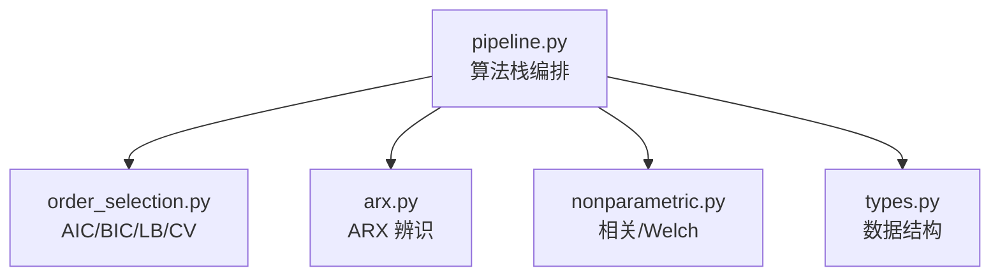
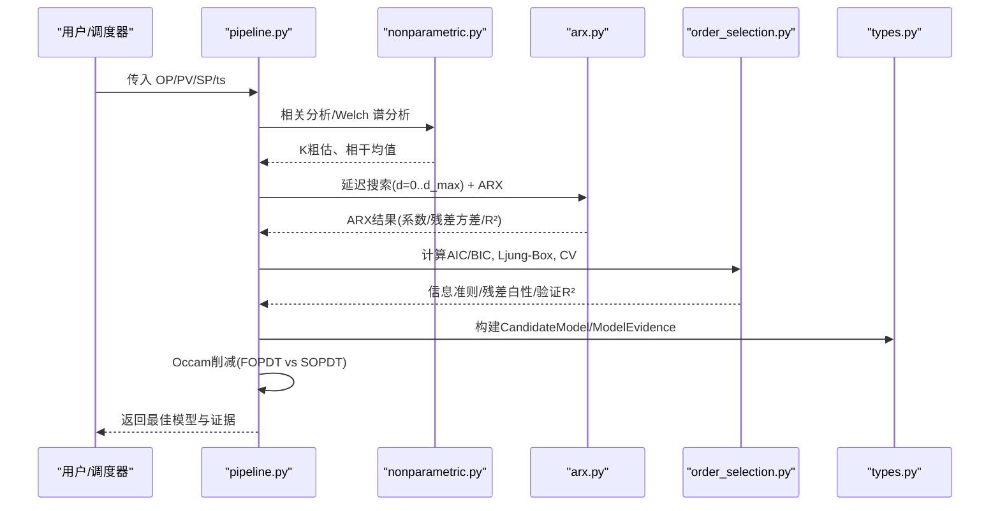
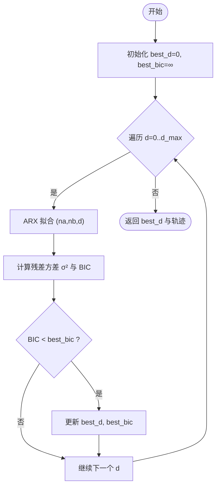
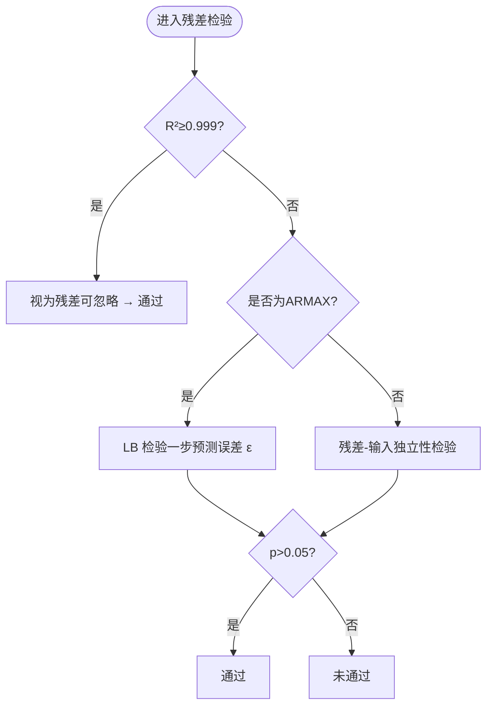
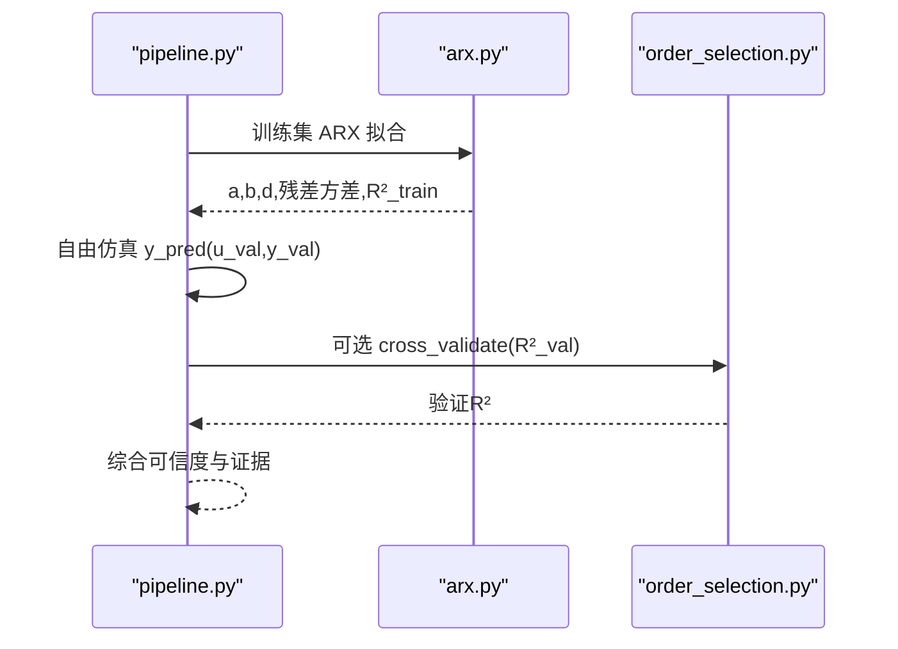
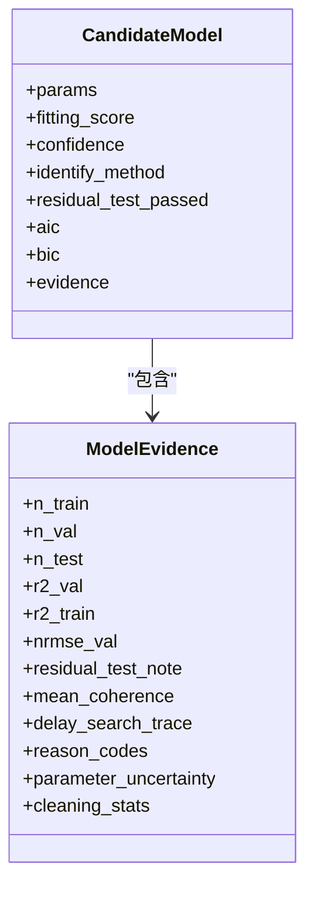
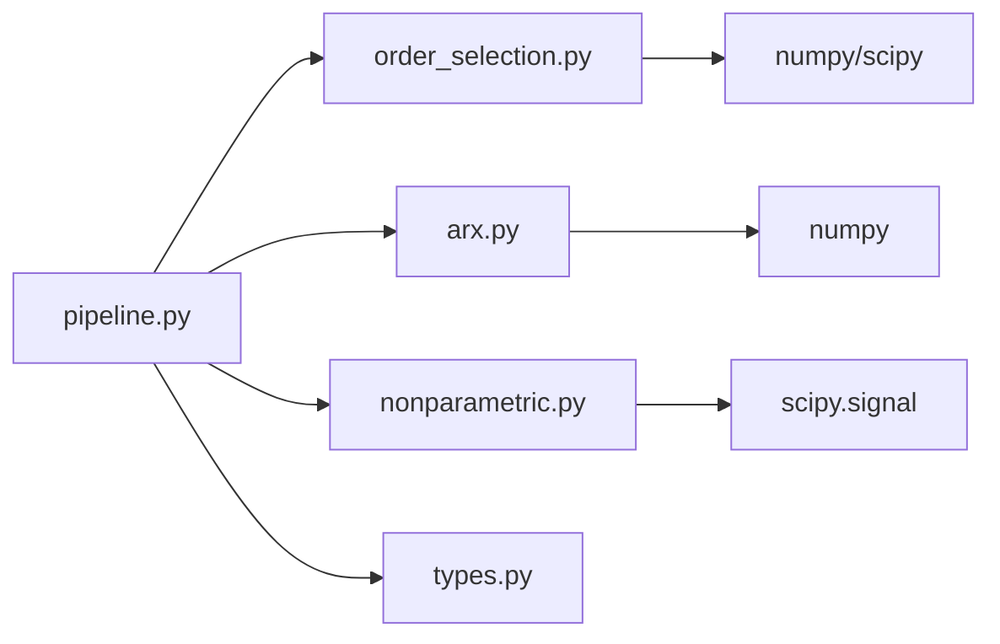

# 阶次选择策略

<cite>
**本文引用的文件**
- [pipeline.py](file://backend/app/services/tuning_identification/pipeline.py)
- [order_selection.py](file://backend/app/services/tuning_identification/order_selection.py)
- [arx.py](file://backend/app/services/tuning_identification/arx.py)
- [nonparametric.py](file://backend/app/services/tuning_identification/nonparametric.py)
- [types.py](file://backend/app/services/tuning_identification/types.py)
</cite>

## 目录
1. [简介](#简介)
2. [项目结构](#项目结构)
3. [核心组件](#核心组件)
4. [架构总览](#架构总览)
5. [详细组件分析](#详细组件分析)
6. [依赖关系分析](#依赖关系分析)
7. [性能考量](#性能考量)
8. [故障排查指南](#故障排查指南)
9. [结论](#结论)
10. [附录](#附录)

## 简介
本技术文档围绕“模型阶次选择策略”展开，聚焦于工业过程辨识中的 AIC（赤池信息准则）、BIC（贝叶斯信息准则）、FPE（预测误差方差）等准则的数学原理与适用场景；说明如何依据数据特性与控制目标确定候选阶次范围，并给出自适应阶次调整思路。文档同时阐述多模型比较机制、过拟合/欠拟合检测、基于交叉验证的选择策略，以及面向不同工业过程的阶次选择经验规则与最佳实践。

## 项目结构
与阶次选择直接相关的代码集中在后端服务模块 tuning_identification 中：
- pipeline.py：算法栈编排，串联激励检测、非参数粗估、参数化辨识、延迟搜索（阶次选择）、离散到连续转换、可信度评估与 Occam 削减。
- order_selection.py：提供 AIC/BIC/Ljung-Box 残差白噪声检验、交叉验证 R² 等工具函数。
- arx.py：ARX 辨识实现，支撑延迟搜索与参数估计。
- nonparametric.py：相关分析与 Welch 谱分析，用于 K 粗估、频域先验与相干辅助门禁。
- types.py：共享数据结构（模型类型、证据、不确定度、置信度等级等）。

**图示来源**
- [pipeline.py:1-50](file://backend/app/services/tuning_identification/pipeline.py#L1-L50)
- [order_selection.py:1-20](file://backend/app/services/tuning_identification/order_selection.py#L1-L20)
- [arx.py:1-20](file://backend/app/services/tuning_identification/arx.py#L1-L20)
- [nonparametric.py:1-20](file://backend/app/services/tuning_identification/nonparametric.py#L1-L20)
- [types.py:1-20](file://backend/app/services/tuning_identification/types.py#L1-L20)

**章节来源**
- [pipeline.py:1-50](file://backend/app/services/tuning_identification/pipeline.py#L1-L50)
- [types.py:10-20](file://backend/app/services/tuning_identification/types.py#L10-L20)

## 核心组件
- 延迟候选搜索（P2-001）：对 d=0..d_max 运行 ARX，以 BIC 选最优延迟，作为阶次/结构选择的入口之一。
- 信息准则：AIC/BIC 在训练集残差方差上计算，用于惩罚复杂度、抑制过拟合。
- 残差检验：Ljung-Box Q 检验与“残差-输入独立性”检验，判断模型是否充分。
- 交叉验证：时间顺序留出（train/val/test），自由仿真 R² 衡量泛化能力。
- Occam 削减：SOPDT 优于 FOPDT 需满足相对提升阈值且 BIC 下降，否则倾向更简单模型。

**章节来源**
- [pipeline.py:424-445](file://backend/app/services/tuning_identification/pipeline.py#L424-L445)
- [pipeline.py:823-862](file://backend/app/services/tuning_identification/pipeline.py#L823-L862)
- [order_selection.py:35-47](file://backend/app/services/tuning_identification/order_selection.py#L35-L47)
- [order_selection.py:49-74](file://backend/app/services/tuning_identification/order_selection.py#L49-L74)
- [order_selection.py:77-117](file://backend/app/services/tuning_identification/order_selection.py#L77-L117)
- [pipeline.py:1234-1268](file://backend/app/services/tuning_identification/pipeline.py#L1234-L1268)

## 架构总览
下图展示了从历史数据到最终模型选择的完整流程，突出阶次选择与信息准则在多模型比较中的作用。

**图示来源**
- [pipeline.py:209-357](file://backend/app/services/tuning_identification/pipeline.py#L209-L357)
- [pipeline.py:386-445](file://backend/app/services/tuning_identification/pipeline.py#L386-L445)
- [pipeline.py:823-862](file://backend/app/services/tuning_identification/pipeline.py#L823-L862)
- [order_selection.py:35-117](file://backend/app/services/tuning_identification/order_selection.py#L35-L117)
- [types.py:144-218](file://backend/app/services/tuning_identification/types.py#L144-L218)

## 详细组件分析

### 延迟候选搜索与 BIC 阶次选择
- 目标：在候选延迟 d∈[0, d_max] 范围内，通过 ARX 拟合与 BIC 最小化选择最优 d。
- 关键点：
  - BIC = n·ln(σ²) + k·ln(n)，其中 σ² 为残差方差，k=na+nb。
  - 搜索仅在训练集进行，避免泄露留出集信息。
  - 当显式提供 θ 时，搜索范围限定在邻域内；否则全局搜索但上限受数据长度约束。
- 输出：最优延迟 best_d 及搜索轨迹 [(d, bic)]，供审计与可视化。

**图示来源**
- [pipeline.py:823-862](file://backend/app/services/tuning_identification/pipeline.py#L823-L862)
- [arx.py:41-100](file://backend/app/services/tuning_identification/arx.py#L41-L100)

**章节来源**
- [pipeline.py:823-862](file://backend/app/services/tuning_identification/pipeline.py#L823-L862)
- [arx.py:41-100](file://backend/app/services/tuning_identification/arx.py#L41-L100)

### AIC/BIC/FPE 准则与适用场景
- AIC（赤池信息准则）：AIC = N·ln(σ²) + 2p，适用于预测精度优先、样本量有限场景，对复杂度惩罚较轻。
- BIC（贝叶斯信息准则）：BIC = N·ln(σ²) + p·ln(N)，在大样本下对复杂模型惩罚更强，倾向于更简洁模型。
- FPE（预测误差方差）：常用于线性回归模型选择，强调一步预测误差期望；在本仓库中未直接实现，可类比使用 AIC/BIC 作为代理。
- 应用要点：
  - 在训练集残差方差上计算，结合参数个数 p（或 na+nb(+nc)）进行惩罚。
  - 与留出集自由仿真 R² 联合使用，兼顾拟合与泛化。
  - 在 Occam 削减中，BIC 作为“更复杂模型必须显著更优”的门槛条件。

**章节来源**
- [order_selection.py:35-47](file://backend/app/services/tuning_identification/order_selection.py#L35-L47)
- [pipeline.py:559-563](file://backend/app/services/tuning_identification/pipeline.py#L559-L563)
- [pipeline.py:1234-1268](file://backend/app/services/tuning_identification/pipeline.py#L1234-L1268)

### 残差白噪声检验与模型充分性
- Ljung-Box Q 检验：对残差序列计算自相关，若 p > 0.05 则认为残差近似白噪声，模型充分。
- 闭环/ARMAX 情形下的三轨制：
  - 轨1：R² ≥ 0.999 时认为残差可忽略，直接通过。
  - 轨2：ARMAX 有噪声模型 C，检验一步预测误差 ε 的白性。
  - 轨3：ARX/IV 无噪声模型，采用“残差-输入独立性”检验替代 LB。
- 目的：防止欠拟合（残差仍含输入动态）与误判（有色残差被当作白噪声）。

**图示来源**
- [pipeline.py:506-542](file://backend/app/services/tuning_identification/pipeline.py#L506-L542)
- [order_selection.py:49-74](file://backend/app/services/tuning_identification/order_selection.py#L49-L74)

**章节来源**
- [pipeline.py:506-542](file://backend/app/services/tuning_identification/pipeline.py#L506-L542)
- [order_selection.py:49-74](file://backend/app/services/tuning_identification/order_selection.py#L49-L74)

### 交叉验证与泛化能力评估
- 时间顺序分割：默认 60/20/20（train/val/test），短数据退化为 70/30（无 test）。
- 自由仿真：用预测输出反馈计算留出集 R²，严格检验泛化能力，避免训练集方程误差的乐观偏差。
- 可选前段交叉验证：order_selection.cross_validate 支持前 train_ratio 训练、后段验证 R²。
- 指标：R²_val、NRMSE_val、残差检验备注、参数不确定度（Monte Carlo 传播）。

**图示来源**
- [pipeline.py:334-349](file://backend/app/services/tuning_identification/pipeline.py#L334-L349)
- [pipeline.py:491-505](file://backend/app/services/tuning_identification/pipeline.py#L491-L505)
- [pipeline.py:865-917](file://backend/app/services/tuning_identification/pipeline.py#L865-L917)
- [order_selection.py:77-117](file://backend/app/services/tuning_identification/order_selection.py#L77-L117)

**章节来源**
- [pipeline.py:334-349](file://backend/app/services/tuning_identification/pipeline.py#L334-L349)
- [pipeline.py:491-505](file://backend/app/services/tuning_identification/pipeline.py#L491-L505)
- [pipeline.py:865-917](file://backend/app/services/tuning_identification/pipeline.py#L865-L917)
- [order_selection.py:77-117](file://backend/app/services/tuning_identification/order_selection.py#L77-L117)

### 多模型比较与 Occam 削减
- 候选模型：FOPDT/SOPDT/IPDT，以及多种辨识方法（ARX/ARMAX/CLIVC）并行产出。
- 排序键：可信度等级 > 拟合度（R²_val）> 残差检验通过情况。
- Occam 削减：SOPDT 优于 FOPDT 需满足 R²_val 相对提升 > 5% 且 BIC 下降，否则保留更简单的 FOPDT。
- 证据透明：每个候选均附带 AIC/BIC、残差检验备注、清洗统计、参数不确定度等，便于审计。

**图示来源**
- [types.py:204-218](file://backend/app/services/tuning_identification/types.py#L204-L218)
- [types.py:144-200](file://backend/app/services/tuning_identification/types.py#L144-L200)
- [pipeline.py:1234-1281](file://backend/app/services/tuning_identification/pipeline.py#L1234-L1281)

**章节来源**
- [pipeline.py:1234-1281](file://backend/app/services/tuning_identification/pipeline.py#L1234-L1281)
- [types.py:144-218](file://backend/app/services/tuning_identification/types.py#L144-L218)

### 自适应阶次调整算法
- 延迟自适应：基于 BIC 的延迟搜索自动选择最优 d，避免人工设定。
- 结构自适应：Occam 削减在 FOPDT 与 SOPDT 之间自动权衡，要求复杂模型显著更优。
- 数据驱动门限：低相干（Welch 相干均值）作为辅助信号，封顶可信度但不拒绝模型。
- 可扩展方向：引入 FPE 作为备选准则；在更多候选结构（如高阶 ARX/ARMAX）上扩展搜索空间；结合 PRESS/LOOCV 进一步稳健化。

**章节来源**
- [pipeline.py:424-445](file://backend/app/services/tuning_identification/pipeline.py#L424-L445)
- [pipeline.py:555-558](file://backend/app/services/tuning_identification/pipeline.py#L555-L558)
- [pipeline.py:1234-1268](file://backend/app/services/tuning_identification/pipeline.py#L1234-L1268)

## 依赖关系分析
- pipeline.py 依赖 order_selection.py（AIC/BIC/LB/CV）、arx.py（ARX 辨识）、nonparametric.py（相关/Welch）、types.py（数据结构）。
- order_selection.py 依赖 numpy/scipy 基础库。
- arx.py 依赖 numpy 线性代数求解。
- nonparametric.py 依赖 scipy.signal 进行谱分析。

**图示来源**
- [pipeline.py:16-49](file://backend/app/services/tuning_identification/pipeline.py#L16-L49)
- [order_selection.py:12-18](file://backend/app/services/tuning_identification/order_selection.py#L12-L18)
- [arx.py:13-18](file://backend/app/services/tuning_identification/arx.py#L13-L18)
- [nonparametric.py:14-19](file://backend/app/services/tuning_identification/nonparametric.py#L14-L19)

**章节来源**
- [pipeline.py:16-49](file://backend/app/services/tuning_identification/pipeline.py#L16-L49)

## 性能考量
- 延迟搜索复杂度：O(d_max × (na+nb))，可通过限制 d_max 与并行化优化。
- 自由仿真复杂度：O(n×(na+nb))，注意初始条件与数值稳定性。
- 谱分析窗口：Welch 分段长度影响频率分辨率与方差估计稳定性。
- 大数据场景：建议分块处理、缓存中间结果、减少重复计算。

[本节为通用指导，不直接分析具体文件]

## 故障排查指南
- 数据不足：有效点数 < 50 将直接失败；检查清洗统计与缺口处理。
- 激励不足：激励检测失败将终止流程；检查 SP 变化幅度与条件数。
- 物理可行性：负增益/非最小相位零点会封顶可信度并标记原因码。
- 低相干：Welch 相干均值低于阈值将封顶可信度，提示弱线性/低信噪比。
- 残差检验失败：根据三轨制定位问题（ARMAX 噪声模型、ARX/IV 独立性）。

**章节来源**
- [pipeline.py:278-292](file://backend/app/services/tuning_identification/pipeline.py#L278-L292)
- [pipeline.py:355-364](file://backend/app/services/tuning_identification/pipeline.py#L355-L364)
- [pipeline.py:482-490](file://backend/app/services/tuning_identification/pipeline.py#L482-L490)
- [pipeline.py:555-558](file://backend/app/services/tuning_identification/pipeline.py#L555-L558)
- [pipeline.py:506-542](file://backend/app/services/tuning_identification/pipeline.py#L506-L542)

## 结论
本方案以 BIC 为核心的延迟搜索与 Occam 削减相结合，辅以 AIC、Ljung-Box 残差白噪声检验与时间顺序交叉验证，形成稳健的阶次选择与多模型比较机制。通过自由仿真 R² 与非参数一致性检查，有效缓解过拟合与欠拟合风险。面向工业过程，推荐优先尝试 FOPDT，并在显著改善时升级至 SOPDT；对积分过程采用专用 IPDT 分支。未来可引入 FPE、PRESS/LOOCV 等更丰富的准则与验证手段，进一步提升选择鲁棒性。

[本节为总结性内容，不直接分析具体文件]

## 附录
- 经验规则（基于仓库实现与注释）：
  - 短数据（<50 点）不可辨识；清洗后仍需 ≥50 点。
  - 显式 θ 时延迟搜索范围收紧；未给 θ 时全局搜索但上限受数据长度约束。
  - 低相干（<0.3）仅辅助，封顶可信度但不拒绝。
  - SOPDT 升级需满足 R²_val 相对提升 >5% 且 BIC 下降。
- 最佳实践：
  - 始终使用留出集自由仿真 R² 评估泛化能力。
  - 记录并审计 delay_search_trace、清洗统计、参数不确定度。
  - 对闭环数据启用 CLIVC（有 SP 激励时），提高一致性。

**章节来源**
- [pipeline.py:278-292](file://backend/app/services/tuning_identification/pipeline.py#L278-L292)
- [pipeline.py:320-333](file://backend/app/services/tuning_identification/pipeline.py#L320-L333)
- [pipeline.py:555-558](file://backend/app/services/tuning_identification/pipeline.py#L555-L558)
- [pipeline.py:1234-1268](file://backend/app/services/tuning_identification/pipeline.py#L1234-L1268)