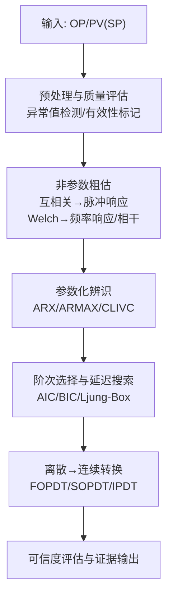
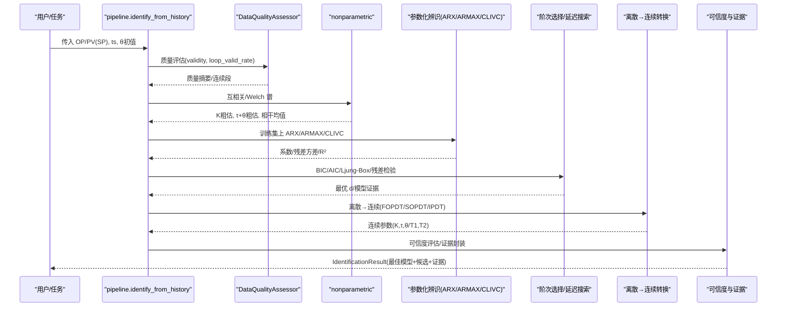
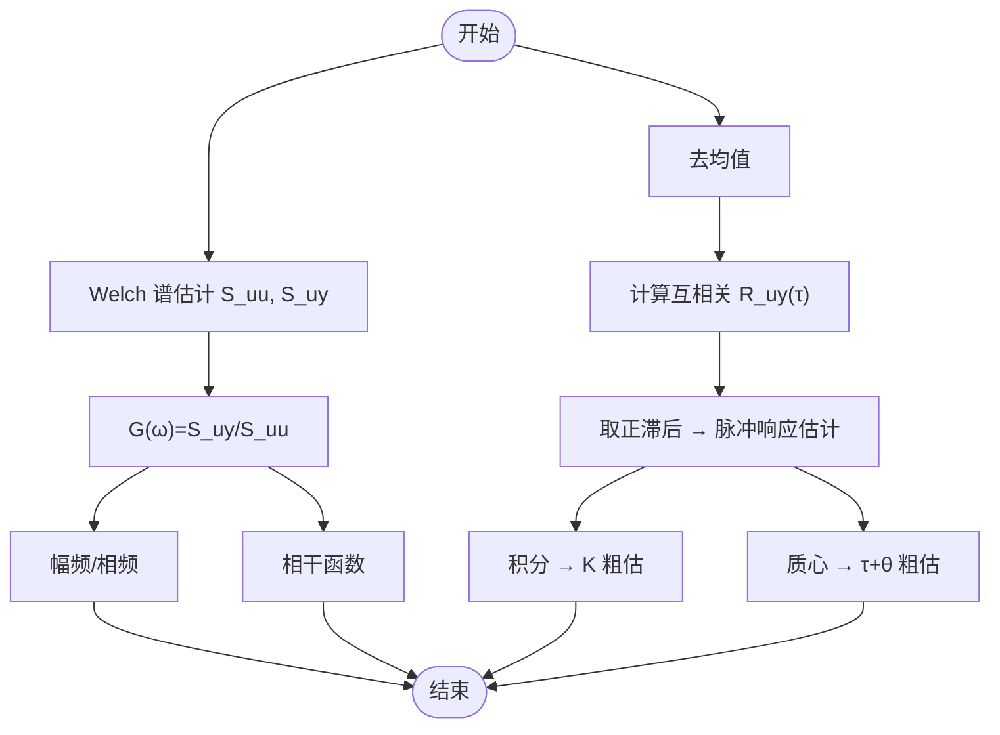
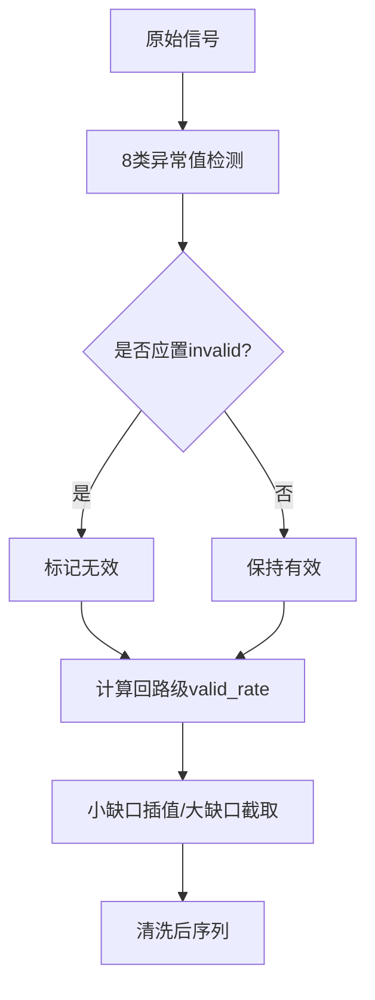
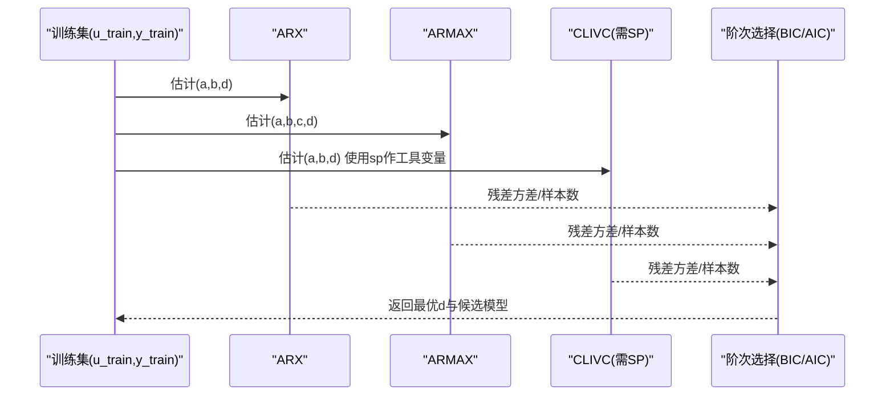
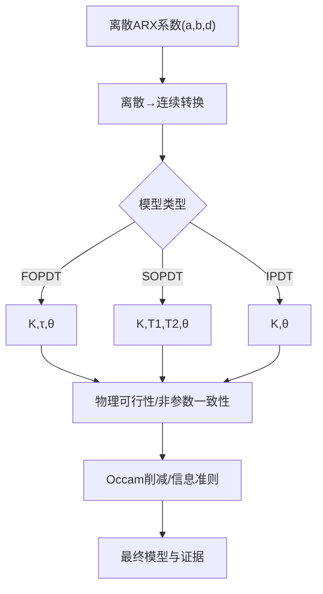
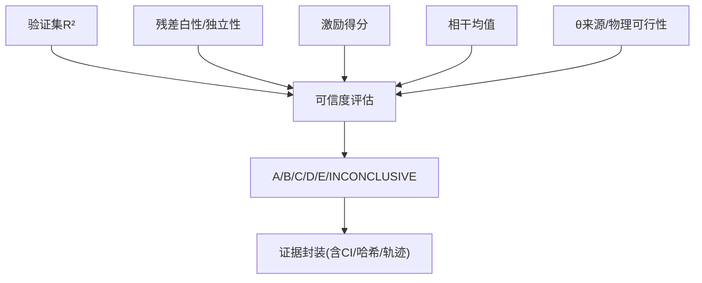
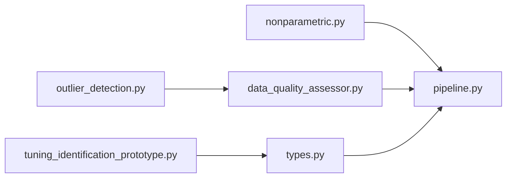

# 非参数辨识方法

<cite>
**本文引用的文件**
- [backend/app/services/tuning_identification/nonparametric.py](file://backend/app/services/tuning_identification/nonparametric.py)
- [backend/app/services/tuning_identification/pipeline.py](file://backend/app/services/tuning_identification/pipeline.py)
- [backend/app/services/tuning_identification/types.py](file://backend/app/services/tuning_identification/types.py)
- [backend/app/services/preprocessing/data_quality_assessor.py](file://backend/app/services/preprocessing/data_quality_assessor.py)
- [backend/app/services/preprocessing/outlier_detection.py](file://backend/app/services/preprocessing/outlier_detection.py)
- [backend/scripts/tuning_identification_prototype.py](file://backend/scripts/tuning_identification_prototype.py)
- [backend/tests/test_tuning_identification.py](file://backend/tests/test_tuning_identification.py)
</cite>

## 目录
1. [简介](#简介)
2. [项目结构](#项目结构)
3. [核心组件](#核心组件)
4. [架构总览](#架构总览)
5. [详细组件分析](#详细组件分析)
6. [依赖关系分析](#依赖关系分析)
7. [性能与数值特性](#性能与数值特性)
8. [故障排查指南](#故障排查指南)
9. [结论](#结论)
10. [附录：实验设计指导](#附录：实验设计指导)

## 简介
本技术文档围绕“非参数辨识方法”在工程回路整定中的落地实现，系统阐述阶跃响应法、脉冲响应法与频率响应法的原理与实践路径；说明如何从历史或实验数据中提取系统的非参数模型（脉冲响应/频率响应），并给出噪声抑制与质量门控策略；进一步解释非参数模型向参数模型（FOPDT/SOPDT/IPDT）的转换与降维近似；最后对比参数与非参数方法的适用性，并提供激励信号选择、测试时长与数据采集要求等实验设计指导。

## 项目结构
本项目将“非参数辨识”作为算法栈的层 2（粗估与频域辅助），与层 1（激励检测）、层 3（参数化辨识）、层 4（阶次选择）、层 5（离散→连续转换）串联形成端到端流程。关键模块如下：
- 非参数估计：互相关估计脉冲响应、Welch 谱估计频率响应与相干函数
- 预处理与质量评估：异常值检测、有效性标记、回路级有效占比
- 辨识管线：入口去均值、坏点清洗、延迟搜索、多方法候选生成、可信度评估
- 类型与结果：统一的数据结构与证据输出

**图表来源**
- [backend/app/services/tuning_identification/pipeline.py:209-658](file://backend/app/services/tuning_identification/pipeline.py#L209-L658)
- [backend/app/services/tuning_identification/nonparametric.py:34-103](file://backend/app/services/tuning_identification/nonparametric.py#L34-L103)
- [backend/app/services/preprocessing/data_quality_assessor.py:101-179](file://backend/app/services/preprocessing/data_quality_assessor.py#L101-L179)

**章节来源**
- [backend/app/services/tuning_identification/pipeline.py:209-658](file://backend/app/services/tuning_identification/pipeline.py#L209-L658)
- [backend/app/services/tuning_identification/nonparametric.py:34-103](file://backend/app/services/tuning_identification/nonparametric.py#L34-L103)
- [backend/app/services/preprocessing/data_quality_assessor.py:101-179](file://backend/app/services/preprocessing/data_quality_assessor.py#L101-L179)

## 核心组件
- 非参数估计
  - 互相关分析：通过 y 与 u 的归一化互相关估计脉冲响应，积分得增益 K 粗估，质心时间得 τ+θ 粗估
  - Welch 谱分析：估计 Ĝ(jω)=S_uy/S_uu，得到幅频/相频曲线与相干函数，用于线性/信噪比辅助判断
- 预处理与质量评估
  - 8 类异常值检测（超量程、冻结、跳变、尖峰、NaN、时间戳异常、质量码 Bad、高频噪声）
  - 有效性标记与回路级 valid_rate 计算，作为可信度判定的基础
- 辨识管线
  - 入口去均值（增量模型）、坏点清洗（小缺口插值/大缺口截取最长段）
  - 延迟搜索（BIC 选最优 d）、多方法候选（ARX/ARMAX/CLIVC）
  - 物理可行性门禁、非参数一致性检查、残差检验、可信度评估与证据输出

**章节来源**
- [backend/app/services/tuning_identification/nonparametric.py:34-103](file://backend/app/services/tuning_identification/nonparametric.py#L34-L103)
- [backend/app/services/preprocessing/outlier_detection.py:418-534](file://backend/app/services/preprocessing/outlier_detection.py#L418-L534)
- [backend/app/services/preprocessing/data_quality_assessor.py:101-179](file://backend/app/services/preprocessing/data_quality_assessor.py#L101-L179)
- [backend/app/services/tuning_identification/pipeline.py:209-658](file://backend/app/services/tuning_identification/pipeline.py#L209-L658)

## 架构总览
下图展示从原始数据到最终模型与证据的完整流水线，包括非参数阶段对参数阶段的支撑作用。

**图表来源**
- [backend/app/services/tuning_identification/pipeline.py:209-658](file://backend/app/services/tuning_identification/pipeline.py#L209-L658)
- [backend/app/services/tuning_identification/nonparametric.py:34-103](file://backend/app/services/tuning_identification/nonparametric.py#L34-L103)
- [backend/app/services/preprocessing/data_quality_assessor.py:101-179](file://backend/app/services/preprocessing/data_quality_assessor.py#L101-L179)

## 详细组件分析

### 非参数估计（脉冲响应与频率响应）
- 脉冲响应估计（互相关）
  - 原理：对白噪声或充分激励输入，互相关 R_uy(τ) ∝ 脉冲响应 g(τ)
  - 实现要点：去均值、取正滞后因果部分、归一化、积分得 K、质心得 τ+θ
  - 用途：独立于回归的 K 粗估、为参数化提供初值与交叉校验
- 频率响应估计（Welch）
  - 原理：Ĝ(jω)=S_uy(ω)/S_uu(ω)，得到幅频/相频与相干函数
  - 实现要点：分段 Welch 估计功率谱与互谱，避免短序列方差过大
  - 用途：辅助判断线性度与信噪比（相干低提示弱线性/低 SNR）

**图表来源**
- [backend/app/services/tuning_identification/nonparametric.py:34-103](file://backend/app/services/tuning_identification/nonparametric.py#L34-L103)

**章节来源**
- [backend/app/services/tuning_identification/nonparametric.py:34-103](file://backend/app/services/tuning_identification/nonparametric.py#L34-L103)

### 预处理与噪声抑制
- 8 类异常值检测：超量程、冻结、跳变、尖峰、NaN、时间戳异常、质量码 Bad、高频噪声
- 有效性标记：仅 TS_ANOMALY/HF_NOISE/FROZEN 标记不置 invalid；其余置 invalid
- 回路级 valid_rate：核心 tag(pv/sp/op/mode) 交集的有效点占比，作为可信度判定输入
- 坏点清洗（辨识管线内）：小缺口线性插值，大缺口截取最长连续有效段，保证后续辨识可用

**图表来源**
- [backend/app/services/preprocessing/outlier_detection.py:418-534](file://backend/app/services/preprocessing/outlier_detection.py#L418-L534)
- [backend/app/services/preprocessing/data_quality_assessor.py:101-179](file://backend/app/services/preprocessing/data_quality_assessor.py#L101-L179)
- [backend/app/services/tuning_identification/pipeline.py:93-199](file://backend/app/services/tuning_identification/pipeline.py#L93-L199)

**章节来源**
- [backend/app/services/preprocessing/outlier_detection.py:418-534](file://backend/app/services/preprocessing/outlier_detection.py#L418-L534)
- [backend/app/services/preprocessing/data_quality_assessor.py:101-179](file://backend/app/services/preprocessing/data_quality_assessor.py#L101-L179)
- [backend/app/services/tuning_identification/pipeline.py:93-199](file://backend/app/services/tuning_identification/pipeline.py#L93-L199)

### 参数化辨识与闭环一致方法
- ARX：最小二乘，适合开环或作为基线对照
- ARMAX：预测误差法，显式建模扰动通道，提升有噪场景拟合
- CLIVC（工具变量法）：在有 SP 激励时启用，外生 SP 作工具变量，闭环一致无偏
- 延迟搜索：在 d=0..d_max 范围内以 BIC 选最优 d，兼顾拟合与复杂度

**图表来源**
- [backend/app/services/tuning_identification/pipeline.py:386-466](file://backend/app/services/tuning_identification/pipeline.py#L386-L466)
- [backend/scripts/tuning_identification_prototype.py:138-332](file://backend/scripts/tuning_identification_prototype.py#L138-L332)

**章节来源**
- [backend/app/services/tuning_identification/pipeline.py:386-466](file://backend/app/services/tuning_identification/pipeline.py#L386-L466)
- [backend/scripts/tuning_identification_prototype.py:138-332](file://backend/scripts/tuning_identification_prototype.py#L138-L332)

### 非参数→参数转换与降维近似
- 离散→连续转换：ARX 系数映射至 FOPDT/SOPDT/IPDT 连续参数（K,τ,θ/T1,T2）
- Occam 削减：SOPDT 优于 FOPDT 需满足验证集 R² 相对提升 >5% 且 BIC 下降
- 物理可行性门禁：负增益/NMP 零点等不直接拒绝但封顶可信度并标注
- 非参数一致性检查：符号与量级与互相关粗估一致，否则提示可疑

**图表来源**
- [backend/app/services/tuning_identification/pipeline.py:468-637](file://backend/app/services/tuning_identification/pipeline.py#L468-L637)
- [backend/app/services/tuning_identification/types.py:69-93](file://backend/app/services/tuning_identification/types.py#L69-L93)

**章节来源**
- [backend/app/services/tuning_identification/pipeline.py:468-637](file://backend/app/services/tuning_identification/pipeline.py#L468-L637)
- [backend/app/services/tuning_identification/types.py:69-93](file://backend/app/services/tuning_identification/types.py#L69-L93)

### 可信度评估与证据输出
- 三轨残差检验：极高 R² 直接通过；ARMAX 用一步预测误差白性检验；ARX/IV 用残差-输入独立性检验
- 可信度等级：基于验证集自由仿真 R²、残差检验、激励得分、相干辅助、θ来源与物理可行性综合判定
- 证据输出：训练/验证/测试分割、R²、NRMSE、残差序列、数据哈希、延迟搜索轨迹、参数不确定度（Monte Carlo 传播）

**图表来源**
- [backend/app/services/tuning_identification/pipeline.py:506-658](file://backend/app/services/tuning_identification/pipeline.py#L506-L658)
- [backend/app/services/tuning_identification/types.py:143-200](file://backend/app/services/tuning_identification/types.py#L143-L200)

**章节来源**
- [backend/app/services/tuning_identification/pipeline.py:506-658](file://backend/app/services/tuning_identification/pipeline.py#L506-L658)
- [backend/app/services/tuning_identification/types.py:143-200](file://backend/app/services/tuning_identification/types.py#L143-L200)

## 依赖关系分析
- nonparametric 被 pipeline 调用，提供 K 粗估与相干均值
- data_quality_assessor 与 outlier_detection 为 pipeline 提供质量门控与坏点清洗前置能力
- types 定义统一数据结构，贯穿各模块输出
- prototype 脚本用于离线验证 ARX/IV/ARMAX 与离散→连续转换的正确性与鲁棒性

**图表来源**
- [backend/app/services/tuning_identification/nonparametric.py:34-103](file://backend/app/services/tuning_identification/nonparametric.py#L34-L103)
- [backend/app/services/tuning_identification/pipeline.py:209-658](file://backend/app/services/tuning_identification/pipeline.py#L209-L658)
- [backend/app/services/preprocessing/data_quality_assessor.py:101-179](file://backend/app/services/preprocessing/data_quality_assessor.py#L101-L179)
- [backend/app/services/preprocessing/outlier_detection.py:418-534](file://backend/app/services/preprocessing/outlier_detection.py#L418-L534)
- [backend/app/services/tuning_identification/types.py:69-200](file://backend/app/services/tuning_identification/types.py#L69-L200)
- [backend/scripts/tuning_identification_prototype.py:138-332](file://backend/scripts/tuning_identification_prototype.py#L138-L332)

**章节来源**
- [backend/app/services/tuning_identification/nonparametric.py:34-103](file://backend/app/services/tuning_identification/nonparametric.py#L34-L103)
- [backend/app/services/tuning_identification/pipeline.py:209-658](file://backend/app/services/tuning_identification/pipeline.py#L209-L658)
- [backend/app/services/preprocessing/data_quality_assessor.py:101-179](file://backend/app/services/preprocessing/data_quality_assessor.py#L101-L179)
- [backend/app/services/preprocessing/outlier_detection.py:418-534](file://backend/app/services/preprocessing/outlier_detection.py#L418-L534)
- [backend/app/services/tuning_identification/types.py:69-200](file://backend/app/services/tuning_identification/types.py#L69-L200)
- [backend/scripts/tuning_identification_prototype.py:138-332](file://backend/scripts/tuning_identification_prototype.py#L138-L332)

## 性能与数值特性
- 互相关与 Welch 谱均做归一化与分段估计，降低短序列方差与单位缩放影响
- 条件数与激励检测保障回归矩阵良态，避免病态解
- 残差检验采用三轨制，避免闭环有色残差导致的误判
- 参数不确定度通过解析协方差 + Monte Carlo 传播，给出 95% 置信区间

[本节为通用性能讨论，无需特定文件引用]

## 故障排查指南
- 激励不足：检查显著变化次数与条件数，必要时增加阶跃/PRBS 激励
- 数据质量差：查看异常原因码分布与 loop_valid_rate，定位 NaN/超量程/冻结/跳变/尖峰/高频噪声
- 辨识失败：确认清洗后有效点数≥50，延迟搜索范围合理，方法候选是否包含 CLIVC（闭环 SP 激励）
- 可信度过低：检查 R²_val、残差检验、相干均值、θ来源与物理可行性标志

**章节来源**
- [backend/app/services/tuning_identification/pipeline.py:355-363](file://backend/app/services/tuning_identification/pipeline.py#L355-L363)
- [backend/app/services/preprocessing/outlier_detection.py:418-534](file://backend/app/services/preprocessing/outlier_detection.py#L418-L534)
- [backend/app/services/preprocessing/data_quality_assessor.py:101-179](file://backend/app/services/preprocessing/data_quality_assessor.py#L101-L179)

## 结论
本方案以非参数估计为桥梁，结合预处理质量门控与参数化辨识，形成稳健的闭环可辨识流程。互相关与 Welch 谱提供独立于回归的粗估与频域洞察；CLIVC 解决闭环偏差；三轨残差检验与信息准则确保模型选择合理；证据链与不确定度量化支持审计与决策。该体系既适用于离线历史数据，也适配在线实验辨识。

[本节为总结性内容，无需特定文件引用]

## 附录：实验设计指导
- 激励信号选择
  - 阶跃响应法：单点或多点阶跃，便于直观观察上升时间与稳态增益；注意避免饱和与执行器限幅
  - 脉冲响应法：伪随机二进制序列（PRBS）或高斯白噪声，利于互相关估计脉冲响应与频响
  - 频率响应法：宽频激励（PRBS/扫频），配合 Welch 谱估计幅频/相频与相干函数
- 测试时长确定
  - 至少覆盖 3~5 倍主导时间常数，确保能观测到稳态与主要动态
  - 采样周期 ts 应足够小以分辨纯滞后与快速动态，同时考虑传感器带宽
- 数据采集要求
  - 保证同步采集 OP/PV（及 SP），时间戳稳定，缺失率可控
  - 记录量程与采样频率，用于异常值阈值与频域分析
  - 避免执行器饱和与控制器积分饱和，必要时限制 OP 变化速率
- 何时使用参数/非参数方法
  - 非参数优先：当需要快速诊断、频域洞察、或参数模型难以先验设定
  - 参数优先：当需要简洁模型用于控制设计、模型预测、或需要物理可解释参数
  - 混合策略：先用非参数估计初值与阶次，再进入参数化辨识与降维

[本节为通用指导，无需特定文件引用]