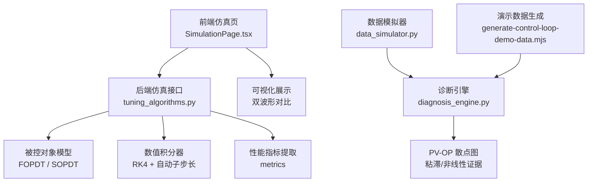
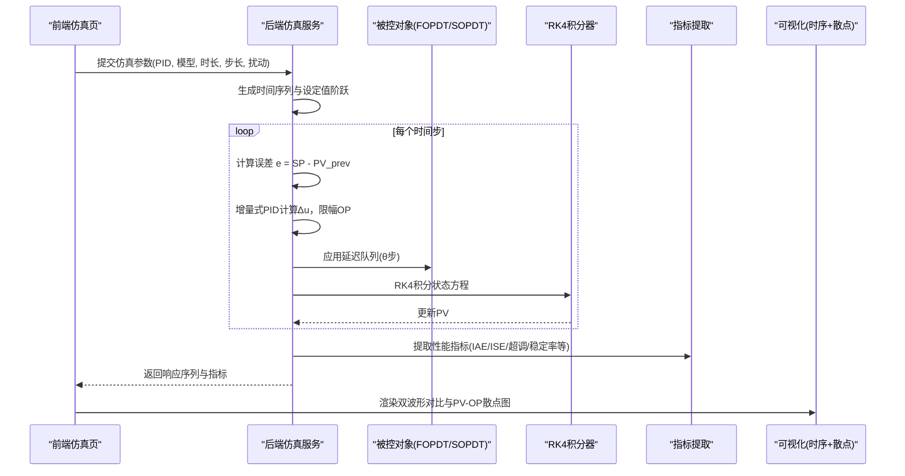
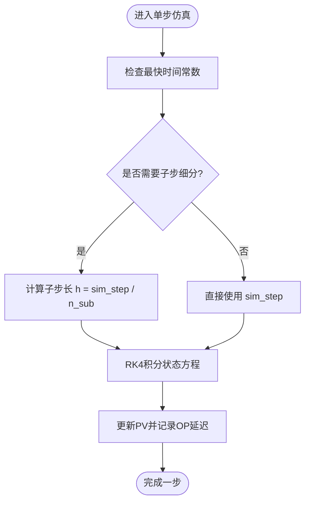
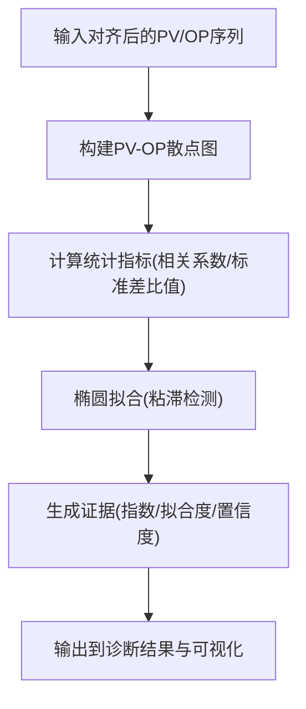
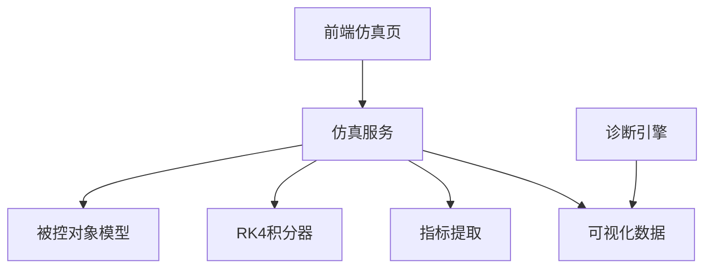

# 闭环仿真验证

<cite>
**本文引用的文件**
- [backend/app/services/tuning_algorithms.py](file://backend/app/services/tuning_algorithms.py)
- [backend/tests/compliance/test_tuning_reference.py](file://backend/tests/compliance/test_tuning_reference.py)
- [docs/设计文档/prototype/src/pages/tuning/SimulationPage.tsx](file://docs/设计文档/prototype/src/pages/tuning/SimulationPage.tsx)
- [backend/scripts/data_simulator.py](file://backend/scripts/data_simulator.py)
- [backend/app/tasks/diagnosis_engine.py](file://backend/app/tasks/diagnosis_engine.py)
- [demo-data/control-loop-second-level/generate-control-loop-demo-data.mjs](file://demo-data/control-loop-second-level/generate-control-loop-demo-data.mjs)
</cite>

## 目录
1. [简介](#简介)
2. [项目结构](#项目结构)
3. [核心组件](#核心组件)
4. [架构总览](#架构总览)
5. [详细组件分析](#详细组件分析)
6. [依赖关系分析](#依赖关系分析)
7. [性能考虑](#性能考虑)
8. [故障排查指南](#故障排查指南)
9. [结论](#结论)
10. [附录](#附录)

## 简介
本技术文档围绕“闭环仿真验证”展开，聚焦以下目标：
- 解释 RK4 数值积分算法在闭环仿真中的实现原理与稳定性保障机制。
- 说明前后窗曲线对比机制：当前 PID 与推荐 PID 的响应曲线可视化方法。
- 阐述 X-Y 散点图分析：PV-OP 轨迹分析与控制效果评估（如阀门粘滞、非线性等）。
- 明确仿真参数设置：采样频率、仿真时长、扰动注入策略。
- 提供仿真结果解读指南与异常情况诊断方法。

该文档面向具备一定自控背景的工程人员与数据工程师，既覆盖底层实现细节，也提供可操作的可视化与诊断实践。

## 项目结构
与闭环仿真验证直接相关的代码分布在后端服务、前端原型页面、测试用例以及脚本工具中：
- 后端服务：闭环仿真主流程、PID 增量式控制、对象模型（FOPDT/SOPDT）、RK4 积分与自动子步长细分。
- 前端原型：当前 PID vs 推荐 PID 的双波形对比界面与交互参数。
- 测试用例：RK4 收敛性与稳态解析解一致性验证。
- 数据模拟器：多种工况（正常、振荡、粘滞阀、饱和、过保守、过激进、手动）与质量码分布。
- 诊断引擎：基于 PV-OP 散点图的粘滞检测与多指标证据输出。
- 演示数据生成：带时变扰动的二阶回路演示数据。

图表来源
- [backend/app/services/tuning_algorithms.py:660-900](file://backend/app/services/tuning_algorithms.py#L660-L900)
- [docs/设计文档/prototype/src/pages/tuning/SimulationPage.tsx:68-267](file://docs/设计文档/prototype/src/pages/tuning/SimulationPage.tsx#L68-L267)
- [backend/scripts/data_simulator.py:480-679](file://backend/scripts/data_simulator.py#L480-L679)
- [backend/app/tasks/diagnosis_engine.py:1340-1539](file://backend/app/tasks/diagnosis_engine.py#L1340-L1539)
- [demo-data/control-loop-second-level/generate-control-loop-demo-data.mjs:188-207](file://demo-data/control-loop-second-level/generate-control-loop-demo-data.mjs#L188-L207)

章节来源
- [backend/app/services/tuning_algorithms.py:660-900](file://backend/app/services/tuning_algorithms.py#L660-L900)
- [docs/设计文档/prototype/src/pages/tuning/SimulationPage.tsx:68-267](file://docs/设计文档/prototype/src/pages/tuning/SimulationPage.tsx#L68-L267)
- [backend/scripts/data_simulator.py:480-679](file://backend/scripts/data_simulator.py#L480-L679)
- [backend/app/tasks/diagnosis_engine.py:1340-1539](file://backend/app/tasks/diagnosis_engine.py#L1340-L1539)
- [demo-data/control-loop-second-level/generate-control-loop-demo-data.mjs:188-207](file://demo-data/control-loop-second-level/generate-control-loop-demo-data.mjs#L188-L207)

## 核心组件
- 闭环仿真主函数：支持 FOPDT/SOPDT 对象、增量式 PID、RK4 积分、自动子步长细分、设定值阶跃与扰动注入、候选 PID 多组仿真对比。
- 数值积分器：四阶 Runge-Kutta（RK4），对状态方程进行高精度积分；当仿真步长过大时自动细分子步以保证精度。
- 前/后窗曲线对比：前端将当前 PID 与推荐 PID 的响应曲线叠加显示，便于直观比较动态特性与稳态偏差。
- X-Y 散点图分析：基于 PV-OP 散点图识别阀门粘滞与非线性特征，结合统计指标（相关系数、标准差比值、椭圆拟合度）给出置信度。
- 仿真参数配置：采样间隔、仿真时长、设定值阶跃幅度、扰动类型与时序。
- 异常处理与诊断：质量码统计、饱和检测、传感器故障、振荡检测等多维度证据聚合。

章节来源
- [backend/app/services/tuning_algorithms.py:660-900](file://backend/app/services/tuning_algorithms.py#L660-L900)
- [backend/tests/compliance/test_tuning_reference.py:298-350](file://backend/tests/compliance/test_tuning_reference.py#L298-L350)
- [docs/设计文档/prototype/src/pages/tuning/SimulationPage.tsx:68-267](file://docs/设计文档/prototype/src/pages/tuning/SimulationPage.tsx#L68-L267)
- [backend/app/tasks/diagnosis_engine.py:1340-1539](file://backend/app/tasks/diagnosis_engine.py#L1340-L1539)

## 架构总览
闭环仿真验证的整体流程如下：
- 输入：模型类型与参数（FOPDT/SOPDT）、当前 PID 与推荐 PID、仿真时长与步长、设定值阶跃、扰动类型。
- 计算：对每个时间步执行增量式 PID 控制，得到操纵变量 OP；通过 RK4 对被控对象状态方程积分得到 PV。
- 输出：时间戳、当前/推荐响应序列、性能指标、改善幅度；可选多组候选 PID 的响应与指标。
- 可视化：前端绘制 SP/PV/OP 时序曲线，并叠加当前与推荐两条响应曲线；同时生成 PV-OP 散点图用于诊断。

图表来源
- [backend/app/services/tuning_algorithms.py:660-900](file://backend/app/services/tuning_algorithms.py#L660-L900)
- [docs/设计文档/prototype/src/pages/tuning/SimulationPage.tsx:68-267](file://docs/设计文档/prototype/src/pages/tuning/SimulationPage.tsx#L68-L267)
- [backend/app/tasks/diagnosis_engine.py:1340-1539](file://backend/app/tasks/diagnosis_engine.py#L1340-L1539)

## 详细组件分析

### RK4 数值积分算法的实现与稳定性
- 实现要点：
  - 针对 FOPDT 与 SOPDT（标准形 T1/T2 或旧形 τ/ξ）分别定义状态导数函数。
  - 在每个仿真步内，若最快时间常数较小，则自动将步长细分为多个子步，确保 RK4 精度（子步长 ≤ 最快时间常数/4）。
  - 使用增量式 PID：比例/积分对误差，微分对测量值 PV，消除设定值阶跃引起的 derivative kick。
  - 输出限幅：OP 限制在 [-100, 100]，避免控制器输出发散。
- 稳定性与精度：
  - 通过自动子步长细分保证数值稳定性，避免大步长导致的积分误差放大。
  - 测试用例验证了与 ZOH 精确离散解的一致性（误差远小于稳态值的 1%），以及与连续解析解的末端相对误差 < 0.5%。

图表来源
- [backend/app/services/tuning_algorithms.py:844-900](file://backend/app/services/tuning_algorithms.py#L844-L900)
- [backend/tests/compliance/test_tuning_reference.py:298-350](file://backend/tests/compliance/test_tuning_reference.py#L298-L350)

章节来源
- [backend/app/services/tuning_algorithms.py:844-900](file://backend/app/services/tuning_algorithms.py#L844-L900)
- [backend/tests/compliance/test_tuning_reference.py:298-350](file://backend/tests/compliance/test_tuning_reference.py#L298-L350)

### 前后窗曲线对比机制（当前 PID vs 推荐 PID）
- 前端交互：
  - 用户可选择回路、设置仿真时长、步长、设定值阶跃幅度、扰动幅度与时序。
  - 当前 PID 与推荐 PID 的参数以卡片形式展示并可编辑。
- 可视化呈现：
  - 双波形对比图：SP（虚线）、当前参数响应（红色）、推荐参数响应（绿色）在同一坐标系下叠加。
  - 性能指标对比表：展示关键指标的当前值、推荐值与改善幅度。
- 数据来源：
  - 前端从数据集取前若干点进行仿真对比展示，构造确定性伪噪声以增强可视化效果。

图表来源
- [docs/设计文档/prototype/src/pages/tuning/SimulationPage.tsx:68-267](file://docs/设计文档/prototype/src/pages/tuning/SimulationPage.tsx#L68-L267)
- [backend/app/services/tuning_algorithms.py:660-750](file://backend/app/services/tuning_algorithms.py#L660-L750)

章节来源
- [docs/设计文档/prototype/src/pages/tuning/SimulationPage.tsx:68-267](file://docs/设计文档/prototype/src/pages/tuning/SimulationPage.tsx#L68-L267)
- [backend/app/services/tuning_algorithms.py:660-750](file://backend/app/services/tuning_algorithms.py#L660-L750)

### X-Y 散点图分析（PV-OP 轨迹与控制效果评估）
- 分析方法：
  - 基于 PV-OP 散点图识别阀门粘滞（椭圆轨迹）、非线性（Choudhury NGI/NLI）、传感器故障（冻结/漂移/噪声异常）等。
  - 统计指标包括：粘滞指数、椭圆拟合度、PV-OP 相关系数、标准差比值、饱和率、质量码占比等。
- 证据聚合：
  - 诊断引擎无条件保存散点图数据与各项指标，形成可追溯的证据链。
  - 多算法交叉验证（散点图法、Choudhury 法、Kano 统计法）提升鲁棒性。

图表来源
- [backend/app/tasks/diagnosis_engine.py:1340-1539](file://backend/app/tasks/diagnosis_engine.py#L1340-L1539)
- [backend/app/tasks/diagnosis_engine.py:2814-2879](file://backend/app/tasks/diagnosis_engine.py#L2814-L2879)

章节来源
- [backend/app/tasks/diagnosis_engine.py:1340-1539](file://backend/app/tasks/diagnosis_engine.py#L1340-L1539)
- [backend/app/tasks/diagnosis_engine.py:2814-2879](file://backend/app/tasks/diagnosis_engine.py#L2814-L2879)

### 仿真参数设置（采样频率、仿真时长、扰动注入策略）
- 采样频率与仿真时长：
  - 仿真步长 sim_step 决定采样频率；仿真时长 sim_duration 决定总步数。
  - 自动子步长细分根据最快时间常数调整，确保 RK4 精度。
- 扰动注入策略：
  - 支持多种场景：正常、振荡、阀门粘滞、OP 饱和、过保守、过激进、手动模式。
  - 演示数据生成包含时变扰动（指数衰减、正弦扰动）与质量码分布（GOOD/BAD/UNCERTAIN）。
- 设定值阶跃：
  - 通过 setpoint_step 控制阶跃幅度，用于评估响应特性（超调、调节时间、稳态偏差）。

章节来源
- [backend/app/services/tuning_algorithms.py:660-750](file://backend/app/services/tuning_algorithms.py#L660-L750)
- [backend/scripts/data_simulator.py:480-679](file://backend/scripts/data_simulator.py#L480-L679)
- [demo-data/control-loop-second-level/generate-control-loop-demo-data.mjs:188-207](file://demo-data/control-loop-second-level/generate-control-loop-demo-data.mjs#L188-L207)

## 依赖关系分析
- 模块耦合：
  - 仿真服务依赖被控对象模型与数值积分器，输出响应序列与指标。
  - 前端依赖仿真服务返回的数据进行可视化展示。
  - 诊断引擎依赖 PV-OP 序列进行多算法分析，输出证据与可视化数据。
- 外部依赖：
  - 数据模拟器提供多种工况数据，用于测试与演示。
  - 演示数据生成脚本提供带扰动的二阶回路数据，支撑诊断与可视化。

图表来源
- [backend/app/services/tuning_algorithms.py:660-900](file://backend/app/services/tuning_algorithms.py#L660-L900)
- [backend/app/tasks/diagnosis_engine.py:1340-1539](file://backend/app/tasks/diagnosis_engine.py#L1340-L1539)

章节来源
- [backend/app/services/tuning_algorithms.py:660-900](file://backend/app/services/tuning_algorithms.py#L660-L900)
- [backend/app/tasks/diagnosis_engine.py:1340-1539](file://backend/app/tasks/diagnosis_engine.py#L1340-L1539)

## 性能考虑
- 数值积分效率：
  - 自动子步长细分在保证精度的同时可能增加计算量；建议根据过程动态特性合理设置 sim_step。
- 可视化性能：
  - 前端对大数据集进行采样（如前 200 点）以提升渲染性能。
- 诊断计算：
  - 多算法交叉验证带来额外计算开销；建议在离线批处理中运行，或在实时场景中按需触发。

[本节为通用指导，不直接分析具体文件]

## 故障排查指南
- 仿真步长过大导致不稳定：
  - 现象：响应曲线出现数值振荡或发散。
  - 处理：减小 sim_step 或依赖自动子步长细分；检查最快时间常数是否过小。
- PV-OP 散点图异常：
  - 现象：散点图无清晰轨迹或拟合度低。
  - 处理：检查数据质量（质量码占比、传感器故障）、确认扰动是否充分激励。
- 性能指标异常：
  - 现象：超调过大、调节时间过长、稳态偏差显著。
  - 处理：调整 PID 参数（P/I/D），检查设定值阶跃与扰动策略是否合理。
- 诊断结果不一致：
  - 现象：不同算法对同一数据的判断存在分歧。
  - 处理：结合多指标（相关系数、标准差比值、拟合度）综合判断；必要时延长仿真时长或增强扰动。

章节来源
- [backend/app/services/tuning_algorithms.py:844-900](file://backend/app/services/tuning_algorithms.py#L844-L900)
- [backend/app/tasks/diagnosis_engine.py:1340-1539](file://backend/app/tasks/diagnosis_engine.py#L1340-L1539)
- [backend/scripts/data_simulator.py:480-679](file://backend/scripts/data_simulator.py#L480-L679)

## 结论
本闭环仿真验证体系通过 RK4 数值积分、增量式 PID 控制、前后窗曲线对比与 PV-OP 散点图分析，提供了完整的仿真、可视化与诊断能力。其核心优势在于：
- 高精度与稳定性：RK4 自动子步长细分确保数值积分精度。
- 直观对比：当前 PID 与推荐 PID 的双波形对比便于快速评估改善效果。
- 多维诊断：基于散点图的多算法交叉验证提升问题识别的鲁棒性。
- 灵活配置：支持多种扰动策略与工况模拟，适应不同控制回路特性。

建议在实际应用中：
- 根据过程动态特性合理设置仿真步长与时长。
- 结合 PV-OP 散点图与统计指标进行问题定位。
- 利用多组候选 PID 仿真对比选择最优参数。

[本节为总结性内容，不直接分析具体文件]

## 附录
- 术语表：
  - FOPDT：一阶加纯滞后对象。
  - SOPDT：二阶加纯滞后对象。
  - RK4：四阶 Runge-Kutta 数值积分方法。
  - PV：过程变量（Process Variable）。
  - OP：操纵变量（Output/Manipulated Variable）。
  - SP：设定值（Set Point）。
- 参考实现路径：
  - 闭环仿真主流程：[backend/app/services/tuning_algorithms.py:660-900](file://backend/app/services/tuning_algorithms.py#L660-L900)
  - RK4 收敛性验证：[backend/tests/compliance/test_tuning_reference.py:298-350](file://backend/tests/compliance/test_tuning_reference.py#L298-L350)
  - 前端仿真页面：[docs/设计文档/prototype/src/pages/tuning/SimulationPage.tsx:68-267](file://docs/设计文档/prototype/src/pages/tuning/SimulationPage.tsx#L68-L267)
  - 数据模拟器：[backend/scripts/data_simulator.py:480-679](file://backend/scripts/data_simulator.py#L480-L679)
  - 诊断引擎：[backend/app/tasks/diagnosis_engine.py:1340-1539](file://backend/app/tasks/diagnosis_engine.py#L1340-L1539)
  - 演示数据生成：[demo-data/control-loop-second-level/generate-control-loop-demo-data.mjs:188-207](file://demo-data/control-loop-second-level/generate-control-loop-demo-data.mjs#L188-L207)

[本节为附录信息，不直接分析具体文件]