# 处置工作流概述

<cite>
**本文引用的文件**
- [backend/app/models/loop_action_item.py](file://backend/app/models/loop_action_item.py)
- [backend/app/models/handling_order.py](file://backend/app/models/handling_order.py)
- [backend/app/api/v1/endpoints/handling.py](file://backend/app/api/v1/endpoints/handling.py)
- [backend/app/services/diagnosis_system_actions.py](file://backend/app/services/diagnosis_system_actions.py)
- [backend/app/services/loop_action_templates.py](file://backend/app/services/loop_action_templates.py)
- [backend/app/services/diagnosis_orchestrator.py](file://backend/app/services/diagnosis_orchestrator.py)
- [frontend/apps/web-antd/src/views/handling/workbench.vue](file://frontend/apps/web-antd/src/views/handling/workbench.vue)
- [frontend/apps/web-antd/src/api/handling.ts](file://frontend/apps/web-antd/src/api/handling.ts)
</cite>

## 更新摘要
**变更内容**
- 新增了 SYSTEM 源诊断建议立即生成机制，替代了之前的延迟生成方式
- 完善了六阶段处置工作流闭环：建议审核、任务管理、工单执行、归档管理和报告生成
- 增强了诊断与处置模块的集成，实现了诊断完成后的自动建议生成
- 优化了前端工作台的双 Tab 架构，支持更丰富的筛选和操作功能

## 目录
1. [简介](#简介)
2. [项目结构](#项目结构)
3. [核心组件](#核心组件)
4. [架构总览](#架构总览)
5. [详细组件分析](#详细组件分析)
6. [依赖关系分析](#依赖关系分析)
7. [性能与扩展性](#性能与扩展性)
8. [故障排查指南](#故障排查指南)
9. [结论](#结论)
10. [附录：业务流程图与数据流转图](#附录：业务流程图与数据流转图)

## 简介
本模块的目标是将"诊断建议"转化为可执行的"处置工单"，实现从问题发现、审核、执行到效果验证的完整闭环管理。采用双实体设计模式：
- 建议实体（loop_action_item）：负责"审核流程"，状态机为五态，确保建议质量与可追溯性。
- 处置工单（handling_order）：负责"执行跟踪"，状态机为六态，贯穿排程、执行、反馈、验证与闭环。

**最新更新**：系统现已实现完整的六阶段处置工作流闭环，包括建议审核、任务管理、工单执行、归档管理和报告生成。新增了 SYSTEM 源诊断建议立即生成机制，在诊断完成后自动生成标准处置建议，替代了之前的延迟生成方式，显著提升了处置效率。

处置工作台采用双 Tab 架构：
- 建议审核 Tab：处理接受/驳回/忽略操作，并支持批量转工单。
- 工单执行 Tab：管理工单清单与详情抽屉，支撑开工、反馈、提交验证、验证结论等执行动作。

## 项目结构
后端以 FastAPI 提供 REST API，模型层定义双实体及约束，迁移脚本维护数据库演进；前端通过 Vue 页面与 TypeScript API 封装调用接口，形成前后端协同的工作台体验。

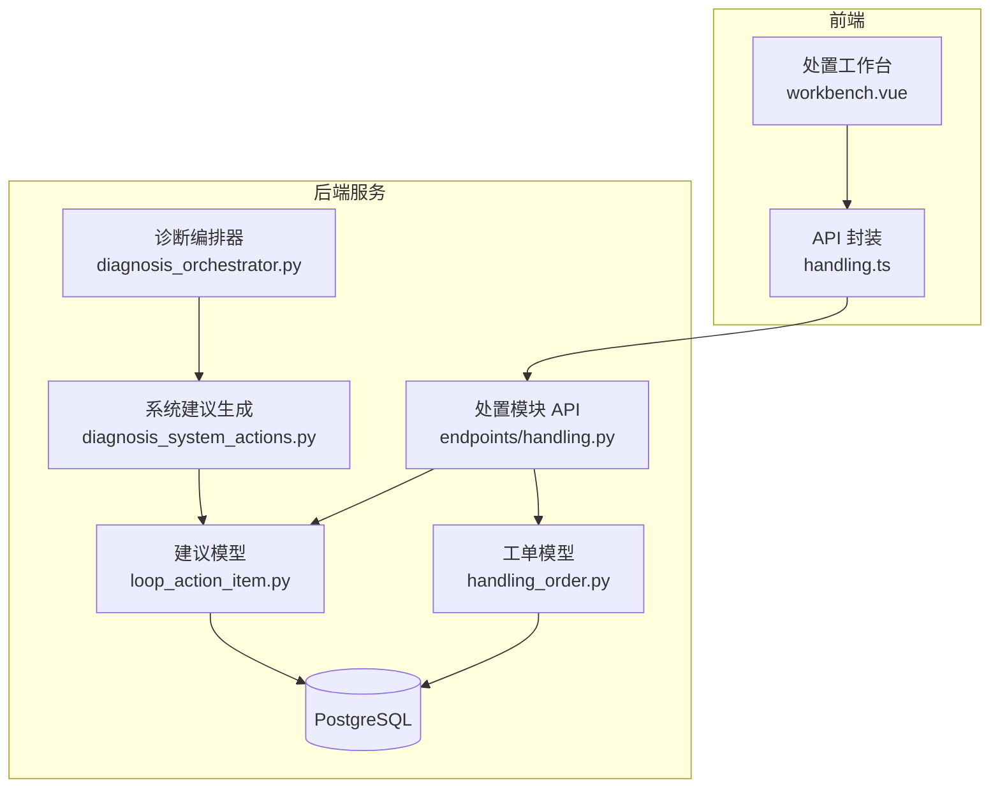

**图表来源**
- [backend/app/api/v1/endpoints/handling.py:1-30](file://backend/app/api/v1/endpoints/handling.py#L1-L30)
- [backend/app/models/loop_action_item.py:1-102](file://backend/app/models/loop_action_item.py#L1-L102)
- [backend/app/models/handling_order.py:1-121](file://backend/app/models/handling_order.py#L1-L121)
- [backend/app/services/diagnosis_system_actions.py:1-119](file://backend/app/services/diagnosis_system_actions.py#L1-L119)

**章节来源**
- [backend/app/api/v1/endpoints/handling.py:1-30](file://backend/app/api/v1/endpoints/handling.py#L1-L30)
- [backend/app/models/loop_action_item.py:1-102](file://backend/app/models/loop_action_item.py#L1-L102)
- [backend/app/models/handling_order.py:1-121](file://backend/app/models/handling_order.py#L1-L121)

## 核心组件
- 建议实体（LoopActionItem）：承载一次诊断或人工新增的处置建议，具备审核域字段（审核人/时间、驳回原因、忽略原因），以及转工单回链字段。
- 处置工单（HandlingOrder）：承载排程、执行、反馈、验证与闭环的执行载体，包含 KPI 前后快照、验证结论、关联整定记录等。
- **新增**：系统建议生成器（DiagnosisSystemActions）：在诊断完成后立即生成标准处置建议，支持幂等性和错误隔离。
- 处置模块 API：提供建议侧与工单侧的 CRUD 与状态流转接口，统一错误码与状态校验。
- 前端工作台：双 Tab 视图，分别对接建议审核与工单执行能力。

**章节来源**
- [backend/app/models/loop_action_item.py:23-102](file://backend/app/models/loop_action_item.py#L23-L102)
- [backend/app/models/handling_order.py:22-121](file://backend/app/models/handling_order.py#L22-L121)
- [backend/app/services/diagnosis_system_actions.py:46-119](file://backend/app/services/diagnosis_system_actions.py#L46-L119)
- [backend/app/api/v1/endpoints/handling.py:1-30](file://backend/app/api/v1/endpoints/handling.py#L1-L30)

## 架构总览
双实体解耦了"审核"和"执行"两个关注点，既保证建议质量，又提升执行效率。**最新改进**：通过立即生成机制，实现了诊断与处置的无缝衔接。关键特性：
- **立即生成**：诊断完成后自动生成 SYSTEM 源建议，无需等待懒加载。
- 多建议合一单：同一回路的多条已接受建议可合并生成一张工单，减少停工窗口切换成本。
- 强状态机：后端对非法迁移返回 ERR_STATE 400，终态不可重开。
- KPI 验证：提交验证时固化前后窗口快照，用于效果评估。
- 并发安全：订单号按日生成，唯一冲突自动重试一次。

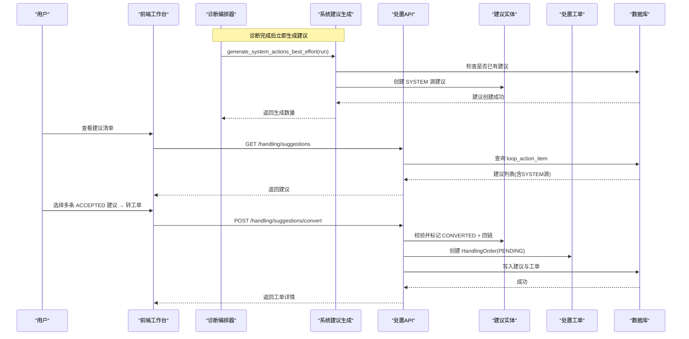

**图表来源**
- [backend/app/services/diagnosis_orchestrator.py:781-782](file://backend/app/services/diagnosis_orchestrator.py#L781-L782)
- [backend/app/services/diagnosis_system_actions.py:100-119](file://backend/app/services/diagnosis_system_actions.py#L100-L119)
- [backend/app/api/v1/endpoints/handling.py:728-798](file://backend/app/api/v1/endpoints/handling.py#L728-L798)

**章节来源**
- [backend/app/api/v1/endpoints/handling.py:728-798](file://backend/app/api/v1/endpoints/handling.py#L728-L798)

## 详细组件分析

### 双实体设计与职责边界
- 建议实体（LoopActionItem）
  - 职责：汇聚诊断/人工建议，完成审核（接受/驳回/忽略），并支持转工单。
  - 关键字段：run_id、loop_id、source、category、content、basis、priority、status、suggested_by/at、reviewed_by/at、rejected_reason、converted_order_id、ignore_reason。
  - 约束：source 枚举（SYSTEM/MANUAL）、status 五态、category 八类。
- 处置工单（HandlingOrder）
  - 职责：承载执行全流程（排程、执行、反馈、提交验证、验证结论、闭环/重开/作废）。
  - 关键字段：order_no、loop_id、source、suggestion_ids、title、action_type、action_detail、planned_at/by、handler、started_at、feedback_log、submitted_at、verify_run_id、verify_result/note/verified_by/at、kpi_before/after、tuning_record_id、cancel_reason、status。
  - 约束：source 枚举（DIAGNOSIS/MANUAL）、status 六态、action_type 八类、verify_result 二态。

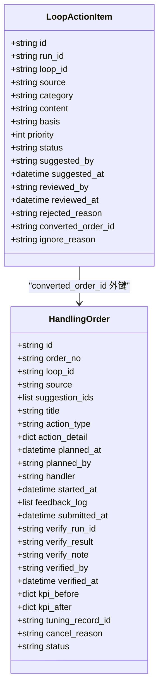

**图表来源**
- [backend/app/models/loop_action_item.py:27-102](file://backend/app/models/loop_action_item.py#L27-L102)
- [backend/app/models/handling_order.py:38-121](file://backend/app/models/handling_order.py#L38-L121)

**章节来源**
- [backend/app/models/loop_action_item.py:27-102](file://backend/app/models/loop_action_item.py#L27-L102)
- [backend/app/models/handling_order.py:38-121](file://backend/app/models/handling_order.py#L38-L121)

### 建议审核状态机（五态）
- 状态集合：PENDING（待审核）、ACCEPTED（已接受）、CONVERTED（已转工单）、REJECTED（已驳回）、IGNORED（已忽略）。
- 转换规则：
  - PENDING → ACCEPTED（接受）
  - PENDING → REJECTED（驳回，需填写原因）
  - PENDING → IGNORED（忽略，需填写原因）
  - ACCEPTED → CONVERTED（转工单）
- 终态：CONVERTED、REJECTED、IGNORED 不可再变更。

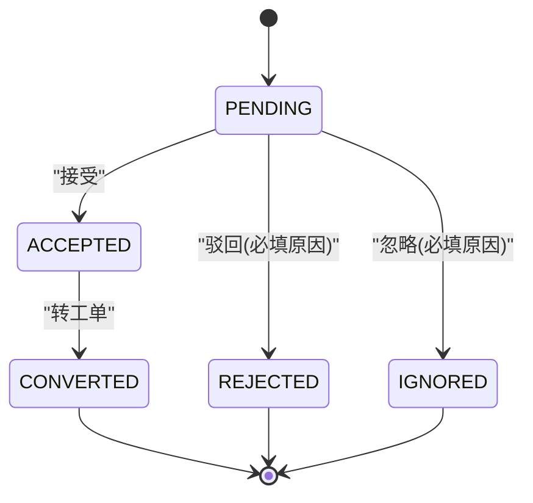

**图表来源**
- [backend/app/models/loop_action_item.py:23-24](file://backend/app/models/loop_action_item.py#L23-L24)
- [backend/app/api/v1/endpoints/handling.py:668-725](file://backend/app/api/v1/endpoints/handling.py#L668-L725)

**章节来源**
- [backend/app/models/loop_action_item.py:23-24](file://backend/app/models/loop_action_item.py#L23-L24)
- [backend/app/api/v1/endpoints/handling.py:668-725](file://backend/app/api/v1/endpoints/handling.py#L668-L725)

### 处置工单状态机（六态）
- 状态集合：PENDING（待执行）、EXECUTING（执行中）、VERIFYING（验证中）、CLOSED（已闭环）、REOPENED（重开）、CANCELLED（已作废）。
- 转换规则：
  - PENDING → EXECUTING（开工）
  - EXECUTING → VERIFYING（提交验证）
  - VERIFYING → CLOSED（验证有效）
  - VERIFYING → REOPENED（验证无效）
  - PENDING → CANCELLED（作废，需填写原因）
  - REOPENED → EXECUTING（再次开工）
- 终态：CLOSED、CANCELLED 不可再变更。

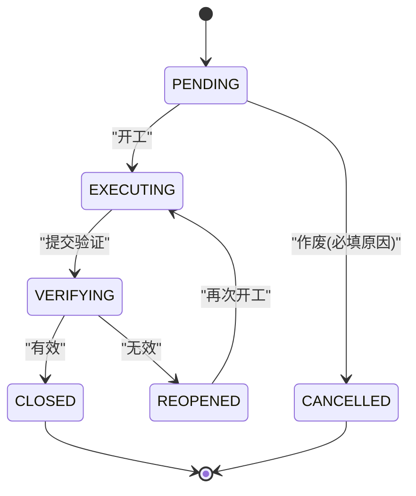

**图表来源**
- [backend/app/models/handling_order.py:34-35](file://backend/app/models/handling_order.py#L34-L35)
- [backend/app/api/v1/endpoints/handling.py:1043-1050](file://backend/app/api/v1/endpoints/handling.py#L1043-L1050)

**章节来源**
- [backend/app/models/handling_order.py:34-35](file://backend/app/models/handling_order.py#L34-L35)
- [backend/app/api/v1/endpoints/handling.py:1043-1050](file://backend/app/api/v1/endpoints/handling.py#L1043-L1050)

### 系统建议立即生成机制
**新增功能**：实现了诊断完成后的立即建议生成机制，替代了之前的延迟生成方式。

- **触发时机**：诊断编排器在完成诊断结果落库后立即调用 `generate_system_actions_best_effort`。
- **幂等保护**：内置幂等守卫，如果该诊断运行已存在任何建议记录则跳过生成。
- **分类来源**：优先使用人工复核结论，否则使用诊断结论的主分类和次分类。
- **错误隔离**：生成失败仅记录日志并回滚事务，不阻塞诊断主链路。
- **标准模板**：基于8类诊断原因的标准处置建议模板，包含优先级和内容描述。

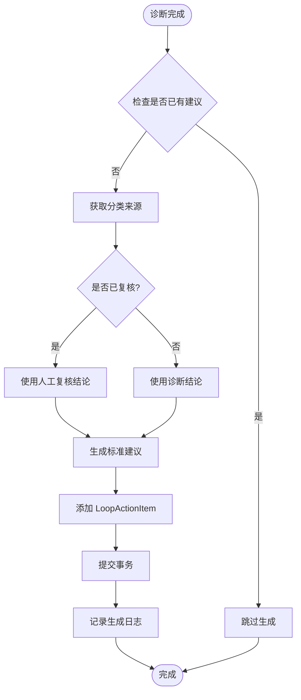

**图表来源**
- [backend/app/services/diagnosis_system_actions.py:46-97](file://backend/app/services/diagnosis_system_actions.py#L46-L97)
- [backend/app/services/diagnosis_orchestrator.py:781-782](file://backend/app/services/diagnosis_orchestrator.py#L781-L782)

**章节来源**
- [backend/app/services/diagnosis_system_actions.py:46-119](file://backend/app/services/diagnosis_system_actions.py#L46-L119)
- [backend/app/services/loop_action_templates.py:15-133](file://backend/app/services/loop_action_templates.py#L15-L133)
- [backend/app/services/diagnosis_orchestrator.py:781-782](file://backend/app/services/diagnosis_orchestrator.py#L781-L782)

### 多建议合一单与冲突处理
- 合并逻辑：
  - 仅允许同一回路的多条 ACCEPTED 建议合并为一张工单。
  - 工单创建后，所有被合并的建议状态置为 CONVERTED，并写入 converted_order_id 回链。
  - 工单的 suggestion_ids 保存来源建议 ID 数组，便于溯源。
- 冲突处理：
  - 订单号按日生成（HD-YYYYMMDD-NNN），若并发导致唯一冲突，捕获 IntegrityError 后序号+1 重试一次。
  - 若建议 ID 无效或部分非 ACCEPTED，直接返回参数错误。

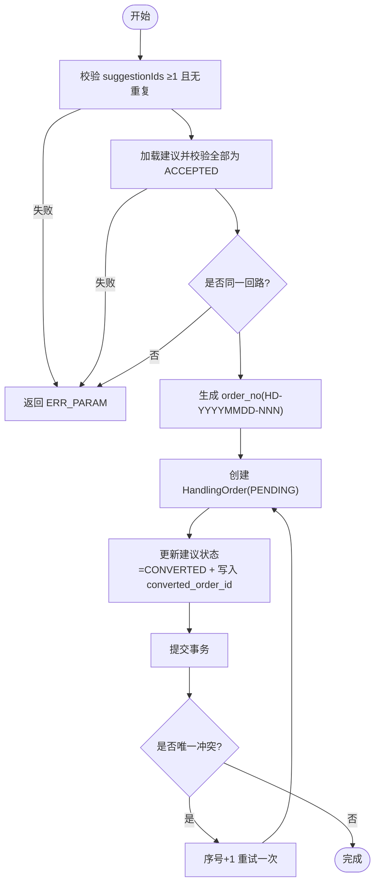

**图表来源**
- [backend/app/api/v1/endpoints/handling.py:728-798](file://backend/app/api/v1/endpoints/handling.py#L728-L798)
- [backend/app/api/v1/endpoints/handling.py:405-413](file://backend/app/api/v1/endpoints/handling.py#L405-L413)

**章节来源**
- [backend/app/api/v1/endpoints/handling.py:728-798](file://backend/app/api/v1/endpoints/handling.py#L728-L798)
- [backend/app/api/v1/endpoints/handling.py:405-413](file://backend/app/api/v1/endpoints/handling.py#L405-L413)

### 处置工作台双 Tab 架构
- 建议审核 Tab：
  - 功能：展示建议清单（分页/筛选/状态分组排序），支持接受、驳回、忽略与批量转工单。
  - 交互：点击"转工单"弹出选择框，勾选同回路的多条已接受建议，提交后生成工单。
  - **增强**：支持按来源（SYSTEM/MANUAL）筛选，显示建议统计卡片。
- 工单执行 Tab：
  - 功能：展示工单清单（分页/筛选/状态分组排序），支持查看详情抽屉（含来源建议摘要、KPI 前后对比预览）。
  - 交互：开工、执行反馈、提交验证、验证结论、作废等操作。
  - **增强**：支持任务视图（PENDING/REOPENED）和工单视图（EXECUTING/VERIFYING）预设。

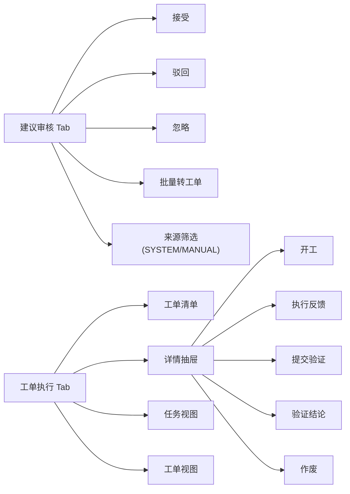

**图表来源**
- [frontend/apps/web-antd/src/views/handling/workbench.vue:85-104](file://frontend/apps/web-antd/src/views/handling/workbench.vue#L85-L104)
- [frontend/apps/web-antd/src/views/handling/workbench.vue:166-190](file://frontend/apps/web-antd/src/views/handling/workbench.vue#L166-L190)

**章节来源**
- [frontend/apps/web-antd/src/views/handling/workbench.vue:85-104](file://frontend/apps/web-antd/src/views/handling/workbench.vue#L85-L104)
- [frontend/apps/web-antd/src/views/handling/workbench.vue:166-190](file://frontend/apps/web-antd/src/views/handling/workbench.vue#L166-L190)

### KPI 验证与效果闭环
- 验证窗口：前窗 = 开工前 24h 基线，后窗 = 提交验证后 24h；两侧窗口隔离，处置执行期数据不参与对比。
- 快照来源：服务端在提交验证时拉取最新有 score 的 KPI 快照，并固化工单的 kpi_before/kpi_after。
- 结果判定：验证结论 EFFECTIVE/INEFFECTIVE，影响工单进入 CLOSED 或 REOPENED。

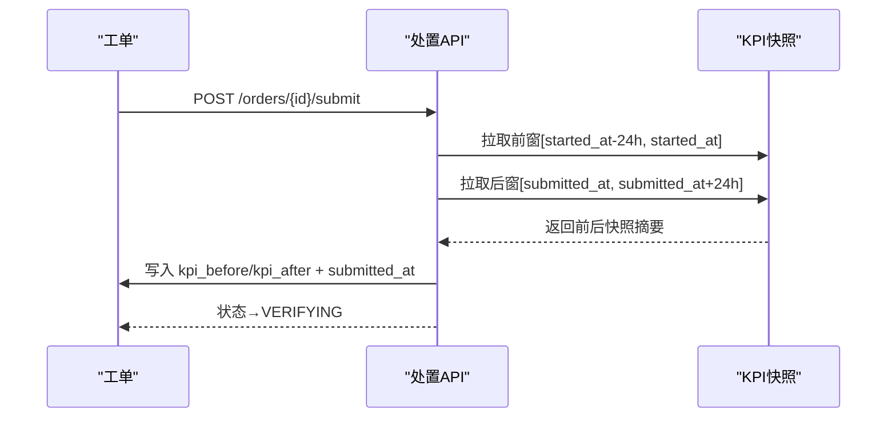

**图表来源**
- [backend/app/api/v1/endpoints/handling.py:353-373](file://backend/app/api/v1/endpoints/handling.py#L353-L373)
- [backend/app/api/v1/endpoints/handling.py:311-331](file://backend/app/api/v1/endpoints/handling.py#L311-L331)

**章节来源**
- [backend/app/api/v1/endpoints/handling.py:353-373](file://backend/app/api/v1/endpoints/handling.py#L353-L373)
- [backend/app/api/v1/endpoints/handling.py:311-331](file://backend/app/api/v1/endpoints/handling.py#L311-L331)

## 依赖关系分析
- 模型依赖：
  - LoopActionItem 通过 converted_order_id 外键指向 HandlingOrder，形成"建议→工单"的回溯链路。
  - HandlingOrder 通过 loop_id 关联回路，便于按回路聚合查询。
- **新增服务依赖**：
  - DiagnosisSystemActions 依赖 LoopActionTemplates 标准模板和 DiagnosisRun 诊断结果。
  - DiagnosisOrchestrator 在诊断完成后调用系统建议生成器。
- API 依赖：
  - 建议侧接口依赖 LoopActionItem 模型与角色权限校验。
  - 工单侧接口依赖 HandlingOrder 模型、KPI 快照表、可选整定记录表（热插拔）。
- 前端依赖：
  - workbench.vue 通过 handling.ts 封装的 API 调用后端接口，驱动双 Tab 交互。

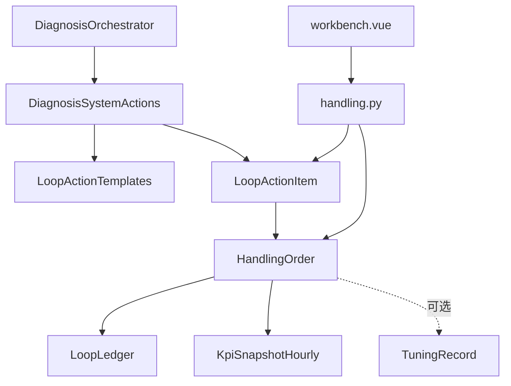

**图表来源**
- [backend/app/models/loop_action_item.py:64-77](file://backend/app/models/loop_action_item.py#L64-L77)
- [backend/app/models/handling_order.py:48-89](file://backend/app/models/handling_order.py#L48-L89)
- [backend/app/services/diagnosis_system_actions.py:23-25](file://backend/app/services/diagnosis_system_actions.py#L23-L25)
- [backend/app/services/diagnosis_orchestrator.py:781-782](file://backend/app/services/diagnosis_orchestrator.py#L781-L782)

**章节来源**
- [backend/app/models/loop_action_item.py:64-77](file://backend/app/models/loop_action_item.py#L64-L77)
- [backend/app/models/handling_order.py:48-89](file://backend/app/models/handling_order.py#L48-L89)
- [backend/app/services/diagnosis_system_actions.py:23-25](file://backend/app/services/diagnosis_system_actions.py#L23-L25)

## 性能与扩展性
- 性能要点：
  - 列表查询使用索引优化（如 idx_loop_action_item_status、idx_handling_order_status）。
  - 订单号生成采用 COUNT+1 策略，并发冲突时重试一次，避免阻塞。
  - KPI 快照查询限制为窗口内最新一条，降低 IO 压力。
  - **新增**：系统建议生成采用幂等检查，避免重复生成。
- 扩展新处置类型：
  - 在 ACTION_TYPES 中添加新类型，并在 _ACTION_TYPE_LABELS 添加中文标签。
  - 如需新增 action_detail 子字段校验，在 _validate_action_detail 中补充逻辑。
  - 在 STANDARD_ACTION_TEMPLATES 中添加新类型的标准建议模板。
  - 前端需在表单与详情中适配新类型的字段展示与校验。

**章节来源**
- [backend/app/models/handling_order.py:22-32](file://backend/app/models/handling_order.py#L22-L32)
- [backend/app/api/v1/endpoints/handling.py:63-73](file://backend/app/api/v1/endpoints/handling.py#L63-L73)
- [backend/app/services/loop_action_templates.py:15-133](file://backend/app/services/loop_action_templates.py#L15-L133)

## 故障排查指南
- 常见错误：
  - ERR_PARAM：参数校验失败（如 suggestionIds 为空、actionType 不合法、必填原因缺失）。
  - ERR_STATE：状态迁移非法（如从终态发起操作、当前状态不允许该动作）。
  - ERR_NOT_FOUND：建议或工单不存在。
  - **新增**：系统建议生成失败会被捕获并记录日志，不影响诊断主流程。
- 定位方法：
  - 检查请求体字段是否符合接口契约。
  - 核对当前实体的状态与目标动作是否匹配。
  - 查看数据库约束（如唯一约束导致的 IntegrityError）与重试日志。
  - **新增**：检查诊断编排器的日志输出，确认系统建议生成是否成功。

**章节来源**
- [backend/app/api/v1/endpoints/handling.py:109-127](file://backend/app/api/v1/endpoints/handling.py#L109-L127)
- [backend/app/api/v1/endpoints/handling.py:280-297](file://backend/app/api/v1/endpoints/handling.py#L280-L297)
- [backend/app/services/diagnosis_system_actions.py:112-118](file://backend/app/services/diagnosis_system_actions.py#L112-L118)

## 结论
处置工作流通过双实体设计将"审核"与"执行"解耦，结合严格的状态机与 KPI 验证机制，实现了从问题发现到效果验证的闭环管理。**最新改进**：通过立即生成机制，实现了诊断与处置的无缝衔接，显著提升了处置效率和用户体验。多建议合一单提升了现场处置效率，并发安全与索引优化保障了系统稳定性。未来可通过扩展处置类型与细化 action_detail 校验进一步增强灵活性。

## 附录：业务流程图与数据流转图

### 端到端业务流程图
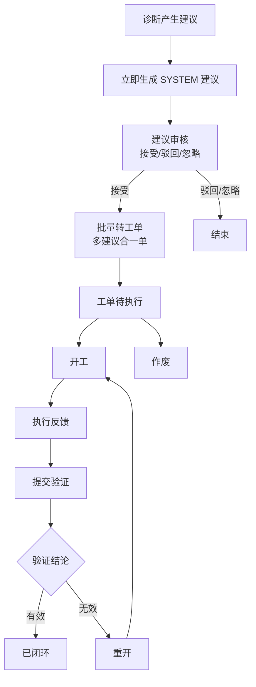

**图表来源**
- [backend/app/services/diagnosis_orchestrator.py:781-782](file://backend/app/services/diagnosis_orchestrator.py#L781-L782)
- [backend/app/services/diagnosis_system_actions.py:46-97](file://backend/app/services/diagnosis_system_actions.py#L46-L97)
- [backend/app/api/v1/endpoints/handling.py:728-798](file://backend/app/api/v1/endpoints/handling.py#L728-L798)

### 数据流转图
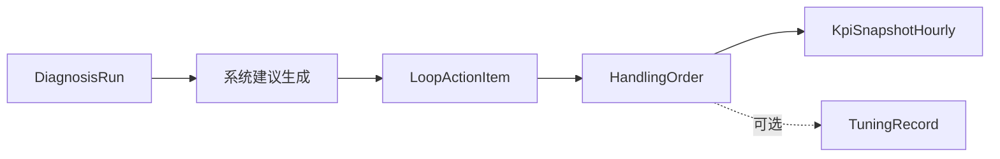

**图表来源**
- [backend/app/services/diagnosis_orchestrator.py:781-782](file://backend/app/services/diagnosis_orchestrator.py#L781-L782)
- [backend/app/services/diagnosis_system_actions.py:46-97](file://backend/app/services/diagnosis_system_actions.py#L46-L97)
- [backend/app/models/loop_action_item.py:35-46](file://backend/app/models/loop_action_item.py#L35-L46)
- [backend/app/models/handling_order.py:48-89](file://backend/app/models/handling_order.py#L48-L89)