# 处置工作流模块

<cite>
**本文引用的文件**
- [backend/app/models/loop_action_item.py](file://backend/app/models/loop_action_item.py)
- [backend/app/models/handling_order.py](file://backend/app/models/handling_order.py)
- [backend/app/api/v1/endpoints/handling.py](file://backend/app/api/v1/endpoints/handling.py)
- [backend/alembic/versions/a5b6c7d8e9f0_handling_module_v2_dual_entity.py](file://backend/alembic/versions/a5b6c7d8e9f0_handling_module_v2_dual_entity.py)
- [backend/tests/test_handling_api.py](file://backend/tests/test_handling_api.py)
</cite>

## 目录
1. [简介](#简介)
2. [项目结构](#项目结构)
3. [核心组件](#核心组件)
4. [架构总览](#架构总览)
5. [详细组件分析](#详细组件分析)
6. [依赖关系分析](#依赖关系分析)
7. [性能考量](#性能考量)
8. [故障排查指南](#故障排查指南)
9. [结论](#结论)
10. [附录](#附录)

## 简介
本模块实现“处置工作流”的双实体设计：建议实体（loop_action_item）与处置工单（handling_order）。建议实体承载“审核域”，具备五态状态机；工单实体承载“执行域”，具备六态状态机，并支持编号 HD-YYYYMMDD-NNN、多建议合一单、KPI 前后对比验证、归档统计等能力。处置工作台提供双 Tab：建议审核（接受/驳回/忽略 + 批量转工单）与工单执行（清单 + 详情抽屉含反馈追加/提交验证/KPI 对比/闭环重开）。

## 项目结构
- 数据模型
  - loop_action_item：建议实体（审核对象），五态状态机（PENDING/ACCEPTED/CONVERTED/REJECTED/IGNORED）
  - handling_order：工单实体（执行对象），六态状态机（PENDING/EXECUTING/VERIFYING/CLOSED/REOPENED/CANCELLED）
- API 端点
  - /handling/suggestions：建议 CRUD 与审核流转
  - /handling/orders：工单 CRUD 与执行流转
  - /handling/loops、/handling/statistics：档案聚合与统计
- 迁移脚本
  - v2.0 双实体重构：新增 handling_order，改造 loop_action_item，存量数据迁移，索引优化

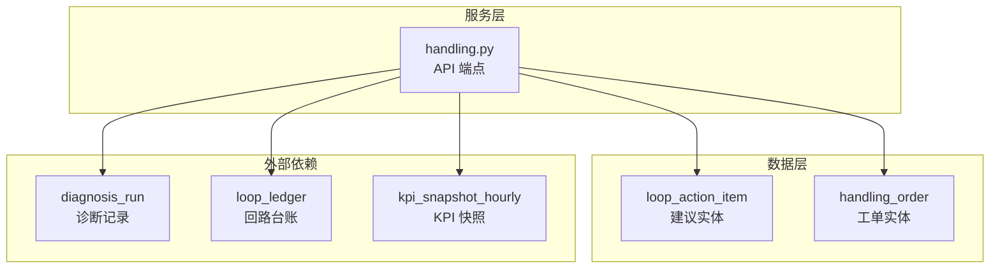

图表来源
- [backend/app/models/loop_action_item.py:27-102](file://backend/app/models/loop_action_item.py#L27-L102)
- [backend/app/models/handling_order.py:38-121](file://backend/app/models/handling_order.py#L38-L121)
- [backend/app/api/v1/endpoints/handling.py:1-30](file://backend/app/api/v1/endpoints/handling.py#L1-L30)

章节来源
- [backend/app/models/loop_action_item.py:27-102](file://backend/app/models/loop_action_item.py#L27-L102)
- [backend/app/models/handling_order.py:38-121](file://backend/app/models/handling_order.py#L38-L121)
- [backend/app/api/v1/endpoints/handling.py:1-30](file://backend/app/api/v1/endpoints/handling.py#L1-L30)

## 核心组件
- 建议实体（LoopActionItem）
  - 字段覆盖：来源（SYSTEM/MANUAL）、分类、内容、依据、优先级、生命周期（五态）、审核人/时间、驳回原因、转工单回链、忽略原因
  - 约束：source/status/category 的 CHECK 约束，索引优化建议清单查询
- 工单实体（HandlingOrder）
  - 字段覆盖：编号 order_no（HD-YYYYMMDD-NNN）、来源（DIAGNOSIS/MANUAL）、suggestion_ids（多建议合一）、标题、处置类型（8 类）、结构化 action_detail、计划时间/排程人、执行人/开始时间、反馈日志、提交时间、验证信息（复诊记录、结果、备注、验证人/时间）、KPI 前后快照摘要、整定记录关联、作废原因、生命周期（六态）
  - 约束：source/status/action_type/verify_result 的 CHECK 约束，索引优化工单列表与计划查询
- API 端点（handling.py）
  - 建议侧：清单、手动新增、接受、驳回、忽略、批量转工单
  - 工单侧：清单、详情、手动新建、开工、反馈、提交验证、验证结论、作废、KPI 对比预览
  - 聚合：按回路聚合（双实体口径）、统计（月度趋势、类型分布、装置分布、Top 重开）

章节来源
- [backend/app/models/loop_action_item.py:27-102](file://backend/app/models/loop_action_item.py#L27-L102)
- [backend/app/models/handling_order.py:38-121](file://backend/app/models/handling_order.py#L38-L121)
- [backend/app/api/v1/endpoints/handling.py:552-1657](file://backend/app/api/v1/endpoints/handling.py#L552-L1657)

## 架构总览
处置工作流采用“建议-工单”双实体解耦：
- 建议实体负责“审核域”，将系统或人工建议收敛为可审核项，支持接受/驳回/忽略，并接受批量转工单
- 工单实体负责“执行域”，承载从排程到执行、验证、闭环的全流程，支持 KPI 前后对比验证与归档统计
- 通过外键与 JSONB 字段建立双向追溯：建议→工单（converted_order_id），工单→建议（suggestion_ids）

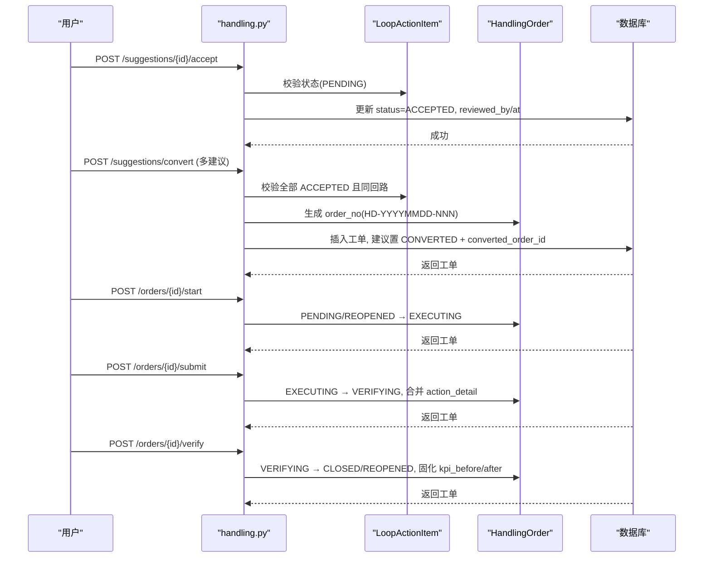

图表来源
- [backend/app/api/v1/endpoints/handling.py:657-787](file://backend/app/api/v1/endpoints/handling.py#L657-L787)
- [backend/app/api/v1/endpoints/handling.py:1043-1183](file://backend/app/api/v1/endpoints/handling.py#L1043-L1183)

## 详细组件分析

### 建议实体（LoopActionItem）与五态状态机
- 状态定义：PENDING → ACCEPTED → CONVERTED；PENDING → REJECTED / IGNORED（终态）
- 关键行为
  - 接受：仅允许 PENDING，记录审核人与时间
  - 驳回：仅允许 PENDING，必填驳回原因，进入终态
  - 忽略：仅允许 PENDING，必填忽略原因，进入终态
  - 转工单：仅 ACCEPTED 且同一回路的多条建议可合并为一单，各自置 CONVERTED 并回链 converted_order_id
- 数据完整性
  - source/status/category 的 CHECK 约束
  - 索引 idx_loop_action_item_status(status, suggested_at DESC) 优化建议清单排序

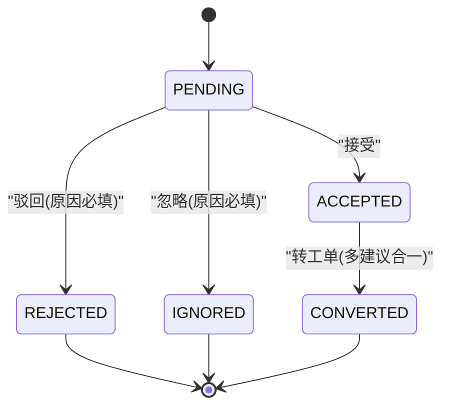

图表来源
- [backend/app/models/loop_action_item.py:23-102](file://backend/app/models/loop_action_item.py#L23-L102)
- [backend/app/api/v1/endpoints/handling.py:657-787](file://backend/app/api/v1/endpoints/handling.py#L657-L787)

章节来源
- [backend/app/models/loop_action_item.py:23-102](file://backend/app/models/loop_action_item.py#L23-L102)
- [backend/app/api/v1/endpoints/handling.py:657-787](file://backend/app/api/v1/endpoints/handling.py#L657-L787)

### 工单实体（HandlingOrder）与六态状态机
- 状态定义：PENDING → EXECUTING → VERIFYING → CLOSED/REOPENED；PENDING → CANCELLED（终态）
- 关键行为
  - 开工：仅允许 PENDING/REOPENED；REOPENED 再开工清空上一轮验证字段
  - 反馈：EXECUTING 自环，追加 feedback_log，状态不变
  - 提交验证：仅允许 EXECUTING；actionDetail 必填（TUNING 需 pidAfter）；合并开工时已填详情
  - 验证结论：仅允许 VERIFYING；服务端固化 kpi_before/kpi_after；EFFECTIVE→CLOSED，INEFFECTIVE→REOPENED
  - 作废：仅允许 PENDING；cancelReason 必填
- 编号规则：order_no = HD-YYYYMMDD-NNN（按日重置序号，唯一冲突重试一次）
- 数据完整性
  - source/status/action_type/verify_result 的 CHECK 约束
  - 索引 idx_handling_order_status(status, updated_at DESC)、idx_handling_order_planned(planned_at)、idx_handling_order_loop(loop_id)

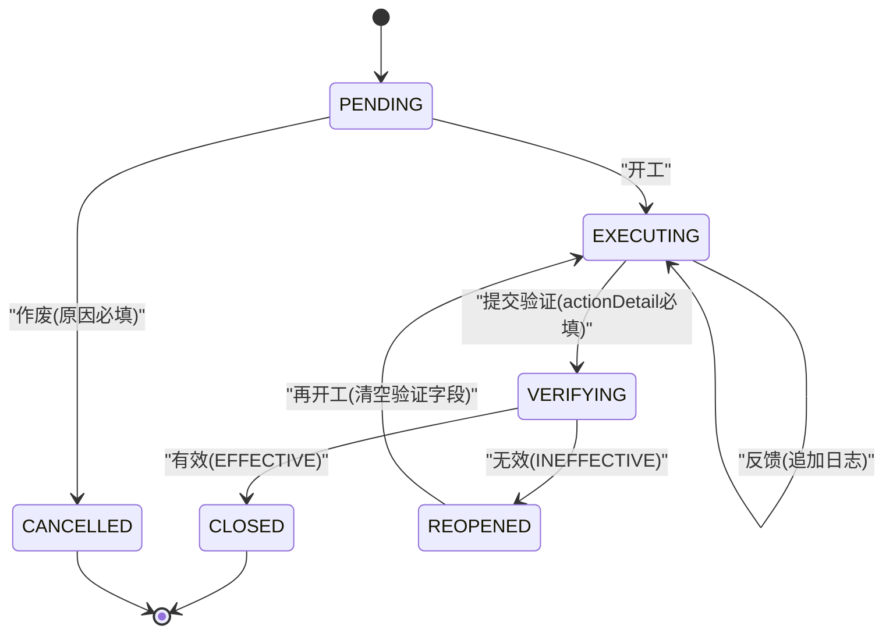

图表来源
- [backend/app/models/handling_order.py:34-121](file://backend/app/models/handling_order.py#L34-L121)
- [backend/app/api/v1/endpoints/handling.py:1043-1183](file://backend/app/api/v1/endpoints/handling.py#L1043-L1183)

章节来源
- [backend/app/models/handling_order.py:34-121](file://backend/app/models/handling_order.py#L34-L121)
- [backend/app/api/v1/endpoints/handling.py:1043-1183](file://backend/app/api/v1/endpoints/handling.py#L1043-L1183)

### 处置工作台双 Tab 设计
- 建议审核 Tab
  - 功能：建议清单（分页/筛选/状态分组排序 + convertedOrderNo）、手动新增建议、接受/驳回/忽略、批量转工单
  - 权限：IC_ENGINEER/PE_ENGINEER/ADMIN 可写；SPONSOR/EXPERT 只读（403）
- 工单执行 Tab
  - 功能：工单清单（分页/筛选/状态分组排序）、详情抽屉（action_detail、feedback_log、kpi_before/after、来源建议摘要）、反馈追加、提交验证、验证结论、KPI 对比预览
  - 权限：同上

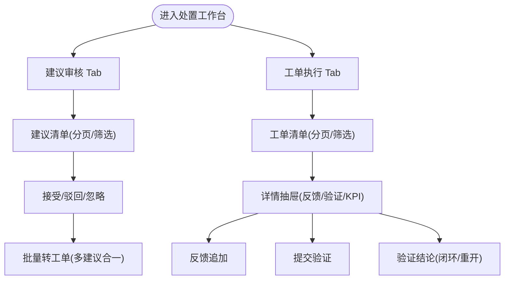

图表来源
- [backend/app/api/v1/endpoints/handling.py:552-787](file://backend/app/api/v1/endpoints/handling.py#L552-L787)
- [backend/app/api/v1/endpoints/handling.py:866-1227](file://backend/app/api/v1/endpoints/handling.py#L866-L1227)

章节来源
- [backend/app/api/v1/endpoints/handling.py:552-787](file://backend/app/api/v1/endpoints/handling.py#L552-L787)
- [backend/app/api/v1/endpoints/handling.py:866-1227](file://backend/app/api/v1/endpoints/handling.py#L866-L1227)

### 多建议合一单的合并逻辑与冲突处理
- 合并规则
  - 仅 ACCEPTED 的建议可转工单
  - 多条建议必须属于同一回路
  - 生成一张工单，suggestion_ids 记录所有建议 id
  - 各建议置 CONVERTED 并回链 converted_order_id
- 冲突处理
  - order_no 唯一冲突：捕获 IntegrityError，rollback 后序号+1 重试一次
  - 并发安全：COUNT+1 生成序号，失败则重试

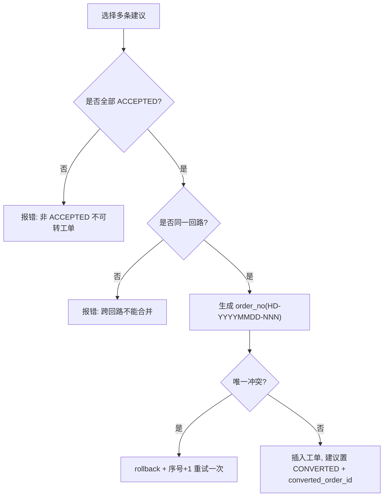

图表来源
- [backend/app/api/v1/endpoints/handling.py:717-787](file://backend/app/api/v1/endpoints/handling.py#L717-L787)

章节来源
- [backend/app/api/v1/endpoints/handling.py:717-787](file://backend/app/api/v1/endpoints/handling.py#L717-L787)

### KPI 前后对比验证的实现机制
- 窗口定义（v2.0）
  - 前窗：[started_at − 24h, started_at]（基线期，隔离处置执行期数据）
  - 后窗：[submitted_at, submitted_at + 24h]（线上效果期）
- 数据来源：kpi_snapshot_hourly 最新一条有 score 的记录
- 固化时机：验证结论时（verify）写入 kpi_before/kpi_after；提交验证时（submit）仅标记 submitted_at
- 预览接口：/orders/{id}/kpi-comparison（VERIFYING 阶段实时拉取，不落库）

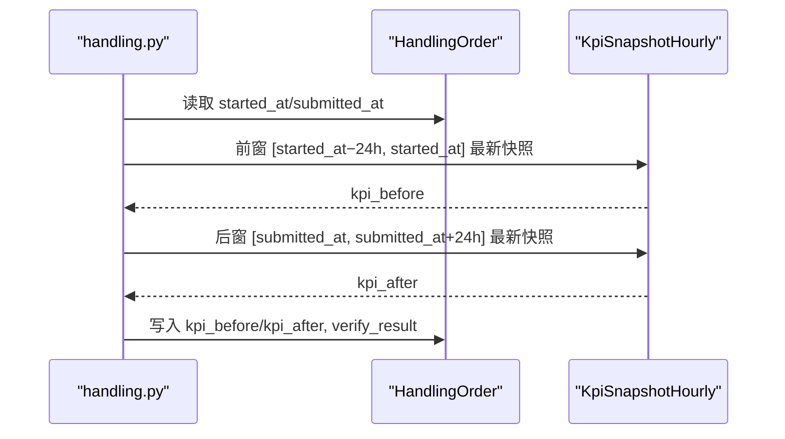

图表来源
- [backend/app/api/v1/endpoints/handling.py:323-362](file://backend/app/api/v1/endpoints/handling.py#L323-L362)
- [backend/app/api/v1/endpoints/handling.py:1136-1183](file://backend/app/api/v1/endpoints/handling.py#L1136-L1183)
- [backend/app/api/v1/endpoints/handling.py:1202-1227](file://backend/app/api/v1/endpoints/handling.py#L1202-L1227)

章节来源
- [backend/app/api/v1/endpoints/handling.py:323-362](file://backend/app/api/v1/endpoints/handling.py#L323-L362)
- [backend/app/api/v1/endpoints/handling.py:1136-1183](file://backend/app/api/v1/endpoints/handling.py#L1136-L1183)
- [backend/app/api/v1/endpoints/handling.py:1202-1227](file://backend/app/api/v1/endpoints/handling.py#L1202-L1227)

### 工单生命周期管理与归档统计
- 生命周期管理
  - 建议：PENDING → ACCEPTED/REJECTED/IGNORED；ACCEPTED → CONVERTED
  - 工单：PENDING → EXECUTING → VERIFYING → CLOSED/REOPENED；PENDING → CANCELLED
- 归档统计
  - 回路聚合：建议五态分布 + 工单六态分布 + 闭环率 + 最近闭环 KPI delta + 最近活动
  - 统计页：本月闭环数/闭环率/平均处置时长/无效重开率/平均 KPI 改善分/驳回率/平均排程周期；近 N 月趋势；类型分布；装置分布；Top 重开

章节来源
- [backend/app/api/v1/endpoints/handling.py:1230-1657](file://backend/app/api/v1/endpoints/handling.py#L1230-L1657)

### 权限控制
- 角色白名单：IC_ENGINEER/PE_ENGINEER/ADMIN 可写；SPONSOR/EXPERT 只读（403）
- 所有写端点使用 require_roles(*_HANDLING_ROLES) 进行鉴权

章节来源
- [backend/app/api/v1/endpoints/handling.py:60-62](file://backend/app/api/v1/endpoints/handling.py#L60-L62)
- [backend/tests/test_handling_api.py:251-264](file://backend/tests/test_handling_api.py#L251-L264)

### 扩展新处置类型的步骤
- 在 ACTION_TYPES 中新增类型枚举
- 在 _ACTION_TYPE_LABELS 中添加中文标签
- 在 submit 校验中按需增加 actionDetail 子字段校验（如 TUNING 的 pidAfter）
- 在统计与聚合中确保新类型被正确计数与展示

章节来源
- [backend/app/models/handling_order.py:22-32](file://backend/app/models/handling_order.py#L22-L32)
- [backend/app/api/v1/endpoints/handling.py:63-73](file://backend/app/api/v1/endpoints/handling.py#L63-L73)
- [backend/app/api/v1/endpoints/handling.py:379-387](file://backend/app/api/v1/endpoints/handling.py#L379-L387)

## 依赖关系分析
- 模型依赖
  - LoopActionItem 依赖 diagnosis_run（run_id，可选）、loop_ledger（loop_id）
  - HandlingOrder 依赖 loop_ledger（loop_id）、diagnosis_run（verify_run_id，可选）
- API 依赖
  - handling.py 依赖 models、schemas、core.db、core.exceptions、core.modules（tuning 模块热插拔）
- 外部集成
  - tuning 模块：TUNING 类型工单在 submit/verify 时回写整定记录状态（软依赖）

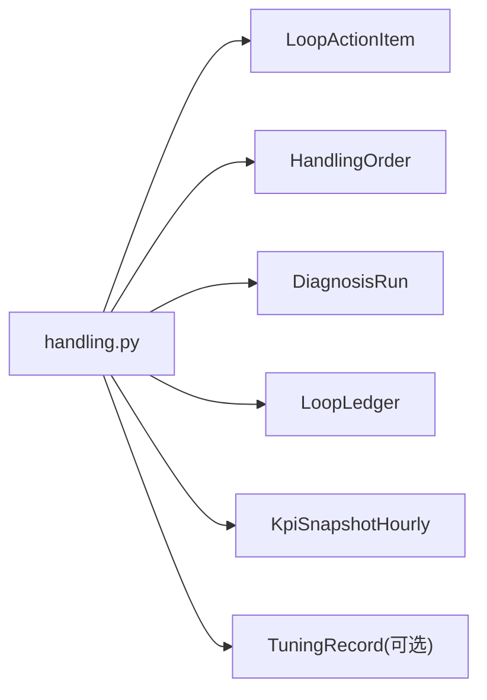

图表来源
- [backend/app/api/v1/endpoints/handling.py:44-56](file://backend/app/api/v1/endpoints/handling.py#L44-L56)
- [backend/app/models/loop_action_item.py:35-46](file://backend/app/models/loop_action_item.py#L35-L46)
- [backend/app/models/handling_order.py:48-89](file://backend/app/models/handling_order.py#L48-L89)

章节来源
- [backend/app/api/v1/endpoints/handling.py:44-56](file://backend/app/api/v1/endpoints/handling.py#L44-L56)
- [backend/app/models/loop_action_item.py:35-46](file://backend/app/models/loop_action_item.py#L35-L46)
- [backend/app/models/handling_order.py:48-89](file://backend/app/models/handling_order.py#L48-L89)

## 性能考量
- 索引优化
  - 建议清单：idx_loop_action_item_status(status, suggested_at DESC)
  - 工单清单：idx_handling_order_status(status, updated_at DESC)、idx_handling_order_planned(planned_at)、idx_handling_order_loop(loop_id)
- 查询优化
  - 使用原生 SQL 拼装 WHERE 子句与排序，避免 ORM 懒加载导致的额外查询
  - 窗口内 KPI 快照查询限制为 1 条（最新有 score 的记录）
- 并发处理
  - order_no 唯一冲突捕获 IntegrityError，rollback 后序号+1 重试一次
- 序列化安全
  - commit 后 db.refresh 再序列化，避免 updated_at 过期属性懒加载触发 500

章节来源
- [backend/app/api/v1/endpoints/handling.py:394-403](file://backend/app/api/v1/endpoints/handling.py#L394-L403)
- [backend/app/api/v1/endpoints/handling.py:1080-1083](file://backend/app/api/v1/endpoints/handling.py#L1080-L1083)
- [backend/alembic/versions/a5b6c7d8e9f0_handling_module_v2_dual_entity.py:172-179](file://backend/alembic/versions/a5b6c7d8e9f0_handling_module_v2_dual_entity.py#L172-L179)

## 故障排查指南
- 常见错误码
  - ERR_STATE：当前状态不允许该操作（如非 PENDING 尝试接受）
  - ERR_PARAM：参数缺失或非法（如驳回原因必填、actionType 非法）
  - ERR_NOT_FOUND：建议/工单不存在
  - 403：无权限（SPONSOR/EXPERT 尝试写操作）
- 排查要点
  - 检查状态机转换是否合法
  - 检查必填字段是否完整（rejectedReason/ignoreReason/cancelReason）
  - 检查 TUNING 类型 actionDetail.pidAfter 是否填写
  - 检查 order_no 唯一冲突重试逻辑是否生效
  - 检查 KPI 窗口是否正确（started_at/submitted_at 口径）

章节来源
- [backend/app/api/v1/endpoints/handling.py:109-127](file://backend/app/api/v1/endpoints/handling.py#L109-L127)
- [backend/tests/test_handling_api.py:215-358](file://backend/tests/test_handling_api.py#L215-L358)
- [backend/tests/test_handling_api.py:531-748](file://backend/tests/test_handling_api.py#L531-L748)

## 结论
处置工作流模块通过“建议-工单”双实体清晰分离审核与执行职责，结合严格的状态机与权限控制，实现了从建议汇聚、审核、转工单、执行、验证到闭环的全链路管理。KPI 前后对比验证以窗口化方式隔离处置执行期数据，确保效果评估客观可靠。归档统计提供多维度的洞察，支撑持续改进。扩展新处置类型成本低，具备良好的可维护性与可扩展性。

## 附录
- 状态流转图（建议）
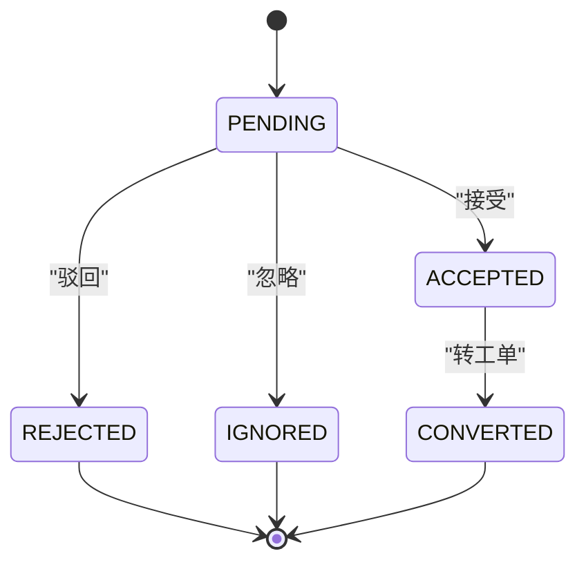
- 状态流转图（工单）
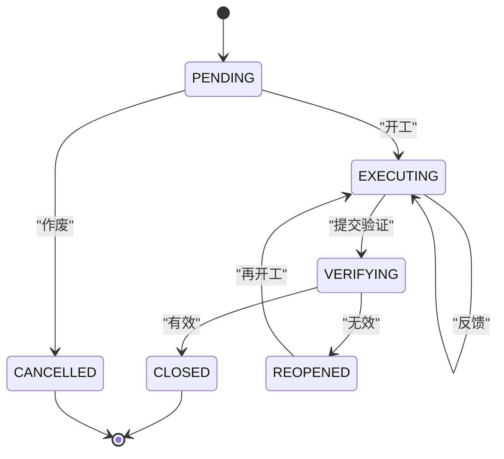
- 业务流程图（处置工作台）
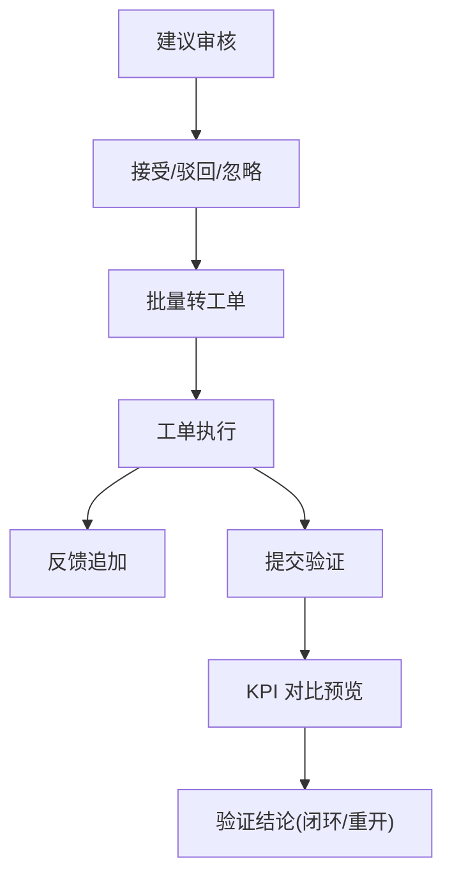