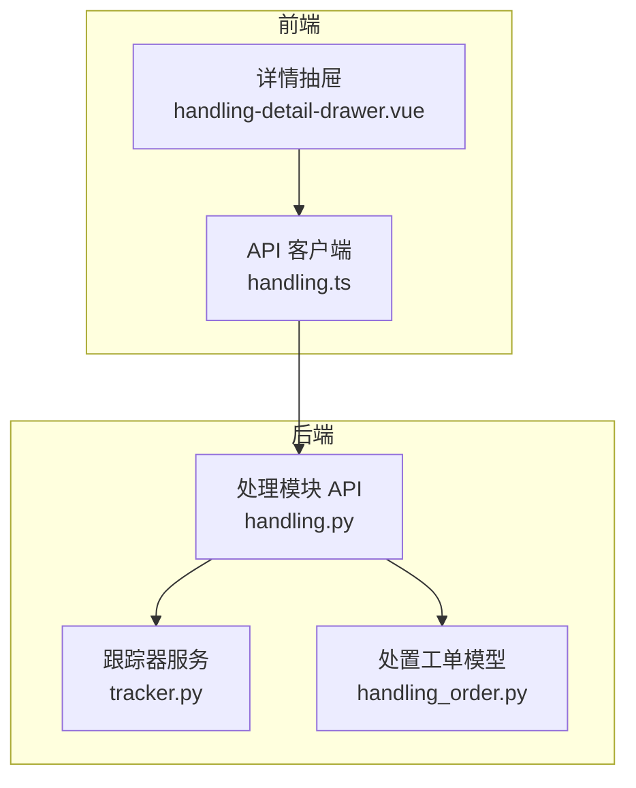
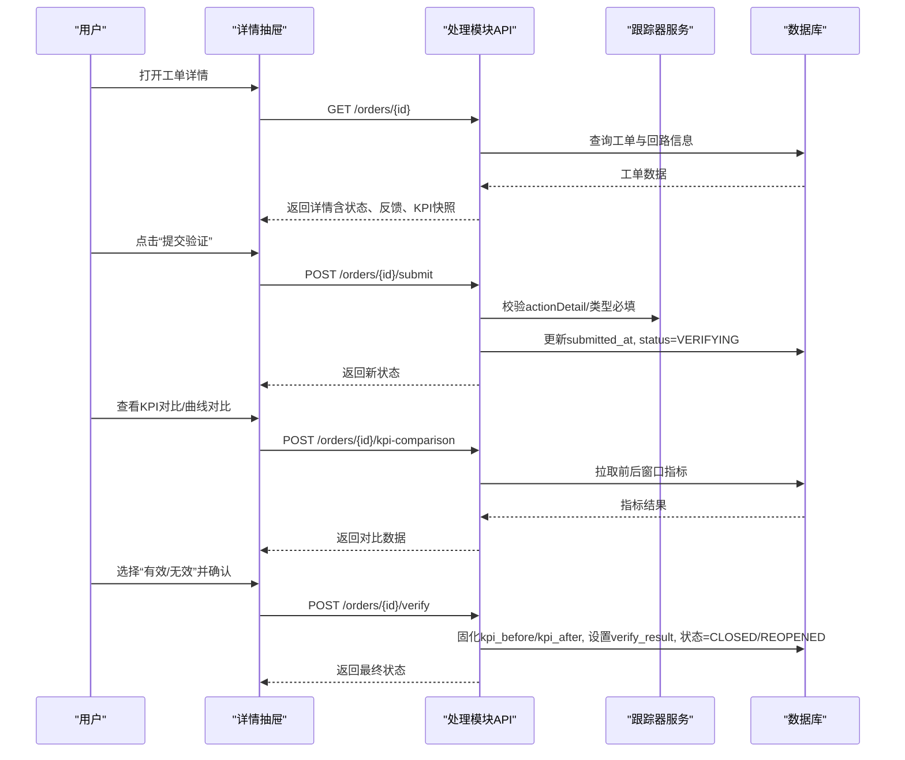
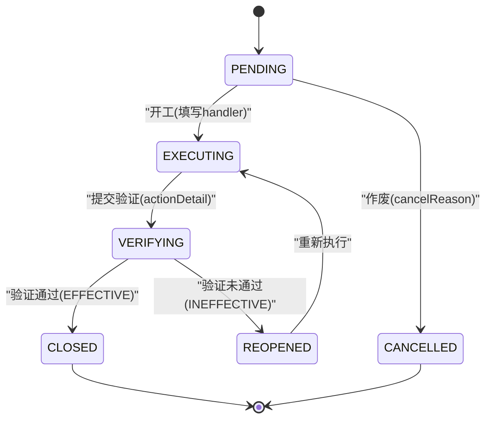
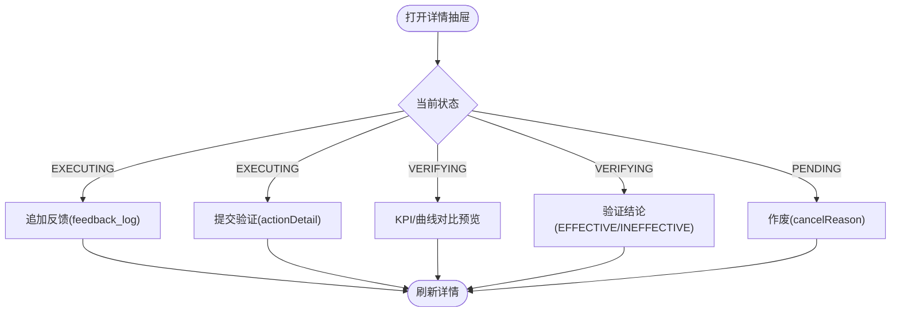
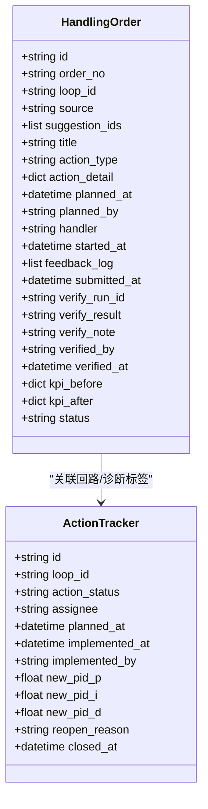
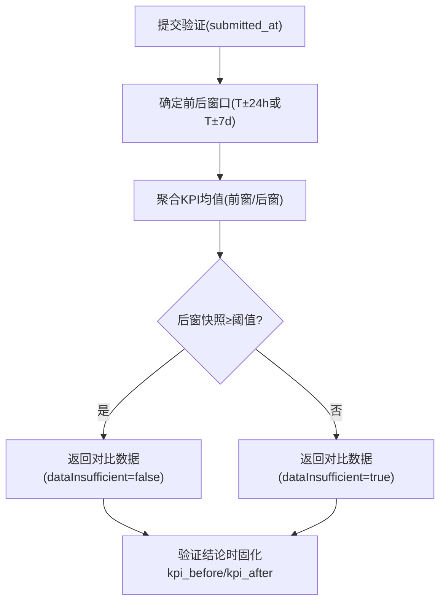
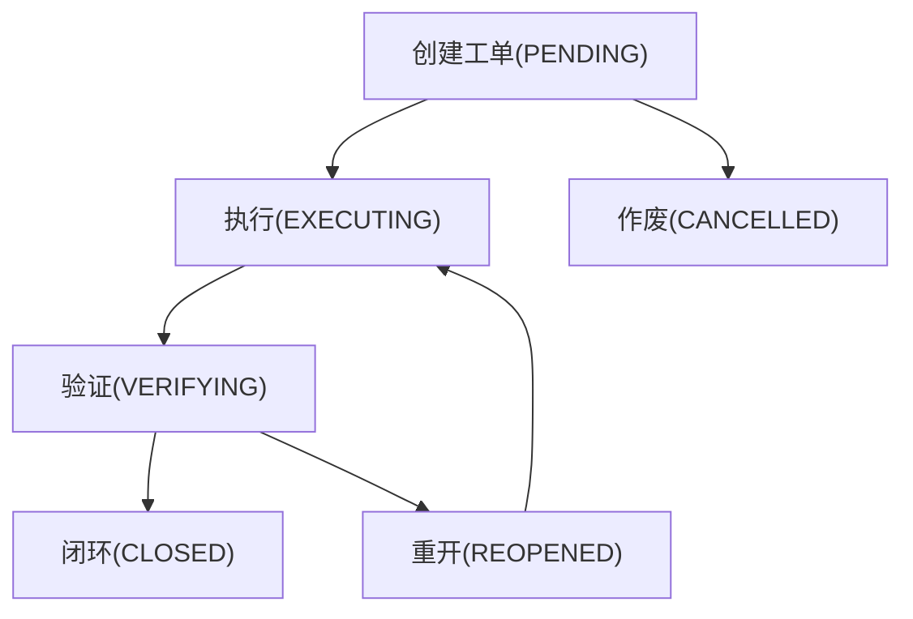
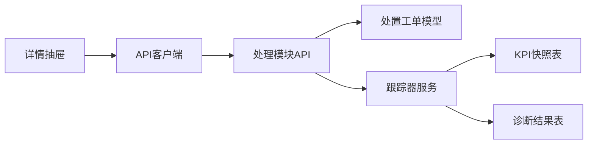

# 工单执行管理

<cite>
**本文引用的文件**
- [handling_order.py](file://backend/app/models/handling_order.py)
- [handling.py](file://backend/app/api/v1/endpoints/handling.py)
- [tracker.py](file://backend/app/services/tracker.py)
- [handling-detail-drawer.vue](file://frontend/apps/web-antd/src/views/handling/components/handling-detail-drawer.vue)
- [handling.ts](file://frontend/apps/web-antd/src/api/handling.ts)
- [p3e5f6g7h8i9_tracker_assignee_planned_at.py](file://backend/alembic/versions/p3e5f6g7h8i9_tracker_assignee_planned_at.py)
</cite>

## 目录
1. [简介](#简介)
2. [项目结构](#项目结构)
3. [核心组件](#核心组件)
4. [架构总览](#架构总览)
5. [详细组件分析](#详细组件分析)
6. [依赖关系分析](#依赖关系分析)
7. [性能考虑](#性能考虑)
8. [故障排查指南](#故障排查指南)
9. [结论](#结论)
10. [附录](#附录)

## 简介
本文件面向“处置工单”的执行管理，围绕六态状态机与工单详情抽屉的核心能力展开：从待执行到执行中、验证中、已闭环/重开/忽略的完整流转；负责人分配（assignee/planned_at）；反馈追加、提交验证、KPI对比、闭环重开等关键操作；以及生命周期管理与归档统计。文档同时提供状态流转图与执行流程图，帮助非技术读者快速理解业务闭环。

## 项目结构
后端采用 FastAPI 分层设计：模型层定义处置工单实体与约束；服务层实现状态机校验、A/B 对比与审计；API 层暴露清单、详情、开工、反馈、提交验证、验证结论、作废等接口。前端通过抽屉式详情页组织表单与可视化对比，调用统一 API 完成状态流转。

图表来源
- [handling.py:1-30](file://backend/app/api/v1/endpoints/handling.py#L1-L30)
- [handling-order-model:1-121](file://backend/app/models/handling_order.py#L1-L121)
- [handling-detail-drawer.vue:1-200](file://frontend/apps/web-antd/src/views/handling/components/handling-detail-drawer.vue#L1-L200)
- [handling.ts:389-456](file://frontend/apps/web-antd/src/api/handling.ts#L389-L456)

章节来源
- [handling.py:1-30](file://backend/app/api/v1/endpoints/handling.py#L1-L30)
- [handling_order.py:1-121](file://backend/app/models/handling_order.py#L1-L121)

## 核心组件
- 处置工单模型（HandlingOrder）：承载工单全量字段与约束，包括来源、类型、计划时间、执行人、执行反馈、提交验证时间、验证结论、KPI前后快照等。
- 处理模块 API（handling.py）：提供工单清单、详情、新建、开工、反馈、提交验证、验证结论、作废、KPI对比预览等端点，并实施状态机强校验。
- 跟踪器服务（tracker.py）：实现 Action Tracker 的状态机、A/B 对比窗口聚合、审计日志、负责人与计划时间等扩展逻辑。
- 前端详情抽屉（handling-detail-drawer.vue）：按状态渲染操作区，支持反馈追加、提交验证、曲线与 KPI 对比、验证结论与闭环重开。
- 前端 API 封装（handling.ts）：统一声明请求体与响应类型，映射后端接口契约。

章节来源
- [handling_order.py:34-94](file://backend/app/models/handling_order.py#L34-L94)
- [handling.py:84-96](file://backend/app/api/v1/endpoints/handling.py#L84-L96)
- [tracker.py:35-70](file://backend/app/services/tracker.py#L35-L70)
- [handling-detail-drawer.vue:585-610](file://frontend/apps/web-antd/src/views/handling/components/handling-detail-drawer.vue#L585-L610)
- [handling.ts:433-456](file://frontend/apps/web-antd/src/api/handling.ts#L433-L456)

## 架构总览
处置工单的端到端流程如下：
- 前端在详情抽屉中根据当前状态展示可执行操作（开工、反馈、提交验证、验证结论、作废）。
- 后端 API 对请求进行参数与状态机校验，更新工单状态并固化必要数据（如 KPI 前后快照）。
- 服务层负责复杂计算（A/B 对比窗口聚合）、审计记录与跨表联动（如整定记录回写）。

图表来源
- [handling.py:1043-1183](file://backend/app/api/v1/endpoints/handling.py#L1043-L1183)
- [handling_detail_drawer:585-610](file://frontend/apps/web-antd/src/views/handling/components/handling-detail-drawer.vue#L585-L610)
- [handling.ts:635-656](file://frontend/apps/web-antd/src/api/handling.ts#L635-L656)

## 详细组件分析

### 六态状态机与转换条件
处置工单采用六态状态机：PENDING（待执行）、EXECUTING（执行中）、VERIFYING（验证中）、CLOSED（已闭环）、REOPENED（重开）、CANCELLED（已作废）。其中 CANCELLED 为终态不可再流转；CLOSED 为终态不可再流转。

允许的状态转换（由 API 层强校验）：
- PENDING → EXECUTING：需要“开工”，填写 handler（缺省为当前登录用户），TUNING 类型可回填 pidBefore。
- EXECUTING → VERIFYING：需要“提交验证”，actionDetail 必填（TUNING 需 pidAfter），合并至 action_detail，设置 submitted_at。
- VERIFYING → CLOSED：验证结论为 EFFECTIVE，服务端固化 kpi_before/kpi_after，设置 verified_by/verified_at。
- VERIFYING → REOPENED：验证结论为 INEFFECTIVE，清空上一轮验证字段，等待新一轮执行。
- PENDING → CANCELLED：作废，需 cancelReason。
- REOPENED → EXECUTING：重新执行，清空上一轮验证字段后进入新一轮。

图表来源
- [handling.py:84-96](file://backend/app/api/v1/endpoints/handling.py#L84-L96)
- [handling.py:1043-1183](file://backend/app/api/v1/endpoints/handling.py#L1043-L1183)

章节来源
- [handling_order.py:34-94](file://backend/app/models/handling_order.py#L34-L94)
- [handling.py:1043-1183](file://backend/app/api/v1/endpoints/handling.py#L1043-L1183)

### 工单详情抽屉核心功能
- 反馈追加：在 EXECUTING 状态下可多次追加 feedback_log，内容必填，用于记录实施细节与过程说明。
- 提交验证：将 actionDetail 合并入工单，设置 submitted_at，状态转为 VERIFYING；TUNING 类型需 pidAfter。
- KPI 对比：在 VERIFYING 阶段提供曲线对比与 KPI 前后对比卡，预览数据来自后端实时拉取，不落地；验证时固化 kpi_before/kpi_after。
- 闭环重开：验证结论为 EFFECTIVE 则 CLOSED；为 INEFFECTIVE 则 REOPENED，清空上一轮验证字段，等待新一轮执行。

图表来源
- [handling-detail-drawer.vue:585-610](file://frontend/apps/web-antd/src/views/handling/components/handling-detail-drawer.vue#L585-L610)
- [handling.py:1086-1183](file://backend/app/api/v1/endpoints/handling.py#L1086-L1183)

章节来源
- [handling-detail-drawer.vue:1-200](file://frontend/apps/web-antd/src/views/handling/components/handling-detail-drawer.vue#L1-L200)
- [handling.py:1086-1183](file://backend/app/api/v1/endpoints/handling.py#L1086-L1183)

### 负责人分配机制
- assignee：用于指定执行人（Action Tracker 维度），在 IN_PROGRESS 且为空时自动认领当前操作者为 assignee。
- planned_at：计划执行时间，用于排程与筛选（plannedBefore/plannedAfter）。
- 数据库迁移新增两列：assignee 与 planned_at，均为可选，向后兼容存量记录。

图表来源
- [handling_order.py:38-94](file://backend/app/models/handling_order.py#L38-L94)
- [tracker.py:89-110](file://backend/app/services/tracker.py#L89-L110)
- [p3e5f6g7h8i9_tracker_assignee_planned_at.py:25-33](file://backend/alembic/versions/p3e5f6g7h8i9_tracker_assignee_planned_at.py#L25-L33)

章节来源
- [p3e5f6g7h8i9_tracker_assignee_planned_at.py:1-38](file://backend/alembic/versions/p3e5f6g7h8i9_tracker_assignee_planned_at.py#L1-L38)
- [tracker.py:237-249](file://backend/app/services/tracker.py#L237-L249)

### KPI 对比与验证窗口
- 验证窗口：以 submitted_at 或 implemented_at 为分界，前后各 24 小时（或 7 天，依场景）聚合 KPI 均值。
- 数据不足：当实施后窗口快照数少于阈值（如 24 条小时级快照）时，标记 dataInsufficient=true。
- 固化时机：在验证结论时（verify）固化 kpi_before/kpi_after，并写入 verify_result、verified_by、verified_at。

图表来源
- [tracker.py:481-504](file://backend/app/services/tracker.py#L481-L504)
- [tracker.py:584-727](file://backend/app/services/tracker.py#L584-L727)
- [handling.py:1136-1183](file://backend/app/api/v1/endpoints/handling.py#L1136-L1183)

章节来源
- [tracker.py:584-727](file://backend/app/services/tracker.py#L584-L727)
- [handling.py:1136-1183](file://backend/app/api/v1/endpoints/handling.py#L1136-L1183)

### 生命周期管理与归档统计
- 生命周期：从 PENDING 开始，经 EXECUTING、VERIFYING，最终到达 CLOSED 或 REOPENED（可再次循环）；PENDING 可被 CANCELLED 终止。
- 归档统计：工单清单支持分页、状态分组排序与多条件筛选（状态、类型、来源、装置节点、回路、处置人、关键字、计划时间范围）；统计接口提供状态计数与本月闭环数。

图表来源
- [handling_order.py:34-94](file://backend/app/models/handling_order.py#L34-L94)
- [handling.py:866-937](file://backend/app/api/v1/endpoints/handling.py#L866-L937)

章节来源
- [handling.py:866-937](file://backend/app/api/v1/endpoints/handling.py#L866-L937)

## 依赖关系分析
- 前端详情抽屉依赖 API 客户端封装，调用后端处理模块端点完成状态流转与数据获取。
- 后端 API 依赖模型层（HandlingOrder）与服务层（tracker.py）完成数据持久化与复杂逻辑。
- 服务层依赖数据库表（kpi_snapshot_hourly、diagnosis_result 等）进行窗口聚合与标签对比。

图表来源
- [handling-detail-drawer.vue:1-200](file://frontend/apps/web-antd/src/views/handling/components/handling-detail-drawer.vue#L1-L200)
- [handling.ts:389-456](file://frontend/apps/web-antd/src/api/handling.ts#L389-L456)
- [handling.py:1-30](file://backend/app/api/v1/endpoints/handling.py#L1-L30)
- [tracker.py:481-504](file://backend/app/services/tracker.py#L481-L504)

章节来源
- [handling.py:1-30](file://backend/app/api/v1/endpoints/handling.py#L1-L30)
- [tracker.py:481-504](file://backend/app/services/tracker.py#L481-L504)

## 性能考虑
- 列表查询使用索引优化：handling_order.status、loop_id、planned_at 建立索引以提升筛选与排序效率。
- KPI 窗口聚合基于小时级快照表，避免全量扫描；数据不足时直接返回 dataInsufficient，减少不必要计算。
- 提交验证与验证结论在同一事务内完成，确保一致性；commit 后 refresh 避免懒加载导致的二次查询开销。

章节来源
- [handling_order.py:96-117](file://backend/app/models/handling_order.py#L96-L117)
- [tracker.py:481-504](file://backend/app/services/tracker.py#L481-L504)
- [handling.py:1079-1083](file://backend/app/api/v1/endpoints/handling.py#L1079-L1083)

## 故障排查指南
- 状态非法转换：检查当前状态是否允许目标动作，错误码 ERR_STATE 会提示当前状态与不允许的操作。
- 参数缺失：如 content 必填、cancelReason 必填、verifyResult 必填等，错误码 ERR_PARAM 会明确缺失字段。
- 数据不足：KPI 对比返回 dataInsufficient=true 时，需补充后窗数据或调整窗口口径。
- 复诊记录不存在：verifyRunId 必须存在，否则报错 ERR_PARAM。

章节来源
- [handling.py:108-127](file://backend/app/api/v1/endpoints/handling.py#L108-L127)
- [handling.py:1136-1183](file://backend/app/api/v1/endpoints/handling.py#L1136-L1183)

## 结论
本系统通过严格的六态状态机与前后端协同，实现了处置工单的闭环管理：从待执行到执行中、验证中，再到已闭环或重开，全程可追溯、可审计。详情抽屉提供直观的操作入口与可视化对比，支撑工程师高效完成反馈、验证与决策。负责人分配与计划时间字段增强了排程与协作能力。整体架构清晰、职责分明，具备良好的可扩展性与维护性。

## 附录
- 接口清单（节选）：
  - GET /handling/orders：工单清单（分页/筛选/排序）
  - GET /handling/orders/{id}：工单详情
  - POST /handling/orders：手动新建工单
  - POST /handling/orders/{id}/start：开工（PENDING/REOPENED → EXECUTING）
  - POST /handling/orders/{id}/feedback：执行反馈（EXECUTING 自环）
  - POST /handling/orders/{id}/submit：提交验证（EXECUTING → VERIFYING）
  - POST /handling/orders/{id}/verify：验证结论（VERIFYING → CLOSED/REOPENED）
  - POST /handling/orders/{id}/cancel：作废（PENDING → CANCELLED）
  - POST /handling/orders/{id}/kpi-comparison：KPI 前后对比预览

章节来源
- [handling.py:1-30](file://backend/app/api/v1/endpoints/handling.py#L1-L30)
- [handling.py:866-1200](file://backend/app/api/v1/endpoints/handling.py#L866-L1200)
- [handling.ts:433-656](file://frontend/apps/web-antd/src/api/handling.ts#L433-L656)