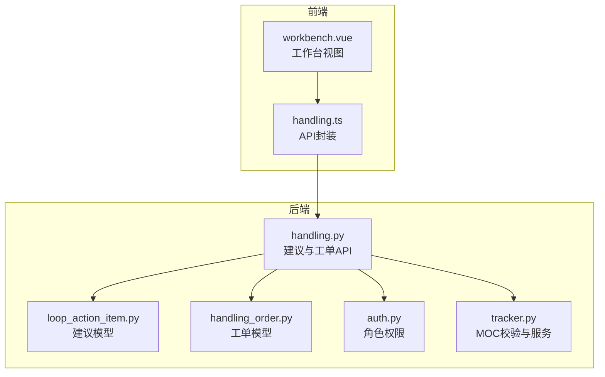
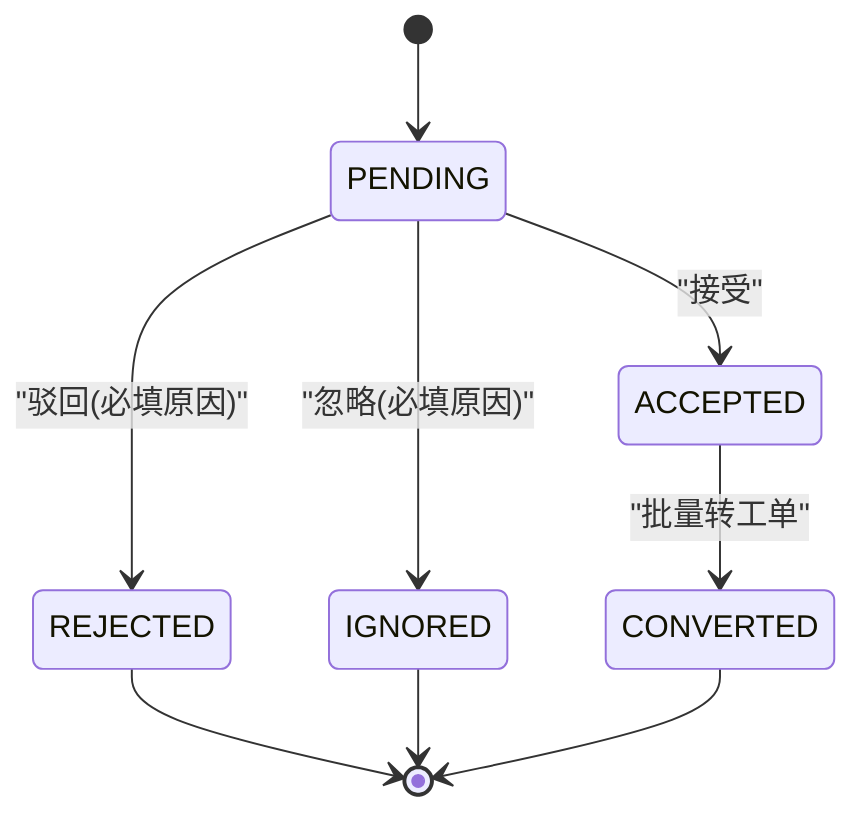
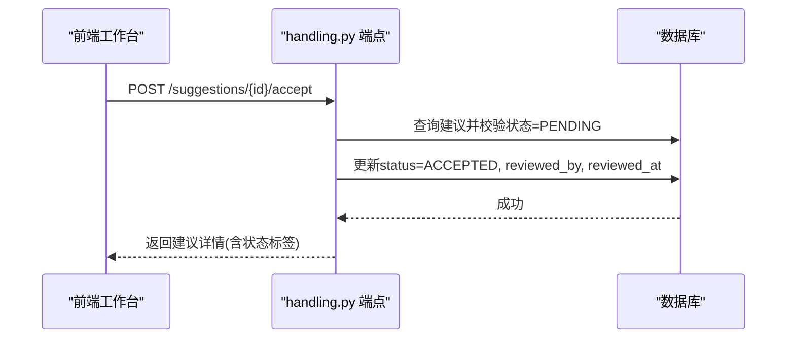
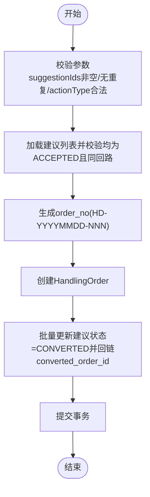
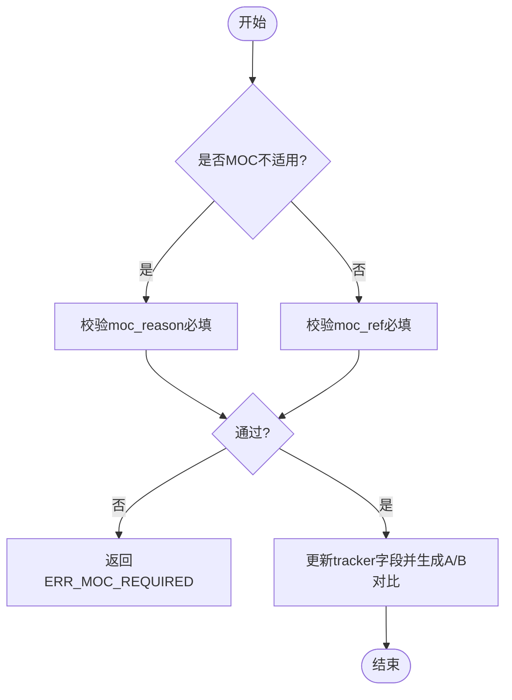
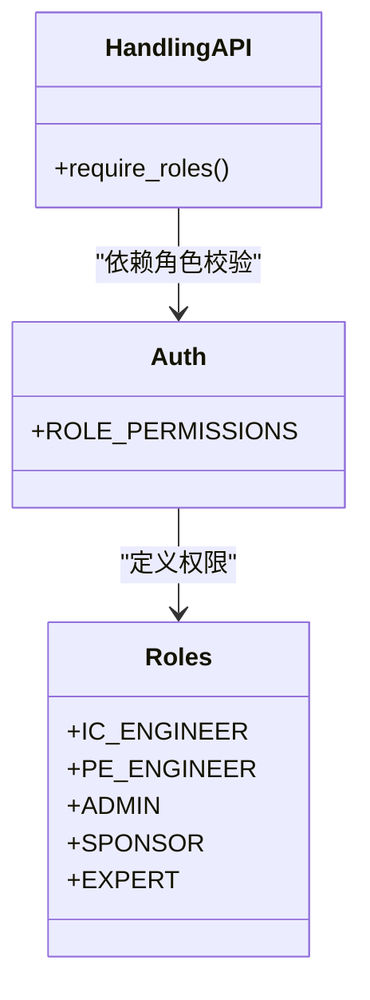
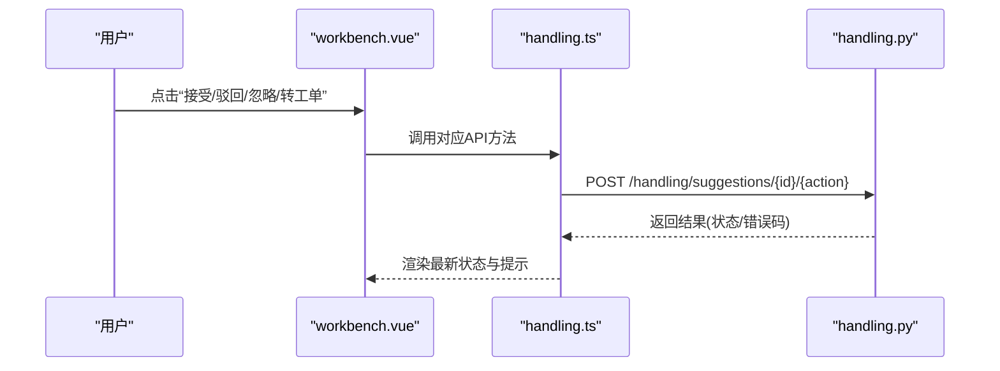
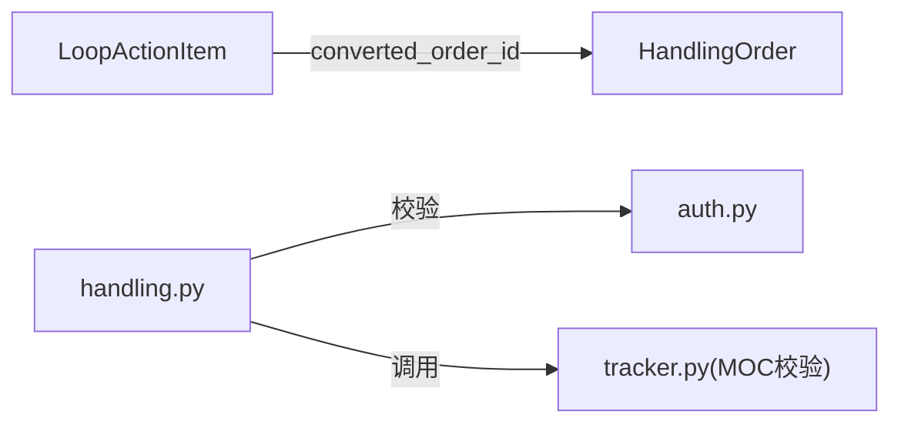

# 建议审核流程

<cite>
**本文引用的文件**
- [backend/app/models/loop_action_item.py](file://backend/app/models/loop_action_item.py)
- [backend/app/models/handling_order.py](file://backend/app/models/handling_order.py)
- [backend/app/api/v1/endpoints/handling.py](file://backend/app/api/v1/endpoints/handling.py)
- [backend/app/services/auth.py](file://backend/app/services/auth.py)
- [backend/app/services/tracker.py](file://backend/app/services/tracker.py)
- [frontend/apps/web-antd/src/api/handling.ts](file://frontend/apps/web-antd/src/api/handling.ts)
- [frontend/apps/web-antd/src/views/handling/workbench.vue](file://frontend/apps/web-antd/src/views/handling/workbench.vue)
- [backend/tests/test_handling_api.py](file://backend/tests/test_handling_api.py)
- [e2e/tests/diagnosis-tracker-flow.spec.ts](file://e2e/tests/diagnosis-tracker-flow.spec.ts)
</cite>

## 目录
1. [简介](#简介)
2. [项目结构](#项目结构)
3. [核心组件](#核心组件)
4. [架构总览](#架构总览)
5. [详细组件分析](#详细组件分析)
6. [依赖关系分析](#依赖关系分析)
7. [性能与并发](#性能与并发)
8. [故障排查指南](#故障排查指南)
9. [结论](#结论)
10. [附录](#附录)

## 简介
本文件面向“建议审核流程”的功能设计与实现说明，覆盖建议实体的状态机、权限控制、三种审核处理方式（接受、驳回、忽略）、批量转工单、以及实施阶段的MOC（变更管理）关联机制。文档同时提供状态转换图与审核流程图，帮助读者快速理解从“待审核”到“已接受/已驳回/已忽略”，再到“处置工单执行闭环”的完整业务链路。

## 项目结构
与“建议审核流程”直接相关的代码分布在以下位置：
- 数据模型：建议实体与工单实体分别定义在 models 层
- 接口与流转：API 端点在 handling.py 中集中实现
- 权限控制：角色与权限映射在 auth.py 中
- 前端交互：处理建议与工单的 API 调用封装在 handling.ts，工作台视图在 workbench.vue
- 测试与E2E：行为验证覆盖在 tests 与 e2e 用例中

**图表来源**
- [backend/app/api/v1/endpoints/handling.py:1-30](file://backend/app/api/v1/endpoints/handling.py#L1-L30)
- [backend/app/models/loop_action_item.py:23-77](file://backend/app/models/loop_action_item.py#L23-L77)
- [backend/app/models/handling_order.py:22-94](file://backend/app/models/handling_order.py#L22-L94)
- [backend/app/services/auth.py:58-104](file://backend/app/services/auth.py#L58-L104)
- [backend/app/services/tracker.py:200-235](file://backend/app/services/tracker.py#L200-L235)
- [frontend/apps/web-antd/src/api/handling.ts:553-596](file://frontend/apps/web-antd/src/api/handling.ts#L553-L596)
- [frontend/apps/web-antd/src/views/handling/workbench.vue:158-209](file://frontend/apps/web-antd/src/views/handling/workbench.vue#L158-L209)

**章节来源**
- [backend/app/api/v1/endpoints/handling.py:1-30](file://backend/app/api/v1/endpoints/handling.py#L1-L30)
- [backend/app/models/loop_action_item.py:23-77](file://backend/app/models/loop_action_item.py#L23-L77)
- [backend/app/models/handling_order.py:22-94](file://backend/app/models/handling_order.py#L22-L94)
- [backend/app/services/auth.py:58-104](file://backend/app/services/auth.py#L58-L104)
- [backend/app/services/tracker.py:200-235](file://backend/app/services/tracker.py#L200-L235)
- [frontend/apps/web-antd/src/api/handling.ts:553-596](file://frontend/apps/web-antd/src/api/handling.ts#L553-L596)
- [frontend/apps/web-antd/src/views/handling/workbench.vue:158-209](file://frontend/apps/web-antd/src/views/handling/workbench.vue#L158-L209)

## 核心组件
- 建议实体（LoopActionItem）：承载建议内容、来源、分类、优先级及审核域字段（审核人/时间、驳回原因、忽略原因、转工单回链）。状态机包含 PENDING、ACCEPTED、CONVERTED、REJECTED、IGNORED。
- 工单实体（HandlingOrder）：承载处置执行生命周期，状态机包含 PENDING、EXECUTING、VERIFYING、CLOSED、REOPENED、CANCELLED。
- 权限控制：通过 require_roles 限制仅允许 IC_ENGINEER、PE_ENGINEER、ADMIN 对处置模块进行写操作；其中审核动作由 _HANDLING_ROLES 统一保护。
- MOC关联：在实施阶段（tracker 服务）要求必须提供 MOC 编号或勾选“不适用”并填写依据说明，否则拒绝。

**章节来源**
- [backend/app/models/loop_action_item.py:23-77](file://backend/app/models/loop_action_item.py#L23-L77)
- [backend/app/models/handling_order.py:22-94](file://backend/app/models/handling_order.py#L22-L94)
- [backend/app/api/v1/endpoints/handling.py:60-92](file://backend/app/api/v1/endpoints/handling.py#L60-L92)
- [backend/app/services/auth.py:58-104](file://backend/app/services/auth.py#L58-L104)
- [backend/app/services/tracker.py:200-235](file://backend/app/services/tracker.py#L200-L235)

## 架构总览
建议审核流程分为两条主线：
- 建议侧：PENDING → ACCEPTED / REJECTED / IGNORED；ACCEPTED 可批量转为工单（CONVERTED）
- 工单侧：PENDING → EXECUTING → VERIFYING → CLOSED/REOPENED；PENDING → CANCELLED

**图表来源**
- [backend/app/models/loop_action_item.py:23-85](file://backend/app/models/loop_action_item.py#L23-L85)
- [backend/app/api/v1/endpoints/handling.py:657-787](file://backend/app/api/v1/endpoints/handling.py#L657-L787)

## 详细组件分析

### 建议状态机与审核规则
- 状态集合：PENDING、ACCEPTED、CONVERTED、REJECTED、IGNORED
- 转换规则：
  - 接受：仅允许 PENDING → ACCEPTED，记录审核人与时间
  - 驳回：仅允许 PENDING → REJECTED，rejectedReason 必填
  - 忽略：仅允许 PENDING → IGNORED，ignoreReason 必填
  - 转工单：仅允许 ACCEPTED 的建议被选中，转换为一个工单后建议状态变为 CONVERTED
- 权限控制：所有审核与转工单端点受 _HANDLING_ROLES 保护（IC_ENGINEER、PE_ENGINEER、ADMIN）

**图表来源**
- [backend/app/api/v1/endpoints/handling.py:657-672](file://backend/app/api/v1/endpoints/handling.py#L657-L672)
- [backend/app/models/loop_action_item.py:57-77](file://backend/app/models/loop_action_item.py#L57-L77)

**章节来源**
- [backend/app/api/v1/endpoints/handling.py:657-714](file://backend/app/api/v1/endpoints/handling.py#L657-L714)
- [backend/tests/test_handling_api.py:215-352](file://backend/tests/test_handling_api.py#L215-L352)

### 批量转工单功能
- 入口：POST /handling/suggestions/convert
- 约束：
  - suggestionIds ≥ 1，无重复
  - 全部为 ACCEPTED
  - 同一回路（loop_id）
  - actionType 必填且为8类枚举之一
- 生成工单号：HD-YYYYMMDD-NNN（按日重置序号），并发冲突时重试一次
- 结果：创建 HandlingOrder，并将每条建议状态置为 CONVERTED，写入 converted_order_id

**图表来源**
- [backend/app/api/v1/endpoints/handling.py:717-787](file://backend/app/api/v1/endpoints/handling.py#L717-L787)
- [backend/app/models/handling_order.py:46-94](file://backend/app/models/handling_order.py#L46-L94)

**章节来源**
- [backend/app/api/v1/endpoints/handling.py:717-787](file://backend/app/api/v1/endpoints/handling.py#L717-L787)
- [backend/app/models/handling_order.py:22-94](file://backend/app/models/handling_order.py#L22-L94)

### MOC（变更管理）关联机制
- 触发时机：标记实施（IMPLEMENTED）或进入实施流程（is_implementing）
- 校验规则：
  - 若选择“MOC不适用”，必须填写依据说明（moc_reason）
  - 否则必须提供 MOC 编号（moc_ref）
  - 不满足任一条件将返回 ERR_MOC_REQUIRED
- 审计与回写：更新 tracker 并写入 moc_ref/moc_not_applicable/moc_reason，生成 A/B 对比计划

**图表来源**
- [backend/app/services/tracker.py:200-235](file://backend/app/services/tracker.py#L200-L235)
- [e2e/tests/diagnosis-tracker-flow.spec.ts:291-326](file://e2e/tests/diagnosis-tracker-flow.spec.ts#L291-L326)

**章节来源**
- [backend/app/services/tracker.py:200-399](file://backend/app/services/tracker.py#L200-L399)
- [e2e/tests/diagnosis-tracker-flow.spec.ts:211-326](file://e2e/tests/diagnosis-tracker-flow.spec.ts#L211-L326)

### 权限控制与角色
- 处置模块写端点使用 require_roles(*_HANDLING_ROLES)，允许的角色包括 IC_ENGINEER、PE_ENGINEER、ADMIN
- 角色权限映射中，IC_ENGINEER 拥有 handling:* 等权限；SPONSOR/EXPERT 仅具备只读能力
- 前端工作台中，不同角色的菜单可见性由权限决定

**图表来源**
- [backend/app/services/auth.py:58-104](file://backend/app/services/auth.py#L58-L104)
- [backend/app/api/v1/endpoints/handling.py:60-62](file://backend/app/api/v1/endpoints/handling.py#L60-L62)

**章节来源**
- [backend/app/services/auth.py:58-104](file://backend/app/services/auth.py#L58-L104)
- [backend/app/api/v1/endpoints/handling.py:60-62](file://backend/app/api/v1/endpoints/handling.py#L60-L62)

### 前端交互流程
- 工作台统计卡片展示待审核、已接受、已驳回、本周转化数量
- 前端提供 accept/reject/ignore/convert 等 API 封装，调用后端对应端点
- 用户在选择建议后，可批量转工单，前端需保证所选建议均为 ACCEPTED 且同回路

**图表来源**
- [frontend/apps/web-antd/src/views/handling/workbench.vue:158-209](file://frontend/apps/web-antd/src/views/handling/workbench.vue#L158-L209)
- [frontend/apps/web-antd/src/api/handling.ts:553-596](file://frontend/apps/web-antd/src/api/handling.ts#L553-L596)
- [backend/app/api/v1/endpoints/handling.py:657-787](file://backend/app/api/v1/endpoints/handling.py#L657-L787)

**章节来源**
- [frontend/apps/web-antd/src/views/handling/workbench.vue:158-209](file://frontend/apps/web-antd/src/views/handling/workbench.vue#L158-L209)
- [frontend/apps/web-antd/src/api/handling.ts:553-596](file://frontend/apps/web-antd/src/api/handling.ts#L553-L596)

## 依赖关系分析
- 建议与工单双实体解耦：建议负责“审核对象”，工单负责“执行载体”
- 建议转工单时建立反向引用（converted_order_id），便于追溯
- 权限模块通过 require_roles 统一保护写端点
- MOC校验在服务层完成，确保实施闭环合规

**图表来源**
- [backend/app/models/loop_action_item.py:70-77](file://backend/app/models/loop_action_item.py#L70-L77)
- [backend/app/models/handling_order.py:46-94](file://backend/app/models/handling_order.py#L46-L94)
- [backend/app/services/auth.py:58-104](file://backend/app/services/auth.py#L58-L104)
- [backend/app/services/tracker.py:200-235](file://backend/app/services/tracker.py#L200-L235)

**章节来源**
- [backend/app/models/loop_action_item.py:70-77](file://backend/app/models/loop_action_item.py#L70-L77)
- [backend/app/models/handling_order.py:46-94](file://backend/app/models/handling_order.py#L46-L94)
- [backend/app/services/auth.py:58-104](file://backend/app/services/auth.py#L58-L104)
- [backend/app/services/tracker.py:200-235](file://backend/app/services/tracker.py#L200-L235)

## 性能与并发
- 工单号生成采用“当日前缀+计数”的方式，存在唯一约束冲突风险；实现中包含一次重试以应对并发场景
- 批量转工单在同一事务内创建工单并更新多条建议状态，减少多次往返
- KPI前后窗口计算基于 started_at/submitted_at 划分，避免处置期数据污染对比

[本节为通用性能讨论，不直接分析具体文件]

## 故障排查指南
- 非法状态迁移：当尝试在非 PENDING 状态下执行接受/驳回/忽略时，会返回 ERR_STATE 400
- 参数缺失：驳回与忽略均要求相应原因字段非空，否则返回 ERR_PARAM 400
- 权限不足：非 _HANDLING_ROLES 角色调用写端点将返回 403
- MOC校验失败：标记实施时未提供 MOC 编号或未填写不适用依据，返回 ERR_MOC_REQUIRED 422

**章节来源**
- [backend/tests/test_handling_api.py:215-352](file://backend/tests/test_handling_api.py#L215-L352)
- [backend/app/api/v1/endpoints/handling.py:109-127](file://backend/app/api/v1/endpoints/handling.py#L109-L127)
- [backend/app/services/tracker.py:200-235](file://backend/app/services/tracker.py#L200-L235)

## 结论
建议审核流程通过明确的状态机与严格的权限控制，确保了从“待审核”到“已接受/已驳回/已忽略”的规范化流转；批量转工单提升了处置效率，并在执行阶段通过 MOC 关联保障变更合规。前后端协作清晰，测试覆盖关键路径，具备良好的可维护性与扩展性。

[本节为总结性内容，不直接分析具体文件]

## 附录
- 建议状态标签映射：PENDING=待审核，ACCEPTED=已接受，CONVERTED=已转工单，REJECTED=已驳回，IGNORED=已忽略
- 工单状态标签映射：PENDING=待执行，EXECUTING=执行中，VERIFYING=验证中，CLOSED=已闭环，REOPENED=重开，CANCELLED=已作废

[本节为补充信息，不直接分析具体文件]