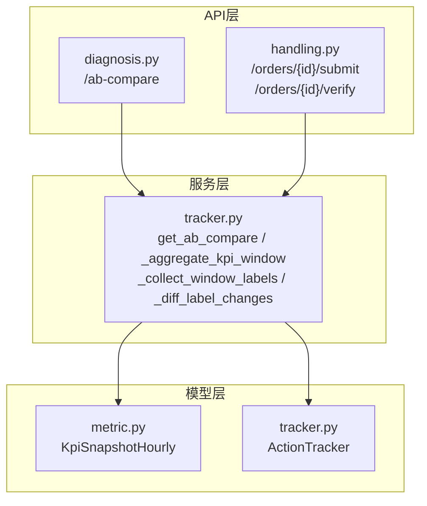
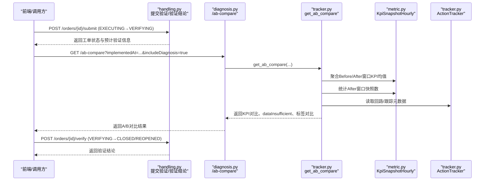
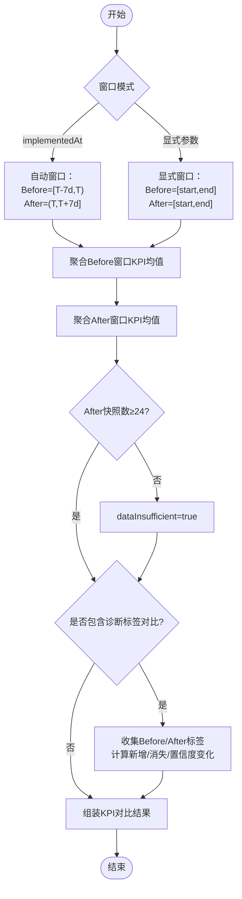
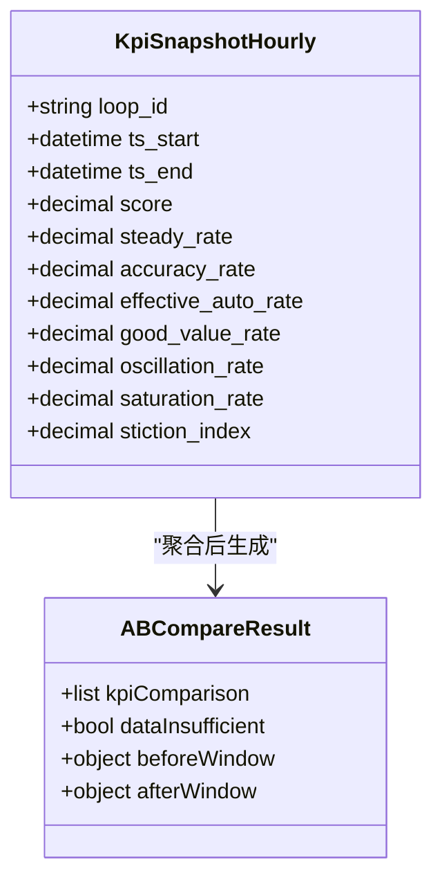
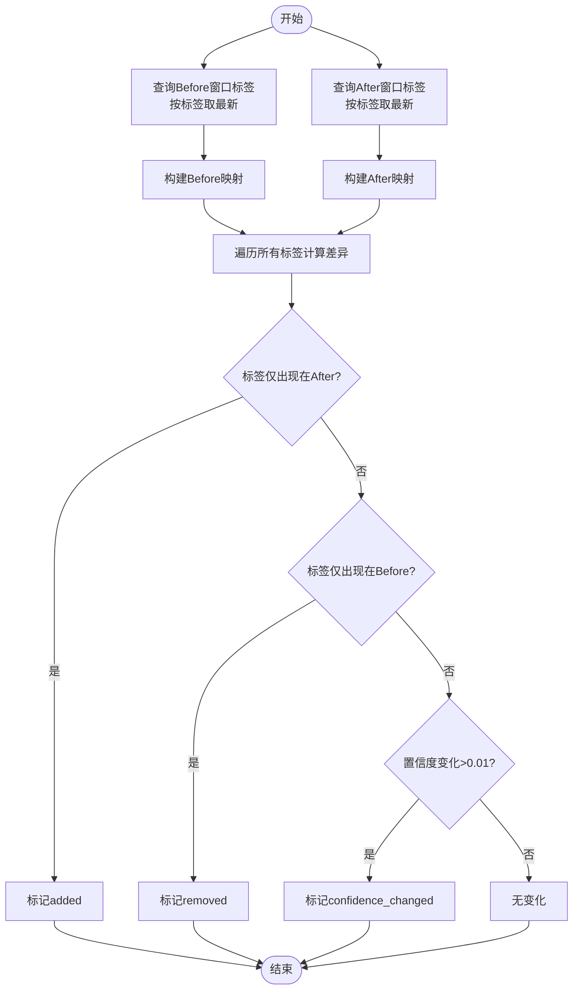
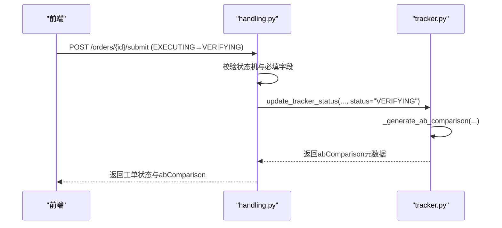
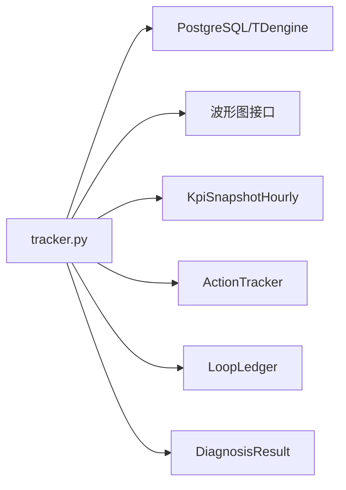

# 效果验证机制

<cite>
**本文引用的文件**
- [backend/app/services/tracker.py](file://backend/app/services/tracker.py)
- [backend/app/api/v1/endpoints/diagnosis.py](file://backend/app/api/v1/endpoints/diagnosis.py)
- [backend/app/api/v1/endpoints/handling.py](file://backend/app/api/v1/endpoints/handling.py)
- [backend/app/models/tracker.py](file://backend/app/models/tracker.py)
- [backend/app/models/metric.py](file://backend/app/models/metric.py)
</cite>

## 目录
1. [简介](#简介)
2. [项目结构](#项目结构)
3. [核心组件](#核心组件)
4. [架构总览](#架构总览)
5. [详细组件分析](#详细组件分析)
6. [依赖关系分析](#依赖关系分析)
7. [性能考量](#性能考量)
8. [故障排查指南](#故障排查指南)
9. [结论](#结论)
10. [附录](#附录)

## 简介
本文件面向“效果验证机制”，围绕A/B对比验证的核心算法、KPI指标对比、数据充足性判断、诊断标签对比、自动验证触发与结果判定进行系统化说明，并给出流程图与KPI对比展示界面的设计要点。该机制以实施时刻为分界点，构建Before/After窗口，基于小时级KPI快照计算前后均值变化，并结合诊断标签的变化进行综合评估，最终形成可追溯的验证结论。

## 项目结构
效果验证相关代码主要分布在以下位置：
- 服务层：实现A/B对比、窗口聚合、诊断标签收集与差异计算等核心逻辑
- API层：暴露A/B对比查询接口，以及处置流程中提交验证与验证结论的端点
- 模型层：定义跟踪记录（ActionTracker）与KPI小时快照（KpiSnapshotHourly）等数据结构
- 配置与常量：定义验证窗口时长、KPI字段清单、最小快照阈值等

图表来源
- [backend/app/api/v1/endpoints/diagnosis.py:604-640](file://backend/app/api/v1/endpoints/diagnosis.py#L604-L640)
- [backend/app/api/v1/endpoints/handling.py:1-200](file://backend/app/api/v1/endpoints/handling.py#L1-L200)
- [backend/app/services/tracker.py:481-727](file://backend/app/services/tracker.py#L481-L727)
- [backend/app/models/metric.py:62-148](file://backend/app/models/metric.py#L62-L148)
- [backend/app/models/tracker.py:23-170](file://backend/app/models/tracker.py#L23-L170)

章节来源
- [backend/app/api/v1/endpoints/diagnosis.py:604-640](file://backend/app/api/v1/endpoints/diagnosis.py#L604-L640)
- [backend/app/api/v1/endpoints/handling.py:1-200](file://backend/app/api/v1/endpoints/handling.py#L1-L200)
- [backend/app/services/tracker.py:481-727](file://backend/app/services/tracker.py#L481-L727)
- [backend/app/models/metric.py:62-148](file://backend/app/models/metric.py#L62-L148)
- [backend/app/models/tracker.py:23-170](file://backend/app/models/tracker.py#L23-L170)

## 核心组件
- A/B对比服务：提供按实施时刻或显式时间窗的Before/After窗口KPI均值对比，支持可选的诊断标签对比
- KPI窗口聚合：从kpi_snapshot_hourly表按窗口统计各KPI均值与快照数
- 诊断标签对比：收集窗口内最新诊断标签，计算新增、消失与置信度变化
- 处置流程集成：在工单状态切换到VERIFYING时生成验证元数据；在验证结论阶段固化KPI对比结果
- 数据充足性判断：当After窗口快照数少于24条时标记dataInsufficient=true

章节来源
- [backend/app/services/tracker.py:72-86](file://backend/app/services/tracker.py#L72-L86)
- [backend/app/services/tracker.py:481-727](file://backend/app/services/tracker.py#L481-L727)
- [backend/app/api/v1/endpoints/handling.py:1-200](file://backend/app/api/v1/endpoints/handling.py#L1-L200)

## 架构总览
效果验证的整体流程如下：
- 前端或上游系统调用处置模块提交验证（EXECUTING → VERIFYING），服务端生成A/B对比元数据（Before/After窗口）
- 通过A/B对比接口获取KPI均值对比与可选的诊断标签对比
- 若After窗口快照不足24条，返回dataInsufficient=true提示数据不足
- 验证结论（VERIFYING → CLOSED/REOPENED）由业务侧确认，并可回写验证摘要到跟踪记录

图表来源
- [backend/app/api/v1/endpoints/handling.py:1-200](file://backend/app/api/v1/endpoints/handling.py#L1-L200)
- [backend/app/api/v1/endpoints/diagnosis.py:604-640](file://backend/app/api/v1/endpoints/diagnosis.py#L604-L640)
- [backend/app/services/tracker.py:481-727](file://backend/app/services/tracker.py#L481-L727)
- [backend/app/models/metric.py:62-148](file://backend/app/models/metric.py#L62-L148)
- [backend/app/models/tracker.py:23-170](file://backend/app/models/tracker.py#L23-L170)

## 详细组件分析

### A/B对比核心算法
- 窗口确定方式：
  - 以实施时刻T为界，自动截取[ T-7d, T )与( T, T+7d ]两个窗口
  - 或显式传入before_start/before_end/after_start/after_end闭区间窗口
- KPI指标集合（9项）：
  - 综合评分、平稳率、控制精度、有效自控率、好值率、振荡率、饱和率、粘滞指数
  - 每项包含：before/after均值、绝对变化、百分比变化、是否改善（考虑正向/负向指标）
- 数据充足性判断：
  - After窗口快照数 < 24条时，dataInsufficient=true
- 诊断标签对比（可选）：
  - 收集每个窗口内的诊断标签（取最新一条），归一化置信度为0-1
  - 计算新增、消失、置信度变化（差值>0.01视为变化）

图表来源
- [backend/app/services/tracker.py:584-727](file://backend/app/services/tracker.py#L584-L727)
- [backend/app/services/tracker.py:481-550](file://backend/app/services/tracker.py#L481-L550)

章节来源
- [backend/app/services/tracker.py:584-727](file://backend/app/services/tracker.py#L584-L727)
- [backend/app/services/tracker.py:481-550](file://backend/app/services/tracker.py#L481-L550)

### KPI指标对比与均值计算
- 指标来源：kpi_snapshot_hourly表，按loop_id与时间范围聚合
- 计算内容：
  - 对AB_COMPARE_KPIS定义的9个字段分别求平均
  - 计算before与after的绝对变化与百分比变化
  - 根据指标方向（正向/负向）判断improved
- 输出结构：
  - metricKey、metricName、unit、before、after、change、changePct、improved

图表来源
- [backend/app/models/metric.py:62-148](file://backend/app/models/metric.py#L62-L148)
- [backend/app/services/tracker.py:72-86](file://backend/app/services/tracker.py#L72-L86)
- [backend/app/services/tracker.py:665-693](file://backend/app/services/tracker.py#L665-L693)

章节来源
- [backend/app/models/metric.py:62-148](file://backend/app/models/metric.py#L62-L148)
- [backend/app/services/tracker.py:72-86](file://backend/app/services/tracker.py#L72-L86)
- [backend/app/services/tracker.py:665-693](file://backend/app/services/tracker.py#L665-L693)

### 诊断标签对比
- 收集策略：
  - 在每个窗口内查询诊断结果，按标签分组取最新一条
  - 将confidence从0-100归一化为0-1
- 差异计算：
  - added：仅在After出现
  - removed：仅在Before出现
  - confidence_changed：置信度变化超过阈值（0.01）

图表来源
- [backend/app/services/tracker.py:507-581](file://backend/app/services/tracker.py#L507-L581)

章节来源
- [backend/app/services/tracker.py:507-581](file://backend/app/services/tracker.py#L507-L581)

### 自动验证触发机制
- 触发时机：
  - 处置工单状态切换到VERIFYING时，自动生成A/B对比视图元数据（Before/After窗口URL、实施时刻等）
- 触发位置：
  - 处置模块API负责状态转换与审计日志
  - 服务层在状态更新后生成A/B对比计划（窗口元数据）
- 预期行为：
  - 返回当前跟踪状态与预计自动验证时间（在VERIFYING状态下）

图表来源
- [backend/app/api/v1/endpoints/handling.py:1-200](file://backend/app/api/v1/endpoints/handling.py#L1-L200)
- [backend/app/services/tracker.py:353-446](file://backend/app/services/tracker.py#L353-L446)

章节来源
- [backend/app/api/v1/endpoints/handling.py:1-200](file://backend/app/api/v1/endpoints/handling.py#L1-L200)
- [backend/app/services/tracker.py:353-446](file://backend/app/services/tracker.py#L353-L446)

### 验证结果判定标准
- 数据充足性：
  - After窗口快照数 < 24条时，dataInsufficient=true，提示数据不足，不宜直接下结论
- KPI改善程度：
  - 基于9项KPI的均值变化与improved标志，统计改善/恶化指标数量
- 诊断标签变化：
  - 新增/消失标签与置信度变化作为辅助证据
- 综合评估：
  - 结合KPI改善与标签变化，形成验证结论（如闭环或重开）
  - 可在跟踪记录中回写ab_compare_summary与effect_verified

章节来源
- [backend/app/services/tracker.py:656-727](file://backend/app/services/tracker.py#L656-L727)
- [backend/app/models/tracker.py:83-89](file://backend/app/models/tracker.py#L83-L89)

### KPI对比展示界面说明
- 展示内容：
  - Before/After窗口起止时间与波形图链接
  - 9项KPI的before/after均值、变化量、变化百分比、是否改善
  - 数据充足性提示（dataInsufficient）
  - 可选的诊断标签对比（新增/消失/置信度变化）
- 交互建议：
  - 点击波形图链接查看实施前后趋势
  - 对dataInsufficient=true的情况，提示补充数据后再评估
  - 对improved=false的指标高亮显示，便于快速定位问题

章节来源
- [backend/app/api/v1/endpoints/diagnosis.py:604-640](file://backend/app/api/v1/endpoints/diagnosis.py#L604-L640)
- [backend/app/services/tracker.py:708-727](file://backend/app/services/tracker.py#L708-L727)

## 依赖关系分析
- 服务层依赖：
  - 数据库会话（AsyncSession）用于查询与聚合
  - 模型：KpiSnapshotHourly（KPI快照）、ActionTracker（跟踪记录）、LoopLedger（回路档案）、DiagnosisResult（诊断结果）
- 外部接口：
  - 波形图接口：/api/v1/timeseries/{loop_id}/waveform?startTime=...&endTime=...
- 约束与索引：
  - kpi_snapshot_hourly按loop_id与ts_start唯一，确保每小时一条快照
  - ActionTracker含effect_verified、ab_compare_summary等字段，支撑验证结果回写

图表来源
- [backend/app/services/tracker.py:481-727](file://backend/app/services/tracker.py#L481-L727)
- [backend/app/models/metric.py:62-148](file://backend/app/models/metric.py#L62-L148)
- [backend/app/models/tracker.py:23-170](file://backend/app/models/tracker.py#L23-L170)

章节来源
- [backend/app/services/tracker.py:481-727](file://backend/app/services/tracker.py#L481-L727)
- [backend/app/models/metric.py:62-148](file://backend/app/models/metric.py#L62-L148)
- [backend/app/models/tracker.py:23-170](file://backend/app/models/tracker.py#L23-L170)

## 性能考量
- 窗口聚合使用SQL聚合函数（AVG/COUNT），避免在应用层逐条计算
- 通过索引优化查询：
  - kpi_snapshot_hourly的loop_id与ts_start索引
  - ActionTracker的状态与更新时间索引
- 数据充足性判断前置，减少无效计算
- 可选的诊断标签对比按需启用，降低不必要开销

章节来源
- [backend/app/services/tracker.py:481-504](file://backend/app/services/tracker.py#L481-L504)
- [backend/app/models/metric.py:125-148](file://backend/app/models/metric.py#L125-L148)
- [backend/app/models/tracker.py:122-169](file://backend/app/models/tracker.py#L122-L169)

## 故障排查指南
- 常见错误：
  - 回路不存在：ERR_LOOP_NOT_FOUND
  - 时间格式无效：ERR_VALIDATION
  - 缺少窗口参数：ERR_VALIDATION（未提供implementedAt或完整窗口）
  - 状态转换非法：ERR_INVALID_TRANSITION
  - 必填字段缺失：ERR_MOC_REQUIRED / ERR_PID_PARAMS_REQUIRED / ERR_REOPEN_REASON_REQUIRED
- 排查步骤：
  - 检查loop_id是否存在
  - 检查implementedAt或窗口参数是否正确
  - 检查After窗口快照数是否≥24
  - 检查状态机转换是否合法
  - 检查必填字段是否完整

章节来源
- [backend/app/services/tracker.py:609-654](file://backend/app/services/tracker.py#L609-L654)
- [backend/app/services/tracker.py:123-244](file://backend/app/services/tracker.py#L123-L244)

## 结论
效果验证机制通过A/B对比窗口、KPI均值变化与诊断标签差异，形成可量化、可追溯的验证结论。系统在处置流程中自动触发验证元数据生成，并在验证结论阶段固化结果。通过数据充足性判断与可选的诊断标签对比，提升了验证的可靠性与解释性。建议在数据不足时谨慎下结论，并结合多指标与标签变化进行综合评估。

## 附录
- 关键常量：
  - AB_COMPARE_KPIS：9项KPI字段定义（名称、单位、是否正向）
  - AB_MIN_AFTER_SNAPSHOTS：After窗口最少快照数（24）
- 接口参考：
  - GET /api/v1/diagnosis/ab-compare：A/B对比查询
  - POST /handling/orders/{id}/submit：提交验证（EXECUTING→VERIFYING）
  - POST /handling/orders/{id}/verify：验证结论（VERIFYING→CLOSED/REOPENED）

章节来源
- [backend/app/services/tracker.py:72-86](file://backend/app/services/tracker.py#L72-L86)
- [backend/app/api/v1/endpoints/diagnosis.py:604-640](file://backend/app/api/v1/endpoints/diagnosis.py#L604-L640)
- [backend/app/api/v1/endpoints/handling.py:1-200](file://backend/app/api/v1/endpoints/handling.py#L1-L200)