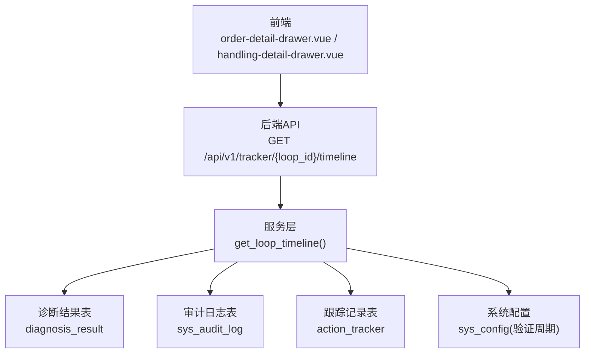
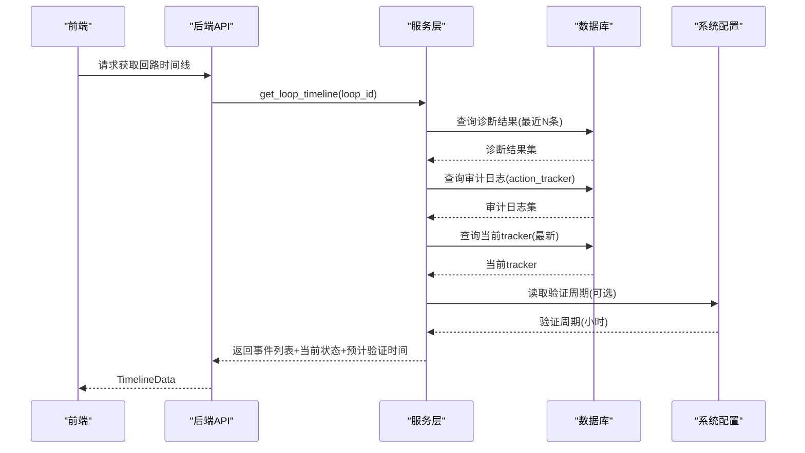
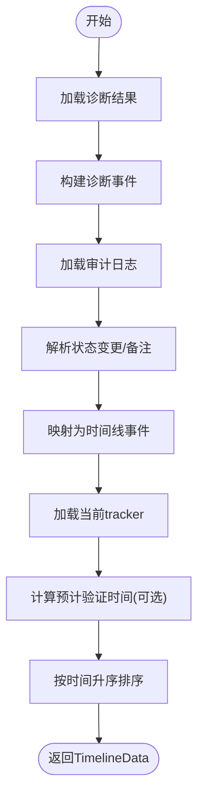
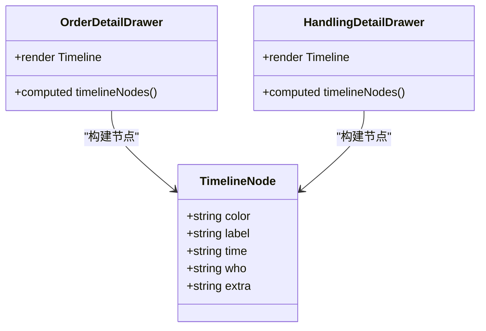
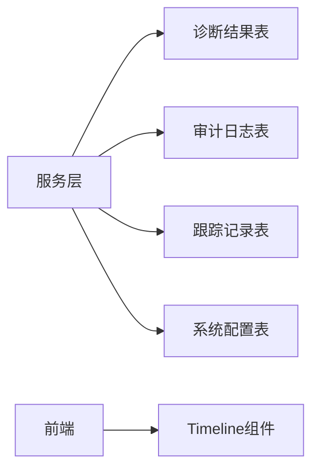

# 时间线追踪

<cite>
**本文引用的文件**
- [backend/app/services/tracker.py](file://backend/app/services/tracker.py)
- [backend/app/models/tracker.py](file://backend/app/models/tracker.py)
- [backend/alembic/versions/d1a2b3c4e5f6_add_tracker_d1_columns.py](file://backend/alembic/versions/d1a2b3c4e5f6_add_tracker_d1_columns.py)
- [backend/tests/golden/openapi_baseline.json](file://backend/tests/golden/openapi_baseline.json)
- [frontend/apps/web-antd/src/views/handling/components/order-detail-drawer.vue](file://frontend/apps/web-antd/src/views/handling/components/order-detail-drawer.vue)
- [frontend/apps/web-antd/src/views/handling/components/handling-detail-drawer.vue](file://frontend/apps/web-antd/src/views/handling/components/handling-detail-drawer.vue)
</cite>

## 目录
1. [简介](#简介)
2. [项目结构](#项目结构)
3. [核心组件](#核心组件)
4. [架构总览](#架构总览)
5. [详细组件分析](#详细组件分析)
6. [依赖关系分析](#依赖关系分析)
7. [性能考虑](#性能考虑)
8. [故障排查指南](#故障排查指南)
9. [结论](#结论)
10. [附录](#附录)

## 简介
本文件面向“时间线追踪”功能，系统化说明其数据来源、事件类型、聚合与排序逻辑、严重等级展示、以及前端在工单详情抽屉中的时间轴渲染方式。该能力将诊断结果事件、ActionTracker审计日志、整定结果事件、当前tracker状态元数据统一汇聚为按时间顺序排列的处置历史视图，帮助运维与工程师快速理解异常从发现到闭环的全生命周期。

## 项目结构
时间线追踪由后端服务层与前端展示层协同实现：
- 后端服务层：提供单回路处置时间线查询接口，聚合多源事件并返回标准化事件列表。
- 前端展示层：在工单详情抽屉中以时间轴形式渲染事件节点，支持颜色、时间、操作人、备注等字段展示。

图表来源
- [backend/app/services/tracker.py:753-961](file://backend/app/services/tracker.py#L753-L961)
- [frontend/apps/web-antd/src/views/handling/components/order-detail-drawer.vue:342-389](file://frontend/apps/web-antd/src/views/handling/components/order-detail-drawer.vue#L342-L389)
- [frontend/apps/web-antd/src/views/handling/components/handling-detail-drawer.vue:307-354](file://frontend/apps/web-antd/src/views/handling/components/handling-detail-drawer.vue#L307-L354)

章节来源
- [backend/app/services/tracker.py:753-961](file://backend/app/services/tracker.py#L753-L961)
- [frontend/apps/web-antd/src/views/handling/components/order-detail-drawer.vue:342-389](file://frontend/apps/web-antd/src/views/handling/components/order-detail-drawer.vue#L342-L389)
- [frontend/apps/web-antd/src/views/handling/components/handling-detail-drawer.vue:307-354](file://frontend/apps/web-antd/src/views/handling/components/handling-detail-drawer.vue#L307-L354)

## 核心组件
- 时间线聚合服务：负责从诊断结果、审计日志、整定结果（预留）与当前 tracker 状态中抽取事件，统一格式并按时间排序。
- 事件模型：每个事件包含唯一ID、事件类型、时间戳、操作人、标题、描述、扩展元数据。
- 严重等级映射：根据诊断标签的严重等级字段映射为中文标识，用于事件描述与展示。
- 预计验证时间计算：当 tracker 处于实施后等待验证状态时，依据系统配置的验证周期计算预计自动验证时间。

章节来源
- [backend/app/services/tracker.py:734-751](file://backend/app/services/tracker.py#L734-L751)
- [backend/app/services/tracker.py:753-961](file://backend/app/services/tracker.py#L753-L961)
- [backend/tests/golden/openapi_baseline.json:33659-33710](file://backend/tests/golden/openapi_baseline.json#L33659-L33710)

## 架构总览
时间线追踪的数据流如下：
- 诊断结果事件：读取最近若干条诊断结果，生成“系统发现异常”事件，附带标签名称、置信度与严重等级。
- 审计日志事件：解析 action_tracker 的状态变更审计日志，映射为认领处理、现场实施、验证通过/未通过、忽略、添加备注等事件。
- 整定结果事件：当前简化实现不引入新表依赖，后续可在整定闭环接入后补充。
- 当前 tracker 状态：用于显示当前状态与预计验证时间。

图表来源
- [backend/app/services/tracker.py:753-961](file://backend/app/services/tracker.py#L753-L961)
- [backend/tests/golden/openapi_baseline.json:33659-33710](file://backend/tests/golden/openapi_baseline.json#L33659-L33710)

## 详细组件分析

### 时间线事件类型与含义
- diagnosis_detected（系统发现异常）：来自诊断结果，包含标签名称、置信度、严重等级。
- claimed（认领处理）：来自审计日志，表示从待处理进入处理中，可能包含指派信息。
- comment（添加备注）：来自审计日志，无状态变更但包含备注内容。
- tuning_completed（整定完成）：预留事件类型，当前简化实现暂不写入，后续整定闭环接入后可完善。
- implemented（现场实施）：来自审计日志，表示实施完成，包含新PID参数与MOC关联信息。
- verification_passed（验证通过·闭环）：来自审计日志，表示验证通过并闭环。
- verification_failed（验证未通过·重开）：来自审计日志，表示验证未通过并重新打开。
- ignored（忽略此异常）：来自审计日志，表示标记为忽略。
- moc_recorded（记录MOC变更）：预留事件类型，可用于记录MOC变更事件。

章节来源
- [backend/app/services/tracker.py:734-745](file://backend/app/services/tracker.py#L734-L745)
- [backend/app/services/tracker.py:820-928](file://backend/app/services/tracker.py#L820-L928)
- [backend/tests/golden/openapi_baseline.json:33659-33710](file://backend/tests/golden/openapi_baseline.json#L33659-L33710)

### 时间线聚合逻辑
- 数据来源：
  - 诊断结果事件：取最近若干条诊断结果，生成 diagnosis_detected 事件。
  - 审计日志事件：解析 action_tracker 的状态变更审计日志，映射为 claimed/comment/implemented/verification_passed/verification_failed/ignored 等事件。
  - 整定结果事件：当前简化实现不引入新表依赖，后续可接入。
  - 当前 tracker 状态：用于显示 currentStatus 与 pendingVerificationAt。
- 排序规则：所有事件按时间戳升序排列，形成完整处置历史视图。
- 预计验证时间：当 tracker 处于 VERIFYING 且存在实施时间时，结合系统配置的验证周期计算预计自动验证时间。

图表来源
- [backend/app/services/tracker.py:753-961](file://backend/app/services/tracker.py#L753-L961)

章节来源
- [backend/app/services/tracker.py:753-961](file://backend/app/services/tracker.py#L753-L961)

### 严重等级显示
- 严重等级来源于诊断标签的 severity 字段，后端在服务层将其映射为中文标识（紧急/错误/警告/提示），并在事件描述中展示。
- 若无法获取或为空，则回退为未知。

章节来源
- [backend/app/services/tracker.py:748-751](file://backend/app/services/tracker.py#L748-L751)
- [backend/app/services/tracker.py:797-818](file://backend/app/services/tracker.py#L797-L818)

### 时间线数据结构定义
- 响应体包含：
  - loopId：回路ID
  - tagName：位号名称
  - currentStatus：当前 tracker 状态
  - events：事件数组，每项包含 eventId、eventType、timestamp、actor、title、description、meta
  - pendingVerificationAt：预计自动验证时间（仅在 VERIFYING 且有实施时间时存在）
- 事件类型枚举包括：diagnosis_detected、claimed、comment、tuning_completed、implemented、verification_passed、verification_failed、ignored、moc_recorded

章节来源
- [backend/tests/golden/openapi_baseline.json:33659-33710](file://backend/tests/golden/openapi_baseline.json#L33659-L33710)
- [backend/app/services/tracker.py:734-745](file://backend/app/services/tracker.py#L734-L745)
- [backend/app/services/tracker.py:955-961](file://backend/app/services/tracker.py#L955-L961)

### 前端渲染逻辑
- 工单详情抽屉使用 Ant Design Vue 的 Timeline 组件渲染事件节点。
- 节点属性：
  - color：节点颜色（如蓝色、绿色、红色、灰色）
  - label：节点标题（如工单生成、开工、执行反馈、提交验证、验证结果、作废等）
  - time：时间戳（本地格式化显示）
  - who：操作人
  - extra：额外信息（如备注、原因等）
- 时间线数据来源：
  - 工单详情抽屉：基于订单详情数据构建时间线节点。
  - 处置详情抽屉：基于处置建议与验证结果构建时间线节点。

图表来源
- [frontend/apps/web-antd/src/views/handling/components/order-detail-drawer.vue:342-389](file://frontend/apps/web-antd/src/views/handling/components/order-detail-drawer.vue#L342-L389)
- [frontend/apps/web-antd/src/views/handling/components/handling-detail-drawer.vue:307-354](file://frontend/apps/web-antd/src/views/handling/components/handling-detail-drawer.vue#L307-L354)

章节来源
- [frontend/apps/web-antd/src/views/handling/components/order-detail-drawer.vue:342-389](file://frontend/apps/web-antd/src/views/handling/components/order-detail-drawer.vue#L342-L389)
- [frontend/apps/web-antd/src/views/handling/components/handling-detail-drawer.vue:307-354](file://frontend/apps/web-antd/src/views/handling/components/handling-detail-drawer.vue#L307-L354)

## 依赖关系分析
- 后端服务层依赖：
  - 诊断结果表：用于生成 diagnosis_detected 事件。
  - 审计日志表：用于解析状态变更与备注事件。
  - 跟踪记录表：用于获取当前 tracker 状态与实施信息。
  - 系统配置表：用于读取验证周期。
- 前端依赖：
  - Ant Design Vue Timeline 组件用于渲染时间轴。
  - 本地时间格式化函数用于显示时间戳。

图表来源
- [backend/app/services/tracker.py:753-961](file://backend/app/services/tracker.py#L753-L961)
- [frontend/apps/web-antd/src/views/handling/components/order-detail-drawer.vue:342-389](file://frontend/apps/web-antd/src/views/handling/components/order-detail-drawer.vue#L342-L389)

章节来源
- [backend/app/services/tracker.py:753-961](file://backend/app/services/tracker.py#L753-L961)
- [frontend/apps/web-antd/src/views/handling/components/order-detail-drawer.vue:342-389](file://frontend/apps/web-antd/src/views/handling/components/order-detail-drawer.vue#L342-L389)

## 性能考虑
- 事件数量控制：诊断结果仅取最近若干条，避免过多事件影响渲染性能。
- 审计日志查询范围限制：仅查询与当前回路相关的 tracker 审计日志，减少不必要的数据量。
- 预计验证时间计算：仅在 VERIFYING 状态且存在实施时间时计算，避免无效计算。
- 前端渲染优化：使用虚拟滚动或分页策略（如需）以应对大量事件场景。

[本节为通用性能指导，不直接分析具体文件]

## 故障排查指南
- 事件缺失：检查诊断结果与审计日志是否存在对应记录；确认查询条件是否正确。
- 时间顺序异常：确认事件时间戳是否有效；检查排序逻辑是否按时间升序。
- 严重等级显示异常：确认诊断标签的 severity 字段是否存在；检查映射逻辑是否覆盖所有情况。
- 预计验证时间为空：确认 tracker 状态是否为 VERIFYING 且存在实施时间；检查系统配置是否设置验证周期。

章节来源
- [backend/app/services/tracker.py:753-961](file://backend/app/services/tracker.py#L753-L961)

## 结论
时间线追踪功能通过聚合诊断结果、审计日志、整定结果（预留）与当前 tracker 状态，提供了完整的异常处置历史视图。事件类型清晰、严重等级直观、预计验证时间可预期，前端以时间轴形式呈现，便于用户快速理解与操作。未来可在整定闭环与MOC记录方面进一步增强事件丰富性。

[本节为总结性内容，不直接分析具体文件]

## 附录
- 相关迁移文件：D1 计划追加 trigger_type、triggered_by、severity 字段，用于区分建单方式与严重等级。
- 数据模型：ActionTracker 模型包含状态、实施信息、负责人、计划时间、整定任务关联等字段。

章节来源
- [backend/alembic/versions/d1a2b3c4e5f6_add_tracker_d1_columns.py:1-30](file://backend/alembic/versions/d1a2b3c4e5f6_add_tracker_d1_columns.py#L1-L30)
- [backend/app/models/tracker.py:23-170](file://backend/app/models/tracker.py#L23-L170)