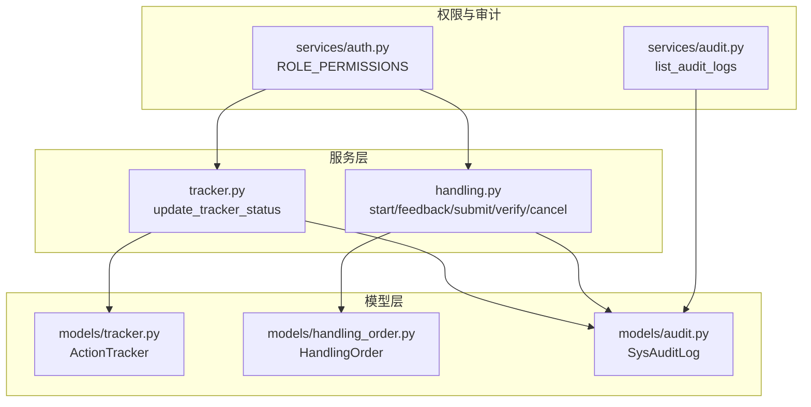
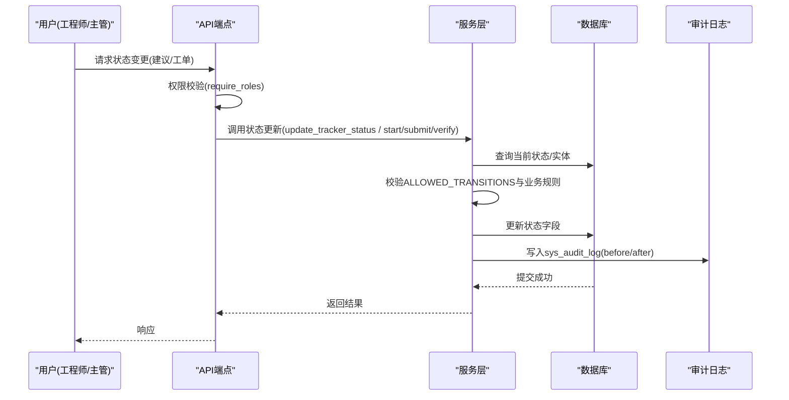
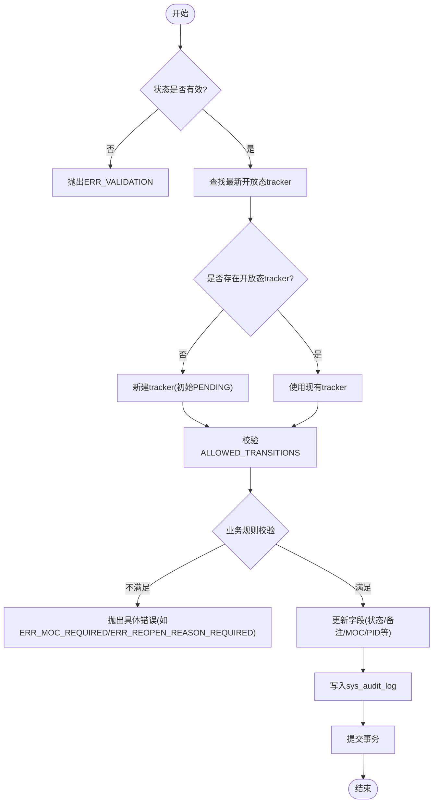
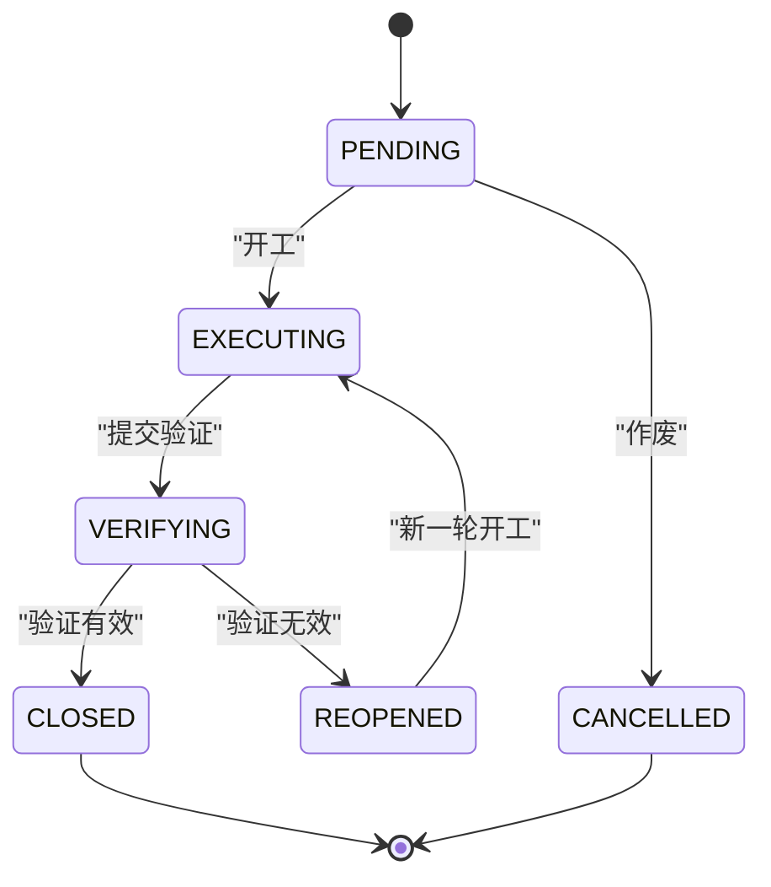
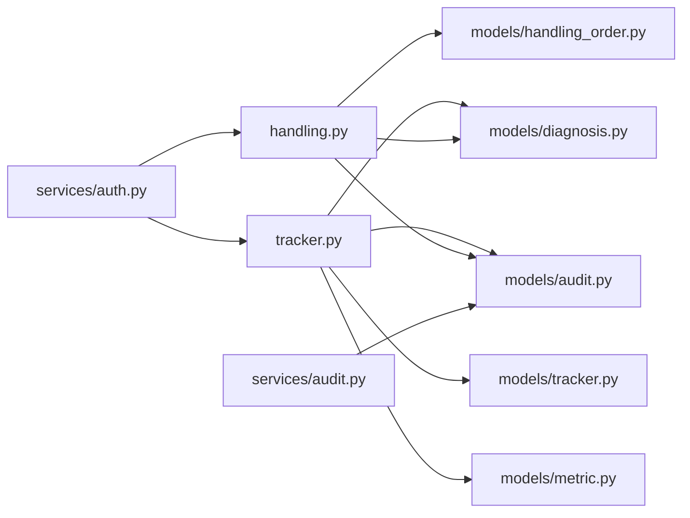

# 状态机设计

<cite>
**本文引用的文件**
- [backend/app/services/tracker.py](file://backend/app/services/tracker.py)
- [backend/app/models/tracker.py](file://backend/app/models/tracker.py)
- [backend/app/models/handling_order.py](file://backend/app/models/handling_order.py)
- [backend/app/api/v1/endpoints/handling.py](file://backend/app/api/v1/endpoints/handling.py)
- [backend/app/models/audit.py](file://backend/app/models/audit.py)
- [backend/app/services/audit.py](file://backend/app/services/audit.py)
- [backend/app/services/auth.py](file://backend/app/services/auth.py)
</cite>

## 目录
1. [简介](#简介)
2. [项目结构](#项目结构)
3. [核心组件](#核心组件)
4. [架构总览](#架构总览)
5. [详细组件分析](#详细组件分析)
6. [依赖关系分析](#依赖关系分析)
7. [性能考虑](#性能考虑)
8. [故障排查指南](#故障排查指南)
9. [结论](#结论)
10. [附录：扩展指南](#附录：扩展指南)

## 简介
本技术文档围绕“双状态机”架构展开，分别覆盖：
- 建议实体的五态审核状态机（与处置工单来源相关）
- 处置工单的六态执行状态机（排程-执行-验证-闭环）

重点说明：
- 允许的状态转换规则（ALLOWED_TRANSITIONS）
- 终态不可转换约束（CLOSED、IGNORED）
- 开放态之间的业务校验（如 REOPENED 必填重开原因、VERIFYING 必填 MOC/PID 等）
- 状态变更审计日志（sys_audit_log）
- 角色权限与操作边界
- 状态转换图与规则表
- 如何扩展新状态与转换规则

## 项目结构
与状态机相关的代码主要分布在服务层、模型层与 API 端点：
- 服务层：tracker 服务实现建议实体（ActionTracker）的更新与 A/B 对比；handling 端点实现处置工单流转。
- 模型层：ActionTracker 与 HandlingOrder 定义状态枚举、约束与索引。
- 审计：SysAuditLog 记录每次状态变更的前后值。
- 权限：ROLE_PERMISSIONS 控制不同角色对 tracker 与 handling 的操作范围。

**图表来源**
- [backend/app/services/tracker.py:89-397](file://backend/app/services/tracker.py#L89-L397)
- [backend/app/api/v1/endpoints/handling.py:1043-1200](file://backend/app/api/v1/endpoints/handling.py#L1043-L1200)
- [backend/app/models/tracker.py:23-170](file://backend/app/models/tracker.py#L23-L170)
- [backend/app/models/handling_order.py:38-121](file://backend/app/models/handling_order.py#L38-L121)
- [backend/app/models/audit.py:15-39](file://backend/app/models/audit.py#L15-L39)
- [backend/app/services/auth.py:58-104](file://backend/app/services/auth.py#L58-L104)
- [backend/app/services/audit.py:17-70](file://backend/app/services/audit.py#L17-L70)

**章节来源**
- [backend/app/services/tracker.py:89-397](file://backend/app/services/tracker.py#L89-L397)
- [backend/app/api/v1/endpoints/handling.py:1043-1200](file://backend/app/api/v1/endpoints/handling.py#L1043-L1200)
- [backend/app/models/tracker.py:23-170](file://backend/app/models/tracker.py#L23-L170)
- [backend/app/models/handling_order.py:38-121](file://backend/app/models/handling_order.py#L38-L121)
- [backend/app/models/audit.py:15-39](file://backend/app/models/audit.py#L15-L39)
- [backend/app/services/auth.py:58-104](file://backend/app/services/auth.py#L58-L104)
- [backend/app/services/audit.py:17-70](file://backend/app/services/audit.py#L17-L70)

## 核心组件
- 建议实体（ActionTracker）状态机：支持 PENDING → IN_PROGRESS → VERIFYING → CLOSED，并允许 REOPENED 回退；任意开放态可转 IGNORED；历史兼容 IMPLEMENTED。
- 处置工单（HandlingOrder）状态机：PENDING → EXECUTING → VERIFYING → CLOSED/REOPENED；PENDING → CANCELLED。
- 状态转换校验：通过 ALLOWED_TRANSITIONS 字典集中管理，并在 update_tracker_status 中强制校验。
- 审计日志：每次状态变更写入 sys_audit_log，包含 before_value/after_value 及操作人、时间。
- 权限控制：不同角色对 tracker 与 handling 的读写能力由 ROLE_PERMISSIONS 决定。

**章节来源**
- [backend/app/services/tracker.py:35-70](file://backend/app/services/tracker.py#L35-L70)
- [backend/app/models/handling_order.py:34-36](file://backend/app/models/handling_order.py#L34-L36)
- [backend/app/models/audit.py:15-39](file://backend/app/models/audit.py#L15-L39)
- [backend/app/services/auth.py:58-104](file://backend/app/services/auth.py#L58-L104)

## 架构总览
双状态机在系统中的交互如下：
- 建议实体（ActionTracker）由诊断结果驱动或手工创建，经 IC_ENGINEER 操作进入实施与验证流程，最终闭环或忽略。
- 处置工单（HandlingOrder）作为执行载体，承接现场处置动作，经历开工、反馈、提交验证、验证结论与闭环/重开/作废。
- 两者均通过 sys_audit_log 记录状态变更，便于追溯与可视化时间线。

**图表来源**
- [backend/app/api/v1/endpoints/handling.py:1043-1200](file://backend/app/api/v1/endpoints/handling.py#L1043-L1200)
- [backend/app/services/tracker.py:89-397](file://backend/app/services/tracker.py#L89-L397)
- [backend/app/models/audit.py:15-39](file://backend/app/models/audit.py#L15-L39)

## 详细组件分析

### 建议实体（ActionTracker）五态审核状态机
- 有效状态集合：PENDING、IN_PROGRESS、VERIFYING、IMPLEMENTED、IGNORED、CLOSED、REOPENED。
- 允许转换（ALLOWED_TRANSITIONS）：
  - None → PENDING（新建）
  - PENDING → {IN_PROGRESS, IMPLEMENTED, IGNORED}
  - IN_PROGRESS → {VERIFYING, IMPLEMENTED, IGNORED, IN_PROGRESS}
  - VERIFYING → {CLOSED, REOPENED, VERIFYING, IGNORED}
  - REOPENED → {IN_PROGRESS, IMPLEMENTED, IGNORED}
  - IMPLEMENTED → {CLOSED, REOPENED, VERIFYING, IGNORED}
  - CLOSED、IGNORED 为终态，不允许转换
- 业务约束：
  - REOPENED 必须填写重开原因
  - VERIFYING 必须提供 MOC 关联或“不适用”说明，且必须填写新 PID 参数（P/I/D）
  - IN_PROGRESS 自动认领 assignee（若为空）
- 审计日志：每次状态变更写入 sys_audit_log，operation_type 为 TRACKER_STATUS_UPDATE，before_value/after_value 包含 actionStatus、evidenceUrl、remark、mocRef、newPid 等。

**图表来源**
- [backend/app/services/tracker.py:89-397](file://backend/app/services/tracker.py#L89-L397)
- [backend/app/models/tracker.py:23-170](file://backend/app/models/tracker.py#L23-L170)

**章节来源**
- [backend/app/services/tracker.py:35-70](file://backend/app/services/tracker.py#L35-L70)
- [backend/app/services/tracker.py:182-248](file://backend/app/services/tracker.py#L182-L248)
- [backend/app/services/tracker.py:328-341](file://backend/app/services/tracker.py#L328-L341)
- [backend/app/models/tracker.py:122-170](file://backend/app/models/tracker.py#L122-L170)

### 处置工单（HandlingOrder）六态执行状态机
- 状态集合：PENDING、EXECUTING、VERIFYING、CLOSED、REOPENED、CANCELLED。
- 转换规则：
  - PENDING → EXECUTING（开工）
  - EXECUTING → VERIFYING（提交验证）
  - VERIFYING → CLOSED（验证有效）或 REOPENED（验证无效）
  - PENDING → CANCELLED（作废）
  - REOPENED → EXECUTING（新一轮开工）
- 业务约束：
  - 开工时 handler 必填（缺省为当前用户），TUNING 类型可回填 pidBefore
  - 提交验证时 action_detail 必填（TUNING 需 pidAfter）
  - 验证结论时固化 kpi_before/kpi_after，并回写整定记录状态
  - 作废时需填写 cancel_reason
- 审计日志：同样通过 sys_audit_log 记录状态变更前后值。

**图表来源**
- [backend/app/models/handling_order.py:34-36](file://backend/app/models/handling_order.py#L34-L36)
- [backend/app/api/v1/endpoints/handling.py:1043-1200](file://backend/app/api/v1/endpoints/handling.py#L1043-L1200)

**章节来源**
- [backend/app/models/handling_order.py:38-121](file://backend/app/models/handling_order.py#L38-L121)
- [backend/app/api/v1/endpoints/handling.py:1043-1200](file://backend/app/api/v1/endpoints/handling.py#L1043-L1200)

### 状态转换规则表（ALLOWED_TRANSITIONS）
- 建议实体（ActionTracker）：
  - None → PENDING
  - PENDING → IN_PROGRESS / IMPLEMENTED / IGNORED
  - IN_PROGRESS → VERIFYING / IMPLEMENTED / IGNORED / IN_PROGRESS
  - VERIFYING → CLOSED / REOPENED / VERIFYING / IGNORED
  - REOPENED → IN_PROGRESS / IMPLEMENTED / IGNORED
  - IMPLEMENTED → CLOSED / REOPENED / VERIFYING / IGNORED
  - CLOSED、IGNORED 为终态，无出边
- 处置工单（HandlingOrder）：
  - PENDING → EXECUTING / CANCELLED
  - EXECUTING → VERIFYING
  - VERIFYING → CLOSED / REOPENED
  - REOPENED → EXECUTING
  - CLOSED、CANCELLED 为终态

**章节来源**
- [backend/app/services/tracker.py:51-70](file://backend/app/services/tracker.py#L51-L70)
- [backend/app/models/handling_order.py:34-36](file://backend/app/models/handling_order.py#L34-L36)

### 状态变更校验机制（update_tracker_status）
- 步骤：
  - 校验状态是否在 VALID_STATUSES
  - 校验回路存在性
  - 查找最新开放态 tracker（若无则新建，初始 PENDING）
  - 根据 before_status 查 ALLOWED_TRANSITIONS，校验目标状态是否允许
  - 业务规则校验（REOPENED 必填重开原因；VERIFYING 必填 MOC/PID）
  - 更新字段并写入审计日志
  - 提交事务
- 错误处理：
  - 非法状态：ERR_VALIDATION
  - 非法转换：ERR_INVALID_TRANSITION
  - MOC 缺失：ERR_MOC_REQUIRED
  - PID 缺失：ERR_PID_PARAMS_REQUIRED
  - 重开原因缺失：ERR_REOPEN_REASON_REQUIRED

**章节来源**
- [backend/app/services/tracker.py:89-248](file://backend/app/services/tracker.py#L89-L248)
- [backend/app/services/tracker.py:328-341](file://backend/app/services/tracker.py#L328-L341)

### 状态审计日志
- 每次状态变更写入 sys_audit_log，operation_type 为 TRACKER_STATUS_UPDATE，target_type 为 action_tracker。
- before_value/after_value 以 JSON 形式记录变更前后的关键信息（actionStatus、evidenceUrl、remark、mocRef、newPid 等）。
- 审计日志不可变，支持按 operator、operation_type、时间范围分页查询。

**章节来源**
- [backend/app/models/audit.py:15-39](file://backend/app/models/audit.py#L15-L39)
- [backend/app/services/audit.py:17-70](file://backend/app/services/audit.py#L17-L70)
- [backend/app/services/tracker.py:328-341](file://backend/app/services/tracker.py#L328-L341)

### 状态与权限关联
- 角色权限（ROLE_PERMISSIONS）：
  - IC_ENGINEER：拥有 loop:*、diagnosis:*、tuning:*、handling:*、tracker:* 等权限
  - PE_ENGINEER：拥有 loop:view/create/edit/export、handling:*、tracker:* 等权限
  - SPONSOR：只读权限（portal:view、metric:view、diagnosis:view、alert:view、handling:view）
  - EXPERT：具备 tracker:review、tuning:view、loop:view 等权限
- 端点守卫：handling 端点使用 require_roles(*_HANDLING_ROLES) 限制操作角色；tracker 更新在 endpoint 层鉴权（仅 IC_ENGINEER 可操作）。

**章节来源**
- [backend/app/services/auth.py:58-104](file://backend/app/services/auth.py#L58-L104)
- [backend/app/api/v1/endpoints/handling.py:1043-1049](file://backend/app/api/v1/endpoints/handling.py#L1043-L1049)
- [backend/app/services/tracker.py:111-122](file://backend/app/services/tracker.py#L111-L122)

## 依赖关系分析
- tracker.py 依赖 models/tracker.py（ActionTracker）、models/audit.py（SysAuditLog）、models/diagnosis.py（DiagnosisResult）、models/metric.py（KpiSnapshotHourly）等。
- handling.py 依赖 models/handling_order.py（HandlingOrder）、models/diagnosis.py（DiagnosisRun）等。
- 权限模块 services/auth.py 被多个端点引用，用于角色判定。
- 审计模块 services/audit.py 提供分页查询能力。

**图表来源**
- [backend/app/services/tracker.py:1-32](file://backend/app/services/tracker.py#L1-L32)
- [backend/app/api/v1/endpoints/handling.py:1043-1200](file://backend/app/api/v1/endpoints/handling.py#L1043-L1200)
- [backend/app/services/auth.py:58-104](file://backend/app/services/auth.py#L58-L104)
- [backend/app/services/audit.py:17-70](file://backend/app/services/audit.py#L17-L70)

**章节来源**
- [backend/app/services/tracker.py:1-32](file://backend/app/services/tracker.py#L1-L32)
- [backend/app/api/v1/endpoints/handling.py:1043-1200](file://backend/app/api/v1/endpoints/handling.py#L1043-L1200)
- [backend/app/services/auth.py:58-104](file://backend/app/services/auth.py#L58-L104)
- [backend/app/services/audit.py:17-70](file://backend/app/services/audit.py#L17-L70)

## 性能考虑
- 状态转换校验在内存中进行（ALLOWED_TRANSITIONS），开销极低。
- 审计日志写入为单次 INSERT，建议在高频场景下考虑批量写入或异步化。
- 查询最新开放态 tracker 使用索引优化（idx_action_tracker_action_status、idx_action_tracker_loop_created）。
- A/B 对比聚合 KPI 窗口涉及多次聚合查询，需注意窗口大小与数据量。

[本节为通用性能建议，无需特定文件来源]

## 故障排查指南
- 常见错误码：
  - ERR_VALIDATION：状态值无效或参数格式错误
  - ERR_INVALID_TRANSITION：状态转换不在 ALLOWED_TRANSITIONS 中
  - ERR_MOC_REQUIRED：标记已实施但未提供 MOC 或“不适用”说明
  - ERR_PID_PARAMS_REQUIRED：标记已实施但未填写新 PID 参数
  - ERR_REOPEN_REASON_REQUIRED：重开未填写原因
- 排查步骤：
  - 检查当前状态与目标状态是否在 ALLOWED_TRANSITIONS 中
  - 检查必填字段是否完整（MOC、PID、重开原因等）
  - 查看 sys_audit_log 中的 before_value/after_value 确认变更上下文
  - 核对角色权限是否允许该操作

**章节来源**
- [backend/app/services/tracker.py:123-248](file://backend/app/services/tracker.py#L123-L248)
- [backend/app/services/audit.py:73-97](file://backend/app/services/audit.py#L73-L97)

## 结论
本系统通过双状态机实现了建议实体与处置工单的规范化流转：
- 建议实体（ActionTracker）聚焦于诊断结果的整改闭环，支持实施与验证，确保变更可追溯。
- 处置工单（HandlingOrder）聚焦于现场执行过程，提供开工、反馈、验证与闭环/重开/作废的全流程管控。
- 通过 ALLOWED_TRANSITIONS 集中管理转换规则，结合严格的业务校验与审计日志，保障状态机的正确性与可审计性。
- 权限控制确保不同角色在合适范围内操作，避免越权行为。

[本节为总结性内容，无需特定文件来源]

## 附录：扩展指南
- 添加新状态：
  - 在 VALID_STATUSES 中添加新状态
  - 在 ALLOWED_TRANSITIONS 中定义允许的入边与出边
  - 在模型层 CheckConstraint 中添加新状态（如适用）
- 添加新转换规则：
  - 在 ALLOWED_TRANSITIONS 中添加 from_status → to_status 映射
  - 如需业务校验，在 update_tracker_status 中添加相应逻辑
- 添加审计字段：
  - 在 before_value/after_value 中序列化新增字段
  - 确保 SysAuditLog 能存储新字段（JSONB 或 Text）
- 权限扩展：
  - 在 ROLE_PERMISSIONS 中添加新角色的权限条目
  - 在端点中使用 require_roles 限制访问

**章节来源**
- [backend/app/services/tracker.py:35-70](file://backend/app/services/tracker.py#L35-L70)
- [backend/app/models/tracker.py:122-170](file://backend/app/models/tracker.py#L122-L170)
- [backend/app/services/auth.py:58-104](file://backend/app/services/auth.py#L58-L104)