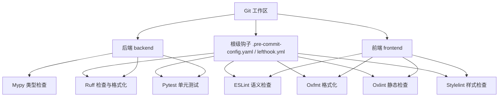
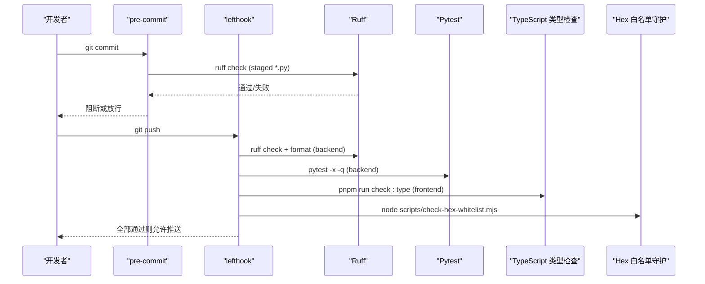
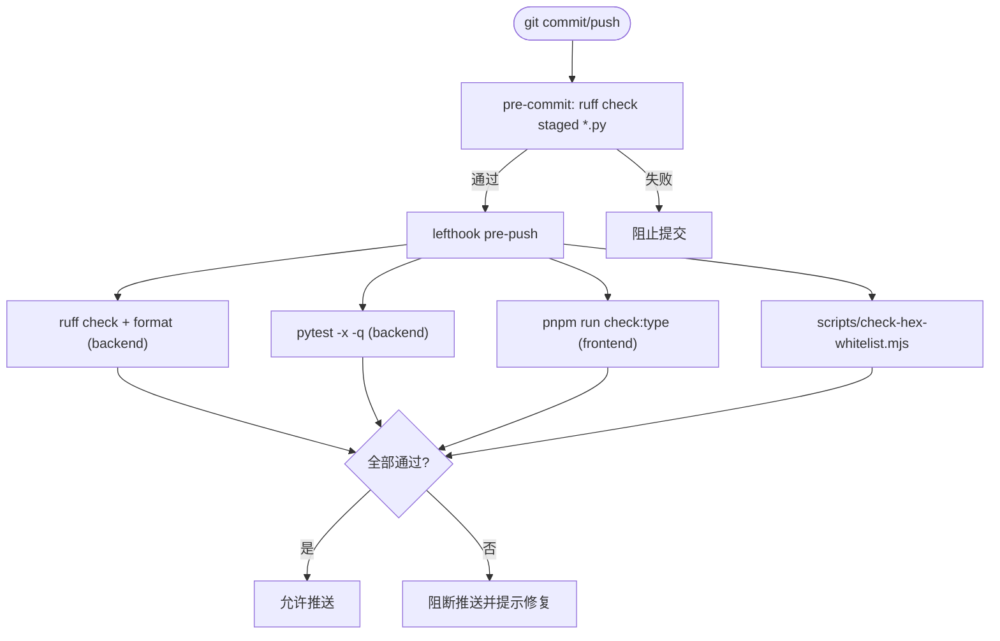
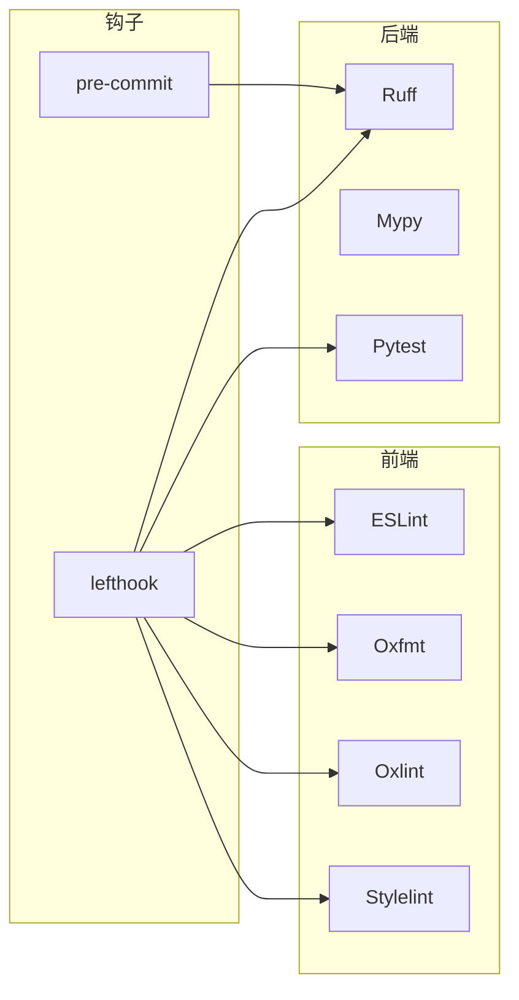

# 代码规范约定

<cite>
**本文引用的文件**
- [backend/pyproject.toml](file://backend/pyproject.toml)
- [.pre-commit-config.yaml](file://.pre-commit-config.yaml)
- [lefthook.yml](file://lefthook.yml)
- [frontend/eslint.config.mjs](file://frontend/eslint.config.mjs)
- [frontend/oxfmt.config.ts](file://frontend/oxfmt.config.ts)
- [frontend/oxlint.config.ts](file://frontend/oxlint.config.ts)
- [frontend/stylelint.config.mjs](file://frontend/stylelint.config.mjs)
- [frontend/CLPM-FRONTEND.md](file://frontend/CLPM-FRONTEND.md)
</cite>

## 目录
1. [简介](#简介)
2. [项目结构](#项目结构)
3. [核心组件](#核心组件)
4. [架构总览](#架构总览)
5. [详细组件分析](#详细组件分析)
6. [依赖分析](#依赖分析)
7. [性能考虑](#性能考虑)
8. [故障排查指南](#故障排查指南)
9. [结论](#结论)
10. [附录](#附录)

## 简介
本规范面向 CLPM-MVP 项目的后端（Python/FastAPI）与前端（TypeScript/Vue），统一代码风格、静态检查、类型检查、提交门禁与自动化流程，确保团队协作一致性与交付质量。规范覆盖：
- Python：Ruff 规则、命名约定、文件结构、注释规范
- TypeScript/Vue：ESLint 规则、Oxfmt/Oxlint 格式化与检查、Stylelint CSS 规范、组件命名、API 调用模式
- Git 提交规范：语义化提交信息、分支管理策略、代码审查流程
- Pre-commit 钩子与自动化检查：Ruff、pytest、TypeScript 类型检查、Hex 白名单守护
- 代码质量：静态分析、类型检查、测试与 CI 集成

## 项目结构
仓库采用前后端分离与 monorepo 组织：
- backend：Python FastAPI 服务，使用 Ruff、Mypy、Pytest；Alembic 管理数据库迁移
- frontend：基于 vue-vben-admin v5.7.0 的 Vue 3 + Ant Design Vue 应用，使用 ESLint、Oxfmt、Oxlint、Stylelint；Vite + Turbo monorepo
- 根级：统一的 pre-commit 与 lefthook 门禁配置，保障提交前质量

**图示来源**
- [.pre-commit-config.yaml:1-18](file://.pre-commit-config.yaml#L1-L18)
- [lefthook.yml:1-33](file://lefthook.yml#L1-L33)
- [backend/pyproject.toml:57-92](file://backend/pyproject.toml#L57-L92)
- [frontend/eslint.config.mjs:1-19](file://frontend/eslint.config.mjs#L1-L19)
- [frontend/oxfmt.config.ts:1-27](file://frontend/oxfmt.config.ts#L1-L27)
- [frontend/oxlint.config.ts:1-10](file://frontend/oxlint.config.ts#L1-L10)
- [frontend/stylelint.config.mjs:1-9](file://frontend/stylelint.config.mjs#L1-L9)

**章节来源**
- [backend/pyproject.toml:1-103](file://backend/pyproject.toml#L1-L103)
- [frontend/CLPM-FRONTEND.md:1-121](file://frontend/CLPM-FRONTEND.md#L1-L121)

## 核心组件
- 后端质量工具链
  - Ruff：代码检查与格式化，行宽限制、选择规则集、per-file ignores、isort 分组
  - Mypy：严格类型检查
  - Pytest：异步测试、超时保护、标记集成测试
- 前端质量工具链
  - ESLint：基于 @vben/eslint-config 的语义规则，Vue 模板布局交由 Oxfmt
  - Oxfmt：Vue/TS/JS 格式化
  - Oxlint：轻量静态检查（关闭高风险历史债务项）
  - Stylelint：CSS 规则，兼容 Tailwind 工具类
- 提交门禁
  - pre-commit：仅对暂存 Python 文件快速 ruff check
  - lefthook：push 前串行执行后端 ruff + pytest、前端 typecheck、hex 白名单守护

**章节来源**
- [backend/pyproject.toml:57-92](file://backend/pyproject.toml#L57-L92)
- [.pre-commit-config.yaml:1-18](file://.pre-commit-config.yaml#L1-L18)
- [lefthook.yml:1-33](file://lefthook.yml#L1-L33)
- [frontend/eslint.config.mjs:1-19](file://frontend/eslint.config.mjs#L1-L19)
- [frontend/oxfmt.config.ts:1-27](file://frontend/oxfmt.config.ts#L1-L27)
- [frontend/oxlint.config.ts:1-10](file://frontend/oxlint.config.ts#L1-L10)
- [frontend/stylelint.config.mjs:1-9](file://frontend/stylelint.config.mjs#L1-L9)

## 架构总览
提交到仓库的代码将经过以下质量门禁：
- 提交阶段：pre-commit 对暂存 Python 文件执行 ruff check
- 推送阶段：lefthook 依次执行后端 ruff check/format、pytest、前端类型检查、hex 白名单守护
- 构建/CI：可复用上述命令进行流水线检查

**图示来源**
- [.pre-commit-config.yaml:1-18](file://.pre-commit-config.yaml#L1-L18)
- [lefthook.yml:7-32](file://lefthook.yml#L7-L32)
- [backend/pyproject.toml:57-92](file://backend/pyproject.toml#L57-L92)
- [frontend/CLPM-FRONTEND.md:68-85](file://frontend/CLPM-FRONTEND.md#L68-L85)

## 详细组件分析

### Python 代码规范（Ruff、命名、文件结构、注释）
- Ruff 配置要点
  - 行宽：100
  - 目标版本：py312
  - 规则集：E/W/F/I/B/C4/UP（基础语法、导入、重构建议等）
  - per-file ignores：alembic 迁移脚本忽略未使用导入；FastAPI 路由默认参数使用 Depends() 豁免；测试中 fixture 重定义豁免
  - isort：识别 app 为第一方包
- 命名约定
  - 模块与包：小写下划线（如 services、schemas）
  - 类名：大驼峰（如 LoopService）
  - 函数/变量：小写下划线（如 get_loop_metrics）
  - 常量：全大写下划线（如 MAX_RETRIES）
- 文件结构
  - app/api：REST API 路由与依赖注入
  - app/services：业务逻辑
  - app/models：SQLAlchemy 模型
  - app/schemas：Pydantic 数据模型
  - app/core：核心配置、数据库、安全、日志等
  - tests：按功能域组织测试用例
- 注释规范
  - 模块/类/函数提供 docstring，说明职责、参数、返回值与异常
  - 复杂算法与边界条件添加行内注释，解释“为什么”而非“是什么”
  - 对外暴露的 API 在 schema 层以字段描述说明业务含义

**章节来源**
- [backend/pyproject.toml:57-75](file://backend/pyproject.toml#L57-L75)
- [backend/pyproject.toml:76-87](file://backend/pyproject.toml#L76-L87)

### TypeScript/Vue 代码规范（ESLint、Oxfmt、Oxlint、Stylelint、组件命名、API 调用）
- ESLint
  - 基于 @vben/eslint-config，聚焦语义规则
  - 针对 .vue 文件关闭模板布局相关规则，交由 Oxfmt 处理
  - 允许 any 类型以降低迁移成本（可按需收紧）
- Oxfmt
  - 统一格式化，忽略 dist、node_modules、public 等生成与第三方目录
- Oxlint
  - 关闭非空断言规则以兼容历史代码，避免阻塞 CI
- Stylelint
  - 继承 @vben/stylelint-config，兼容 Tailwind 工具类命名
- 组件命名
  - 组件文件与大驼峰命名（如 LoopDetail.vue）
  - 组合式函数 useXxx（如 useLoopMetrics）
  - 页面视图 views 下按模块划分目录
- API 调用模式
  - 在 apps/web-antd/src/api 下按模块封装请求，统一基址与拦截器
  - 使用 Pinia store 管理状态，组件仅负责展示与交互
  - 环境变量 VITE_GLOB_API_URL 控制开发/生产后端地址

**章节来源**
- [frontend/eslint.config.mjs:1-19](file://frontend/eslint.config.mjs#L1-L19)
- [frontend/oxfmt.config.ts:1-27](file://frontend/oxfmt.config.ts#L1-L27)
- [frontend/oxlint.config.ts:1-10](file://frontend/oxlint.config.ts#L1-L10)
- [frontend/stylelint.config.mjs:1-9](file://frontend/stylelint.config.mjs#L1-L9)
- [frontend/CLPM-FRONTEND.md:15-29](file://frontend/CLPM-FRONTEND.md#L15-L29)
- [frontend/CLPM-FRONTEND.md:87-121](file://frontend/CLPM-FRONTEND.md#L87-L121)

### Git 提交规范（语义化提交、分支管理、代码审查）
- 语义化提交信息
  - 类型：feat、fix、docs、style、refactor、perf、test、build、ci、chore、revert
  - 格式：<type>(scope): <subject>
  - 示例：feat(api): 新增回路诊断任务接口
- 分支管理策略
  - main：稳定发布分支
  - develop：集成开发分支
  - feature/*：新功能分支
  - fix/*：缺陷修复分支
  - hotfix/*：紧急修复分支
- 代码审查流程
  - 所有变更通过 Pull Request 合并至 develop/main
  - PR 必须通过 lefthook 本地门禁与 CI 检查
  - 至少一名 reviewer 批准后方可合并

[本节为通用实践说明，不直接分析具体文件]

### Pre-commit 钩子与自动化检查
- pre-commit
  - 仅对暂存 Python 文件执行 ruff check，快速反馈
- lefthook
  - pre-push：串行执行后端 ruff check/format、pytest、前端类型检查、hex 白名单守护
  - pre-commit：并行执行暂存 Python 文件的 ruff check

**图示来源**
- [.pre-commit-config.yaml:1-18](file://.pre-commit-config.yaml#L1-L18)
- [lefthook.yml:7-32](file://lefthook.yml#L7-L32)

**章节来源**
- [.pre-commit-config.yaml:1-18](file://.pre-commit-config.yaml#L1-L18)
- [lefthook.yml:1-33](file://lefthook.yml#L1-L33)

### 代码质量检查、静态分析与类型检查
- 后端
  - Ruff：检查与格式化（参考 pyproject.toml 中的 tool.ruff 配置）
  - Mypy：严格类型检查（strict=true）
  - Pytest：单元测试与超时保护
- 前端
  - ESLint：语义规则（@vben/eslint-config）
  - Oxfmt：格式化
  - Oxlint：静态检查（关闭高风险历史项）
  - Stylelint：样式规则（兼容 Tailwind）
- 运行方式
  - 后端：uv run ruff check/.format；uv run pytest
  - 前端：pnpm run lint；pnpm run check:type

**章节来源**
- [backend/pyproject.toml:57-92](file://backend/pyproject.toml#L57-L92)
- [frontend/eslint.config.mjs:1-19](file://frontend/eslint.config.mjs#L1-L19)
- [frontend/oxfmt.config.ts:1-27](file://frontend/oxfmt.config.ts#L1-L27)
- [frontend/oxlint.config.ts:1-10](file://frontend/oxlint.config.ts#L1-L10)
- [frontend/stylelint.config.mjs:1-9](file://frontend/stylelint.config.mjs#L1-L9)
- [frontend/CLPM-FRONTEND.md:68-85](file://frontend/CLPM-FRONTEND.md#L68-L85)

### 代码风格示例与最佳实践
- Python
  - 使用 Ruff 自动格式化与修复，保持行宽 100
  - 遵循 PEP8 命名与导入顺序（isort）
  - 对外接口使用 Pydantic schema 明确输入输出
  - 错误处理集中化，抛出领域异常并在 API 层转换为 HTTP 响应
- TypeScript/Vue
  - 组件与组合式函数采用清晰命名，职责单一
  - API 调用集中在 api 模块，store 管理状态，组件只关注 UI
  - 使用 Oxfmt 统一格式化，ESLint 保证语义正确性
  - 样式使用 Tailwind 工具类，避免自定义 BEM 冲突

[本节为通用实践说明，不直接分析具体文件]

## 依赖分析
- 后端依赖
  - Ruff：代码检查与格式化
  - Mypy：类型检查
  - Pytest：测试框架
- 前端依赖
  - ESLint：语义检查
  - Oxfmt：格式化
  - Oxlint：静态检查
  - Stylelint：样式检查
- 钩子依赖
  - pre-commit：Python 暂存文件快速检查
  - lefthook：push 前完整门禁

**图示来源**
- [backend/pyproject.toml:57-92](file://backend/pyproject.toml#L57-L92)
- [frontend/eslint.config.mjs:1-19](file://frontend/eslint.config.mjs#L1-L19)
- [frontend/oxfmt.config.ts:1-27](file://frontend/oxfmt.config.ts#L1-L27)
- [frontend/oxlint.config.ts:1-10](file://frontend/oxlint.config.ts#L1-L10)
- [frontend/stylelint.config.mjs:1-9](file://frontend/stylelint.config.mjs#L1-L9)
- [.pre-commit-config.yaml:1-18](file://.pre-commit-config.yaml#L1-L18)
- [lefthook.yml:7-32](file://lefthook.yml#L7-L32)

**章节来源**
- [backend/pyproject.toml:57-92](file://backend/pyproject.toml#L57-L92)
- [frontend/eslint.config.mjs:1-19](file://frontend/eslint.config.mjs#L1-L19)
- [frontend/oxfmt.config.ts:1-27](file://frontend/oxfmt.config.ts#L1-L27)
- [frontend/oxlint.config.ts:1-10](file://frontend/oxlint.config.ts#L1-L10)
- [frontend/stylelint.config.mjs:1-9](file://frontend/stylelint.config.mjs#L1-L9)
- [.pre-commit-config.yaml:1-18](file://.pre-commit-config.yaml#L1-L18)
- [lefthook.yml:7-32](file://lefthook.yml#L7-L32)

## 性能考虑
- 本地开发
  - 使用 pre-commit 仅检查暂存文件，减少等待时间
  - 按需运行 ruff check 与 pytest，避免全量扫描
- 持续集成
  - 复用 lefthook 的命令，确保本地与 CI 一致性
  - 分阶段执行：先静态检查，再测试，最后构建

[本节为通用指导，不直接分析具体文件]

## 故障排查指南
- Ruff 报错
  - 根据提示修复代码风格问题，或使用 ruff --fix 自动修复
  - 若为 alembic 迁移脚本误报，确认 per-file ignores 已生效
- Pytest 超时或挂起
  - 检查外部依赖（DB/Redis/Celery）是否可用
  - 使用 -m 'not integration' 跳过集成测试
- 前端类型检查失败
  - 根据 ts 错误定位类型定义，必要时临时放宽 any 使用
  - 使用 pnpm run check:type 获取详细错误信息
- Hex 白名单守护失败
  - 检查新增颜色值是否在白名单中，或更新白名单并说明原因

**章节来源**
- [backend/pyproject.toml:64-71](file://backend/pyproject.toml#L64-L71)
- [backend/pyproject.toml:76-87](file://backend/pyproject.toml#L76-L87)
- [lefthook.yml:20-22](file://lefthook.yml#L20-L22)
- [frontend/CLPM-FRONTEND.md:68-85](file://frontend/CLPM-FRONTEND.md#L68-L85)

## 结论
本规范通过 Ruff、Mypy、Pytest、ESLint、Oxfmt、Oxlint、Stylelint 与 lefthook/pre-commit 的组合，构建了从提交到推送的全链路质量门禁。遵循本规范可显著提升代码一致性、可维护性与交付稳定性。建议在团队内推广并定期回顾优化规则。

[本节为总结性内容，不直接分析具体文件]

## 附录
- 常用命令
  - 后端：uv run ruff check/.format；uv run pytest
  - 前端：pnpm run lint；pnpm run check:type
- 环境变量
  - VITE_GLOB_API_URL：后端 API 基址（开发/生产）
- 目录结构
  - 后端：app、tests、alembic
  - 前端：apps/web-antd、packages、internal

**章节来源**
- [backend/pyproject.toml:57-92](file://backend/pyproject.toml#L57-L92)
- [frontend/CLPM-FRONTEND.md:15-29](file://frontend/CLPM-FRONTEND.md#L15-L29)
- [frontend/CLPM-FRONTEND.md:68-85](file://frontend/CLPM-FRONTEND.md#L68-L85)
- [frontend/CLPM-FRONTEND.md:87-121](file://frontend/CLPM-FRONTEND.md#L87-L121)