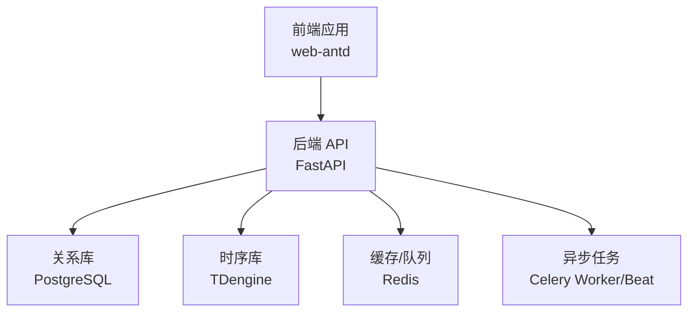
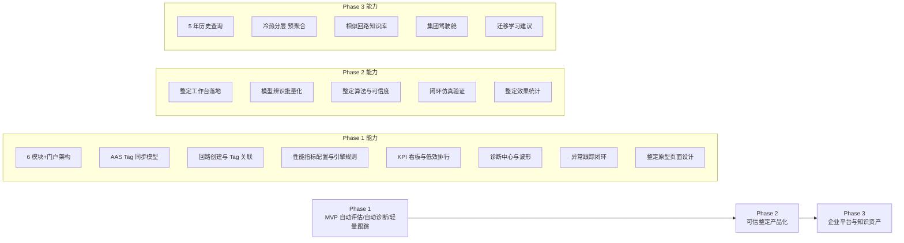
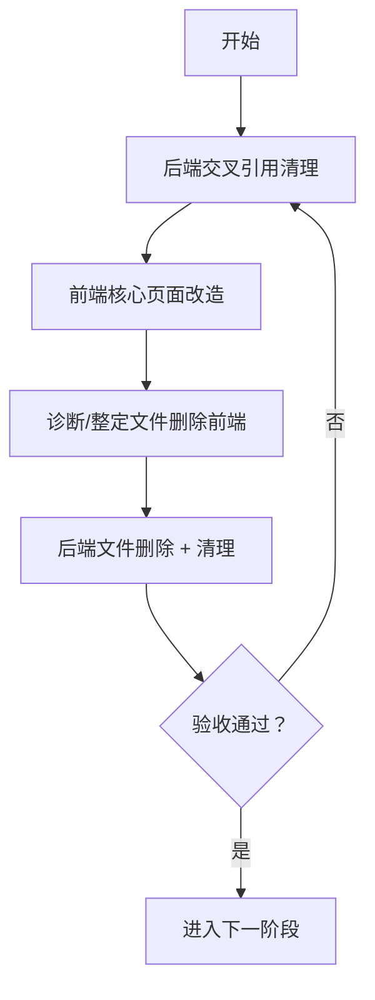
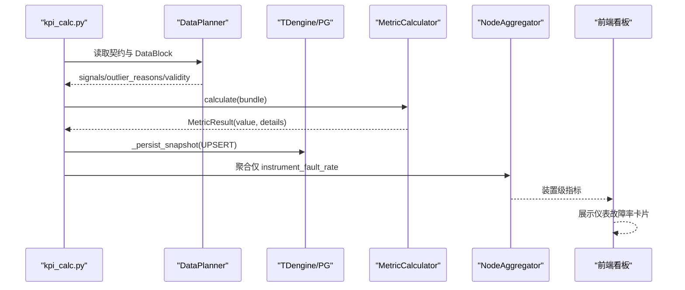
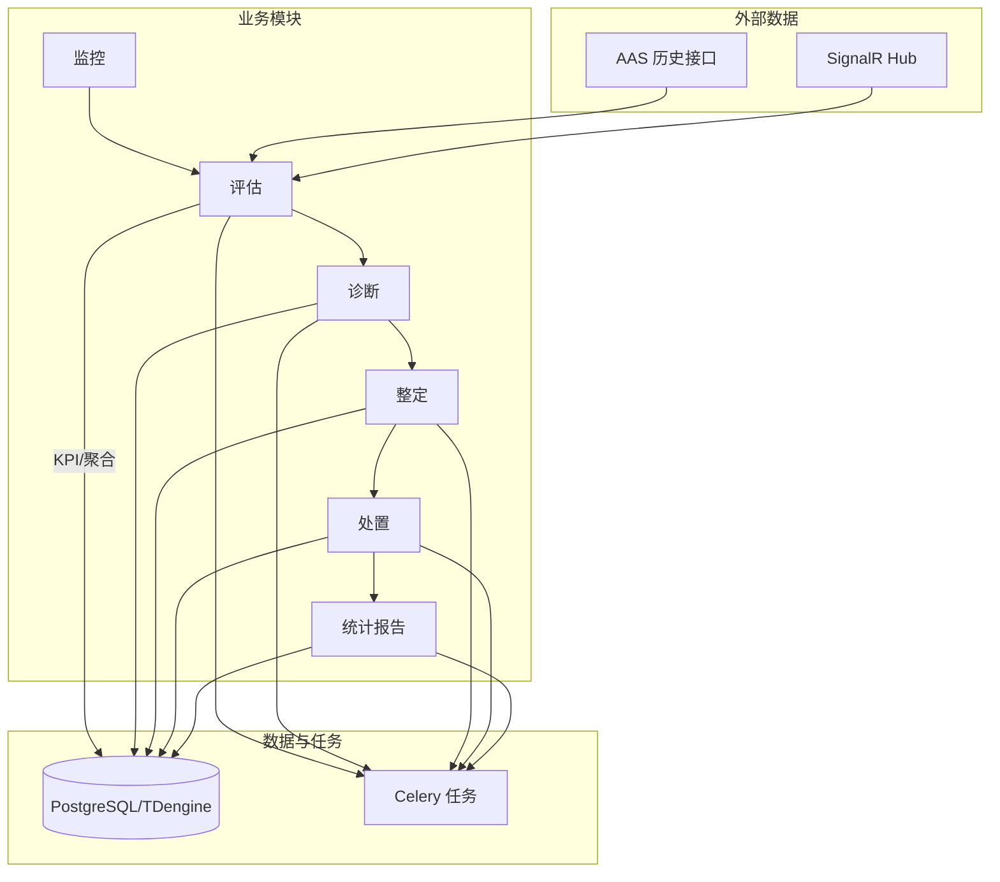

# 分阶段实施工作流

<cite>
**本文引用的文件**
- [README.md](file://README.md)
- [05-实施路线图.md](file://docs/MVP设计/05-实施路线图.md)
- [Phase1-可执行任务清单-2026-07-23.md](file://docs/过程文档/Phase1-可执行任务清单-2026-07-23.md)
- [clpm-version-roadmap.mmd](file://diagrams/clpm-version-roadmap.mmd)
- [PRD.md](file://docs/设计文档/01-PRD/PRD.md)
- [CLPM_v4.0_系统重构实施方案.md](file://docs/设计文档/CLPM_v4.0_系统重构实施方案.md)
- [clpm-v6.2-progress-tracker.md](file://docs/过程文档/clpm-v6.2-progress-tracker.md)
- [clpm-v6.2-product-and-identification-optimization-plan-2026-07-29.md](file://docs/过程文档/clpm-v6.2-product-and-identification-optimization-plan-2026-07-29.md)
- [DESIGN.md](file://DESIGN.md)
</cite>

## 目录
1. [引言](#引言)
2. [项目结构](#项目结构)
3. [核心组件](#核心组件)
4. [架构总览](#架构总览)
5. [详细组件分析](#详细组件分析)
6. [依赖分析](#依赖分析)
7. [性能考虑](#性能考虑)
8. [故障排查指南](#故障排查指南)
9. [结论](#结论)
10. [附录](#附录)

## 引言
本文件面向“分阶段实施工作流”，基于仓库中的产品需求、实现契约与过程文档，梳理 CLPM-MVP 从 Phase 0 到 Phase 4 的阶段性目标、交付物、里程碑与验收标准，并给出跨模块（后端、前端、数据、部署）的实施路径与风险点。重点覆盖：
- 阶段划分与依赖关系
- 每个阶段的范围、关键任务与验收门禁
- 数据与算法链路在阶段演进中的变化
- 前后端协同与发布策略
- 常见风险与回滚策略

## 项目结构
CLPM-MVP 采用前后端分离与多服务编排：
- 后端：FastAPI + Celery + SQLAlchemy + TDengine/PostgreSQL/Redis
- 前端：Vue 3 + TypeScript + Vite + Ant Design Vue
- 部署：Docker Compose + Nginx；生产通过脚本一键构建与部署
- 文档与设计：MVP 设计、PRD/FDS/ADS/DDS/IDS/UIUX、过程文档与版本路线图

**图表来源**
- [README.md:22-36](file://README.md#L22-L36)
- [README.md:229-247](file://README.md#L229-L247)

**章节来源**
- [README.md:22-36](file://README.md#L22-L36)
- [README.md:229-247](file://README.md#L229-L247)

## 核心组件
围绕“监控→评估→诊断→整定→处置→统计报告”的闭环，结合 MVP 与 v6.x 系列规划，形成以下核心能力域：
- 监控与工作台门户：聚合看板、关注队列、回路工作台
- 性能评估：KPI 计算、指标配置、节点聚合、报表
- 诊断中心：诊断任务、记录、可视化、异常跟踪
- 回路整定：辨识→矩阵→仿真→确认单页流程
- 处置：建议审核+工单执行，KPI 前后对比验证
- 统计报告：管理总览、绩效/诊断/处置/收益报告、订阅配置
- 智能预警：规则引擎 + 事件流 + 实时推送
- 系统管理：用户/审计/权限/字典/模块热插拔

上述能力在不同阶段逐步落地与增强，详见后续阶段分解。

**章节来源**
- [README.md:7-19](file://README.md#L7-L19)
- [PRD.md:134-149](file://docs/设计文档/01-PRD/PRD.md#L134-L149)

## 架构总览
版本路线图将实施分为三主阶段（MVP → 可信整定产品化 → 企业平台与知识资产），每阶段包含若干子能力与里程碑。

**图表来源**
- [clpm-version-roadmap.mmd:1-26](file://diagrams/clpm-version-roadmap.mmd#L1-L26)

**章节来源**
- [clpm-version-roadmap.mmd:1-26](file://diagrams/clpm-version-roadmap.mmd#L1-L26)

## 详细组件分析

### 阶段 0：安全与事实收口（Truth First）
- 目标：停止产生或展示不可信结果；固化状态机与 schema 真相源；修复生产 bootstrap 与 fresh-install。
- 关键约束：禁止无有效阶跃的 AUTO fallback；历史 IPDT 暂时下线；收容固定 theta=2Ts 风险；A–E 放行门禁；移除伪 0 风险 KPI；对现有 IV 降级标识；建立回归数据集；校正六份设计事实源。
- 验收：Go/No-Go 明确，未达标不得开启自动滑窗或后台在线辨识。

**章节来源**
- [clpm-v6.2-product-and-identification-optimization-plan-2026-07-29.md:414-432](file://docs/过程文档/clpm-v6.2-product-and-identification-optimization-plan-2026-07-29.md#L414-L432)

### 阶段 1：后端交叉引用清理与 MVP 闭环
- 目标：清理保留 endpoints 中诊断/整定交叉引用，使保留模块不再依赖诊断/整定模型和服务；同时完成 MVP 闭环（自动评估、自动诊断、轻量跟踪、适用性分层）。
- 关键任务（示例）：
  - 后端交叉引用清理（dashboard/monitor/ai_insight/configs 等）
  - 前端核心页面改造（删除诊断/整定/闭环 UI 内容）
  - 诊断/整定文件删除（前端 API/页面/组件/路由/store）
  - 后端文件删除 + 清理注释代码
- 验收：ruff/pytest 通过；系统概览/关注队列/AI 洞察接口正常；前端构建成功；保留模块 API 正常；诊断/整定 API 返回 404。

**图表来源**
- [05-实施路线图.md:7-118](file://docs/MVP设计/05-实施路线图.md#L7-L118)

**章节来源**
- [05-实施路线图.md:7-118](file://docs/MVP设计/05-实施路线图.md#L7-L118)

### 阶段 1（续）：仪表故障率与统计/诊断指标落地
- 目标：新增仪表故障率及多项统计/诊断指标，打通 9 个环节（契约→DataBlock→Bundle→Calculator→三层编排→持久化→聚合→前端）。
- 关键任务：
  - 数据库迁移（两张快照表同批新增字段）
  - 数据需求契约声明（tagGroup/tags/mask/depends_on）
  - 计算器实现（InstrumentFaultRateCalculator、PV/SP/OP/Error 均值/标准差、阀门线性/非线性/运行区间、设定点穿越次数、振荡幅值）
  - 注册与映射（计算器注册表、DB 列名双向映射、三层编排层级归属）
  - 持久化接线（显式具名参数传递）
  - 节点聚合（仅故障率 AGGREGATABLE）
  - 单元测试与前端最小卡片展示
- 验收：全量测试通过；Worker 加载新计算器；聚合响应含新字段；前端卡片展示正常。

**图表来源**
- [Phase1-可执行任务清单-2026-07-23.md:9-27](file://docs/过程文档/Phase1-可执行任务清单-2026-07-23.md#L9-L27)
- [Phase1-可执行任务清单-2026-07-23.md:31-70](file://docs/过程文档/Phase1-可执行任务清单-2026-07-23.md#L31-L70)
- [Phase1-可执行任务清单-2026-07-23.md:96-178](file://docs/过程文档/Phase1-可执行任务清单-2026-07-23.md#L96-L178)
- [Phase1-可执行任务清单-2026-07-23.md:353-432](file://docs/过程文档/Phase1-可执行任务清单-2026-07-23.md#L353-L432)
- [Phase1-可执行任务清单-2026-07-23.md:435-518](file://docs/过程文档/Phase1-可执行任务清单-2026-07-23.md#L435-L518)

**章节来源**
- [Phase1-可执行任务清单-2026-07-23.md:9-27](file://docs/过程文档/Phase1-可执行任务清单-2026-07-23.md#L9-L27)
- [Phase1-可执行任务清单-2026-07-23.md:31-70](file://docs/过程文档/Phase1-可执行任务清单-2026-07-23.md#L31-L70)
- [Phase1-可执行任务清单-2026-07-23.md:96-178](file://docs/过程文档/Phase1-可执行任务清单-2026-07-23.md#L96-L178)
- [Phase1-可执行任务清单-2026-07-23.md:353-432](file://docs/过程文档/Phase1-可执行任务清单-2026-07-23.md#L353-L432)
- [Phase1-可执行任务清单-2026-07-23.md:435-518](file://docs/过程文档/Phase1-可执行任务清单-2026-07-23.md#L435-L518)

### 阶段 2：可信整定产品化
- 目标：整定工作台落地、模型辨识批量化、整定算法与可信度、闭环仿真验证、整定效果统计。
- 关键约束：模型来源门禁（A/B 放行、C 人工确认、D/E/INCONCLUSIVE/HEURISTIC_2TS/实验性 IV 禁止进入整定）；安全边界（不直接下写 DCS，只输出建议/证据/风险/回退方案）。
- 验收：整定全流程可用；仿真与效果统计可验证；状态机与历史兼容映射一致。

**章节来源**
- [PRD.md:8-14](file://docs/设计文档/01-PRD/PRD.md#L8-L14)
- [clpm-v6.2-product-and-identification-optimization-plan-2026-07-29.md:469-481](file://docs/过程文档/clpm-v6.2-product-and-identification-optimization-plan-2026-07-29.md#L469-L481)

### 阶段 3：模型生命周期与整改闭环
- 目标：决定模型是否值得成为独立版本实体，连通“人工选择时间窗所得模型”的发布、实施和验证；不包含在线影子候选发布。
- 关键任务：执行模型实体 ADR；建最小 process_model_version；整定记录引用模型版本；人工实施清单与回退值；Tracker A/B 效果验证。
- 验收：若独立模型复用和漂移管理需求不成立，则不建新表，继续用 tuning_record。

**章节来源**
- [clpm-v6.2-product-and-identification-optimization-plan-2026-07-29.md:469-481](file://docs/过程文档/clpm-v6.2-product-and-identification-optimization-plan-2026-07-29.md#L469-L481)

### 阶段 4：在线影子运行
- 目标：验证连续在线能力的收益和误报成本；每日/每周滑窗扫描生成候选；事件触发重辨识；当前模型与新候选漂移比较；独立低优先队列、限流、超时、能力开关和任务监控；试点复核队列与分层评估报表；在线影子候选不更新 CURRENT、不触发 PID 推荐。
- 验收阈值：20+ 回路持续观测至少 4 周；输出可辨识率、误报率、拒绝原因、参数误差、工况切换影响和人工审阅时间。

**章节来源**
- [clpm-v6.2-product-and-identification-optimization-plan-2026-07-29.md:483-496](file://docs/过程文档/clpm-v6.2-product-and-identification-optimization-plan-2026-07-29.md#L483-L496)

### 历史重构阶段（v4.0 参考）
- 阶段依赖：ORM 模型 → 预处理 → DataPlanner+缓存 → 指标计算器重构 → kpi_calc.py 整合 → API 扩展 → 前端适配。
- 里程碑：各阶段完成后进行端到端验证与回归。

**章节来源**
- [CLPM_v4.0_系统重构实施方案.md:541-577](file://docs/设计文档/CLPM_v4.0_系统重构实施方案.md#L541-L577)

## 依赖分析
- 阶段间依赖：Phase 0 为安全基线；Phase 1 先做 MVP 闭环与清理；Phase 2 聚焦整定产品化；Phase 3 引入模型生命周期；Phase 4 在线影子运行。
- 模块内依赖：监控/评估/诊断/整定/处置/统计报告/配置/系统八大模块遵循“配置→运行→分析”自包含结构；数据链路统一走本地 TDengine，实时数据经 SignalR/WS 入 Redis/TDengine。
- 外部依赖：AAS 历史数据接口（仅导入）、SignalR Hub（唯一实时数据源）、PostgreSQL/TDengine/Redis/Celery。

**图表来源**
- [README.md:106-136](file://README.md#L106-L136)
- [PRD.md:134-149](file://docs/设计文档/01-PRD/PRD.md#L134-L149)

**章节来源**
- [README.md:106-136](file://README.md#L106-L136)
- [PRD.md:134-149](file://docs/设计文档/01-PRD/PRD.md#L134-L149)

## 性能考虑
- 数据链路：历史数据计算一律本地 TDengine，避免远端调用延迟；实时数据经 Redis 缓存用于实时监控，可选写回 TDengine 供 KPI 计算。
- 计算优化：DataPlanner/DataBlock 缓存；指标计算器按层编排（L1/L2）；仅必要指标参与节点聚合（如仪表故障率）。
- 任务调度：Celery Worker/Beat 并发与超时控制；离线与在线任务隔离；影子运行需独立低优先级队列与限流。
- 前端性能：LTTB 降采样 maxPoints=2000，30 天窗口；首屏与 BFF p95 达标要求。

**章节来源**
- [README.md:106-136](file://README.md#L106-L136)
- [README.md:333-347](file://README.md#L333-L347)

## 故障排查指南
- 阶段通用门禁：每个 Phase 必须运行 ruff、pytest、alembic check、前端 typecheck/vitest、E2E 测试；集成分支合并前全量回归。
- 常见问题定位：
  - 数据库迁移失败：检查 alembic 迁移脚本与 ORM 一致性；确保不改动无关 schema。
  - 指标缺失：核对计算器注册、DB 列名映射、三层编排层级归属、持久化参数传递。
  - 前端构建失败：清理残留 import；确认路由/菜单/组件删除彻底。
  - 任务执行失败：检查 Celery Worker/Beat 日志与任务注册；确认依赖服务健康。
- 回滚策略：生产部署支持镜像版本回滚；迁移失败应中止并回滚；必要时恢复备份数据。

**章节来源**
- [clpm-v6.2-product-and-identification-optimization-plan-2026-07-29.md:456-491](file://docs/过程文档/clpm-v6.2-product-and-identification-optimization-plan-2026-07-29.md#L456-L491)
- [README.md:193-206](file://README.md#L193-L206)
- [README.md:274-280](file://README.md#L274-L280)

## 结论
CLPM-MVP 的分阶段实施工作流以“安全与事实收口”为前提，逐步推进 MVP 闭环、整定产品化、模型生命周期与在线影子运行。每个阶段均有明确的目标、任务、验收门禁与回滚策略，确保在复杂工业场景下的稳健交付。建议在实施过程中严格遵循阶段依赖与门禁，保持数据链路与模块边界的清晰，并通过自动化测试与部署脚本保障质量与效率。

## 附录
- 进度跟踪：v6.2 改造进度跟踪文件记录了各阶段状态、分支与完成日期，便于团队对齐与回溯。
- 非目标与边界：Phase 1 不做自动下写 DCS、真实 DCS 变更闭环、多节点审批流工单系统与 Phase 2 规模化算法拆分；整定相关能力仅输出建议与证据，不表达为自动实施能力。

**章节来源**
- [clpm-v6.2-progress-tracker.md:1-107](file://docs/过程文档/clpm-v6.2-progress-tracker.md#L1-L107)
- [DESIGN.md:319-343](file://DESIGN.md#L319-L343)