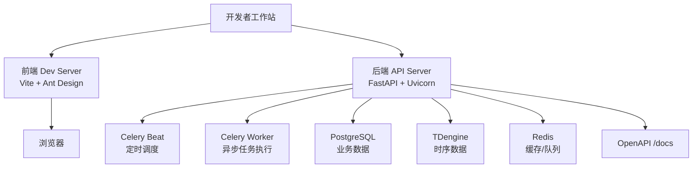
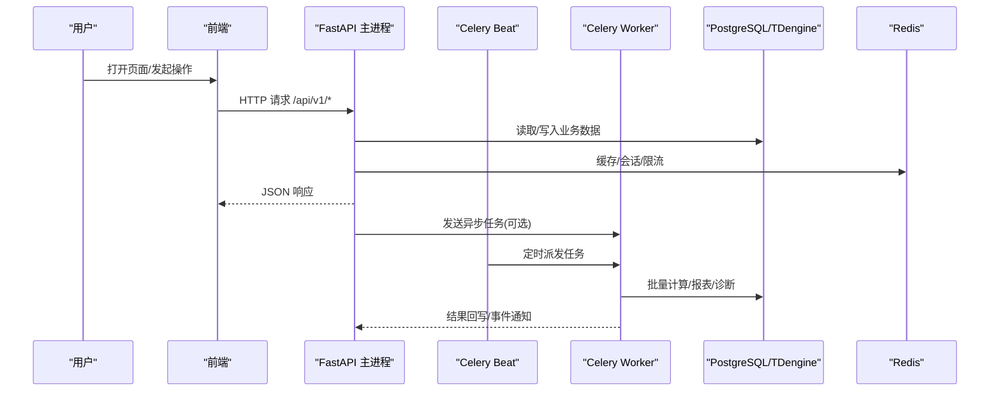
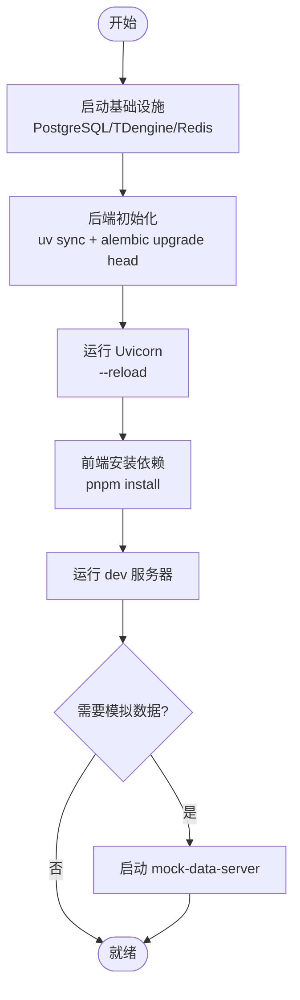
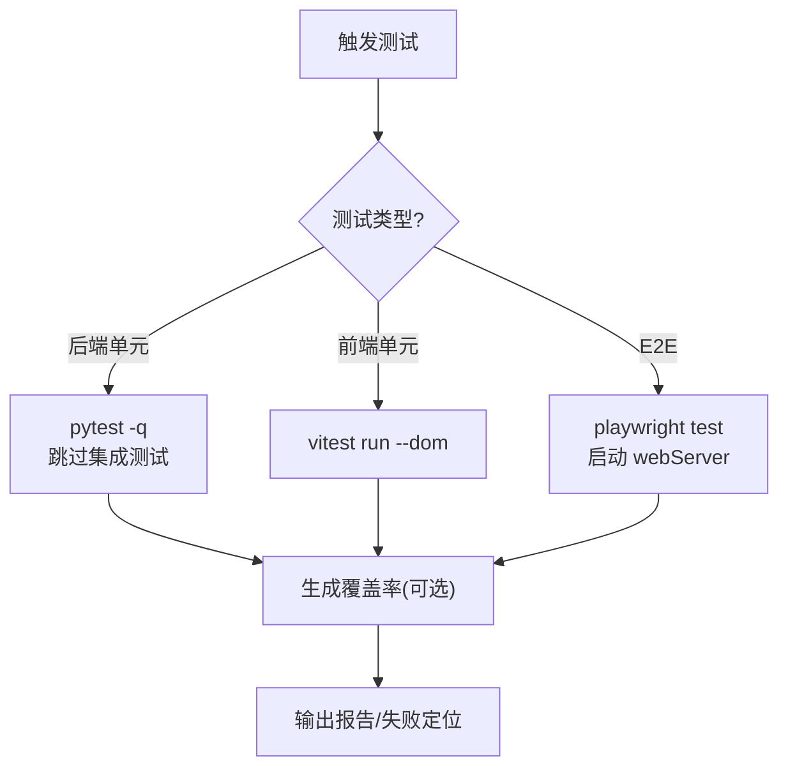
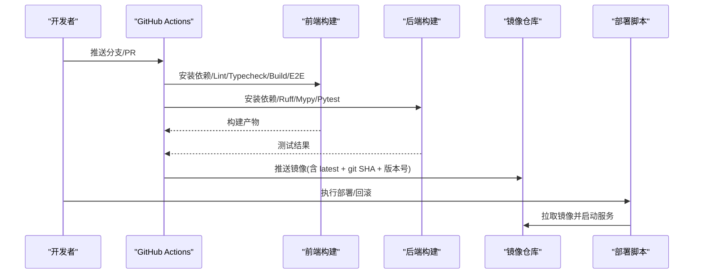
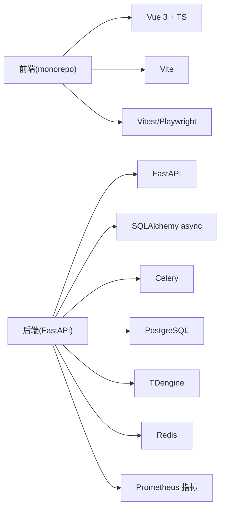

# 开发指南

<cite>
**本文引用的文件**
- [README.md](file://README.md)
- [backend/pyproject.toml](file://backend/pyproject.toml)
- [frontend/package.json](file://frontend/package.json)
- [Makefile](file://Makefile)
- [.dockerignore](file://.dockerignore)
- [frontend/eslint.config.mjs](file://frontend/eslint.config.mjs)
- [frontend/.commitlintrc.js](file://frontend/.commitlintrc.js)
- [frontend/lefthook.yml](file://frontend/lefthook.yml)
- [.github/workflows/ci.yml](file://.github/workflows/ci.yml)
- [backend/app/main.py](file://backend/app/main.py)
- [e2e/playwright.config.ts](file://e2e/playwright.config.ts)
- [deploy/docker/docker-compose.dev.yml](file://deploy/docker/docker-compose.dev.yml)
</cite>

## 目录
1. [简介](#简介)
2. [项目结构](#项目结构)
3. [核心组件](#核心组件)
4. [架构总览](#架构总览)
5. [详细组件分析](#详细组件分析)
6. [依赖关系分析](#依赖关系分析)
7. [性能考量](#性能考量)
8. [故障排查指南](#故障排查指南)
9. [结论](#结论)
10. [附录](#附录)

## 简介
本指南面向 CLPM-MVP 项目的开发者，覆盖开发环境搭建、代码规范与质量门禁、测试策略、版本发布流程、调试技巧、新功能开发流程、代码审查标准、文档维护规范以及常见问题解决方案。目标是帮助团队以一致的方式高效协作，保证代码质量与交付稳定性。

## 项目结构
CLPM-MVP 采用前后端分离 + 多服务编排的 monorepo 结构：
- 后端：FastAPI + Celery（任务与定时调度）+ SQLAlchemy async + Redis/TDengine/PostgreSQL
- 前端：Vue 3 + TypeScript + Vite + Ant Design Vue，monorepo 管理
- E2E：Playwright 端到端测试
- 部署：Docker Compose 编排开发/生产环境，Nginx 反向代理
- 工具链：Ruff/Mypy（后端）、ESLint/Oxlint/Vitest（前端）、Changesets（变更集）、GitHub Actions（CI）

图表来源
- [backend/app/main.py:610-731](file://backend/app/main.py#L610-L731)
- [deploy/docker/docker-compose.dev.yml:15-126](file://deploy/docker/docker-compose.dev.yml#L15-L126)

章节来源
- [README.md:22-36](file://README.md#L22-L36)
- [deploy/docker/docker-compose.dev.yml:1-146](file://deploy/docker/docker-compose.dev.yml#L1-L146)

## 核心组件
- 应用入口与生命周期管理：后端 FastAPI 在 lifespan 中自动启动 Celery Beat/Worker、预载配置、订阅实时数据、健康检查等；生产环境由独立容器接管 Celery。
- 数据库与迁移：Alembic 管理 PostgreSQL 迁移；TDengine 通过初始化脚本建表。
- 任务系统：Celery 负责 KPI 计算、诊断、报表生成、AAS 同步等异步任务。
- 前端工程化：Monorepo + Turborepo，统一 lint/typecheck/build/test 命令。
- CI/CD：GitHub Actions 对前后端分别执行 lint、类型检查、构建与测试。

章节来源
- [backend/app/main.py:1-13](file://backend/app/main.py#L1-L13)
- [backend/app/main.py:610-731](file://backend/app/main.py#L610-L731)
- [backend/pyproject.toml:76-87](file://backend/pyproject.toml#L76-L87)
- [frontend/package.json:27-59](file://frontend/package.json#L27-L59)
- [.github/workflows/ci.yml:20-62](file://.github/workflows/ci.yml#L20-L62)
- [.github/workflows/ci.yml:64-115](file://.github/workflows/ci.yml#L64-L115)

## 架构总览
后端在启动时完成日志、CORS、全局异常处理、路由前缀注册，并自动拉起 Celery Beat/Worker（非生产环境）。同时从 sys_config 预载数据源配置、模块启用状态、算法参数、异常值检测参数、可信度阈值等运行时配置，并启动实时数据订阅器。

图表来源
- [backend/app/main.py:610-731](file://backend/app/main.py#L610-L731)
- [backend/app/main.py:329-410](file://backend/app/main.py#L329-L410)
- [backend/app/main.py:466-526](file://backend/app/main.py#L466-L526)

## 详细组件分析

### 开发环境搭建
- 基础设施：使用 Docker Compose 一键启动 PostgreSQL、TDengine、Redis，端口与容器名已做 MVP 隔离。
- 后端：安装 Python 3.12 与 uv，复制 .env 示例，执行 Alembic 迁移后启动 Uvicorn（含 --reload）。
- 前端：Node.js ≥ 22.18.0 + pnpm ≥ 10.0.0，安装依赖后运行 dev 脚本。
- Mock 数据服务：可选启动 mock-data-server，模拟远端历史数据与实时 SignalR 推送。

图表来源
- [README.md:46-76](file://README.md#L46-L76)
- [deploy/docker/docker-compose.dev.yml:15-126](file://deploy/docker/docker-compose.dev.yml#L15-L126)

章节来源
- [README.md:38-104](file://README.md#L38-L104)
- [deploy/docker/docker-compose.dev.yml:1-146](file://deploy/docker/docker-compose.dev.yml#L1-L146)

### 代码规范约定
- 后端（Python）
  - 代码风格与静态检查：Ruff（规则集包含 E/W/F/I/B/C4/UP），Mypy 严格模式（可忽略缺失导入）
  - 格式化：ruff format
  - 测试：pytest（默认跳过集成测试标记），超时保护防止挂起
- 前端（TypeScript/Vue）
  - ESLint：基于 @vben/eslint-config，针对 TS/Vue 定制规则
  - 类型检查：vue-tsc（通过 workspace 脚本）
  - 单元测试：Vitest（happy-dom 环境）
  - 提交信息：Commitlint（@vben/commitlint-config）
  - 本地钩子：Lefthook 在 pre-commit/post-merge/commit-msg 阶段执行 lint 与 typecheck
- Git 提交规范
  - 遵循 Conventional Commits（通过 commitlint 校验）
  - 建议按功能域拆分提交，附带变更说明

章节来源
- [backend/pyproject.toml:57-74](file://backend/pyproject.toml#L57-L74)
- [backend/pyproject.toml:76-87](file://backend/pyproject.toml#L76-L87)
- [frontend/eslint.config.mjs:1-19](file://frontend/eslint.config.mjs#L1-L19)
- [frontend/.commitlintrc.js:1-2](file://frontend/.commitlintrc.js#L1-L2)
- [frontend/lefthook.yml:44-61](file://frontend/lefthook.yml#L44-L61)
- [frontend/vitest.config.ts:1-29](file://frontend/vitest.config.ts#L1-L29)

### 测试策略
- 后端单元测试
  - pytest 自动发现 tests 目录，默认跳过 integration 标记用例
  - 单测超时保护（thread 模式），避免外部依赖导致阻塞
  - 覆盖率：可通过 Makefile 目标生成报告
- 前端单元测试
  - Vitest 使用 happy-dom 环境，排除 e2e 与构建产物
  - 通过 workspace 脚本统一执行
- E2E 测试
  - Playwright 配置指定 Chromium 设备、重试策略、追踪与截图策略
  - webServer 自动启动前端 dev 服务，后端需手动启动
  - CI 中作为非阻塞步骤执行

图表来源
- [backend/pyproject.toml:76-87](file://backend/pyproject.toml#L76-L87)
- [frontend/vitest.config.ts:1-29](file://frontend/vitest.config.ts#L1-L29)
- [e2e/playwright.config.ts:1-53](file://e2e/playwright.config.ts#L1-L53)

章节来源
- [backend/pyproject.toml:76-87](file://backend/pyproject.toml#L76-L87)
- [frontend/vitest.config.ts:1-29](file://frontend/vitest.config.ts#L1-L29)
- [e2e/playwright.config.ts:1-53](file://e2e/playwright.config.ts#L1-L53)

### 版本发布流程
- 语义化版本
  - 产品文档基线 v6.2；后端运行时版本由 APP_VERSION 管理；发布版本以 Git tag 为准
- 变更集管理
  - 前端使用 Changesets（changeset 脚本、version 脚本）管理变更与生成 changelog
- CI/CD 流水线
  - 前端：安装依赖 → Lint → Typecheck → Build → E2E（非阻塞）
  - 后端：安装依赖 → Ruff check/format → Mypy（非阻塞）→ Pytest with coverage（门槛 60%）
- 发布与回滚
  - 生产部署脚本自动执行迁移、构建镜像、启动服务与健康检查
  - 提供回滚脚本列出历史镜像并回滚到上一版本

图表来源
- [README.md:391-398](file://README.md#L391-L398)
- [frontend/package.json:27-59](file://frontend/package.json#L27-L59)
- [.github/workflows/ci.yml:20-62](file://.github/workflows/ci.yml#L20-L62)
- [.github/workflows/ci.yml:64-115](file://.github/workflows/ci.yml#L64-L115)

章节来源
- [README.md:391-398](file://README.md#L391-L398)
- [frontend/package.json:27-59](file://frontend/package.json#L27-L59)
- [.github/workflows/ci.yml:20-62](file://.github/workflows/ci.yml#L20-L62)
- [.github/workflows/ci.yml:64-115](file://.github/workflows/ci.yml#L64-L115)

### 调试技巧
- 断点调试
  - 后端：Uvicorn 支持热重载，IDE 可直接断点调试 FastAPI 路由与服务逻辑
  - 前端：浏览器开发者工具 + VS Code 调试配置（配合 Vite）
- 日志分析
  - 后端：logs/celery-beat.log、logs/celery-worker.log；应用日志通过 logging 模块输出
  - 前端：控制台日志与网络面板
- 性能分析
  - 后端：Prometheus metrics 中间件暴露指标；可结合 Grafana 可视化
  - 前端：构建分析（build:analyze）与浏览器性能面板

章节来源
- [backend/app/main.py:329-410](file://backend/app/main.py#L329-L410)
- [backend/app/main.py:466-526](file://backend/app/main.py#L466-L526)
- [frontend/package.json:27-59](file://frontend/package.json#L27-L59)

### 新功能开发流程
- 需求与设计
  - 参考 PRD/实现契约/UIUX 设计文档，明确范围与边界
- 分支与提交
  - 创建功能分支，遵循 Conventional Commits 提交规范
  - 小步快跑，保持提交原子性
- 本地验证
  - 运行 lint/typecheck/test，确保本地通过
  - 必要时补充单元测试或 E2E 用例
- 代码审查
  - 提交 PR，附变更说明与影响面
  - 关注接口契约、权限、状态机、KPI 口径一致性
- 合并与发布
  - CI 通过后合并至 develop/main
  - 使用 Changesets 管理变更集，打 Tag 发布

章节来源
- [frontend/.commitlintrc.js:1-2](file://frontend/.commitlintrc.js#L1-L2)
- [frontend/lefthook.yml:44-61](file://frontend/lefthook.yml#L44-L61)
- [README.md:305-331](file://README.md#L305-L331)

### 代码审查标准
- 正确性：接口契约、权限矩阵、状态机、KPI 口径与实现契约一致
- 可维护性：模块化、命名清晰、注释必要且准确
- 安全性：不直接写 DCS，只输出建议；敏感配置不入镜像
- 可观测性：关键路径有日志与指标；错误可追踪
- 兼容性：向后兼容 API 与数据模型；迁移脚本完备

章节来源
- [README.md:333-348](file://README.md#L333-L348)
- [.dockerignore:30-35](file://.dockerignore#L30-L35)

### 文档维护规范
- 现行需求与原型以 PRD 为准；归档文档仅用于追溯
- 新架构/设计需先吸收 approved 架构与最新 PRD 结论
- PDF 原始资料与外部参考存放于预研文档目录
- 版本发布使用 Git tag，遵循语义化版本

章节来源
- [README.md:391-398](file://README.md#L391-L398)

## 依赖关系分析
- 后端依赖
  - FastAPI、SQLAlchemy async、Pydantic、Celery、Redis、TDengine、PostgreSQL、NumPy/SciPy、Prometheus 客户端等
  - 开发依赖：pytest、ruff、mypy、pytest-cov
- 前端依赖
  - Vue 3、TypeScript、Vite、Ant Design Vue、Turborepo、Vitest、Playwright
- 构建与部署
  - Docker/Docker Compose、Nginx、GitHub Actions

图表来源
- [backend/pyproject.toml:1-39](file://backend/pyproject.toml#L1-L39)
- [frontend/package.json:61-99](file://frontend/package.json#L61-L99)

章节来源
- [backend/pyproject.toml:1-39](file://backend/pyproject.toml#L1-L39)
- [frontend/package.json:61-99](file://frontend/package.json#L61-L99)

## 性能考量
- 后端
  - 使用异步 ORM 与连接池；合理设置 Celery worker 并发
  - 指标采集：Prometheus 中间件暴露 /metrics
  - 日志与监控：Grafana dashboard 与 Prometheus 告警
- 前端
  - 构建优化：Turborepo 并行构建；按需加载与分包
  - 渲染优化：大数据量图表使用降采样（如 LTTB）
- 数据层
  - 计算类历史数据查询一律走本地 TDengine，提升吞吐与时序查询性能

章节来源
- [backend/pyproject.toml:1-39](file://backend/pyproject.toml#L1-L39)
- [README.md:108-136](file://README.md#L108-L136)
- [README.md:221-227](file://README.md#L221-L227)

## 故障排查指南
- 后端启动问题
  - 检查 Celery Beat/Worker 是否被重复启动或遗留进程未清理；查看 logs 目录日志
  - 确认环境变量与 sys_config 预载成功
- 数据库连接
  - 检查 PostgreSQL/TDengine/Redis 容器健康与端口映射
  - 迁移失败时回滚或重新执行 alembic upgrade
- 前端构建/类型检查失败
  - 清理 node_modules 与缓存后重试；检查 ESLint/Vitest 配置
- E2E 测试不稳定
  - 确认 webServer 启动成功；增加重试与超时；查看 trace/screenshot/video
- 性能瓶颈
  - 通过 Prometheus/Grafana 观察后端指标；分析慢查询与高 CPU 任务

章节来源
- [backend/app/main.py:329-410](file://backend/app/main.py#L329-L410)
- [backend/app/main.py:466-526](file://backend/app/main.py#L466-L526)
- [deploy/docker/docker-compose.dev.yml:15-126](file://deploy/docker/docker-compose.dev.yml#L15-L126)
- [e2e/playwright.config.ts:1-53](file://e2e/playwright.config.ts#L1-L53)

## 结论
CLPM-MVP 提供了完整的开发、测试、构建与部署闭环。通过统一的工具链与 CI 门禁，团队可以稳定地迭代产品。建议在日常开发中严格执行代码规范与测试策略，结合日志与指标进行可观测性建设，持续优化性能与可靠性。

## 附录
- 常用命令
  - 开发：make dev / make dev-frontend / make dev-all
  - 测试：make test / make test-frontend / make test-all / make test-cov
  - 检查：make lint / make format / make typecheck / make check-all
  - 构建：make build / make build-docker
  - 部署：make deploy / make backup / make rollback
  - 数据库：make migrate / make migrate-create / make seed
  - 清理：make clean / make clean-all

章节来源
- [Makefile:21-125](file://Makefile#L21-L125)