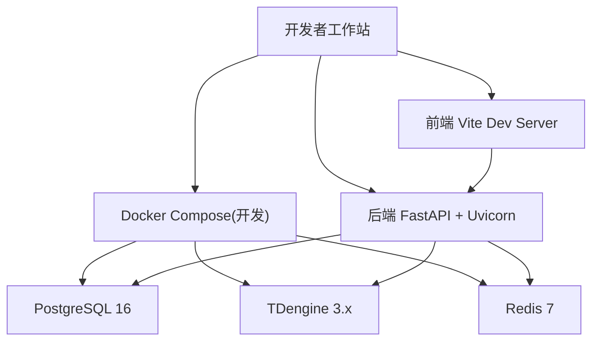
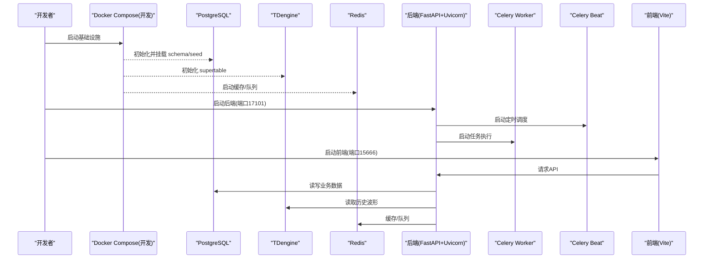
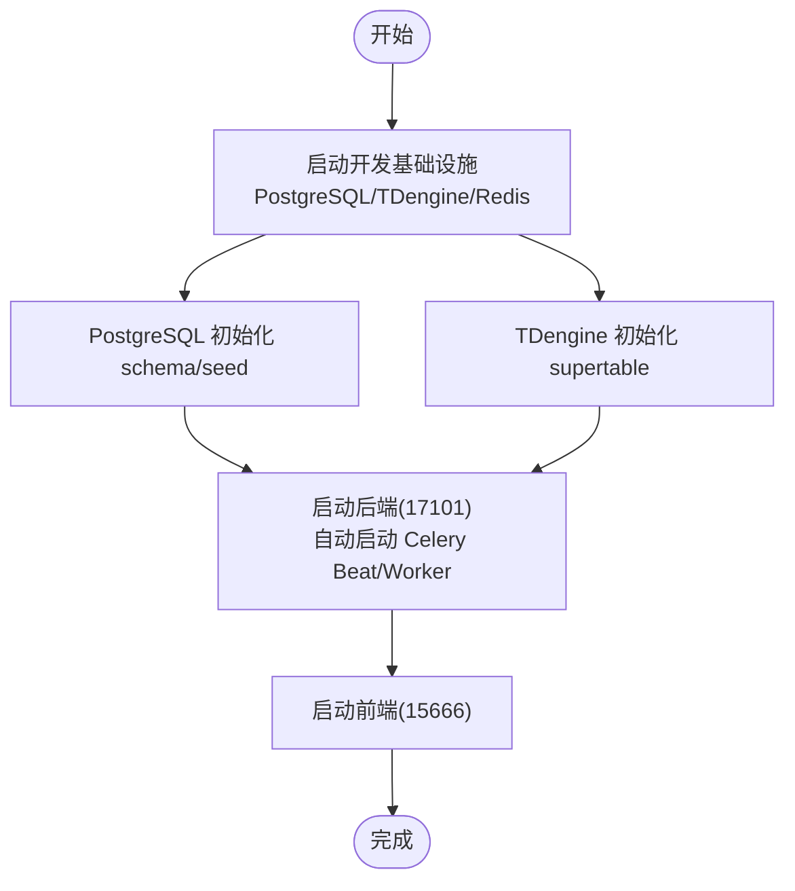
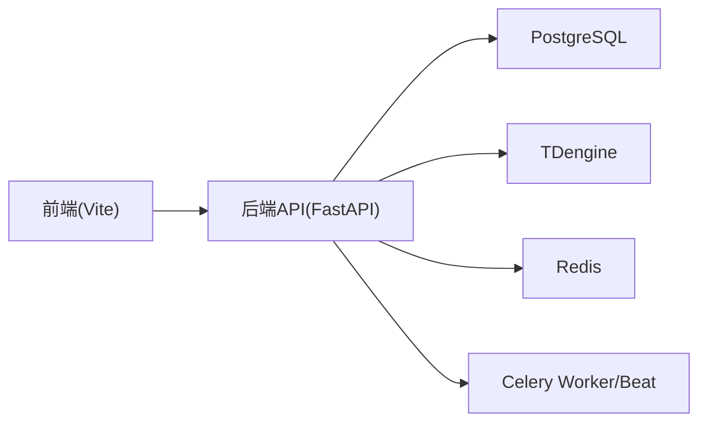

# 开发环境搭建

<cite>
**本文引用的文件**
- [README.md](file://README.md)
- [AGENTS.md](file://AGENTS.md)
- [Makefile](file://Makefile)
- [backend/pyproject.toml](file://backend/pyproject.toml)
- [deploy/docker/docker-compose.dev.yml](file://deploy/docker/docker-compose.dev.yml)
- [docker-compose.prod.yml](file://docker-compose.prod.yml)
- [frontend/package.json](file://frontend/package.json)
- [TROUBLESHOOTING.md](file://TROUBLESHOOTING.md)
- [.gitignore](file://.gitignore)
</cite>

## 更新摘要
**变更内容**
- 新增 Qoder IDE 集成配置说明，包括 .gitignore 中针对 Qoder repowiki 模块的排除规则
- 更新开发工具推荐部分，增加 Qoder IDE 相关配置建议
- 完善本地开发环境的工具链配置说明

## 目录
1. [简介](#简介)
2. [项目结构](#项目结构)
3. [核心组件](#核心组件)
4. [架构总览](#架构总览)
5. [详细组件分析](#详细组件分析)
6. [依赖关系分析](#依赖关系分析)
7. [性能注意事项](#性能注意事项)
8. [故障排查指南](#故障排查指南)
9. [结论](#结论)
10. [附录](#附录)

## 简介
本指南面向 CLPM-MVP 项目的开发者，目标是帮助你在本地快速搭建可运行的开发环境。内容覆盖：
- Node.js、Python、Docker 的安装与版本要求
- 后端 Python 虚拟环境与依赖安装、环境变量配置
- 前端 pnpm + Vite 开发环境配置
- Docker Compose 启动 PostgreSQL、TDengine、Redis、Celery Worker/Beat 等基础设施
- 常见问题定位与解决方案
- 推荐 IDE 与调试配置建议，包括 Qoder IDE 集成配置

## 项目结构
CLPM-MVP 采用前后端分离的 monorepo 结构：
- backend：FastAPI 后端（含 Celery 任务、数据库迁移、算法引擎）
- frontend：Vue 3 + TypeScript + Vite 前端应用（monorepo，生产应用为 web-antd）
- deploy/docker：开发环境容器编排（PostgreSQL、TDengine、Redis、可选 mock 数据服务）
- db：数据库初始化脚本（PostgreSQL、TDengine）
- e2e：Playwright 端到端测试
- 根级 Makefile：统一命令入口（启动、测试、构建、部署）

图表来源
- [deploy/docker/docker-compose.dev.yml:16-89](file://deploy/docker/docker-compose.dev.yml#L16-L89)
- [README.md:46-76](file://README.md#L46-L76)

章节来源
- [README.md:22-36](file://README.md#L22-L36)
- [README.md:46-76](file://README.md#L46-L76)
- [Makefile:26-43](file://Makefile#L26-L43)

## 核心组件
- 运行时环境
  - Node.js ≥ 22.18.0，pnpm ≥ 10.0.0
  - Python 3.12，uv ≥ 0.4
  - Docker ≥ 24（推荐 Orbstack）
- 后端
  - FastAPI + Uvicorn（端口 17101）
  - SQLAlchemy 2.0 (async)、Alembic 迁移
  - Celery + Redis（Broker/Result Backend）
  - PostgreSQL 16、TDengine 3.x、Redis 7
- 前端
  - Vue 3 + TypeScript + Vite
  - Monorepo（pnpm workspace），应用位于 apps/web-antd
- 开发与测试
  - pytest、vitest、Playwright E2E
  - ruff、mypy、类型检查

章节来源
- [README.md:40-44](file://README.md#L40-L44)
- [backend/pyproject.toml:1-39](file://backend/pyproject.toml#L1-L39)
- [frontend/package.json:97-101](file://frontend/package.json#L97-L101)
- [AGENTS.md:21-48](file://AGENTS.md#L21-L48)

## 架构总览
开发环境由"基础设施容器 + 本地后端/前端进程"组成：
- 基础设施通过 docker compose 拉起 PostgreSQL、TDengine、Redis（以及可选 mock-data-server）
- 后端以 uvicorn 运行，自动启动 Celery Beat 和 Worker（生命周期内）
- 前端以 Vite dev server 运行，代理 API 到后端

图表来源
- [deploy/docker/docker-compose.dev.yml:16-89](file://deploy/docker/docker-compose.dev.yml#L16-L89)
- [README.md:46-76](file://README.md#L46-L76)
- [AGENTS.md:21-35](file://AGENTS.md#L21-35)

## 详细组件分析

### 环境准备与安装
- Node.js 与 pnpm
  - 版本要求：Node.js ≥ 22.18.0，pnpm ≥ 10.0.0
  - 使用 nvm 或系统包管理器安装 Node，再安装 pnpm
- Python 与 uv
  - 版本要求：Python 3.12，uv ≥ 0.4
  - 推荐使用 pyenv 管理 Python，再用 pipx 安装 uv
- Docker
  - 版本要求：Docker ≥ 24；macOS 推荐 Orbstack 作为容器运行时

章节来源
- [README.md:40-44](file://README.md#L40-L44)
- [frontend/package.json:97-101](file://frontend/package.json#L97-L101)

### 后端 Python 虚拟环境与依赖
- 进入 backend 目录
- 复制环境变量模板并编辑
  - 将 .env.example 复制为 .env，按本地端口调整（开发默认端口见下文）
- 使用 uv 同步依赖
  - 首次执行依赖安装
- 执行数据库迁移
  - 确保 Alembic 迁移已应用到 PostgreSQL
- 启动后端
  - 使用 uvicorn 启动，端口 17101，开启热重载
  - 后端启动时会自动启动 Celery Beat 与 Worker（无需手动启动）

关键环境变量要点（来自示例）
- 数据库：POSTGRES_HOST/PORT/USER/PASSWORD/DB
- TDengine：TDENGINE_HOST/PORT/USER/PASSWORD/DB
- Redis：REDIS_HOST/PORT/PASSWORD/DB
- JWT：SECRET_KEY、ALGORITHM、过期时间
- Celery：BROKER_URL、RESULT_BACKEND
- 网络模式与远端接口超时、熔断参数、SignalR 开关、实时写回开关、断点续传开关等

章节来源
- [backend/.env.example:1-75](file://backend/.env.example#L1-L75)
- [README.md:54-66](file://README.md#L54-L66)
- [AGENTS.md:21-35](file://AGENTS.md#L21-35)

### 前端开发环境配置
- 进入 frontend 目录
- 使用 pnpm 安装依赖
- 启动开发服务器
  - 默认端口 15666（MVP 隔离端口）
- 类型检查与格式化
  - 使用内置脚本进行类型检查与格式化

章节来源
- [README.md:68-76](file://README.md#L68-L76)
- [frontend/package.json:27-59](file://frontend/package.json#L27-59)
- [AGENTS.md:21-35](file://AGENTS.md#L21-35)

### Docker Compose 开发环境启动流程
- 启动基础设施
  - 使用开发编排文件拉起 PostgreSQL、TDengine、Redis（以及可选 mock-data-server）
  - 端口映射：PostgreSQL 17102、Redis 17103、TDengine 17104/17115、mock 数据服务 17106
- 初始化数据
  - PostgreSQL：自动执行 schema 与种子数据脚本
  - TDengine：自动执行 supertable 初始化脚本
- 启动后端与前端
  - 后端监听 17101，前端监听 15666
- 可选：启用 mock 数据服务
  - 通过 profile 启动，模拟远端历史数据与实时 SignalR 数据

图表来源
- [deploy/docker/docker-compose.dev.yml:16-89](file://deploy/docker/docker-compose.dev.yml#L16-L89)
- [README.md:46-76](file://README.md#L46-L76)

章节来源
- [deploy/docker/docker-compose.dev.yml:16-89](file://deploy/docker/docker-compose.dev.yml#L16-L89)
- [README.md:46-76](file://README.md#L46-L76)

### Celery Worker/Beat 说明
- 后端启动时自动启动 Celery Beat（定时调度）与 Celery Worker（任务执行）
- 修改 Celery 任务代码后需重启后端使新代码生效
- 生产环境可通过 Compose 单独启动 worker/beat，并设置并发度与环境变量

章节来源
- [README.md:54-66](file://README.md#L54-L66)
- [docker-compose.prod.yml:234-323](file://docker-compose.prod.yml#L234-L323)
- [AGENTS.md:70-74](file://AGENTS.md#L70-L74)

### 常用命令速查
- 一键启动开发环境（基础设施 + 后端 + 前端）
- 仅启动后端或前端
- 运行测试（后端单元测试、前端类型检查、E2E）
- 数据库迁移与种子数据加载
- 清理构建产物与缓存

章节来源
- [Makefile:26-43](file://Makefile#L26-L43)
- [Makefile:48-73](file://Makefile#L48-L73)
- [Makefile:98-125](file://Makefile#L98-L125)
- [README.md:92-104](file://README.md#L92-L104)

### Qoder IDE 集成配置
- Qoder repowiki 模块已集成到项目中，用于生成和管理项目知识库文档
- .gitignore 配置已更新，正确区分 IDE 本地产物与共享知识文档：
  - `.qoder/better-harness/` 被忽略（IDE 本地产物）
  - 其他 Qoder 相关文件保持可见，便于团队协作
- 开发环境支持 Qoder IDE 的知识库功能，可自动生成和维护项目文档

章节来源
- [.gitignore:68-70](file://.gitignore#L68-L70)

## 依赖关系分析
- 后端依赖
  - 数据库：PostgreSQL（业务数据）、TDengine（时序数据）
  - 缓存/队列：Redis（缓存、Celery Broker/Result Backend）
  - 异步任务：Celery + Celery Beat
  - Web 框架：FastAPI + Uvicorn
- 前端依赖
  - 包管理器：pnpm
  - 构建工具：Vite
  - 框架：Vue 3 + TypeScript
- 开发工具链
  - 代码质量：ruff、mypy、eslint（前端）
  - 测试：pytest、vitest、Playwright
  - IDE：Qoder IDE（集成 repowiki 知识库功能）

图表来源
- [backend/pyproject.toml:1-39](file://backend/pyproject.toml#L1-L39)
- [frontend/package.json:97-101](file://frontend/package.json#L97-L101)
- [deploy/docker/docker-compose.dev.yml:16-89](file://deploy/docker/docker-compose.dev.yml#L16-L89)

章节来源
- [backend/pyproject.toml:1-39](file://backend/pyproject.toml#L1-L39)
- [frontend/package.json:97-101](file://frontend/package.json#L97-L101)
- [deploy/docker/docker-compose.dev.yml:16-89](file://deploy/docker/docker-compose.dev.yml#L16-L89)

## 性能注意事项
- 资源限制
  - 生产 Compose 对后端、worker、beat、数据库等设置了内存/CPU 限制，开发环境可按需调整
- 并发与回填
  - Celery Worker 并发度影响回填吞吐，可根据 CPU/连接池容量调整
- 日志轮转
  - 生产环境启用 JSON 日志轮转，避免磁盘占满
- 监控（可选）
  - 启用 Prometheus/Grafana profile 采集指标与可视化

章节来源
- [docker-compose.prod.yml:44-55](file://docker-compose.prod.yml#L44-L55)
- [docker-compose.prod.yml:234-323](file://docker-compose.prod.yml#L234-L323)
- [docker-compose.prod.yml:357-465](file://docker-compose.prod.yml#L357-L465)

## 故障排查指南
- 常见环境问题
  - 端口冲突：确认开发端口 17101（后端）、15666（前端）、17102/17103/17104/17115（基础设施）未被占用
  - 数据库连接失败：检查 .env 中 POSTGRES/TDENGINE/REDIS 主机、端口、密码是否与容器一致
  - Celery 任务未消费：确认后端已启动且 Worker/Beat 随生命周期拉起；修改任务代码后需重启后端
  - 前端无法访问 API：确认前端代理指向后端 17101，且后端健康检查通过
- 日志与诊断
  - 查看容器日志：docker compose logs -f <service>
  - 后端健康检查：http://localhost:17101/health
  - 前端访问：http://localhost:15666
- 历史问题参考
  - KPI 批量回填失败、Worker 挂死、uvicorn 静默挂死等问题的排查思路与修复历程

章节来源
- [TROUBLESHOOTING.md:11-34](file://TROUBLESHOOTING.md#L11-L34)
- [TROUBLESHOOTING.md:122-160](file://TROUBLESHOOTING.md#L122-L160)
- [README.md:54-76](file://README.md#L54-L76)

## 结论
按照本指南完成 Node.js、Python、Docker 安装与环境配置后，即可通过 Docker Compose 启动基础设施，并以 uvicorn 启动后端、Vite 启动前端，快速获得完整的 CLPM-MVP 开发环境。建议在本地使用 Makefile 统一管理常用命令，结合 AGENTS.md 中的门禁与最佳实践，提升开发效率与稳定性。Qoder IDE 的 repowiki 模块已集成到项目中，可为团队提供智能化的知识库管理能力。

## 附录

### 环境变量配置清单（节选）
- 数据库
  - POSTGRES_HOST/PORT/USER/PASSWORD/DB
  - TDENGINE_HOST/PORT/USER/PASSWORD/DB
- 缓存与队列
  - REDIS_HOST/PORT/PASSWORD/DB
  - CELERY_BROKER_URL、CELERY_RESULT_BACKEND
- 鉴权
  - JWT_SECRET_KEY、JWT_ALGORITHM、ACCESS_TOKEN_EXPIRE_MINUTES、REFRESH_TOKEN_EXPIRE_DAYS
- 网络与数据链路
  - NETWORK_MODE、HISTORY_DATA_API_TIMEOUT、SIGNALR_RECONNECT_INTERVAL/MAX_INTERVAL
  - REALTIME_WRITEBACK_ENABLED、GAP_BACKFILL_*（断点续传）

章节来源
- [backend/.env.example:1-75](file://backend/.env.example#L1-L75)

### 推荐 IDE 与调试配置
- VS Code 插件建议
  - Python（支持 Pylance、Ruff、Mypy）
  - ESLint、TypeScript Vue Plugin
  - Docker、Compose 扩展
  - Playwright Test Explorer（用于 E2E）
- Qoder IDE 配置
  - 启用 repowiki 模块，自动生成本地知识库
  - 配置 .gitignore 规则，区分 IDE 本地产物与共享文档
  - 利用 AI 辅助功能进行代码分析和文档生成
- 调试配置
  - 后端：使用 Debug Python File 或 Attach to Local Process，端口 17101
  - 前端：使用 Chrome DevTools 或 VS Code Debugger for Chrome
  - Celery：在 VS Code 中配置 Python 调试器附加到 Worker 进程（注意不要重复启动多个 Worker）

[本节为通用建议，不直接引用具体源码]