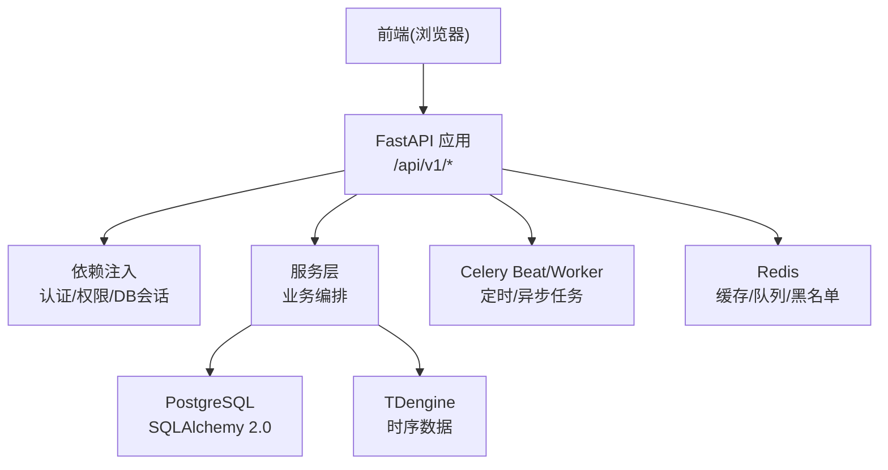
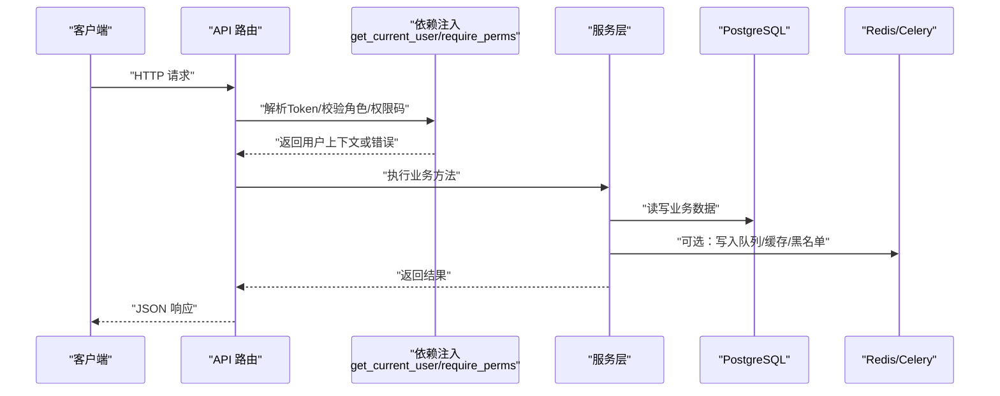
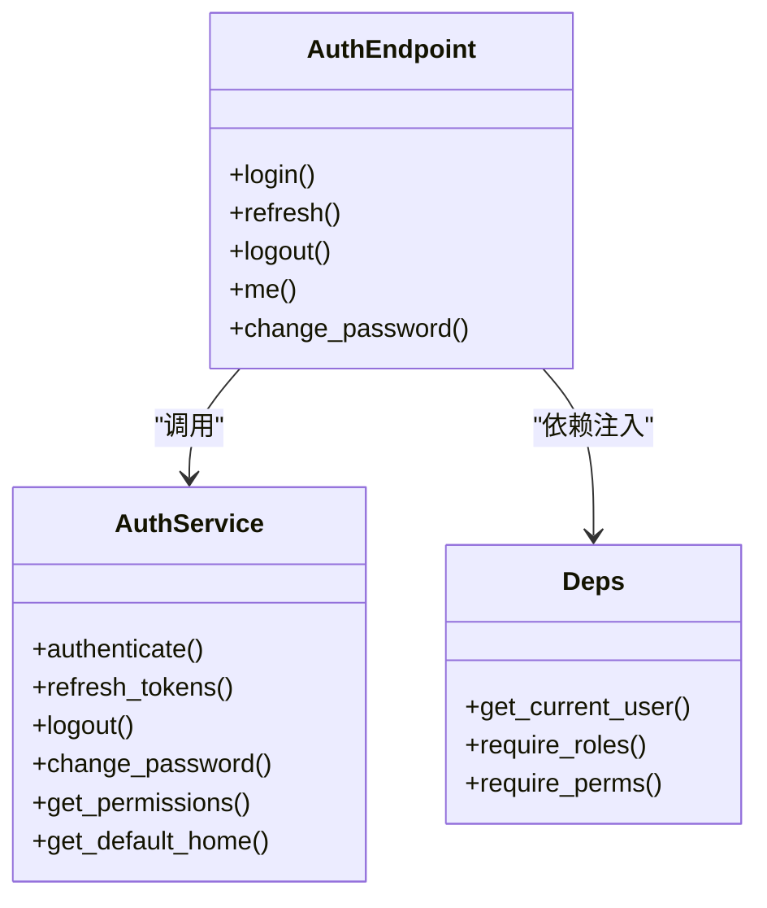
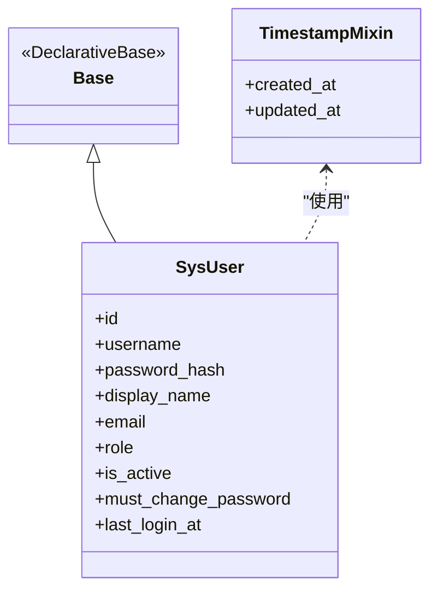
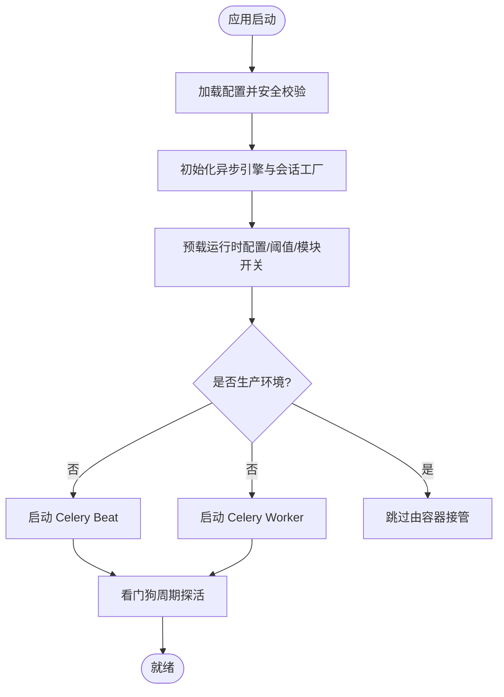
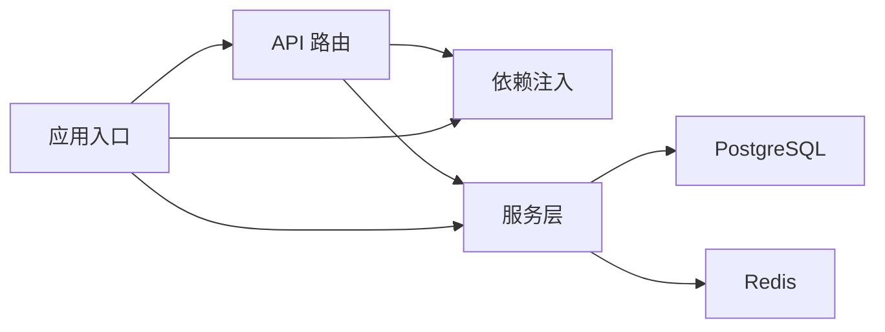

# 新功能开发流程

<cite>
**本文引用的文件**
- [backend/app/main.py](file://backend/app/main.py)
- [backend/app/api/deps.py](file://backend/app/api/deps.py)
- [backend/app/api/v1/endpoints/auth.py](file://backend/app/api/v1/endpoints/auth.py)
- [backend/app/services/auth.py](file://backend/app/services/auth.py)
- [backend/app/core/config.py](file://backend/app/core/config.py)
- [backend/app/core/db.py](file://backend/app/core/db.py)
- [backend/app/models/base.py](file://backend/app/models/base.py)
- [backend/app/schemas/base.py](file://backend/app/schemas/base.py)
- [backend/app/models/sys_user.py](file://backend/app/models/sys_user.py)
- [README.md](file://README.md)
</cite>

## 目录
1. [引言](#引言)
2. [项目结构](#项目结构)
3. [核心组件](#核心组件)
4. [架构总览](#架构总览)
5. [详细组件分析](#详细组件分析)
6. [依赖关系分析](#依赖关系分析)
7. [性能与可扩展性](#性能与可扩展性)
8. [测试与验证流程](#测试与验证流程)
9. [代码审查标准与文档更新要求](#代码审查标准与文档更新要求)
10. [向后兼容性考虑](#向后兼容性考虑)
11. [新功能开发模板与最佳实践](#新功能开发模板与最佳实践)
12. [故障排查指南](#故障排查指南)
13. [结论](#结论)

## 引言
本文件为 CLPM-MVP 项目制定“新功能开发流程”的标准化规范，覆盖从需求分析与设计、接口与数据模型设计，到后端 API 开发、前端页面实现、业务逻辑封装、模块集成（服务层调用、API 端点注册、路由配置、权限控制）、测试验证（单元/集成/E2E）、代码审查、文档更新与向后兼容性等全生命周期。目标是让新增功能以一致的方式融入现有 FastAPI + SQLAlchemy + Celery 体系，确保可维护、可测试、可观测、可回滚。

## 项目结构
CLPM-MVP 采用前后端分离与分层架构：
- 后端：FastAPI 应用入口、API v1 路由、服务层、数据模型、Schema、核心配置与基础设施（DB/Redis/Celery）
- 前端：Vue 3 + TypeScript + Vite + Ant Design Vue
- 任务：Celery Beat（定时）+ Worker（异步执行）
- 数据库：PostgreSQL（业务数据）+ TDengine（时序数据）+ Redis（缓存/队列/鉴权）

**图表来源**
- [backend/app/main.py:1-120](file://backend/app/main.py#L1-L120)
- [backend/app/core/db.py:1-64](file://backend/app/core/db.py#L1-L64)
- [backend/app/core/config.py:1-225](file://backend/app/core/config.py#L1-L225)

**章节来源**
- [README.md:22-36](file://README.md#L22-L36)
- [backend/app/main.py:1-120](file://backend/app/main.py#L1-L120)

## 核心组件
- 应用入口与生命周期：负责日志、CORS、全局异常、中间件、路由前缀、Celery 子进程管理、运行时配置预载与资源清理
- 配置中心：集中管理环境变量、安全校验、DSN/URL 生成
- 数据库会话：异步引擎、会话工厂、请求级会话生命周期
- 认证与权限：JWT 签发/刷新/注销、角色与权限码映射、强制改密策略
- Schema 基类：统一 camelCase 序列化/反序列化，前后端字段约定一致
- 模型基类：DeclarativeBase 与时间戳混入，统一审计字段

**章节来源**
- [backend/app/main.py:1-120](file://backend/app/main.py#L1-L120)
- [backend/app/core/config.py:1-225](file://backend/app/core/config.py#L1-L225)
- [backend/app/core/db.py:1-64](file://backend/app/core/db.py#L1-L64)
- [backend/app/api/deps.py:1-209](file://backend/app/api/deps.py#L1-L209)
- [backend/app/schemas/base.py:1-23](file://backend/app/schemas/base.py#L1-L23)
- [backend/app/models/base.py:1-29](file://backend/app/models/base.py#L1-L29)

## 架构总览
新功能的端到端调用链遵循：前端 → API 路由 → 依赖注入（认证/权限/DB）→ 服务层 → 数据访问（PostgreSQL/TDengine/Redis）→ 响应。异步任务通过 Celery 解耦耗时操作。

**图表来源**
- [backend/app/api/deps.py:50-133](file://backend/app/api/deps.py#L50-L133)
- [backend/app/api/v1/endpoints/auth.py:69-148](file://backend/app/api/v1/endpoints/auth.py#L69-L148)
- [backend/app/services/auth.py:254-353](file://backend/app/services/auth.py#L254-L353)

## 详细组件分析

### 认证与授权组件
- 登录/刷新/登出/修改密码：统一在 auth 路由中暴露，服务层处理令牌签发、黑名单、设备绑定、幂等刷新窗口
- 权限控制：基于角色的权限码匹配，支持通配符；强制首次登录改密保护写操作
- 依赖注入：get_current_user、require_roles、require_perms 作为通用守卫

**图表来源**
- [backend/app/api/v1/endpoints/auth.py:69-148](file://backend/app/api/v1/endpoints/auth.py#L69-L148)
- [backend/app/services/auth.py:254-585](file://backend/app/services/auth.py#L254-L585)
- [backend/app/api/deps.py:50-209](file://backend/app/api/deps.py#L50-L209)

**章节来源**
- [backend/app/api/v1/endpoints/auth.py:69-148](file://backend/app/api/v1/endpoints/auth.py#L69-L148)
- [backend/app/services/auth.py:58-127](file://backend/app/services/auth.py#L58-L127)
- [backend/app/api/deps.py:50-133](file://backend/app/api/deps.py#L50-L133)

### 数据模型与 Schema
- 模型基类：提供统一时间戳字段与声明式基类
- 用户模型：包含角色、状态、首次改密标志、登录时间等
- Schema 基类：camelCase 别名、双向兼容 snake_case/camelCase 输入

**图表来源**
- [backend/app/models/base.py:11-29](file://backend/app/models/base.py#L11-L29)
- [backend/app/models/sys_user.py:15-49](file://backend/app/models/sys_user.py#L15-L49)

**章节来源**
- [backend/app/models/base.py:11-29](file://backend/app/models/base.py#L11-L29)
- [backend/app/models/sys_user.py:15-49](file://backend/app/models/sys_user.py#L15-L49)
- [backend/app/schemas/base.py:15-23](file://backend/app/schemas/base.py#L15-L23)

### 配置与基础设施
- 配置：集中读取 .env，生产环境强制校验密钥与密码强度，提供 DSN/URL 生成器
- 数据库：异步引擎、NullPool、命令超时、会话生命周期管理
- 应用生命周期：自动启动 Celery Beat/Worker（非生产），看门狗自愈，资源释放

**图表来源**
- [backend/app/core/config.py:185-225](file://backend/app/core/config.py#L185-L225)
- [backend/app/core/db.py:16-64](file://backend/app/core/db.py#L16-L64)
- [backend/app/main.py:610-763](file://backend/app/main.py#L610-L763)

**章节来源**
- [backend/app/core/config.py:1-225](file://backend/app/core/config.py#L1-L225)
- [backend/app/core/db.py:1-64](file://backend/app/core/db.py#L1-L64)
- [backend/app/main.py:610-763](file://backend/app/main.py#L610-L763)

## 依赖关系分析
- 路由层依赖依赖注入层进行认证与权限校验
- 路由层调用服务层完成业务编排
- 服务层依赖数据库会话、Redis、外部系统（如 SignalR/远端历史 API）
- 应用入口统一管理中间件、异常处理、Celery 生命周期

**图表来源**
- [backend/app/main.py:31-98](file://backend/app/main.py#L31-L98)
- [backend/app/api/deps.py:1-209](file://backend/app/api/deps.py#L1-L209)

**章节来源**
- [backend/app/main.py:31-98](file://backend/app/main.py#L31-L98)
- [backend/app/api/deps.py:1-209](file://backend/app/api/deps.py#L1-L209)

## 性能与可扩展性
- 数据库连接：使用 NullPool 避免跨事件循环复用导致的 Future 问题；单条 SQL 设置超时防止慢查询挂死
- 实时数据：SignalR 订阅与写回 TDengine 可配置；断线重连指数退避与停滞检测
- 任务队列：Celery Beat/Worker 自动拉起与看门狗自愈；并发度可调
- 配置热预载：运行时阈值/算法参数/模块开关预载至进程缓存，减少热路径查库

优化建议：
- 对热点查询增加索引与分页限制
- 批量写入 TDengine 时合理设置批次大小
- 根据 CPU/连接池调整 Celery Worker 并发
- 对长耗时计算尽量走异步任务

[本节为通用指导，不直接分析具体文件]

## 测试与验证流程
- 单元测试：针对服务层与工具函数，覆盖边界条件、异常分支、幂等性
- 集成测试：验证 API 路由与服务层交互、数据库事务、Redis 行为
- E2E 测试：Playwright 覆盖关键用户流程（登录、诊断、整定、报表等）
- 契约测试：OpenAPI 基线对比，防止接口漂移
- 性能测试：Locust/自定义脚本评估 API 与计算链路

实施要点：
- 新增 API 必须配套单元测试与至少一个集成测试用例
- 涉及权限变更需补充 RBAC 测试
- 涉及数据迁移需编写反向迁移与回滚验证
- E2E 用例应覆盖主流程与异常路径

[本节为通用指导，不直接分析具体文件]

## 代码审查标准与文档更新要求
代码审查清单：
- 是否符合分层与职责单一原则（路由/依赖/服务/模型/Schema 清晰）
- 是否正确使用依赖注入（认证/权限/DB 会话）
- 是否遵循 Schema 命名约定（snake_case ↔ camelCase）
- 是否添加必要的异常处理与错误码
- 是否更新 OpenAPI 文档与权限矩阵
- 是否包含单元测试/集成测试/E2E 用例
- 是否考虑幂等性与并发安全（如刷新 Token 幂等窗口）
- 是否记录配置项与环境变量变更

文档更新要求：
- 更新 PRD/FDS/ADS/DDS/IDS/UIUX 中与功能相关的章节
- 更新实现契约（路由、权限、状态机、KPI）
- 更新部署与运维说明（环境变量、端口、监控）
- 更新 README 中的快速开始与常用命令（如涉及新服务）

[本节为通用指导，不直接分析具体文件]

## 向后兼容性考虑
- API 版本化：所有业务接口统一在 /api/v1 下，新增字段优先采用可空与默认值
- Schema 兼容：Pydantic 启用 populate_by_name，允许同时接受 snake_case 与 camelCase
- 权限兼容：新增权限码需与前端 v-permission 口径一致，避免只下发不执行
- 配置兼容：新增配置项需提供合理默认值，失败时回退到算法/系统默认值
- 迁移兼容：Alembic 迁移需保证可回滚，避免破坏已有数据

**章节来源**
- [backend/app/schemas/base.py:15-23](file://backend/app/schemas/base.py#L15-L23)
- [backend/app/api/deps.py:161-177](file://backend/app/api/deps.py#L161-L177)
- [backend/app/core/config.py:185-225](file://backend/app/core/config.py#L185-L225)

## 新功能开发模板与最佳实践

### 需求分析与设计阶段
- 功能规格说明
  - 明确目标用户、使用场景、成功指标
  - 定义输入输出、约束与边界条件
  - 识别与现有模块的耦合点
- 接口设计
  - 遵循 RESTful 风格，统一 /api/v1 前缀
  - 使用 Pydantic Schema 定义请求/响应，保持 camelCase 输出
  - 明确权限码与角色要求
- 数据库模型设计
  - 继承 Base 与 TimestampMixin，统一 created_at/updated_at
  - 合理设计索引、唯一约束、检查约束
  - 编写 Alembic 迁移，确保可回滚

### 开发实施步骤
- 后端 API 开发
  - 在 app/api/v1/endpoints 下新增路由模块，注册到 main 的路由集合
  - 使用依赖注入 get_current_user/require_roles/require_perms 做鉴权
  - 将业务逻辑下沉到 services 层，保持路由薄
- 前端页面实现
  - 新增页面与路由，遵循 IA 与导航规范
  - 使用统一的类型/API 层调用后端接口
  - 适配权限控制与错误提示
- 业务逻辑封装
  - 服务层方法原子化，便于测试与复用
  - 复杂流程拆分为多个步骤，必要时使用 Celery 任务
- 数据模型定义
  - 新增/修改模型后同步更新 Schema
  - 编写迁移并验证正向/反向迁移

### 模块集成方法
- 服务层调用：路由仅做参数校验与响应包装，核心逻辑在服务层
- API 端点注册：在 main 的路由导入处新增模块，确保前缀与标签正确
- 路由配置：遵循 /api/v1/{module}/{resource} 风格
- 权限控制：使用 require_roles/require_perms 精确控制敏感操作

**章节来源**
- [backend/app/main.py:31-98](file://backend/app/main.py#L31-L98)
- [backend/app/api/deps.py:135-199](file://backend/app/api/deps.py#L135-L199)
- [backend/app/api/v1/endpoints/auth.py:69-148](file://backend/app/api/v1/endpoints/auth.py#L69-L148)

### 测试验证流程
- 单元测试：覆盖服务层核心方法与边界条件
- 集成测试：验证路由→服务→数据库/Redis 的完整链路
- 用户验收测试：按 PRD 场景走通端到端流程
- 回归测试：确保既有功能不受影响

### 代码审查与文档更新
- 审查清单见上节
- 文档更新包括 PRD/FDS/ADS/DDS/IDS/UIUX/实现契约/README

### 向后兼容性考虑
- 见上节

[本节为通用指导，结合仓库现有模式给出实践建议]

## 故障排查指南
常见问题与定位思路：
- 认证失败：检查 JWT 是否有效、是否在黑名单、是否首次改密拦截
- 权限不足：核对角色与权限码映射，确认 require_perms/require_roles 使用是否正确
- 数据库连接异常：检查 DSN、连接池、命令超时、慢查询
- 任务未执行：确认 Celery Beat/Worker 是否运行，查看日志与看门狗告警
- 实时数据中断：检查 SignalR 连接、重连策略、停滞检测与写回开关

**章节来源**
- [backend/app/api/deps.py:50-133](file://backend/app/api/deps.py#L50-L133)
- [backend/app/services/auth.py:134-174](file://backend/app/services/auth.py#L134-L174)
- [backend/app/core/db.py:16-64](file://backend/app/core/db.py#L16-L64)
- [backend/app/main.py:564-608](file://backend/app/main.py#L564-L608)

## 结论
本流程将新功能开发纳入统一的分层架构与依赖注入体系，确保接口稳定、权限可控、数据一致、任务可靠、测试完备、文档同步、兼容可回滚。遵循本流程可显著降低协作成本与回归风险，提升交付质量与可维护性。