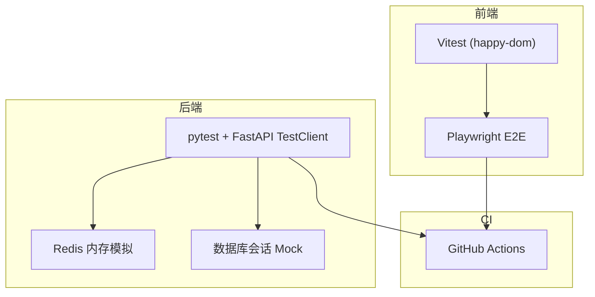
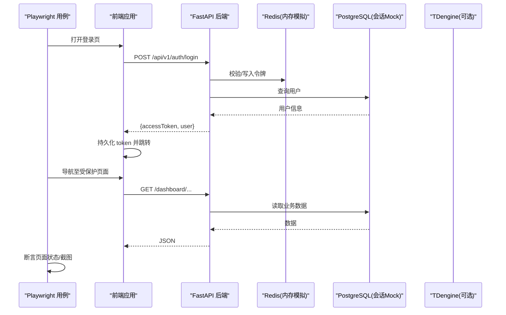
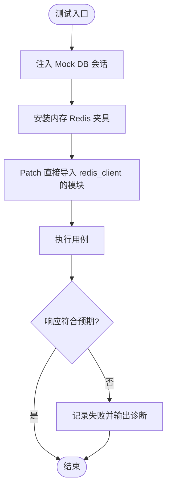
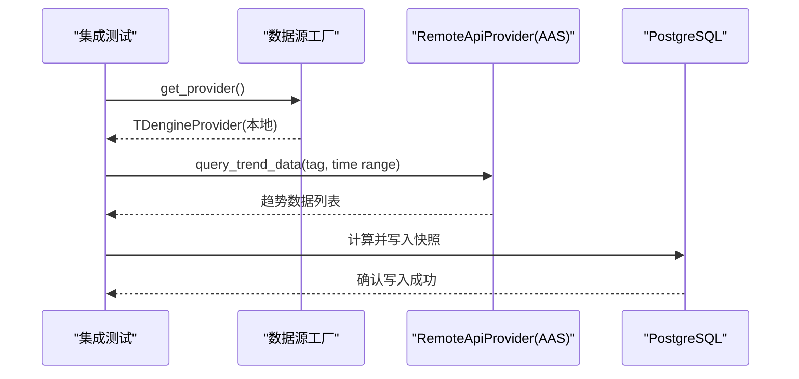
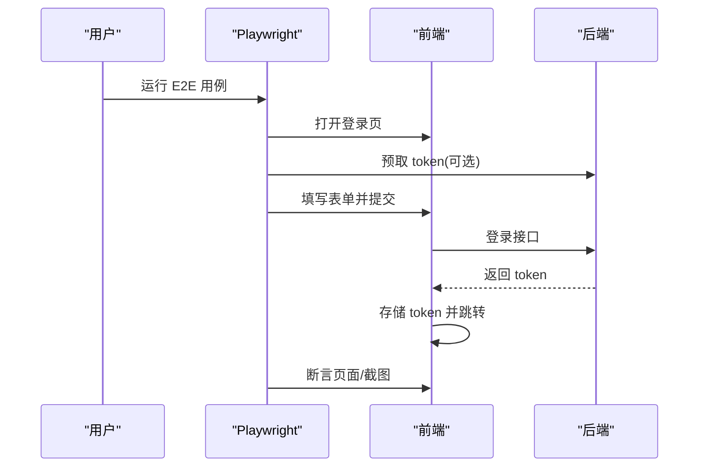
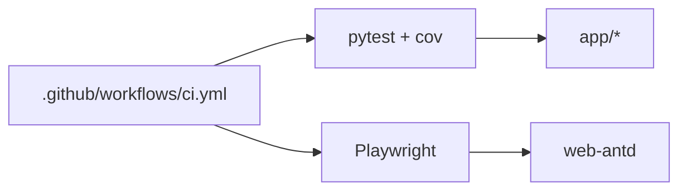

# 测试策略

<cite>
**本文引用的文件**
- [backend/tests/conftest.py](file://backend/tests/conftest.py)
- [backend/tests/test_health.py](file://backend/tests/test_health.py)
- [backend/tests/integration/test_aas_api.py](file://backend/tests/integration/test_aas_api.py)
- [e2e/playwright.config.ts](file://e2e/playwright.config.ts)
- [e2e/fixtures/auth.ts](file://e2e/fixtures/auth.ts)
- [e2e/tests/login.spec.ts](file://e2e/tests/login.spec.ts)
- [frontend/vitest.config.ts](file://frontend/vitest.config.ts)
- [frontend/apps/web-antd/__tests__/e2e/smoke.spec.ts](file://frontend/apps/web-antd/__tests__/e2e/smoke.spec.ts)
- [.github/workflows/ci.yml](file://.github/workflows/ci.yml)
</cite>

## 目录
1. [简介](#简介)
2. [项目结构](#项目结构)
3. [核心组件](#核心组件)
4. [架构总览](#架构总览)
5. [详细组件分析](#详细组件分析)
6. [依赖关系分析](#依赖关系分析)
7. [性能考虑](#性能考虑)
8. [故障排查指南](#故障排查指南)
9. [结论](#结论)
10. [附录](#附录)

## 简介
本测试策略面向 CLPM-MVP 项目，覆盖后端单元测试、集成测试、前端单元测试与 E2E 测试（Playwright），并给出覆盖率要求、报告生成、数据与环境管理、并行执行以及最佳实践。目标是确保在 CI/CD 中稳定、快速、可观测地验证系统行为，同时降低维护成本。

## 项目结构
CLPM-MVP 的测试分布在以下位置：
- 后端单元测试与集成测试：backend/tests
- 端到端测试：e2e（基于 Playwright）
- 前端单元测试配置：frontend/vitest.config.ts
- 前端冒烟 E2E：frontend/apps/web-antd/__tests__/e2e
- CI 流水线：.github/workflows/ci.yml

图表来源
- [backend/tests/conftest.py:449-518](file://backend/tests/conftest.py#L449-L518)
- [frontend/vitest.config.ts:1-29](file://frontend/vitest.config.ts#L1-L29)
- [e2e/playwright.config.ts:1-53](file://e2e/playwright.config.ts#L1-L53)
- [.github/workflows/ci.yml:64-115](file://.github/workflows/ci.yml#L64-L115)

章节来源
- [backend/tests/conftest.py:449-518](file://backend/tests/conftest.py#L449-L518)
- [frontend/vitest.config.ts:1-29](file://frontend/vitest.config.ts#L1-L29)
- [e2e/playwright.config.ts:1-53](file://e2e/playwright.config.ts#L1-L53)
- [.github/workflows/ci.yml:64-115](file://.github/workflows/ci.yml#L64-L115)

## 核心组件
- 后端测试夹具与隔离
  - 使用 FastAPI TestClient 进行接口级测试，通过 dependency_overrides 注入 mock DB 会话。
  - 提供内存 Redis 模拟 FakeRedis，覆盖字符串、集合、哈希、有序集合、列表、发布订阅、Lua eval 等常用操作，避免真实 Redis 依赖。
  - 统一 patch 所有直接导入 redis_client 的模块，保证测试环境完全隔离。
- 健康检查与就绪探针测试
  - 验证 /health、/openapi.json、/docs 可用性。
  - 验证 readiness 在依赖正常时返回 200，任一依赖异常返回 503。
  - 验证连接数监控端点更新 Prometheus Gauge。
- 集成测试
  - 标记为 integration 的用例默认在 CI 跳过，需本地或指定环境运行。
  - 通过 RemoteApiProvider 访问外部 AAS 服务，验证历史数据查询契约与 KPI 计算结果落库。
- 前端单元测试
  - Vitest 使用 happy-dom 作为 DOM 环境，排除 e2e 与构建产物目录。
- 端到端测试（Playwright）
  - 自动启动前端 dev server，后端 API 需手动启动。
  - 登录流程 fixture 支持 UI 登录与混合模式（API 预取 token + 浏览器路由 mock），内置缓存与限流重试。
  - 视觉回归：亮/暗主题截图采集与基线对比。

章节来源
- [backend/tests/conftest.py:79-376](file://backend/tests/conftest.py#L79-L376)
- [backend/tests/conftest.py:449-518](file://backend/tests/conftest.py#L449-L518)
- [backend/tests/test_health.py:18-124](file://backend/tests/test_health.py#L18-L124)
- [backend/tests/integration/test_aas_api.py:1-56](file://backend/tests/integration/test_aas_api.py#L1-L56)
- [frontend/vitest.config.ts:1-29](file://frontend/vitest.config.ts#L1-L29)
- [e2e/playwright.config.ts:1-53](file://e2e/playwright.config.ts#L1-L53)
- [e2e/fixtures/auth.ts:74-207](file://e2e/fixtures/auth.ts#L74-L207)

## 架构总览
下图展示从用例到各层组件的调用链：E2E 用例通过 Playwright 驱动浏览器，触发前端路由与鉴权；后端通过 FastAPI 暴露接口，依赖 Redis、PostgreSQL、TDengine；测试阶段通过夹具与 mock 替换外部依赖。

图表来源
- [e2e/fixtures/auth.ts:74-146](file://e2e/fixtures/auth.ts#L74-L146)
- [backend/tests/conftest.py:482-518](file://backend/tests/conftest.py#L482-L518)
- [backend/tests/test_health.py:71-124](file://backend/tests/test_health.py#L71-L124)

## 详细组件分析

### 后端单元测试：FastAPI + pytest + 夹具
- 目标
  - 以最小依赖验证接口契约、错误分支与指标上报。
- 关键实现
  - 使用 TestClient 发起请求，通过 dependency_overrides 注入 mock DB。
  - 使用 FakeRedis 替代真实 Redis，覆盖常用数据结构与 pipeline。
  - 对直接导入 redis_client 的模块逐一 patch，确保全局生效。
- 示例场景
  - 健康检查：/health、/openapi.json、/docs 可用。
  - 就绪探针：依赖全部正常返回 200；任一依赖失败返回 503。
  - 连接数监控：/health/db-connections 返回利用率并更新 Prometheus Gauge。

图表来源
- [backend/tests/conftest.py:449-518](file://backend/tests/conftest.py#L449-L518)
- [backend/tests/test_health.py:71-124](file://backend/tests/test_health.py#L71-L124)

章节来源
- [backend/tests/conftest.py:79-376](file://backend/tests/conftest.py#L79-L376)
- [backend/tests/conftest.py:449-518](file://backend/tests/conftest.py#L449-L518)
- [backend/tests/test_health.py:18-124](file://backend/tests/test_health.py#L18-L124)

### 集成测试：数据库与外部服务
- 目标
  - 验证真实数据链路（AAS 历史数据 API）与 KPI 计算落库。
- 设计要点
  - 使用 pytest.mark.integration 标记，默认在 CI 跳过，避免对外部服务强依赖。
  - 通过 RemoteApiProvider 查询趋势数据，校验字段结构与采样间隔影响。
  - 通过工厂获取本地 TDengineProvider，验证计算路径不依赖远端。
- 数据准备
  - 依赖数据库中已配置的回路和 Tag；可通过脚本或手工准备。

图表来源
- [backend/tests/integration/test_aas_api.py:64-153](file://backend/tests/integration/test_aas_api.py#L64-L153)
- [backend/tests/integration/test_aas_api.py:167-223](file://backend/tests/integration/test_aas_api.py#L167-L223)

章节来源
- [backend/tests/integration/test_aas_api.py:1-56](file://backend/tests/integration/test_aas_api.py#L1-L56)
- [backend/tests/integration/test_aas_api.py:64-153](file://backend/tests/integration/test_aas_api.py#L64-L153)
- [backend/tests/integration/test_aas_api.py:167-223](file://backend/tests/integration/test_aas_api.py#L167-L223)

### 前端单元测试：Vitest + Vue
- 目标
  - 快速验证组件渲染与交互逻辑，无需真实后端。
- 配置要点
  - 使用 happy-dom 作为 DOM 环境，禁用脚本加载的安全设置兼容处理。
  - 排除 e2e、dist、node_modules 等目录，提升执行速度。
- 建议
  - 针对复杂组件拆分小粒度用例，优先断言可见性与事件回调。
  - 对网络请求使用 fetch/XMLHttpRequest 拦截或组合 mock 服务。

章节来源
- [frontend/vitest.config.ts:1-29](file://frontend/vitest.config.ts#L1-L29)

### 端到端测试：Playwright
- 目标
  - 验证用户完整流程（登录、权限、任务、诊断、整定）、路由守卫、视觉一致性。
- 配置要点
  - webServer 自动启动前端 dev server；后端 API 需手动启动。
  - 启用 trace/screenshot/video 仅保留失败时，减少磁盘占用。
  - 工作进程与重试策略按 CI/本地区分。
- 登录 Fixture
  - 支持纯 UI 登录与混合模式（API 预取 token + 浏览器路由 mock）。
  - 内置 token 缓存与 429 限流重试，避免频繁登录导致速率限制。
  - 失败后自动抓取 PG 连接数快照，辅助定位环境问题。
- 视觉回归
  - 亮/暗主题多分辨率截图，便于人工比对或后续接入自动化基线比较。

图表来源
- [e2e/playwright.config.ts:1-53](file://e2e/playwright.config.ts#L1-L53)
- [e2e/fixtures/auth.ts:74-207](file://e2e/fixtures/auth.ts#L74-L207)
- [e2e/tests/login.spec.ts:32-72](file://e2e/tests/login.spec.ts#L32-L72)

章节来源
- [e2e/playwright.config.ts:1-53](file://e2e/playwright.config.ts#L1-L53)
- [e2e/fixtures/auth.ts:74-207](file://e2e/fixtures/auth.ts#L74-L207)
- [e2e/tests/login.spec.ts:32-72](file://e2e/tests/login.spec.ts#L32-L72)
- [frontend/apps/web-antd/__tests__/e2e/smoke.spec.ts:10-30](file://frontend/apps/web-antd/__tests__/e2e/smoke.spec.ts#L10-L30)

## 依赖关系分析
- 后端测试依赖
  - FastAPI TestClient、pytest、pytest-asyncio、pytest-cov。
  - 通过 conftest 中的 FakeRedis 与 mock_db 消除外部依赖。
- 前端测试依赖
  - Vitest + happy-dom；Playwright 用于 E2E。
- CI 流水线
  - 前端：lint、类型检查、构建、可选 E2E。
  - 后端：ruff、mypy（非阻塞）、pytest with coverage（阈值 60%）。

图表来源
- [backend/uv.lock:930-970](file://backend/uv.lock#L930-L970)
- [.github/workflows/ci.yml:64-115](file://.github/workflows/ci.yml#L64-L115)

章节来源
- [backend/uv.lock:930-970](file://backend/uv.lock#L930-L970)
- [.github/workflows/ci.yml:64-115](file://.github/workflows/ci.yml#L64-L115)

## 性能考虑
- 后端
  - 使用内存 Redis 与 mock DB，避免 I/O 瓶颈。
  - 将集成测试标记为 integration，默认在 CI 跳过，按需运行。
- 前端
  - Vitest 使用 happy-dom，执行速度快；排除无关目录。
  - Playwright 仅在必要时开启 trace/video，减少 IO。
- CI
  - 前端 E2E 为非阻塞步骤，避免阻塞合并。
  - 后端覆盖率门槛 60%，逐步提升。

[本节为通用指导，不直接分析具体文件]

## 故障排查指南
- 登录限流与超时
  - 现象：连续 E2E 登录触发 429，或 SignalR/Celery 导致后端变慢。
  - 解决：使用混合登录 fixture，token 缓存 TTL 25 分钟；429 等待 5s 重试最多 3 次；登录等待改为 domcontentloaded 并提高超时。
- 依赖不可用
  - 现象：readiness 返回 503。
  - 解决：检查 PostgreSQL/Redis/TDengine 状态；在测试中通过 monkeypatch 注入故障分支验证降级逻辑。
- 连接池问题
  - 现象：E2E 失败时难以判断是否因连接耗尽。
  - 解决：fixture 在失败时自动抓取 /health/db-connections 快照并输出到 test-results。

章节来源
- [e2e/fixtures/auth.ts:156-207](file://e2e/fixtures/auth.ts#L156-L207)
- [backend/tests/test_health.py:81-124](file://backend/tests/test_health.py#L81-L124)
- [e2e/fixtures/auth.ts:255-279](file://e2e/fixtures/auth.ts#L255-L279)

## 结论
本策略通过分层测试与严格的环境隔离，在保证质量的同时兼顾速度与稳定性：
- 后端：FastAPI TestClient + 内存 Redis + mock DB，覆盖接口与健康检查。
- 集成：标记化运行，验证真实数据链路。
- 前端：Vitest 快速单元 + Playwright E2E 保障用户流程与视觉一致性。
- CI：Lint/类型/构建/测试流水线化，覆盖率门槛可控。
建议持续优化：逐步提升覆盖率、完善视觉基线、扩展异步任务与消息队列的集成测试。

[本节为总结性内容，不直接分析具体文件]

## 附录

### 测试覆盖率与报告
- 后端
  - 使用 pytest-cov，CI 中 --cov=app --cov-report=term-missing --cov-fail-under=60。
  - 建议逐步提升至 70%-80%，并对关键路径（鉴权、KPI、诊断）单独统计。
- 前端
  - 可在 Vitest 中启用覆盖率插件，结合 Vite 插件输出 HTML 报告。
  - E2E 报告由 Playwright 自动生成 HTML 报告至 playwright-report。

章节来源
- [.github/workflows/ci.yml:112-115](file://.github/workflows/ci.yml#L112-L115)
- [e2e/playwright.config.ts:17-21](file://e2e/playwright.config.ts#L17-L21)

### 测试数据与环境隔离
- 后端
  - 使用 FakeRedis 与 mock_db 隔离外部依赖；Dashboard 并行查询使用独立 mock session。
  - 集成测试依赖真实 AAS 与数据库，建议在本地或专用环境运行。
- 前端
  - Vitest 使用 happy-dom，无需浏览器。
  - Playwright 通过 webServer 启动前端，后端需手动启动；fixture 提供登录态清理与缓存控制。

章节来源
- [backend/tests/conftest.py:449-518](file://backend/tests/conftest.py#L449-L518)
- [e2e/playwright.config.ts:45-51](file://e2e/playwright.config.ts#L45-L51)
- [e2e/fixtures/auth.ts:209-223](file://e2e/fixtures/auth.ts#L209-L223)

### 并行测试执行
- 后端
  - pytest 默认并行度取决于 CPU；如需更细粒度控制可使用 -n 参数（需安装 pytest-xdist）。
  - 注意共享资源（如 Redis 内存实例）需在 fixture 中重置。
- 前端
  - Playwright 默认单进程运行（CI workers=1），避免并发竞争；可按需调整。
  - Vitest 支持多线程，但需注意 DOM 环境隔离。

[本节为通用指导，不直接分析具体文件]

### 最佳实践
- 命名与组织
  - 按功能域划分测试目录，保持与源码结构对应。
  - 用例命名包含需求编号（如 E2E-LOGIN-001），便于追溯。
- 断言与可读性
  - 优先断言用户可见行为（页面元素、状态码、JSON 字段）。
  - 使用语义化选择器（文本、占位符、角色），避免脆弱选择器。
- 稳定性
  - 对外部依赖采用 mock 或标记化跳过；对不稳定网络增加重试与超时。
  - 失败时收集上下文（trace、截图、视频、连接快照）。
- 可维护性
  - 抽取公共 fixture 与工具函数（如登录、数据准备）。
  - 定期清理过期基线与临时文件。

[本节为通用指导，不直接分析具体文件]