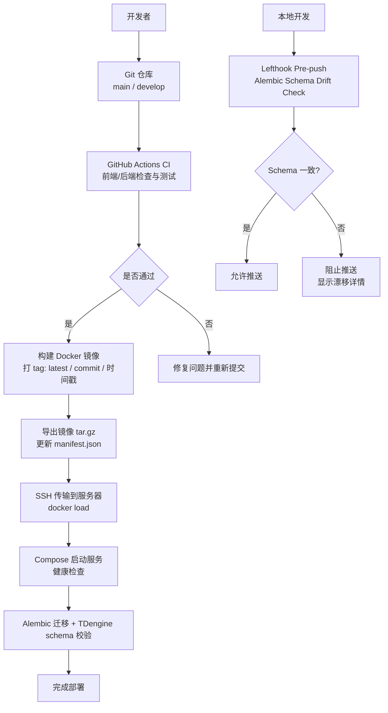
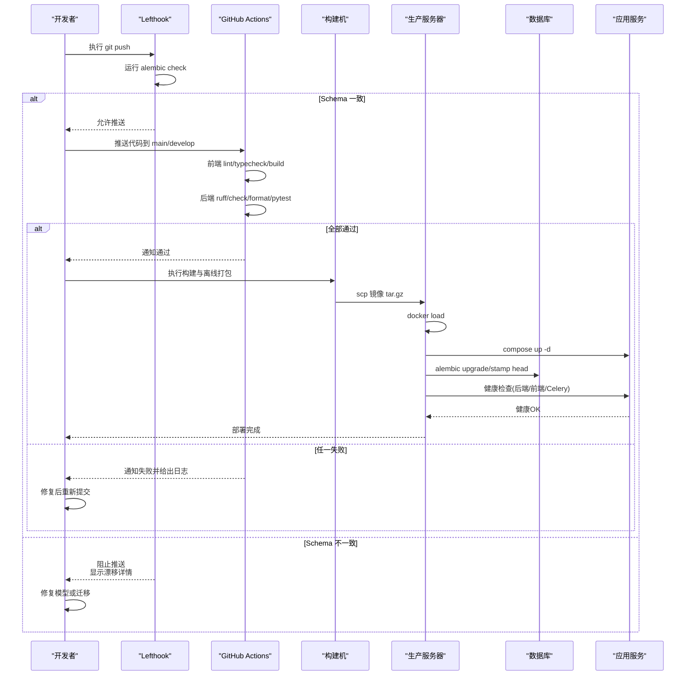
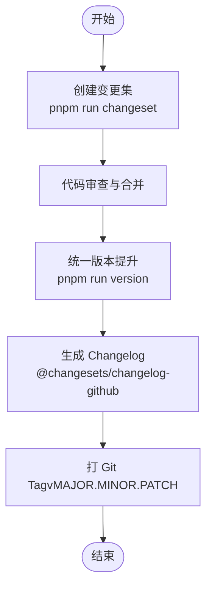
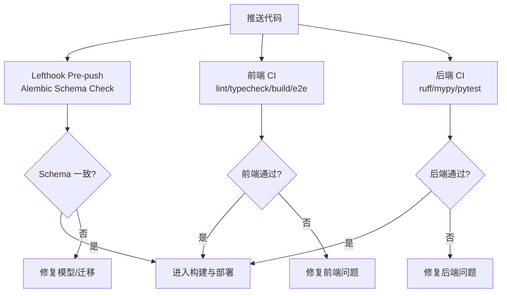
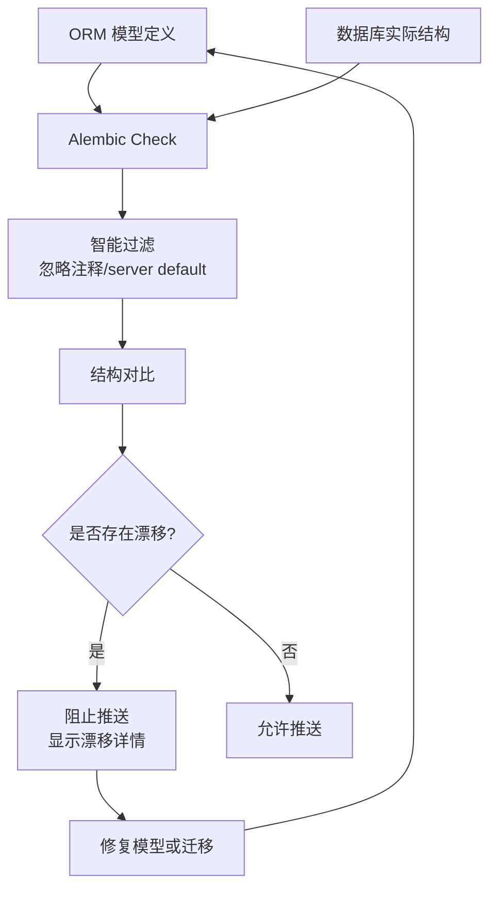
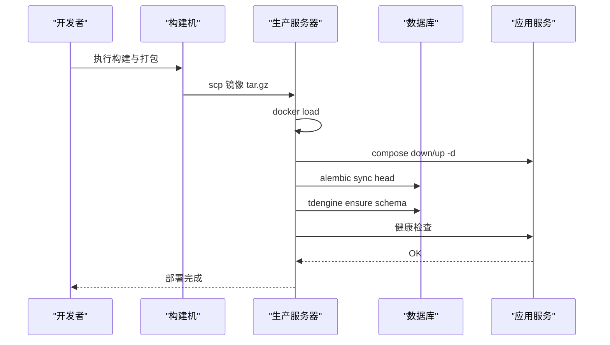
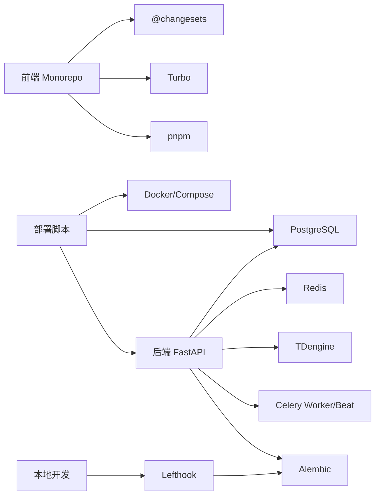

# 版本发布流程

<cite>
**本文引用的文件**
- [CI 工作流](file://.github/workflows/ci.yml)
- [前端 Changeset 配置](file://frontend/.changeset/config.json)
- [前端包脚本与依赖](file://frontend/package.json)
- [后端项目配置](file://backend/pyproject.toml)
- [构建与离线部署脚本](file://deploy/build-and-deploy.sh)
- [生产环境部署脚本](file://deploy/deploy.sh)
- [回滚脚本](file://deploy/rollback.sh)
- [数据库迁移公共函数库](file://deploy/lib-migrate.sh)
- [Makefile 统一命令](file://Makefile)
- [构建产物说明](file://releases/README.md)
- [现场部署指南](file://deploy/DEPLOYMENT-GUIDE.md)
- [变更集文档（前端）](file://frontend/docs/src/guide/project/changeset.md)
- [提交规范（前端）](file://frontend/.github/commit-convention.md)
- [发布草稿模板（前端）](file://frontend/.github/release-drafter.yml)
- [Git 钩子配置](file://lefthook.yml)
- [Alembic 环境配置](file://backend/alembic/env.py)
- [Schema 收敛迁移](file://backend/alembic/versions/d4e5f6a7b8c9_converge_schema_drift.py)
- [Schema 收敛测试](file://backend/tests/test_schema_convergence.py)
</cite>

## 更新摘要
**所做更改**
- 新增 Schema Drift 检查机制章节，详细说明 alembic check 作为 pre-push 管道的一部分
- 更新 CI/CD 流水线配置，包含 schema 漂移检查门禁
- 增强发布前检查清单，增加模型/迁移架构验证要求
- 更新故障排查指南，包含 schema 漂移相关问题的解决方案

## 目录
1. [引言](#引言)
2. [项目结构](#项目结构)
3. [核心组件](#核心组件)
4. [架构总览](#架构总览)
5. [详细组件分析](#详细组件分析)
6. [依赖关系分析](#依赖关系分析)
7. [性能考虑](#性能考虑)
8. [故障排查指南](#故障排查指南)
9. [结论](#结论)
10. [附录](#附录)

## 引言
本文件为 CLPM-MVP 制定标准化的版本发布流程，覆盖语义化版本管理、变更集与 Changelog 生成、CI/CD 流水线、Schema Drift 检查机制、发布前检查清单、回滚策略与兼容性管理、生产部署步骤、灰度发布建议、监控告警配置以及发布故障排查与应急处理。目标是让研发、测试与运维在一致的流程下安全、可追溯地交付版本。

## 项目结构
CLPM-MVP 采用前后端分离与多服务编排：
- 前端：基于 Monorepo，使用 pnpm + Turbo，集成 @changesets 进行版本与变更集管理。
- 后端：Python FastAPI，使用 uv 管理依赖，pytest/ruff/mypy 质量门禁，Alembic 管理数据库迁移。
- 基础设施：PostgreSQL、Redis、TDengine、Celery Worker/Beat、Nginx（前端）。
- 部署：Docker Compose 编排，提供本地构建+远程镜像传输的离线部署方案，以及服务器本地一键部署脚本；配套备份与回滚脚本。
- CI：GitHub Actions 对 main/develop 分支触发前端与后端构建、检查与测试。
- **新增**：Schema Drift 检查机制，通过 lefthook pre-push 钩子强制执行 alembic check，确保模型/迁移更改无法绕过架构验证。

图表来源
- [CI 工作流:1-115](file://.github/workflows/ci.yml#L1-L115)
- [构建与离线部署脚本:141-301](file://deploy/build-and-deploy.sh#L141-L301)
- [构建与离线部署脚本:303-729](file://deploy/build-and-deploy.sh#L303-L729)
- [数据库迁移公共函数库:22-38](file://deploy/lib-migrate.sh#L22-L38)
- [数据库迁移公共函数库:98-138](file://deploy/lib-migrate.sh#L98-L138)
- [Git 钩子配置:7-29](file://lefthook.yml#L7-L29)

章节来源
- [CI 工作流:1-115](file://.github/workflows/ci.yml#L1-L115)
- [构建与离线部署脚本:1-733](file://deploy/build-and-deploy.sh#L1-L733)
- [生产环境部署脚本:1-308](file://deploy/deploy.sh#L1-L308)
- [构建产物说明:1-92](file://releases/README.md#L1-L92)
- [Git 钩子配置:1-39](file://lefthook.yml#L1-L39)

## 核心组件
- 语义化版本与变更集
  - 前端使用 @changesets 管理变更集与 Changelog，支持按包聚合版本提升与 GitHub Changelog 输出。
  - 后端使用 pyproject.toml 声明项目版本与依赖，配合 Alembic 管理数据库迁移版本。
- CI/CD 流水线
  - GitHub Actions 对 main/develop 分支执行前端 lint/typecheck/build/E2E（非阻塞），后端 ruff check/format、mypy（非阻塞）、pytest 覆盖率门槛。
  - **新增**：Lefthook pre-push 钩子包含 alembic schema drift 检查，作为本地开发门禁。
  - 构建阶段产出带 commit 和时间戳的多标签镜像，便于回滚与审计。
- **新增**：Schema Drift 检查机制
  - 通过 `alembic check` 命令检测 ORM 模型与数据库结构的差异。
  - 在 lefthook pre-push 钩子中强制执行，阻止有 schema 漂移的代码推送。
  - 配置了智能过滤逻辑，忽略注释和 server default 差异，专注于结构性变更。
- 部署与回滚
  - 提供离线镜像构建与远程部署脚本，自动执行环境预检、镜像加载、服务重启、健康检查、数据库迁移与 schema 校验。
  - 提供一键部署脚本与回滚脚本，支持交互式回滚与可选的数据库 schema 回退。
- 监控与告警
  - 内置 Prometheus/Grafana 配置目录，可在部署时同步至服务器用于观测服务指标与可视化看板。

章节来源
- [前端 Changeset 配置:1-19](file://frontend/.changeset/config.json#L1-L19)
- [前端包脚本与依赖:27-59](file://frontend/package.json#L27-L59)
- [后端项目配置:1-103](file://backend/pyproject.toml#L1-L103)
- [CI 工作流:1-115](file://.github/workflows/ci.yml#L1-L115)
- [Git 钩子配置:7-29](file://lefthook.yml#L7-L29)
- [Alembic 环境配置:1-170](file://backend/alembic/env.py#L1-L170)
- [构建与离线部署脚本:141-729](file://deploy/build-and-deploy.sh#L141-L729)
- [生产环境部署脚本:1-308](file://deploy/deploy.sh#L1-L308)
- [回滚脚本:1-126](file://deploy/rollback.sh#L1-L126)
- [数据库迁移公共函数库:22-138](file://deploy/lib-migrate.sh#L22-L138)

## 架构总览
下图展示从代码提交到生产部署的端到端流程，包括版本标记、CI 检查、Schema Drift 检查、镜像构建、传输、部署、迁移与健康检查。

图表来源
- [CI 工作流:1-115](file://.github/workflows/ci.yml#L1-L115)
- [Git 钩子配置:7-29](file://lefthook.yml#L7-L29)
- [构建与离线部署脚本:141-729](file://deploy/build-and-deploy.sh#L141-L729)
- [数据库迁移公共函数库:22-38](file://deploy/lib-migrate.sh#L22-L38)

## 详细组件分析

### 语义化版本管理与变更集
- 版本号规则
  - 遵循 SemVer：主版本（破坏性变更）、次版本（新增功能）、修订号（缺陷修复）。
  - 前端通过 @changesets 收集变更集，统一提升版本号并生成 Changelog。
  - 后端通过 pyproject.toml 声明版本，结合 Alembic 迁移版本保证数据库一致性。
- 变更集（Changeset）管理
  - 使用 pnpm run changeset 创建变更集，选择影响范围与变更类型。
  - 使用 pnpm run version 统一提升版本并安装依赖，提交变更集与版本更新。
- Changelog 自动生成
  - 前端配置了 changelog-github，可在发布时生成包含 PR 信息的变更日志。
  - 发布草稿模板定义了分类与版本解析规则，便于自动化生成 Release Notes。

图表来源
- [前端 Changeset 配置:1-19](file://frontend/.changeset/config.json#L1-L19)
- [前端包脚本与依赖:27-59](file://frontend/package.json#L27-L59)
- [发布草稿模板:1-61](file://frontend/.github/release-drafter.yml#L1-L61)

章节来源
- [前端 Changeset 配置:1-19](file://frontend/.changeset/config.json#L1-L19)
- [前端包脚本与依赖:27-59](file://frontend/package.json#L27-L59)
- [变更集文档（前端）:1-22](file://frontend/docs/src/guide/project/changeset.md#L1-L22)
- [提交规范（前端）:1-90](file://frontend/.github/commit-convention.md#L1-L90)
- [发布草稿模板:1-61](file://frontend/.github/release-drafter.yml#L1-L61)
- [后端项目配置:1-103](file://backend/pyproject.toml#L1-L103)

### CI/CD 流水线配置
- 触发条件
  - push/PR 到 main/develop 分支触发。
- 前端任务
  - 安装依赖、ESLint、TypeScript 类型检查、构建、Playwright E2E（非阻塞）。
- 后端任务
  - Python 环境、uv 同步依赖、ruff check/format、mypy（非阻塞）、pytest 覆盖率门槛。
- **新增**：Schema Drift 检查
  - Lefthook pre-push 钩子在执行 pytest 后运行 `alembic check`。
  - 如果检测到 ORM 模型与数据库结构存在差异，将阻止代码推送。
  - 检查配置了智能过滤，忽略注释和 server default 差异。
- 结果
  - 未通过则阻断合并；通过后进入构建与部署阶段。

图表来源
- [CI 工作流:1-115](file://.github/workflows/ci.yml#L1-L115)
- [Git 钩子配置:7-29](file://lefthook.yml#L7-L29)

章节来源
- [CI 工作流:1-115](file://.github/workflows/ci.yml#L1-L115)
- [Git 钩子配置:7-29](file://lefthook.yml#L7-L29)

### Schema Drift 检查机制
**新增** 本系统实现了完整的 Schema Drift 检查机制，确保数据库结构与 ORM 模型始终保持一致：

- **检查原理**
  - 使用 Alembic 的 `alembic check` 命令比较当前 ORM 模型定义与数据库实际结构。
  - 配置了智能过滤逻辑，忽略注释（comments）和 server default 值差异，专注于结构性变更。
  - 检测表创建/删除、列添加/删除、索引变更、约束变更等结构性操作。

- **执行时机**
  - **本地开发**：通过 lefthook pre-push 钩子在代码推送前执行。
  - **CI 流水线**：在后端测试阶段包含 schema 一致性验证。
  - **部署阶段**：在生产环境部署时再次验证 schema 一致性。

- **配置细节**
  - `compare_type`: True - 启用类型比较
  - `compare_server_default`: False - 忽略 server default 差异
  - 自定义过滤函数 `_strip_comment_ops` 移除纯注释操作的干扰

- **收敛迁移**
  - 已实现 `d4e5f6a7b8c9_converge_schema_drift.py` 迁移文件，用于对齐历史遗留的 schema 差异。
  - 包含审计日志 target_id 类型修正、唯一约束规范化、缺失索引补登、时间戳列 NOT NULL 设置。

图表来源
- [Alembic 环境配置:54-114](file://backend/alembic/env.py#L54-L114)
- [Schema 收敛迁移:1-76](file://backend/alembic/versions/d4e5f6a7b8c9_converge_schema_drift.py#L1-L76)
- [Git 钩子配置:17-22](file://lefthook.yml#L17-L22)

章节来源
- [Alembic 环境配置:1-170](file://backend/alembic/env.py#L1-L170)
- [Schema 收敛迁移:1-76](file://backend/alembic/versions/d4e5f6a7b8c9_converge_schema_drift.py#L1-L76)
- [Schema 收敛测试:1-139](file://backend/tests/test_schema_convergence.py#L1-L139)
- [Git 钩子配置:17-22](file://lefthook.yml#L17-L22)

### 构建与部署流程
- 构建阶段
  - 构建前后端 Docker 镜像，同时打上 latest、commit 短哈希、时间戳等多标签。
  - 导出镜像为 tar.gz，更新构建清单 manifest.json，记录版本、commit、大小等元信息。
- 部署阶段
  - SSH 连接目标服务器，执行环境预检（Docker/Compose/端口/目录/.env.prod）。
  - 传输镜像包并 docker load，停止旧服务并清理残留容器，启动新服务。
  - 执行数据库迁移（Alembic stamp/upgrade head）与种子数据加载。
  - 校验 TDengine schema（数据库与超级表存在性）。
  - 健康检查：后端 API、前端 Nginx、Celery Worker/Beat。
- 回滚策略
  - 回滚脚本列出可用镜像版本，将上一版本标记为 latest，可选回退数据库 schema 一个版本，重启服务并验证健康。

图表来源
- [构建与离线部署脚本:141-729](file://deploy/build-and-deploy.sh#L141-L729)
- [数据库迁移公共函数库:22-38](file://deploy/lib-migrate.sh#L22-L38)
- [数据库迁移公共函数库:98-138](file://deploy/lib-migrate.sh#L98-L138)

章节来源
- [构建与离线部署脚本:1-733](file://deploy/build-and-deploy.sh#L1-L733)
- [生产环境部署脚本:1-308](file://deploy/deploy.sh#L1-L308)
- [回滚脚本:1-126](file://deploy/rollback.sh#L1-L126)
- [数据库迁移公共函数库:22-138](file://deploy/lib-migrate.sh#L22-L138)
- [构建产物说明:1-92](file://releases/README.md#L1-L92)

### 发布前检查清单
- 代码审查
  - 所有变更需经过 PR 审查并通过 CI。
- 测试通过
  - 前端：lint、typecheck、build、E2E（非阻塞）。
  - 后端：ruff check/format、mypy（非阻塞）、pytest 覆盖率≥60%。
- **新增**：Schema Drift 检查
  - 确保 `alembic check` 返回退出码 0，无结构性漂移。
  - 验证 ORM 模型与数据库结构完全一致。
  - 检查收敛迁移是否正确执行。
- 文档更新
  - 变更记录、Changelog、部署指南与用户手册需同步更新。
- 依赖升级
  - 前端依赖通过 catalog 管理，必要时更新并验证构建与测试。
  - 后端依赖通过 uv.lock 锁定，升级后运行全量测试。
- 数据库迁移
  - 新增或修改模型必须伴随 Alembic 迁移，并在部署中执行成功。
  - 迁移文件应包含完整的 upgrade/downgrade 逻辑。
- 环境变量与安全
  - .env.prod 必填项已填写且无占位符，JWT_SECRET_KEY 长度满足要求。

章节来源
- [CI 工作流:1-115](file://.github/workflows/ci.yml#L1-L115)
- [Git 钩子配置:17-22](file://lefthook.yml#L17-L22)
- [后端项目配置:76-87](file://backend/pyproject.toml#L76-L87)
- [Schema 收敛测试:1-139](file://backend/tests/test_schema_convergence.py#L1-L139)
- [生产环境部署脚本:28-184](file://deploy/deploy.sh#L28-L184)
- [现场部署指南:176-243](file://deploy/DEPLOYMENT-GUIDE.md#L176-L243)

### 回滚策略与版本兼容性管理
- 镜像回滚
  - 使用回滚脚本选择上一版本镜像，将其标记为 latest 并重启服务。
- 数据库 Schema 回滚
  - 可选择执行 alembic downgrade -1 回退一个迁移版本（谨慎操作，确保数据兼容）。
- **新增**：Schema 兼容性管理
  - 数据库迁移应向前兼容，避免破坏已有数据结构。
  - Schema Drift 检查确保模型与数据库结构始终一致。
  - 新功能可通过特性开关或渐进式迁移降低风险。
  - 前端与后端接口变更需保持向后兼容，或通过版本路由隔离。

章节来源
- [回滚脚本:1-126](file://deploy/rollback.sh#L1-L126)
- [数据库迁移公共函数库:22-38](file://deploy/lib-migrate.sh#L22-L38)
- [Schema 收敛迁移:65-76](file://backend/alembic/versions/d4e5f6a7b8c9_converge_schema_drift.py#L65-L76)

### 生产环境部署步骤
- 前置准备
  - 服务器安装 Docker 24+ 与 Docker Compose v2，开放端口 7141。
  - 复制 .env.prod.example 为 .env.prod 并填写真实配置。
- 执行部署
  - 本地构建并传输镜像：./deploy/build-and-deploy.sh
  - 或直接服务器部署：./deploy/deploy.sh
- 部署后验证
  - 查看容器状态、访问前端页面、调用后端 /health、检查 Celery Worker/Beat。
  - **新增**：验证 schema 一致性，确保 alembic check 通过。
- 日常运维
  - 查看日志、重启服务、备份与回滚。

章节来源
- [构建与离线部署脚本:141-729](file://deploy/build-and-deploy.sh#L141-L729)
- [生产环境部署脚本:1-308](file://deploy/deploy.sh#L1-L308)
- [现场部署指南:246-279](file://deploy/DEPLOYMENT-GUIDE.md#L246-L279)

### 灰度发布策略
- 蓝绿发布
  - 并行部署两套相同版本的环境，切换流量入口实现零停机发布。
- 金丝雀发布
  - 先对小部分用户或节点发布新版本，观察指标后再全量推广。
- 分批次滚动
  - 按区域或租户分批滚动更新，每批完成后进行健康检查与回归测试。
- 风险控制
  - 每次灰度保留上一个稳定版本的镜像与数据库快照，随时可回滚。
  - 结合监控与告警快速发现异常。

[本节为概念性内容，不直接分析具体文件]

### 监控与告警配置
- 指标采集
  - 使用 Prometheus 抓取后端暴露的指标（如 prometheus_client）。
- 可视化看板
  - 使用 Grafana 导入仪表盘，展示系统概览、API 性能、数据库与队列状态。
- 告警规则
  - 配置关键指标阈值（错误率、延迟、资源使用率），触发告警通知。
- 部署同步
  - 部署脚本会同步 deploy/grafana 与 deploy/prometheus 配置到服务器。

章节来源
- [构建与离线部署脚本:450-461](file://deploy/build-and-deploy.sh#L450-L461)
- [后端项目配置:34-34](file://backend/pyproject.toml#L34-L34)

## 依赖关系分析
- 前端依赖
  - pnpm workspace + turbo 管理多包构建，@changesets 管理版本与变更集。
- 后端依赖
  - FastAPI、SQLAlchemy、Alembic、Celery、Redis、TDengine、Prometheus 客户端等。
- 部署依赖
  - Docker、Docker Compose、SSH、curl；数据库 PostgreSQL/TDengine。
- **新增**：Schema 检查依赖
  - Alembic 用于数据库迁移管理和 schema 差异检测。
  - Lefthook 用于本地 Git 钩子管理。

图表来源
- [前端包脚本与依赖:27-59](file://frontend/package.json#L27-L59)
- [后端项目配置:1-103](file://backend/pyproject.toml#L1-L103)
- [构建与离线部署脚本:141-729](file://deploy/build-and-deploy.sh#L141-L729)
- [Git 钩子配置:1-39](file://lefthook.yml#L1-L39)

章节来源
- [前端包脚本与依赖:27-59](file://frontend/package.json#L27-L59)
- [后端项目配置:1-103](file://backend/pyproject.toml#L1-L103)
- [构建与离线部署脚本:141-729](file://deploy/build-and-deploy.sh#L141-L729)
- [Git 钩子配置:1-39](file://lefthook.yml#L1-L39)

## 性能考虑
- 构建优化
  - 前端使用 pnpm 缓存与 turbo 增量构建；后端使用 uv 缓存依赖。
- 测试效率
  - 前端 E2E 非阻塞，后端 pytest 设置超时防止卡死。
  - **新增**：Schema 检查仅在 pre-push 阶段执行，避免影响日常开发。
- 部署效率
  - 镜像多标签便于快速回滚；离线 tar.gz 传输减少网络开销。
- 运行时性能
  - 合理配置 Celery Worker 数量与 Redis/TDengine 资源；监控指标定位瓶颈。

[本节提供通用指导，不直接分析具体文件]

## 故障排查指南
- 常见问题
  - JWT_SECRET_KEY 未设置或占位符：检查 .env.prod 并生成有效密钥。
  - TDengine 反复重启：创建密码标记文件跳过改密，或检查卷与密码。
  - 健康检查超时：查看日志与排查清单，确认端口冲突、磁盘空间、配置错误。
  - 链路配置测试失败：检查网络连通性与 Token，确认防火墙放行。
  - SignalR 未运行：启用后需重启后端与 Worker，检查订阅器状态。
- **新增**：Schema Drift 相关问题
  - **alembic check 失败**：检查 ORM 模型定义是否与数据库结构一致，查看具体的漂移详情。
  - **推送被阻止**：根据提示修复模型或创建相应的迁移文件。
  - **注释差异导致误报**：确认是否为纯注释变更，系统会自动忽略此类差异。
  - **server default 差异**：确认是否为默认值差异，系统会自动忽略此类差异。
- 回滚与恢复
  - 使用回滚脚本恢复到上一版本镜像，必要时回退数据库 schema。
  - 查看部署生成的排查清单，定位失败步骤与诊断命令。

章节来源
- [现场部署指南:444-525](file://deploy/DEPLOYMENT-GUIDE.md#L444-L525)
- [回滚脚本:1-126](file://deploy/rollback.sh#L1-L126)
- [构建与离线部署脚本:623-707](file://deploy/build-and-deploy.sh#L623-L707)
- [Alembic 环境配置:54-114](file://backend/alembic/env.py#L54-L114)
- [Git 钩子配置:17-22](file://lefthook.yml#L17-L22)

## 结论
通过统一的语义化版本管理、严格的 CI/CD 门禁、**新增的 Schema Drift 检查机制**、健壮的构建与部署脚本、完善的回滚与监控机制，CLPM-MVP 实现了安全、可追溯、可回滚的版本发布流程。Schema Drift 检查机制确保了数据库结构与 ORM 模型的持续一致性，防止了潜在的架构漂移问题。建议在后续迭代中持续完善灰度发布与自动化发布流水线，进一步提升交付效率与稳定性。

[本节为总结性内容，不直接分析具体文件]

## 附录
- 常用命令
  - 开发：make dev / make dev-all
  - 测试：make test / make test-all / make test-cov
  - 构建：make build / make build-docker
  - 部署：make deploy / make backup / make rollback
  - 数据库：make migrate / make migrate-create / make seed
  - **新增**：Schema 检查：cd backend && uv run alembic check

章节来源
- [Makefile 统一命令:1-125](file://Makefile#L1-L125)
- [Git 钩子配置:17-22](file://lefthook.yml#L17-L22)