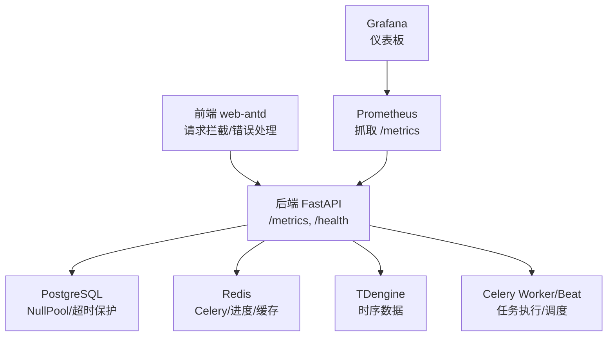
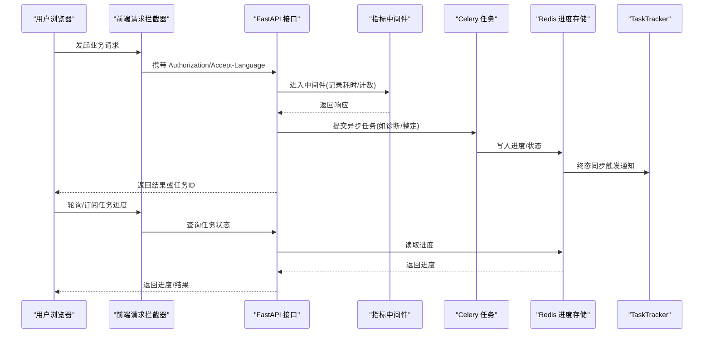
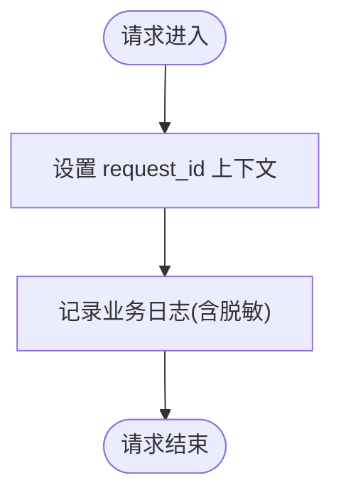
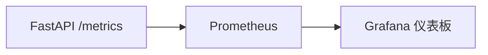
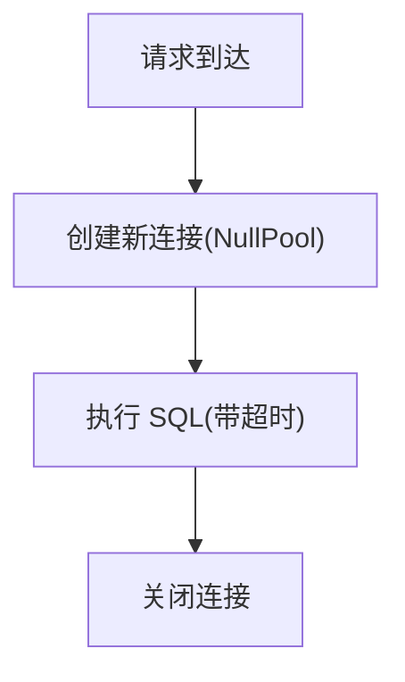
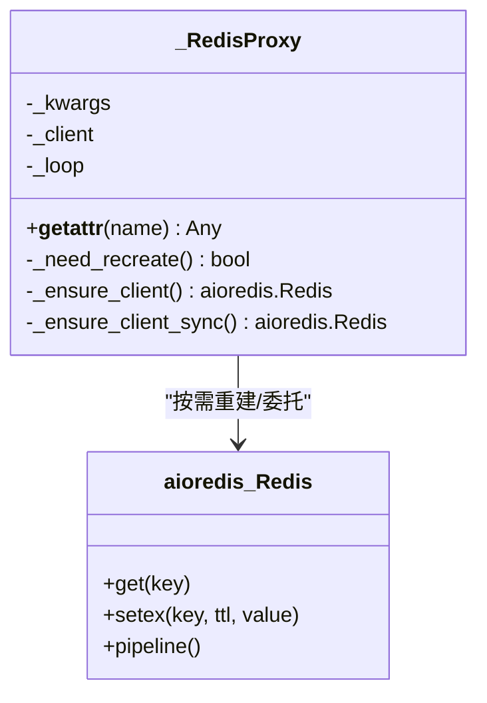
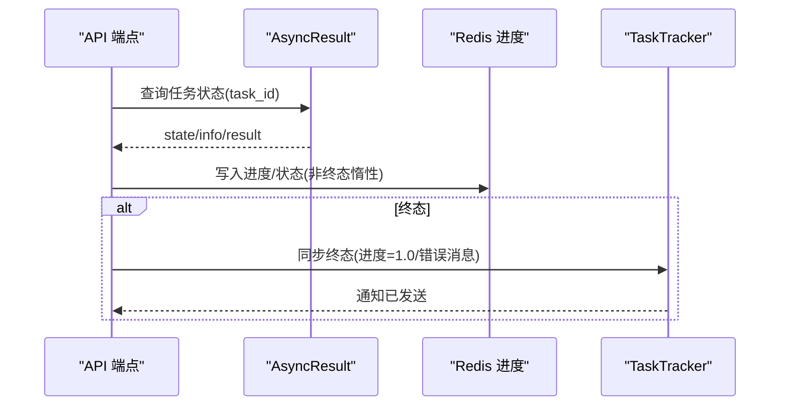
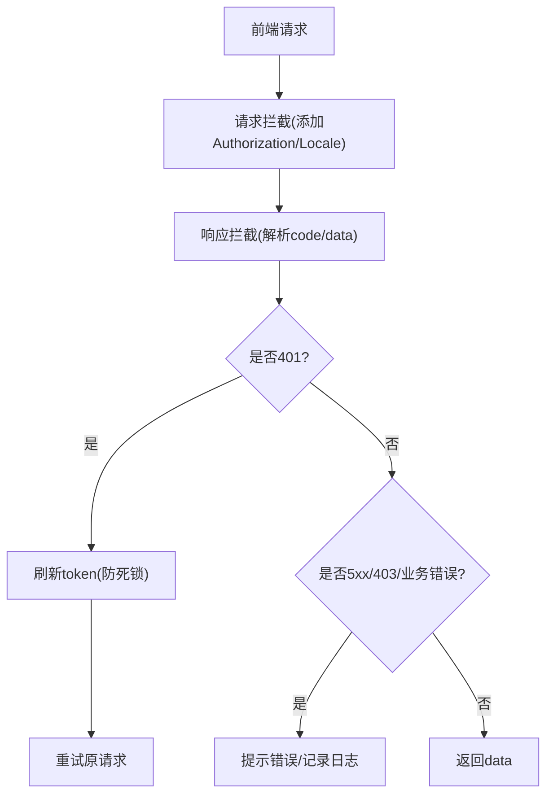
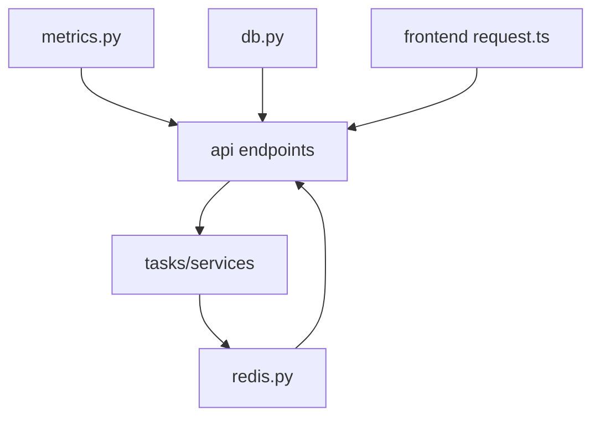

# 调试技巧

<cite>
**本文引用的文件**
- [backend/app/core/logging.py](file://backend/app/core/logging.py)
- [backend/app/core/metrics.py](file://backend/app/core/metrics.py)
- [deploy/prometheus/prometheus.yml](file://deploy/prometheus/prometheus.yml)
- [deploy/grafana/dashboards/clpm-overview.json](file://deploy/grafana/dashboards/clpm-overview.json)
- [backend/app/core/redis.py](file://backend/app/core/redis.py)
- [backend/app/core/db.py](file://backend/app/core/db.py)
- [backend/app/core/config.py](file://backend/app/core/config.py)
- [backend/app/api/v1/endpoints/algorithms.py](file://backend/app/api/v1/endpoints/algorithms.py)
- [backend/app/tasks/dead_letter.py](file://backend/app/tasks/dead_letter.py)
- [backend/app/services/tuning_progress.py](file://backend/app/services/tuning_progress.py)
- [backend/app/api/v1/endpoints/tasks.py](file://backend/app/api/v1/endpoints/tasks.py)
- [backend/app/services/task_tracker.py](file://backend/app/services/task_tracker.py)
- [frontend/apps/web-antd/src/api/request.ts](file://frontend/apps/web-antd/src/api/request.ts)
- [TROUBLESHOOTING.md](file://TROUBLESHOOTING.md)
</cite>

## 目录
1. [简介](#简介)
2. [项目结构](#项目结构)
3. [核心组件](#核心组件)
4. [架构总览](#架构总览)
5. [详细组件分析](#详细组件分析)
6. [依赖关系分析](#依赖关系分析)
7. [性能考虑](#性能考虑)
8. [故障排查指南](#故障排查指南)
9. [结论](#结论)
10. [附录](#附录)

## 简介
本指南面向 CLPM-MVP 项目的开发与运维人员，提供从后端到前端、从单点到全链路的系统化调试方法与工具使用建议。内容覆盖：
- 后端调试：断点调试、结构化日志、指标与剖析、内存与连接问题定位
- 前端调试：Vue DevTools、网络请求拦截、组件状态检查、性能分析
- 全链路调试：分布式追踪（request_id）、日志关联、错误堆栈分析
- 监控与告警：Prometheus 指标采集、Grafana 仪表板、异常告警配置
- 常见场景：数据库连接、缓存失效、异步任务失败等问题的定位与解决
- 工具推荐与配置：基于仓库现有实现的最佳实践

## 项目结构
CLPM-MVP 采用前后端分离架构，后端基于 FastAPI + SQLAlchemy 异步 + Celery 异步任务；数据层包含 PostgreSQL、TDengine 时序库与 Redis 缓存；可观测性通过 Prometheus/Grafana 暴露与应用内指标对接。

图表来源
- [backend/app/core/metrics.py:95-151](file://backend/app/core/metrics.py#L95-L151)
- [backend/app/core/db.py:16-34](file://backend/app/core/db.py#L16-L34)
- [backend/app/core/redis.py:130-137](file://backend/app/core/redis.py#L130-L137)
- [deploy/prometheus/prometheus.yml:13-31](file://deploy/prometheus/prometheus.yml#L13-L31)
- [deploy/grafana/dashboards/clpm-overview.json:1-628](file://deploy/grafana/dashboards/clpm-overview.json#L1-L628)

章节来源
- [backend/app/core/metrics.py:1-163](file://backend/app/core/metrics.py#L1-L163)
- [backend/app/core/db.py:1-64](file://backend/app/core/db.py#L1-L64)
- [backend/app/core/redis.py:1-151](file://backend/app/core/redis.py#L1-L151)
- [deploy/prometheus/prometheus.yml:1-31](file://deploy/prometheus/prometheus.yml#L1-L31)
- [deploy/grafana/dashboards/clpm-overview.json:1-628](file://deploy/grafana/dashboards/clpm-overview.json#L1-L628)

## 核心组件
- 结构化日志与请求追踪：JSON 输出、敏感信息脱敏、request_id 注入，便于跨服务关联
- 指标与限流：HTTP 请求计数与时延直方图、数据库连接数、Celery 任务计数；/metrics 仅内网访问
- 数据库会话：异步引擎、NullPool、命令超时保护，避免慢查询挂死
- Redis 代理：自动检测 event loop 变化并重建客户端，兼容 Celery 多进程环境
- 任务跟踪与进度：Celery 任务状态同步至 Redis，TaskTracker 统一管理与通知
- 前端请求拦截：统一响应格式、401 刷新 token、错误提示与日志记录

章节来源
- [backend/app/core/logging.py:1-151](file://backend/app/core/logging.py#L1-L151)
- [backend/app/core/metrics.py:1-163](file://backend/app/core/metrics.py#L1-L163)
- [backend/app/core/db.py:1-64](file://backend/app/core/db.py#L1-L64)
- [backend/app/core/redis.py:1-151](file://backend/app/core/redis.py#L1-L151)
- [backend/app/api/v1/endpoints/tasks.py:583-642](file://backend/app/api/v1/endpoints/tasks.py#L583-L642)
- [backend/app/services/task_tracker.py:342-384](file://backend/app/services/task_tracker.py#L342-L384)
- [frontend/apps/web-antd/src/api/request.ts:24-151](file://frontend/apps/web-antd/src/api/request.ts#L24-L151)

## 架构总览
下图展示一次带任务调度的典型请求流程，包括前端拦截、后端中间件、指标采集、任务提交与进度同步。

图表来源
- [backend/app/core/metrics.py:95-124](file://backend/app/core/metrics.py#L95-L124)
- [backend/app/api/v1/endpoints/algorithms.py:529-573](file://backend/app/api/v1/endpoints/algorithms.py#L529-L573)
- [backend/app/services/tuning_progress.py:182-260](file://backend/app/services/tuning_progress.py#L182-L260)
- [backend/app/api/v1/endpoints/tasks.py:602-642](file://backend/app/api/v1/endpoints/tasks.py#L602-L642)
- [backend/app/services/task_tracker.py:342-384](file://backend/app/services/task_tracker.py#L342-L384)

## 详细组件分析

### 后端日志与请求追踪
- JSON 结构化日志：统一字段 timestamp、level、logger、message、exc_info，便于外部管道解析
- 敏感信息脱敏：对 password/token/Bearer/JWT 等关键字段进行替换，避免泄露
- request_id 注入：通过 contextvar 在请求生命周期内贯穿日志，便于跨模块关联
- DEBUG 模式抑制噪音：降低 sqlalchemy/httpx/asyncpg 等框架日志级别，减少 I/O 压力

图表来源
- [backend/app/core/logging.py:23-110](file://backend/app/core/logging.py#L23-L110)
- [backend/app/core/logging.py:117-145](file://backend/app/core/logging.py#L117-L145)

章节来源
- [backend/app/core/logging.py:1-151](file://backend/app/core/logging.py#L1-L151)

### 指标与监控（Prometheus/Grafana）
- 指标定义：http_requests_total、http_request_duration_seconds、db_pool_connections、pg_active_connections、celery_task_total
- 中间件采集：排除 /metrics 和 /health，按路由模板打标签避免基数爆炸
- 安全访问：/metrics 仅允许内网地址访问（含 Tailscale CGNAT 段）
- Prometheus 抓取：job_name=clpm-backend，目标 backend:7101
- Grafana 仪表板：QPS、P95 延迟、状态码分布、Celery 成功率、DB 连接数

图表来源
- [backend/app/core/metrics.py:57-87](file://backend/app/core/metrics.py#L57-L87)
- [backend/app/core/metrics.py:95-151](file://backend/app/core/metrics.py#L95-L151)
- [deploy/prometheus/prometheus.yml:13-31](file://deploy/prometheus/prometheus.yml#L13-L31)
- [deploy/grafana/dashboards/clpm-overview.json:94-588](file://deploy/grafana/dashboards/clpm-overview.json#L94-L588)

章节来源
- [backend/app/core/metrics.py:1-163](file://backend/app/core/metrics.py#L1-L163)
- [deploy/prometheus/prometheus.yml:1-31](file://deploy/prometheus/prometheus.yml#L1-L31)
- [deploy/grafana/dashboards/clpm-overview.json:1-628](file://deploy/grafana/dashboards/clpm-overview.json#L1-L628)

### 数据库连接与慢查询防护
- NullPool：每个请求创建新连接，避免 Celery 多进程跨 loop 复用导致 Future 绑定错误
- 命令超时：command_timeout=60s，防止慢查询无限挂起导致请求阻塞
- application_name：标记为 clpm-api，便于 pg_stat_activity 观察连接分布

图表来源
- [backend/app/core/db.py:16-34](file://backend/app/core/db.py#L16-L34)
- [backend/app/core/db.py:45-58](file://backend/app/core/db.py#L45-L58)

章节来源
- [backend/app/core/db.py:1-64](file://backend/app/core/db.py#L1-L64)

### Redis 代理与 Celery 兼容性
- _RedisProxy：检测当前 event loop，必要时重建 aioredis 客户端，避免“Event loop is closed”
- 方法代理：区分异步/同步方法，确保 pipeline 等 sync 调用也能正确绑定当前 loop
- 应用：登录失败计数、令牌黑名单、用户令牌追踪、L1 缓存、任务进度

图表来源
- [backend/app/core/redis.py:29-127](file://backend/app/core/redis.py#L29-L127)
- [backend/app/core/redis.py:130-151](file://backend/app/core/redis.py#L130-L151)

章节来源
- [backend/app/core/redis.py:1-151](file://backend/app/core/redis.py#L1-L151)

### 异步任务状态与进度同步
- 任务状态查询：通过 Celery AsyncResult 获取 state/info/result，封装 BizError 与日志
- 进度同步：将 Celery 子任务状态聚合到 Redis Hash，非终态惰性更新，终态同步 TaskTracker
- TaskTracker：创建任务记录、更新状态、发送通知（仅终态）

图表来源
- [backend/app/api/v1/endpoints/algorithms.py:529-573](file://backend/app/api/v1/endpoints/algorithms.py#L529-L573)
- [backend/app/api/v1/endpoints/tasks.py:602-642](file://backend/app/api/v1/endpoints/tasks.py#L602-L642)
- [backend/app/services/tuning_progress.py:182-260](file://backend/app/services/tuning_progress.py#L182-L260)
- [backend/app/services/task_tracker.py:342-384](file://backend/app/services/task_tracker.py#L342-L384)

章节来源
- [backend/app/api/v1/endpoints/algorithms.py:529-573](file://backend/app/api/v1/endpoints/algorithms.py#L529-L573)
- [backend/app/api/v1/endpoints/tasks.py:583-642](file://backend/app/api/v1/endpoints/tasks.py#L583-L642)
- [backend/app/services/tuning_progress.py:182-260](file://backend/app/services/tuning_progress.py#L182-L260)
- [backend/app/services/task_tracker.py:342-384](file://backend/app/services/task_tracker.py#L342-L384)

### 死信队列与永久失败任务
- Dead Letter：记录永久失败的任务元数据（task_id、task_name、exc、args、kwargs），供独立 worker 消费排查
- 适用场景：重试耗尽、不可恢复异常的任务归档与分析

章节来源
- [backend/app/tasks/dead_letter.py:1-39](file://backend/app/tasks/dead_letter.py#L1-L39)

### 前端请求拦截与错误处理
- 统一响应格式：code/data 字段解析，成功返回 data
- Token 过期处理：401 触发 refresh token 流程，防止死锁（标记 __isRetryRequest）
- 错误提示：5xx 记录日志并提示“服务异常”，403 提示无权限，业务错误优先展示 message

图表来源
- [frontend/apps/web-antd/src/api/request.ts:24-151](file://frontend/apps/web-antd/src/api/request.ts#L24-L151)

章节来源
- [frontend/apps/web-antd/src/api/request.ts:24-151](file://frontend/apps/web-antd/src/api/request.ts#L24-L151)

## 依赖关系分析
- 后端模块耦合：
  - metrics 中间件依赖 Starlette Request/Response，注册 /metrics 路由
  - db 模块提供 get_db 依赖，被各服务/端点使用
  - redis 模块提供 redis_client 单例，被认证、缓存、任务进度等广泛使用
  - tasks 与 services 通过 Celery 与 Redis 交互，TaskTracker 作为统一入口
- 前端依赖：
  - request.ts 封装 @vben/request，统一鉴权与错误处理
  - 页面组件通过 requestClient 调用后端 API

图表来源
- [backend/app/core/metrics.py:95-151](file://backend/app/core/metrics.py#L95-L151)
- [backend/app/core/db.py:45-58](file://backend/app/core/db.py#L45-L58)
- [backend/app/core/redis.py:130-151](file://backend/app/core/redis.py#L130-L151)
- [frontend/apps/web-antd/src/api/request.ts:24-151](file://frontend/apps/web-antd/src/api/request.ts#L24-L151)

章节来源
- [backend/app/core/metrics.py:1-163](file://backend/app/core/metrics.py#L1-L163)
- [backend/app/core/db.py:1-64](file://backend/app/core/db.py#L1-L64)
- [backend/app/core/redis.py:1-151](file://backend/app/core/redis.py#L1-L151)
- [frontend/apps/web-antd/src/api/request.ts:24-151](file://frontend/apps/web-antd/src/api/request.ts#L24-L151)

## 性能考虑
- 日志 I/O：DEBUG 模式下抑制高音量框架日志，避免事件循环阻塞
- 指标标签：使用路由模板而非原始路径，避免 UUID 等实参导致基数爆炸
- 数据库连接：NullPool + command_timeout 防止慢查询挂死；application_name 便于观察连接分布
- Redis 代理：自动重建客户端，避免跨 loop 复用导致的连接池失效
- 任务并行：Celery group 并行 + 惰性进度更新，终态同步 TaskTracker 触发通知

章节来源
- [backend/app/core/logging.py:117-145](file://backend/app/core/logging.py#L117-L145)
- [backend/app/core/metrics.py:117-124](file://backend/app/core/metrics.py#L117-L124)
- [backend/app/core/db.py:16-34](file://backend/app/core/db.py#L16-L34)
- [backend/app/core/redis.py:29-127](file://backend/app/core/redis.py#L29-L127)
- [backend/app/api/v1/endpoints/tasks.py:602-642](file://backend/app/api/v1/endpoints/tasks.py#L602-L642)

## 故障排查指南
- 数据库连接问题
  - 现象：连接池耗尽、慢查询挂死
  - 排查：查看 pg_active_connections 指标；确认 command_timeout 生效；检查 application_name 分组
  - 参考：[backend/app/core/db.py:16-34](file://backend/app/core/db.py#L16-L34)、[backend/app/core/metrics.py:74-81](file://backend/app/core/metrics.py#L74-L81)

- 缓存失效
  - 现象：Redis 不可用导致降级或直接查询
  - 排查：检查 Redis 连接与 TTL；关注降级日志；验证 L3 缓存批量写入与 Pipeline
  - 参考：[backend/app/services/dashboard.py:706-744](file://backend/app/services/dashboard.py#L706-L744)、[backend/app/services/cache/l3_feature.py:142-183](file://backend/app/services/cache/l3_feature.py#L142-L183)

- 异步任务失败
  - 现象：Celery 任务失败、进度停滞
  - 排查：查看死信队列记录；检查 AsyncResult 状态；确认 TaskTracker 终态同步
  - 参考：[backend/app/tasks/dead_letter.py:1-39](file://backend/app/tasks/dead_letter.py#L1-L39)、[backend/app/api/v1/endpoints/algorithms.py:529-573](file://backend/app/api/v1/endpoints/algorithms.py#L529-L573)、[backend/app/services/task_tracker.py:342-384](file://backend/app/services/task_tracker.py#L342-L384)

- 前端 401/5xx
  - 现象：Token 过期或服务异常
  - 排查：检查 request.ts 的刷新 token 逻辑与错误拦截；确认后端 /auth/refresh 可用
  - 参考：[frontend/apps/web-antd/src/api/request.ts:56-141](file://frontend/apps/web-antd/src/api/request.ts#L56-L141)

- 历史问题参考
  - KPI 批量回填失败与修复历程、重启命令、建议排查方向
  - 参考：[TROUBLESHOOTING.md:1-160](file://TROUBLESHOOTING.md#L1-L160)

章节来源
- [backend/app/core/db.py:16-34](file://backend/app/core/db.py#L16-L34)
- [backend/app/core/metrics.py:74-81](file://backend/app/core/metrics.py#L74-L81)
- [backend/app/services/dashboard.py:706-744](file://backend/app/services/dashboard.py#L706-L744)
- [backend/app/services/cache/l3_feature.py:142-183](file://backend/app/services/cache/l3_feature.py#L142-L183)
- [backend/app/tasks/dead_letter.py:1-39](file://backend/app/tasks/dead_letter.py#L1-L39)
- [backend/app/api/v1/endpoints/algorithms.py:529-573](file://backend/app/api/v1/endpoints/algorithms.py#L529-L573)
- [backend/app/services/task_tracker.py:342-384](file://backend/app/services/task_tracker.py#L342-L384)
- [frontend/apps/web-antd/src/api/request.ts:56-141](file://frontend/apps/web-antd/src/api/request.ts#L56-L141)
- [TROUBLESHOOTING.md:1-160](file://TROUBLESHOOTING.md#L1-L160)

## 结论
CLPM-MVP 提供了完善的可观测性与调试基础设施：结构化日志与 request_id 支持全链路追踪；Prometheus/Grafana 提供系统级指标与可视化；数据库与 Redis 的健壮设计避免了常见并发与连接问题；任务跟踪与死信队列帮助快速定位异步任务失败。结合前端请求拦截与错误处理，形成端到端的调试闭环。建议在日常开发中充分利用这些能力，结合本指南的场景化排查步骤，提升问题定位效率与系统稳定性。

## 附录
- 常用命令与环境
  - 启动后端、Celery Worker、前端开发服务器
  - 参考：[TROUBLESHOOTING.md:122-136](file://TROUBLESHOOTING.md#L122-L136)

- 配置要点
  - 生产环境安全校验（JWT/密码/AAS 安全模式）
  - 参考：[backend/app/core/config.py:185-225](file://backend/app/core/config.py#L185-L225)