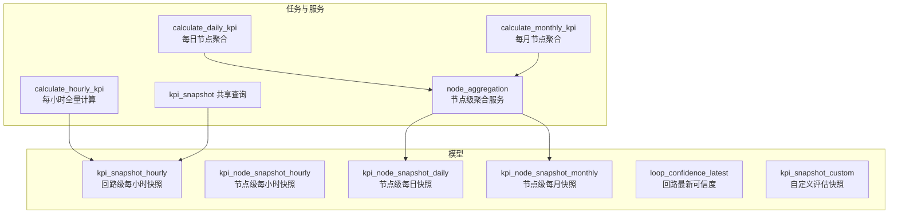
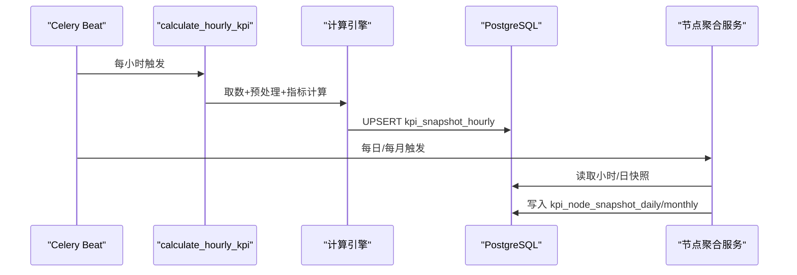
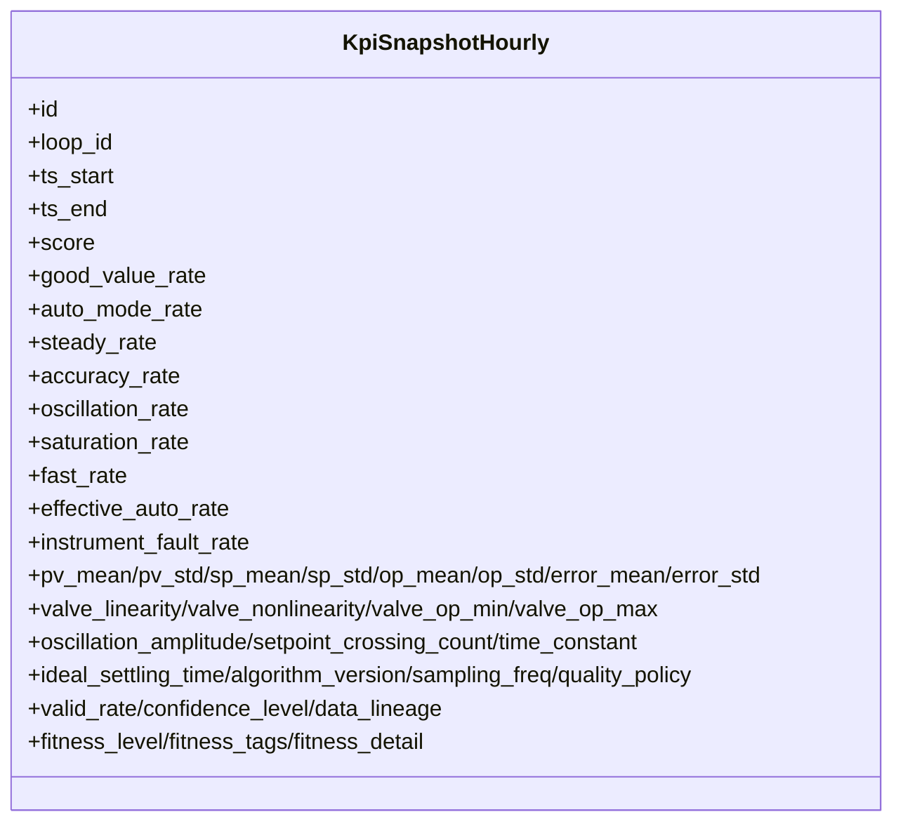
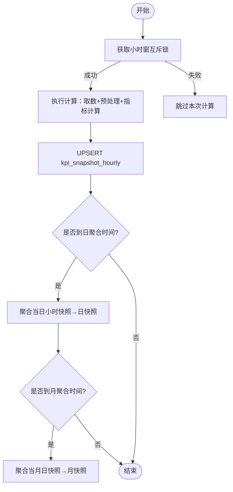
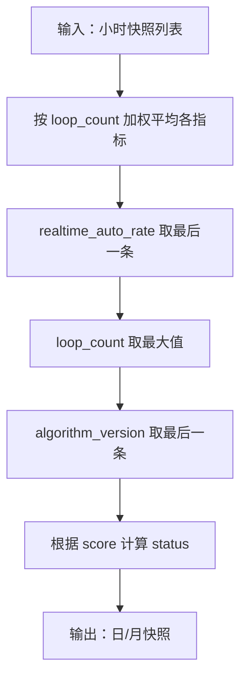
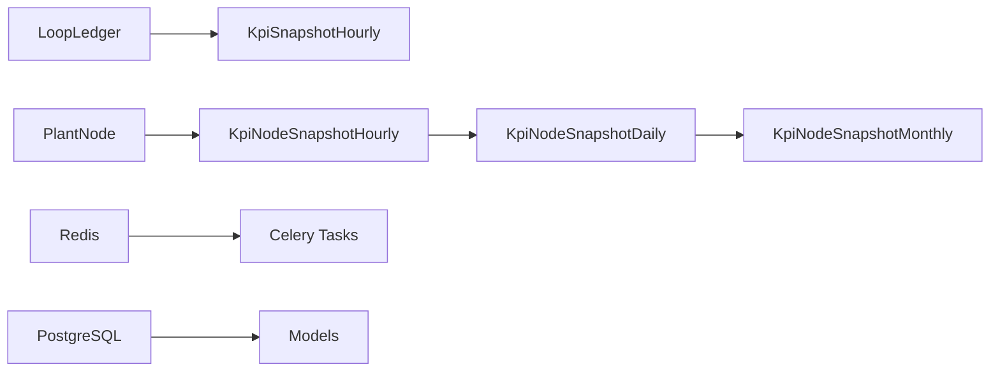

# KPI 快照存储

<cite>
**本文引用的文件**
- [backend/app/models/metric.py](file://backend/app/models/metric.py)
- [backend/app/models/node_kpi.py](file://backend/app/models/node_kpi.py)
- [backend/app/services/kpi_snapshot.py](file://backend/app/services/kpi_snapshot.py)
- [backend/app/tasks/kpi_calc.py](file://backend/app/tasks/kpi_calc.py)
- [backend/app/services/node_aggregation.py](file://backend/app/services/node_aggregation.py)
- [backend/alembic/versions/b3c4d5e6f7a8_add_kpi_snapshot_indexes.py](file://backend/alembic/versions/b3c4d5e6f7a8_add_kpi_snapshot_indexes.py)
- [backend/alembic/versions/q1a2b3c4d5e6_add_unique_constraint_loop_ts.py](file://backend/alembic/versions/q1a2b3c4d5e6_add_unique_constraint_loop_ts.py)
- [backend/alembic/versions/d5e6f7a8b9c0_add_node_kpi_snapshot.py](file://backend/alembic/versions/d5e6f7a8b9c0_add_node_kpi_snapshot.py)
- [backend/alembic/versions/i0d1e2f3a4b5_add_node_snapshot_daily_monthly.py](file://backend/alembic/versions/i0d1e2f3a4b5_add_node_snapshot_daily_monthly.py)
- [backend/alembic/versions/c3bee6758850_add_fitness_fields_to_kpi_snapshots.py](file://backend/alembic/versions/c3bee6758850_add_fitness_fields_to_kpi_snapshots.py)
- [backend/alembic/versions/f7a9b0c1d2e3_add_realtime_auto_rate.py](file://backend/alembic/versions/f7a9b0c1d2e3_add_realtime_auto_rate.py)
- [backend/alembic/versions/h9c0d1e2f3a4_add_fault_diagnosis_metrics.py](file://backend/alembic/versions/h9c0d1e2f3a4_add_fault_diagnosis_metrics.py)
- [backend/alembic/versions/z1a2b3c4d5e6_add_loop_ideal_settling_and_confidence_latest.py](file://backend/alembic/versions/z1a2b3c4d5e6_add_loop_ideal_settling_and_confidence_latest.py)
</cite>

## 目录
1. [简介](#简介)
2. [项目结构](#项目结构)
3. [核心组件](#核心组件)
4. [架构总览](#架构总览)
5. [详细组件分析](#详细组件分析)
6. [依赖关系分析](#依赖关系分析)
7. [性能与查询优化](#性能与查询优化)
8. [存储优化策略](#存储优化策略)
9. [数据迁移与版本管理](#数据迁移与版本管理)
10. [导入导出与恢复](#导入导出与恢复)
11. [监控告警](#监控告警)
12. [故障排查指南](#故障排查指南)
13. [结论](#结论)

## 简介
本技术文档围绕 KPI 快照存储系统，系统性说明回路级与节点级快照的数据模型、索引与分区策略、生成流程（定时触发、增量计算、全量重算、一致性保证）、存储优化（压缩、归档、清理、备份）、查询优化（复合索引、查询计划、缓存）、数据迁移与版本管理（Schema 演进、转换、回滚），以及导入导出工具与数据恢复方案、监控告警体系。目标是帮助读者快速理解并高效运维该子系统。

## 项目结构
KPI 快照相关代码主要分布在以下模块：
- 数据模型：回路级快照表、节点级小时/日/月快照表、自定义快照与最新可信度快照
- 任务编排：Celery Beat 定时任务、批量计算、聚合任务
- 服务层：节点级聚合服务、共享查询封装
- 迁移脚本：Alembic 版本化 Schema 演进

图表来源
- [backend/app/models/metric.py:62-148](file://backend/app/models/metric.py#L62-L148)
- [backend/app/models/node_kpi.py:31-80](file://backend/app/models/node_kpi.py#L31-L80)
- [backend/app/tasks/kpi_calc.py:128-170](file://backend/app/tasks/kpi_calc.py#L128-L170)
- [backend/app/services/node_aggregation.py:144-235](file://backend/app/services/node_aggregation.py#L144-L235)
- [backend/app/services/kpi_snapshot.py:25-69](file://backend/app/services/kpi_snapshot.py#L25-L69)

章节来源
- [backend/app/models/metric.py:62-148](file://backend/app/models/metric.py#L62-L148)
- [backend/app/models/node_kpi.py:31-80](file://backend/app/models/node_kpi.py#L31-L80)
- [backend/app/tasks/kpi_calc.py:128-170](file://backend/app/tasks/kpi_calc.py#L128-L170)
- [backend/app/services/node_aggregation.py:144-235](file://backend/app/services/node_aggregation.py#L144-L235)
- [backend/app/services/kpi_snapshot.py:25-69](file://backend/app/services/kpi_snapshot.py#L25-L69)

## 核心组件
- 回路级快照（KpiSnapshotHourly）：按回路维度记录每小时 KPI 指标，包含评分、多率指标、诊断扩展字段、适用性分层等，具备唯一约束与多维索引。
- 节点级快照（KpiNodeSnapshotHourly/Daily/Monthly）：按工厂节点维度对下属回路进行加权聚合，形成小时/日/月视图，支持企业级/装置级/单元级 KPI。
- 任务编排（Celery）：每小时全量计算、每日/每月节点聚合，支持动态调度周期与互斥锁。
- 聚合服务：基于 loop_count 的加权平均算法，确保日/月聚合的统计合理性。
- 共享查询：提供窗口内最新快照与摘要格式化能力。

章节来源
- [backend/app/models/metric.py:62-148](file://backend/app/models/metric.py#L62-L148)
- [backend/app/models/node_kpi.py:31-80](file://backend/app/models/node_kpi.py#L31-L80)
- [backend/app/services/node_aggregation.py:87-124](file://backend/app/services/node_aggregation.py#L87-L124)
- [backend/app/services/kpi_snapshot.py:25-69](file://backend/app/services/kpi_snapshot.py#L25-L69)

## 架构总览
KPI 快照系统采用“计算-聚合-存储”三层架构：
- 计算层：Celery 定时任务驱动，按回路维度计算各项指标，写入 kpi_snapshot_hourly。
- 聚合层：节点级聚合服务按 loop_count 加权汇总小时快照为日/月快照。
- 存储层：PostgreSQL 持久化快照，配合 Alembic 管理 Schema 演进；通过索引与约束保障查询性能与数据一致性。

图表来源
- [backend/app/tasks/kpi_calc.py:128-170](file://backend/app/tasks/kpi_calc.py#L128-L170)
- [backend/app/tasks/kpi_calc.py:4079-4172](file://backend/app/tasks/kpi_calc.py#L4079-L4172)
- [backend/app/services/node_aggregation.py:144-235](file://backend/app/services/node_aggregation.py#L144-L235)

## 详细组件分析

### 回路级快照（KpiSnapshotHourly）
- 字段定义：包含时间窗（ts_start/ts_end）、评分、好值率、自动模式率、稳态率、准确率、振荡率、饱和率、快速率、有效自动率、仪表故障率、PV/SP/OP/误差均值与标准差、阀门线性/非线性、振荡幅度、设定点穿越次数、时间常数、理想稳态时间、算法版本、采样频率、质量策略、有效度、可信度等级、数据血缘、适用性分层（fitness_level/tags/detail）。
- 索引策略：针对 loop_id、ts_start、status、fitness_level 建立单列索引；复合索引（ts_start, loop_id）用于窗口查询；唯一约束（loop_id, ts_start）保证每小时一条。
- 分区方案：当前未显式分区，建议按 ts_start 按月或按年进行范围分区以优化历史数据查询与清理。

图表来源
- [backend/app/models/metric.py:62-148](file://backend/app/models/metric.py#L62-L148)

章节来源
- [backend/app/models/metric.py:62-148](file://backend/app/models/metric.py#L62-L148)

### 节点级快照（KpiNodeSnapshotHourly/Daily/Monthly）
- 字段定义：节点 ID、时间窗/统计日期、评分、各率指标、仪表故障率、诊断扩展字段、自动回路比、实时自动率、参与聚合的回路数、状态、算法版本、创建时间。
- 索引策略：plant_node_id、ts_start/stat_date/stat_month、status、复合索引（plant_node_id, ts_start/stat_date/stat_month）提升节点维度查询效率。
- 分区方案：建议按 stat_date/stat_month 进行范围分区，便于月度归档与清理。

```mermaid
classDiagram
class KpiNodeSnapshotHourly {
+id
+plant_node_id
+ts_start
+ts_end
+score/good_value_rate/auto_mode_rate/effective_auto_rate/steady_rate/accuracy_rate/fast_rate/oscillation_rate/saturation_rate
+instrument_fault_rate/stiction_index/settling_time/output_trip_index/ideal_settling_time
+auto_loop_ratio/realtime_auto_rate/loop_count/status/algorithm_version/created_at
}
class KpiNodeSnapshotDaily {
+id
+plant_node_id
+stat_date
+score/good_value_rate/auto_mode_rate/effective_auto_rate/steady_rate/accuracy_rate/fast_rate/oscillation_rate/saturation_rate
+instrument_fault_rate/stiction_index/settling_time/output_trip_index/ideal_settling_time
+auto_loop_ratio/realtime_auto_rate/loop_count/status/algorithm_version/created_at
}
class KpiNodeSnapshotMonthly {
+id
+plant_node_id
+stat_month
+score/good_value_rate/auto_mode_rate/effective_auto_rate/steady_rate/accuracy_rate/fast_rate/oscillation_rate/saturation_rate
+instrument_fault_rate/stiction_index/settling_time/output_trip_index/ideal_settling_time
+auto_loop_ratio/realtime_auto_rate/loop_count/status/algorithm_version/created_at
}
```

图表来源
- [backend/app/models/node_kpi.py:31-80](file://backend/app/models/node_kpi.py#L31-L80)
- [backend/app/models/node_kpi.py:83-138](file://backend/app/models/node_kpi.py#L83-L138)
- [backend/app/models/node_kpi.py:141-196](file://backend/app/models/node_kpi.py#L141-L196)

章节来源
- [backend/app/models/node_kpi.py:31-80](file://backend/app/models/node_kpi.py#L31-L80)
- [backend/app/models/node_kpi.py:83-138](file://backend/app/models/node_kpi.py#L83-L138)
- [backend/app/models/node_kpi.py:141-196](file://backend/app/models/node_kpi.py#L141-L196)

### 快照生成流程
- 定时触发：Celery Beat 每小时触发 calculate_hourly_kpi；每日 00:05 触发 daily 聚合；每月 1 日 00:10 触发 monthly 聚合。
- 增量计算：通过 DataPlanner 获取预处理后的 MetricDataBundle，仅对缺失或变更窗口进行计算。
- 全量重算：支持指定 loop_ids 或空列表精准重算；可禁用缓存以加速 backfill。
- 一致性保证：Redis SETNX 互斥锁防止同一窗口并发；UPSERT 幂等写入；失败重试与任务跟踪。

图表来源
- [backend/app/tasks/kpi_calc.py:128-170](file://backend/app/tasks/kpi_calc.py#L128-L170)
- [backend/app/tasks/kpi_calc.py:4079-4172](file://backend/app/tasks/kpi_calc.py#L4079-L4172)
- [backend/app/services/node_aggregation.py:144-235](file://backend/app/services/node_aggregation.py#L144-L235)

章节来源
- [backend/app/tasks/kpi_calc.py:128-170](file://backend/app/tasks/kpi_calc.py#L128-L170)
- [backend/app/tasks/kpi_calc.py:4079-4172](file://backend/app/tasks/kpi_calc.py#L4079-L4172)
- [backend/app/services/node_aggregation.py:144-235](file://backend/app/services/node_aggregation.py#L144-L235)

### 聚合算法与权重
- 小时→日/月聚合：按 loop_count 加权平均，避免无值稀释；realtime_auto_rate 取最后一条非聚合值；status 由 score 重新定级。
- 内存级回路→节点聚合：按回路级别权重（1→3, 2→2, 3→1）加权，INCONCLUSIVE 不参与聚合。

图表来源
- [backend/app/services/node_aggregation.py:87-124](file://backend/app/services/node_aggregation.py#L87-L124)
- [backend/app/services/node_aggregation.py:144-235](file://backend/app/services/node_aggregation.py#L144-L235)

章节来源
- [backend/app/services/node_aggregation.py:87-124](file://backend/app/services/node_aggregation.py#L87-L124)
- [backend/app/services/node_aggregation.py:144-235](file://backend/app/services/node_aggregation.py#L144-L235)

## 依赖关系分析
- 模型依赖：KpiSnapshotHourly 关联 loop_ledger；节点快照关联 plant_node。
- 任务依赖：calculate_hourly_kpi 依赖 DataPlanner、MetricCalculator、ConfidenceEvaluator；聚合任务依赖 node_aggregation。
- 外部依赖：Redis 用于互斥锁与任务跟踪；PostgreSQL 用于持久化。

图表来源
- [backend/app/models/metric.py:62-148](file://backend/app/models/metric.py#L62-L148)
- [backend/app/models/node_kpi.py:31-80](file://backend/app/models/node_kpi.py#L31-L80)
- [backend/app/tasks/kpi_calc.py:128-170](file://backend/app/tasks/kpi_calc.py#L128-L170)

章节来源
- [backend/app/models/metric.py:62-148](file://backend/app/models/metric.py#L62-L148)
- [backend/app/models/node_kpi.py:31-80](file://backend/app/models/node_kpi.py#L31-L80)
- [backend/app/tasks/kpi_calc.py:128-170](file://backend/app/tasks/kpi_calc.py#L128-L170)

## 性能与查询优化
- 复合索引设计：
  - 回路级：(ts_start, loop_id)、(loop_id)、(ts_start)、(status)、(fitness_level)
  - 节点级：(plant_node_id, ts_start/stat_date/stat_month)、(ts_start/stat_date/stat_month)、(status)
- 查询计划优化：使用窗口过滤（ts_start >= start AND ts_start < end）与排序（desc/asc）结合索引，减少扫描行数。
- 缓存策略：
  - L1/L2 缓存：DataPlanner.request_bundles 预加载与复用 MetricDataBundle，显著降低 I/O。
  - 预热任务：prewarm_cache 可在大规模重算前预热指定窗口。
  - 共享查询：latest_snapshot_in_window 利用索引快速定位窗口内最新快照。

章节来源
- [backend/app/models/metric.py:125-148](file://backend/app/models/metric.py#L125-L148)
- [backend/app/models/node_kpi.py:69-80](file://backend/app/models/node_kpi.py#L69-L80)
- [backend/app/tasks/kpi_calc.py:388-448](file://backend/app/tasks/kpi_calc.py#L388-L448)
- [backend/app/services/kpi_snapshot.py:48-69](file://backend/app/services/kpi_snapshot.py#L48-L69)

## 存储优化策略
- 数据压缩：PostgreSQL 页压缩与行压缩（TOAST）适用于 JSONB 大字段（data_lineage、fitness_detail）；建议在数据库层面启用 pg_compression。
- 归档策略：
  - 按 ts_start/stat_date/stat_month 范围分区，将历史数据迁移至归档表或冷存储。
  - 月度快照可作为长期归档粒度，减少热表体积。
- 清理规则：
  - 保留策略：例如保留最近 N 个月的小时快照，超出部分归档或删除。
  - 幂等更新：唯一约束与 UPSERT 避免重复写入，降低冗余。
- 备份机制：
  - 逻辑备份：pg_dump 定期导出快照表；结合对象存储归档。
  - 物理备份：WAL 归档与时间点恢复（PITR），确保数据可恢复性。

[本节为通用指导，不直接分析具体文件]

## 数据迁移与版本管理
- Schema 演进：
  - 新增索引：b3c4d5e6f7a8_add_kpi_snapshot_indexes.py
  - 唯一约束：q1a2b3c4d5e6_add_unique_constraint_loop_ts.py
  - 节点快照表：d5e6f7a8b9c0_add_node_kpi_snapshot.py、i0d1e2f3a4b5_add_node_snapshot_daily_monthly.py
  - 适用性分层字段：c3bee6758850_add_fitness_fields_to_kpi_snapshots.py
  - 实时自动率：f7a9b0c1d2e3_add_realtime_auto_rate.py
  - 仪表故障率：h9c0d1e2f3a4_add_fault_diagnosis_metrics.py
  - 最新可信度：z1a2b3c4d5e6_add_loop_ideal_settling_and_confidence_latest.py
- 数据转换：
  - 日/月聚合：按 loop_count 加权平均，realtime_auto_rate 取最后一条。
  - 状态重算：根据 score 映射 EXCELLENT/GOOD/FAIR/WARNING/POOR/INCONCLUSIVE。
- 回滚机制：
  - Alembic 反向迁移：downgrade 撤销新增字段/索引/约束。
  - 数据回滚：在事务中执行批量更新/删除，确保一致性。

章节来源
- [backend/alembic/versions/b3c4d5e6f7a8_add_kpi_snapshot_indexes.py](file://backend/alembic/versions/b3c4d5e6f7a8_add_kpi_snapshot_indexes.py)
- [backend/alembic/versions/q1a2b3c4d5e6_add_unique_constraint_loop_ts.py](file://backend/alembic/versions/q1a2b3c4d5e6_add_unique_constraint_loop_ts.py)
- [backend/alembic/versions/d5e6f7a8b9c0_add_node_kpi_snapshot.py](file://backend/alembic/versions/d5e6f7a8b9c0_add_node_kpi_snapshot.py)
- [backend/alembic/versions/i0d1e2f3a4b5_add_node_snapshot_daily_monthly.py](file://backend/alembic/versions/i0d1e2f3a4b5_add_node_snapshot_daily_monthly.py)
- [backend/alembic/versions/c3bee6758850_add_fitness_fields_to_kpi_snapshots.py](file://backend/alembic/versions/c3bee6758850_add_fitness_fields_to_kpi_snapshots.py)
- [backend/alembic/versions/f7a9b0c1d2e3_add_realtime_auto_rate.py](file://backend/alembic/versions/f7a9b0c1d2e3_add_realtime_auto_rate.py)
- [backend/alembic/versions/h9c0d1e2f3a4_add_fault_diagnosis_metrics.py](file://backend/alembic/versions/h9c0d1e2f3a4_add_fault_diagnosis_metrics.py)
- [backend/alembic/versions/z1a2b3c4d5e6_add_loop_ideal_settling_and_confidence_latest.py](file://backend/alembic/versions/z1a2b3c4d5e6_add_loop_ideal_settling_and_confidence_latest.py)

## 导入导出与恢复
- 导入工具：
  - 批量插入：使用 SQLAlchemy 批量写入，结合事务与错误重试。
  - 数据校验：在导入前校验 loop_id 有效性、时间窗合法性、指标范围。
- 导出工具：
  - 按窗口导出：支持按 loop_id、ts_start/ts_end 导出 CSV/JSON。
  - 节点级导出：按 plant_node_id、stat_date/stat_month 导出聚合结果。
- 数据恢复：
  - 基于备份恢复：使用 pg_restore 恢复快照表；校验唯一约束与索引完整性。
  - 增量恢复：结合 WAL 归档进行时间点恢复，确保数据连续性。

[本节为通用指导，不直接分析具体文件]

## 监控告警
- 存储容量监控：监控 PostgreSQL 表空间使用率，设置阈值告警（如 >80%）。
- 写入失败告警：捕获 Celery 任务异常与数据库写入错误，发送告警通知。
- 数据完整性检查：
  - 每日巡检：检查 kpi_snapshot_hourly 与 kpi_node_snapshot_* 的一致性。
  - 可信度检查：监控 confidence_level 分布，异常低可信度触发告警。
- 性能监控：
  - 查询延迟：监控慢查询日志，优化索引与查询计划。
  - 缓存命中率：监控 L1/L2 缓存命中率，调整预热策略。

[本节为通用指导，不直接分析具体文件]

## 故障排查指南
- 常见问题：
  - 同一窗口并发冲突：检查 Redis 锁是否释放，查看任务跟踪状态。
  - 数据不一致：核对 loop_id 与 ts_start 唯一约束，检查 UPSERT 逻辑。
  - 聚合结果异常：验证 loop_count 加权逻辑，确认 realtime_auto_rate 取值。
- 调试步骤：
  - 查看 Celery 任务日志，定位失败原因。
  - 检查数据库索引使用情况，优化查询计划。
  - 使用共享查询 latest_snapshot_in_window 验证窗口内数据。

章节来源
- [backend/app/tasks/kpi_calc.py:128-170](file://backend/app/tasks/kpi_calc.py#L128-L170)
- [backend/app/services/kpi_snapshot.py:48-69](file://backend/app/services/kpi_snapshot.py#L48-L69)

## 结论
KPI 快照存储系统通过清晰的模型设计、健壮的生成流程、优化的存储与查询策略，实现了高可靠、高性能的回路级与节点级 KPI 快照管理。结合 Alembic 的版本化管理与完善的监控告警体系，确保了系统的可维护性与可扩展性。建议在生产环境中持续优化分区策略、归档清理与备份恢复机制，以应对不断增长的数据规模与查询需求。