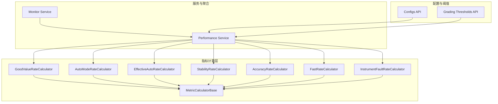
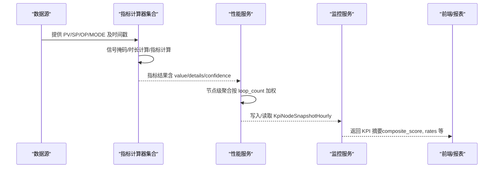
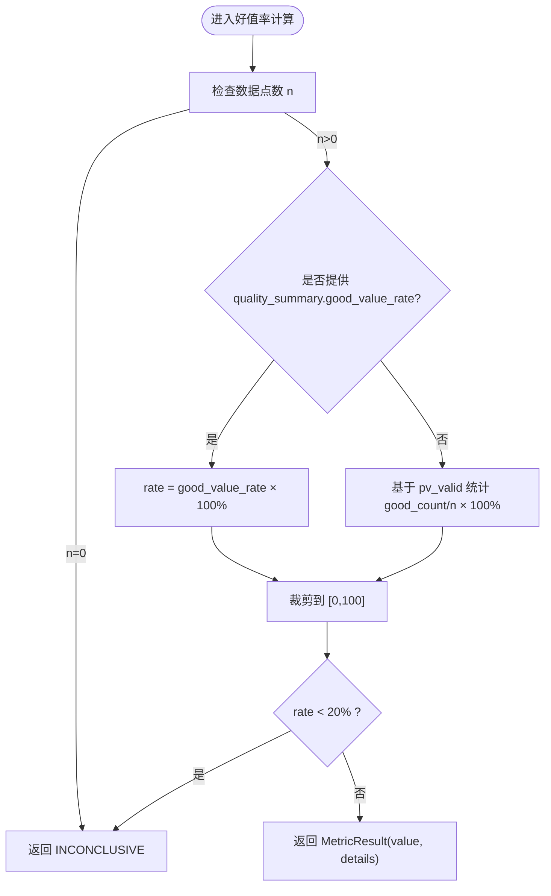
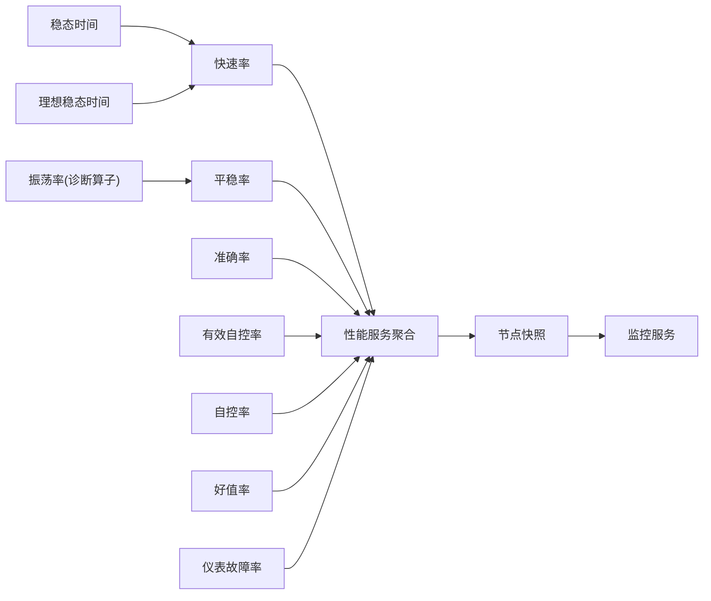

# KPI 指标体系

<cite>
**本文引用的文件**
- [good_value.py](file://backend/app/services/metric_calculator/good_value.py)
- [auto_mode.py](file://backend/app/services/metric_calculator/auto_mode.py)
- [effective_auto.py](file://backend/app/services/metric_calculator/effective_auto.py)
- [stability.py](file://backend/app/services/metric_calculator/stability.py)
- [accuracy.py](file://backend/app/services/metric_calculator/accuracy.py)
- [fast_rate.py](file://backend/app/services/metric_calculator/fast_rate.py)
- [instrument_fault.py](file://backend/app/services/metric_calculator/instrument_fault.py)
- [base.py](file://backend/app/services/metric_calculator/base.py)
- [performance.py](file://backend/app/services/performance.py)
- [grading_config.py](file://backend/app/api/v1/endpoints/grading_config.py)
- [config.py](file://backend/app/schemas/config.py)
- [configs.py](file://backend/app/api/v1/endpoints/configs.py)
- [monitor.py](file://backend/app/services/monitor.py)
- [oscillation.py](file://backend/app/services/diagnosis_operators/oscillation.py)
</cite>

## 目录
1. [简介](#简介)
2. [项目结构](#项目结构)
3. [核心组件](#核心组件)
4. [架构总览](#架构总览)
5. [详细组件分析](#详细组件分析)
6. [依赖关系分析](#依赖关系分析)
7. [性能考虑](#性能考虑)
8. [故障排查指南](#故障排查指南)
9. [结论](#结论)
10. [附录：指标配置与阈值接口](#附录指标配置与阈值接口)

## 简介
本技术文档面向 KPI 指标体系，围绕 7 大核心 KPI（好值率、自控率、有效自控率、平稳率、准确率、快速率、振荡率）以及新增的仪表故障率和综合评分进行系统化说明。内容涵盖：
- 每个指标的数学定义、计算公式、适用条件与质量要求
- 指标权重配置机制（含权重总和校验、启用/禁用控制、类型权重与级别权重调整策略）
- 指标阈值配置系统（默认阈值、自定义阈值、版本管理）
- 指标状态判定逻辑（优秀、良好、一般、较差、差）
- 完整的指标配置 CRUD 接口说明与使用示例

## 项目结构
KPI 计算以“计算器”为最小单元，统一继承自基类，提供信号提取、可信度判定、结果构造等通用能力；各指标按功能拆分到独立模块；聚合与展示通过服务层读取快照并输出给前端。

**图表来源**
- [base.py:42-201](file://backend/app/services/metric_calculator/base.py#L42-L201)
- [good_value.py:28-88](file://backend/app/services/metric_calculator/good_value.py#L28-L88)
- [auto_mode.py:26-89](file://backend/app/services/metric_calculator/auto_mode.py#L26-L89)
- [effective_auto.py:41-148](file://backend/app/services/metric_calculator/effective_auto.py#L41-L148)
- [stability.py:37-127](file://backend/app/services/metric_calculator/stability.py#L37-L127)
- [accuracy.py:36-163](file://backend/app/services/metric_calculator/accuracy.py#L36-L163)
- [fast_rate.py:46-214](file://backend/app/services/metric_calculator/fast_rate.py#L46-L214)
- [instrument_fault.py:52-123](file://backend/app/services/metric_calculator/instrument_fault.py#L52-L123)
- [performance.py:481-515](file://backend/app/services/performance.py#L481-L515)
- [monitor.py:786-814](file://backend/app/services/monitor.py#L786-L814)

**章节来源**
- [base.py:42-201](file://backend/app/services/metric_calculator/base.py#L42-L201)
- [performance.py:481-515](file://backend/app/services/performance.py#L481-L515)
- [monitor.py:786-814](file://backend/app/services/monitor.py#L786-L814)

## 核心组件
- 指标计算器抽象基类：提供信号提取、掩码处理、时长计算、可信度判定、INCONCLUSIVE 兜底、数据血缘构建等通用能力。
- 七大核心指标计算器：分别实现好值率、自控率、有效自控率、平稳率、准确率、快速率、振荡率（振荡率由诊断算子提供）。
- 仪表故障率计算器：复用预处理异常原因码，结合复合判据统计三类仪表故障占比。
- 性能服务：从节点快照中聚合 KPI 摘要，并按回路数加权汇总。
- 监控服务：将最新快照中的 KPI 字段映射为对外摘要。

**章节来源**
- [base.py:42-201](file://backend/app/services/metric_calculator/base.py#L42-L201)
- [monitor.py:786-814](file://backend/app/services/monitor.py#L786-L814)
- [performance.py:481-515](file://backend/app/services/performance.py#L481-L515)

## 架构总览
下图展示了从原始信号到指标计算、再到快照聚合与对外暴露的整体流程。

**图表来源**
- [base.py:123-201](file://backend/app/services/metric_calculator/base.py#L123-L201)
- [performance.py:481-515](file://backend/app/services/performance.py#L481-L515)
- [monitor.py:786-814](file://backend/app/services/monitor.py#L786-L814)

## 详细组件分析

### 好值率（Good Value Rate）
- 数学定义：η_good = T_good / T_total × 100%
  - T_good：PV 质量码为 Good 且数值在有效量程范围内的累计时长
  - T_total：评估时段总时长
- 适用条件：需要 PV 质量码或 pv_valid 标记；数据点数为 0 时不可计算
- 质量要求：好值率 < 20% 时标记 INCONCLUSIVE，影响整体可信度
- 数据来源：优先使用 quality_summary.good_value_rate，回退至 pv_valid 计数
- 关键实现要点：
  - 空数据块直接返回 INCONCLUSIVE
  - 低于阈值触发 INCONCLUSIVE，value=None，confidence=E
  - 记录 sample_count 与 source（quality_summary 或 pv_valid）

**图表来源**
- [good_value.py:28-88](file://backend/app/services/metric_calculator/good_value.py#L28-L88)

**章节来源**
- [good_value.py:28-88](file://backend/app/services/metric_calculator/good_value.py#L28-L88)

### 自控率（Auto Mode Rate）
- 数学定义：Auto = T_auto / T_total × 100%
  - T_auto：MODE 为 Auto/Cascade/Remote 的累计时长
  - T_total：评估时段总时长
- 适用条件：需要 mode 信号与时间戳；至少两个采样点
- 质量要求：数据不足或总时长为零时返回 INCONCLUSIVE
- 关键实现要点：
  - 零阶保持模型计算每点时长
  - 仅对自动模式区间累加时长
  - 安全转换 MODE 值为整数

**章节来源**
- [auto_mode.py:26-89](file://backend/app/services/metric_calculator/auto_mode.py#L26-L89)

### 有效自控率（Effective Auto Rate）
- 数学定义：R = T_effective / T_total × 100%
  - T_effective 需同时满足：
    1. MODE 为 Auto/Cascade/Remote
    2. OP 未饱和（OP_low+ε < OP < OP_high-ε）
    3. 控制偏差在合理范围（|E| < |E|_max）
- 适用条件：需要 mode/op/pv/sp 信号与时间戳；至少两个采样点
- 质量要求：数据不足或总时长为零时返回 INCONCLUSIVE
- 关键实现要点：
  - 从算法配置链读取 e_max 基准比例
  - 缺失 op/pv/sp 时采用保守判定（不判饱和/偏差视为合理）
  - 同时输出 auto_mode_rate 与 effective_duration_s 等细节

**章节来源**
- [effective_auto.py:41-148](file://backend/app/services/metric_calculator/effective_auto.py#L41-L148)

### 平稳率（Stability Rate）
- 数学定义：S = exp(-σ/(0.05·U)) × (1-Osc) × 100%
  - σ：控制偏差标准差（无偏估计，分母 n-1）
  - U：PV 量程范围
  - Osc：振荡率（0~1，来自 oscillation_rate 计算器）
- 适用条件：需要 pv/sp 配对数据；至少两个采样点；U>0
- 质量要求：振荡率过高导致稳定率为 0；pv_range 非法则 INCONCLUSIVE
- 关键实现要点：
  - 依赖振荡率计算器结果
  - 指数衰减形式避免溢出，使用 math.exp(-x)
  - 记录 mean_error/std_error/pv_range/normalized_std 等细节

**章节来源**
- [stability.py:37-127](file://backend/app/services/metric_calculator/stability.py#L37-L127)

### 准确率（Accuracy Rate）
- 数学定义：A = [1 - r × (1 - 1/e^r)] × 100%，其中 r = |Ē| / |E|_max
  - |Ē|：平均绝对偏差
  - |E|_max：优先 CONFIG 指定，否则数据驱动 Σ[max(|E_i|)-|E_i|]/n
- 适用条件：需要 pv/sp 配对数据；存在有效样本
- 质量要求：e_max=0 且非零余差时退化分支按量程百分比扣分；缺少 pv_range 则 INCONCLUSIVE
- 关键实现要点：
  - 支持 e_max_percentile 截断抑制极端偏差
  - 使用 math.exp(-r) 避免溢出
  - 恒定余差退化场景降级为按量程百分比扣分

**章节来源**
- [accuracy.py:36-163](file://backend/app/services/metric_calculator/accuracy.py#L36-L163)

### 快速率（Fast Rate）
- 数学定义：
  - F = 100% 当 T ≤ T'
  - F = exp(-(T-T')/T') × 100% 当 T > T'
  - T：实际稳态时间（settling_time 计算器）
  - T'：理想稳态时间（ideal_settling_time 计算器）
- 适用条件：需要 settling_time 与 ideal_settling_time；ideal_t>0
- 质量要求：ideal_t 无效或 settling_time 辨识失败时 INCONCLUSIVE；never_settles 以窗口长度代入公式
- 关键实现要点：
  - 可选抗扰性分析：检测到扰动时用平均恢复时间替代 ARMA 稳态时间
  - 三语义分流：already_stable→100；never_settles→窗口长度代入；identification_failed→INCONCLUSIVE
  - 阈值可配置：ideal_settling_ratio 与 settling_tolerance

**章节来源**
- [fast_rate.py:46-214](file://backend/app/services/metric_calculator/fast_rate.py#L46-L214)

### 振荡率（Oscillation Rate）
- 角色定位：作为平稳率的输入（Osc），由诊断算子提供
- 数据来源：diagnosis_operators/oscillation.py
- 作用：用于修正稳定率，防止高振荡下稳定率虚高

**章节来源**
- [stability.py:44-45](file://backend/app/services/metric_calculator/stability.py#L44-L45)
- [oscillation.py](file://backend/app/services/diagnosis_operators/oscillation.py)

### 仪表故障率（Instrument Fault Rate）
- 数学定义：η_fault = N_fault / N_total × 100%
  - N_fault：含仪表故障异常原因码的采样点数（不重复计数）
  - N_total：评估时段总采样点数
- 适用条件：需要 PV 异常原因码（outlier_reasons）；至少一个采样点
- 质量要求：空数据块返回 INCONCLUSIVE；FROZEN 需复合判据确认（持续≥阈值且同期 OP 有变化）
- 关键实现要点：
  - 复用 DataBlock.outlier_reasons["pv"]
  - 过滤未确认的 FROZEN 标记，避免误报
  - 委托工具函数 calculate_instrument_fault_rate 执行核心统计

**章节来源**
- [instrument_fault.py:52-123](file://backend/app/services/metric_calculator/instrument_fault.py#L52-L123)

### 综合评分（Composite Score）
- 角色定位：基于若干核心 KPI 的加权得分，具体权重由指标配置决定
- 数据来源：节点快照中包含 score 字段，服务层聚合后对外暴露
- 关键点：权重配置与生效由配置端点管理；评分等级由定级阈值决定

**章节来源**
- [monitor.py:786-814](file://backend/app/services/monitor.py#L786-L814)
- [performance.py:481-515](file://backend/app/services/performance.py#L481-L515)

## 依赖关系分析
- 指标间依赖：
  - 平稳率依赖振荡率
  - 快速率依赖稳态时间与理想稳态时间
- 服务层依赖：
  - 性能服务聚合多个指标结果，按节点与回路数加权
  - 监控服务读取最新快照并映射为 KPI 摘要
- 配置依赖：
  - 指标权重与启用状态由 configs API 管理
  - 定级阈值由 grading_config API 管理，支持版本化存储

**图表来源**
- [stability.py:44-45](file://backend/app/services/metric_calculator/stability.py#L44-L45)
- [fast_rate.py:53-54](file://backend/app/services/metric_calculator/fast_rate.py#L53-L54)
- [performance.py:481-515](file://backend/app/services/performance.py#L481-L515)
- [monitor.py:786-814](file://backend/app/services/monitor.py#L786-L814)

**章节来源**
- [stability.py:44-45](file://backend/app/services/metric_calculator/stability.py#L44-L45)
- [fast_rate.py:53-54](file://backend/app/services/metric_calculator/fast_rate.py#L53-L54)
- [performance.py:481-515](file://backend/app/services/performance.py#L481-L515)
- [monitor.py:786-814](file://backend/app/services/monitor.py#L786-L814)

## 性能考虑
- 时长计算采用零阶保持模型，确保每个采样点代表一段运行时长，避免边界误差
- 指数运算使用 math.exp(-x) 避免溢出，保证数值稳定性
- 指标计算尽量复用预处理结果（如 quality_summary、outlier_reasons），减少重复计算
- 聚合阶段按 loop_count 加权，避免简单平均导致的偏差
- 对于大数据集，建议利用缓存与索引优化查询性能（见快照表索引与聚合逻辑）

[本节为通用指导，无需特定文件引用]

## 故障排查指南
- 常见 INCONCLUSIVE 原因：
  - 数据点数为 0 或不足（good_value、auto_mode、effective_auto、stability、accuracy、fast_rate）
  - 总时长为零（auto_mode、effective_auto）
  - 理想稳态时间无效（fast_rate）
  - PV 量程非法或缺失（stability、accuracy 退化分支）
  - 仪表故障率数据块为空（instrument_fault）
- 调试建议：
  - 查看指标 details 中的 reason 与相关中间量（如 std_error、mean_abs_error、actual_settling_time）
  - 检查 mask 有效点占比 valid_rate 是否低于 0.20（基类统一阈值）
  - 核对配置参数（如 e_max、ideal_settling_ratio、settling_tolerance）
  - 确认振荡率与稳态时间是否正常输出

**章节来源**
- [base.py:171-238](file://backend/app/services/metric_calculator/base.py#L171-L238)
- [good_value.py:54-76](file://backend/app/services/metric_calculator/good_value.py#L54-L76)
- [auto_mode.py:52-62](file://backend/app/services/metric_calculator/auto_mode.py#L52-L62)
- [effective_auto.py:71-90](file://backend/app/services/metric_calculator/effective_auto.py#L71-L90)
- [stability.py:66-96](file://backend/app/services/metric_calculator/stability.py#L66-L96)
- [accuracy.py:61-112](file://backend/app/services/metric_calculator/accuracy.py#L61-L112)
- [fast_rate.py:86-157](file://backend/app/services/metric_calculator/fast_rate.py#L86-L157)
- [instrument_fault.py:88-99](file://backend/app/services/metric_calculator/instrument_fault.py#L88-L99)

## 结论
该 KPI 指标体系以模块化计算器为核心，严格遵循国标与算法说明，提供稳健的数值计算与可信度判定。通过配置化的权重与阈值管理，系统能够灵活适配不同工艺场景，并在聚合与展示层提供一致的 KPI 摘要。建议在部署与运维中重点关注数据质量、配置一致性与阈值版本管理，以确保指标的可比性与可追溯性。

[本节为总结，无需特定文件引用]

## 附录：指标配置与阈值接口

### 指标权重配置机制
- 权重总和校验：核心指标权重总和必须为 100%（允许浮点误差）
- 启用/禁用控制：仅启用的核心指标参与权重求和与评分
- 类型权重与级别权重：
  - 类型权重：CORE、COMMISSIONING、AUXILIARY_DIAGNOSTIC 分类管理
  - 级别权重：按等级（EXCELLENT/GOOD/FAIR/WARNING/POOR）的阈值区间控制评分等级
- 数据结构：
  - 权重模板保存请求包含 templates 与 customMetrics
  - 定级阈值项包含 level、name、label、minScore、maxScore、color

**章节来源**
- [configs.py:394-427](file://backend/app/api/v1/endpoints/configs.py#L394-L427)
- [config.py:330-369](file://backend/app/schemas/config.py#L330-L369)

### 指标阈值配置系统
- 默认阈值：未配置时回退国标默认（EXCELLENT≥90，GOOD 80-90，FAIR 60-80，WARNING 40-60，POOR<40）
- 自定义阈值：支持通过 API 保存新版本，历史版本归档
- 版本管理：current 键保存当前生效版本；history 键保存历史列表
- 校验规则：
  - 等级区间连续（level N 的 minScore == level N+1 的 maxScore）
  - level 1 的 maxScore 必须为 100
  - level 5 的 minScore 必须为 0

**章节来源**
- [grading_config.py:182-213](file://backend/app/api/v1/endpoints/grading_config.py#L182-L213)
- [performance.py:1533-1561](file://backend/app/services/performance.py#L1533-L1561)

### 指标状态判定逻辑
- 等级名称：EXCELLENT、GOOD、FAIR、WARNING、POOR
- 判定依据：综合评分落入对应阈值区间
- 前端显示：中文标签（优秀、良好、合格、警告、不合格）可从配置读取，为空时降级默认

**章节来源**
- [performance.py:1533-1561](file://backend/app/services/performance.py#L1533-L1561)
- [config.py:338-369](file://backend/app/schemas/config.py#L338-L369)

### 指标配置 CRUD 接口与示例
- GET /api/v1/configs/metrics
  - 返回核心指标、调试指标、辅助诊断指标及其权重与有效性
  - 示例：空数据库返回 coreTotalWeight=0.0，coreWeightValid=True
- PUT /api/v1/configs/metrics
  - 批量更新指标配置（事务性）
  - 校验：更新列表不能为空；metricId 必须存在
- GET /api/v1/configs/grading-thresholds
  - 获取当前生效的 5 级定级阈值（未配置时返回国标默认）
- POST /api/v1/configs/grading-thresholds
  - 保存新版本阈值（自动 +1 版本并归档历史）
- 权限要求：管理员或具备相应角色的用户可访问

**章节来源**
- [test_api_configs.py:189-217](file://backend/tests/test_api_configs.py#L189-L217)
- [test_api_configs.py:377-408](file://backend/tests/test_api_configs.py#L377-L408)
- [test_phase3_new_endpoints.py:187-224](file://backend/tests/test_phase3_new_endpoints.py#L187-L224)