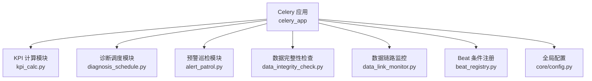
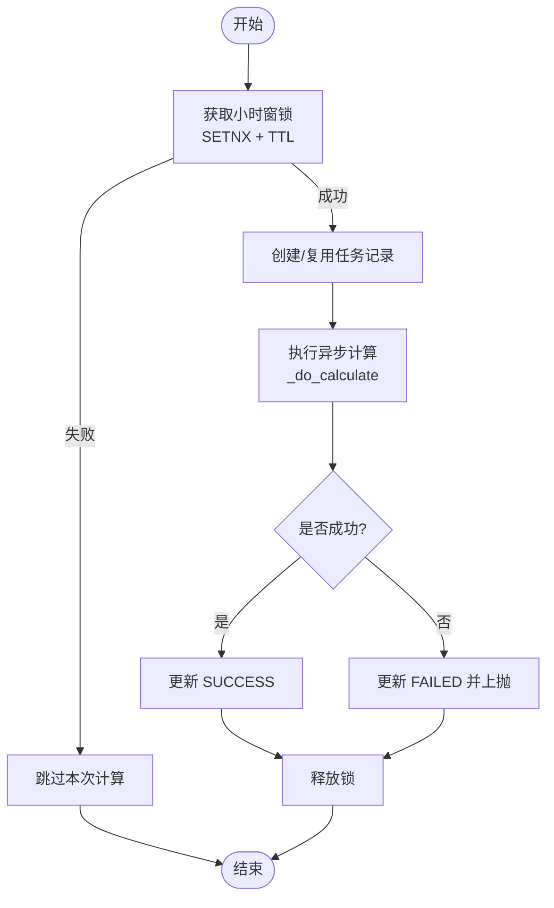
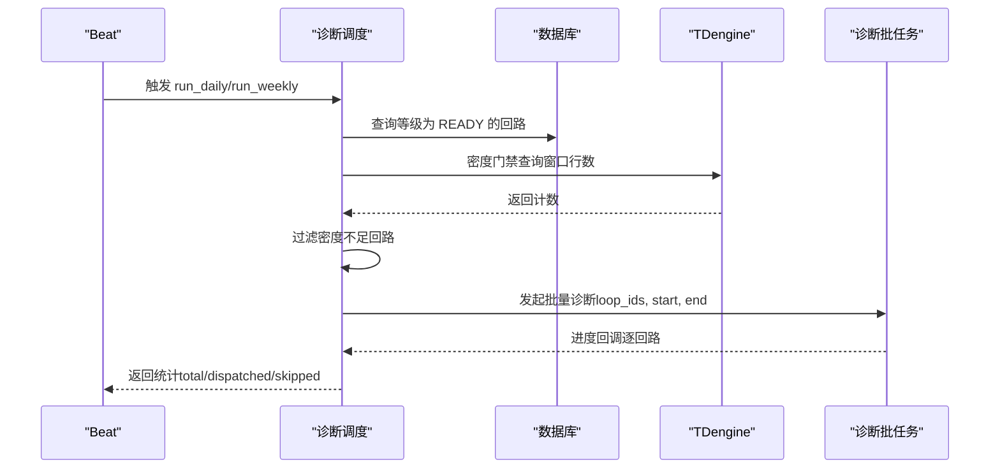
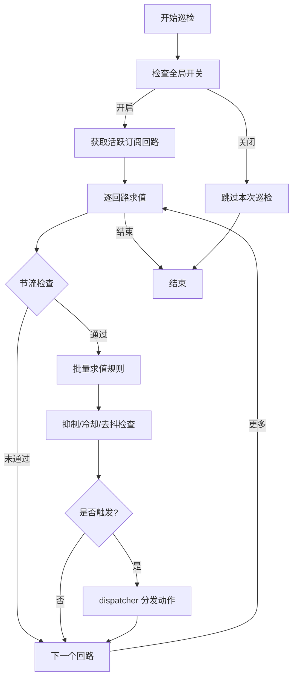
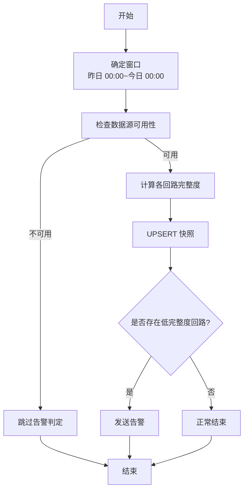
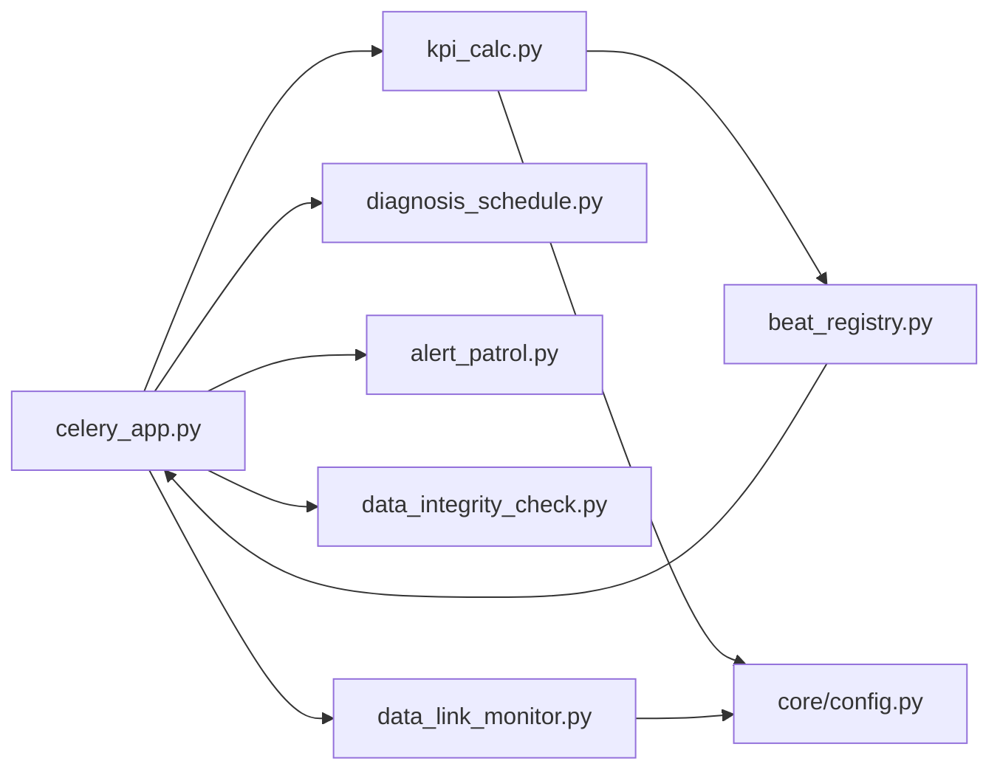

# Celery Beat 定时任务配置

<cite>
**本文引用的文件**
- [backend/app/tasks/celery_app.py](file://backend/app/tasks/celery_app.py)
- [backend/app/tasks/beat_registry.py](file://backend/app/tasks/beat_registry.py)
- [backend/app/tasks/kpi_calc.py](file://backend/app/tasks/kpi_calc.py)
- [backend/app/tasks/diagnosis_schedule.py](file://backend/app/tasks/diagnosis_schedule.py)
- [backend/app/tasks/alert_patrol.py](file://backend/app/tasks/alert_patrol.py)
- [backend/app/tasks/data_integrity_check.py](file://backend/app/tasks/data_integrity_check.py)
- [backend/app/tasks/data_link_monitor.py](file://backend/app/tasks/data_link_monitor.py)
- [backend/app/core/config.py](file://backend/app/core/config.py)
</cite>

## 目录
1. [简介](#简介)
2. [项目结构](#项目结构)
3. [核心组件](#核心组件)
4. [架构总览](#架构总览)
5. [详细组件分析](#详细组件分析)
6. [依赖关系分析](#依赖关系分析)
7. [性能与并发特性](#性能与并发特性)
8. [故障排查指南](#故障排查指南)
9. [结论](#结论)
10. [附录](#附录)

## 简介
本文件面向 CLPM 后端的 Celery Beat 定时任务体系，围绕以下目标提供可操作的配置与运维说明：
- 调度周期设置：KPI 计算任务的执行频率、诊断任务的时间窗口控制、不同业务场景的调度策略。
- 任务依赖关系管理：任务间的先后顺序、条件触发机制、并行执行优化。
- 时间窗控制实现：业务时段限制、节假日处理、动态调整机制。
- 配置版本管理与热更新：配置变更历史、灰度发布策略、回滚方案；运行时修改调度规则、动态调整执行频率、配置验证和回滚。
- 监控告警配置：任务执行失败告警、调度延迟告警、资源使用异常告警。

## 项目结构
Celery Beat 的调度由多个模块分别注册 beat_schedule，并通过统一的应用实例集中管理。关键组织方式如下：
- 应用实例与全局配置：celery_app 初始化 broker/backend、时区、持久化、队列、超时等。
- 各任务模块在 import 阶段将自身 beat 条目追加到 celery_app.conf.beat_schedule。
- beat_init 信号用于在 Beat 启动完成后进行条件化（如按模块启用状态移除条目）与动态重载（如 KPI 计算周期）。



图表来源
- [backend/app/tasks/celery_app.py:24-84](file://backend/app/tasks/celery_app.py#L24-L84)
- [backend/app/tasks/kpi_calc.py:458-484](file://backend/app/tasks/kpi_calc.py#L458-L484)
- [backend/app/tasks/diagnosis_schedule.py:167-182](file://backend/app/tasks/diagnosis_schedule.py#L167-L182)
- [backend/app/tasks/alert_patrol.py:223-242](file://backend/app/tasks/alert_patrol.py#L223-L242)
- [backend/app/tasks/data_integrity_check.py:250-264](file://backend/app/tasks/data_integrity_check.py#L250-L264)
- [backend/app/tasks/data_link_monitor.py:59-87](file://backend/app/tasks/data_link_monitor.py#L59-L87)
- [backend/app/tasks/beat_registry.py:1-84](file://backend/app/tasks/beat_registry.py#L1-L84)
- [backend/app/core/config.py:68-83](file://backend/app/core/config.py#L68-L83)

章节来源
- [backend/app/tasks/celery_app.py:24-84](file://backend/app/tasks/celery_app.py#L24-L84)
- [backend/app/core/config.py:68-83](file://backend/app/core/config.py#L68-L83)

## 核心组件
- Celery 应用与基础能力
  - Broker/Backend：通过 settings.celery_broker_url / settings.celery_result_backend 注入 Redis。
  - 时区与序列化：Asia/Shanghai，JSON 序列化。
  - 可靠性：task_reject_on_worker_lost、task_time_limit/soft_time_limit、PersistentScheduler、dead_letter 队列。
  - Worker 进程治理：worker_max_tasks_per_child 回收子进程，避免内存泄漏。
- Beat 条件注册
  - 基于 enabled_modules 从 DB 读取模块开关，禁用模块对应的 beat 条目（如诊断相关）。
- 任务模块
  - KPI 计算：每小时全量 + 每日/每月聚合；支持通过 EngineRule 动态调整周期并热重载。
  - 诊断调度：分级（1/2/3 级）+ 密度门禁 + 批量任务编排。
  - 预警巡检：周期遍历活跃订阅回路，求值规则并分发动作；周期性清理过期抑制记录。
  - 数据完整性检查：每日检查前 24h 数据完整度，低于阈值发送告警。
  - 数据链路监控：定期检查 TDengine 新鲜度与 AAS 连接；清扫导入任务生命周期。

章节来源
- [backend/app/tasks/celery_app.py:24-84](file://backend/app/tasks/celery_app.py#L24-L84)
- [backend/app/tasks/beat_registry.py:1-84](file://backend/app/tasks/beat_registry.py#L1-L84)
- [backend/app/tasks/kpi_calc.py:458-484](file://backend/app/tasks/kpi_calc.py#L458-L484)
- [backend/app/tasks/diagnosis_schedule.py:1-182](file://backend/app/tasks/diagnosis_schedule.py#L1-L182)
- [backend/app/tasks/alert_patrol.py:1-246](file://backend/app/tasks/alert_patrol.py#L1-L246)
- [backend/app/tasks/data_integrity_check.py:1-267](file://backend/app/tasks/data_integrity_check.py#L1-L267)
- [backend/app/tasks/data_link_monitor.py:1-91](file://backend/app/tasks/data_link_monitor.py#L1-L91)

## 架构总览
下图展示 Beat 启动、任务注册、动态重载与任务执行的总体流程。

```mermaid
sequenceDiagram
participant Beat as "Celery Beat"
participant App as "Celery 应用"
participant Reg as "Beat 条件注册"
participant KPI as "KPI 计算"
participant Diag as "诊断调度"
participant Alert as "预警巡检"
participant Integrity as "数据完整性检查"
participant Link as "数据链路监控"
Beat->>App : 启动并加载 include 模块
App-->>Reg : 触发 beat_init
Reg->>App : 根据 enabled_modules 移除禁用模块的 beat 条目
App-->>KPI : 注册 kpi-calc-hourly/node-kpi-daily/monthly
App-->>Diag : 注册 diagnosis-scheduled-daily/weekly
App-->>Alert : 注册 alert-patrol / cleanup_suppressions
App-->>Integrity : 注册 data-integrity-daily-check
App-->>Link : 注册 data-link-check / import-task-sweep
Note over Beat,App : Beat 启动完成，所有调度条目已就绪
Beat->>KPI : 按 crontab 触发 calculate_hourly_kpi
KPI->>KPI : beat_init 监听 EngineRule 并热重载周期
Beat->>Diag : 按 crontab 触发 run_daily/run_weekly
Beat->>Alert : 按 crontab 触发 run_alert_patrol
Beat->>Integrity : 按 crontab 触发 run_daily_integrity_check
Beat->>Link : 按 crontab 触发 run_data_link_check/sweep_import_tasks
```

图表来源
- [backend/app/tasks/celery_app.py:128-149](file://backend/app/tasks/celery_app.py#L128-L149)
- [backend/app/tasks/beat_registry.py:79-84](file://backend/app/tasks/beat_registry.py#L79-L84)
- [backend/app/tasks/kpi_calc.py:458-484](file://backend/app/tasks/kpi_calc.py#L458-L484)
- [backend/app/tasks/diagnosis_schedule.py:167-182](file://backend/app/tasks/diagnosis_schedule.py#L167-L182)
- [backend/app/tasks/alert_patrol.py:223-242](file://backend/app/tasks/alert_patrol.py#L223-L242)
- [backend/app/tasks/data_integrity_check.py:250-264](file://backend/app/tasks/data_integrity_check.py#L250-L264)
- [backend/app/tasks/data_link_monitor.py:59-87](file://backend/app/tasks/data_link_monitor.py#L59-L87)

## 详细组件分析

### KPI 计算任务（calculate_hourly_kpi）
- 调度周期
  - 默认每小时整点触发（crontab minute=0, hour="*"），同时包含每日 00:05 节点日聚合、每月 1 日 00:10 月聚合。
  - 可通过 EngineRule EVAL_CALC_CYCLE 动态覆盖周期（分钟粒度），并在 beat_init 时从 DB 读取并应用；同时通过 Redis Pub/Sub 频道即时热重载，无需重启 Beat。
- 时间窗控制
  - 同一小时窗口互斥：Redis SETNX 锁（带 TTL），防止手动触发与 Beat 并发执行同一窗口。
  - 窗口解析：支持 ISO 字符串或 datetime，自动处理时区。
- 任务依赖与并行
  - 指标层依赖：Layer2 依赖 Layer1（如 stability_rate 依赖 oscillation_rate）。
  - 批处理并发：使用 asyncio.Semaphore 控制数据库会话与 I/O 并发，避免资源争用。
- 失败重试与幂等
  - 自动重试 3 次，指数退避；结果 UPSERT 保证幂等。
- 监控与告警
  - 失败进入 dead_letter 队列；任务跟踪记录 STAGE/进度/终态。



图表来源
- [backend/app/tasks/kpi_calc.py:128-170](file://backend/app/tasks/kpi_calc.py#L128-L170)
- [backend/app/tasks/kpi_calc.py:182-288](file://backend/app/tasks/kpi_calc.py#L182-L288)
- [backend/app/tasks/kpi_calc.py:458-484](file://backend/app/tasks/kpi_calc.py#L458-L484)
- [backend/app/tasks/kpi_calc.py:498-588](file://backend/app/tasks/kpi_calc.py#L498-L588)

章节来源
- [backend/app/tasks/kpi_calc.py:128-170](file://backend/app/tasks/kpi_calc.py#L128-L170)
- [backend/app/tasks/kpi_calc.py:182-288](file://backend/app/tasks/kpi_calc.py#L182-L288)
- [backend/app/tasks/kpi_calc.py:458-484](file://backend/app/tasks/kpi_calc.py#L458-L484)
- [backend/app/tasks/kpi_calc.py:498-588](file://backend/app/tasks/kpi_calc.py#L498-L588)

### 诊断任务（diagnosis_schedule）
- 调度策略
  - 1 级关键回路：每日 01:10，近 24h 窗口。
  - 2 级重要回路：每周日 02:10，近 7d 窗口。
  - 3 级一般：不排程（仅事件/手动）。
- 时间窗与密度门禁
  - 密度门禁：窗口行数 < 预期 50% 则跳过该回路，避免无效计算。
  - 窗口选择：end = now_naive，start = end - window。
- 任务编排
  - 批量建任务（TaskTracker），调用 run_diagnosis_batch 执行，逐回路进度回调。
- 条件触发
  - triggered_by=scheduler-grade{N}，trigger_type=SCHEDULED。



图表来源
- [backend/app/tasks/diagnosis_schedule.py:75-152](file://backend/app/tasks/diagnosis_schedule.py#L75-L152)
- [backend/app/tasks/diagnosis_schedule.py:155-182](file://backend/app/tasks/diagnosis_schedule.py#L155-L182)

章节来源
- [backend/app/tasks/diagnosis_schedule.py:1-182](file://backend/app/tasks/diagnosis_schedule.py#L1-L182)

### 预警巡检（alert_patrol）
- 调度周期
  - 每 1 分钟遍历活跃订阅回路，求值规则并触发动作。
  - 每小时清理过期手动抑制记录。
- 求值流程
  - 全局开关 → 节流（5s/回路）→ 取最新可信度等级 → 批量求值 → 抑制/冷却/去抖 → dispatcher 分发。
- 告警与抑制
  - 手动抑制记录持久化，周期性清理；冷却期与持续时长检查减少重复告警。



图表来源
- [backend/app/tasks/alert_patrol.py:64-128](file://backend/app/tasks/alert_patrol.py#L64-L128)
- [backend/app/tasks/alert_patrol.py:131-170](file://backend/app/tasks/alert_patrol.py#L131-L170)
- [backend/app/tasks/alert_patrol.py:223-242](file://backend/app/tasks/alert_patrol.py#L223-L242)

章节来源
- [backend/app/tasks/alert_patrol.py:1-246](file://backend/app/tasks/alert_patrol.py#L1-L246)

### 数据完整性检查（data_integrity_check）
- 调度周期
  - 每日 02:00 检查前 24h（昨日 00:00 ~ 今日 00:00）本地 TDengine 数据完整性。
- 阈值与告警
  - PV 完整度 < 95% 的回路发送告警；整体不可用时跳过判定。
- 快照持久化
  - 每回路每日一条 UPSERT，便于前端展示与趋势分析。



图表来源
- [backend/app/tasks/data_integrity_check.py:45-247](file://backend/app/tasks/data_integrity_check.py#L45-L247)
- [backend/app/tasks/data_integrity_check.py:250-264](file://backend/app/tasks/data_integrity_check.py#L250-L264)

章节来源
- [backend/app/tasks/data_integrity_check.py:1-267](file://backend/app/tasks/data_integrity_check.py#L1-L267)

### 数据链路监控（data_link_monitor）
- 调度周期
  - 数据链路检查：每 DATA_LINK_CHECK_INTERVAL_MINUTES 分钟（配置项）执行；若 ≥60 则每分钟一次。
  - 导入任务清扫：每 15 分钟清扫超时 RUNNING 导入任务 + 修剪过期索引。
- 功能
  - 检查 TDengine 新鲜度与 AAS 连接状态，异常时经 alerting 发送告警。

章节来源
- [backend/app/tasks/data_link_monitor.py:1-91](file://backend/app/tasks/data_link_monitor.py#L1-L91)

## 依赖关系分析
- 模块耦合
  - celery_app 作为中心，被各任务模块 import 并追加 beat_schedule。
  - beat_registry 在 beat_init 中读取 enabled_modules，条件化移除诊断相关条目。
  - kpi_calc 在 beat_init 中读取 EngineRule 并热重载周期，同时启动 Redis Pub/Sub 监听线程。
- 外部依赖
  - Redis：Broker/Backend、Pub/Sub、分布式锁、结果后端。
  - PostgreSQL/TDengine：元数据与历史数据。
  - Alerting：告警 Webhook。



图表来源
- [backend/app/tasks/celery_app.py:24-84](file://backend/app/tasks/celery_app.py#L24-L84)
- [backend/app/tasks/beat_registry.py:1-84](file://backend/app/tasks/beat_registry.py#L1-L84)
- [backend/app/tasks/kpi_calc.py:458-484](file://backend/app/tasks/kpi_calc.py#L458-L484)
- [backend/app/tasks/data_link_monitor.py:59-87](file://backend/app/tasks/data_link_monitor.py#L59-L87)
- [backend/app/core/config.py:68-83](file://backend/app/core/config.py#L68-L83)

章节来源
- [backend/app/tasks/celery_app.py:24-84](file://backend/app/tasks/celery_app.py#L24-L84)
- [backend/app/tasks/beat_registry.py:1-84](file://backend/app/tasks/beat_registry.py#L1-L84)
- [backend/app/tasks/kpi_calc.py:458-484](file://backend/app/tasks/kpi_calc.py#L458-L484)
- [backend/app/tasks/data_link_monitor.py:59-87](file://backend/app/tasks/data_link_monitor.py#L59-L87)
- [backend/app/core/config.py:68-83](file://backend/app/core/config.py#L68-L83)

## 性能与并发特性
- 任务超时保护
  - 硬超时 1800s，软超时 1500s，避免长驻任务占用资源。
- Worker 进程治理
  - worker_max_tasks_per_child=50，定期重建子进程，抑制内存只增不减。
- 可见性超时
  - broker_transport_options.visibility_timeout=9000s，避免长耗时任务被误重投。
- 结果保留
  - result_expires=7 天，避免结果堆积。
- 并发控制
  - KPI 批处理使用 asyncio.Semaphore 控制并发；预热阶段也限制并发，避免数据库连接耗尽。

章节来源
- [backend/app/tasks/celery_app.py:48-84](file://backend/app/tasks/celery_app.py#L48-L84)
- [backend/app/tasks/kpi_calc.py:623-763](file://backend/app/tasks/kpi_calc.py#L623-L763)

## 故障排查指南
- 任务最终失败
  - AsyncTask.on_failure 将耗尽重试的任务发送到 dead_letter 队列，便于定位问题。
- 小时窗冲突
  - 同一小时窗口已有评估任务在执行会跳过本次计算，并记录原因。
- 数据源不可用
  - 数据完整性检查在 TDengine 不可用时跳过告警判定，避免误导。
- 配置热重载失败
  - beat_registry 与 kpi_calc 的热重载逻辑均捕获异常并记录日志，保持当前调度不变。

章节来源
- [backend/app/tasks/celery_app.py:90-125](file://backend/app/tasks/celery_app.py#L90-L125)
- [backend/app/tasks/kpi_calc.py:182-288](file://backend/app/tasks/kpi_calc.py#L182-L288)
- [backend/app/tasks/data_integrity_check.py:173-186](file://backend/app/tasks/data_integrity_check.py#L173-L186)
- [backend/app/tasks/beat_registry.py:69-77](file://backend/app/tasks/beat_registry.py#L69-L77)

## 结论
本系统通过 Celery Beat 实现了多模块、多周期的定时任务编排，具备：
- 灵活的调度周期：KPI 可按 EngineRule 动态调整，诊断按重要性分级排程。
- 可靠的任务执行：超时保护、死信队列、结果保留、进程治理。
- 强一致的时间窗控制：分布式锁、密度门禁、窗口闭合。
- 可观测性与告警：巡检、完整性检查、链路监控与告警集成。
- 热更新能力：Beat 启动后仍可动态重载调度规则，无需重启服务。

## 附录
- 配置项参考（部分）
  - CELERY_BROKER_URL / CELERY_RESULT_BACKEND：消息代理与结果后端地址。
  - DATA_LINK_CHECK_INTERVAL_MINUTES：数据链路检查间隔（分钟）。
  - ALERT_WEBHOOK_URL：告警 Webhook 地址。
- 常用调度条目
  - kpi-calc-hourly：每小时 KPI 计算。
  - node-kpi-daily / node-kpi-monthly：节点级日/月聚合。
  - diagnosis-scheduled-daily / weekly：分级诊断调度。
  - alert-patrol / cleanup_suppressions：预警巡检与抑制清理。
  - data-integrity-daily-check：数据完整性检查。
  - data-link-check / import-task-sweep：数据链路监控与导入任务清扫。

章节来源
- [backend/app/core/config.py:68-139](file://backend/app/core/config.py#L68-L139)
- [backend/app/tasks/kpi_calc.py:458-484](file://backend/app/tasks/kpi_calc.py#L458-L484)
- [backend/app/tasks/diagnosis_schedule.py:167-182](file://backend/app/tasks/diagnosis_schedule.py#L167-L182)
- [backend/app/tasks/alert_patrol.py:223-242](file://backend/app/tasks/alert_patrol.py#L223-L242)
- [backend/app/tasks/data_integrity_check.py:250-264](file://backend/app/tasks/data_integrity_check.py#L250-L264)
- [backend/app/tasks/data_link_monitor.py:59-87](file://backend/app/tasks/data_link_monitor.py#L59-L87)