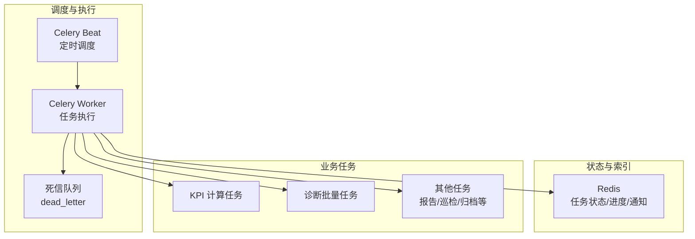
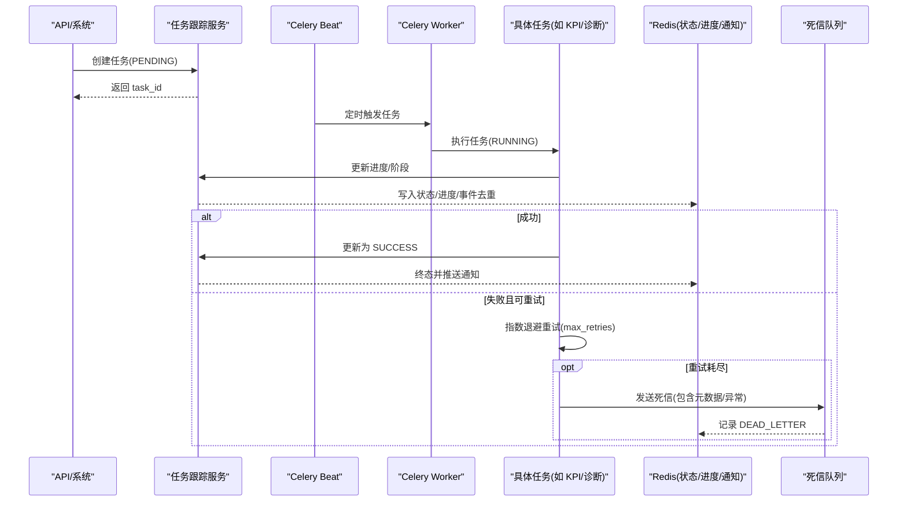
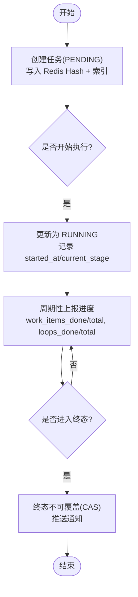
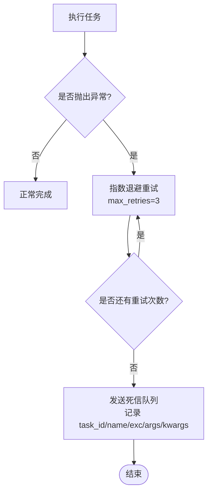
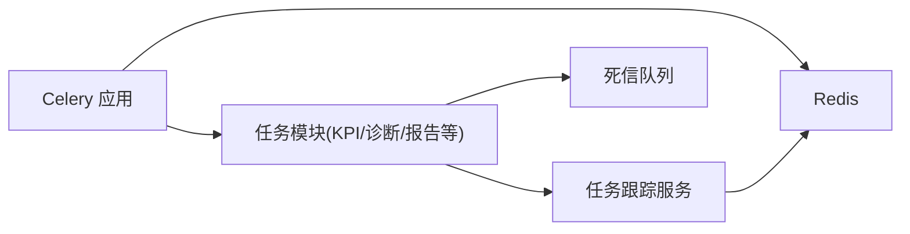

# 任务生命周期管理

<cite>
**本文引用的文件**
- [backend/app/tasks/celery_app.py](file://backend/app/tasks/celery_app.py)
- [backend/app/schemas/task.py](file://backend/app/schemas/task.py)
- [backend/app/services/task_tracker.py](file://backend/app/services/task_tracker.py)
- [backend/app/tasks/dead_letter.py](file://backend/app/tasks/dead_letter.py)
- [backend/app/tasks/kpi_calc.py](file://backend/app/tasks/kpi_calc.py)
- [backend/app/tasks/diagnosis_v2.py](file://backend/app/tasks/diagnosis_v2.py)
- [backend/app/core/logging.py](file://backend/app/core/logging.py)
</cite>

## 目录
1. [简介](#简介)
2. [项目结构](#项目结构)
3. [核心组件](#核心组件)
4. [架构总览](#架构总览)
5. [详细组件分析](#详细组件分析)
6. [依赖关系分析](#依赖关系分析)
7. [性能考量](#性能考量)
8. [故障排查指南](#故障排查指南)
9. [结论](#结论)
10. [附录](#附录)

## 简介
本文件围绕“任务生命周期管理”进行系统化说明，覆盖以下关键主题：
- 任务状态跟踪机制：从创建到完成的完整生命周期、状态转换规则、状态持久化策略。
- 执行日志记录：结构化存储、关键节点记录、错误堆栈捕获。
- 失败重试策略：重试次数限制、指数退避算法、死信队列处理。
- 任务超时处理：执行时间监控、超时自动终止、资源清理机制。
- 任务优先级管理：高优先级插队、资源抢占策略、公平调度算法（基于现有实现与可扩展建议）。
- 任务取消机制：主动取消、优雅停止、部分执行结果处理（基于现有实现与可扩展建议）。

## 项目结构
后端通过 Celery 作为异步任务框架，结合 Redis 作为消息代理与结果后端；任务状态与进度统一由任务跟踪服务维护在 Redis Hash/Sorted Set/List 中；失败任务进入死信队列；Beat 负责定时调度；结构化日志输出 JSON 便于采集。

**图表来源**
- [backend/app/tasks/celery_app.py:24-84](file://backend/app/tasks/celery_app.py#L24-L84)
- [backend/app/services/task_tracker.py:14-41](file://backend/app/services/task_tracker.py#L14-L41)
- [backend/app/tasks/dead_letter.py:1-40](file://backend/app/tasks/dead_letter.py#L1-L40)

**章节来源**
- [backend/app/tasks/celery_app.py:24-84](file://backend/app/tasks/celery_app.py#L24-L84)
- [backend/app/services/task_tracker.py:14-41](file://backend/app/services/task_tracker.py#L14-L41)

## 核心组件
- 任务定义与状态机：任务类型、状态枚举、请求/响应模型。
- 任务跟踪服务：任务创建、状态更新、进度上报、通知推送、并发控制（Lua 脚本）。
- Celery 应用与基础任务基类：Broker/Backend、超时保护、Worker 崩溃重投、死信队列集成。
- 具体任务实现：KPI 计算、诊断批量任务等，均接入任务跟踪与重试/超时策略。
- 结构化日志：JSON 输出、敏感信息脱敏、异常堆栈捕获。

**章节来源**
- [backend/app/schemas/task.py:28-63](file://backend/app/schemas/task.py#L28-L63)
- [backend/app/services/task_tracker.py:310-384](file://backend/app/services/task_tracker.py#L310-L384)
- [backend/app/tasks/celery_app.py:90-125](file://backend/app/tasks/celery_app.py#L90-L125)
- [backend/app/core/logging.py:69-96](file://backend/app/core/logging.py#L69-L96)

## 架构总览
下图展示任务从创建、调度、执行、状态更新到最终完成或失败的端到端流程，以及失败重试与死信队列的衔接。

**图表来源**
- [backend/app/tasks/celery_app.py:48-84](file://backend/app/tasks/celery_app.py#L48-L84)
- [backend/app/tasks/celery_app.py:90-125](file://backend/app/tasks/celery_app.py#L90-L125)
- [backend/app/services/task_tracker.py:561-651](file://backend/app/services/task_tracker.py#L561-L651)
- [backend/app/tasks/dead_letter.py:17-39](file://backend/app/tasks/dead_letter.py#L17-L39)

## 详细组件分析

### 任务状态跟踪机制
- 生命周期：PENDING → RUNNING → SUCCESS/FAILED/CANCELLED。
- 持久化：任务状态与进度存储在 Redis Hash（key: task:{task_id}），索引使用 Sorted Set（key: task:index，score=创建时间戳）。
- 状态更新：通过 Lua 脚本 CAS 保证终态不可覆盖，进度字段单调递增，避免竞态。
- 通知：进入终态时向用户通知列表（task:notifications:{user_id}）推送消息，限制保留条数。

**图表来源**
- [backend/app/services/task_tracker.py:42-71](file://backend/app/services/task_tracker.py#L42-L71)
- [backend/app/services/task_tracker.py:310-384](file://backend/app/services/task_tracker.py#L310-L384)
- [backend/app/services/task_tracker.py:561-651](file://backend/app/services/task_tracker.py#L561-L651)
- [backend/app/services/task_tracker.py:712-753](file://backend/app/services/task_tracker.py#L712-L753)

**章节来源**
- [backend/app/schemas/task.py:28-63](file://backend/app/schemas/task.py#L28-L63)
- [backend/app/services/task_tracker.py:14-41](file://backend/app/services/task_tracker.py#L14-L41)
- [backend/app/services/task_tracker.py:561-651](file://backend/app/services/task_tracker.py#L561-L651)

### 执行日志记录
- 结构化日志：默认输出 JSON，便于外部管道采集；DEBUG 模式输出人类可读行。
- 敏感信息脱敏：对 password/token/Bearer/JWT 等进行替换。
- 异常堆栈：记录 exc_info，便于定位问题。
- 任务关键节点：任务创建、状态变更、重试、失败、死信等均有日志落盘。

**章节来源**
- [backend/app/core/logging.py:69-96](file://backend/app/core/logging.py#L69-L96)
- [backend/app/core/logging.py:117-145](file://backend/app/core/logging.py#L117-L145)
- [backend/app/tasks/celery_app.py:109-125](file://backend/app/tasks/celery_app.py#L109-L125)
- [backend/app/tasks/dead_letter.py:26-33](file://backend/app/tasks/dead_letter.py#L26-L33)

### 失败重试策略
- 重试配置：任务装饰器启用 autoretry_for=(Exception,)，max_retries=3，countdown=60，retry_backoff=True，retry_backoff_max=600，retry_jitter=True。
- 指数退避：每次重试等待时间按指数增长，上限 600s，加入抖动避免集中重试。
- 死信队列：当重试耗尽后，AsyncTask.on_failure 将任务元数据发送到 dead_letter 队列，独立 worker 消费并记录。

**图表来源**
- [backend/app/tasks/kpi_calc.py:128-137](file://backend/app/tasks/kpi_calc.py#L128-L137)
- [backend/app/tasks/diagnosis_v2.py:28-37](file://backend/app/tasks/diagnosis_v2.py#L28-L37)
- [backend/app/tasks/celery_app.py:90-125](file://backend/app/tasks/celery_app.py#L90-L125)
- [backend/app/tasks/dead_letter.py:17-39](file://backend/app/tasks/dead_letter.py#L17-L39)

**章节来源**
- [backend/app/tasks/kpi_calc.py:128-137](file://backend/app/tasks/kpi_calc.py#L128-L137)
- [backend/app/tasks/diagnosis_v2.py:28-37](file://backend/app/tasks/diagnosis_v2.py#L28-L37)
- [backend/app/tasks/celery_app.py:90-125](file://backend/app/tasks/celery_app.py#L90-L125)
- [backend/app/tasks/dead_letter.py:17-39](file://backend/app/tasks/dead_letter.py#L17-L39)

### 任务超时处理
- 全局超时：Celery 配置 task_time_limit=1800s（硬超时）、task_soft_time_limit=1500s（软超时）。
- Broker 可见性超时：visibility_timeout=9000s，避免长耗时任务被 broker 误判丢失并重投。
- 结果过期：result_expires=7 天，避免结果堆积。
- 资源清理：Worker 子进程每处理 50 个任务后重建，抑制内存泄漏；父进程看门狗确保宿主崩溃时级联退出。

**章节来源**
- [backend/app/tasks/celery_app.py:48-84](file://backend/app/tasks/celery_app.py#L48-L84)
- [backend/app/tasks/celery_app.py:211-251](file://backend/app/tasks/celery_app.py#L211-L251)

### 任务优先级管理
- 当前实现：未显式实现多队列优先级调度；所有任务默认投递到 default 队列。
- 可扩展建议：
  - 多队列隔离：为高优先级任务定义专用队列（如 high_priority），并通过路由键区分。
  - 资源抢占：启动多个 worker 分别监听不同队列，优先保障高优先级任务消费。
  - 公平调度：在同一队列内通过 worker_prefetch_multiplier=1 减少预取，提升吞吐与公平性。

**章节来源**
- [backend/app/tasks/celery_app.py:48-84](file://backend/app/tasks/celery_app.py#L48-L84)

### 任务取消机制
- 当前实现：状态机支持 CANCELLED 终态；任务跟踪服务允许更新为终态并推送通知。
- 可扩展建议：
  - 主动取消：API 层调用 update_status(task_id, CANCELLED)，并在任务内部检查取消标志位以提前退出。
  - 优雅停止：在任务执行循环中定期检查取消状态，释放中间资源（数据库事务、临时文件等）。
  - 部分结果：对于批处理任务，已完成的子项结果应持久化，取消时仅标记整体为 CANCELLED。

**章节来源**
- [backend/app/schemas/task.py:48-63](file://backend/app/schemas/task.py#L48-L63)
- [backend/app/services/task_tracker.py:561-651](file://backend/app/services/task_tracker.py#L561-L651)

## 依赖关系分析
- Celery 应用依赖 Redis 作为 Broker/Backend，注册任务模块，配置超时、队列、结果过期等。
- 任务跟踪服务依赖 Redis 提供原子操作（Lua 脚本）保证状态一致性与进度单调性。
- 具体任务（KPI/诊断）依赖任务跟踪服务进行状态/进度更新，并遵循重试/超时策略。
- 死信队列作为失败任务的兜底，独立 worker 消费并记录。

**图表来源**
- [backend/app/tasks/celery_app.py:24-84](file://backend/app/tasks/celery_app.py#L24-L84)
- [backend/app/services/task_tracker.py:14-41](file://backend/app/services/task_tracker.py#L14-L41)
- [backend/app/tasks/dead_letter.py:1-40](file://backend/app/tasks/dead_letter.py#L1-L40)

**章节来源**
- [backend/app/tasks/celery_app.py:24-84](file://backend/app/tasks/celery_app.py#L24-L84)
- [backend/app/services/task_tracker.py:14-41](file://backend/app/services/task_tracker.py#L14-L41)

## 性能考量
- 并发控制：KPI 计算使用 asyncio.Semaphore 限制数据库连接与并发度，避免过载。
- 缓存预热：支持 L1/L2 缓存预热，减少重复 I/O。
- 结果过期：Redis 结果 7 天过期，配合清扫周期避免堆积。
- Worker 回收：每 50 个任务重建子进程，抑制内存只增不减。
- 锁机制：小时窗口互斥锁（SETNX + TTL）防止同一时间窗重复计算。

**章节来源**
- [backend/app/tasks/kpi_calc.py:63-66](file://backend/app/tasks/kpi_calc.py#L63-L66)
- [backend/app/tasks/kpi_calc.py:182-197](file://backend/app/tasks/kpi_calc.py#L182-L197)
- [backend/app/tasks/celery_app.py:77-84](file://backend/app/tasks/celery_app.py#L77-L84)

## 故障排查指南
- 查看死信队列：独立 worker 消费 dead_letter 队列，记录失败任务元数据与异常。
- 检查任务状态：通过任务跟踪服务查询 Redis Hash，确认状态、进度、错误信息。
- 日志分析：结构化 JSON 日志包含 request_id、exc_info，便于链路追踪。
- 常见错误：
  - 任务被跳过：同一小时窗口已有任务在执行（锁冲突）。
  - 重试耗尽：进入死信队列，需检查异常原因与依赖服务可用性。
  - 超时中断：检查 task_time_limit 与 visibility_timeout 配置是否合理。

**章节来源**
- [backend/app/tasks/dead_letter.py:17-39](file://backend/app/tasks/dead_letter.py#L17-L39)
- [backend/app/tasks/kpi_calc.py:216-234](file://backend/app/tasks/kpi_calc.py#L216-L234)
- [backend/app/core/logging.py:69-96](file://backend/app/core/logging.py#L69-L96)

## 结论
本系统通过 Celery + Redis 构建了健壮的任务生命周期管理机制：明确的状态机、原子化的进度更新、完善的重试与死信处理、合理的超时与资源回收策略。在此基础上，可进一步扩展优先级调度与取消机制，以满足更复杂的业务需求。

## 附录
- 任务类型：STANDARD、CUSTOM、BACKFILL、TUNING、REPORT、DIAGNOSIS。
- 任务状态：PENDING、RUNNING、SUCCESS、FAILED、CANCELLED。
- 关键配置：time_limit、soft_time_limit、visibility_timeout、result_expires、worker_max_tasks_per_child。

**章节来源**
- [backend/app/schemas/task.py:28-63](file://backend/app/schemas/task.py#L28-L63)
- [backend/app/tasks/celery_app.py:48-84](file://backend/app/tasks/celery_app.py#L48-L84)