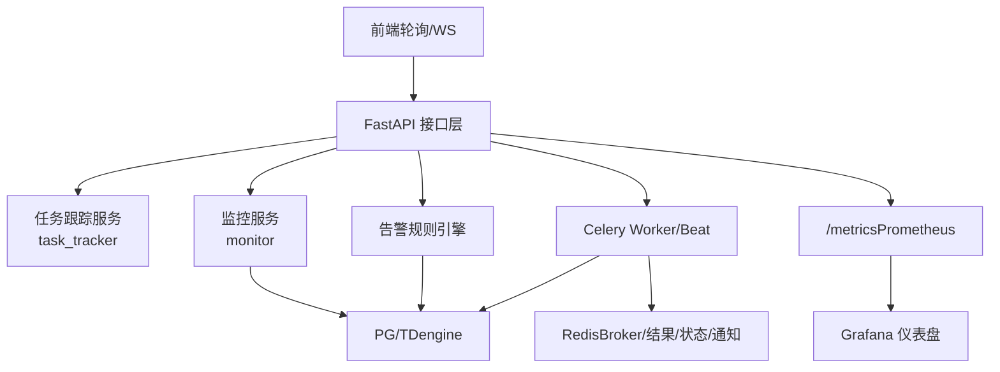
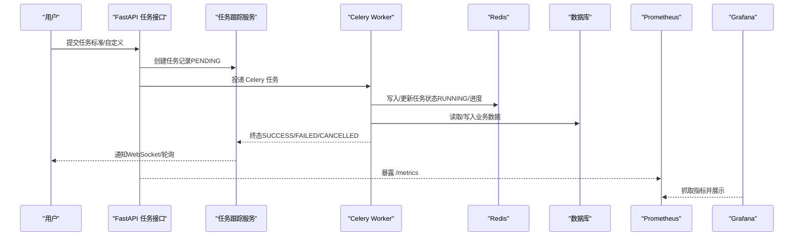
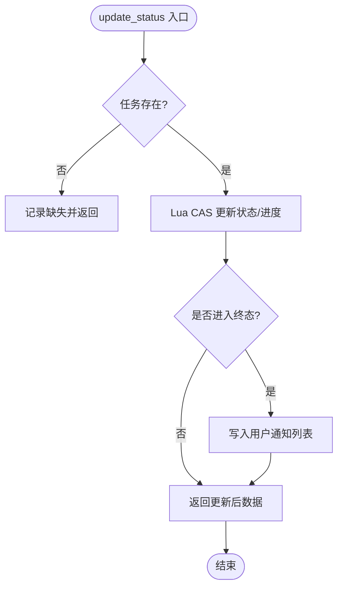
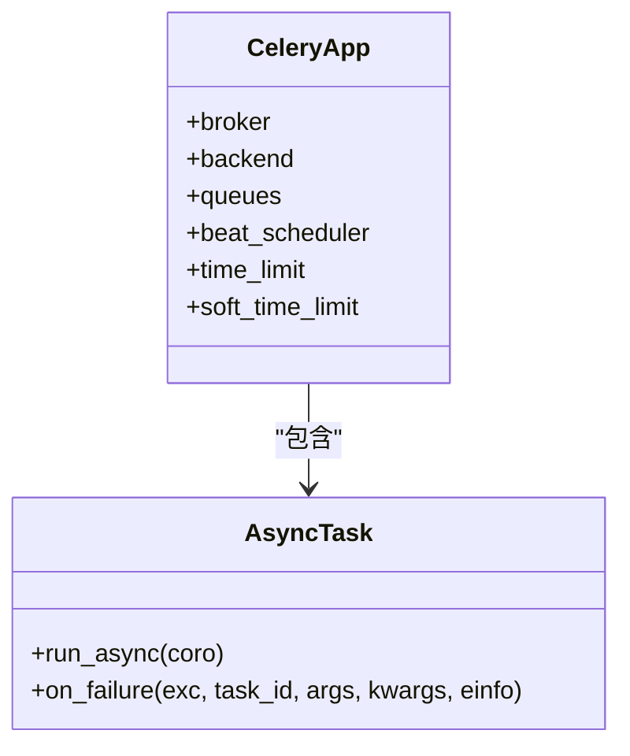
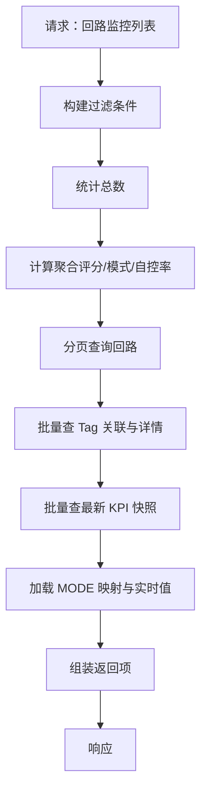
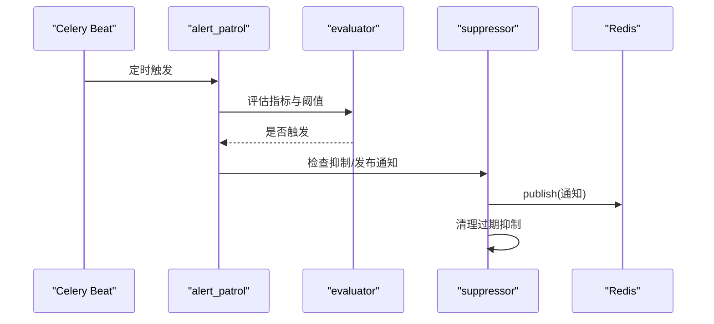
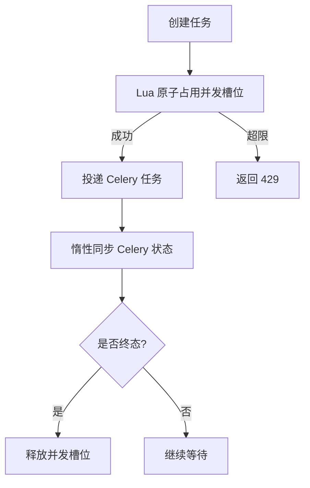
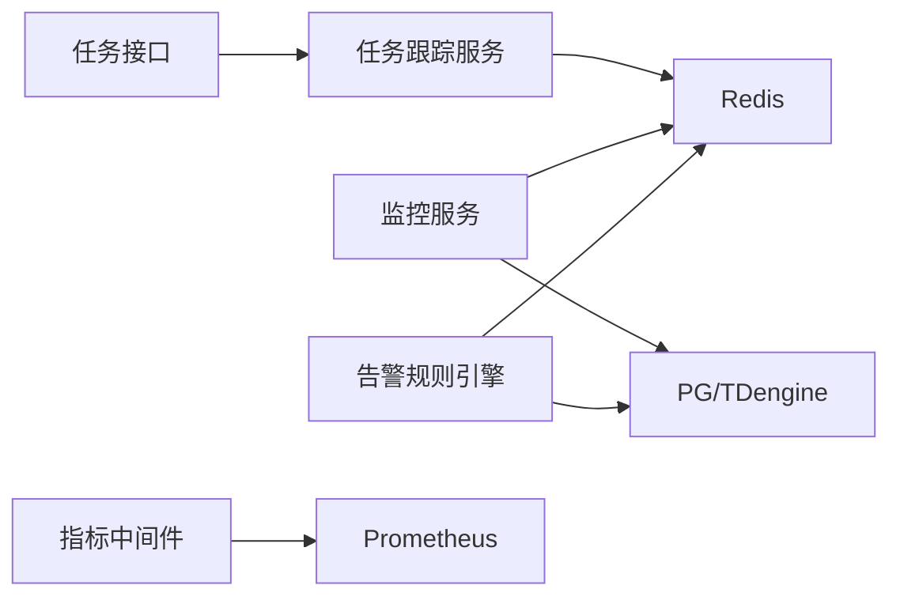

# 任务监控与调试

<cite>
**本文引用的文件**
- [backend/app/tasks/celery_app.py](file://backend/app/tasks/celery_app.py)
- [backend/app/services/task_tracker.py](file://backend/app/services/task_tracker.py)
- [backend/app/api/v1/endpoints/tasks.py](file://backend/app/api/v1/endpoints/tasks.py)
- [backend/app/core/logging.py](file://backend/app/core/logging.py)
- [backend/app/core/metrics.py](file://backend/app/core/metrics.py)
- [backend/app/api/v1/endpoints/monitor.py](file://backend/app/api/v1/endpoints/monitor.py)
- [backend/app/services/monitor.py](file://backend/app/services/monitor.py)
- [backend/app/services/alert_rule_engine/evaluator.py](file://backend/app/services/alert_rule_engine/evaluator.py)
- [backend/app/services/alert_rule_engine/suppressor.py](file://backend/app/services/alert_rule_engine/suppressor.py)
- [backend/app/tasks/alert_patrol.py](file://backend/app/tasks/alert_patrol.py)
- [deploy/grafana/dashboards/clpm-overview.json](file://deploy/grafana/dashboards/clpm-overview.json)
- [deploy/prometheus/alerts.yml](file://deploy/prometheus/alerts.yml)
- [frontend/apps/web-antd/src/constants/polling.ts](file://frontend/apps/web-antd/src/constants/polling.ts)
- [e2e/tests/diagnosis-tracker-flow.spec.ts](file://e2e/tests/diagnosis-tracker-flow.spec.ts)
</cite>

## 目录
1. [简介](#简介)
2. [项目结构](#项目结构)
3. [核心组件](#核心组件)
4. [架构总览](#架构总览)
5. [详细组件分析](#详细组件分析)
6. [依赖关系分析](#依赖关系分析)
7. [性能考量](#性能考量)
8. [故障排查指南](#故障排查指南)
9. [结论](#结论)
10. [附录](#附录)

## 简介
本文件面向“任务监控与调试”主题，覆盖以下能力：
- 实时状态查看：任务执行进度、队列长度统计、Worker 健康检查。
- 执行性能分析：任务耗时分析、瓶颈识别、性能基准测试。
- 问题诊断工具：错误日志聚合、堆栈跟踪分析、依赖关系排查。
- 告警机制配置：任务失败告警、性能降级告警、资源耗尽告警。
- 调试模式支持：本地开发调试、断点调试、模拟执行环境。
- 可视化监控界面：任务执行看板、性能趋势图、告警事件列表。
- 日志管理策略：日志级别控制、日志轮转、远程日志收集。

## 项目结构
后端以 FastAPI 提供 API，Celery + Redis 作为异步任务与消息中间件；Prometheus/Grafana 用于指标采集与可视化；Redis 承担任务状态、通知与部分缓存；TDengine/PostgreSQL 承载时序与业务数据。前端通过轮询与 WebSocket 获取任务与关注事件。

图表来源
- [backend/app/api/v1/endpoints/tasks.py:1-800](file://backend/app/api/v1/endpoints/tasks.py#L1-L800)
- [backend/app/services/task_tracker.py:1-800](file://backend/app/services/task_tracker.py#L1-L800)
- [backend/app/core/metrics.py:1-163](file://backend/app/core/metrics.py#L1-L163)
- [backend/app/tasks/celery_app.py:1-251](file://backend/app/tasks/celery_app.py#L1-L251)
- [deploy/grafana/dashboards/clpm-overview.json:1-368](file://deploy/grafana/dashboards/clpm-overview.json#L1-L368)

章节来源
- [backend/app/api/v1/endpoints/tasks.py:1-800](file://backend/app/api/v1/endpoints/tasks.py#L1-L800)
- [backend/app/services/task_tracker.py:1-800](file://backend/app/services/task_tracker.py#L1-L800)
- [backend/app/core/metrics.py:1-163](file://backend/app/core/metrics.py#L1-L163)
- [backend/app/tasks/celery_app.py:1-251](file://backend/app/tasks/celery_app.py#L1-L251)
- [deploy/grafana/dashboards/clpm-overview.json:1-368](file://deploy/grafana/dashboards/clpm-overview.json#L1-L368)

## 核心组件
- 任务跟踪服务：基于 Redis Hash/Sorted Set/Lua 实现任务创建、状态更新、并发槽位控制、通知推送与超时清扫。
- Celery 应用：定义队列、死信、持久化 Beat、任务超时保护、子进程预载配置与健康看门狗。
- 监控服务：回路监控列表与详情、趋势数据、质量码、评分与模式分布等。
- 告警规则引擎：指标取值、新鲜度校验、阈值比较、抑制与通知发布。
- 指标与日志：Prometheus 指标采集与 /metrics 访问控制；结构化 JSON 日志与敏感信息脱敏。
- 前端轮询：统一的任务与进度轮询间隔常量，保障体验与后端压力平衡。

章节来源
- [backend/app/services/task_tracker.py:1-800](file://backend/app/services/task_tracker.py#L1-L800)
- [backend/app/tasks/celery_app.py:1-251](file://backend/app/tasks/celery_app.py#L1-L251)
- [backend/app/services/monitor.py:1-800](file://backend/app/services/monitor.py#L1-L800)
- [backend/app/services/alert_rule_engine/evaluator.py:505-538](file://backend/app/services/alert_rule_engine/evaluator.py#L505-L538)
- [backend/app/core/logging.py:1-151](file://backend/app/core/logging.py#L1-L151)
- [backend/app/core/metrics.py:1-163](file://backend/app/core/metrics.py#L1-L163)
- [frontend/apps/web-antd/src/constants/polling.ts:1-22](file://frontend/apps/web-antd/src/constants/polling.ts#L1-L22)

## 架构总览
下图展示从触发任务到完成通知的端到端流程，以及监控与告警的观测面。

图表来源
- [backend/app/api/v1/endpoints/tasks.py:686-800](file://backend/app/api/v1/endpoints/tasks.py#L686-L800)
- [backend/app/services/task_tracker.py:310-651](file://backend/app/services/task_tracker.py#L310-L651)
- [backend/app/core/metrics.py:95-151](file://backend/app/core/metrics.py#L95-L151)
- [backend/app/tasks/celery_app.py:24-84](file://backend/app/tasks/celery_app.py#L24-L84)

## 详细组件分析

### 任务跟踪服务（task_tracker）
- 功能要点
  - 使用 Redis Hash 存储任务字段，Sorted Set 维护任务索引（按创建时间排序）。
  - 使用 Lua 脚本实现 CAS 更新、回填进度去重计数、批量任务抢占/释放等原子操作。
  - 进入终态时自动向用户通知列表写入通知，限制最大条数。
  - 提供活跃任务统计、通知查询与已读标记。
- 关键路径
  - 创建任务：生成 task_id，写入 Redis Hash 与索引。
  - 更新状态：CAS 防止终态被覆盖，单调递增进度字段。
  - 通知：仅非系统任务且进入终态时发送。
  - 清扫：惰性触发 RUNNING 超时清扫，置 FAILED 并释放并发槽位。

图表来源
- [backend/app/services/task_tracker.py:42-71](file://backend/app/services/task_tracker.py#L42-L71)
- [backend/app/services/task_tracker.py:561-651](file://backend/app/services/task_tracker.py#L561-L651)
- [backend/app/services/task_tracker.py:712-753](file://backend/app/services/task_tracker.py#L712-L753)

章节来源
- [backend/app/services/task_tracker.py:1-800](file://backend/app/services/task_tracker.py#L1-L800)

### Celery 应用与任务治理
- 功能要点
  - 配置 Broker/Backend、队列（含 dead_letter）、持久化 Beat、任务超时保护、结果过期策略、worker 子进程回收。
  - 自定义基类任务在最终失败时投递至死信队列，便于集中排查。
  - worker_process_init 中预加载数据源配置、算法参数、可信度阈值等，避免冷启动或子进程重启导致配置丢失。
  - 安装父进程看门狗，防止宿主崩溃后遗留孤儿进程。
- 可观测性
  - 通过 Prometheus 指标 celery_task_total 统计任务执行总数与状态。

图表来源
- [backend/app/tasks/celery_app.py:24-84](file://backend/app/tasks/celery_app.py#L24-L84)
- [backend/app/tasks/celery_app.py:90-125](file://backend/app/tasks/celery_app.py#L90-L125)
- [backend/app/tasks/celery_app.py:151-251](file://backend/app/tasks/celery_app.py#L151-L251)
- [backend/app/core/metrics.py:83-87](file://backend/app/core/metrics.py#L83-L87)

章节来源
- [backend/app/tasks/celery_app.py:1-251](file://backend/app/tasks/celery_app.py#L1-L251)
- [backend/app/core/metrics.py:1-163](file://backend/app/core/metrics.py#L1-L163)

### 监控服务（monitor）
- 功能要点
  - 回路监控列表与详情：聚合评分、模式分布、自控率、质量码、最新快照等。
  - 波形数据降采样：超过阈值使用 LTTB 算法降至目标点数，优化前端渲染。
  - MODE 值映射：优先 Redis 实时值，回退 PG current_value，结合 DCS 型号映射为标准模式。
- 性能优化
  - 批量查询、DISTINCT ON、CTE 递归取子孙节点，减少 N+1 查询。
  - 趋势时间窗映射，统一时间戳转换口径。

图表来源
- [backend/app/services/monitor.py:361-558](file://backend/app/services/monitor.py#L361-L558)
- [backend/app/services/monitor.py:561-800](file://backend/app/services/monitor.py#L561-L800)
- [backend/app/services/monitor.py:197-292](file://backend/app/services/monitor.py#L197-L292)

章节来源
- [backend/app/services/monitor.py:1-800](file://backend/app/services/monitor.py#L1-L800)

### 告警规则引擎与巡检
- 指标取值与新鲜度：区分 DIAGNOSIS/KPI 指标源，若数据陈旧则跳过评估。
- 阈值比较与结果快照：记录实际值、阈值、算子与数据时间。
- 抑制与通知：过期抑制自动失效；通过 Redis pub/sub 推送站内信。
- 定时巡检：Beat 每分钟执行预警巡检与抑制清理。

图表来源
- [backend/app/tasks/alert_patrol.py:227-245](file://backend/app/tasks/alert_patrol.py#L227-L245)
- [backend/app/services/alert_rule_engine/evaluator.py:505-538](file://backend/app/services/alert_rule_engine/evaluator.py#L505-L538)
- [backend/app/services/alert_rule_engine/suppressor.py:203-245](file://backend/app/services/alert_rule_engine/suppressor.py#L203-L245)

章节来源
- [backend/app/tasks/alert_patrol.py:227-245](file://backend/app/tasks/alert_patrol.py#L227-L245)
- [backend/app/services/alert_rule_engine/evaluator.py:505-538](file://backend/app/services/alert_rule_engine/evaluator.py#L505-L538)
- [backend/app/services/alert_rule_engine/suppressor.py:203-245](file://backend/app/services/alert_rule_engine/suppressor.py#L203-L245)

### 任务接口与并发控制
- 并发限制：单用户与系统级并发槽位通过 Lua 原子占用与 TTL 兜底，防 TOCTOU。
- RUNNING 超时清扫：惰性节流触发，将卡死任务置 FAILED 并释放槽位。
- 同步 Celery 状态：根据子任务终态汇总整体进度与状态。

图表来源
- [backend/app/api/v1/endpoints/tasks.py:90-117](file://backend/app/api/v1/endpoints/tasks.py#L90-L117)
- [backend/app/api/v1/endpoints/tasks.py:311-373](file://backend/app/api/v1/endpoints/tasks.py#L311-L373)
- [backend/app/api/v1/endpoints/tasks.py:602-684](file://backend/app/api/v1/endpoints/tasks.py#L602-L684)

章节来源
- [backend/app/api/v1/endpoints/tasks.py:1-800](file://backend/app/api/v1/endpoints/tasks.py#L1-L800)

### 前端轮询与实时刷新
- 统一轮询间隔：活跃任务 5s、徽章 30s、进度 3s，兼顾时效与后端压力。
- 关注队列：前端调用监控接口获取统一关注事件，服务端按角色生成动作。

章节来源
- [frontend/apps/web-antd/src/constants/polling.ts:1-22](file://frontend/apps/web-antd/src/constants/polling.ts#L1-L22)
- [backend/app/api/v1/endpoints/monitor.py:1-40](file://backend/app/api/v1/endpoints/monitor.py#L1-L40)

## 依赖关系分析
- 模块耦合
  - 任务接口依赖任务跟踪服务与 Celery；任务跟踪服务依赖 Redis。
  - 监控服务依赖数据库与实时订阅器（Redis），对 TDengine/PG 进行批量化查询。
  - 告警规则引擎依赖数据库与 Redis，Beat 驱动周期性巡检。
  - 指标模块为横切关注点，所有 HTTP 请求经中间件采集。
- 外部依赖
  - Redis：Broker、结果后端、任务状态、通知、抑制与缓存。
  - PostgreSQL/TDengine：业务与时序数据。
  - Prometheus/Grafana：指标采集与可视化。

图表来源
- [backend/app/api/v1/endpoints/tasks.py:1-800](file://backend/app/api/v1/endpoints/tasks.py#L1-L800)
- [backend/app/services/task_tracker.py:1-800](file://backend/app/services/task_tracker.py#L1-L800)
- [backend/app/services/monitor.py:1-800](file://backend/app/services/monitor.py#L1-L800)
- [backend/app/core/metrics.py:1-163](file://backend/app/core/metrics.py#L1-L163)

章节来源
- [backend/app/api/v1/endpoints/tasks.py:1-800](file://backend/app/api/v1/endpoints/tasks.py#L1-L800)
- [backend/app/services/task_tracker.py:1-800](file://backend/app/services/task_tracker.py#L1-L800)
- [backend/app/services/monitor.py:1-800](file://backend/app/services/monitor.py#L1-L800)
- [backend/app/core/metrics.py:1-163](file://backend/app/core/metrics.py#L1-L163)

## 性能考量
- 任务执行耗时分析
  - 通过 Prometheus Histogram 记录 HTTP 请求耗时，Grafana 展示 P95/P99 延迟。
  - Celery 任务设置软/硬超时，避免长任务阻塞；结果保留 7 天自动过期。
- 瓶颈识别
  - 列表页聚合采用 DISTINCT ON/CTE 与批量查询，降低数据库压力。
  - 波形数据超阈值启用 LTTB 降采样，减少前端渲染开销。
  - 并发槽位与 RUNNING 超时清扫避免资源泄漏与僵尸任务。
- 性能基准测试
  - 使用 Locust 场景对监控与诊断接口进行压测，设定并发与延迟目标。
  - 指标面板提供 QPS、延迟、状态码分布等视图。

章节来源
- [backend/app/core/metrics.py:57-87](file://backend/app/core/metrics.py#L57-L87)
- [backend/app/core/metrics.py:95-151](file://backend/app/core/metrics.py#L95-L151)
- [backend/app/tasks/celery_app.py:48-84](file://backend/app/tasks/celery_app.py#L48-L84)
- [backend/app/services/monitor.py:197-292](file://backend/app/services/monitor.py#L197-L292)
- [deploy/grafana/dashboards/clpm-overview.json:1-368](file://deploy/grafana/dashboards/clpm-overview.json#L1-L368)

## 故障排查指南
- 错误日志聚合
  - 结构化 JSON 日志输出到 stdout，DEBUG 模式人类可读；内置敏感信息脱敏（password/token/Bearer/JWT）。
  - 支持 request_id 上下文追踪，便于跨服务链路定位。
- 堆栈跟踪分析
  - 异常时记录 exc_info；Celery 最终失败任务投递死信队列，集中查看失败元数据。
- 依赖关系排查
  - /metrics 仅内网白名单可访问，避免泄露内部指标细节。
  - Grafana 仪表盘提供 HTTP 请求速率、延迟 P95、状态码分布等视图。
- 常见问题定位
  - 任务长时间 RUNNING：检查 RUNNING 超时清扫是否生效，确认 worker 存活与队列消费。
  - 告警不触发：检查指标新鲜度、抑制规则是否生效、Redis pub/sub 是否正常。
  - 前端无刷新：检查轮询间隔配置与 WebSocket 连接状态。

章节来源
- [backend/app/core/logging.py:1-151](file://backend/app/core/logging.py#L1-L151)
- [backend/app/tasks/celery_app.py:90-125](file://backend/app/tasks/celery_app.py#L90-L125)
- [backend/app/core/metrics.py:21-50](file://backend/app/core/metrics.py#L21-L50)
- [deploy/grafana/dashboards/clpm-overview.json:1-368](file://deploy/grafana/dashboards/clpm-overview.json#L1-L368)

## 结论
本方案通过 Redis 高吞吐任务状态管理、Celery 可靠任务执行与治理、Prometheus/Grafana 可观测性体系，实现了任务全生命周期监控、性能分析与告警闭环。配合前端轮询与关注队列，形成完整的“监控—诊断—告警—处置”工作流。建议在生产环境中持续完善日志轮转与远程收集策略，并结合压测与基准测试持续优化性能。

## 附录
- 可视化监控界面
  - Grafana 仪表盘已内置 HTTP 请求速率、延迟 P95、状态码分布等面板，可直接复用。
- 告警机制配置
  - Prometheus alerts.yml 可配置任务失败、性能降级、资源耗尽等告警规则，对接通知渠道。
- 调试模式支持
  - DEBUG 模式下日志更友好，便于本地开发与断点调试；可通过 request_id 串联调用链。
  - 模拟执行环境：使用 e2e 用例触发诊断任务，验证端到端流程。

章节来源
- [deploy/grafana/dashboards/clpm-overview.json:1-368](file://deploy/grafana/dashboards/clpm-overview.json#L1-L368)
- [deploy/prometheus/alerts.yml](file://deploy/prometheus/alerts.yml)
- [backend/app/core/logging.py:1-151](file://backend/app/core/logging.py#L1-L151)
- [e2e/tests/diagnosis-tracker-flow.spec.ts:123-143](file://e2e/tests/diagnosis-tracker-flow.spec.ts#L123-L143)