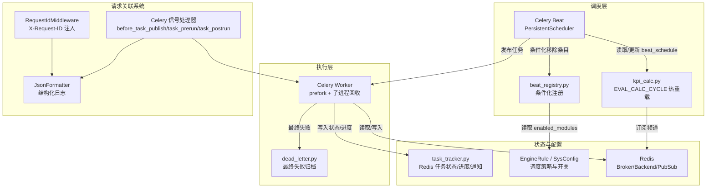
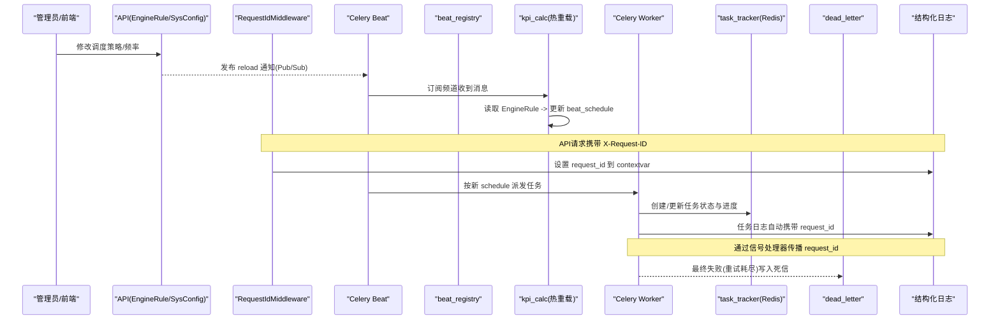
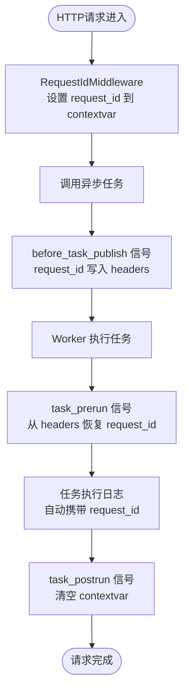
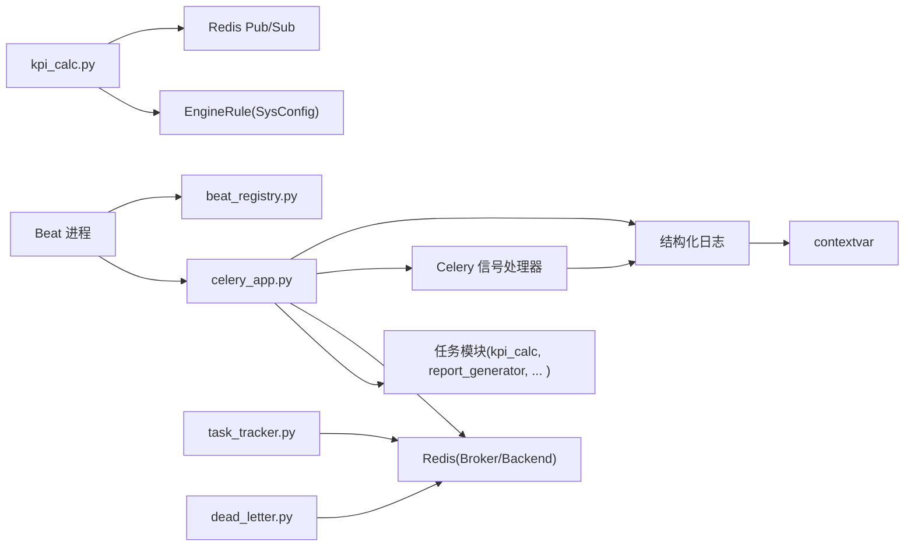

# 任务调度系统

<cite>
**本文引用的文件**
- [backend/app/tasks/celery_app.py](file://backend/app/tasks/celery_app.py)
- [backend/app/core/logging.py](file://backend/app/core/logging.py)
- [backend/app/middleware/request_id.py](file://backend/app/middleware/request_id.py)
- [backend/app/tasks/beat_registry.py](file://backend/app/tasks/beat_registry.py)
- [backend/app/tasks/kpi_calc.py](file://backend/app/tasks/kpi_calc.py)
- [backend/app/tasks/dead_letter.py](file://backend/app/tasks/dead_letter.py)
- [backend/app/services/task_tracker.py](file://backend/app/services/task_tracker.py)
- [backend/tests/test_celery_request_id.py](file://backend/tests/test_celery_request_id.py)
- [frontend/apps/web-antd/src/views/metric/task-strategy.vue](file://frontend/apps/web-antd/src/views/metric/task-strategy.vue)
- [e2e/tests/metric-tasks-fixes.spec.ts](file://e2e/tests/metric-tasks-fixes.spec.ts)
- [AGENTS.md](file://AGENTS.md)
- [TROUBLESHOOTING.md](file://TROUBLESHOOTING.md)
</cite>

## 更新摘要
**变更内容**
- 新增异步请求关联系统：通过 Celery 信号处理器实现 request_id 在任务生命周期中的传播
- 增强日志追踪能力：结构化日志自动携带 request_id，支持端到端链路追踪
- 扩展监控调试功能：新增全链路追踪、请求上下文传递、日志关联分析

## 目录
1. [简介](#简介)
2. [项目结构](#项目结构)
3. [核心组件](#核心组件)
4. [架构总览](#架构总览)
5. [详细组件分析](#详细组件分析)
6. [依赖关系分析](#依赖关系分析)
7. [性能考量](#性能考量)
8. [故障排查指南](#故障排查指南)
9. [结论](#结论)
10. [附录](#附录)

## 简介
本技术文档围绕 Celery Beat 定时任务与 Celery Worker 的分布式执行，系统化说明以下能力：
- 调度周期设置、任务依赖关系、执行时间窗控制
- **新增** 异步请求关联系统：request_id 跨进程传播，实现 API 到后台任务的端到端追踪
- 任务状态跟踪机制（生命周期、日志、失败重试）
- 任务优先级管理（高优先级插队、资源抢占、公平调度）
- 分布式执行（Worker 负载均衡、分发策略、故障转移）
- **增强** 监控与调试（实时状态、性能分析、诊断工具、全链路追踪）
- 配置热更新（运行时修改调度规则、动态调整频率）
- 队列监控告警（积压、超时、资源使用）

## 项目结构
后端通过 Celery 应用实例统一注册任务模块，Beat 负责调度，Worker 负责执行。关键路径包括：
- Celery 应用与全局配置（时区、序列化、持久化、死信队列等）
- **新增** 异步请求关联系统：通过信号处理器实现 request_id 传播
- Beat 条件化注册与热重载（基于数据库与 Redis Pub/Sub）
- 任务跟踪服务（Redis 存储任务元数据、进度、通知）
- 死信队列处理（最终失败任务归档）
- 前端策略配置页与端到端测试验证



**图表来源**
- [backend/app/tasks/celery_app.py:24-84](file://backend/app/tasks/celery_app.py#L24-L84)
- [backend/app/tasks/celery_app.py:254-295](file://backend/app/tasks/celery_app.py#L254-L295)
- [backend/app/core/logging.py:69-96](file://backend/app/core/logging.py#L69-L96)
- [backend/app/middleware/request_id.py:21-36](file://backend/app/middleware/request_id.py#L21-L36)
- [backend/app/tasks/beat_registry.py:29-84](file://backend/app/tasks/beat_registry.py#L29-L84)
- [backend/app/tasks/kpi_calc.py:498-587](file://backend/app/tasks/kpi_calc.py#L498-L587)
- [backend/app/tasks/dead_letter.py:17-39](file://backend/app/tasks/dead_letter.py#L17-L39)
- [backend/app/services/task_tracker.py:30-71](file://backend/app/services/task_tracker.py#L30-L71)

**章节来源**
- [backend/app/tasks/celery_app.py:24-84](file://backend/app/tasks/celery_app.py#L24-L84)
- [backend/app/tasks/celery_app.py:254-295](file://backend/app/tasks/celery_app.py#L254-L295)
- [backend/app/core/logging.py:69-96](file://backend/app/core/logging.py#L69-L96)
- [backend/app/middleware/request_id.py:21-36](file://backend/app/middleware/request_id.py#L21-L36)
- [backend/app/tasks/beat_registry.py:29-84](file://backend/app/tasks/beat_registry.py#L29-L84)
- [backend/app/tasks/kpi_calc.py:498-587](file://backend/app/tasks/kpi_calc.py#L498-L587)
- [backend/app/tasks/dead_letter.py:17-39](file://backend/app/tasks/dead_letter.py#L17-L39)
- [backend/app/services/task_tracker.py:30-71](file://backend/app/services/task_tracker.py#L30-L71)

## 核心组件
- Celery 应用与全局配置：定义 Broker/Backend、时区、序列化、持久化调度、任务超时保护、可见性超时、结果过期、子进程回收等。
- **新增** 异步请求关联系统：通过 Celery 信号处理器实现 request_id 在任务生命周期中的完整传播。
- Beat 条件化注册：在 Beat 启动后根据模块启用状态移除禁用模块的调度条目。
- 调度周期热重载：从 EngineRule 读取 EVAL_CALC_CYCLE，动态覆盖 kpi-calc-hourly 调度；通过 Redis Pub/Sub 即时生效。
- 任务跟踪服务：以 Redis Hash/Sorted Set/List/Lua 脚本实现任务创建、状态更新、进度聚合、通知推送。
- 死信队列：最终失败任务元数据落库/记录，便于独立 worker 消费排查。

**章节来源**
- [backend/app/tasks/celery_app.py:24-84](file://backend/app/tasks/celery_app.py#L24-L84)
- [backend/app/tasks/celery_app.py:254-295](file://backend/app/tasks/celery_app.py#L254-L295)
- [backend/app/tasks/beat_registry.py:29-84](file://backend/app/tasks/beat_registry.py#L29-L84)
- [backend/app/tasks/kpi_calc.py:498-587](file://backend/app/tasks/kpi_calc.py#L498-L587)
- [backend/app/services/task_tracker.py:30-71](file://backend/app/services/task_tracker.py#L30-L71)
- [backend/app/tasks/dead_letter.py:17-39](file://backend/app/tasks/dead_letter.py#L17-L39)

## 架构总览
下图展示调度到执行的完整链路，以及配置热更新、状态跟踪和**新增的请求关联追踪**的交互。



**图表来源**
- [backend/app/tasks/kpi_calc.py:550-587](file://backend/app/tasks/kpi_calc.py#L550-L587)
- [backend/app/tasks/beat_registry.py:69-84](file://backend/app/tasks/beat_registry.py#L69-L84)
- [backend/app/services/task_tracker.py:561-651](file://backend/app/services/task_tracker.py#L561-L651)
- [backend/app/tasks/dead_letter.py:17-39](file://backend/app/tasks/dead_letter.py#L17-L39)
- [backend/app/tasks/celery_app.py:254-295](file://backend/app/tasks/celery_app.py#L254-L295)
- [backend/app/core/logging.py:69-96](file://backend/app/core/logging.py#L69-L96)
- [backend/app/middleware/request_id.py:21-36](file://backend/app/middleware/request_id.py#L21-L36)

## 详细组件分析

### Celery 应用与全局配置
- 时区与时序：Asia/Shanghai，UTC 开启，JSON 序列化。
- 可靠性：任务 late ack、worker 丢失重投、任务硬/软超时、结果保留 7 天、broker visibility_timeout 延长避免长耗时任务被误重投。
- 稳定性：Beat 持久化调度、子进程最大任务数回收防止内存泄漏、父进程看门狗防孤儿。
- 队列：默认队列与死信队列分离，便于隔离问题。

**章节来源**
- [backend/app/tasks/celery_app.py:24-84](file://backend/app/tasks/celery_app.py#L24-L84)
- [AGENTS.md:68-81](file://AGENTS.md#L68-L81)

### **新增** 异步请求关联系统
- **请求ID生成**：RequestIdMiddleware 为每个HTTP请求生成或传递 X-Request-ID，并设置到 contextvar。
- **任务投递传播**：before_task_publish 信号处理器将当前请求上下文的 request_id 写入消息 headers。
- **任务执行恢复**：task_prerun 信号处理器从消息 headers 恢复 request_id 到 contextvar，供任务侧日志使用。
- **任务结束清理**：task_postrun 信号处理器清空 contextvar，防止 prefork 子进程串行执行时泄漏到下一任务。
- **结构化日志集成**：JsonFormatter 自动从 contextvar 读取 request_id 并输出到日志中。



**图表来源**
- [backend/app/middleware/request_id.py:21-36](file://backend/app/middleware/request_id.py#L21-L36)
- [backend/app/tasks/celery_app.py:254-283](file://backend/app/tasks/celery_app.py#L254-L283)
- [backend/app/core/logging.py:69-96](file://backend/app/core/logging.py#L69-L96)

**章节来源**
- [backend/app/tasks/celery_app.py:254-295](file://backend/app/tasks/celery_app.py#L254-L295)
- [backend/app/core/logging.py:69-96](file://backend/app/core/logging.py#L69-L96)
- [backend/app/middleware/request_id.py:21-36](file://backend/app/middleware/request_id.py#L21-L36)

### Beat 条件化注册与模块开关
- 在 beat_init 信号中读取 enabled_modules，移除已禁用模块对应的调度条目（如诊断相关每日/每周任务）。
- 基础任务不受影响，保证核心链路稳定。

**章节来源**
- [backend/app/tasks/beat_registry.py:29-84](file://backend/app/tasks/beat_registry.py#L29-L84)

### 调度周期热重载（EVAL_CALC_CYCLE）
- 支持将 EngineRule 中的 EVAL_CALC_CYCLE 应用到 beat_schedule，覆盖 kpi-calc-hourly 的调度表达式。
- 支持禁用自动计算（删除条目）与自定义分钟级周期。
- 通过 Redis Pub/Sub 频道"clpm:beat:reload"实现无需重启 Beat 的热更新。

```mermaid
flowchart TD
Start(["Beat 启动/收到重载通知"]) --> ReadDB["读取 EngineRule(EVAL_CALC_CYCLE)"]
ReadDB --> Enabled{"is_enabled?"}
Enabled -- 否 --> Remove["从 beat_schedule 移除 kpi-calc-hourly"]
Enabled -- 是 --> BuildExpr{"cycle_minutes"}
BuildExpr --> |60| CrontabHour["crontab(minute=0, hour='*')"]
BuildExpr --> |<60| CrontabMin["crontab(minute=*/N)"]
BuildExpr --> |>60| Interval["float(cycle_minutes)*60"]
CrontabHour --> Apply["写入 beat_schedule"]
CrontabMin --> Apply
Interval --> Apply
Remove --> End(["生效"])
Apply --> End
```



**图表来源**
- [backend/app/tasks/kpi_calc.py:498-587](file://backend/app/tasks/kpi_calc.py#L498-L587)

**章节来源**
- [backend/app/tasks/kpi_calc.py:498-587](file://backend/app/tasks/kpi_calc.py#L498-L587)

### 任务状态跟踪与生命周期
- 任务记录：创建任务时在 Redis Hash 中写入初始状态 PENDING，并维护索引 Sorted Set。
- 状态更新：使用 Lua 脚本 CAS 原子更新，禁止终态覆盖，保障并发安全。
- 进度聚合：按工作项计数，单调递增，避免重复计数。
- 通知机制：进入终态时向用户通知列表推送，限制条数。

```mermaid
classDiagram
class TaskTracker {
+create_task(...)
+update_status(...)
+record_backfill_progress_once(...)
+get_notifications(...)
-_STATUS_CAS_LUA
-_BACKFILL_PROGRESS_LUA
}
class RedisState {
+Hash "task : {id}"
+SortedSet "task : index"
+List "task : notifications : {user_id}"
}
TaskTracker --> RedisState : "读写/原子操作"
```

**图表来源**
- [backend/app/services/task_tracker.py:30-71](file://backend/app/services/task_tracker.py#L30-L71)
- [backend/app/services/task_tracker.py:561-651](file://backend/app/services/task_tracker.py#L561-L651)

**章节来源**
- [backend/app/services/task_tracker.py:30-71](file://backend/app/services/task_tracker.py#L30-L71)
- [backend/app/services/task_tracker.py:561-651](file://backend/app/services/task_tracker.py#L561-L651)

### 失败重试与死信队列
- 异步任务基类在 on_failure 中将耗尽重试的任务发送到 dead_letter 队列，记录 task_id、名称、异常、参数等。
- 独立 worker 可消费死信队列进行排查与复现。

**章节来源**
- [backend/app/tasks/celery_app.py:90-125](file://backend/app/tasks/celery_app.py#L90-L125)
- [backend/app/tasks/dead_letter.py:17-39](file://backend/app/tasks/dead_letter.py#L17-L39)

### 任务优先级管理与调度公平性
- 队列维度：默认队列与死信队列分离，避免失败任务阻塞正常任务。
- 并发维度：通过 EngineRule 的 SCHEDULE_CONCURRENCY 控制 Worker 并发度，结合前端 UI 暴露配置入口。
- 业务优先级：关注队列与工单排序体现"先干什么"，但 Celery 侧未实现多队列优先级路由；可通过外部编排或任务标签+多队列策略扩展。

**章节来源**
- [backend/app/tasks/celery_app.py:66-71](file://backend/app/tasks/celery_app.py#L66-L71)
- [frontend/apps/web-antd/src/views/metric/task-strategy.vue:349-388](file://frontend/apps/web-antd/src/views/metric/task-strategy.vue#L349-L388)
- [e2e/tests/metric-tasks-fixes.spec.ts:68-86](file://e2e/tests/metric-tasks-fixes.spec.ts#L68-L86)

### 分布式执行与故障转移
- Worker 采用 prefork 模型，每个子进程处理固定数量任务后回收重建，降低内存泄漏风险。
- broker visibility_timeout 延长，避免长耗时任务被误判为无响应而重投。
- 任务 late ack 与 worker 丢失重投，增强鲁棒性。
- 父进程看门钩子确保宿主崩溃时子进程级联退出，避免孤儿进程。

**章节来源**
- [backend/app/tasks/celery_app.py:57-84](file://backend/app/tasks/celery_app.py#L57-L84)
- [AGENTS.md:68-81](file://AGENTS.md#L68-L81)
- [TROUBLESHOOTING.md:155-160](file://TROUBLESHOOTING.md#L155-L160)

### **增强** 监控与调试
- **全链路追踪**：通过 request_id 实现从 API 请求到后台任务执行的端到端追踪。
- 实时状态查看：通过 task_tracker 提供的任务状态与进度接口查询。
- 执行性能分析：利用任务返回统计（窗口数、成功/失败计数、阶段耗时）定位瓶颈。
- 问题诊断：死信队列集中记录最终失败任务，便于回溯；Beat 持久化保障调度状态不丢失。
- **日志关联分析**：结构化日志自动携带 request_id，支持按请求ID过滤和分析完整执行链路。

**章节来源**
- [backend/app/tasks/celery_app.py:254-295](file://backend/app/tasks/celery_app.py#L254-L295)
- [backend/app/core/logging.py:69-96](file://backend/app/core/logging.py#L69-L96)
- [backend/app/services/task_tracker.py:561-651](file://backend/app/services/task_tracker.py#L561-L651)
- [backend/app/tasks/kpi_calc.py:3878-3911](file://backend/app/tasks/kpi_calc.py#L3878-L3911)
- [backend/app/tasks/dead_letter.py:17-39](file://backend/app/tasks/dead_letter.py#L17-L39)

### 配置热更新机制
- 调度周期：EVAL_CALC_CYCLE 通过 Redis Pub/Sub 触发 Beat 热重载，无需重启。
- 模块开关：enabled_modules 变更在 beat_init 时应用，移除禁用模块的调度条目。
- 并发策略：SCHEDULE_CONCURRENCY 由前端策略页配置，保存后生效（端到端测试验证）。

**章节来源**
- [backend/app/tasks/kpi_calc.py:550-587](file://backend/app/tasks/kpi_calc.py#L550-L587)
- [backend/app/tasks/beat_registry.py:69-84](file://backend/app/tasks/beat_registry.py#L69-L84)
- [e2e/tests/metric-tasks-fixes.spec.ts:68-86](file://e2e/tests/metric-tasks-fixes.spec.ts#L68-L86)

### 队列监控告警
- 积压告警：可通过 Redis 队列长度监控（default/dead_letter）结合 Prometheus/Grafana 实现阈值告警。
- 超时告警：基于任务 time_limit/soft_time_limit 与执行时长指标，超限时触发告警。
- 资源使用告警：监控 Worker CPU/内存、子进程回收次数、连接池占用等。

[本节为通用指导，不直接分析具体文件]

## 依赖关系分析
- Celery 应用依赖配置中心（settings）、任务模块、Redis Broker/Backend。
- Beat 依赖 PersistentScheduler 与任务模块导入，确保调度计划加载。
- **新增** 请求关联系统依赖：Celery 信号处理器、contextvar、结构化日志器。
- 任务跟踪服务依赖 Redis 数据结构与 Lua 脚本保证原子性。
- 热重载依赖 Redis Pub/Sub 通道与 EngineRule 配置表。



**图表来源**
- [backend/app/tasks/celery_app.py:24-84](file://backend/app/tasks/celery_app.py#L24-L84)
- [backend/app/tasks/celery_app.py:254-295](file://backend/app/tasks/celery_app.py#L254-L295)
- [backend/app/core/logging.py:69-96](file://backend/app/core/logging.py#L69-L96)
- [backend/app/tasks/beat_registry.py:29-84](file://backend/app/tasks/beat_registry.py#L29-L84)
- [backend/app/tasks/kpi_calc.py:590-618](file://backend/app/tasks/kpi_calc.py#L590-L618)
- [backend/app/services/task_tracker.py:30-71](file://backend/app/services/task_tracker.py#L30-L71)

**章节来源**
- [backend/app/tasks/celery_app.py:24-84](file://backend/app/tasks/celery_app.py#L24-L84)
- [backend/app/tasks/celery_app.py:254-295](file://backend/app/tasks/celery_app.py#L254-L295)
- [backend/app/core/logging.py:69-96](file://backend/app/core/logging.py#L69-L96)
- [backend/app/tasks/beat_registry.py:29-84](file://backend/app/tasks/beat_registry.py#L29-L84)
- [backend/app/tasks/kpi_calc.py:590-618](file://backend/app/tasks/kpi_calc.py#L590-L618)
- [backend/app/services/task_tracker.py:30-71](file://backend/app/services/task_tracker.py#L30-L71)

## 性能考量
- 子进程回收：worker_max_tasks_per_child=50，抑制长驻进程内存增长。
- 可见性超时：visibility_timeout 延长至 9000s，避免长耗时任务被误重投。
- 结果过期：result_expires=7 天，配合状态清扫避免 Redis 堆积。
- 并发控制：SCHEDULE_CONCURRENCY 调节 Worker 并发，平衡吞吐与资源。
- 缓存预热：KPI 计算前并行预取数据并缓存，减少 I/O 压力。
- **新增** 请求关联开销：contextvar 操作和 signal handler 调用开销极小，对性能影响可忽略。

**章节来源**
- [backend/app/tasks/celery_app.py:72-84](file://backend/app/tasks/celery_app.py#L72-L84)
- [backend/app/tasks/kpi_calc.py:630-686](file://backend/app/tasks/kpi_calc.py#L630-L686)

## 故障排查指南
- 任务重复执行：检查是否多个 Worker/Beat 并存；确认 lifespan 自动拉起且不再手动启动。
- 任务丢失：确认 task_reject_on_worker_lost 与 visibility_timeout 配置；查看死信队列。
- 调度未生效：确认 beat_init 信号与模块开关；检查 EngineRule 与 Pub/Sub 通道。
- 长任务被中断：核对 time_limit 与 visibility_timeout；必要时拆分任务或使用 group/callback。
- 前端显示不一致：核对 task_tracker 状态更新与通知逻辑；清理残留活跃任务。
- **新增** 请求追踪问题：检查 X-Request-ID 是否正确传递；确认 signal handlers 是否正常注册；验证结构化日志中是否包含 request_id。

**章节来源**
- [AGENTS.md:68-81](file://AGENTS.md#L68-L81)
- [backend/app/tasks/celery_app.py:57-84](file://backend/app/tasks/celery_app.py#L57-L84)
- [backend/app/tasks/celery_app.py:254-295](file://backend/app/tasks/celery_app.py#L254-L295)
- [backend/app/tasks/dead_letter.py:17-39](file://backend/app/tasks/dead_letter.py#L17-L39)
- [e2e/tests/metric-tasks-fixes.spec.ts:342-367](file://e2e/tests/metric-tasks-fixes.spec.ts#L342-L367)

## 结论
本系统通过 Celery Beat 与 Worker 的组合，实现了可靠的定时调度与分布式执行。借助 EngineRule 与 Redis Pub/Sub 完成调度周期的热更新，通过 task_tracker 提供完整的任务生命周期追踪与通知，结合死信队列与持久化调度提升鲁棒性。**新增的异步请求关联系统**实现了从 API 请求到后台任务执行的端到端追踪，通过 request_id 传播和结构化日志集成，大幅提升了问题定位和系统可观测性。未来可在多队列优先级路由、细粒度资源配额与更丰富的监控告警方面持续演进。

## 附录
- 报表周期任务示例：测试断言 Beat 包含 SHIFT/DAILY/WEEKLY/MONTHLY 四个周期任务，时区为 Asia/Shanghai，间隔合理。
- 前端策略配置：调度并发数由 EngineRule 驱动，UI 可编辑并保存生效。
- **新增** 请求关联测试：test_celery_request_id.py 验证 request_id 在任务生命周期中的正确传播。

**章节来源**
- [backend/tests/test_report_generator.py:365-404](file://backend/tests/test_report_generator.py#L365-L404)
- [frontend/apps/web-antd/src/views/metric/task-strategy.vue:349-388](file://frontend/apps/web-antd/src/views/metric/task-strategy.vue#L349-L388)
- [backend/tests/test_celery_request_id.py](file://backend/tests/test_celery_request_id.py)