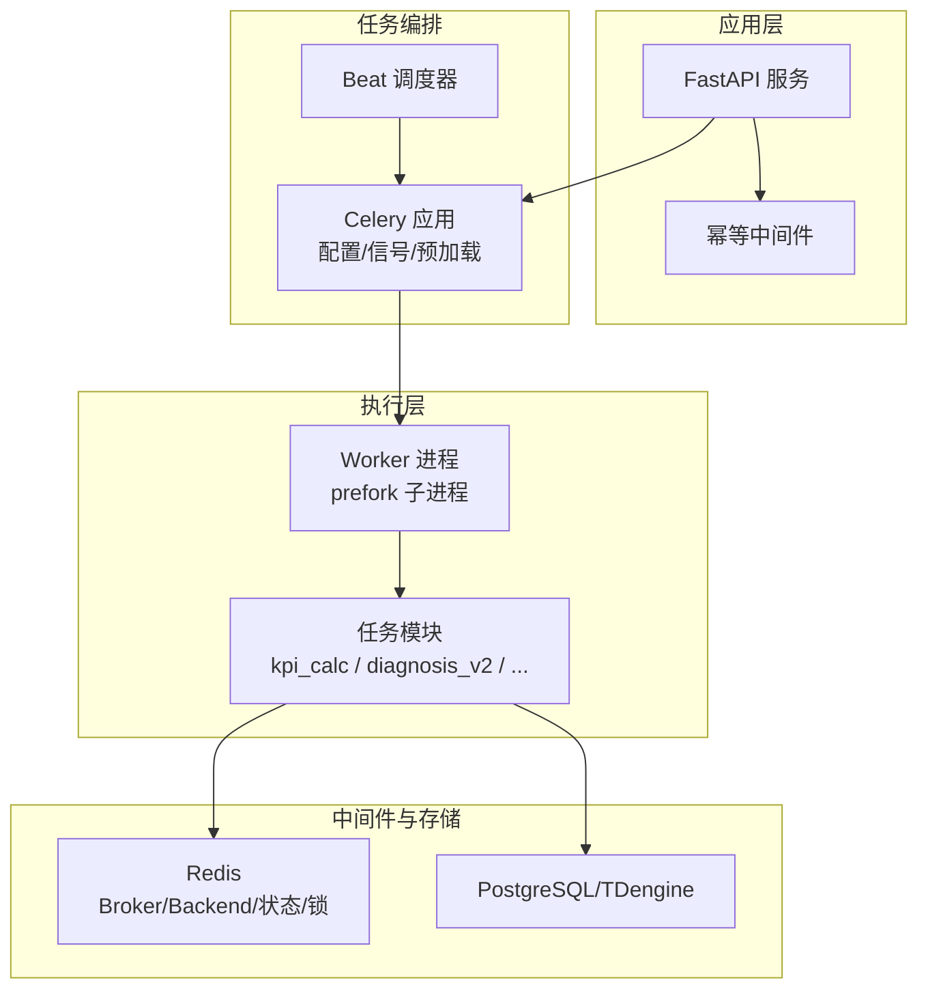
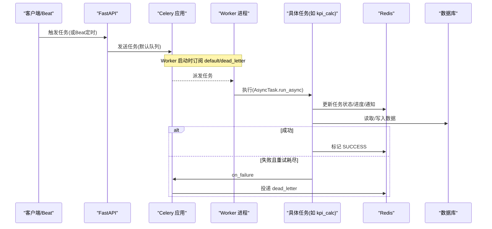
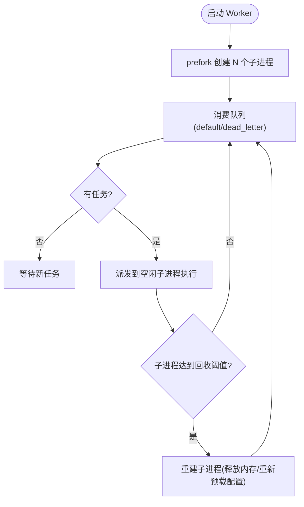
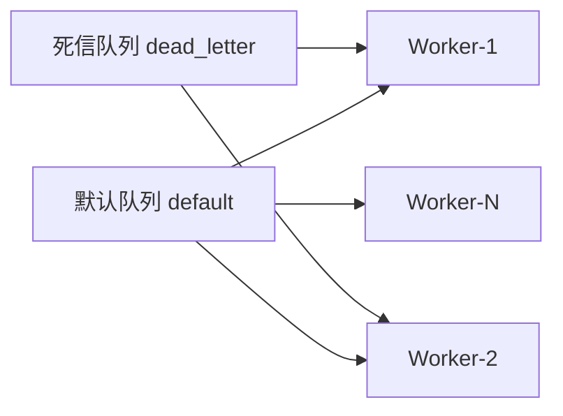
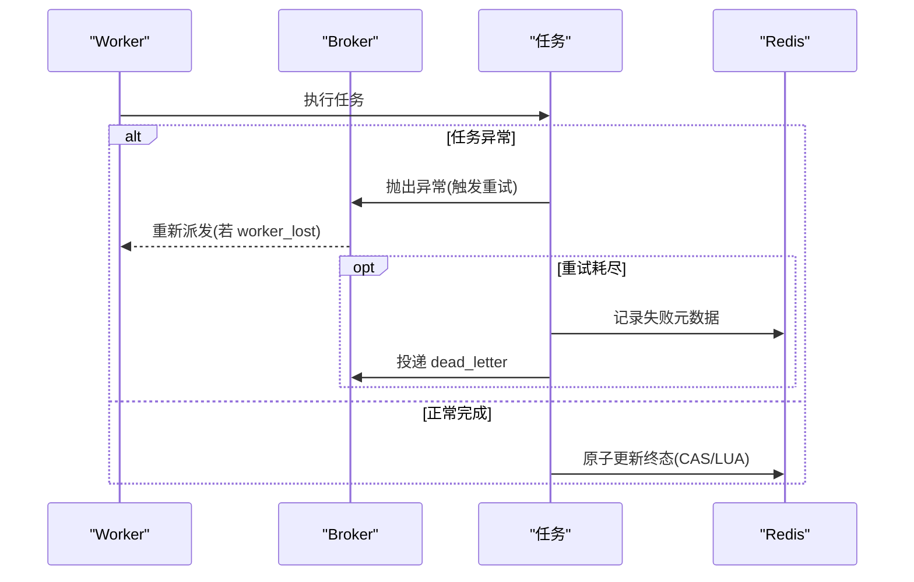
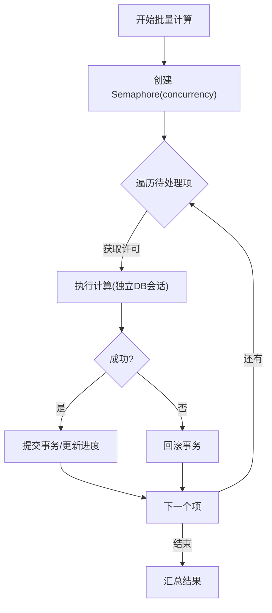
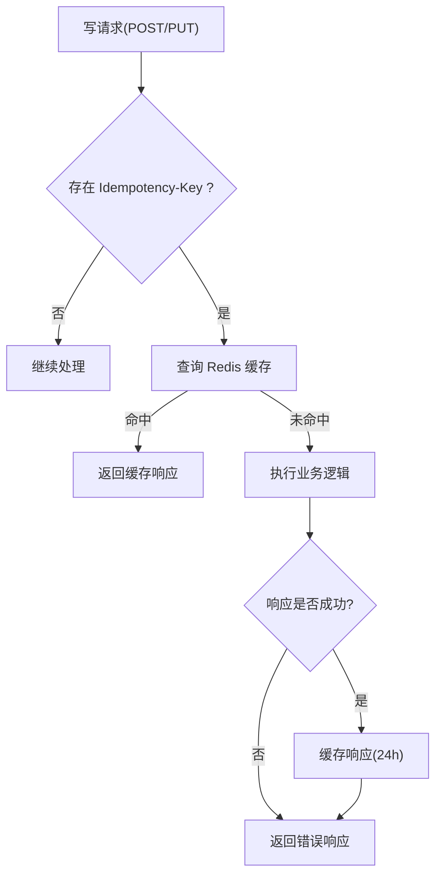
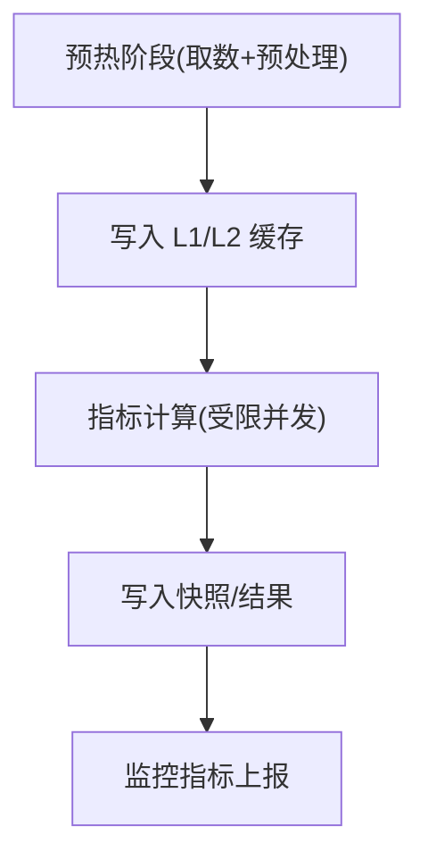
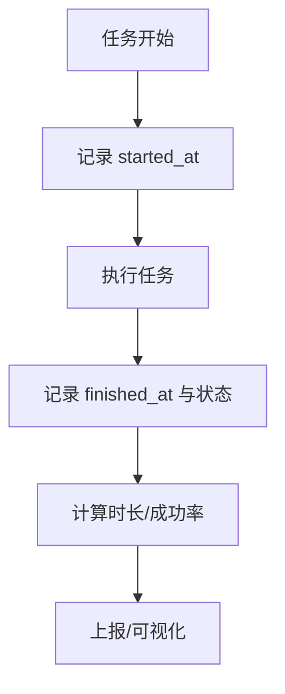
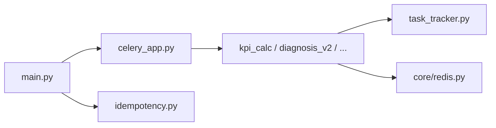

# 分布式任务执行

<cite>
**本文引用的文件**
- [backend/app/tasks/celery_app.py](file://backend/app/tasks/celery_app.py)
- [backend/app/services/task_tracker.py](file://backend/app/services/task_tracker.py)
- [backend/app/middleware/idempotency.py](file://backend/app/middleware/idempotency.py)
- [backend/app/core/redis.py](file://backend/app/core/redis.py)
- [backend/app/tasks/diagnosis_v2.py](file://backend/app/tasks/diagnosis_v2.py)
- [backend/app/tasks/kpi_calc.py](file://backend/app/tasks/kpi_calc.py)
- [backend/app/main.py](file://backend/app/main.py)
- [backend/app/services/data_import.py](file://backend/app/services/data_import.py)
- [backend/tests/test_api_tasks.py](file://backend/tests/test_api_tasks.py)
</cite>

## 目录
1. [简介](#简介)
2. [项目结构](#项目结构)
3. [核心组件](#核心组件)
4. [架构总览](#架构总览)
5. [详细组件分析](#详细组件分析)
6. [依赖关系分析](#依赖关系分析)
7. [性能考量](#性能考量)
8. [故障排查指南](#故障排查指南)
9. [结论](#结论)
10. [附录](#附录)

## 简介
本文件面向“分布式任务执行”主题，围绕 Worker 负载均衡、任务分发策略、故障转移、并发控制、任务去重、性能优化与监控指标等关键维度，基于仓库中 Celery + Redis 的任务体系进行系统化说明。内容覆盖多实例部署策略、任务路由与调度、失败重试与死信、幂等与重复任务识别、批处理与连接池、内存泄漏防护，以及执行时长、成功率与资源使用率的观测方法。

## 项目结构
后端采用 FastAPI 作为入口，Celery 作为异步任务执行引擎，Redis 作为消息代理、结果存储与分布式锁/状态中心；任务通过 Beat 定时触发或由 API 手动触发，Worker 进程消费队列并执行具体业务逻辑（如 KPI 计算、诊断批量任务等）。

**图示来源**
- [backend/app/tasks/celery_app.py:24-84](file://backend/app/tasks/celery_app.py#L24-L84)
- [backend/app/tasks/kpi_calc.py:458-484](file://backend/app/tasks/kpi_calc.py#L458-L484)
- [backend/app/main.py:481-512](file://backend/app/main.py#L481-L512)

**章节来源**
- [backend/app/tasks/celery_app.py:24-84](file://backend/app/tasks/celery_app.py#L24-L84)
- [backend/app/tasks/kpi_calc.py:458-484](file://backend/app/tasks/kpi_calc.py#L458-L484)
- [backend/app/main.py:481-512](file://backend/app/main.py#L481-L512)

## 核心组件
- Celery 应用与任务基类：统一超时、重试、死信、事件循环隔离与子进程预加载。
- 任务跟踪服务：以 Redis Hash/Sorted Set/List 维护任务生命周期、进度、通知。
- 幂等中间件：对写请求提供基于 Idempotency-Key 的响应缓存与重复拦截。
- Redis 客户端代理：自动感知 event loop 变化并重建连接，避免跨任务复用导致崩溃。
- 任务实现：KPI 计算（含小时/日/月聚合）、诊断批量任务等。

**章节来源**
- [backend/app/tasks/celery_app.py:90-125](file://backend/app/tasks/celery_app.py#L90-L125)
- [backend/app/services/task_tracker.py:310-384](file://backend/app/services/task_tracker.py#L310-L384)
- [backend/app/middleware/idempotency.py:28-114](file://backend/app/middleware/idempotency.py#L28-L114)
- [backend/app/core/redis.py:29-151](file://backend/app/core/redis.py#L29-L151)
- [backend/app/tasks/diagnosis_v2.py:28-57](file://backend/app/tasks/diagnosis_v2.py#L28-L57)
- [backend/app/tasks/kpi_calc.py:128-170](file://backend/app/tasks/kpi_calc.py#L128-L170)

## 架构总览
下图展示从 API/Beat 到 Worker 执行、再到 Redis/DB 的完整链路，包括任务创建、状态推进、失败重试与死信投递。

**图示来源**
- [backend/app/tasks/celery_app.py:24-84](file://backend/app/tasks/celery_app.py#L24-L84)
- [backend/app/tasks/celery_app.py:90-125](file://backend/app/tasks/celery_app.py#L90-L125)
- [backend/app/services/task_tracker.py:561-651](file://backend/app/services/task_tracker.py#L561-L651)
- [backend/app/main.py:481-512](file://backend/app/main.py#L481-L512)

## 详细组件分析

### Worker 负载均衡与多实例部署
- 多实例部署：通过启动多个 Worker 进程（可跨主机）共享同一 Broker/Backend，Celery 负责将任务分发给空闲 Worker。
- 并发度限制：每个 Worker 通过 prefork 子进程并行执行任务，worker_max_tasks_per_child 用于周期回收子进程，抑制内存增长。
- 负载感知调度：当前未实现显式权重/容量感知的调度器，但可通过多队列（default、dead_letter）与多 Worker 实例水平扩展；未来可扩展为按队列/标签路由至不同 Worker 组。

**图示来源**
- [backend/app/tasks/celery_app.py:48-84](file://backend/app/tasks/celery_app.py#L48-L84)
- [backend/app/main.py:481-512](file://backend/app/main.py#L481-L512)

**章节来源**
- [backend/app/tasks/celery_app.py:48-84](file://backend/app/tasks/celery_app.py#L48-L84)
- [backend/app/main.py:481-512](file://backend/app/main.py#L481-L512)

### 任务分发策略
- 基于内容的路由：当前未启用按内容路由；所有任务默认进入 default 队列。可通过自定义路由键与队列名实现按业务域路由。
- 轮询分配：Celery broker 默认对可用 Worker 进行轮询派发。
- 权重分配：未内置权重调度；可通过多队列+多 Worker 实例数量间接实现“软权重”。

**图示来源**
- [backend/app/tasks/celery_app.py:66-71](file://backend/app/tasks/celery_app.py#L66-L71)
- [backend/app/main.py:481-512](file://backend/app/main.py#L481-L512)

**章节来源**
- [backend/app/tasks/celery_app.py:66-71](file://backend/app/tasks/celery_app.py#L66-L71)
- [backend/app/main.py:481-512](file://backend/app/main.py#L481-L512)

### 故障转移机制
- Worker 节点故障检测：task_reject_on_worker_lost=True，当 Worker 崩溃时任务会被 Broker 重新投递；同时 visibility_timeout 设置大于任务 time_limit，避免过早重投造成并发执行。
- 任务自动迁移：失败任务经 autoretry_for + retry_backoff 指数退避重试；耗尽后由 AsyncTask.on_failure 投递至 dead_letter 队列，便于集中排查。
- 数据一致性保证：任务内使用独立数据库会话，异常时 rollback；关键状态更新通过 Redis Lua 脚本原子化完成（如进度、状态 CAS），避免竞态。

**图示来源**
- [backend/app/tasks/celery_app.py:55-79](file://backend/app/tasks/celery_app.py#L55-L79)
- [backend/app/tasks/celery_app.py:90-125](file://backend/app/tasks/celery_app.py#L90-L125)
- [backend/app/services/task_tracker.py:42-71](file://backend/app/services/task_tracker.py#L42-L71)

**章节来源**
- [backend/app/tasks/celery_app.py:55-79](file://backend/app/tasks/celery_app.py#L55-L79)
- [backend/app/tasks/celery_app.py:90-125](file://backend/app/tasks/celery_app.py#L90-L125)
- [backend/app/services/task_tracker.py:42-71](file://backend/app/services/task_tracker.py#L42-L71)

### 并发控制
- 任务并发度限制：
  - Worker 级：worker_prefetch_multiplier=1 避免预取堆积；worker_max_tasks_per_child 控制子进程生命周期。
  - 任务级：各任务内部使用 asyncio.Semaphore 限制并发（例如 KPI 批量计算的 CONCURRENCY）。
- 资源隔离策略：每个回路/批次使用独立数据库会话，异常时回滚；Redis 操作通过 Lua 脚本保证原子性。
- 内存使用监控：子进程定期回收；心跳/停滞检测在导入任务中体现（RUNNING 超时判定），可用于推广到其他长任务。

**图示来源**
- [backend/app/tasks/kpi_calc.py:699-762](file://backend/app/tasks/kpi_calc.py#L699-L762)
- [backend/app/tasks/kpi_calc.py:63-66](file://backend/app/tasks/kpi_calc.py#L63-L66)
- [backend/app/services/data_import.py:1316-1349](file://backend/app/services/data_import.py#L1316-L1349)

**章节来源**
- [backend/app/tasks/kpi_calc.py:63-66](file://backend/app/tasks/kpi_calc.py#L63-L66)
- [backend/app/tasks/kpi_calc.py:699-762](file://backend/app/tasks/kpi_calc.py#L699-L762)
- [backend/app/services/data_import.py:1316-1349](file://backend/app/services/data_import.py#L1316-L1349)

### 任务去重机制
- 幂等性保证：
  - API 层：IdempotencyMiddleware 对 POST/PUT 请求基于 Idempotency-Key 缓存响应，24h 内重复请求直接返回首次结果。
  - 任务层：小时窗互斥锁（SETNX + TTL）防止同一窗口重复计算；回填进度使用集合去重（SADD）与单调递增字段。
- 重复任务识别：任务索引与状态 CAS 确保终态不可覆盖；导入任务具备“已终态跳过执行”的检查。
- 执行结果缓存：幂等中间件缓存成功响应；任务结果在 Redis 后端保留 7 天后过期。

**图示来源**
- [backend/app/middleware/idempotency.py:28-114](file://backend/app/middleware/idempotency.py#L28-L114)
- [backend/app/tasks/kpi_calc.py:182-234](file://backend/app/tasks/kpi_calc.py#L182-L234)
- [backend/app/services/task_tracker.py:137-183](file://backend/app/services/task_tracker.py#L137-L183)
- [backend/app/tasks/kpi_calc.py:3913-3946](file://backend/app/tasks/kpi_calc.py#L3913-L3946)

**章节来源**
- [backend/app/middleware/idempotency.py:28-114](file://backend/app/middleware/idempotency.py#L28-L114)
- [backend/app/tasks/kpi_calc.py:182-234](file://backend/app/tasks/kpi_calc.py#L182-L234)
- [backend/app/services/task_tracker.py:137-183](file://backend/app/services/task_tracker.py#L137-L183)
- [backend/app/tasks/kpi_calc.py:3913-3946](file://backend/app/tasks/kpi_calc.py#L3913-L3946)

### 性能优化策略
- 任务批处理：KPI 批量计算通过 asyncio.gather + Semaphore 控制并发；预热阶段分离 I/O 密集取数与 CPU 密集计算。
- 连接池管理：每个任务/回路使用独立 DB 会话；Celery result backend 与 broker visibility_timeout 调优避免连接争用与重复执行。
- 内存泄漏防护：worker_max_tasks_per_child 周期性重建子进程；子进程初始化时重新预载配置，降低长驻风险。

**图示来源**
- [backend/app/tasks/kpi_calc.py:630-696](file://backend/app/tasks/kpi_calc.py#L630-L696)
- [backend/app/tasks/kpi_calc.py:699-762](file://backend/app/tasks/kpi_calc.py#L699-L762)
- [backend/app/tasks/celery_app.py:77-84](file://backend/app/tasks/celery_app.py#L77-L84)

**章节来源**
- [backend/app/tasks/kpi_calc.py:630-696](file://backend/app/tasks/kpi_calc.py#L630-L696)
- [backend/app/tasks/kpi_calc.py:699-762](file://backend/app/tasks/kpi_calc.py#L699-L762)
- [backend/app/tasks/celery_app.py:77-84](file://backend/app/tasks/celery_app.py#L77-L84)

### 监控指标收集
- 执行时长统计：任务耗时可由日志与任务结果时间戳计算；可在任务前后记录 started_at/finished_at。
- 成功率监控：通过任务终态（SUCCESS/FAILED/CANCELLED）统计成功率；死信队列任务量可作为失败率补充。
- 资源使用率追踪：Worker 子进程回收策略与 Redis 键过期策略有助于观察资源占用趋势；可结合系统工具采集 CPU/内存。

**图示来源**
- [backend/app/services/task_tracker.py:561-651](file://backend/app/services/task_tracker.py#L561-L651)
- [backend/app/tasks/celery_app.py:77-79](file://backend/app/tasks/celery_app.py#L77-L79)

**章节来源**
- [backend/app/services/task_tracker.py:561-651](file://backend/app/services/task_tracker.py#L561-L651)
- [backend/app/tasks/celery_app.py:77-79](file://backend/app/tasks/celery_app.py#L77-L79)

## 依赖关系分析
- Celery 应用依赖 Redis 作为 Broker/Backend，并通过 include 注册任务模块；Beat 在启动时动态加载调度计划。
- 任务模块依赖 task_tracker 进行状态与进度管理；依赖 Redis 客户端代理以避免 event loop 切换导致的连接问题。
- API 层通过中间件提供幂等性保障；Worker 启动时注入宿主 PID 以便看门狗保护。

**图示来源**
- [backend/app/tasks/celery_app.py:24-46](file://backend/app/tasks/celery_app.py#L24-L46)
- [backend/app/tasks/kpi_calc.py:128-170](file://backend/app/tasks/kpi_calc.py#L128-L170)
- [backend/app/services/task_tracker.py:310-384](file://backend/app/services/task_tracker.py#L310-L384)
- [backend/app/core/redis.py:130-151](file://backend/app/core/redis.py#L130-L151)
- [backend/app/middleware/idempotency.py:28-114](file://backend/app/middleware/idempotency.py#L28-L114)
- [backend/app/main.py:481-512](file://backend/app/main.py#L481-L512)

**章节来源**
- [backend/app/tasks/celery_app.py:24-46](file://backend/app/tasks/celery_app.py#L24-L46)
- [backend/app/tasks/kpi_calc.py:128-170](file://backend/app/tasks/kpi_calc.py#L128-L170)
- [backend/app/services/task_tracker.py:310-384](file://backend/app/services/task_tracker.py#L310-L384)
- [backend/app/core/redis.py:130-151](file://backend/app/core/redis.py#L130-L151)
- [backend/app/middleware/idempotency.py:28-114](file://backend/app/middleware/idempotency.py#L28-L114)
- [backend/app/main.py:481-512](file://backend/app/main.py#L481-L512)

## 性能考量
- 合理设置 visibility_timeout 与 time_limit，避免任务被误判丢失而重复执行。
- 使用 Semaphore 限制并发，避免数据库连接池耗尽。
- 子进程定期回收，减少内存泄漏风险；任务结果设置过期时间，避免 Redis 无限增长。
- 预热阶段分离 I/O 与 CPU 密集操作，提升整体吞吐。

[本节为通用指导，不直接分析具体文件]

## 故障排查指南
- 任务最终失败：检查死信队列中的任务元数据，定位失败原因。
- 任务重复执行：确认幂等中间件是否生效；检查小时窗互斥锁是否被正确持有与释放。
- 进度不更新：核对 Redis Lua 脚本执行结果与任务状态 CAS；验证事件集合是否去重。
- Worker 卡死：参考导入任务的停滞超时检测思路，增加心跳与超时清理。

**章节来源**
- [backend/app/tasks/celery_app.py:90-125](file://backend/app/tasks/celery_app.py#L90-L125)
- [backend/app/middleware/idempotency.py:28-114](file://backend/app/middleware/idempotency.py#L28-L114)
- [backend/app/services/task_tracker.py:137-183](file://backend/app/services/task_tracker.py#L137-L183)
- [backend/app/services/data_import.py:1316-1349](file://backend/app/services/data_import.py#L1316-L1349)
- [backend/tests/test_api_tasks.py:290-317](file://backend/tests/test_api_tasks.py#L290-L317)

## 结论
该分布式任务执行体系以 Celery + Redis 为核心，提供了可靠的 Worker 多实例部署、任务分发、故障转移与幂等保障；通过 Lua 脚本与 Semaphore 实现了高并发下的数据一致性与资源隔离；配合子进程回收与结果过期策略，有效缓解内存与存储压力。建议后续引入更细粒度的负载感知调度与统一的监控指标采集，进一步提升可观测性与弹性伸缩能力。

[本节为总结，不直接分析具体文件]

## 附录
- 关键配置要点：
  - Celery：broker/backend URL、超时、重试、持久化调度、可见性超时、结果过期、子进程回收。
  - Redis：客户端代理自动重建连接；幂等缓存 TTL；任务状态与进度原子更新。
  - Worker：并发度、队列名称、主机名策略。

**章节来源**
- [backend/app/tasks/celery_app.py:48-84](file://backend/app/tasks/celery_app.py#L48-L84)
- [backend/app/core/redis.py:29-151](file://backend/app/core/redis.py#L29-L151)
- [backend/app/middleware/idempotency.py:28-114](file://backend/app/middleware/idempotency.py#L28-L114)
- [backend/app/main.py:481-512](file://backend/app/main.py#L481-L512)