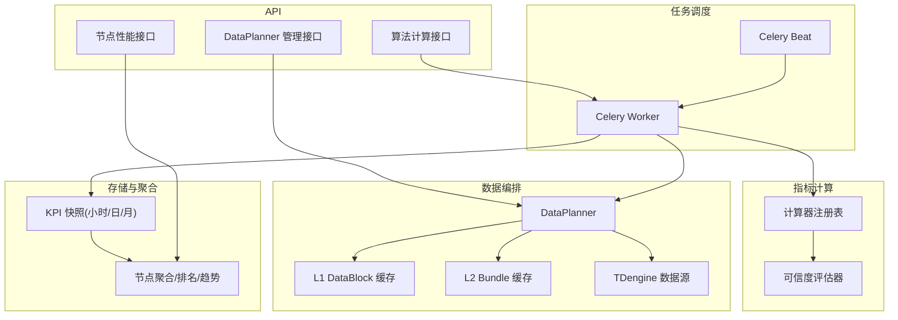
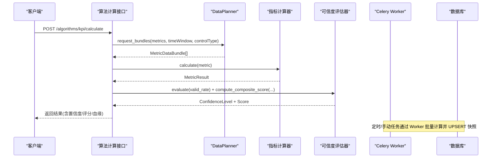
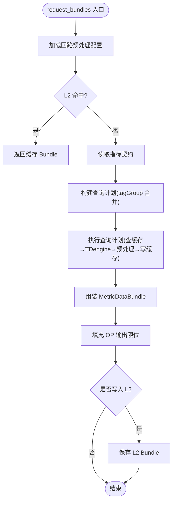
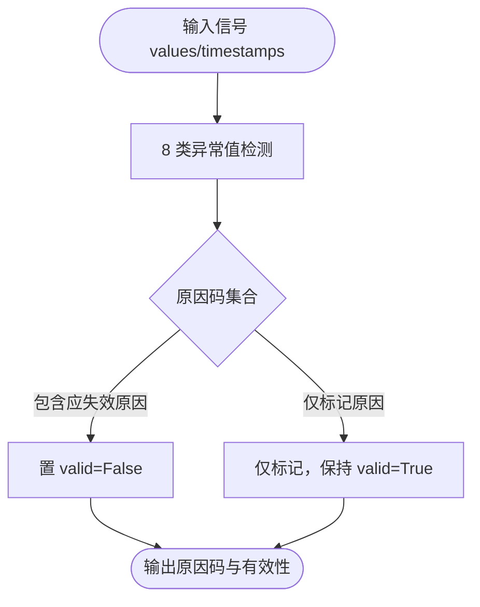
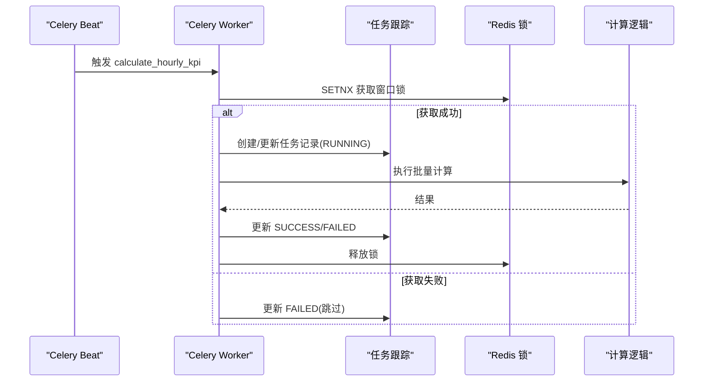
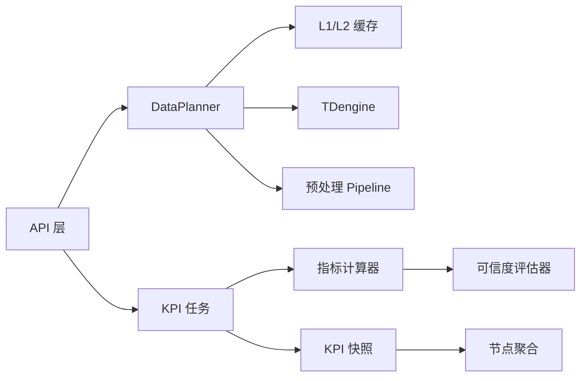

# 性能评估模块

<cite>
**本文引用的文件**
- [backend/app/services/data_planner.py](file://backend/app/services/data_planner.py)
- [backend/app/services/metric_calculator/__init__.py](file://backend/app/services/metric_calculator/__init__.py)
- [backend/app/services/confidence_evaluator.py](file://backend/app/services/confidence_evaluator.py)
- [backend/app/tasks/kpi_calc.py](file://backend/app/tasks/kpi_calc.py)
- [backend/app/api/v1/endpoints/dataplanner.py](file://backend/app/api/v1/endpoints/dataplanner.py)
- [backend/app/api/v1/endpoints/algorithms.py](file://backend/app/api/v1/endpoints/algorithms.py)
- [backend/app/services/kpi_snapshot.py](file://backend/app/services/kpi_snapshot.py)
- [backend/app/services/preprocessing/outlier_detection.py](file://backend/app/services/preprocessing/outlier_detection.py)
- [backend/app/services/preprocessing/pipeline.py](file://backend/app/services/preprocessing/pipeline.py)
- [backend/app/services/performance.py](file://backend/app/services/performance.py)
- [backend/app/api/v1/endpoints/node_performance.py](file://backend/app/api/v1/endpoints/node_performance.py)
</cite>

## 目录
1. [简介](#简介)
2. [项目结构](#项目结构)
3. [核心组件](#核心组件)
4. [架构总览](#架构总览)
5. [详细组件分析](#详细组件分析)
6. [依赖关系分析](#依赖关系分析)
7. [性能考量](#性能考量)
8. [故障排查指南](#故障排查指南)
9. [结论](#结论)
10. [附录：API 接口与使用示例](#附录api-接口与使用示例)

## 简介
本技术文档面向“性能评估模块”，围绕 KPI 指标体系、可信度评估、异常值检测、数据编排与计算引擎、任务调度与重试、快照存储策略、统计分析（排名/趋势/报表）以及 API 接口进行系统化说明。目标是帮助读者快速理解从数据采集到指标计算、评分定级、结果持久化与查询的全链路实现，并掌握如何扩展自定义指标计算逻辑。

## 项目结构
性能评估模块位于后端服务中，采用分层与模块化组织：
- 数据编排层：DataPlanner 负责按指标需求统一取数、合并查询计划、缓存命中与预处理流水线。
- 指标计算层：MetricCalculator 注册表提供多类指标计算器；ConfidenceEvaluator 负责可信度判定与综合评分。
- 任务调度层：Celery Beat + Celery Worker 定时/异步执行 KPI 计算，支持失败重试与窗口互斥。
- 存储与聚合层：KPI 快照写入小时/日/月粒度；节点级聚合用于排名与趋势。
- 预处理与异常检测：8 类异常值检测与质量摘要，支撑指标计算的输入质量。
- API 暴露层：算法计算接口、DataPlanner 管理接口、节点性能与排名接口等。

图表来源
- [backend/app/services/data_planner.py:150-346](file://backend/app/services/data_planner.py#L150-L346)
- [backend/app/tasks/kpi_calc.py:128-170](file://backend/app/tasks/kpi_calc.py#L128-L170)
- [backend/app/services/metric_calculator/__init__.py:49-118](file://backend/app/services/metric_calculator/__init__.py#L49-L118)
- [backend/app/services/confidence_evaluator.py:95-163](file://backend/app/services/confidence_evaluator.py#L95-L163)
- [backend/app/api/v1/endpoints/dataplanner.py:173-224](file://backend/app/api/v1/endpoints/dataplanner.py#L173-L224)
- [backend/app/api/v1/endpoints/algorithms.py:149-183](file://backend/app/api/v1/endpoints/algorithms.py#L149-L183)
- [backend/app/api/v1/endpoints/node_performance.py:121-139](file://backend/app/api/v1/endpoints/node_performance.py#L121-L139)

章节来源
- [backend/app/services/data_planner.py:1-40](file://backend/app/services/data_planner.py#L1-L40)
- [backend/app/tasks/kpi_calc.py:1-16](file://backend/app/tasks/kpi_calc.py#L1-L16)

## 核心组件
- DataPlanner：统一数据读取与编排，基于指标契约构建查询计划，合并 tagGroup 减少重复查询；L1/L2 两级缓存；8 步预处理；组装 MetricDataBundle。
- 指标计算器注册表：集中注册 26 个指标计算器，提供按 metric_code 获取实例的能力；区分核心指标、折扣因子与辅助指标。
- 可信度评估器：依据有效数据率判定 A/B/C/D/E 等级；构建数据血缘；计算综合评分 P = (A·a + F·f + S·s)/(a+f+s) × R；支持阈值动态更新与多进程同步。
- 任务调度系统：Celery Beat 定时触发全量计算；Worker 执行批量计算；Redis 锁保证同一时间窗互斥；自动重试与指数退避。
- 快照与聚合：小时/日/月快照 UPSERT；节点级加权聚合；排名与趋势查询。
- 异常值检测：8 类异常检测（量程越界、跳变、冻结、高频噪声等），标记原因码并决定是否置无效。

章节来源
- [backend/app/services/data_planner.py:150-346](file://backend/app/services/data_planner.py#L150-L346)
- [backend/app/services/metric_calculator/__init__.py:49-118](file://backend/app/services/metric_calculator/__init__.py#L49-L118)
- [backend/app/services/confidence_evaluator.py:95-163](file://backend/app/services/confidence_evaluator.py#L95-L163)
- [backend/app/tasks/kpi_calc.py:128-170](file://backend/app/tasks/kpi_calc.py#L128-L170)
- [backend/app/services/kpi_snapshot.py:25-69](file://backend/app/services/kpi_snapshot.py#L25-L69)
- [backend/app/services/preprocessing/outlier_detection.py:418-533](file://backend/app/services/preprocessing/outlier_detection.py#L418-L533)

## 架构总览
下图展示从 API 请求到指标计算、结果落库与查询的端到端流程，包括 DataPlanner 的数据编排、指标计算器的并行计算、可信度评估与综合评分、任务调度的重试与互斥机制。

图表来源
- [backend/app/api/v1/endpoints/algorithms.py:149-183](file://backend/app/api/v1/endpoints/algorithms.py#L149-L183)
- [backend/app/services/data_planner.py:208-346](file://backend/app/services/data_planner.py#L208-L346)
- [backend/app/services/confidence_evaluator.py:252-475](file://backend/app/services/confidence_evaluator.py#L252-L475)
- [backend/app/tasks/kpi_calc.py:781-800](file://backend/app/tasks/kpi_calc.py#L781-L800)

## 详细组件分析

### DataPlanner 数据编排器
- 功能要点：
  - 读取指标数据需求契约，按 tagGroup 合并查询计划，复用 BASE 组派生 HF 组，减少 TDengine 查询次数。
  - L1 DataBlock 缓存（zstd 压缩）与 L2 Bundle 缓存（含 OP 限位与配置版本）。
  - 未命中时调用 TDengine 查询，并通过预处理 Pipeline 生成 DataBlock，批量写回缓存。
  - 组装 MetricDataBundle，填充 OP 输出限位，写入 L2 缓存。
- 关键路径：
  - request_bundles：Phase 1 至 Phase 8 完整流程。
  - _build_query_plan：tagGroup 分组与 BASE 复用。
  - _execute_query_plan：并行执行非复用任务，BASE 派生，Pipeline 批量写入。
  - _query_and_preprocess：查询 TDengine + 8 步预处理（线程池释放事件循环）。
  - _derive_from_base：从 BASE 派生子 tagGroup DataBlock。
  - _assemble_bundles：按指标装配 Bundle。
  - _maybe_write_l2_cache：条件写入 L2。
- 性能优化：
  - tagGroup 复用：所有控制类型复用 BASE，HF 组从 BASE 派生。
  - 并发：asyncio.gather 并行执行非复用任务。
  - 空块负缓存：避免无数据时误命中。
  - 预加载 OP 限位：批量场景避免逐回路查 DB。

图表来源
- [backend/app/services/data_planner.py:208-346](file://backend/app/services/data_planner.py#L208-L346)
- [backend/app/services/data_planner.py:393-495](file://backend/app/services/data_planner.py#L393-L495)
- [backend/app/services/data_planner.py:512-606](file://backend/app/services/data_planner.py#L512-L606)
- [backend/app/services/data_planner.py:608-674](file://backend/app/services/data_planner.py#L608-L674)
- [backend/app/services/data_planner.py:680-728](file://backend/app/services/data_planner.py#L680-L728)
- [backend/app/services/data_planner.py:734-793](file://backend/app/services/data_planner.py#L734-L793)

章节来源
- [backend/app/services/data_planner.py:150-346](file://backend/app/services/data_planner.py#L150-L346)
- [backend/app/services/data_planner.py:393-495](file://backend/app/services/data_planner.py#L393-L495)
- [backend/app/services/data_planner.py:512-606](file://backend/app/services/data_planner.py#L512-L606)
- [backend/app/services/data_planner.py:608-674](file://backend/app/services/data_planner.py#L608-L674)
- [backend/app/services/data_planner.py:680-728](file://backend/app/services/data_planner.py#L680-L728)
- [backend/app/services/data_planner.py:734-793](file://backend/app/services/data_planner.py#L734-L793)

### 指标计算引擎与注册表
- 注册表：集中注册 26 个指标计算器，提供 get_calculator/get_all_calculators；定义核心指标、折扣因子与辅助指标代码集合。
- 计算流程：
  - Layer1：无依赖指标（如 good_value_rate、oscillation_rate 等）。
  - Layer2：有依赖指标（stability_rate 依赖 oscillation_rate；fast_rate 依赖 settling_time、ideal_settling_time）。
  - Layer3：综合评分（ConfidenceEvaluator.compute_composite_score）。
- 扩展点：新增指标需注册到 CALCULATOR_REGISTRY，并在依赖图中声明 Layer2 依赖。

```mermaid
classDiagram
class MetricCalculatorBase
class AccuracyRateCalculator
class FastRateCalculator
class StabilityRateCalculator
class EffectiveAutoRateCalculator
class GoodValueRateCalculator
class OscillationRateCalculator
class SaturationRateCalculator
class StictionIndexCalculator
class OutputTripIndexCalculator
class AutoModeRateCalculator
class SettlingTimeCalculator
class IdealSettlingTimeCalculator
class InstrumentFaultRateCalculator
class PvMeanCalculator
class PvStdCalculator
class SpMeanCalculator
class SpStdCalculator
class OpMeanCalculator
class OpStdCalculator
class ErrorMeanCalculator
class ErrorStdCalculator
class ValveLinearityCalculator
class ValveNonlinearityCalculator
class ValveOperatingRangeCalculator
class SetpointCrossingCountCalculator
class OscillationAmplitudeCalculator
class TimeConstantCalculator
MetricCalculatorBase <|-- AccuracyRateCalculator
MetricCalculatorBase <|-- FastRateCalculator
MetricCalculatorBase <|-- StabilityRateCalculator
MetricCalculatorBase <|-- EffectiveAutoRateCalculator
MetricCalculatorBase <|-- GoodValueRateCalculator
MetricCalculatorBase <|-- OscillationRateCalculator
MetricCalculatorBase <|-- SaturationRateCalculator
MetricCalculatorBase <|-- StictionIndexCalculator
MetricCalculatorBase <|-- OutputTripIndexCalculator
MetricCalculatorBase <|-- AutoModeRateCalculator
MetricCalculatorBase <|-- SettlingTimeCalculator
MetricCalculatorBase <|-- IdealSettlingTimeCalculator
MetricCalculatorBase <|-- InstrumentFaultRateCalculator
MetricCalculatorBase <|-- PvMeanCalculator
MetricCalculatorBase <|-- PvStdCalculator
MetricCalculatorBase <|-- SpMeanCalculator
MetricCalculatorBase <|-- SpStdCalculator
MetricCalculatorBase <|-- OpMeanCalculator
MetricCalculatorBase <|-- OpStdCalculator
MetricCalculatorBase <|-- ErrorMeanCalculator
MetricCalculatorBase <|-- ErrorStdCalculator
MetricCalculatorBase <|-- ValveLinearityCalculator
MetricCalculatorBase <|-- ValveNonlinearityCalculator
MetricCalculatorBase <|-- ValveOperatingRangeCalculator
MetricCalculatorBase <|-- SetpointCrossingCountCalculator
MetricCalculatorBase <|-- OscillationAmplitudeCalculator
MetricCalculatorBase <|-- TimeConstantCalculator
```

图表来源
- [backend/app/services/metric_calculator/__init__.py:49-118](file://backend/app/services/metric_calculator/__init__.py#L49-L118)

章节来源
- [backend/app/services/metric_calculator/__init__.py:1-180](file://backend/app/services/metric_calculator/__init__.py#L1-L180)

### 可信度标识与异常值检测
- 可信度等级（L0-L4 分级映射为 A/B/C/D/E）：
  - 依据有效数据率 valid_rate 判定等级，默认阈值 A≥0.95、B≥0.80、C≥0.60、D≥0.20，低于 D 为 E（INCONCLUSIVE）。
  - 支持运行时动态更新阈值，并通过 Redis pub/sub 多进程同步。
- 异常值检测（8 类）：
  - 量程越界、跳变、冻结、高频噪声等，每个点可叠加多个原因码。
  - 部分原因码仅标记不置无效（TS_ANOMALY、HF_NOISE、FROZEN），其余将置 valid=False。
  - 由 OutlierDetector.detect_all 编排，Pipeline 步骤④调用。

图表来源
- [backend/app/services/preprocessing/outlier_detection.py:418-533](file://backend/app/services/preprocessing/outlier_detection.py#L418-L533)
- [backend/app/services/preprocessing/pipeline.py:354-364](file://backend/app/services/preprocessing/pipeline.py#L354-L364)

章节来源
- [backend/app/services/confidence_evaluator.py:164-221](file://backend/app/services/confidence_evaluator.py#L164-L221)
- [backend/app/services/preprocessing/outlier_detection.py:418-533](file://backend/app/services/preprocessing/outlier_detection.py#L418-L533)
- [backend/app/services/preprocessing/pipeline.py:354-364](file://backend/app/services/preprocessing/pipeline.py#L354-L364)

### 适用性阈值配置、类型权重与级别权重调整
- 可信度阈值：
  - 默认阈值在 ConfidenceEvaluator 中定义，可通过 set_thresholds 动态更新；启动时从 sys_config 预载兜底。
  - 通过 Redis pub/sub 广播版本号去重，确保多进程一致。
- 类型权重模板：
  - 四套权重模板（STABLE/SLOW/FAST/LOGIC），默认对齐国标稳定型 STABLE（a=0.2, f=0.3, s=0.5）。
  - effective_auto_rate 作为折扣因子 R 不参与权重分配。
- 级别权重调整：
  - 综合评分计算时，若参与评分的核心指标缺失或 E 级，整体 INCONCLUSIVE；D 级保留评分但标注低可信度输入。
  - 评分公式 P = (A·a + F·f + S·s)/(a+f+s) × R，R 线性缩放。

章节来源
- [backend/app/services/confidence_evaluator.py:51-64](file://backend/app/services/confidence_evaluator.py#L51-L64)
- [backend/app/services/confidence_evaluator.py:106-163](file://backend/app/services/confidence_evaluator.py#L106-L163)
- [backend/app/services/confidence_evaluator.py:252-475](file://backend/app/services/confidence_evaluator.py#L252-L475)
- [backend/app/services/confidence_evaluator.py:529-629](file://backend/app/services/confidence_evaluator.py#L529-L629)
- [backend/app/services/confidence_evaluator.py:702-753](file://backend/app/services/confidence_evaluator.py#L702-L753)

### 任务调度系统：Celery Beat、状态跟踪与失败重试
- 定时任务：
  - calculate_hourly_kpi：每小时全量计算 ACTIVE 回路 KPI；支持 EVAL_CALC_CYCLE 动态覆盖周期。
  - node-kpi-daily/monthly：每日/每月节点级聚合。
- 互斥与跟踪：
  - Redis SETNX 锁保护同一小时窗口，避免手动与 Beat 并发。
  - task_tracker 维护任务记录（system/user 触发），更新 RUNNING/SUCCESS/FAILED 状态。
- 失败重试：
  - autoretry_for=(Exception,)，max_retries=3，指数退避与抖动。
- 预热与批量：
  - prewarm_cache：预热 L1/L2 缓存（运维场景）。
  - _run_batch_loop_calculations：并发控制（Semaphore）+ 独立 DB session。

图表来源
- [backend/app/tasks/kpi_calc.py:128-170](file://backend/app/tasks/kpi_calc.py#L128-L170)
- [backend/app/tasks/kpi_calc.py:199-288](file://backend/app/tasks/kpi_calc.py#L199-L288)
- [backend/app/tasks/kpi_calc.py:451-587](file://backend/app/tasks/kpi_calc.py#L451-L587)
- [backend/app/tasks/kpi_calc.py:699-762](file://backend/app/tasks/kpi_calc.py#L699-L762)

章节来源
- [backend/app/tasks/kpi_calc.py:128-170](file://backend/app/tasks/kpi_calc.py#L128-L170)
- [backend/app/tasks/kpi_calc.py:199-288](file://backend/app/tasks/kpi_calc.py#L199-L288)
- [backend/app/tasks/kpi_calc.py:451-587](file://backend/app/tasks/kpi_calc.py#L451-L587)
- [backend/app/tasks/kpi_calc.py:699-762](file://backend/app/tasks/kpi_calc.py#L699-L762)

### KPI 快照存储策略
- 快照粒度：小时/日/月；UPSERT 幂等更新。
- 字段口径：score、good_value_rate、effective_auto_rate、steady_rate、accuracy_rate、fast_rate、oscillation_rate、saturation_rate、confidence_level、ts_start/ts_end。
- 查询封装：kpi_summary 与 latest_snapshot_in_window 提供窗口内最新有 score 的记录。

章节来源
- [backend/app/services/kpi_snapshot.py:25-69](file://backend/app/services/kpi_snapshot.py#L25-L69)

### 统计分析：节点排名、趋势分析与报表生成
- 节点排名：
  - GET /nodes/ranking：支持时间窗、节点类型筛选、排序字段与方向、限制条数。
  - 内部通过聚合 kpi_node_snapshot_hourly 或 unit_kpi_summary 计算。
- 趋势分析：
  - GET /nodes/{nodeId}/trend：读取节点级 hourly 快照序列，生成时间序列。
- 报表生成：
  - 结合 dashboard/board/aggregate 与 performance 接口，生成全厂/单元/设备层级统计。

章节来源
- [backend/app/api/v1/endpoints/node_performance.py:121-139](file://backend/app/api/v1/endpoints/node_performance.py#L121-L139)
- [backend/app/services/performance.py:513-541](file://backend/app/services/performance.py#L513-L541)

## 依赖关系分析
- DataPlanner 依赖：
  - L1/L2 缓存（Redis）、TDengine 数据源、预处理 Pipeline、指标契约表。
- 指标计算依赖：
  - 计算器注册表、ConfidenceEvaluator、LoopLedger/TagRegistry/MetricConfig。
- 任务调度依赖：
  - Celery App、Redis（锁与 pub/sub）、DB（快照与配置）。
- API 依赖：
  - 认证与权限、Schema 校验、BizError 处理。

图表来源
- [backend/app/services/data_planner.py:150-346](file://backend/app/services/data_planner.py#L150-L346)
- [backend/app/tasks/kpi_calc.py:781-800](file://backend/app/tasks/kpi_calc.py#L781-L800)
- [backend/app/services/confidence_evaluator.py:252-475](file://backend/app/services/confidence_evaluator.py#L252-L475)

章节来源
- [backend/app/services/data_planner.py:150-346](file://backend/app/services/data_planner.py#L150-L346)
- [backend/app/tasks/kpi_calc.py:781-800](file://backend/app/tasks/kpi_calc.py#L781-L800)
- [backend/app/services/confidence_evaluator.py:252-475](file://backend/app/services/confidence_evaluator.py#L252-L475)

## 性能考量
- 数据获取优化：
  - tagGroup 复用：所有控制类型复用 BASE，HF 组从 BASE 派生，减少 TDengine 查询。
  - 并发执行：asyncio.gather 并行处理非复用任务。
  - 空块负缓存：避免无数据时误命中。
- 预处理优化：
  - 线程池执行 CPU 密集型预处理，释放事件循环。
- 缓存策略：
  - L1 DataBlock 缓存（zstd 压缩）与 L2 Bundle 缓存（含 OP 限位与配置版本）。
  - 预热任务提升命中率。
- 任务并发：
  - Semaphore 控制并发，独立 DB session，避免连接耗尽。
- 采样策略：
  - KPI 计算路径不进行 LTTB 降采样，保证指标准确性。

[本节为通用指导，无需特定文件引用]

## 故障排查指南
- 常见错误：
  - 未知指标代码：返回 ERR_ALGORITHM_INVALID_PARAMS。
  - 数据不足：返回 ERR_ALGORITHM_DATA_INSUFFICIENT。
  - 计算异常：返回 500。
- 调试建议：
  - 使用 DataPlanner 管理接口查看查询计划与 Bundle 摘要。
  - 检查 Redis 锁与任务跟踪状态。
  - 验证预处理 Pipeline 与异常值检测结果。
  - 核对可信度阈值与权重配置。

章节来源
- [backend/app/api/v1/endpoints/algorithms.py:149-183](file://backend/app/api/v1/endpoints/algorithms.py#L149-L183)
- [backend/app/api/v1/endpoints/dataplanner.py:173-224](file://backend/app/api/v1/endpoints/dataplanner.py#L173-L224)
- [backend/app/tasks/kpi_calc.py:199-288](file://backend/app/tasks/kpi_calc.py#L199-L288)

## 结论
性能评估模块通过 DataPlanner 统一数据编排、指标计算器注册表与可信度评估器形成高内聚的计算引擎，配合 Celery Beat/Worker 的任务调度与重试机制，实现了高效、可靠、可扩展的 KPI 计算与评估。快照存储与节点聚合支持排名、趋势与报表生成，API 层提供便捷的管理与查询能力。未来可继续扩展指标种类、优化缓存命中率与并发策略，进一步提升性能与可维护性。

[本节为总结，无需特定文件引用]

## 附录：API 接口与使用示例
- 算法计算接口：
  - POST /api/v1/algorithms/kpi/calculate：提交指标计算请求，返回结果（含置信度等级、评分、血缘）。
  - 示例：传入 loopId、metric、startTime、endTime，系统通过 DataPlanner 取数并计算。
- DataPlanner 管理接口：
  - POST /api/v1/algorithms/dataplanner/plan：提交查询计划预览。
  - POST /api/v1/algorithms/dataplanner/bundle：执行查询计划并返回 Bundle 摘要。
  - GET /api/v1/algorithms/dataplanner/cache/stats：查看缓存统计。
  - DELETE /api/v1/algorithms/dataplanner/cache/{loopId}：失效指定回路缓存。
- 节点性能接口：
  - GET /nodes/ranking：节点间排名，支持时间窗、类型筛选、排序字段与方向。
  - GET /nodes/{nodeId}/trend：节点趋势查询。

章节来源
- [backend/app/api/v1/endpoints/algorithms.py:149-183](file://backend/app/api/v1/endpoints/algorithms.py#L149-L183)
- [backend/app/api/v1/endpoints/dataplanner.py:173-224](file://backend/app/api/v1/endpoints/dataplanner.py#L173-L224)
- [backend/app/api/v1/endpoints/dataplanner.py:232-311](file://backend/app/api/v1/endpoints/dataplanner.py#L232-L311)
- [backend/app/api/v1/endpoints/dataplanner.py:319-379](file://backend/app/api/v1/endpoints/dataplanner.py#L319-L379)
- [backend/app/api/v1/endpoints/dataplanner.py:387-403](file://backend/app/api/v1/endpoints/dataplanner.py#L387-L403)
- [backend/app/api/v1/endpoints/node_performance.py:121-139](file://backend/app/api/v1/endpoints/node_performance.py#L121-L139)