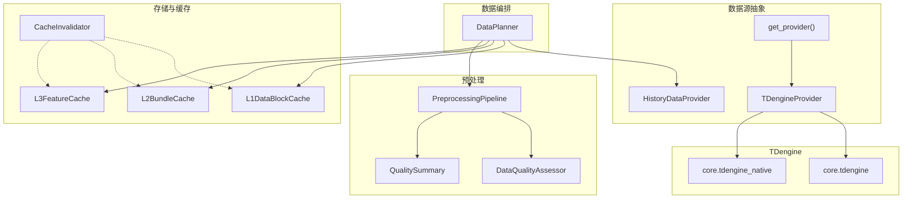
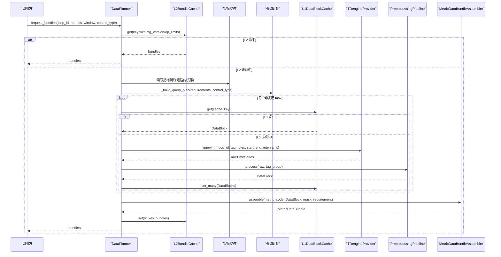
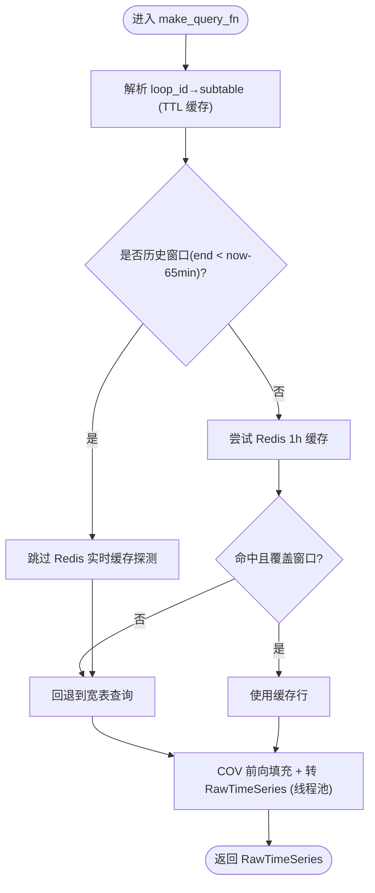
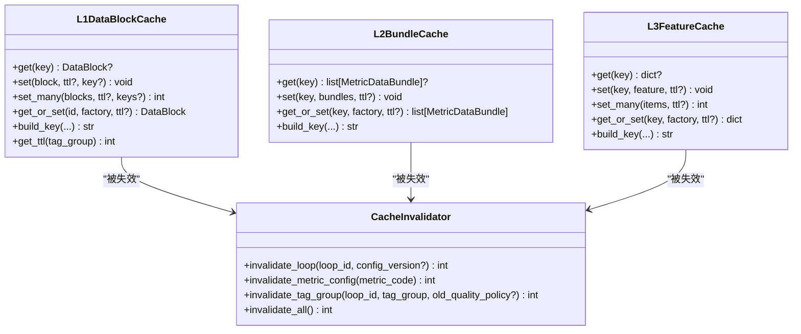
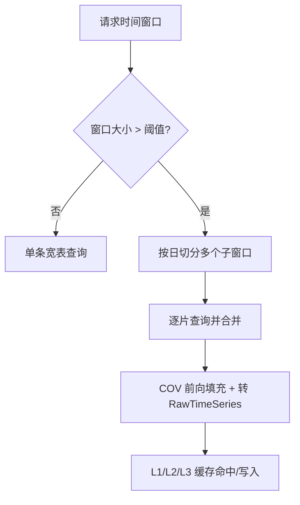
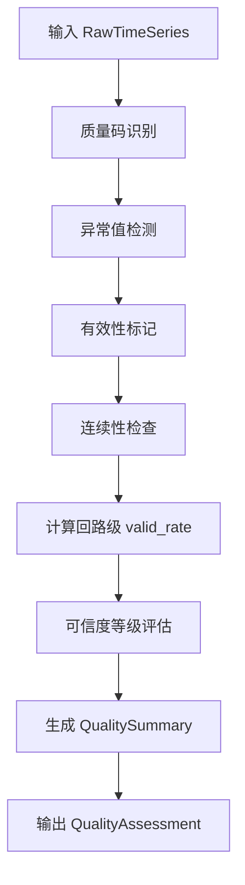
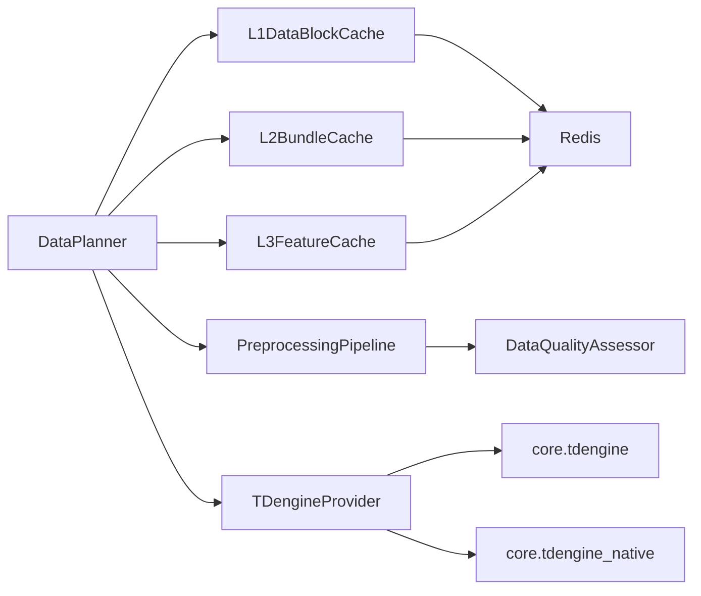

# DataPlanner 数据规划器

<cite>
**本文引用的文件**
- [backend/app/services/data_planner.py](file://backend/app/services/data_planner.py)
- [backend/app/services/data_source/base.py](file://backend/app/services/data_source/base.py)
- [backend/app/services/data_source/factory.py](file://backend/app/services/data_source/factory.py)
- [backend/app/services/data_source/tdengine_provider.py](file://backend/app/services/data_source/tdengine_provider.py)
- [backend/app/core/tdengine_native.py](file://backend/app/core/tdengine_native.py)
- [backend/app/core/tdengine.py](file://backend/app/core/tdengine.py)
- [backend/app/services/cache/l1_datablock.py](file://backend/app/services/cache/l1_datablock.py)
- [backend/app/services/cache/l2_bundle.py](file://backend/app/services/cache/l2_bundle.py)
- [backend/app/services/cache/l3_feature.py](file://backend/app/services/cache/l3_feature.py)
- [backend/app/services/cache/invalidation.py](file://backend/app/services/cache/invalidation.py)
- [backend/app/services/preprocessing/data_quality_assessor.py](file://backend/app/services/preprocessing/data_quality_assessor.py)
- [backend/app/services/preprocessing/quality_summary.py](file://backend/app/services/preprocessing/quality_summary.py)
- [backend/app/services/preprocessing/pipeline.py](file://backend/app/services/preprocessing/pipeline.py)
- [backend/app/tasks/kpi_calc.py](file://backend/app/tasks/kpi_calc.py)
</cite>

## 目录
1. [简介](#简介)
2. [项目结构](#项目结构)
3. [核心组件](#核心组件)
4. [架构总览](#架构总览)
5. [详细组件分析](#详细组件分析)
6. [依赖关系分析](#依赖关系分析)
7. [性能考量](#性能考量)
8. [故障排查指南](#故障排查指南)
9. [结论](#结论)
10. [附录](#附录)

## 简介
DataPlanner 是 CLPM 后端的数据编排中枢，负责“指标驱动”的数据获取与组装：读取指标契约、合并查询计划、通过统一数据源适配层从 TDengine（或远端 API）取数、执行预处理、写入缓存并组装 MetricDataBundle。其设计目标是在高并发、多回路、多指标场景下，以最小化数据库访问和重复计算为代价，提供稳定、可观测、可扩展的数据供给能力。

## 项目结构
DataPlanner 位于 services 层，围绕“统一数据源抽象 + 三层缓存 + 预处理流水线 + 配置失效”的体系组织代码。关键目录与职责如下：
- data_planner.py：编排入口，构建查询计划、调度 L1/L2 缓存、触发预处理与 Bundle 组装。
- data_source/*：统一数据源抽象与实现（TDengineProvider、RemoteApi 等），对外暴露与 DataPlanner 兼容的查询函数签名。
- cache/*：L1 DataBlock 缓存、L2 Bundle 缓存、L3 特征缓存，以及配置变更时的失效策略。
- preprocessing/*：质量评估、有效性标记、连续性检查、可信度等级等预处理步骤。
- core/tdengine*：TDengine 连接、宽表查询、REST 封装与时区处理。
- tasks/kpi_calc.py：批量 KPI 计算任务，调用 DataPlanner 进行窗口级批处理。

图表来源
- [backend/app/services/data_planner.py:150-346](file://backend/app/services/data_planner.py#L150-L346)
- [backend/app/services/data_source/base.py:30-85](file://backend/app/services/data_source/base.py#L30-L85)
- [backend/app/services/data_source/factory.py:25-49](file://backend/app/services/data_source/factory.py#L25-L49)
- [backend/app/services/data_source/tdengine_provider.py:66-232](file://backend/app/services/data_source/tdengine_provider.py#L66-L232)
- [backend/app/core/tdengine.py:351-377](file://backend/app/core/tdengine.py#L351-L377)
- [backend/app/core/tdengine_native.py:321-354](file://backend/app/core/tdengine_native.py#L321-L354)
- [backend/app/services/cache/l1_datablock.py:61-123](file://backend/app/services/cache/l1_datablock.py#L61-L123)
- [backend/app/services/cache/l2_bundle.py:54-112](file://backend/app/services/cache/l2_bundle.py#L54-L112)
- [backend/app/services/cache/l3_feature.py:45-95](file://backend/app/services/cache/l3_feature.py#L45-L95)
- [backend/app/services/cache/invalidation.py:34-144](file://backend/app/services/cache/invalidation.py#L34-L144)

章节来源
- [backend/app/services/data_planner.py:1-40](file://backend/app/services/data_planner.py#L1-L40)
- [backend/app/services/data_source/__init__.py:1-19](file://backend/app/services/data_source/__init__.py#L1-L19)

## 核心组件
- DataPlanner：指标驱动的查询计划合并、缓存命中优先、预处理与 Bundle 组装的统一入口。
- 统一数据源抽象：HistoryDataProvider 协议 + get_provider 工厂，屏蔽底层 TDengine/远端 API 差异。
- 三层缓存：L1 DataBlock（zstd 压缩 + Pipeline）、L2 Bundle（组装去重）、L3 特征（中间结果复用）。
- 预处理流水线：质量码识别、异常值检测、有效性标记、连续性检查、可信度等级评估。
- 配置失效：基于 Redis SCAN 的非阻塞失效，支持回路/指标/tagGroup 粒度。

章节来源
- [backend/app/services/data_planner.py:150-346](file://backend/app/services/data_planner.py#L150-L346)
- [backend/app/services/data_source/base.py:30-85](file://backend/app/services/data_source/base.py#L30-L85)
- [backend/app/services/cache/l1_datablock.py:61-123](file://backend/app/services/cache/l1_datablock.py#L61-L123)
- [backend/app/services/cache/l2_bundle.py:54-112](file://backend/app/services/cache/l2_bundle.py#L54-L112)
- [backend/app/services/cache/l3_feature.py:45-95](file://backend/app/services/cache/l3_feature.py#L45-L95)
- [backend/app/services/preprocessing/data_quality_assessor.py:82-183](file://backend/app/services/preprocessing/data_quality_assessor.py#L82-L183)
- [backend/app/services/cache/invalidation.py:34-144](file://backend/app/services/cache/invalidation.py#L34-L144)

## 架构总览
DataPlanner 的核心流程：
1. 加载回路预处理配置（含 config_version）。
2. 尝试 L2 Bundle 缓存命中（包含 metrics、时间窗口、控制类型、OP 限位、cfg_version）。
3. 读取指标契约，按 tagGroup 合并查询计划（BASE 复用 HF 派生）。
4. 并行执行非复用 task：查 L1 → 未命中则回源 TDengine → 预处理 → Pipeline 批量写 L1。
5. 从 BASE 派生 HF 组 DataBlock（不额外查库）。
6. 组装 MetricDataBundle，填充 OP 输出限位，写入 L2（若本次未命中）。
7. 可选：L3 特征缓存用于滚动窗口增量计算与复杂指标中间值复用。

图表来源
- [backend/app/services/data_planner.py:208-346](file://backend/app/services/data_planner.py#L208-L346)
- [backend/app/services/data_source/tdengine_provider.py:126-232](file://backend/app/services/data_source/tdengine_provider.py#L126-L232)
- [backend/app/services/cache/l1_datablock.py:128-180](file://backend/app/services/cache/l1_datablock.py#L128-L180)
- [backend/app/services/cache/l2_bundle.py:118-166](file://backend/app/services/cache/l2_bundle.py#L118-L166)

## 详细组件分析

### 统一数据读取架构与多数据源适配
- 抽象层：HistoryDataProvider 定义 make_query_fn 与 query_trend_data 接口，返回与 DataPlanner 兼容的 QueryFn。
- 工厂：get_provider 固定返回本地 TDengineProvider（计算路径一律本地），远端 API 仅用于历史数据导入任务。
- TDengineProvider：
  - 宽表一次查询替代窄表多次查询，提升吞吐。
  - 最近 1 小时数据优先走 Redis 实时缓存探测，历史窗口直接跳过探测。
  - COV 列前向填充，RawTimeSeries 转换在线程池执行，避免阻塞事件循环。
  - 时区口径统一：存储侧 Asia/Shanghai 墙钟串，查询边界带 Z 的 UTC ISO 串，比较前解析为 naive UTC。

图表来源
- [backend/app/services/data_source/tdengine_provider.py:74-232](file://backend/app/services/data_source/tdengine_provider.py#L74-L232)
- [backend/app/core/tdengine_native.py:321-354](file://backend/app/core/tdengine_native.py#L321-L354)

章节来源
- [backend/app/services/data_source/base.py:30-85](file://backend/app/services/data_source/base.py#L30-L85)
- [backend/app/services/data_source/factory.py:1-49](file://backend/app/services/data_source/factory.py#L1-L49)
- [backend/app/services/data_source/tdengine_provider.py:66-232](file://backend/app/services/data_source/tdengine_provider.py#L66-L232)
- [backend/app/core/tdengine.py:351-377](file://backend/app/core/tdengine.py#L351-L377)

### 三层缓存架构与失效机制
- L1 DataBlock 缓存：
  - Key 包含 loop_id、tag_group、时间窗口 epoch、采样频率、质量策略、预处理版本、配置版本。
  - zstd 压缩 + base64 编码，分层 TTL（BASE 长周期、高频短周期）。
  - Pipeline 批量写入减少 RTT；空 DataBlock 不写（负缓存避免脏命中）。
- L2 Bundle 缓存：
  - Key 包含 metrics_hash、window_hash、control_type、op_limits_hash、cfg_version。
  - 命中后跳过 Bundle 组装，适合组合调用场景（如批量 KPI）。
- L3 特征缓存：
  - Key 包含 metric_code、feature_name、window_hash。
  - 缓存 ARMA 参数、IAE 累积值、统计量等中间结果，支持滚动窗口增量计算。
- 失效策略：
  - 回路配置变更：删除该回路全部 pdb*:{loopId}:* 键。
  - 指标配置变更：保守全量清理 pdb*:*。
  - tagGroup 精准失效：仅 L1 指定 tagGroup 键。
  - 全量清理：预处理版本升级时使用。

图表来源
- [backend/app/services/cache/l1_datablock.py:61-123](file://backend/app/services/cache/l1_datablock.py#L61-L123)
- [backend/app/services/cache/l2_bundle.py:54-112](file://backend/app/services/cache/l2_bundle.py#L54-L112)
- [backend/app/services/cache/l3_feature.py:45-95](file://backend/app/services/cache/l3_feature.py#L45-L95)
- [backend/app/services/cache/invalidation.py:34-144](file://backend/app/services/cache/invalidation.py#L34-L144)

章节来源
- [backend/app/services/cache/l1_datablock.py:61-123](file://backend/app/services/cache/l1_datablock.py#L61-L123)
- [backend/app/services/cache/l2_bundle.py:54-112](file://backend/app/services/cache/l2_bundle.py#L54-L112)
- [backend/app/services/cache/l3_feature.py:45-95](file://backend/app/services/cache/l3_feature.py#L45-L95)
- [backend/app/services/cache/invalidation.py:34-144](file://backend/app/services/cache/invalidation.py#L34-L144)

### 时间窗口查询优化技术
- 滑动窗口与分片查询：
  - 宽表大窗口按日分片查询，首尾片使用原始时间串避免精度漂移，合并结果。
- 增量计算与预聚合：
  - L3 特征缓存保存 sum/sumSq/count/ΔOP 等统计量，支撑滚动窗口增量更新。
  - 批量计算中通过 L2 Bundle 缓存避免同批次重复组装。
- 采样策略：
  - KPI 计算路径不进行 LTTB 降采样，保持全量点参与运算；HF tagGroup 固定 1s 采样（元数据）。

图表来源
- [backend/app/core/tdengine_native.py:321-354](file://backend/app/core/tdengine_native.py#L321-L354)
- [backend/app/services/cache/l3_feature.py:45-95](file://backend/app/services/cache/l3_feature.py#L45-L95)
- [backend/app/services/data_planner.py:16-39](file://backend/app/services/data_planner.py#L16-L39)

章节来源
- [backend/app/core/tdengine_native.py:321-354](file://backend/app/core/tdengine_native.py#L321-L354)
- [backend/app/services/cache/l3_feature.py:45-95](file://backend/app/services/cache/l3_feature.py#L45-L95)
- [backend/app/services/data_planner.py:16-39](file://backend/app/services/data_planner.py#L16-L39)

### 数据质量评估流程
- 质量码识别：从 PV 质量码与信号状态识别质量状态。
- 异常值检测：8 类异常原因码，在原始工程值上按量程判定。
- 有效性标记：生成各 tag 的 validity 列表。
- 连续性检查：计算连续有效段，满足最小连续点数要求。
- 可信度等级：基于核心 tag（pv/sp/op/mode）交集 / point_count 计算回路级 valid_rate，并映射为置信等级。
- 质量摘要：审计用汇总（缺失率、好值率等）。

图表来源
- [backend/app/services/preprocessing/data_quality_assessor.py:82-183](file://backend/app/services/preprocessing/data_quality_assessor.py#L82-L183)
- [backend/app/services/preprocessing/quality_summary.py:40-70](file://backend/app/services/preprocessing/quality_summary.py#L40-L70)
- [backend/app/services/preprocessing/pipeline.py:138-156](file://backend/app/services/preprocessing/pipeline.py#L138-L156)

章节来源
- [backend/app/services/preprocessing/data_quality_assessor.py:82-183](file://backend/app/services/preprocessing/data_quality_assessor.py#L82-L183)
- [backend/app/services/preprocessing/quality_summary.py:40-70](file://backend/app/services/preprocessing/quality_summary.py#L40-L70)
- [backend/app/services/preprocessing/pipeline.py:138-156](file://backend/app/services/preprocessing/pipeline.py#L138-L156)

### 性能监控指标与调试工具
- 日志与指标：
  - DataPlanner 记录 L1/L2 命中/未命中、查询耗时、预处理耗时、缓存写入数量。
  - TDengineProvider 记录 Redis 缓存命中、宽表查询失败、COV 填充行数。
  - 批量 KPI 任务记录每窗口成功/失败/耗时。
- 调试建议：
  - 观察 L1/L2 命中率，定位热点 tagGroup 与窗口。
  - 检查配置版本（cfg_version）是否导致频繁失效。
  - 关注时区问题（Z 后缀与 naive 字符串比较）。
  - 对异常数据块，查看 quality_summary.valid_rate 与 outlier_reasons。

章节来源
- [backend/app/services/data_planner.py:238-346](file://backend/app/services/data_planner.py#L238-L346)
- [backend/app/services/data_source/tdengine_provider.py:146-232](file://backend/app/services/data_source/tdengine_provider.py#L146-L232)
- [backend/app/tasks/kpi_calc.py:2961-2995](file://backend/app/tasks/kpi_calc.py#L2961-L2995)

### 自定义数据源适配器开发指南与集成示例
- 实现 HistoryDataProvider 协议：
  - make_query_fn(db) → QueryFn：返回与 DataPlanner 兼容的闭包。
  - query_trend_data(tag_name, start_time, end_time, sample_interval)：兼容遗留趋势查询。
  - close()：释放资源。
- 集成方式：
  - 通过 get_provider() 获取 Provider 单例（当前固定为 TDengineProvider）。
  - 将 make_query_fn 返回的查询函数注入 DataPlanner 构造参数 tdengine_query_fn。
- 注意事项：
  - 保持 RawTimeSeries 结构与字段一致（timestamps、signals、quality_codes）。
  - 时区与窗口边界需遵循统一格式（带 Z 的 UTC ISO 串）。
  - 对于 COV 列，需在前向填充后展开为完整曲线。

章节来源
- [backend/app/services/data_source/base.py:30-85](file://backend/app/services/data_source/base.py#L30-L85)
- [backend/app/services/data_source/factory.py:25-49](file://backend/app/services/data_source/factory.py#L25-L49)
- [backend/app/services/data_source/tdengine_provider.py:74-232](file://backend/app/services/data_source/tdengine_provider.py#L74-L232)

## 依赖关系分析
- DataPlanner 依赖：
  - L1/L2/L3 缓存模块（Redis 客户端）。
  - 预处理流水线（质量评估、可信度评估）。
  - 数据源抽象（QueryFn）。
- 数据源层依赖：
  - TDengine 核心（REST/原生连接池）。
  - Redis 实时缓存（SignalR Hub 订阅者）。
- 缓存层依赖：
  - Redis（SCAN/DEL/Pipeline）。
  - zstandard（压缩/解压）。
- 预处理依赖：
  - 质量码与异常检测规则。
  - 可信度评估器。

图表来源
- [backend/app/services/data_planner.py:150-346](file://backend/app/services/data_planner.py#L150-L346)
- [backend/app/services/data_source/tdengine_provider.py:66-232](file://backend/app/services/data_source/tdengine_provider.py#L66-L232)
- [backend/app/services/cache/l1_datablock.py:61-123](file://backend/app/services/cache/l1_datablock.py#L61-L123)
- [backend/app/services/cache/l2_bundle.py:54-112](file://backend/app/services/cache/l2_bundle.py#L54-L112)
- [backend/app/services/cache/l3_feature.py:45-95](file://backend/app/services/cache/l3_feature.py#L45-L95)

章节来源
- [backend/app/services/data_planner.py:150-346](file://backend/app/services/data_planner.py#L150-L346)
- [backend/app/services/data_source/tdengine_provider.py:66-232](file://backend/app/services/data_source/tdengine_provider.py#L66-L232)
- [backend/app/services/cache/l1_datablock.py:61-123](file://backend/app/services/cache/l1_datablock.py#L61-L123)
- [backend/app/services/cache/l2_bundle.py:54-112](file://backend/app/services/cache/l2_bundle.py#L54-L112)
- [backend/app/services/cache/l3_feature.py:45-95](file://backend/app/services/cache/l3_feature.py#L45-L95)

## 性能考量
- 查询合并与复用：
  - tagGroup 合并与 BASE 复用，显著减少 TDengine 查询次数。
- 缓存优化：
  - L1 分层 TTL 与 zstd 压缩降低内存与网络开销。
  - L2 组装去重避免重复 Bundle 构建。
  - L3 特征缓存支撑滚动窗口增量计算。
- 并发与 I/O：
  - asyncio.gather 并行执行非复用 task。
  - 预处理与 COV 填充在线程池执行，避免阻塞事件循环。
- 窗口分片：
  - 大窗口按日切分，避免单次查询过大。

[本节为通用性能讨论，无需特定文件引用]

## 故障排查指南
- 缓存未命中：
  - 检查 L1/L2 Key 生成逻辑（时间窗口、cfg_version、OP 限位）。
  - 确认配置变更后是否触发失效（CacheInvalidator）。
- 数据为空：
  - 检查 TDengine 宽表查询是否返回空（子表名解析、时区格式）。
  - 查看 Redis 实时缓存探测是否被历史窗口跳过。
- 质量与可信度：
  - 查看 quality_summary.valid_rate 与 outlier_reasons。
  - 确认核心 tag 完整性（pv/sp/op/mode）。
- 批量任务失败：
  - 检查 kpi_calc 子任务日志与失败窗口列表。

章节来源
- [backend/app/services/cache/invalidation.py:52-144](file://backend/app/services/cache/invalidation.py#L52-L144)
- [backend/app/services/data_source/tdengine_provider.py:146-232](file://backend/app/services/data_source/tdengine_provider.py#L146-L232)
- [backend/app/services/preprocessing/data_quality_assessor.py:82-183](file://backend/app/services/preprocessing/data_quality_assessor.py#L82-L183)
- [backend/app/tasks/kpi_calc.py:2961-2995](file://backend/app/tasks/kpi_calc.py#L2961-L2995)

## 结论
DataPlanner 通过“指标驱动 + 统一数据源抽象 + 三层缓存 + 预处理流水线 + 配置失效”的架构，实现了高吞吐、低延迟、可扩展的数据供给能力。其在多数据源适配、缓存策略、时间窗口优化与数据质量评估方面提供了系统化的解决方案，并通过完善的日志与失效机制保障生产稳定性。

[本节为总结性内容，无需特定文件引用]

## 附录
- 关键术语：
  - tagGroup：数据分组（BASE、OP_HF、PVOP_HF、MODE_HF、QUALITY_HF、CONFIG）。
  - DataBlock：预处理后的标准化数据块。
  - MetricDataBundle：指标计算所需的数据包（含血缘信息）。
  - RawTimeSeries：原始时序数据结构（timestamps、signals、quality_codes）。
- 参考设计文档：
  - ADS §10.7（缓存策略）、§2/§8（数据流）、FDS §5.3.9（缓存实现）、PRD §8.1-8.3（需求对齐）。

[本节为概念性说明，无需特定文件引用]