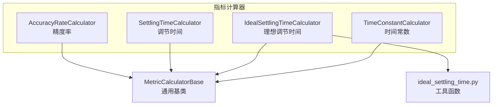
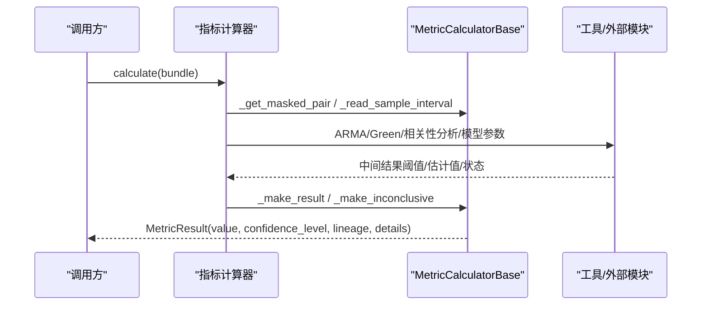
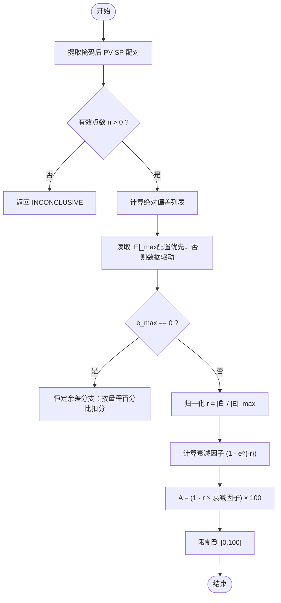
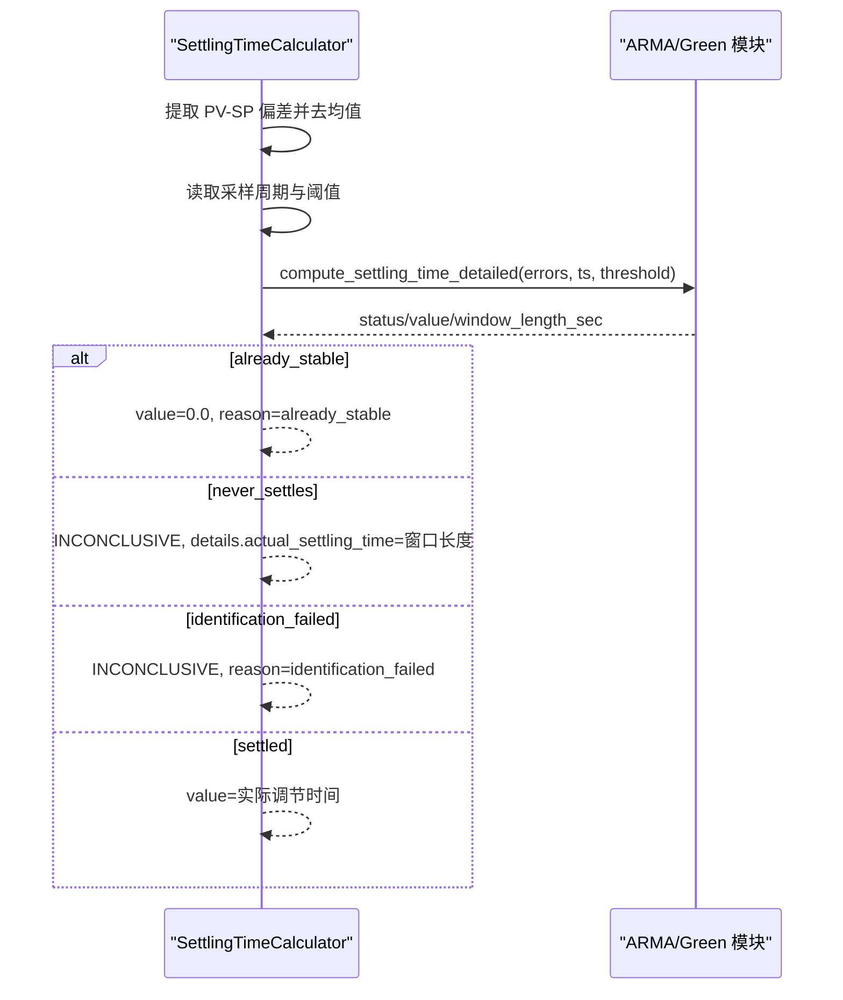
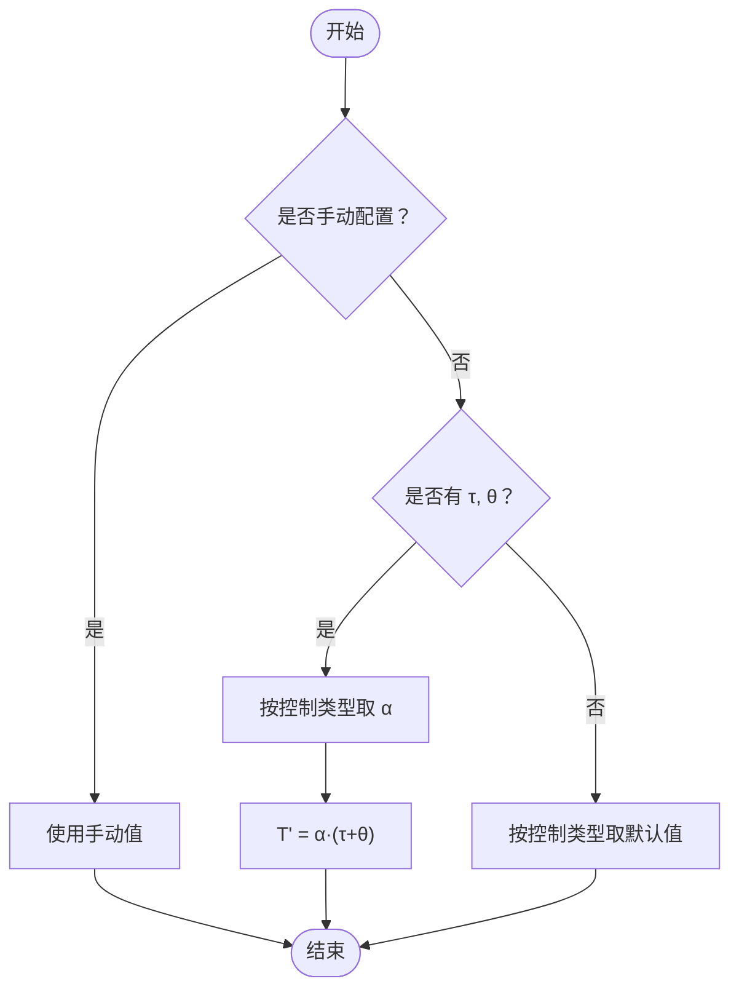
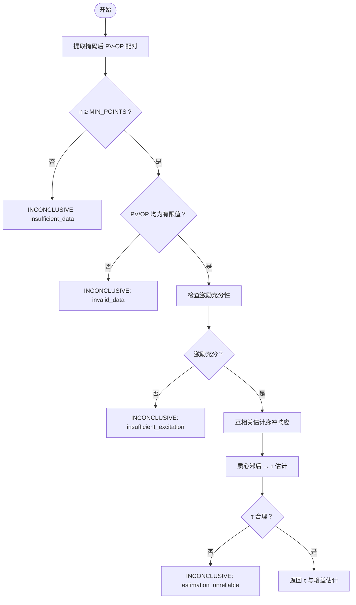
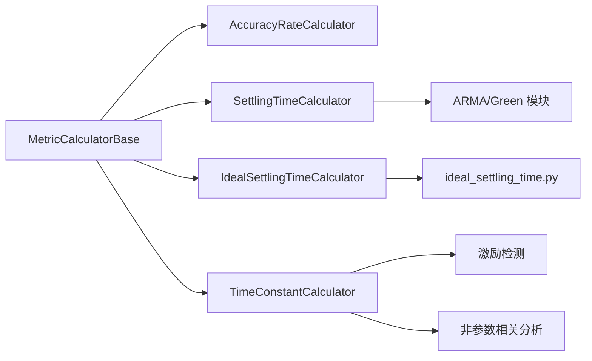

# 动态特性指标计算器

<cite>
**本文引用的文件**
- [backend/app/services/metric_calculator/accuracy.py](file://backend/app/services/metric_calculator/accuracy.py)
- [backend/app/services/metric_calculator/settling_time.py](file://backend/app/services/metric_calculator/settling_time.py)
- [backend/app/services/metric_calculator/ideal_settling_time.py](file://backend/app/services/metric_calculator/ideal_settling_time.py)
- [backend/app/services/metric_calculator/time_constant.py](file://backend/app/services/metric_calculator/time_constant.py)
- [backend/app/services/metric_calculator/base.py](file://backend/app/services/metric_calculator/base.py)
- [backend/app/utils/ideal_settling_time.py](file://backend/app/utils/ideal_settling_time.py)
- [backend/tests/test_metric_calculator/test_accuracy.py](file://backend/tests/test_metric_calculator/test_accuracy.py)
- [backend/tests/test_metric_calculator/test_settling_time.py](file://backend/tests/test_metric_calculator/test_settling_time.py)
- [backend/tests/test_metric_calculator/test_ideal_settling_time.py](file://backend/tests/test_metric_calculator/test_ideal_settling_time.py)
</cite>

## 目录
1. [简介](#简介)
2. [项目结构](#项目结构)
3. [核心组件](#核心组件)
4. [架构总览](#架构总览)
5. [详细组件分析](#详细组件分析)
6. [依赖关系分析](#依赖关系分析)
7. [性能考虑](#性能考虑)
8. [故障排查指南](#故障排查指南)
9. [结论](#结论)
10. [附录](#附录)

## 简介
本技术文档聚焦于“动态特性指标计算器”，围绕以下关键指标展开：
- accuracy_rate（精度率）：基于设定值跟踪误差的统计与归一化，给出回路稳态偏差的综合评分。
- settling_time（调节时间）：通过阶跃响应分析与模型辨识，识别收敛时刻并计算实际调节时间。
- ideal_settling_time（理想调节时间）：提供理论最优基准，支持手动配置、模型参数计算与控制类型默认值。
- time_constant（时间常数）：从闭环数据中粗估过程时间常数，用于惯性环节识别与动态特性评估。

文档同时覆盖时域分析方法、频域相关技术、模型拟合思路，以及诊断分析与控制器整定指导。

## 项目结构
动态特性指标由一组可复用的计算器实现，统一继承自基类，遵循一致的输入输出契约与可信度判定策略。

图表来源
- [backend/app/services/metric_calculator/accuracy.py:36-163](file://backend/app/services/metric_calculator/accuracy.py#L36-L163)
- [backend/app/services/metric_calculator/settling_time.py:48-163](file://backend/app/services/metric_calculator/settling_time.py#L48-L163)
- [backend/app/services/metric_calculator/ideal_settling_time.py:49-103](file://backend/app/services/metric_calculator/ideal_settling_time.py#L49-L103)
- [backend/app/services/metric_calculator/time_constant.py:50-133](file://backend/app/services/metric_calculator/time_constant.py#L50-L133)
- [backend/app/services/metric_calculator/base.py:42-238](file://backend/app/services/metric_calculator/base.py#L42-L238)
- [backend/app/utils/ideal_settling_time.py:67-136](file://backend/app/utils/ideal_settling_time.py#L67-L136)

章节来源
- [backend/app/services/metric_calculator/base.py:42-238](file://backend/app/services/metric_calculator/base.py#L42-L238)

## 核心组件
- 精度率（accuracy_rate）
  - 目标：衡量 PV 对 SP 的跟踪准确度，反映余差情况。
  - 方法：计算平均绝对偏差 |Ē|，数据驱动或配置指定 |E|_max，归一化为 r = |Ē|/|E|_max，采用指数型衰减因子 (1 - e^{-r}) 计算准确率。
  - 退化处理：当 e_max=0 且存在恒定余差时，按量程百分比扣分；零偏差直接满分。
  - 参考路径：[accuracy.py:36-163](file://backend/app/services/metric_calculator/accuracy.py#L36-L163)

- 调节时间（settling_time）
  - 目标：估计系统进入稳态带的时间（秒）。
  - 方法：提取控制偏差序列（去均值），ARMA 模型辨识 + Green 函数递推，首次持续低于阈值的时刻即为调节时间。
  - 边界语义：已稳态返回 0；窗口内不衰减或辨识失败返回 INCONCLUSIVE，并在 details 中携带窗口长度等上下文。
  - 参考路径：[settling_time.py:48-163](file://backend/app/services/metric_calculator/settling_time.py#L48-L163)

- 理想调节时间（ideal_settling_time）
  - 目标：为快速率等指标提供基准 T'。
  - 优先级：手动配置 > 模型参数计算 T' = α·(τ+θ) > 控制类型默认值。
  - 经验系数 α 与控制类型默认值见工具模块。
  - 参考路径：[ideal_settling_time.py:49-103](file://backend/app/services/metric_calculator/ideal_settling_time.py#L49-L103), [ideal_settling_time.py:120-133](file://backend/app/services/metric_calculator/ideal_settling_time.py#L120-L133), [utils/ideal_settling_time.py:67-136](file://backend/app/utils/ideal_settling_time.py#L67-L136)

- 时间常数（time_constant）
  - 目标：在闭环评估窗下粗估过程时间常数 τ。
  - 方法：OP→PV 互相关估计脉冲响应，质心滞后作为 τ 粗估；先做激励充分性检测，避免伪相关。
  - 合理性约束：τ 需为正且不超过物理上限，否则视为不可信。
  - 参考路径：[time_constant.py:50-133](file://backend/app/services/metric_calculator/time_constant.py#L50-L133)

章节来源
- [backend/app/services/metric_calculator/accuracy.py:36-163](file://backend/app/services/metric_calculator/accuracy.py#L36-L163)
- [backend/app/services/metric_calculator/settling_time.py:48-163](file://backend/app/services/metric_calculator/settling_time.py#L48-L163)
- [backend/app/services/metric_calculator/ideal_settling_time.py:49-103](file://backend/app/services/metric_calculator/ideal_settling_time.py#L49-L103)
- [backend/app/services/metric_calculator/time_constant.py:50-133](file://backend/app/services/metric_calculator/time_constant.py#L50-L133)
- [backend/app/utils/ideal_settling_time.py:67-136](file://backend/app/utils/ideal_settling_time.py#L67-L136)

## 架构总览
所有指标计算器统一通过 MetricDataBundle 输入信号与掩码信息，使用基类提供的有效点提取、可信度判定与结果构造能力，保证一致的数据血缘与置信度标注。

图表来源
- [backend/app/services/metric_calculator/base.py:144-238](file://backend/app/services/metric_calculator/base.py#L144-L238)
- [backend/app/services/metric_calculator/settling_time.py:59-163](file://backend/app/services/metric_calculator/settling_time.py#L59-L163)
- [backend/app/services/metric_calculator/time_constant.py:62-133](file://backend/app/services/metric_calculator/time_constant.py#L62-L133)

## 详细组件分析

### 精度率（accuracy_rate）
- 设定值跟踪误差
  - 计算平均绝对偏差 |Ē|，并依据数据驱动或配置获取 |E|_max。
  - 归一化偏差 r = |Ē|/|E|_max ∈ [0,1]（数据驱动）或更大（大偏差场景）。
- 稳态偏差分析
  - 指数衰减因子 (1 - e^{-r}) 对小偏差惩罚低、大偏差惩罚高，符合工业评价习惯。
  - 退化分支：e_max=0 且存在恒定余差时，按量程 5% 容限扣分；零偏差直接满分。
- 精度等级评定
  - 结果范围 0~100，结合回路级可信度等级输出。
  - 支持 e_max_percentile 截断以抑制极端偏差对 |E|_max 的影响。

图表来源
- [backend/app/services/metric_calculator/accuracy.py:47-163](file://backend/app/services/metric_calculator/accuracy.py#L47-L163)

章节来源
- [backend/app/services/metric_calculator/accuracy.py:36-163](file://backend/app/services/metric_calculator/accuracy.py#L36-L163)
- [backend/tests/test_metric_calculator/test_accuracy.py:23-196](file://backend/tests/test_metric_calculator/test_accuracy.py#L23-L196)

### 调节时间（settling_time）
- 阶跃响应分析
  - 提取控制偏差序列（PV - SP），去均值后作为输入。
  - 采样周期解析（如 "5s" → 5.0），影响最终时间单位换算。
- 收敛判断
  - ARMA 模型辨识 + Green 函数递推，寻找首次持续低于阈值的时刻。
  - 阈值可从算法配置读取（默认 5%）。
- 调节过程识别
  - 三种语义：already_stable（已稳态）、never_settles（窗口内不衰减）、identification_failed（辨识失败）。
  - never_settles 时 details 携带窗口长度，供快速率等后续指标使用。

图表来源
- [backend/app/services/metric_calculator/settling_time.py:59-163](file://backend/app/services/metric_calculator/settling_time.py#L59-L163)

章节来源
- [backend/app/services/metric_calculator/settling_time.py:48-163](file://backend/app/services/metric_calculator/settling_time.py#L48-L163)
- [backend/tests/test_metric_calculator/test_settling_time.py:22-146](file://backend/tests/test_metric_calculator/test_settling_time.py#L22-L146)

### 理想调节时间（ideal_settling_time）
- 理论最优值计算
  - 手动配置最高优先级；其次基于过程模型参数 T' = α·(τ+θ)。
  - 若均缺失，则按控制类型取默认值（FC/PC/TC/LC/CC）。
- 实际性能对比
  - 与 settling_time 结合，可计算快速率 F（T ≤ T' 时为 100%，否则按指数映射）。
- 调节效率分析
  - 通过比较实际与理想调节时间，评估回路响应效率与瓶颈。

图表来源
- [backend/app/services/metric_calculator/ideal_settling_time.py:60-103](file://backend/app/services/metric_calculator/ideal_settling_time.py#L60-L103)
- [backend/app/utils/ideal_settling_time.py:67-136](file://backend/app/utils/ideal_settling_time.py#L67-L136)

章节来源
- [backend/app/services/metric_calculator/ideal_settling_time.py:49-103](file://backend/app/services/metric_calculator/ideal_settling_time.py#L49-L103)
- [backend/app/utils/ideal_settling_time.py:67-136](file://backend/app/utils/ideal_settling_time.py#L67-L136)
- [backend/tests/test_metric_calculator/test_ideal_settling_time.py:25-139](file://backend/tests/test_metric_calculator/test_ideal_settling_time.py#L25-L139)

### 时间常数（time_constant）
- 一阶系统辨识
  - 在闭环评估窗下，OP 激励有限，先进行激励充分性检测。
  - 激励不足时返回 INCONCLUSIVE，避免伪相关导致的错误估计。
- 惯性环节识别
  - OP→PV 互相关估计脉冲响应，质心滞后作为 τ 粗估。
  - 对 τ 的物理合理性进行截断（正数且不超过上限）。
- 动态特性参数获取
  - 输出 τ 与增益估计，辅助后续模型拟合与控制器整定。

图表来源
- [backend/app/services/metric_calculator/time_constant.py:62-133](file://backend/app/services/metric_calculator/time_constant.py#L62-L133)

章节来源
- [backend/app/services/metric_calculator/time_constant.py:50-133](file://backend/app/services/metric_calculator/time_constant.py#L50-L133)

## 依赖关系分析
- 组件耦合
  - 各计算器均依赖基类完成数据提取、可信度判定与结果构造，降低重复代码。
  - 理想调节时间还依赖工具模块提供经验系数与默认值。
- 外部依赖
  - 调节时间依赖 ARMA/Green 模块（通过任务模块导入）。
  - 时间常数依赖激励检测与非参数相关分析模块。
- 循环依赖
  - 当前实现无循环依赖；计算器之间相互独立。

图表来源
- [backend/app/services/metric_calculator/base.py:42-238](file://backend/app/services/metric_calculator/base.py#L42-L238)
- [backend/app/services/metric_calculator/ideal_settling_time.py:49-103](file://backend/app/services/metric_calculator/ideal_settling_time.py#L49-L103)
- [backend/app/utils/ideal_settling_time.py:67-136](file://backend/app/utils/ideal_settling_time.py#L67-L136)
- [backend/app/services/metric_calculator/settling_time.py:59-163](file://backend/app/services/metric_calculator/settling_time.py#L59-L163)
- [backend/app/services/metric_calculator/time_constant.py:62-133](file://backend/app/services/metric_calculator/time_constant.py#L62-L133)

章节来源
- [backend/app/services/metric_calculator/base.py:42-238](file://backend/app/services/metric_calculator/base.py#L42-L238)

## 性能考虑
- 数据量要求
  - 调节时间与时间常数均要求至少 100 个有效点，确保模型辨识与互相关估计的稳定性。
- 数值稳定性
  - 精度率使用 e^{-r} 替代 1/e^r 以避免溢出风险。
  - 时间常数对 NaN/Inf 输入直接拒绝，避免线性代数异常。
- 配置灵活性
  - 调节时间阈值、精度率 e_max_percentile 可通过算法配置调整，平衡灵敏度与鲁棒性。
- 大数据集
  - 测试覆盖 500 点及以上数据集，确保计算流程稳定。

[本节为通用性能建议，无需特定文件引用]

## 故障排查指南
- 精度率
  - 恒定余差且缺少量程：返回 INCONCLUSIVE，需补充 pv_range。
  - 数据不足或无效：valid_rate < 0.20 触发 INCONCLUSIVE。
  - 参考路径：[accuracy.py:101-130](file://backend/app/services/metric_calculator/accuracy.py#L101-L130), [base.py:171-181](file://backend/app/services/metric_calculator/base.py#L171-L181)

- 调节时间
  - 数据不足：< 100 点返回 insufficient_data。
  - 窗口内不衰减：返回 never_settles，details 含窗口长度。
  - 辨识失败：返回 identification_failed。
  - 参考路径：[settling_time.py:78-143](file://backend/app/services/metric_calculator/settling_time.py#L78-L143)

- 理想调节时间
  - 手动配置为 0：回退至模型或默认值。
  - 未知控制类型：回退默认 120 秒。
  - 参考路径：[ideal_settling_time.py:105-146](file://backend/app/services/metric_calculator/ideal_settling_time.py#L105-L146)

- 时间常数
  - 激励不足：返回 insufficient_excitation。
  - 估计不可信：τ 为负或超过上限，返回 estimation_unreliable。
  - 参考路径：[time_constant.py:88-121](file://backend/app/services/metric_calculator/time_constant.py#L88-L121)

章节来源
- [backend/app/services/metric_calculator/accuracy.py:101-130](file://backend/app/services/metric_calculator/accuracy.py#L101-L130)
- [backend/app/services/metric_calculator/settling_time.py:78-143](file://backend/app/services/metric_calculator/settling_time.py#L78-L143)
- [backend/app/services/metric_calculator/ideal_settling_time.py:105-146](file://backend/app/services/metric_calculator/ideal_settling_time.py#L105-L146)
- [backend/app/services/metric_calculator/time_constant.py:88-121](file://backend/app/services/metric_calculator/time_constant.py#L88-L121)
- [backend/app/services/metric_calculator/base.py:171-181](file://backend/app/services/metric_calculator/base.py#L171-L181)

## 结论
动态特性指标计算器通过统一的基类与清晰的职责划分，实现了精度率、调节时间、理想调节时间与时间常数的稳健计算。其设计兼顾了数据驱动与配置灵活性，提供了丰富的边界语义与诊断信息，便于工程应用中的控制器整定与性能优化。

[本节为总结性内容，无需特定文件引用]

## 附录
- 时域分析方法
  - 调节时间：ARMA 模型辨识 + Green 函数递推，阈值法判定收敛。
  - 时间常数：互相关估计脉冲响应，质心滞后作为 τ 粗估。
- 频域分析技术
  - 互相关本质与时频域变换密切相关，可用于识别主导频率与相位滞后。
- 模型拟合算法
  - ARMA(p,q) 辨识用于捕捉动态特性；Green 函数用于时域响应重建。
- 控制器整定指导
  - 利用 ideal_settling_time 作为 T' 基准，结合 settling_time 计算快速率，评估响应速度。
  - 通过 time_constant 估计 τ，辅助 PID 参数初值选择与整定策略制定。

[本节为概念性内容，无需特定文件引用]