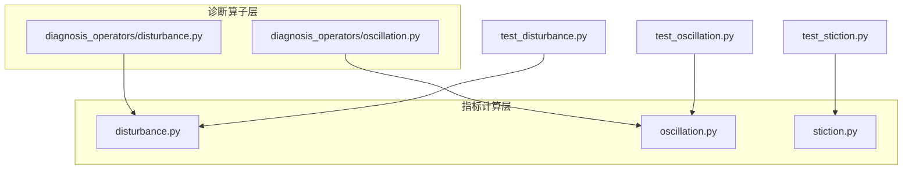
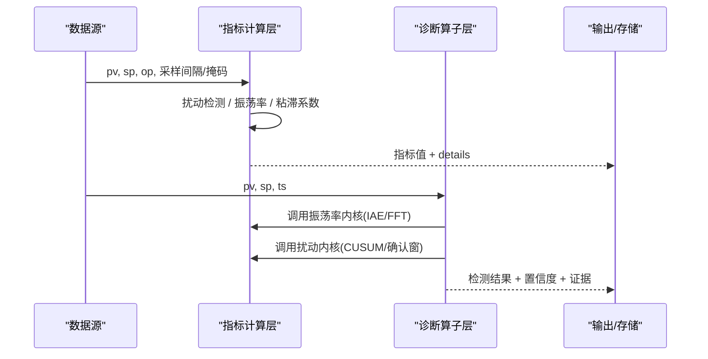
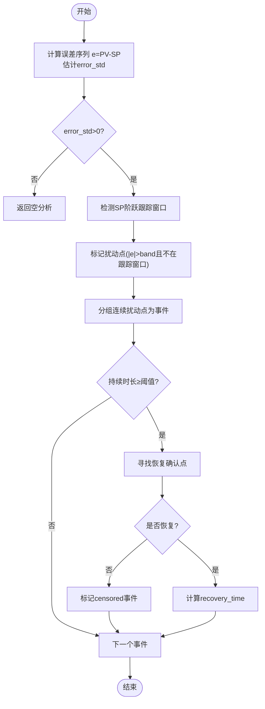
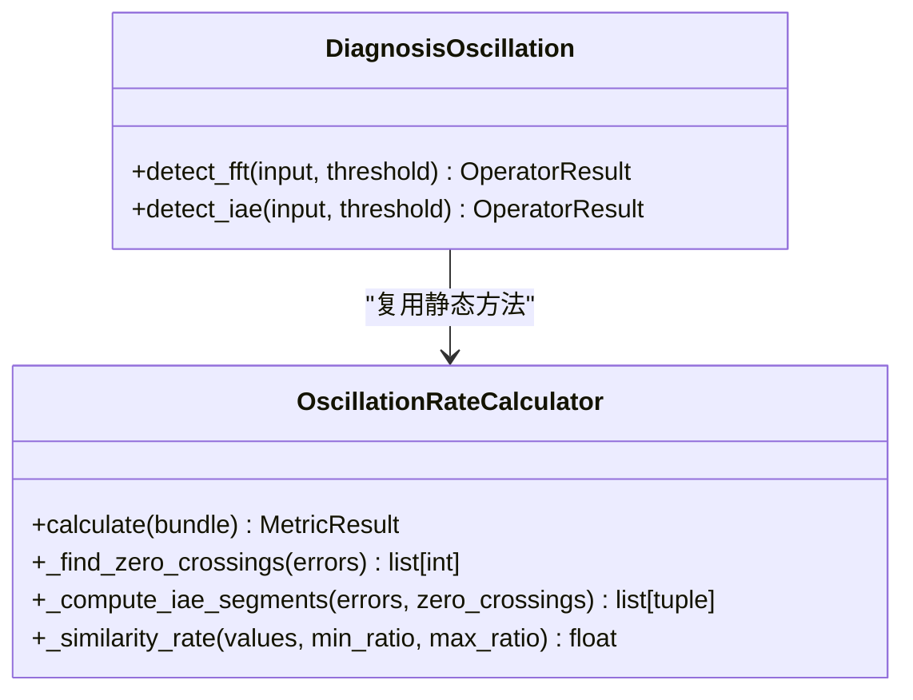
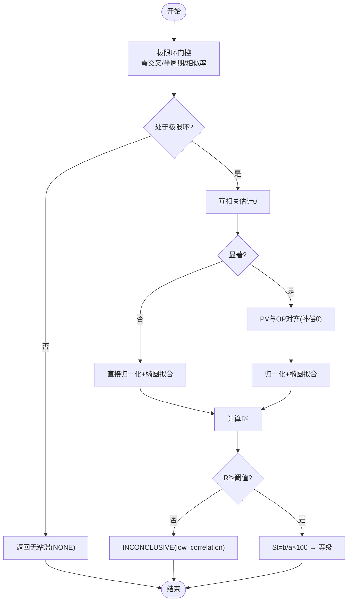
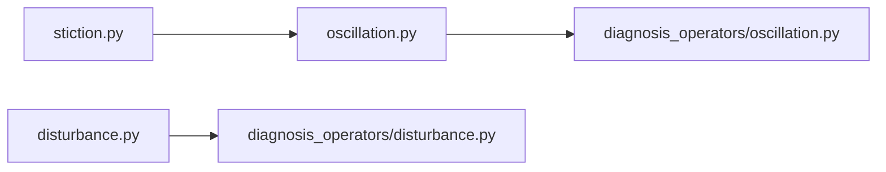

# 扰动与振荡指标计算器

<cite>
**本文引用的文件**
- [backend/app/services/metric_calculator/disturbance.py](file://backend/app/services/metric_calculator/disturbance.py)
- [backend/app/services/diagnosis_operators/oscillation.py](file://backend/app/services/diagnosis_operators/oscillation.py)
- [backend/app/services/metric_calculator/stiction.py](file://backend/app/services/metric_calculator/stiction.py)
- [backend/app/services/diagnosis_operators/disturbance.py](file://backend/app/services/diagnosis_operators/disturbance.py)
- [backend/app/services/metric_calculator/oscillation.py](file://backend/app/services/metric_calculator/oscillation.py)
- [backend/tests/test_metric_calculator/test_disturbance.py](file://backend/tests/test_metric_calculator/test_disturbance.py)
- [backend/tests/test_metric_calculator/test_oscillation.py](file://backend/tests/test_metric_calculator/test_oscillation.py)
- [backend/tests/test_metric_calculator/test_stiction.py](file://backend/tests/test_metric_calculator/test_stiction.py)
</cite>

## 目录
1. [简介](#简介)
2. [项目结构](#项目结构)
3. [核心组件](#核心组件)
4. [架构总览](#架构总览)
5. [详细组件分析](#详细组件分析)
6. [依赖关系分析](#依赖关系分析)
7. [性能考量](#性能考量)
8. [故障排查指南](#故障排查指南)
9. [结论](#结论)
10. [附录](#附录)

## 简介
本技术文档面向“扰动与振荡指标计算器”，围绕三类关键能力展开：
- 扰动检测（disturbance）：外部干扰识别、负载变化分析、扰动强度评估。
- 振荡率计算（oscillation_rate）：周期性检测、频率分析、振幅评估、振荡模式分类。
- 粘滞/摩擦死区检测（stiction）：非线性摩擦识别、死区范围估计、阀门卡涩诊断。

同时，文档说明信号处理技术（频谱分析、互相关、零交叉与积分绝对误差 IAE），并给出扰动来源分析、影响评估、抑制策略以及在扰动工况下的控制性能评估与改进建议。

## 项目结构
本项目在后端服务中按“指标计算”和“诊断算子”两层组织：
- 指标计算层（metric_calculator）：提供可复用的纯函数或计算器类，输出标准化指标结果。
- 诊断算子层（diagnosis_operators）：将算法封装为可注册、可配置的算子，供诊断引擎统一调度。

图表来源
- [backend/app/services/metric_calculator/disturbance.py:1-300](file://backend/app/services/metric_calculator/disturbance.py#L1-L300)
- [backend/app/services/metric_calculator/oscillation.py:1-264](file://backend/app/services/metric_calculator/oscillation.py#L1-L264)
- [backend/app/services/metric_calculator/stiction.py:1-467](file://backend/app/services/metric_calculator/stiction.py#L1-L467)
- [backend/app/services/diagnosis_operators/oscillation.py:1-323](file://backend/app/services/diagnosis_operators/oscillation.py#L1-L323)
- [backend/app/services/diagnosis_operators/disturbance.py:1-176](file://backend/app/services/diagnosis_operators/disturbance.py#L1-L176)

章节来源
- [backend/app/services/metric_calculator/disturbance.py:1-300](file://backend/app/services/metric_calculator/disturbance.py#L1-L300)
- [backend/app/services/metric_calculator/oscillation.py:1-264](file://backend/app/services/metric_calculator/oscillation.py#L1-L264)
- [backend/app/services/metric_calculator/stiction.py:1-467](file://backend/app/services/metric_calculator/stiction.py#L1-L467)
- [backend/app/services/diagnosis_operators/oscillation.py:1-323](file://backend/app/services/diagnosis_operators/oscillation.py#L1-L323)
- [backend/app/services/diagnosis_operators/disturbance.py:1-176](file://backend/app/services/diagnosis_operators/disturbance.py#L1-L176)

## 核心组件
- 扰动检测（disturbance）：基于误差带与恢复确认的扰动事件提取，支持非均匀采样、SP 阶跃跟踪窗口排除、删失事件处理，输出平均恢复时间等统计量。
- 振荡率（oscillation_rate）：基于偏差序列的零交叉与 IAE 相似率法，输出振荡率、是否振荡、周期；诊断算子侧还提供 FFT 频域分析与 IAE 零交叉相似率的两种检测入口。
- 粘滞系数（stiction）：基于 PV-OP 散点椭圆拟合（PCA），结合极限环门控与互相关纯滞后补偿，输出粘滞等级与拟合度等细节。

章节来源
- [backend/app/services/metric_calculator/disturbance.py:23-97](file://backend/app/services/metric_calculator/disturbance.py#L23-L97)
- [backend/app/services/metric_calculator/oscillation.py:46-165](file://backend/app/services/metric_calculator/oscillation.py#L46-L165)
- [backend/app/services/metric_calculator/stiction.py:73-216](file://backend/app/services/metric_calculator/stiction.py#L73-L216)

## 架构总览
下图展示从输入信号到指标输出的整体流程，以及诊断算子如何复用指标计算内核。

图表来源
- [backend/app/services/metric_calculator/disturbance.py:104-196](file://backend/app/services/metric_calculator/disturbance.py#L104-L196)
- [backend/app/services/metric_calculator/oscillation.py:57-165](file://backend/app/services/metric_calculator/oscillation.py#L57-L165)
- [backend/app/services/metric_calculator/stiction.py:84-216](file://backend/app/services/metric_calculator/stiction.py#L84-L216)
- [backend/app/services/diagnosis_operators/oscillation.py:246-323](file://backend/app/services/diagnosis_operators/oscillation.py#L246-L323)
- [backend/app/services/diagnosis_operators/disturbance.py:151-176](file://backend/app/services/diagnosis_operators/disturbance.py#L151-L176)

## 详细组件分析

### 扰动检测（disturbance）
- 目标：识别 PV 相对 SP 的外部扰动事件，计算恢复时间，作为抗扰性分析的关键输入。
- 关键设计：
  - 误差带判定：band = disturbance_band_sigma × error_std，避免噪声误报。
  - SP 阶跃跟踪窗口排除：通过 ideal_t 与 sample_interval 估算跟踪窗口，防止设定值变化被误判为扰动。
  - 恢复确认：连续 recovery_persistence 个点回到 band 内才认为恢复。
  - 最小扰动时长过滤：min_disturbance_duration 剔除毛刺。
  - 删失事件：窗口内未恢复的事件标记 censored，不计入恢复时间统计。
- 输出：事件列表、平均恢复时间 t_disturb、统计详情（计数、删失数、均值/方差等）。

图表来源
- [backend/app/services/metric_calculator/disturbance.py:104-196](file://backend/app/services/metric_calculator/disturbance.py#L104-L196)
- [backend/app/services/metric_calculator/disturbance.py:199-232](file://backend/app/services/metric_calculator/disturbance.py#L199-L232)
- [backend/app/services/metric_calculator/disturbance.py:235-296](file://backend/app/services/metric_calculator/disturbance.py#L235-L296)

章节来源
- [backend/app/services/metric_calculator/disturbance.py:23-97](file://backend/app/services/metric_calculator/disturbance.py#L23-L97)
- [backend/app/services/metric_calculator/disturbance.py:104-196](file://backend/app/services/metric_calculator/disturbance.py#L104-L196)
- [backend/tests/test_metric_calculator/test_disturbance.py:31-171](file://backend/tests/test_metric_calculator/test_disturbance.py#L31-L171)

### 振荡率计算（oscillation_rate）
- 目标：基于控制偏差的 IAE 零交叉规律性检测振荡，输出振荡率、是否振荡、周期。
- 算法要点：
  - 零交叉点识别：处理零值平台，避免伪穿越。
  - IAE 段计算：仅保留完整半周期段，剔除首尾残缺半周期。
  - 相似率计算：对正负半周期的 IAE 分别计算相似率 S_A/S_B，取 min(S_A,S_B)×100 为振荡率。
  - 持续时间相似率：S_TA/S_TB 作为辅助诊断输出。
- 诊断算子扩展：
  - FFT 频域分析：Hann 窗去均值后做 rfft，主峰能量占比、完整周期数、信噪比四条件判定。
  - IAE 零交叉相似率：复用 KPI 侧静态方法，保证口径一致。

图表来源
- [backend/app/services/metric_calculator/oscillation.py:46-165](file://backend/app/services/metric_calculator/oscillation.py#L46-L165)
- [backend/app/services/metric_calculator/oscillation.py:167-260](file://backend/app/services/metric_calculator/oscillation.py#L167-L260)
- [backend/app/services/diagnosis_operators/oscillation.py:49-120](file://backend/app/services/diagnosis_operators/oscillation.py#L49-L120)
- [backend/app/services/diagnosis_operators/oscillation.py:123-220](file://backend/app/services/diagnosis_operators/oscillation.py#L123-L220)

章节来源
- [backend/app/services/metric_calculator/oscillation.py:46-165](file://backend/app/services/metric_calculator/oscillation.py#L46-L165)
- [backend/app/services/diagnosis_operators/oscillation.py:223-323](file://backend/app/services/diagnosis_operators/oscillation.py#L223-L323)
- [backend/tests/test_metric_calculator/test_oscillation.py:33-200](file://backend/tests/test_metric_calculator/test_oscillation.py#L33-L200)

### 粘滞/摩擦死区检测（stiction）
- 目标：识别阀门粘滞/死区导致的非线性摩擦，输出粘滞等级与拟合度等细节。
- 算法要点：
  - 极限环门控：仅在极限环振荡段进行椭圆拟合（去均值零交叉≥4、平均半周期≥8、正负半周期 IAE 相似率≥0.6）。
  - 纯滞后 θ 补偿：通过 OP-PV 互相关估计滞后 θ̂，平移后再做 PCA 椭圆拟合，避免相位滞后被误判为粘滞宽度。
  - 椭圆拟合：PCA 求长短轴 a,b，St = b/a×100；拟合度 R² 用于有效性门控（R²<0.5 返回 INCONCLUSIVE）。
  - 等级划分：NONE/MILD/MODERATE/SEVERE。
- 诊断侧复用：assess_stiction_features 提供与 KPI 同口径的诊断入口。

图表来源
- [backend/app/services/metric_calculator/stiction.py:84-216](file://backend/app/services/metric_calculator/stiction.py#L84-L216)
- [backend/app/services/metric_calculator/stiction.py:218-279](file://backend/app/services/metric_calculator/stiction.py#L218-L279)
- [backend/app/services/metric_calculator/stiction.py:291-338](file://backend/app/services/metric_calculator/stiction.py#L291-L338)
- [backend/app/services/metric_calculator/stiction.py:364-463](file://backend/app/services/metric_calculator/stiction.py#L364-L463)

章节来源
- [backend/app/services/metric_calculator/stiction.py:73-216](file://backend/app/services/metric_calculator/stiction.py#L73-L216)
- [backend/tests/test_metric_calculator/test_stiction.py:35-200](file://backend/tests/test_metric_calculator/test_stiction.py#L35-L200)

### 外扰族元算子（诊断侧）
- 目标：基于 PV-SP 偏差的 CUSUM 突变检测，配合确认窗校验，判断外扰频繁程度。
- 关键点：CUSUM 触发后需确认窗内偏差均值跳变幅度达标；输出突变次数、频率、幅度等特征。

章节来源
- [backend/app/services/diagnosis_operators/disturbance.py:38-124](file://backend/app/services/diagnosis_operators/disturbance.py#L38-L124)
- [backend/app/services/diagnosis_operators/disturbance.py:127-176](file://backend/app/services/diagnosis_operators/disturbance.py#L127-L176)

## 依赖关系分析
- 指标计算层内部解耦：
  - 扰动检测为纯函数，不依赖基类，便于独立测试。
  - 振荡率计算器提供静态方法，供诊断算子复用，确保口径一致。
  - 粘滞系数计算器依赖振荡率计算器的零交叉与 IAE 工具，实现极限环门控。
- 诊断算子层：
  - 振荡检测算子（FFT/IAE）复用指标计算层的振荡率静态方法。
  - 外扰检测算子使用 CUSUM 与确认窗逻辑，输出诊断结果与证据。

图表来源
- [backend/app/services/metric_calculator/oscillation.py:167-260](file://backend/app/services/metric_calculator/oscillation.py#L167-L260)
- [backend/app/services/metric_calculator/stiction.py:218-251](file://backend/app/services/metric_calculator/stiction.py#L218-L251)
- [backend/app/services/diagnosis_operators/oscillation.py:23-28](file://backend/app/services/diagnosis_operators/oscillation.py#L23-L28)
- [backend/app/services/diagnosis_operators/disturbance.py:1-21](file://backend/app/services/diagnosis_operators/disturbance.py#L1-L21)

章节来源
- [backend/app/services/metric_calculator/oscillation.py:167-260](file://backend/app/services/metric_calculator/oscillation.py#L167-L260)
- [backend/app/services/metric_calculator/stiction.py:218-251](file://backend/app/services/metric_calculator/stiction.py#L218-L251)
- [backend/app/services/diagnosis_operators/oscillation.py:23-28](file://backend/app/services/diagnosis_operators/oscillation.py#L23-L28)
- [backend/app/services/diagnosis_operators/disturbance.py:1-21](file://backend/app/services/diagnosis_operators/disturbance.py#L1-L21)

## 性能考量
- 向量化实现：
  - 零交叉与 IAE 段计算采用 NumPy 向量化，避免 Python 循环开销。
  - 相似率计算通过距离平方和的向量化形式替代 O(n²) 双重循环。
- 窗函数与频谱泄漏：
  - FFT 使用 Hann 窗抑制频谱泄漏，幅值归一化分母 Σw 补偿相干增益。
- 鲁棒性：
  - 扰动检测考虑非均匀采样，使用 point_durations 精确计算恢复时间。
  - 粘滞系数通过 R² 门控避免圆团散点误报。
- 配置化阈值：
  - 振荡率与诊断算子的阈值可通过配置链读取，便于不同控制类型场景调优。

[本节为通用性能讨论，不直接分析具体文件]

## 故障排查指南
- 扰动检测异常：
  - 若 t_disturb 始终为 None，检查 error_std 是否为 0、SP 阶跃跟踪窗口是否过大、recovery_persistence 是否过高。
  - 关注删失事件比例，若高则可能观测窗口不足或扰动持续过长。
- 振荡率异常：
  - 若 is_oscillating 为 False，检查零交叉点数是否低于阈值、S_A/S_B 是否均低于相似率阈值。
  - FFT 检测失败时，检查数据长度、采样间隔、阈值设置。
- 粘滞系数异常：
  - 若返回 INCONCLUSIVE，检查拟合度 R² 是否过低（圆团散点或强噪声）。
  - 若误报 SEVERE，检查是否做了 θ 补偿，确认互相关峰值显著性。

章节来源
- [backend/app/services/metric_calculator/disturbance.py:143-157](file://backend/app/services/metric_calculator/disturbance.py#L143-L157)
- [backend/app/services/metric_calculator/oscillation.py:87-117](file://backend/app/services/metric_calculator/oscillation.py#L87-L117)
- [backend/app/services/metric_calculator/stiction.py:170-188](file://backend/app/services/metric_calculator/stiction.py#L170-L188)
- [backend/app/services/diagnosis_operators/oscillation.py:118-120](file://backend/app/services/diagnosis_operators/oscillation.py#L118-L120)
- [backend/app/services/diagnosis_operators/disturbance.py:122-124](file://backend/app/services/diagnosis_operators/disturbance.py#L122-L124)

## 结论
该指标计算器体系以“指标计算层 + 诊断算子层”分层架构实现，具备以下特点：
- 扰动检测：通过误差带、跟踪窗口排除、恢复确认与删失事件处理，提供稳健的恢复时间统计。
- 振荡率：结合 IAE 零交叉相似率与 FFT 频域分析，兼顾时域与频域特性，输出振荡率、周期与置信度。
- 粘滞系数：在极限环门控与纯滞后补偿基础上，利用 PCA 椭圆拟合识别阀门粘滞，避免相位滞后误报。
- 工程实践：参数可配置、算法可复用、测试覆盖充分，便于在生产环境中稳定运行与持续优化。

[本节为总结性内容，不直接分析具体文件]

## 附录
- 信号处理技术说明：
  - 频谱分析：FFT 主峰能量占比、完整周期数、信噪比共同判定振荡。
  - 互相关分析：用于估计 OP-PV 纯滞后 θ̂，提升粘滞系数准确性。
  - 自相关/零交叉：零交叉点识别与 IAE 段计算，支撑振荡率与极限环门控。
- 扰动来源与抑制策略（概念性建议）：
  - 来源：上游负荷波动、阀门卡涩、测量噪声、设定值频繁调整等。
  - 影响：降低稳定率、增加能耗、缩短设备寿命。
  - 抑制：前馈补偿、自适应 PID、抗饱和与限幅、合理整定与滤波。
- 扰动工况下的控制性能评估与改进建议（概念性建议）：
  - 评估：对比扰动前后稳定率、恢复时间、振荡率变化。
  - 改进：优化控制器参数、引入抗扰前馈、增强数据质量与预处理。

[本节为概念性内容，不直接分析具体文件]