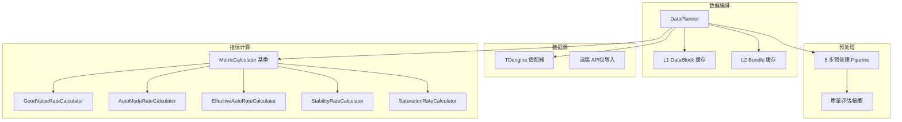
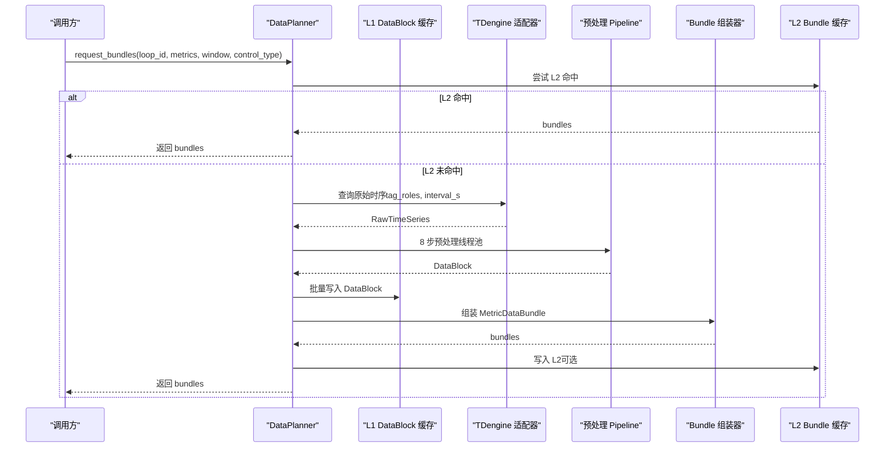
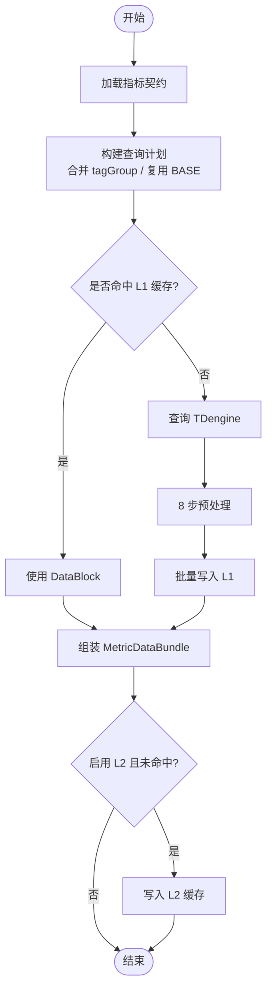
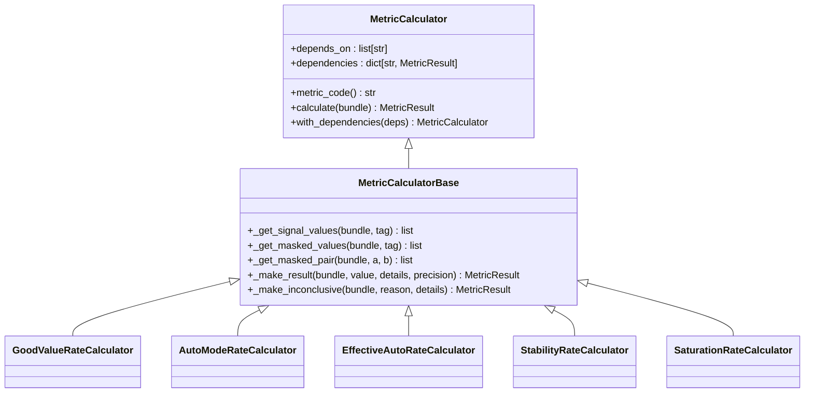
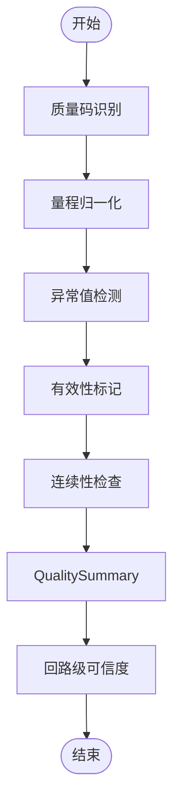
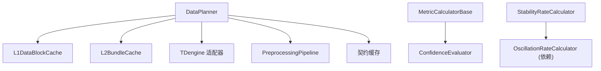

# 指标计算引擎

<cite>
**本文引用的文件**
- [backend/app/services/data_planner.py](file://backend/app/services/data_planner.py)
- [backend/app/core/tdengine.py](file://backend/app/core/tdengine.py)
- [backend/app/services/data_source/__init__.py](file://backend/app/services/data_source/__init__.py)
- [backend/tests/test_data_source/test_tdengine_provider.py](file://backend/tests/test_data_source/test_tdengine_provider.py)
- [backend/app/services/preprocessing/pipeline.py](file://backend/app/services/preprocessing/pipeline.py)
- [backend/app/services/preprocessing/data_quality_assessor.py](file://backend/app/services/preprocessing/data_quality_assessor.py)
- [backend/tests/test_preprocessing/test_outlier_detection.py](file://backend/tests/test_preprocessing/test_outlier_detection.py)
- [backend/tests/test_preprocessing/test_pipeline.py](file://backend/tests/test_preprocessing/test_pipeline.py)
- [backend/app/contracts/metric_calculator.py](file://backend/app/contracts/metric_calculator.py)
- [backend/app/services/metric_calculator/base.py](file://backend/app/services/metric_calculator/base.py)
- [backend/app/services/metric_calculator/good_value.py](file://backend/app/services/metric_calculator/good_value.py)
- [backend/app/services/metric_calculator/auto_mode.py](file://backend/app/services/metric_calculator/auto_mode.py)
- [backend/app/services/metric_calculator/effective_auto.py](file://backend/app/services/metric_calculator/effective_auto.py)
- [backend/app/services/metric_calculator/saturation.py](file://backend/app/services/metric_calculator/saturation.py)
- [backend/app/services/metric_calculator/stability.py](file://backend/app/services/metric_calculator/stability.py)
- [backend/app/services/metric_calculator/statistics.py](file://backend/app/services/metric_calculator/statistics.py)
- [backend/tests/test_metric_calculator/test_effective_auto.py](file://backend/tests/test_metric_calculator/test_effective_auto.py)
- [backend/tests/test_metric_calculator/test_fast_rate.py](file://backend/tests/test_metric_calculator/test_fast_rate.py)
- [backend/tests/test_metric_calculator/test_settling_semantics.py](file://backend/tests/test_metric_calculator/test_settling_semantics.py)
- [backend/alembic/versions/y5d6e7f8a9b0_fix_saturation_requirement_mode.py](file://backend/alembic/versions/y5d6e7f8a9b0_fix_saturation_requirement_mode.py)
</cite>

## 目录
1. [简介](#简介)
2. [项目结构](#项目结构)
3. [核心组件](#核心组件)
4. [架构总览](#架构总览)
5. [详细组件分析](#详细组件分析)
6. [依赖关系分析](#依赖关系分析)
7. [性能考虑](#性能考虑)
8. [故障排查指南](#故障排查指南)
9. [结论](#结论)
10. [附录](#附录)

## 简介
本技术文档面向“指标计算引擎”，围绕 DataPlanner 统一数据读取架构与 MetricCalculator 并行计算框架，系统阐述多数据源适配、缓存策略、时间窗口查询优化、算子模式设计、流水线处理、错误隔离机制，以及各类指标计算器（good_value_rate、auto_mode_rate、effective_auto_rate、steady_rate、accuracy_rate、fast_rate、oscillation_rate、saturation_rate、instrument_fault_rate）的实现要点。同时覆盖数据预处理流程（异常值检测、缺失值处理、质量码标记）、性能优化策略（批量查询、内存管理、并发控制），并提供自定义指标计算器的开发与集成指南。

## 项目结构
后端以“服务层”为核心组织：
- 数据编排与取数：DataPlanner 负责指标驱动的数据获取、查询计划合并、L1/L2 缓存、预处理与 Bundle 组装。
- 数据源适配：TDengine 适配器提供 query_trend_data 的封装；远端 API 仅用于历史导入链路，不参与计算任务。
- 预处理管线：8 步 Pipeline 完成质量码识别、有效性标记、量程归一化、异常值检测、连续性检查、Metric Mask、QualitySummary。
- 指标计算：基于抽象接口 MetricCalculator 与基类 MetricCalculatorBase，实现多种指标计算器，支持依赖注入与可信度统一。
- 诊断算子：无状态算子注册表 + 编排器，支持 fast 组过滤与输入信号校验、异常隔离。

图表来源
- [backend/app/services/data_planner.py:150-346](file://backend/app/services/data_planner.py#L150-L346)
- [backend/app/core/tdengine.py:351-377](file://backend/app/core/tdengine.py#L351-L377)
- [backend/app/services/preprocessing/pipeline.py:58-228](file://backend/app/services/preprocessing/pipeline.py#L58-L228)
- [backend/app/contracts/metric_calculator.py:17-69](file://backend/app/contracts/metric_calculator.py#L17-L69)
- [backend/app/services/metric_calculator/base.py:42-201](file://backend/app/services/metric_calculator/base.py#L42-L201)

章节来源
- [backend/app/services/data_planner.py:1-40](file://backend/app/services/data_planner.py#L1-L40)
- [backend/app/services/data_source/__init__.py:1-12](file://backend/app/services/data_source/__init__.py#L1-L12)

## 核心组件
- DataPlanner：指标驱动的统一数据读取与编排中枢，负责契约加载、查询计划合并、L1/L2 缓存、预处理、Bundle 组装与写入。
- 预处理 Pipeline：8 步标准化流程，输出 DataBlock（含 valid 标记、异常原因码、质量摘要、连续段、回路级可信度）。
- 指标计算器体系：抽象接口 + 基类 + 具体计算器，支持依赖注入、可信度统一、INCONCLUSIVE 兜底。
- 诊断算子体系：无状态算子注册表 + 编排器，支持 fast 组过滤、输入信号校验、异常隔离。

章节来源
- [backend/app/services/data_planner.py:150-346](file://backend/app/services/data_planner.py#L150-L346)
- [backend/app/services/preprocessing/pipeline.py:58-228](file://backend/app/services/preprocessing/pipeline.py#L58-L228)
- [backend/app/contracts/metric_calculator.py:17-69](file://backend/app/contracts/metric_calculator.py#L17-L69)
- [backend/app/services/metric_calculator/base.py:42-201](file://backend/app/services/metric_calculator/base.py#L42-L201)

## 架构总览
DataPlanner 作为 v4.0 架构中枢，将指标需求转化为查询计划，按 tagGroup 复用 BASE 数据块，减少重复查询；通过 L1/L2 两级缓存降低网络与 CPU 压力；预处理在独立线程执行，释放事件循环；最终组装 MetricDataBundle 并可选写入 L2 缓存。

图表来源
- [backend/app/services/data_planner.py:208-346](file://backend/app/services/data_planner.py#L208-L346)
- [backend/app/core/tdengine.py:351-377](file://backend/app/core/tdengine.py#L351-L377)
- [backend/app/services/preprocessing/pipeline.py:78-228](file://backend/app/services/preprocessing/pipeline.py#L78-L228)

## 详细组件分析

### DataPlanner 统一数据读取架构
- 指标驱动取数：从契约表加载 metric_code → tag_group → tags → mask_expression，构建 QueryTask 列表。
- 查询计划合并：相同 tagGroup 合并查询，HF 组复用 BASE 派生，避免重复拉取；BASE 优先执行以满足派生依赖。
- 缓存策略：L1 DataBlock 缓存（zstd 压缩，含 cfg_version 与预处理版本）；空 DataBlock 不写负缓存；L2 Bundle 缓存（含 OP 限位与 cfg_version）。
- 时间窗口查询优化：按控制类型阈值决定采样频率；KPI 路径不进行 LTTB 降采样，保证指标准确性。
- 装配与血缘：按 mask_expression 生成 masked_indices，构造 MetricDataBundle，包含数据血缘与质量摘要。

图表来源
- [backend/app/services/data_planner.py:352-495](file://backend/app/services/data_planner.py#L352-L495)
- [backend/app/services/data_planner.py:512-606](file://backend/app/services/data_planner.py#L512-L606)
- [backend/app/services/data_planner.py:608-674](file://backend/app/services/data_planner.py#L608-L674)
- [backend/app/services/data_planner.py:734-793](file://backend/app/services/data_planner.py#L734-L793)

章节来源
- [backend/app/services/data_planner.py:150-346](file://backend/app/services/data_planner.py#L150-L346)
- [backend/app/services/data_planner.py:393-495](file://backend/app/services/data_planner.py#L393-L495)
- [backend/app/services/data_planner.py:512-606](file://backend/app/services/data_planner.py#L512-L606)
- [backend/app/services/data_planner.py:608-674](file://backend/app/services/data_planner.py#L608-L674)
- [backend/app/services/data_planner.py:734-793](file://backend/app/services/data_planner.py#L734-L793)

### 多数据源适配（TDengine、PostgreSQL、远端 API）
- TDengine 适配器：提供 make_dataplanner_query_fn，将现有 query_trend_data 包装为 DataPlanner 所需签名；REST 响应解析为 RawTimeSeries。
- PostgreSQL：DataPlanner 通过 db session 读取指标契约与回路配置（如 LoopLedger OP 限位）；非计算主路径。
- 远端 API：仅用于历史数据导入链路，不参与 KPI 计算任务；计算全走本地 TDengine。

章节来源
- [backend/app/core/tdengine.py:351-377](file://backend/app/core/tdengine.py#L351-L377)
- [backend/app/services/data_source/__init__.py:1-12](file://backend/app/services/data_source/__init__.py#L1-L12)
- [backend/tests/test_data_source/test_tdengine_provider.py:1-44](file://backend/tests/test_data_source/test_tdengine_provider.py#L1-L44)

### 数据缓存策略
- L1 DataBlock 缓存：key 包含 loop_id、tag_group、时间窗口、采样频率、质量策略、预处理版本、cfg_version；空块不写负缓存。
- L2 Bundle 缓存：key 包含 loop_id、metrics、时间窗口、control_type、OP 限位、cfg_version；命中则跳过查询与组装。
- 批量写入：Pipeline 结果与 DataBlock 批量写入，减少 Redis 往返。

章节来源
- [backend/app/services/data_planner.py:247-300](file://backend/app/services/data_planner.py#L247-L300)
- [backend/app/services/data_planner.py:532-606](file://backend/app/services/data_planner.py#L532-L606)
- [backend/app/services/data_planner.py:775-793](file://backend/app/services/data_planner.py#L775-L793)

### 时间窗口查询优化
- 控制类型阈值：按 STABLE/SLOW/FAST/LOGIC 选择 base_sampling_freq；HF 组固定 1s。
- 不降采样：KPI 路径不进行 LTTB 降采样，确保指标准确性。
- 复用 BASE：所有 HF tagGroup 从 BASE 派生，避免重复查询。

章节来源
- [backend/app/services/data_planner.py:16-39](file://backend/app/services/data_planner.py#L16-L39)
- [backend/app/services/data_planner.py:419-495](file://backend/app/services/data_planner.py#L419-L495)

### MetricCalculator 并行计算框架
- 算子模式设计：MetricCalculator 抽象接口定义 metric_code 与 calculate；基类提供信号提取、可信度判定、血缘构建、INCONCLUSIVE 兜底。
- 依赖注入：计算器通过 with_dependencies 注入前置指标结果（如稳定率依赖振荡率）。
- 流水线处理：DataPlanner 先执行数据获取与预处理，再交由各计算器独立计算；可并行调度（由上层编排）。
- 错误隔离：计算器内部异常不影响其他指标；基类统一处理 INCONCLUSIVE 与置信度等级。

图表来源
- [backend/app/contracts/metric_calculator.py:17-69](file://backend/app/contracts/metric_calculator.py#L17-L69)
- [backend/app/services/metric_calculator/base.py:42-201](file://backend/app/services/metric_calculator/base.py#L42-L201)
- [backend/app/services/metric_calculator/good_value.py:28-88](file://backend/app/services/metric_calculator/good_value.py#L28-L88)
- [backend/app/services/metric_calculator/auto_mode.py:26-98](file://backend/app/services/metric_calculator/auto_mode.py#L26-L98)
- [backend/app/services/metric_calculator/effective_auto.py:41-148](file://backend/app/services/metric_calculator/effective_auto.py#L41-L148)
- [backend/app/services/metric_calculator/stability.py:37-127](file://backend/app/services/metric_calculator/stability.py#L37-L127)
- [backend/app/services/metric_calculator/saturation.py:40-41](file://backend/app/services/metric_calculator/saturation.py#L40-L41)

章节来源
- [backend/app/contracts/metric_calculator.py:17-69](file://backend/app/contracts/metric_calculator.py#L17-L69)
- [backend/app/services/metric_calculator/base.py:42-201](file://backend/app/services/metric_calculator/base.py#L42-L201)

### 各类指标计算器实现要点
- good_value_rate：基于 PV 质量码统计好值时长占比；<20% 时 INCONCLUSIVE。
- auto_mode_rate：统计 MODE 处于自动/串级/远程模式的时长占比。
- effective_auto_rate：在自控模式下进一步要求 OP 未饱和、偏差合理；作为综合评分折扣因子。
- steady_rate（stability_rate）：基于偏差标准差指数衰减模型，结合振荡率修正；使用无偏估计（ddof=1）。
- accuracy_rate：误差均值/标准差等统计指标（statistics.py 中 ErrorMean/ErrorStd 等）。
- fast_rate：依赖 settling_time 与 ideal_settling_time，已稳态得满分，否则按指数衰减计算。
- oscillation_rate：振荡率（由稳定性相关逻辑提供，供稳定率使用）。
- saturation_rate：自控模式下 OP 饱和时长占比；需 MODE_HF bundle（含 mode+op）。
- instrument_fault_rate：仪表故障率（工具模块实现，用于复合判据）。

章节来源
- [backend/app/services/metric_calculator/good_value.py:28-88](file://backend/app/services/metric_calculator/good_value.py#L28-L88)
- [backend/app/services/metric_calculator/auto_mode.py:26-98](file://backend/app/services/metric_calculator/auto_mode.py#L26-L98)
- [backend/app/services/metric_calculator/effective_auto.py:41-148](file://backend/app/services/metric_calculator/effective_auto.py#L41-L148)
- [backend/app/services/metric_calculator/stability.py:37-127](file://backend/app/services/metric_calculator/stability.py#L37-L127)
- [backend/app/services/metric_calculator/statistics.py:187-219](file://backend/app/services/metric_calculator/statistics.py#L187-L219)
- [backend/tests/test_metric_calculator/test_fast_rate.py:78-105](file://backend/tests/test_metric_calculator/test_fast_rate.py#L78-L105)
- [backend/tests/test_metric_calculator/test_settling_semantics.py:201-228](file://backend/tests/test_metric_calculator/test_settling_semantics.py#L201-L228)
- [backend/app/services/metric_calculator/saturation.py:1-41](file://backend/app/services/metric_calculator/saturation.py#L1-L41)
- [backend/alembic/versions/y5d6e7f8a9b0_fix_saturation_requirement_mode.py:1-25](file://backend/alembic/versions/y5d6e7f8a9b0_fix_saturation_requirement_mode.py#L1-L25)

### 数据预处理流程
- 步骤① 质量码识别：pv_quality → pv 的质量码映射为 Good/Bad/Unknown。
- 步骤③ 量程归一化：PV/SP 用 PV 量程，OP 用 OP 量程归一化为百分比。
- 步骤④ 异常值检测：8 类异常（超量程、冻结、跳变、尖峰、NaN、时间戳异常、QC_BAD、高频噪声），部分仅标记不置无效。
- 步骤② 有效性标记：基于质量码与异常值检测结果设置 valid；非 MARK_ONLY 原因置 False。
- 步骤⑥ 连续性检查：连续有效段长度不足丢弃。
- 步骤⑧ QualitySummary：统计缺失率、连续段、好值率等。
- 回路级可信度：基于核心 tag（pv/sp/op/mode）交集计算 loop_valid_rate，映射到 confidence_level。

图表来源
- [backend/app/services/preprocessing/pipeline.py:78-228](file://backend/app/services/preprocessing/pipeline.py#L78-L228)
- [backend/app/services/preprocessing/pipeline.py:234-298](file://backend/app/services/preprocessing/pipeline.py#L234-L298)
- [backend/app/services/preprocessing/pipeline.py:304-403](file://backend/app/services/preprocessing/pipeline.py#L304-L403)

章节来源
- [backend/app/services/preprocessing/pipeline.py:58-228](file://backend/app/services/preprocessing/pipeline.py#L58-L228)
- [backend/app/services/preprocessing/data_quality_assessor.py:226-250](file://backend/app/services/preprocessing/data_quality_assessor.py#L226-L250)
- [backend/tests/test_preprocessing/test_outlier_detection.py:1-43](file://backend/tests/test_preprocessing/test_outlier_detection.py#L1-L43)
- [backend/tests/test_preprocessing/test_pipeline.py:214-238](file://backend/tests/test_preprocessing/test_pipeline.py#L214-L238)

### 性能优化策略
- 批量查询：DataPlanner 合并相同 tagGroup 的查询任务，BASE 复用派生 HF 组，减少 TDengine 查询次数。
- 内存管理：预处理在独立线程执行，避免阻塞事件循环；DataBlock 序列化压缩存储于 L1。
- 并发控制：asyncio.gather 并行执行非复用 task；Pipeline 批量写入缓存，减少网络往返。
- 缓存命中：L2 Bundle 缓存命中直接返回，跳过查询与组装；L1 DataBlock 缓存命中避免重复预处理。

章节来源
- [backend/app/services/data_planner.py:512-606](file://backend/app/services/data_planner.py#L512-L606)
- [backend/app/services/data_planner.py:608-674](file://backend/app/services/data_planner.py#L608-L674)
- [backend/app/services/preprocessing/pipeline.py:78-228](file://backend/app/services/preprocessing/pipeline.py#L78-L228)

### 自定义指标计算器的开发指南与集成示例
- 开发步骤：
  - 新建计算器类继承 MetricCalculatorBase，实现 metric_code 与 calculate。
  - 使用基类辅助方法提取信号、计算有效数据率、构建血缘与结果。
  - 如需依赖其他指标，设置 depends_on 并通过 with_dependencies 注入。
  - 在 __init__.py 中注册导入，确保被扫描加载。
- 集成示例：
  - 参考 good_value_rate 或 auto_mode_rate 的实现，复用 _make_result/_make_inconclusive。
  - 在 DataPlanner 请求 bundles 时，传入新的 metric_code，确保契约表中有对应条目。
  - 若需新 tagGroup，调整契约中的 tag_group/tags/mask_expression。

章节来源
- [backend/app/contracts/metric_calculator.py:17-69](file://backend/app/contracts/metric_calculator.py#L17-L69)
- [backend/app/services/metric_calculator/base.py:42-201](file://backend/app/services/metric_calculator/base.py#L42-L201)
- [backend/app/services/metric_calculator/good_value.py:28-88](file://backend/app/services/metric_calculator/good_value.py#L28-L88)
- [backend/app/services/metric_calculator/auto_mode.py:26-98](file://backend/app/services/metric_calculator/auto_mode.py#L26-L98)

## 依赖关系分析
- DataPlanner 依赖：
  - L1/L2 缓存：L1DataBlockCache、L2BundleCache。
  - 数据源：TDengine 适配器（query_trend_data 封装）。
  - 预处理：PreprocessingPipeline、阈值配置、质量摘要。
  - 契约表：ClpmMetricDataRequirement（进程内缓存）。
- 指标计算器依赖：
  - 基类：MetricCalculatorBase（信号提取、可信度、血缘）。
  - 依赖注入：其他指标结果（如 stability_rate 依赖 oscillation_rate）。
- 预处理依赖：
  - OutlierDetector、DataQualityAssessor、QualitySummary、ValidityMask。

图表来源
- [backend/app/services/data_planner.py:150-346](file://backend/app/services/data_planner.py#L150-L346)
- [backend/app/services/metric_calculator/base.py:140-201](file://backend/app/services/metric_calculator/base.py#L140-L201)
- [backend/app/services/metric_calculator/stability.py:44-49](file://backend/app/services/metric_calculator/stability.py#L44-L49)

章节来源
- [backend/app/services/data_planner.py:150-346](file://backend/app/services/data_planner.py#L150-L346)
- [backend/app/services/metric_calculator/base.py:140-201](file://backend/app/services/metric_calculator/base.py#L140-L201)
- [backend/app/services/metric_calculator/stability.py:44-49](file://backend/app/services/metric_calculator/stability.py#L44-L49)

## 性能考虑
- 查询合并与复用：BASE 复用派生 HF 组，显著减少 TDengine 查询次数。
- 缓存命中率：L1/L2 缓存 key 包含 cfg_version 与 OP 限位，确保一致性；空块不写负缓存避免误命中。
- 线程池预处理：CPU 密集型预处理移至线程池，释放事件循环。
- 批量写入：Pipeline 与 DataBlock 批量写入缓存，降低网络开销。
- 不降采样：KPI 路径不进行 LTTB 降采样，保证指标准确性；波形渲染路径另有 LTTB 约束。

[本节为通用性能指导，无需特定文件引用]

## 故障排查指南
- 数据为空：检查 TDengine 查询返回是否为空；DataPlanner 会记录警告并返回空 DataBlock。
- 预处理失败：查看 Pipeline 日志，关注 loop_confidence=E 时的核心 tag 有效性与异常原因分布。
- 指标 INCONCLUSIVE：检查指标级 valid_rate 是否低于阈值；好值率 <20% 也会触发 INCONCLUSIVE。
- 饱和率空白：确认契约中 saturation_rate 包含 MODE 信号（MODE_HF bundle）；迁移脚本已修复该问题。
- 快速率异常：检查 settling_time 与 ideal_settling_time 依赖结果；identification_failed 或 already_stable 会影响结果。

章节来源
- [backend/app/services/data_planner.py:608-674](file://backend/app/services/data_planner.py#L608-L674)
- [backend/app/services/preprocessing/pipeline.py:151-195](file://backend/app/services/preprocessing/pipeline.py#L151-L195)
- [backend/app/services/metric_calculator/good_value.py:70-76](file://backend/app/services/metric_calculator/good_value.py#L70-L76)
- [backend/alembic/versions/y5d6e7f8a9b0_fix_saturation_requirement_mode.py:1-25](file://backend/alembic/versions/y5d6e7f8a9b0_fix_saturation_requirement_mode.py#L1-L25)
- [backend/tests/test_metric_calculator/test_settling_semantics.py:201-228](file://backend/tests/test_metric_calculator/test_settling_semantics.py#L201-L228)

## 结论
指标计算引擎以 DataPlanner 为核心，实现了指标驱动的统一数据读取与编排，通过多数据源适配、两级缓存、预处理流水线与指标计算器体系，提供了高性能、可扩展、可审计的计算能力。各类指标计算器遵循统一契约与基类，支持依赖注入与可信度统一，确保结果一致性与可追溯性。未来可通过进一步优化缓存策略、扩展数据源适配与增强监控观测，持续提升系统性能与稳定性。

[本节为总结性内容，无需特定文件引用]

## 附录
- 关键术语：
  - DataBlock：预处理后的数据块，含信号、有效性、异常原因码、质量摘要、连续段、回路级可信度。
  - MetricDataBundle：指标数据包，含 DataBlock、mask_expression、masked_indices、lineage。
  - TagGroup：数据分组（BASE、OP_HF、PVOP_HF、MODE_HF、QUALITY_HF、CONFIG）。
  - ConfidenceLevel：可信度等级（A/B/C/D/E），统一为回路级。
- 参考实现路径：
  - DataPlanner：[backend/app/services/data_planner.py](file://backend/app/services/data_planner.py)
  - 预处理 Pipeline：[backend/app/services/preprocessing/pipeline.py](file://backend/app/services/preprocessing/pipeline.py)
  - 指标计算器基类：[backend/app/services/metric_calculator/base.py](file://backend/app/services/metric_calculator/base.py)
  - 具体计算器：good_value_rate、auto_mode_rate、effective_auto_rate、stability_rate、saturation_rate 等

[本节为附录信息，无需特定文件引用]