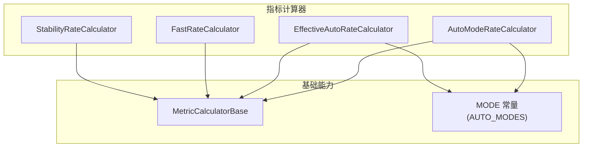
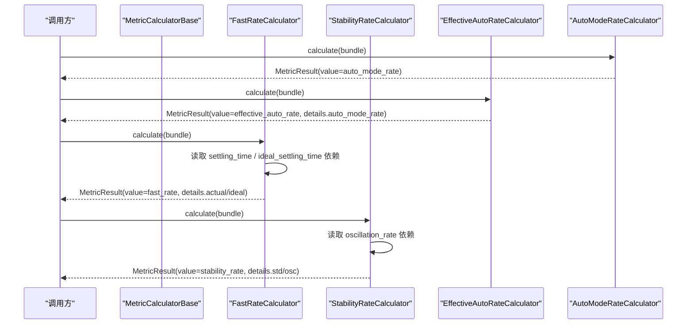
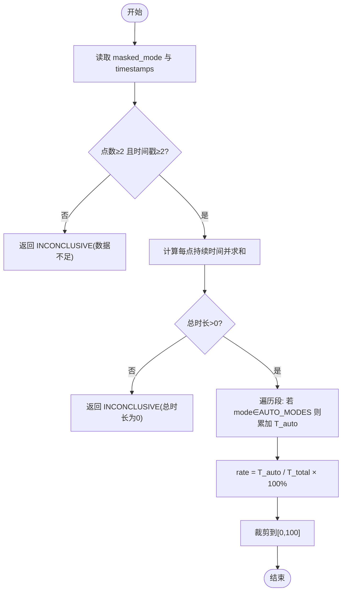
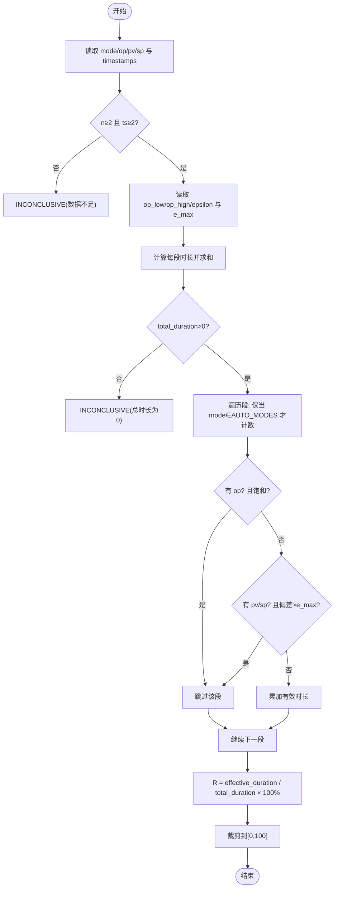
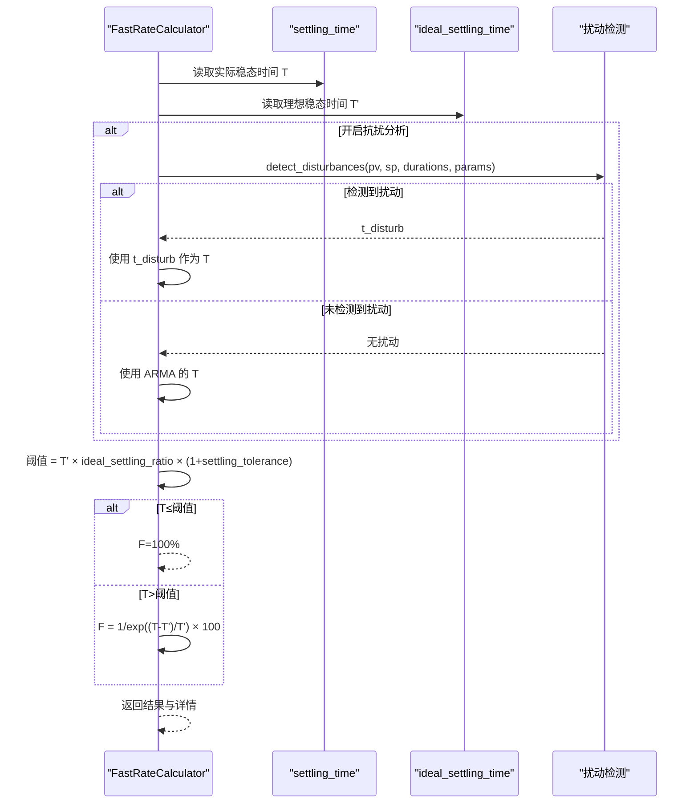
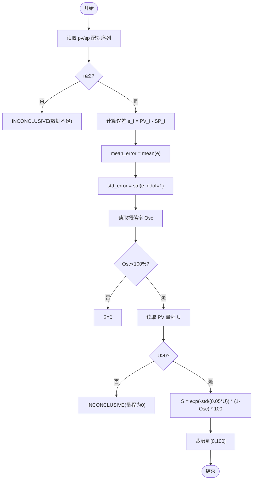
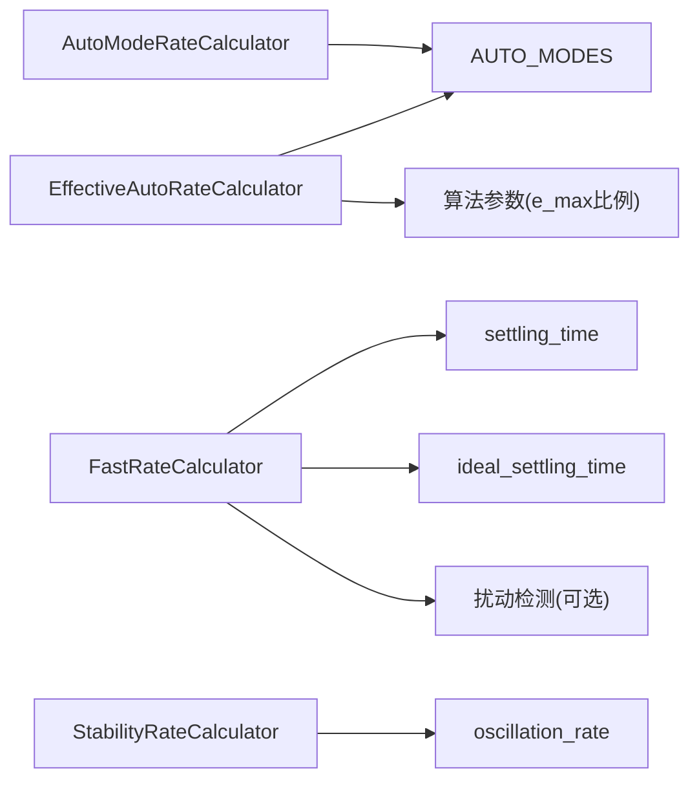

# 控制性能指标计算器

<cite>
**本文引用的文件**
- [auto_mode.py](file://backend/app/services/metric_calculator/auto_mode.py)
- [effective_auto.py](file://backend/app/services/metric_calculator/effective_auto.py)
- [fast_rate.py](file://backend/app/services/metric_calculator/fast_rate.py)
- [stability.py](file://backend/app/services/metric_calculator/stability.py)
- [mode.py](file://backend/app/constants/mode.py)
- [test_auto_mode.py](file://backend/tests/test_metric_calculator/test_auto_mode.py)
- [test_effective_auto.py](file://backend/tests/test_metric_calculator/test_effective_auto.py)
- [test_fast_rate.py](file://backend/tests/test_metric_calculator/test_fast_rate.py)
- [test_stability.py](file://backend/tests/test_metric_calculator/test_stability.py)
</cite>

## 目录
1. [简介](#简介)
2. [项目结构](#项目结构)
3. [核心组件](#核心组件)
4. [架构总览](#架构总览)
5. [详细组件分析](#详细组件分析)
6. [依赖关系分析](#依赖关系分析)
7. [性能考量](#性能考量)
8. [故障排查指南](#故障排查指南)
9. [结论](#结论)
10. [附录](#附录)

## 简介
本技术文档面向“控制性能指标计算器”，聚焦以下四个关键指标的算法实现与工程落地：
- auto_mode_rate（自动模式率）：统计控制器处于自动/串级/远程/先控模式的时长占比，用于表征投用情况。
- effective_auto_rate（有效自动率）：在自动模式基础上叠加输出饱和与偏差合理性判定，作为综合评分的整体折扣因子。
- fast_rate（快速响应率）：基于实际稳态时间与理想稳态时间的对比，采用指数衰减映射评估调节速度。
- stability_rate（稳定率）：以控制偏差标准差衡量波动性，并结合振荡率修正稳定性得分。

文档提供各指标的计算公式、参数配置、结果解读、数据流与依赖关系，并给出综合评估方法与优化建议。

## 项目结构
指标计算位于后端服务模块 services/metric_calculator，每个指标一个独立计算器类，统一继承基类 MetricCalculatorBase，通过 MetricDataBundle 输入信号序列与时间戳，返回 MetricResult 结果对象。常量定义位于 constants/mode，提供 MODE 标准枚举与自动模式集合。测试用例位于 tests/test_metric_calculator，覆盖边界条件与回归场景。

图表来源
- [auto_mode.py:26-89](file://backend/app/services/metric_calculator/auto_mode.py#L26-L89)
- [effective_auto.py:41-148](file://backend/app/services/metric_calculator/effective_auto.py#L41-L148)
- [fast_rate.py:46-214](file://backend/app/services/metric_calculator/fast_rate.py#L46-L214)
- [stability.py:37-127](file://backend/app/services/metric_calculator/stability.py#L37-L127)
- [mode.py:62-72](file://backend/app/constants/mode.py#L62-L72)

章节来源
- [auto_mode.py:1-101](file://backend/app/services/metric_calculator/auto_mode.py#L1-L101)
- [effective_auto.py:1-201](file://backend/app/services/metric_calculator/effective_auto.py#L1-L201)
- [fast_rate.py:1-298](file://backend/app/services/metric_calculator/fast_rate.py#L1-L298)
- [stability.py:1-143](file://backend/app/services/metric_calculator/stability.py#L1-L143)
- [mode.py:1-98](file://backend/app/constants/mode.py#L1-L98)

## 核心组件
- AutoModeRateCalculator：仅依据 mode 信号统计自动模式时长占比，不参与综合评分加权。
- EffectiveAutoRateCalculator：在自动模式基础上增加 OP 饱和检测与偏差合理性检查，输出有效自动率作为整体折扣因子。
- FastRateCalculator：依赖 settling_time 与 ideal_settling_time，按 T≤T' 满分、T>T' 指数衰减的映射计算快速率；支持可选扰动恢复时间替代 ARMA 稳态时间。
- StabilityRateCalculator：基于 PV 与 SP 的偏差标准差计算波动性，结合振荡率修正得到稳定率。

章节来源
- [auto_mode.py:26-89](file://backend/app/services/metric_calculator/auto_mode.py#L26-L89)
- [effective_auto.py:41-148](file://backend/app/services/metric_calculator/effective_auto.py#L41-L148)
- [fast_rate.py:46-214](file://backend/app/services/metric_calculator/fast_rate.py#L46-L214)
- [stability.py:37-127](file://backend/app/services/metric_calculator/stability.py#L37-L127)

## 架构总览
指标计算遵循统一的输入输出契约：MetricDataBundle 包含 signals（pv/sp/op/mode 等）、timestamps、data_block 元信息；MetricResult 包含 value、details、confidence_level、lineage。计算器之间通过 depends_on 声明依赖，由上层编排注入。

图表来源
- [fast_rate.py:72-214](file://backend/app/services/metric_calculator/fast_rate.py#L72-L214)
- [stability.py:51-127](file://backend/app/services/metric_calculator/stability.py#L51-L127)
- [effective_auto.py:52-148](file://backend/app/services/metric_calculator/effective_auto.py#L52-L148)
- [auto_mode.py:37-89](file://backend/app/services/metric_calculator/auto_mode.py#L37-L89)

## 详细组件分析

### 自动模式率（auto_mode_rate）
- 计算公式：Auto = T_auto / T_total × 100%
- 模式切换检测：对 mode 序列进行零阶保持分段，累计处于 AUTO/CAS/REMOTE/APC 的时长。
- 手动干预识别：非自动模式（MANUAL）不计入 T_auto。
- 模式状态跟踪：使用 AUTO_MODES 集合判定是否计入自控。
- 参数配置：无额外阈值；依赖 mode_valid 掩码与 timestamps。
- 结果解读：值域 0~100；数据不足或总时长为 0 时返回 INCONCLUSIVE。

图表来源
- [auto_mode.py:37-89](file://backend/app/services/metric_calculator/auto_mode.py#L37-L89)
- [mode.py:62-72](file://backend/app/constants/mode.py#L62-L72)

章节来源
- [auto_mode.py:26-89](file://backend/app/services/metric_calculator/auto_mode.py#L26-L89)
- [mode.py:62-72](file://backend/app/constants/mode.py#L62-L72)
- [test_auto_mode.py:23-78](file://backend/tests/test_metric_calculator/test_auto_mode.py#L23-L78)

### 有效自动率（effective_auto_rate）
- 计算公式：R = T_effective / T_total × 100%
- 控制效果评价：需同时满足 MODE 为自动、OP 未饱和、偏差合理。
- 调节品质分析：通过 e_max 限制偏差范围；epsilon 防止边界误判。
- 有效性判定标准：
  - OP 饱和检测：op ≤ op_low + ε 或 op ≥ op_high - ε 视为饱和。
  - 偏差检查：|PV - SP| < e_max 视为合理。
  - 缺失信号处理：缺 op 不判饱和；缺 pv/sp 不判偏差。
- 参数配置：
  - op_low、op_high、saturation_epsilon（默认 0/100/2.0）。
  - e_max 优先从 signals 读取（e_max/accuracy_e_max/error_max），否则回退为归一化量程×比例（默认 5%）。
- 结果解读：value 为 R；details 含 auto_mode_rate、各持续时长、阈值与样本数。

图表来源
- [effective_auto.py:52-148](file://backend/app/services/metric_calculator/effective_auto.py#L52-L148)

章节来源
- [effective_auto.py:41-148](file://backend/app/services/metric_calculator/effective_auto.py#L41-L148)
- [test_effective_auto.py:24-181](file://backend/tests/test_metric_calculator/test_effective_auto.py#L24-L181)

### 快速响应率（fast_rate）
- 计算公式：
  - 若 T ≤ T'：F = 100%
  - 若 T > T'：F = 1/e^((T-T')/T') × 100%
- 响应时间分析：T 来自 settling_time 的实际稳态时间；T' 来自 ideal_settling_time。
- 超调量检测：不直接检测超调，但通过稳态时间间接反映调节过程质量。
- 调节过程评估：
  - 已稳态（T≤0）→ 100%。
  - never_settles（窗口内不衰减）→ 以 Green 函数窗口长度代入衰减公式，避免误判满分。
  - identification_failed/insufficient_data → INCONCLUSIVE。
- 抗扰性分析（可选 P2）：
  - 开关 anti_disturbance_enabled 开启时，调用扰动检测，若检测到扰动则以平均恢复时间替代 T。
  - 未检测到扰动或数据不足时回落至 ARMA 稳态时间。
- 参数配置：
  - ideal_settling_ratio、settling_tolerance：用于计算阈值 fast_threshold = T' × ratio × (1+tolerance)。
  - 扰动相关：disturbance_band_sigma、recovery_persistence、min_disturbance_duration、sp_step_sigma。
- 结果解读：value 为 F；details 含 actual_settling_time、ideal_settling_time、ratio、source（arma/disturbance）等。

图表来源
- [fast_rate.py:60-214](file://backend/app/services/metric_calculator/fast_rate.py#L60-L214)
- [fast_rate.py:216-272](file://backend/app/services/metric_calculator/fast_rate.py#L216-L272)

章节来源
- [fast_rate.py:46-214](file://backend/app/services/metric_calculator/fast_rate.py#L46-L214)
- [test_fast_rate.py:49-200](file://backend/tests/test_metric_calculator/test_fast_rate.py#L49-L200)

### 稳定率（stability_rate）
- 计算公式：S = exp(-σ/(0.05·U)) × (1-Osc) × 100%
- 波动性分析：σ 为控制偏差的标准差（无偏估计，ddof=1）。
- 稳态误差评估：mean_error 记录偏差均值；σ 衡量波动幅度。
- 稳定性判据：
  - 振荡率 Osc 来自 oscillation_rate 依赖，Osc≥100% 时 S=0。
  - U 为 PV 量程范围（默认 100）。
- 参数配置：pv_range（可配置），其余为固定系数。
- 结果解读：value 为 S；details 含 mean_error、std_error、pv_range、normalized_std、oscillation_rate、sample_count。

图表来源
- [stability.py:51-127](file://backend/app/services/metric_calculator/stability.py#L51-L127)

章节来源
- [stability.py:37-127](file://backend/app/services/metric_calculator/stability.py#L37-L127)
- [test_stability.py:35-136](file://backend/tests/test_metric_calculator/test_stability.py#L35-L136)

## 依赖关系分析
- AutoModeRateCalculator：依赖 MODE 常量集合，无其他指标依赖。
- EffectiveAutoRateCalculator：依赖 mode、op、pv、sp 信号及算法参数链（e_max 比例）。
- FastRateCalculator：依赖 settling_time、ideal_settling_time；可选依赖扰动检测。
- StabilityRateCalculator：依赖 oscillation_rate；读取 pv_range。

图表来源
- [auto_mode.py:26-89](file://backend/app/services/metric_calculator/auto_mode.py#L26-L89)
- [effective_auto.py:41-148](file://backend/app/services/metric_calculator/effective_auto.py#L41-L148)
- [fast_rate.py:46-214](file://backend/app/services/metric_calculator/fast_rate.py#L46-L214)
- [stability.py:37-127](file://backend/app/services/metric_calculator/stability.py#L37-L127)
- [mode.py:62-72](file://backend/app/constants/mode.py#L62-L72)

章节来源
- [fast_rate.py:53-54](file://backend/app/services/metric_calculator/fast_rate.py#L53-L54)
- [stability.py:44-45](file://backend/app/services/metric_calculator/stability.py#L44-L45)

## 性能考量
- 时间复杂度：各指标均为线性扫描 O(n)，主要开销在信号读取与数值计算。
- 内存占用：使用 numpy 数组存储误差序列，注意大样本时的内存峰值。
- 数值稳定性：
  - 快速率使用 math.exp(-x) 避免溢出。
  - 稳定率在大量程/大 σ 下通过负指数形式保持稳定。
- 缺失信号鲁棒性：有效自动率对缺失 op/pv/sp 做降级处理，避免误报 INCONCLUSIVE。
- 缓存与配置：算法参数通过 get_algorithm_params 读取，支持运行时覆盖，减少重复解析成本。

## 故障排查指南
- 数据不足：
  - 自动模式率：点数<2 或时间戳<2 → INCONCLUSIVE。
  - 有效自动率：同上；此外总时长为 0 也会 INCONCLUSIVE。
  - 稳定率：配对点数<2 → INCONCLUSIVE。
- 无效依赖：
  - 快速率：ideal_settling_time 无效或缺失 → INCONCLUSIVE。
  - 稳定率：振荡率依赖缺失时默认 osc=0。
- 异常值与溢出：
  - 稳定率：极大波动时使用 exp(-x) 避免 OverflowError。
  - 快速率：never_settles 场景以窗口长度代入，避免误判满分。
- 常见误判：
  - 有效自动率：缺少 pv/sp 不应导致 zero_total_duration；缺少 op 不判饱和。
  - 自动模式率：非法 mode 值不计入自控。

章节来源
- [auto_mode.py:52-62](file://backend/app/services/metric_calculator/auto_mode.py#L52-L62)
- [effective_auto.py:71-90](file://backend/app/services/metric_calculator/effective_auto.py#L71-L90)
- [fast_rate.py:86-157](file://backend/app/services/metric_calculator/fast_rate.py#L86-L157)
- [stability.py:66-96](file://backend/app/services/metric_calculator/stability.py#L66-L96)

## 结论
- auto_mode_rate 提供投用情况的直观度量，适合监控回路是否长期处于自动模式。
- effective_auto_rate 更贴近实际控制效果，适合作为综合评分的折扣因子，避免将饱和或失控时段计入。
- fast_rate 强调调节速度，结合理想稳态时间给出稳健的指数映射，支持扰动恢复时间以提升鲁棒性。
- stability_rate 以偏差波动为核心，结合振荡率修正，刻画稳态品质。
- 四者组合可形成“投用—效果—速度—稳定”的综合评估体系，指导整定与运维优化。

## 附录
- 推荐实践：
  - 确保 mode/op/pv/sp 信号完整与质量码正确，避免误判。
  - 合理配置 e_max、op 上下限与饱和容差，贴合现场工况。
  - 启用抗扰分析以区分扰动导致的慢响应与控制品质问题。
  - 关注 never_settles 场景，必要时调整辨识窗口或激励强度。
- 结果解读要点：
  - 高 auto_mode_rate 但低 effective_auto_rate：可能存在饱和或偏差过大。
  - 高 fast_rate 但低 stability_rate：可能调节过快导致振荡。
  - 低 fast_rate 且低 stability_rate：需检查模型辨识与控制器参数。