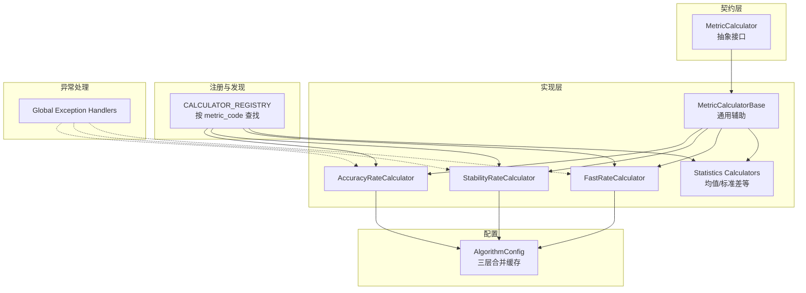
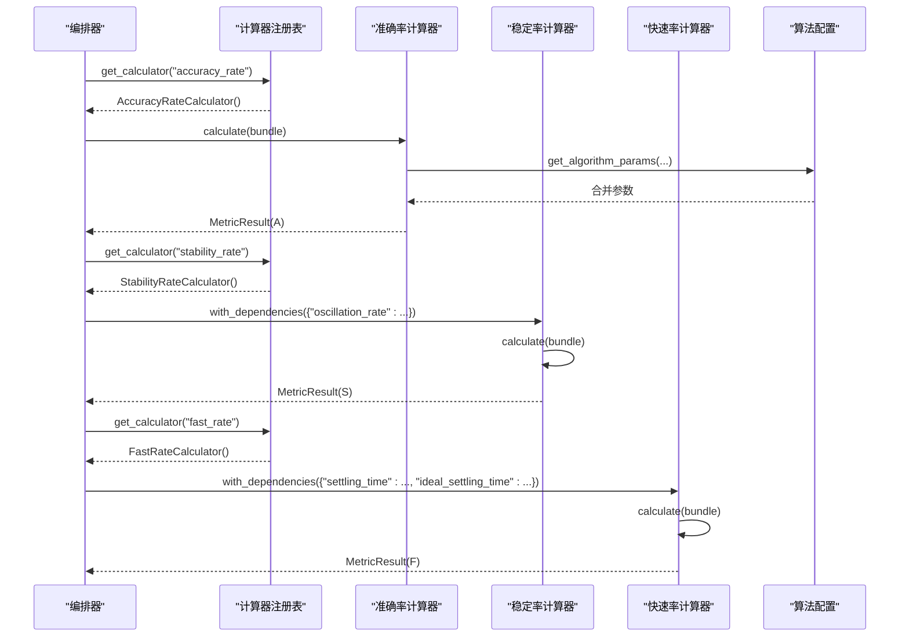
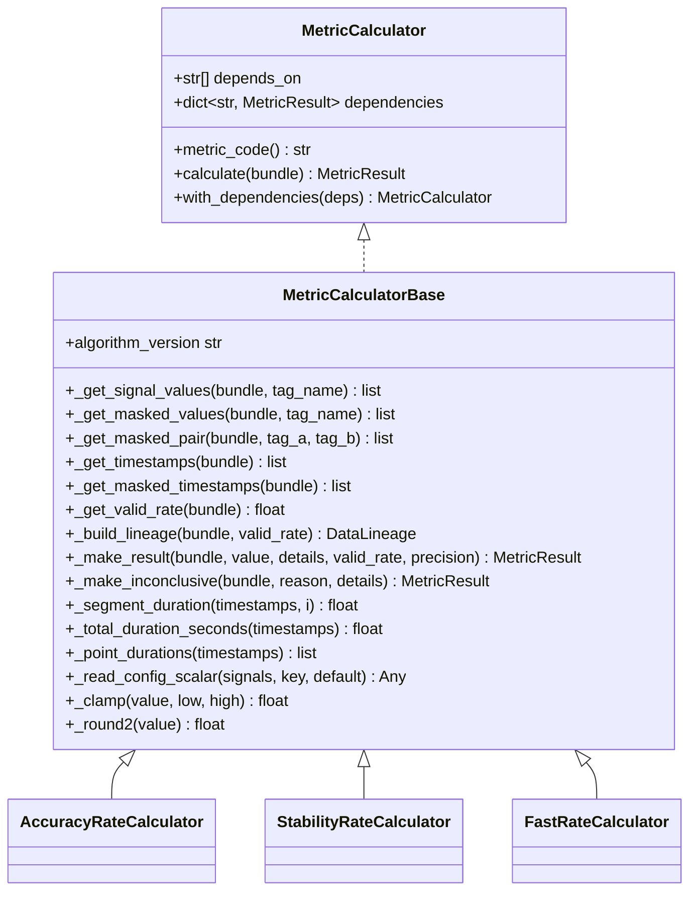
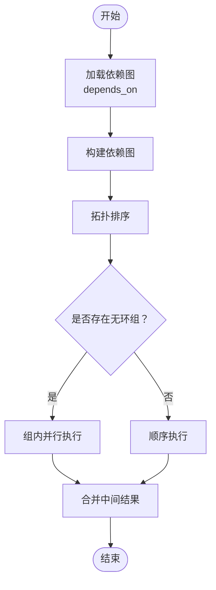
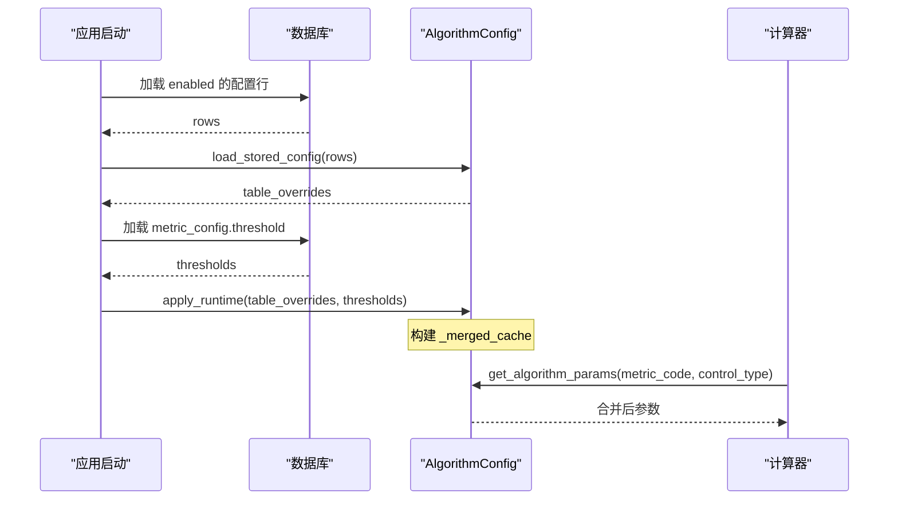
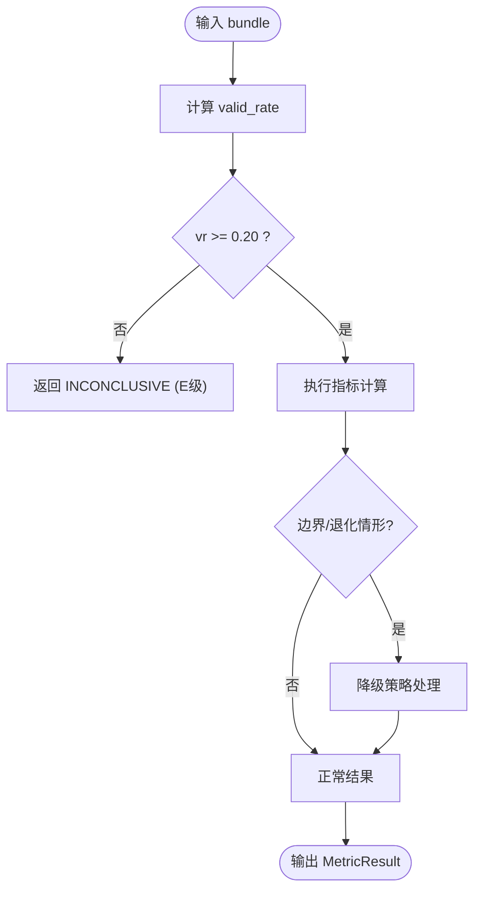
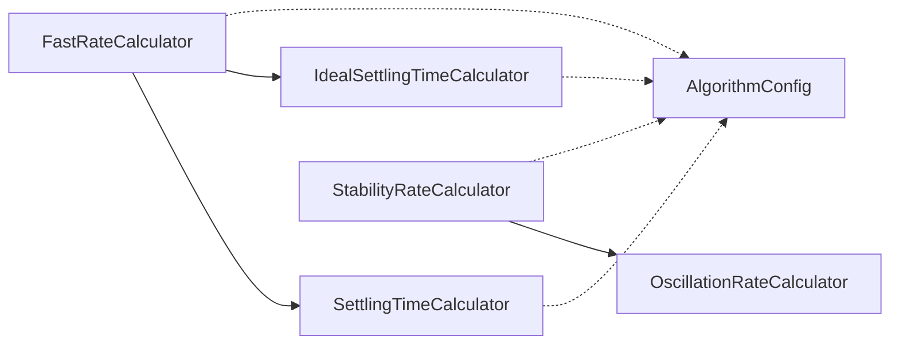

# 计算器框架

<cite>
**本文引用的文件**
- [backend/app/contracts/metric_calculator.py](file://backend/app/contracts/metric_calculator.py)
- [backend/app/services/metric_calculator/base.py](file://backend/app/services/metric_calculator/base.py)
- [backend/app/services/metric_calculator/__init__.py](file://backend/app/services/metric_calculator/__init__.py)
- [backend/app/services/metric_calculator/statistics.py](file://backend/app/services/metric_calculator/statistics.py)
- [backend/app/services/metric_calculator/accuracy.py](file://backend/app/services/metric_calculator/accuracy.py)
- [backend/app/services/metric_calculator/stability.py](file://backend/app/services/metric_calculator/stability.py)
- [backend/app/services/metric_calculator/fast_rate.py](file://backend/app/services/metric_calculator/fast_rate.py)
- [backend/app/services/algorithm_config.py](file://backend/app/services/algorithm_config.py)
- [backend/app/core/exceptions.py](file://backend/app/core/exceptions.py)
</cite>

## 目录
1. [简介](#简介)
2. [项目结构](#项目结构)
3. [核心组件](#核心组件)
4. [架构总览](#架构总览)
5. [详细组件分析](#详细组件分析)
6. [依赖关系分析](#依赖关系分析)
7. [性能考量](#性能考量)
8. [故障排查指南](#故障排查指南)
9. [结论](#结论)
10. [附录](#附录)

## 简介
本技术文档面向指标计算器框架，围绕以下目标展开：
- 统一接口与基类设计：抽象接口、生命周期管理、错误处理机制。
- 流水线处理架构：算子链式调用、中间结果传递、并行执行策略。
- 配置管理系统：参数验证、默认值处理、动态配置更新。
- 统计工具库：数学运算函数、信号处理算法、统计分析方法。
- 错误隔离机制：异常捕获、重试策略、降级处理。
- 自定义计算器的开发模板与最佳实践。

该框架以“输入数据包 → 指标计算器 → 结果对象”的解耦模式组织，所有指标计算器通过统一契约消费数据并产出结果，便于编排层组合、扩展与测试。

## 项目结构
指标计算器相关代码主要位于后端服务的 services/metric_calculator 与 contracts 目录，配合 algorithm_config 提供运行时参数，core/exceptions 提供全局异常处理。

图表来源
- [backend/app/contracts/metric_calculator.py:17-69](file://backend/app/contracts/metric_calculator.py#L17-L69)
- [backend/app/services/metric_calculator/base.py:42-344](file://backend/app/services/metric_calculator/base.py#L42-L344)
- [backend/app/services/metric_calculator/__init__.py:49-143](file://backend/app/services/metric_calculator/__init__.py#L49-L143)
- [backend/app/services/algorithm_config.py:323-433](file://backend/app/services/algorithm_config.py#L323-L433)
- [backend/app/core/exceptions.py:122-186](file://backend/app/core/exceptions.py#L122-L186)

章节来源
- [backend/app/contracts/metric_calculator.py:1-69](file://backend/app/contracts/metric_calculator.py#L1-L69)
- [backend/app/services/metric_calculator/__init__.py:1-180](file://backend/app/services/metric_calculator/__init__.py#L1-L180)

## 核心组件
- 抽象接口 MetricCalculator：定义统一的 calculate(bundle) 与 metric_code 属性，支持依赖注入 with_dependencies(deps)。
- 基类 MetricCalculatorBase：提供信号提取、有效数据率计算、血缘构建、结果构造、INCONCLUSIVE 兜底、时长计算、数值辅助等通用能力。
- 计算器注册表：集中注册所有指标计算器，提供 get_calculator/get_all_calculators。
- 配置服务 AlgorithmConfig：三层配置合并（默认值、系统覆盖、指标级覆盖），进程内缓存热路径读取，支持运行时刷新。
- 全局异常处理：统一错误响应格式，校验错误脱敏，未捕获异常降级为内部错误。

章节来源
- [backend/app/contracts/metric_calculator.py:17-69](file://backend/app/contracts/metric_calculator.py#L17-L69)
- [backend/app/services/metric_calculator/base.py:42-344](file://backend/app/services/metric_calculator/base.py#L42-L344)
- [backend/app/services/metric_calculator/__init__.py:49-143](file://backend/app/services/metric_calculator/__init__.py#L49-L143)
- [backend/app/services/algorithm_config.py:323-433](file://backend/app/services/algorithm_config.py#L323-L433)
- [backend/app/core/exceptions.py:122-186](file://backend/app/core/exceptions.py#L122-L186)

## 架构总览
指标计算采用“数据绑定 + 算子链式 + 依赖注入”的流水线模式：
- 输入：MetricDataBundle（含 DataBlock、mask、lineage）。
- 处理：各计算器实现 calculate(bundle)，可声明 depends_on 并通过 dependencies 读取前置指标结果。
- 输出：MetricResult（value、confidence_level、lineage、details）。
- 编排：由上层编排器组装依赖图，按拓扑顺序执行，支持并行执行无环依赖的计算器。

图表来源
- [backend/app/services/metric_calculator/__init__.py:121-143](file://backend/app/services/metric_calculator/__init__.py#L121-L143)
- [backend/app/services/metric_calculator/accuracy.py:36-163](file://backend/app/services/metric_calculator/accuracy.py#L36-L163)
- [backend/app/services/metric_calculator/stability.py:37-127](file://backend/app/services/metric_calculator/stability.py#L37-L127)
- [backend/app/services/metric_calculator/fast_rate.py:46-214](file://backend/app/services/metric_calculator/fast_rate.py#L46-L214)
- [backend/app/services/algorithm_config.py:323-334](file://backend/app/services/algorithm_config.py#L323-L334)

## 详细组件分析

### 抽象接口与基类设计
- 抽象接口 MetricCalculator：
  - 强制实现 metric_code 与 calculate(bundle)。
  - 支持 with_dependencies(deps) 注入前置指标结果，形成链式调用。
- 基类 MetricCalculatorBase：
  - 信号提取：_get_signal_values/_get_masked_values/_get_masked_pair/_get_timestamps/_get_masked_timestamps。
  - 可信度与血缘：_get_valid_rate/_build_lineage/_make_result/_make_inconclusive。
  - 时长计算：_segment_duration/_total_duration_seconds/_point_durations。
  - 数值辅助：_clamp/_round2/_read_config_scalar。
  - INCONCLUSIVE 阈值：指标级 valid_rate < 0.20 返回 E 级不可计算。

图表来源
- [backend/app/contracts/metric_calculator.py:17-69](file://backend/app/contracts/metric_calculator.py#L17-L69)
- [backend/app/services/metric_calculator/base.py:42-344](file://backend/app/services/metric_calculator/base.py#L42-L344)
- [backend/app/services/metric_calculator/accuracy.py:36-163](file://backend/app/services/metric_calculator/accuracy.py#L36-L163)
- [backend/app/services/metric_calculator/stability.py:37-127](file://backend/app/services/metric_calculator/stability.py#L37-L127)
- [backend/app/services/metric_calculator/fast_rate.py:46-214](file://backend/app/services/metric_calculator/fast_rate.py#L46-L214)

章节来源
- [backend/app/contracts/metric_calculator.py:17-69](file://backend/app/contracts/metric_calculator.py#L17-L69)
- [backend/app/services/metric_calculator/base.py:42-344](file://backend/app/services/metric_calculator/base.py#L42-L344)

### 流水线处理架构
- 算子链式调用：计算器通过 depends_on 声明依赖，编排器使用 with_dependencies 注入前置结果。
- 中间结果传递：MetricResult 作为中间产物，包含 value/confidence_level/lineage/details。
- 并行执行策略：无环依赖的计算器可并发执行；有依赖的按拓扑序串行或分组并行。

[此图为概念流程，不直接映射具体源码]

### 配置管理系统
- 三层配置合并：
  - 默认值（_DEFAULTS）
  - 系统级覆盖（algorithm_parameter 表）
  - 指标级覆盖（metric_config.threshold JSONB）
- 热路径读取：get_algorithm_params(metric_code, control_type) 从进程内缓存返回合并后的参数。
- 运行时刷新：apply_runtime(table_overrides, metric_thresholds) 刷新缓存，无需重启。
- 参数元数据与验证：PARAM_META 提供键白名单与值域约束；validate_metric_params 进行服务端防呆。

图表来源
- [backend/app/services/algorithm_config.py:342-409](file://backend/app/services/algorithm_config.py#L342-L409)
- [backend/app/services/algorithm_config.py:323-334](file://backend/app/services/algorithm_config.py#L323-L334)
- [backend/app/services/algorithm_config.py:253-279](file://backend/app/services/algorithm_config.py#L253-L279)

章节来源
- [backend/app/services/algorithm_config.py:31-439](file://backend/app/services/algorithm_config.py#L31-L439)

### 统计工具库
- 单信号均值/标准差：PvMeanCalculator、SpMeanCalculator、OpMeanCalculator 及其 Std 变体。
- 偏差统计：ErrorMeanCalculator、ErrorStdCalculator（E = PV - SP）。
- 最小点数要求：MIN_POINTS=2，不足时返回 INCONCLUSIVE。
- 总体标准差：使用 pstdev（除以 N），符合控制回路评估时段为完整总体的假设。

章节来源
- [backend/app/services/metric_calculator/statistics.py:1-220](file://backend/app/services/metric_calculator/statistics.py#L1-L220)

### 错误隔离机制
- 指标级 INCONCLUSIVE：当 valid_rate < 0.20 或数据不足时，返回 E 级不可计算，value=None。
- 全局异常处理：BizError、RequestValidationError、HTTPException、未捕获异常统一封装为 {"code","message","data"}。
- 降级策略：
  - 恒定余差退化：准确率按量程百分比扣分。
  - 快速率 never_settles：以 Green 函数窗口长度代入衰减公式，避免误判满分。
  - 扰动抗扰性分析：可选分支用扰动恢复时间替代 ARMA 稳态时间。

图表来源
- [backend/app/services/metric_calculator/base.py:144-238](file://backend/app/services/metric_calculator/base.py#L144-L238)
- [backend/app/services/metric_calculator/accuracy.py:82-130](file://backend/app/services/metric_calculator/accuracy.py#L82-L130)
- [backend/app/services/metric_calculator/fast_rate.py:117-157](file://backend/app/services/metric_calculator/fast_rate.py#L117-L157)
- [backend/app/core/exceptions.py:122-186](file://backend/app/core/exceptions.py#L122-L186)

章节来源
- [backend/app/services/metric_calculator/base.py:144-238](file://backend/app/services/metric_calculator/base.py#L144-L238)
- [backend/app/core/exceptions.py:122-186](file://backend/app/core/exceptions.py#L122-L186)

### 典型计算器实现要点
- 准确率（AccuracyRateCalculator）：
  - 公式：A = [1 - |Ē|/|E|_max × (1 - 1/e^r)] × 100%。
  - e_max 优先级：CONFIG 信号覆盖 > 数据驱动计算；支持百分位截断抑制极端偏差。
  - 退化分支：恒定余差按量程百分比扣分。
- 稳定率（StabilityRateCalculator）：
  - 公式：S = 1/e^(σ/(0.05·U)) × (1-Osc) × 100%。
  - 依赖振荡率；使用 ddof=1 无偏估计；量程缺失回退默认值。
- 快速率（FastRateCalculator）：
  - 依赖 settling_time 与 ideal_settling_time；支持抗扰性分析分支。
  - never_settles 场景以窗口长度代入衰减公式；已稳态返回 100%。

章节来源
- [backend/app/services/metric_calculator/accuracy.py:36-226](file://backend/app/services/metric_calculator/accuracy.py#L36-L226)
- [backend/app/services/metric_calculator/stability.py:37-143](file://backend/app/services/metric_calculator/stability.py#L37-L143)
- [backend/app/services/metric_calculator/fast_rate.py:46-298](file://backend/app/services/metric_calculator/fast_rate.py#L46-L298)

## 依赖关系分析
- 耦合与内聚：
  - 计算器仅依赖 MetricDataBundle 与 MetricResult，与数据层解耦。
  - 基类集中公共逻辑，提升内聚性；具体计算器专注业务公式。
- 直接/间接依赖：
  - 快速率依赖稳定率与理想稳态时间；稳定率依赖振荡率。
  - 所有计算器通过 AlgorithmConfig 读取参数，降低硬编码耦合。
- 外部依赖与集成点：
  - 数据库：配置预载与运行时刷新。
  - 日志：记录 INCONCLUSIVE、参数取值、关键中间量。
- 循环依赖：
  - 依赖图应确保无环；编排器负责拓扑排序与并行调度。

图表来源
- [backend/app/services/metric_calculator/fast_rate.py:53-54](file://backend/app/services/metric_calculator/fast_rate.py#L53-L54)
- [backend/app/services/metric_calculator/stability.py:44-45](file://backend/app/services/metric_calculator/stability.py#L44-L45)
- [backend/app/services/algorithm_config.py:323-334](file://backend/app/services/algorithm_config.py#L323-L334)

章节来源
- [backend/app/services/metric_calculator/fast_rate.py:46-298](file://backend/app/services/metric_calculator/fast_rate.py#L46-L298)
- [backend/app/services/metric_calculator/stability.py:37-143](file://backend/app/services/metric_calculator/stability.py#L37-L143)
- [backend/app/services/algorithm_config.py:323-439](file://backend/app/services/algorithm_config.py#L323-L439)

## 性能考量
- 热路径优化：
  - 配置合并结果缓存于进程内存，get_algorithm_params 为 O(1) 查询。
  - 信号提取基于掩码索引，避免全量扫描。
- 数值稳定性：
  - 使用 math.exp(-x) 替代 exp(x) 防止溢出。
  - 总体标准差 pstdev 更符合工业数据总体假设。
- 并行执行：
  - 无环依赖的计算器可并发执行；建议按批次提交任务，限制并发度以避免资源争用。
- I/O 与序列化：
  - 减少日志中大数据字段输出；必要时截断 input 值。

[本节为通用指导，不直接分析具体文件]

## 故障排查指南
- 常见问题定位：
  - INCONCLUSIVE：检查 valid_rate 是否低于阈值，确认 mask 表达式与数据质量。
  - 参数越界：使用 validate_metric_params 校验，查看 PARAM_META 范围。
  - 依赖缺失：确认 depends_on 声明与编排器注入是否正确。
- 日志线索：
  - 关注 INCONCLUSIVE 原因、valid_rate、关键中间量（如 e_max、std_error、actual_t）。
- 异常处理：
  - BizError 用于业务错误；RequestValidationError 用于参数校验失败；未捕获异常统一降级为内部错误。

章节来源
- [backend/app/services/metric_calculator/base.py:171-238](file://backend/app/services/metric_calculator/base.py#L171-L238)
- [backend/app/services/algorithm_config.py:253-279](file://backend/app/services/algorithm_config.py#L253-L279)
- [backend/app/core/exceptions.py:122-186](file://backend/app/core/exceptions.py#L122-L186)

## 结论
该指标计算器框架通过统一接口与基类实现了高内聚、低耦合的计算管线；借助配置系统的三层合并与进程内缓存，保证了热路径性能与灵活性；错误隔离与降级策略提升了鲁棒性。建议在编排层引入拓扑排序与并行调度，进一步发挥多核优势；在新增指标时遵循基类约定与配置化原则，保持可扩展性与可维护性。

## 附录
- 自定义计算器开发模板（步骤）：
  1. 继承 MetricCalculatorBase，实现 metric_code 与 calculate(bundle)。
  2. 如需依赖其他指标，声明 depends_on 并在 calculate 中通过 self.dependencies 读取。
  3. 使用基类提供的信号提取、结果构造与 INCONCLUSIVE 处理。
  4. 在 __init__.py 的 CALCULATOR_REGISTRY 中注册新计算器。
  5. 若涉及可调参数，在 algorithm_config._DEFAULTS 中添加默认值，并在 PARAM_META 中登记元数据。
  6. 编写单元测试，覆盖正常路径、边界条件与 INCONCLUSIVE 分支。
- 最佳实践：
  - 保持计算器无副作用，仅依赖 bundle 与配置。
  - 对大数组操作优先使用 numpy/pandas 向量化。
  - 日志记录关键中间量，便于问题回溯。
  - 参数变更需通过配置系统，避免硬编码。

[本节为通用指导，不直接分析具体文件]