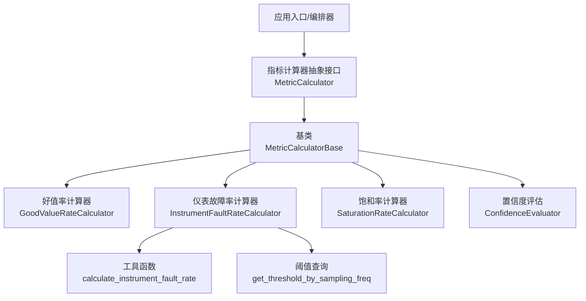
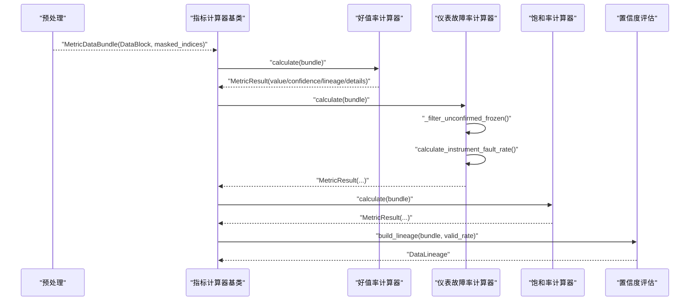
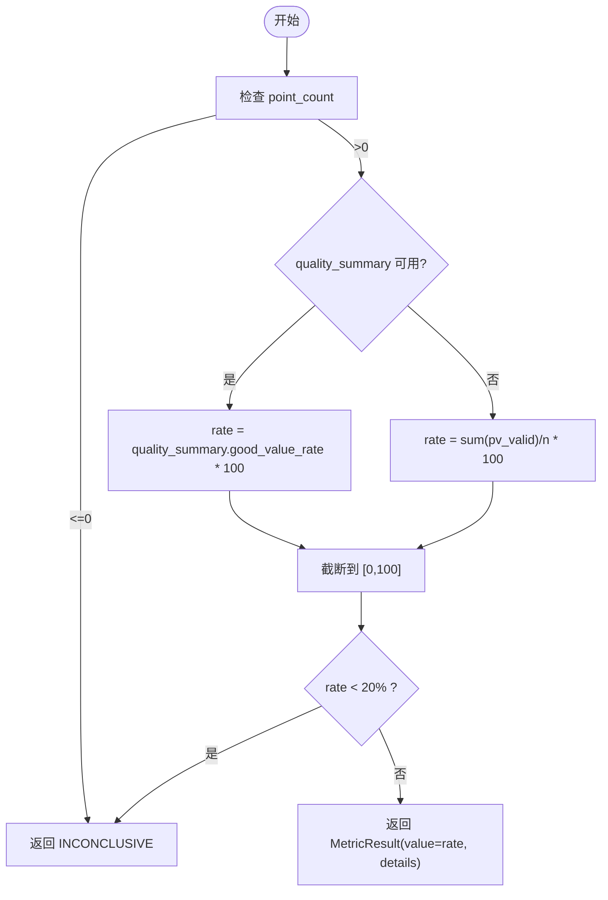
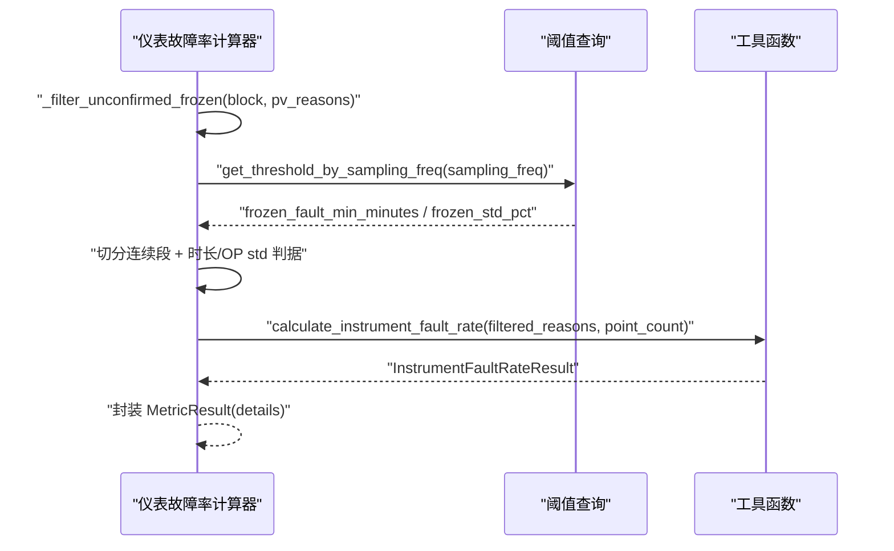
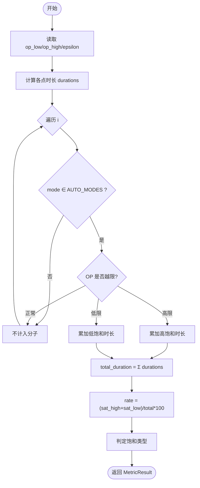
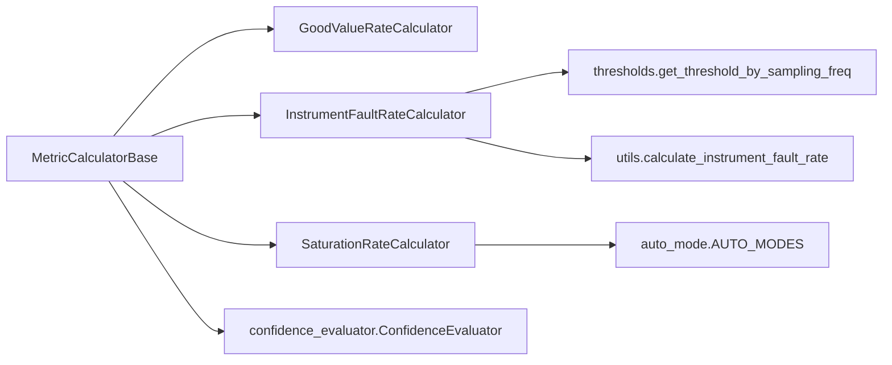

# 质量指标计算器

<cite>
**本文引用的文件**
- [backend/app/contracts/metric_calculator.py](file://backend/app/contracts/metric_calculator.py)
- [backend/app/services/metric_calculator/base.py](file://backend/app/services/metric_calculator/base.py)
- [backend/app/services/metric_calculator/good_value.py](file://backend/app/services/metric_calculator/good_value.py)
- [backend/app/services/metric_calculator/instrument_fault.py](file://backend/app/services/metric_calculator/instrument_fault.py)
- [backend/app/utils/instrument_fault_rate.py](file://backend/app/utils/instrument_fault_rate.py)
- [backend/app/services/metric_calculator/saturation.py](file://backend/app/services/metric_calculator/saturation.py)
- [backend/app/services/preprocessing/thresholds.py](file://backend/app/services/preprocessing/thresholds.py)
- [backend/app/services/confidence_evaluator.py](file://backend/app/services/confidence_evaluator.py)
</cite>

## 目录
1. [简介](#简介)
2. [项目结构](#项目结构)
3. [核心组件](#核心组件)
4. [架构总览](#架构总览)
5. [详细组件分析](#详细组件分析)
6. [依赖关系分析](#依赖关系分析)
7. [性能考量](#性能考量)
8. [故障排查指南](#故障排查指南)
9. [结论](#结论)
10. [附录](#附录)

## 简介
本技术文档围绕“质量指标计算器”展开，聚焦三类关键指标的计算与实现：好值率（good_value_rate）、仪表故障率（instrument_fault_rate）、饱和率（saturation_rate）。文档从数据流、算法逻辑、阈值配置、置信度评估、可视化建议到异常场景处理进行系统化说明，帮助读者理解并正确使用这些指标。

## 项目结构
质量指标计算位于后端服务层，采用统一的抽象接口与基类，各指标以独立模块实现，预处理阶段提供质量码、异常原因码与阈值等基础能力。

图表来源
- [backend/app/contracts/metric_calculator.py:17-66](file://backend/app/contracts/metric_calculator.py#L17-L66)
- [backend/app/services/metric_calculator/base.py:42-201](file://backend/app/services/metric_calculator/base.py#L42-L201)
- [backend/app/services/metric_calculator/good_value.py:28-88](file://backend/app/services/metric_calculator/good_value.py#L28-L88)
- [backend/app/services/metric_calculator/instrument_fault.py:52-123](file://backend/app/services/metric_calculator/instrument_fault.py#L52-L123)
- [backend/app/utils/instrument_fault_rate.py:61-138](file://backend/app/utils/instrument_fault_rate.py#L61-L138)
- [backend/app/services/metric_calculator/saturation.py:40-133](file://backend/app/services/metric_calculator/saturation.py#L40-L133)
- [backend/app/services/preprocessing/thresholds.py](file://backend/app/services/preprocessing/thresholds.py)
- [backend/app/services/confidence_evaluator.py](file://backend/app/services/confidence_evaluator.py)

章节来源
- [backend/app/contracts/metric_calculator.py:1-70](file://backend/app/contracts/metric_calculator.py#L1-L70)
- [backend/app/services/metric_calculator/base.py:1-348](file://backend/app/services/metric_calculator/base.py#L1-L348)

## 核心组件
- 指标计算器抽象接口：定义所有指标必须实现的输入输出契约（MetricDataBundle → MetricResult），支持依赖注入与链式调用。
- 指标计算器基类：提供信号提取、有效数据率计算、血缘构建、结果构造与 INCONCLUSIVE 兜底、时长计算等通用能力。
- 具体指标计算器：
  - 好值率：基于 PV 质量码统计有效时长占比，低好值率触发 INCONCLUSIVE。
  - 仪表故障率：统计超限/冻结/突变三类故障点占比，冻结需复合判据确认。
  - 饱和率：统计自控模式下输出限位的时长占比，区分高/低/双端饱和类型。

章节来源
- [backend/app/contracts/metric_calculator.py:17-66](file://backend/app/contracts/metric_calculator.py#L17-L66)
- [backend/app/services/metric_calculator/base.py:123-201](file://backend/app/services/metric_calculator/base.py#L123-L201)
- [backend/app/services/metric_calculator/good_value.py:28-88](file://backend/app/services/metric_calculator/good_value.py#L28-L88)
- [backend/app/services/metric_calculator/instrument_fault.py:52-123](file://backend/app/services/metric_calculator/instrument_fault.py#L52-L123)
- [backend/app/services/metric_calculator/saturation.py:40-133](file://backend/app/services/metric_calculator/saturation.py#L40-L133)

## 架构总览
质量指标计算遵循“预处理→指标计算→置信度评估→结果输出”的流水线。预处理阶段产出 DataBlock（含 signals、timestamps、outlier_reasons、quality_summary、validity 等）；指标计算器消费该数据块，按各自算法计算指标值，并通过基类统一生成带可信度与血缘的结果对象。

图表来源
- [backend/app/services/metric_calculator/base.py:140-201](file://backend/app/services/metric_calculator/base.py#L140-L201)
- [backend/app/services/metric_calculator/good_value.py:39-88](file://backend/app/services/metric_calculator/good_value.py#L39-L88)
- [backend/app/services/metric_calculator/instrument_fault.py:72-123](file://backend/app/services/metric_calculator/instrument_fault.py#L72-L123)
- [backend/app/utils/instrument_fault_rate.py:61-138](file://backend/app/utils/instrument_fault_rate.py#L61-L138)
- [backend/app/services/metric_calculator/saturation.py:52-133](file://backend/app/services/metric_calculator/saturation.py#L52-L133)
- [backend/app/services/confidence_evaluator.py](file://backend/app/services/confidence_evaluator.py)

## 详细组件分析

### 好值率（good_value_rate）
- 目标：衡量评估时段内 PV 为 Good 且数值在有效量程范围内的累计时长占比。
- 数据来源：优先使用预处理阶段的 quality_summary.good_value_rate；回退至 pv_valid 标记。
- 阈值与可信度：好值率 < 20% 时返回 INCONCLUSIVE（value=None，E 级可信度），用于提示整体可信度不足。
- 时间权重：直接按采样点数比例换算时长占比（零阶保持模型下等价于时长占比）。
- 可视化建议：以柱状图展示时段内 good_value_rate，叠加阈值线（20%）标注 INCONCLUSIVE 区间；可结合 mask 有效点占比（valid_rate）辅助解释。

图表来源
- [backend/app/services/metric_calculator/good_value.py:39-88](file://backend/app/services/metric_calculator/good_value.py#L39-L88)
- [backend/app/services/metric_calculator/base.py:144-201](file://backend/app/services/metric_calculator/base.py#L144-L201)

章节来源
- [backend/app/services/metric_calculator/good_value.py:28-88](file://backend/app/services/metric_calculator/good_value.py#L28-L88)
- [backend/app/services/metric_calculator/base.py:123-201](file://backend/app/services/metric_calculator/base.py#L123-L201)

### 仪表故障率（instrument_fault_rate）
- 目标：统计 PV 出现仪表故障（超限 OUT_OF_RANGE、冻结 FROZEN、突变 JUMP）的采样点占比。
- 故障模式识别：
  - 超限：超出量程范围。
  - 冻结：长期低方差且控制器有调节动作而 PV 无响应（复合判据）。
  - 突变：信号发生跳变。
- 时间权重：分母为评估时段总采样点数（point_count），分子为含故障原因码的不重复采样点数。
- 复合判据（FROZEN 确认）：
  - 连续段持续时间 ≥ frozen_fault_min_minutes（由采样频率查阈值）。
  - 同期 OP 标准差 > frozen_std_pct × 100（归一化量纲）。
  - 无法执行复合判据（缺 OP/时间戳/阈值）时回落旧口径（FROZEN 直接计故障），避免静默漏报。
- 置信度：沿用回路级 loop_confidence_level；指标级 valid_rate 用于可计算性判定（< 0.20 → INCONCLUSIVE）。
- 可视化建议：以堆叠柱状图展示 freeze/jump/overrange 三类故障点计数；叠加故障率曲线与阈值参考线；可叠加 OP 波动区间标识冻结确认段。

图表来源
- [backend/app/services/metric_calculator/instrument_fault.py:72-123](file://backend/app/services/metric_calculator/instrument_fault.py#L72-L123)
- [backend/app/services/metric_calculator/instrument_fault.py:129-195](file://backend/app/services/metric_calculator/instrument_fault.py#L129-L195)
- [backend/app/utils/instrument_fault_rate.py:61-138](file://backend/app/utils/instrument_fault_rate.py#L61-L138)
- [backend/app/services/preprocessing/thresholds.py](file://backend/app/services/preprocessing/thresholds.py)

章节来源
- [backend/app/services/metric_calculator/instrument_fault.py:52-215](file://backend/app/services/metric_calculator/instrument_fault.py#L52-L215)
- [backend/app/utils/instrument_fault_rate.py:1-146](file://backend/app/utils/instrument_fault_rate.py#L1-L146)
- [backend/app/services/preprocessing/thresholds.py](file://backend/app/services/preprocessing/thresholds.py)

### 饱和率（saturation_rate）
- 目标：统计自控模式下输出 OP 处于限位的时长占评估时段总时长的比例。
- 公式对齐国标：Sa = AutoSaturateTime / AllTime × 100%。
- 输出限幅检测：OP ≤ (op_low + ε) 或 OP ≥ (op_high - ε)，ε 默认 2%。
- 线性度分析与饱和区间识别：通过高/低饱和时长分解，判定饱和类型（HIGH/LOW/BOTH/NONE）。
- 时间权重：采用零阶保持模型，每个采样点代表一个时间间隔；最后一个点沿用前一段时长。
- 阈值配置：op_low/op_high 来自 CONFIG 信号（否则默认 0/100）；epsilon 来自 CONFIG（默认 2%）。
- 可视化建议：绘制 OP 时序与上下限包络线，着色标示饱和区间；叠加饱和率曲线与类型标签；可叠加自控模式掩码（仅 AUTO/CAS/REMOTE/APC 计入分子）。

图表来源
- [backend/app/services/metric_calculator/saturation.py:52-133](file://backend/app/services/metric_calculator/saturation.py#L52-L133)
- [backend/app/services/metric_calculator/saturation.py:148-185](file://backend/app/services/metric_calculator/saturation.py#L148-L185)

章节来源
- [backend/app/services/metric_calculator/saturation.py:40-189](file://backend/app/services/metric_calculator/saturation.py#L40-L189)

### 置信度评估与结果可视化
- 置信度等级：统一使用回路级 loop_confidence_level；指标级 valid_rate 用于可计算性判定（< 0.20 → INCONCLUSIVE）。
- 血缘追踪：通过 ConfidenceEvaluator.build_lineage 记录数据来源、版本、有效数据率等信息。
- 可视化建议：
  - 指标卡片：显示 value、confidence_level、valid_rate、details 摘要。
  - 趋势图：叠加阈值线与 INCONCLUSIVE 区间（如好值率 < 20%）。
  - 诊断视图：对仪表故障率展示三类故障点分布；对饱和率展示饱和类型与区间。

章节来源
- [backend/app/services/metric_calculator/base.py:144-201](file://backend/app/services/metric_calculator/base.py#L144-L201)
- [backend/app/services/confidence_evaluator.py](file://backend/app/services/confidence_evaluator.py)

## 依赖关系分析
- 指标计算器均依赖基类提供的信号提取、时长计算、结果构造与可信度判定。
- 仪表故障率依赖预处理阈值查询与独立工具函数，保证统计逻辑单一来源。
- 饱和率依赖自控模式集合与 CONFIG 信号中的上下限与容差。
- 所有指标共享置信度评估与血缘构建机制。

图表来源
- [backend/app/services/metric_calculator/base.py:42-201](file://backend/app/services/metric_calculator/base.py#L42-L201)
- [backend/app/services/metric_calculator/instrument_fault.py:52-123](file://backend/app/services/metric_calculator/instrument_fault.py#L52-L123)
- [backend/app/services/metric_calculator/saturation.py:40-133](file://backend/app/services/metric_calculator/saturation.py#L40-L133)
- [backend/app/utils/instrument_fault_rate.py:61-138](file://backend/app/utils/instrument_fault_rate.py#L61-L138)
- [backend/app/services/preprocessing/thresholds.py](file://backend/app/services/preprocessing/thresholds.py)
- [backend/app/services/confidence_evaluator.py](file://backend/app/services/confidence_evaluator.py)

章节来源
- [backend/app/services/metric_calculator/base.py:1-348](file://backend/app/services/metric_calculator/base.py#L1-L348)
- [backend/app/services/metric_calculator/instrument_fault.py:1-215](file://backend/app/services/metric_calculator/instrument_fault.py#L1-L215)
- [backend/app/services/metric_calculator/saturation.py:1-189](file://backend/app/services/metric_calculator/saturation.py#L1-L189)
- [backend/app/utils/instrument_fault_rate.py:1-146](file://backend/app/utils/instrument_fault_rate.py#L1-L146)

## 性能考量
- 时间复杂度：各指标均为 O(n) 扫描，n 为采样点数；仪表故障率的冻结复合判据对连续段进行线性扫描，整体仍为 O(n)。
- 内存占用：主要存储信号、时间戳与原因码列表；可通过掩码 indices 减少无效数据处理。
- 优化建议：
  - 批量计算时复用 DataBlock 与 timestamps，避免重复解析。
  - 对长序列可采用滑动窗口或分段聚合以降低峰值内存。
  - 合理设置采样频率与阈值，减少误检导致的重算。

[本节为通用指导，不直接分析具体文件]

## 故障排查指南
- 数据缺失：
  - 现象：point_count=0 或 masked_indices 过少导致 INCONCLUSIVE。
  - 处理：检查数据源接入与预处理管道；确认 mask 策略与信号完整性。
- 噪声干扰：
  - 现象：高频噪声导致突变/超限误报；冻结误报（平稳回路低方差）。
  - 处理：调整 outlier_detection 参数；启用冻结复合判据；必要时增加滤波。
- 设备离线：
  - 现象：长时间无数据或时间戳异常；总时长为 0。
  - 处理：校验时间戳连续性；对离线段进行插值或剔除；确保分母非零。
- 阈值配置错误：
  - 现象：饱和率或冻结判据不符合预期。
  - 处理：核对 CONFIG 信号中的 op_low/op_high/epsilon；确认采样频率对应的阈值表。

章节来源
- [backend/app/services/metric_calculator/base.py:144-238](file://backend/app/services/metric_calculator/base.py#L144-L238)
- [backend/app/services/metric_calculator/good_value.py:39-88](file://backend/app/services/metric_calculator/good_value.py#L39-L88)
- [backend/app/services/metric_calculator/instrument_fault.py:129-195](file://backend/app/services/metric_calculator/instrument_fault.py#L129-L195)
- [backend/app/services/metric_calculator/saturation.py:52-133](file://backend/app/services/metric_calculator/saturation.py#L52-L133)

## 结论
质量指标计算器通过统一抽象与基类，实现了好值率、仪表故障率与饱和率的标准化计算。其优势在于：
- 解耦数据与算法：指标仅消费 MetricDataBundle，便于扩展与维护。
- 统一可信度与血缘：保障结果可追溯与可比对。
- 鲁棒性强：内置 INCONCLUSIVE 兜底与复合判据，降低误报与漏报风险。
建议在生产环境中结合可视化与阈值调优，持续监控指标稳定性与业务契合度。

[本节为总结性内容，不直接分析具体文件]

## 附录
- 术语对照：
  - 好值率：PV 质量码为 Good 的有效时长占比。
  - 仪表故障率：超限/冻结/突变三类故障点占比。
  - 饱和率：自控模式下输出限位的时长占比。
- 相关配置键：
  - op_low、op_high、saturation_epsilon（饱和率）
  - frozen_fault_min_minutes、frozen_std_pct（冻结判据）
  - base_sampling_freq（阈值查询基准）

[本节为补充信息，不直接分析具体文件]