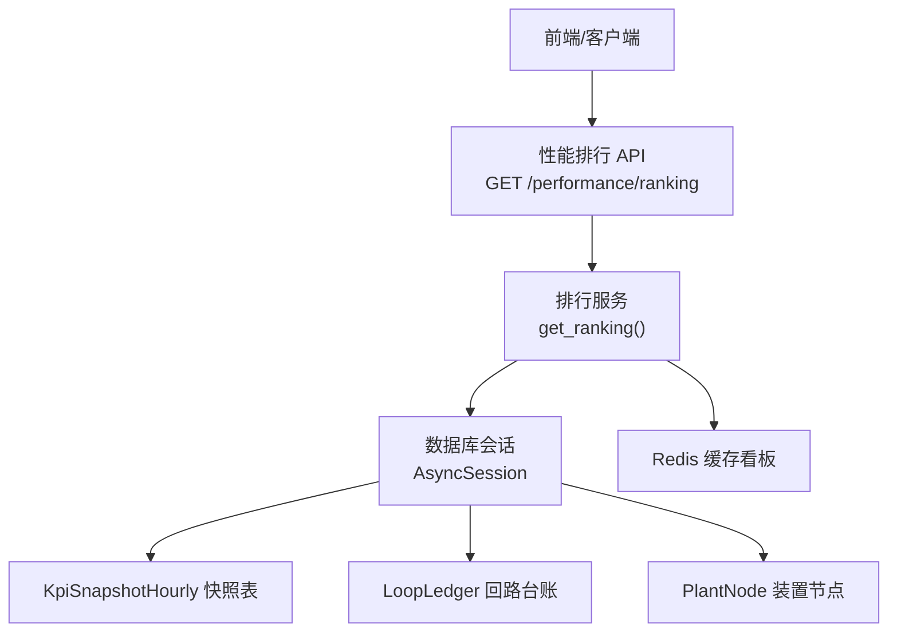
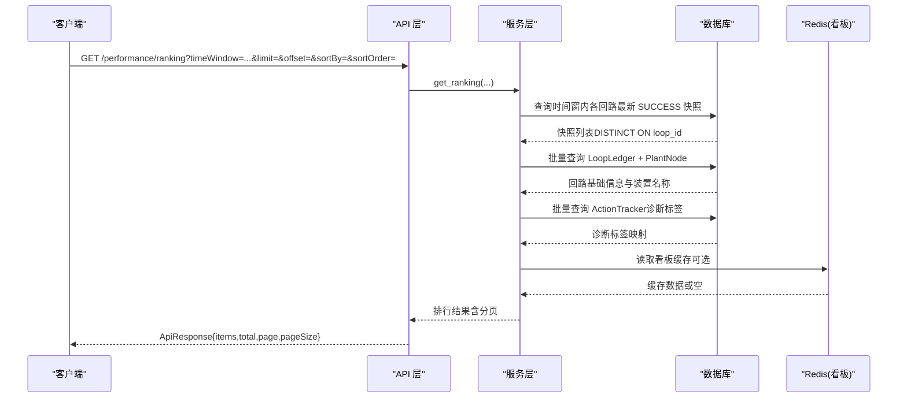
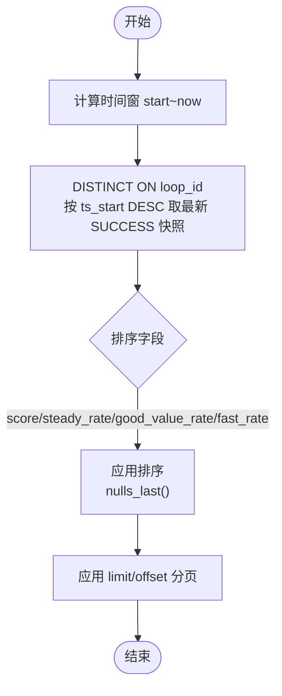
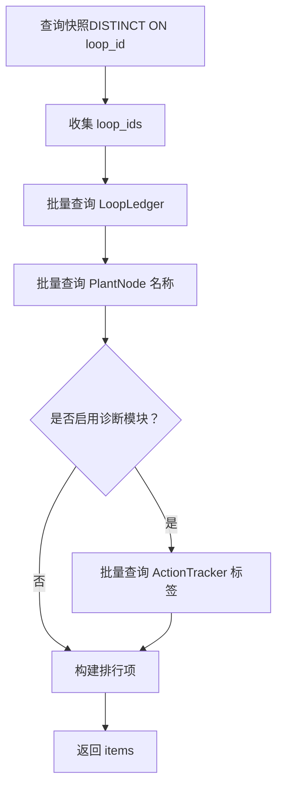
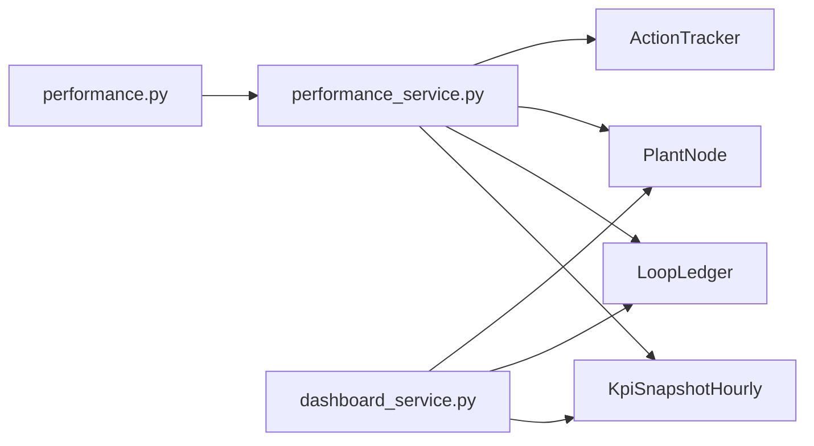

# 低效回路排行

<cite>
**本文引用的文件**
- [performance.py](file://backend/app/api/v1/endpoints/performance.py)
- [performance_service.py](file://backend/app/services/performance.py)
- [dashboard_service.py](file://backend/app/services/dashboard.py)
- [loop_model.py](file://backend/app/models/loop.py)
- [loop_schema.py](file://backend/app/schemas/loop.py)
- [exceptions.py](file://backend/app/core/exceptions.py)
- [test_dashboard.py](file://backend/tests/test_dashboard.py)
- [benchmark_metrics.py](file://backend/scripts/benchmark_metrics.py)
</cite>

## 目录
1. [简介](#简介)
2. [项目结构](#项目结构)
3. [核心组件](#核心组件)
4. [架构总览](#架构总览)
5. [详细组件分析](#详细组件分析)
6. [依赖关系分析](#依赖关系分析)
7. [性能考量](#性能考量)
8. [故障排查指南](#故障排查指南)
9. [结论](#结论)
10. [附录](#附录)

## 简介
本技术文档围绕“低效回路排行”功能，系统性说明排序算法实现、数据获取流程、性能优化策略、数据完整性保证、API 接口规范与测试用例设计。该功能从 KPI 小时快照中按综合评分升序输出低效回路，支持装置节点筛选、时间窗过滤、分页拉取、NULL 值处理与诊断标签关联展示，并通过批量查询避免 N+1 问题，确保在大规模回路场景下的稳定性能。

## 项目结构
低效回路排行的后端实现由 API 层、服务层、模型与模式定义组成：
- API 层：提供 GET /api/v1/performance/ranking 接口，负责参数解析、校验与调用服务层。
- 服务层：封装排行计算逻辑，包括时间窗计算、快照去重、排序、分页、批量加载回路信息与诊断标签等。
- 模型与模式：定义回路台账、KPI 快照、节点等实体及响应数据结构。
- 测试与基准：覆盖边界条件、排序正确性、分页行为与性能基线。

图表来源
- [performance.py:172-214](file://backend/app/api/v1/endpoints/performance.py#L172-L214)
- [performance_service.py:675-800](file://backend/app/services/performance.py#L675-L800)
- [dashboard_service.py:480-553](file://backend/app/services/dashboard.py#L480-L553)

章节来源
- [performance.py:172-214](file://backend/app/api/v1/endpoints/performance.py#L172-L214)
- [performance_service.py:675-800](file://backend/app/services/performance.py#L675-L800)
- [dashboard_service.py:480-553](file://backend/app/services/dashboard.py#L480-L553)

## 核心组件
- 排行 API：接收 plantNodeId、timeWindow、startTime/endTime、limit、offset、sortBy、sortOrder 等参数，返回统一 ApiResponse。
- 排行服务：根据 timeWindow 计算时间范围；对每个回路取最新 SUCCESS 快照；按指定字段排序并处理 NULL 值；分页返回；批量加载回路基础信息与诊断标签。
- 看板聚合（可选）：dashboard 模块也包含低效回路 Top 10 构建逻辑，用于工作台聚合，采用相同思路但侧重 Top 10 限制。

章节来源
- [performance.py:172-214](file://backend/app/api/v1/endpoints/performance.py#L172-L214)
- [performance_service.py:675-800](file://backend/app/services/performance.py#L675-L800)
- [dashboard_service.py:480-553](file://backend/app/services/dashboard.py#L480-L553)

## 架构总览
低效回路排行的端到端流程如下：
- 请求进入 API，解析并校验参数。
- 服务层计算时间窗，构造子查询以 DISTINCT ON 方式获取每个回路的最新 SUCCESS 快照。
- 外层查询按指定字段排序，使用 NULLS LAST 将 NULL 置末位，再应用 limit/offset 分页。
- 批量加载回路基础信息（loop_ledger）与装置名称（plant_node），以及诊断标签（ActionTracker）。
- 组装响应项并返回。

图表来源
- [performance.py:172-214](file://backend/app/api/v1/endpoints/performance.py#L172-L214)
- [performance_service.py:675-800](file://backend/app/services/performance.py#L675-L800)
- [dashboard_service.py:480-553](file://backend/app/services/dashboard.py#L480-L553)

## 详细组件分析

### 排序算法实现
- 综合评分升序排列：默认 sortBy=score、sortOrder=asc，分数最低者在前，符合“低效优先”的业务语义。
- 其他排序字段：支持 steady_rate、good_value_rate、fast_rate，通过白名单映射到列名，防止 SQL 注入。
- NULL 值处理：排序时采用 nulls_last()，将无评分的回路置于末尾，避免误判为真实 0 分。
- 去重策略：使用 DISTINCT ON loop_id 并按 ts_start 降序，确保每个回路仅取最新一条 SUCCESS 快照参与排序。

图表来源
- [performance_service.py:675-800](file://backend/app/services/performance.py#L675-L800)

章节来源
- [performance_service.py:675-800](file://backend/app/services/performance.py#L675-L800)

### 数据获取流程
- 快照数据查询：基于 KpiSnapshotHourly，按时间窗与状态过滤，DISTINCT ON loop_id 取最新记录。
- 回路基础信息批量加载：收集排序后的 loop_ids，一次性查询 LoopLedger，再批量查询 PlantNode 获取装置名称。
- 诊断标签关联查询：若启用诊断模块，批量查询 ActionTracker 中 PENDING/IN_PROGRESS 的最新标签，建立 loop_id → diagnosis_label 映射。

图表来源
- [performance_service.py:752-800](file://backend/app/services/performance.py#L752-L800)
- [dashboard_service.py:507-523](file://backend/app/services/dashboard.py#L507-L523)

章节来源
- [performance_service.py:752-800](file://backend/app/services/performance.py#L752-L800)
- [dashboard_service.py:507-523](file://backend/app/services/dashboard.py#L507-L523)

### 性能优化技术
- 批量查询避免 N+1：对排序后的 loop_ids 进行一次性 IN 查询，减少多次往返。
- 索引优化策略：
  - loop_ledger.unit_id、tag_name、status、importance_level 等字段具备索引，便于按装置、状态、重要等级快速过滤。
  - kpi_snapshot_hourly 按 loop_id 与 ts_start 组合去重与排序，提升 DISTINCT ON 效率。
- 内存排序算法选择：SQL 层完成去重与排序，Python 层仅做少量组装与映射，降低内存排序开销。
- 分页优化：limit/offset 控制单次返回量，支持 offset 分页拉取全量，缓解前端统计口径不一致问题。

章节来源
- [loop_model.py:153-187](file://backend/app/models/loop.py#L153-L187)
- [performance_service.py:724-749](file://backend/app/services/performance.py#L724-L749)

### 数据完整性保证
- 回路 ID 映射：通过 loop_id 作为主键，确保快照与回路台账一致关联。
- 装置名称解析：批量查询 PlantNode 名称，缺失时允许为空，不影响整体排行。
- 诊断结果关联：仅关联最新开放态诊断标签（PENDING/IN_PROGRESS），避免历史闭环干扰展示。

章节来源
- [performance_service.py:770-789](file://backend/app/services/performance.py#L770-L789)
- [dashboard_service.py:514-523](file://backend/app/services/dashboard.py#L514-L523)

### API 接口规范
- 路径与方法：GET /api/v1/performance/ranking
- 请求参数：
  - plantNodeId：按装置/单元筛选（可选）
  - timeWindow：today/yesterday/last_8_hours/last_24_hours/last_72_hours/last_168_hours/last_7_days/last_30_days/custom（默认 today）
  - startTime/endTime：custom 时必填，ISO 8601
  - limit：返回条数，1 ≤ limit ≤ 100（默认 20）
  - offset：偏移量，≥ 0（默认 0）
  - sortBy：score/steady_rate/good_value_rate（默认 score）
  - sortOrder：asc/desc（默认 asc）
- 响应数据结构：ApiResponse[list[RankingItem]]，包含 items、total、page、pageSize。
- 错误码定义：遵循全局错误码体系，如 ERR_VALIDATION、ERR_LOOP_NOT_FOUND、ERR_DATABASE 等。

章节来源
- [performance.py:172-214](file://backend/app/api/v1/endpoints/performance.py#L172-L214)
- [exceptions.py:36-61](file://backend/app/core/exceptions.py#L36-L61)

### 测试用例设计
- 边界条件测试：
  - 空数据集：验证返回空列表与 total=0。
  - 全部 NULL 评分：验证 NULLS LAST 行为，NULL 排在末尾。
  - 自定义时间窗：验证 startTime/endTime 解析与过滤。
- 性能基准测试：
  - 不同数据规模下排序与分页耗时对比。
  - 批量查询次数验证，确保无 N+1。
- 数据一致性验证：
  - 排序结果与快照最新时间一致。
  - 装置名称与回路台账关联正确。
  - 诊断标签仅显示最新开放态。

章节来源
- [test_dashboard.py:471-546](file://backend/tests/test_dashboard.py#L471-L546)
- [benchmark_metrics.py:427-457](file://backend/scripts/benchmark_metrics.py#L427-L457)

## 依赖关系分析
- API 层依赖服务层：performance.py 调用 performance_service.get_ranking。
- 服务层依赖模型：performance_service 使用 KpiSnapshotHourly、LoopLedger、PlantNode、ActionTracker。
- 看板服务与排行服务共享快照与回路模型，但侧重点不同（Top 10 vs 分页排行）。

图表来源
- [performance.py:172-214](file://backend/app/api/v1/endpoints/performance.py#L172-L214)
- [performance_service.py:675-800](file://backend/app/services/performance.py#L675-L800)
- [dashboard_service.py:480-553](file://backend/app/services/dashboard.py#L480-L553)

章节来源
- [performance.py:172-214](file://backend/app/api/v1/endpoints/performance.py#L172-L214)
- [performance_service.py:675-800](file://backend/app/services/performance.py#L675-L800)
- [dashboard_service.py:480-553](file://backend/app/services/dashboard.py#L480-L553)

## 性能考量
- 排序与去重在 SQL 层完成，减少 Python 内存压力。
- 批量查询显著降低数据库 RTT，避免 N+1 问题。
- 索引覆盖关键过滤与排序字段，提升查询效率。
- 分页限制单次返回量，支持 offset 分页拉取全量，平衡前端渲染与后端负载。
- 看板缓存（Redis）降低重复聚合压力，排行接口可独立扩展缓存策略。

## 故障排查指南
- 参数校验失败：检查 timeWindow、startTime/endTime 格式与合法性。
- 数据为空：确认时间窗内是否存在 SUCCESS 快照，或装置节点是否正确。
- 排序异常：检查 sortBy 是否在白名单内，sortOrder 是否为 asc/desc。
- 诊断标签缺失：确认诊断模块是否启用，ActionTracker 是否存在 PENDING/IN_PROGRESS 记录。
- 性能退化：监控数据库慢查询日志，确认索引是否命中，批量查询是否生效。

章节来源
- [exceptions.py:36-61](file://backend/app/core/exceptions.py#L36-L61)

## 结论
低效回路排行功能通过 SQL 层去重与排序、NULLS LAST 处理、批量查询与索引优化，实现了高效稳定的排行榜能力。API 层提供灵活的筛选与分页参数，服务层保证数据完整性与可扩展性。测试与基准覆盖了边界条件与性能基线，确保在生产环境中的可靠性。

## 附录
- 相关模型与模式：
  - LoopLedger：回路台账，包含 tag_name、unit_id、status、importance_level 等字段与索引。
  - KpiSnapshotHourly：KPI 小时快照，包含 score、steady_rate、good_value_rate 等指标。
  - PlantNode：装置节点，提供名称与层级关系。
- 相关测试与脚本：
  - test_dashboard：验证低效回路排序与 Top 10 限制。
  - benchmark_metrics：性能基准报告生成与分析。

章节来源
- [loop_model.py:33-187](file://backend/app/models/loop.py#L33-L187)
- [loop_schema.py:206-250](file://backend/app/schemas/loop.py#L206-L250)
- [test_dashboard.py:471-546](file://backend/tests/test_dashboard.py#L471-L546)
- [benchmark_metrics.py:427-457](file://backend/scripts/benchmark_metrics.py#L427-L457)