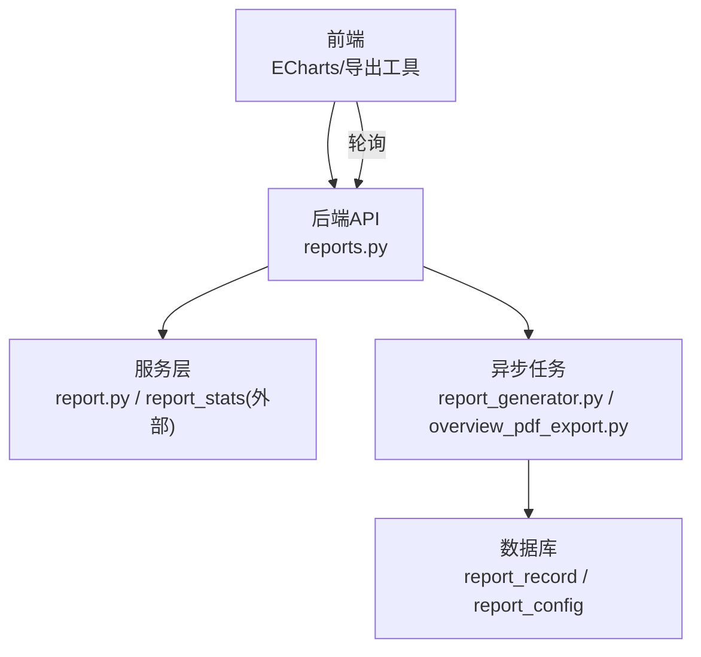
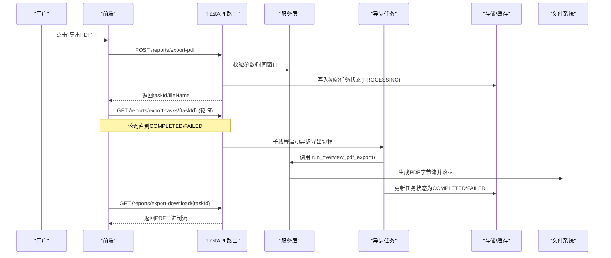
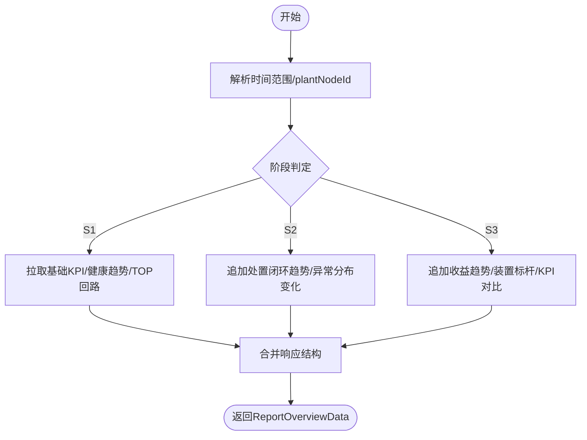
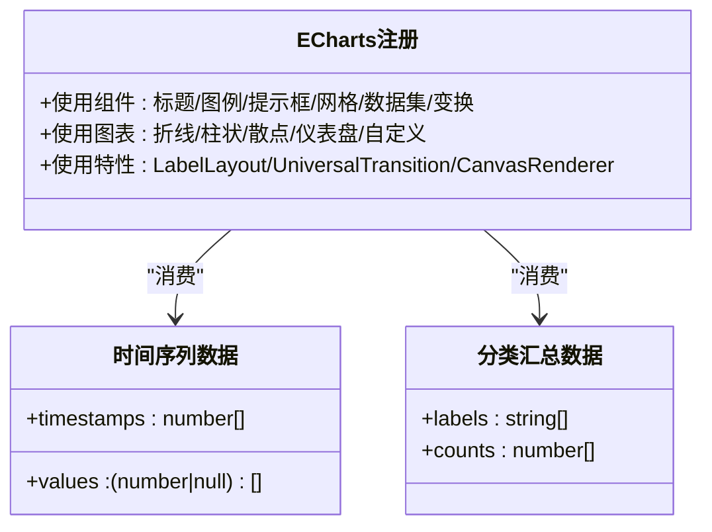
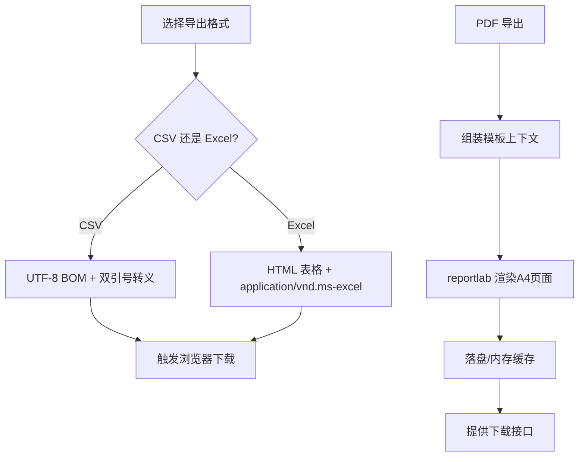
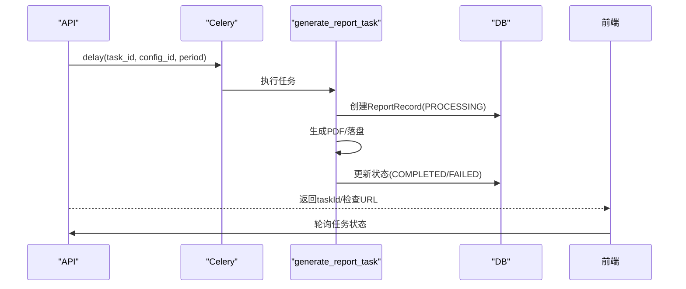
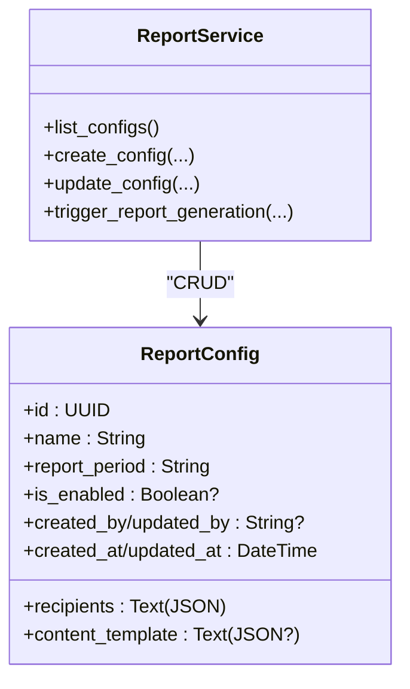
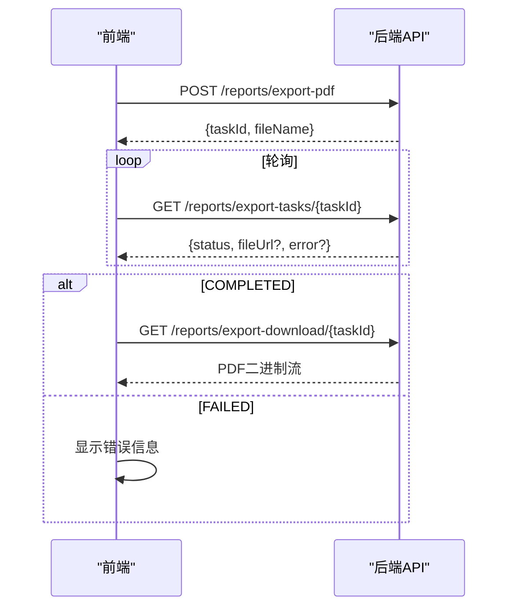
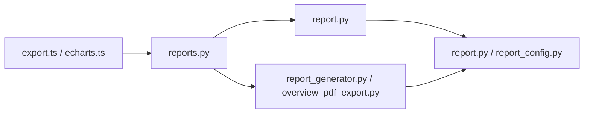

# 报表生成功能

<cite>
**本文引用的文件**
- [backend/app/api/v1/endpoints/reports.py](file://backend/app/api/v1/endpoints/reports.py)
- [backend/app/services/report.py](file://backend/app/services/report.py)
- [backend/app/tasks/report_generator.py](file://backend/app/tasks/report_generator.py)
- [backend/app/tasks/overview_pdf_export.py](file://backend/app/tasks/overview_pdf_export.py)
- [backend/app/models/report.py](file://backend/app/models/report.py)
- [backend/app/models/report_config.py](file://backend/app/models/report_config.py)
- [backend/app/schemas/report.py](file://backend/app/schemas/report.py)
- [frontend/apps/web-antd/src/utils/export.ts](file://frontend/apps/web-antd/src/utils/export.ts)
- [frontend/apps/web-antd/src/views/reports/overview.vue](file://frontend/apps/web-antd/src/views/reports/overview.vue)
- [frontend/packages/effects/plugins/src/echarts/echarts.ts](file://frontend/packages/effects/plugins/src/echarts/echarts.ts)
</cite>

## 目录
1. [简介](#简介)
2. [项目结构](#项目结构)
3. [核心组件](#核心组件)
4. [架构总览](#架构总览)
5. [详细组件分析](#详细组件分析)
6. [依赖关系分析](#依赖关系分析)
7. [性能考虑](#性能考虑)
8. [故障排查指南](#故障排查指南)
9. [结论](#结论)
10. [附录](#附录)

## 简介
本技术文档围绕“报表生成功能”展开，覆盖多维度统计聚合、图表数据准备、导出能力（CSV/PDF）、异步任务处理（Celery/线程+内存状态）、报表配置管理、性能优化与质量保证等关键主题。系统提供：
- 管理总览 API（S1/S2/S3 自适应阶段）
- 诊断统计与收益报告 API
- 后台异步 PDF 导出（基于 reportlab 的模板渲染）
- 通用 CSV/Excel 前端导出工具
- 报表配置与生成任务生命周期管理

## 项目结构
后端采用 FastAPI 路由 + 服务层 + Celery 任务 + SQLAlchemy 模型的分层设计；前端通过 ECharts 可视化与通用导出工具完成展示与下载。

图示来源
- [backend/app/api/v1/endpoints/reports.py:1-15](file://backend/app/api/v1/endpoints/reports.py#L1-L15)
- [backend/app/services/report.py:1-8](file://backend/app/services/report.py#L1-L8)
- [backend/app/tasks/report_generator.py:1-15](file://backend/app/tasks/report_generator.py#L1-L15)
- [backend/app/tasks/overview_pdf_export.py:1-8](file://backend/app/tasks/overview_pdf_export.py#L1-L8)

章节来源
- [backend/app/api/v1/endpoints/reports.py:1-15](file://backend/app/api/v1/endpoints/reports.py#L1-L15)
- [backend/app/services/report.py:1-8](file://backend/app/services/report.py#L1-L8)
- [backend/app/tasks/report_generator.py:1-15](file://backend/app/tasks/report_generator.py#L1-L15)
- [backend/app/tasks/overview_pdf_export.py:1-8](file://backend/app/tasks/overview_pdf_export.py#L1-L8)

## 核心组件
- 报表配置与生成服务：负责配置 CRUD、触发异步生成、审计日志记录、任务状态查询。
- 报表生成任务：Celery 任务，支持周期调度、业务错误不重试、系统错误自动重试。
- 管理总览 PDF 导出：按 S1/S2/S3 阶段自适应渲染，复用 reportlab 模板。
- 数据模型：report_record（归档记录）、report_config（配置）。
- 前端导出工具：CSV/Excel 导出，HTML 表格兼容 Excel。
- ECharts 集成：统一注册图表与组件，支撑趋势图、柱状图等。

章节来源
- [backend/app/services/report.py:57-213](file://backend/app/services/report.py#L57-L213)
- [backend/app/tasks/report_generator.py:47-83](file://backend/app/tasks/report_generator.py#L47-L83)
- [backend/app/tasks/overview_pdf_export.py:39-103](file://backend/app/tasks/overview_pdf_export.py#L39-L103)
- [backend/app/models/report.py:20-44](file://backend/app/models/report.py#L20-L44)
- [backend/app/models/report_config.py:27-55](file://backend/app/models/report_config.py#L27-L55)
- [frontend/apps/web-antd/src/utils/export.ts:1-150](file://frontend/apps/web-antd/src/utils/export.ts#L1-L150)
- [frontend/packages/effects/plugins/src/echarts/echarts.ts:1-59](file://frontend/packages/effects/plugins/src/echarts/echarts.ts#L1-L59)

## 架构总览
下图展示了从前端发起请求到后端服务、任务执行、PDF 渲染与下载的完整链路，以及任务状态轮询机制。

图示来源
- [backend/app/api/v1/endpoints/reports.py:338-476](file://backend/app/api/v1/endpoints/reports.py#L338-L476)
- [backend/app/tasks/overview_pdf_export.py:39-103](file://backend/app/tasks/overview_pdf_export.py#L39-L103)

章节来源
- [backend/app/api/v1/endpoints/reports.py:338-476](file://backend/app/api/v1/endpoints/reports.py#L338-L476)
- [backend/app/tasks/overview_pdf_export.py:39-103](file://backend/app/tasks/overview_pdf_export.py#L39-L103)

## 详细组件分析

### 多维度统计与聚合（按装置、时间、回路）
- 管理总览 API 支持按时间范围与 plantNodeId 过滤，内部根据阶段（S1/S2/S3）自适应填充指标、趋势与 TOP 问题回路。
- 诊断统计与收益报告分别提供分类分布、置信度分布、前后 KPI 对比与装置标杆等维度。
- 阶段锁定机制允许管理员锁定输出阶段，保证报表骨架稳定。

图示来源
- [backend/app/api/v1/endpoints/reports.py:198-218](file://backend/app/api/v1/endpoints/reports.py#L198-L218)
- [backend/app/schemas/report.py:142-159](file://backend/app/schemas/report.py#L142-L159)

章节来源
- [backend/app/api/v1/endpoints/reports.py:198-218](file://backend/app/api/v1/endpoints/reports.py#L198-L218)
- [backend/app/schemas/report.py:142-159](file://backend/app/schemas/report.py#L142-L159)

### 图表数据准备（ECharts）
- 前端统一注册 ECharts 组件与特性，确保折线、柱状、散点、仪表盘等可用。
- 时间序列数据以时间戳数组与对应值数组配对构造，空值以 null 表示断点或无效时段。
- 分类数据汇总用于饼图/柱状图，如诊断分类占比、置信度区间分布等。

图示来源
- [frontend/packages/effects/plugins/src/echarts/echarts.ts:1-59](file://frontend/packages/effects/plugins/src/echarts/echarts.ts#L1-L59)

章节来源
- [frontend/packages/effects/plugins/src/echarts/echarts.ts:1-59](file://frontend/packages/effects/plugins/src/echarts/echarts.ts#L1-L59)

### 导出功能实现（CSV/Excel/PDF）
- CSV/Excel：前端工具将二维数据表转换为 UTF-8 BOM 的 CSV 或 HTML 表格（.xls），无需第三方库。
- PDF：后端基于 reportlab 的模板引擎渲染管理总览报告，按阶段控制章节显隐，输出 A4 纵向文档。

图示来源
- [frontend/apps/web-antd/src/utils/export.ts:1-150](file://frontend/apps/web-antd/src/utils/export.ts#L1-L150)
- [backend/app/tasks/overview_pdf_export.py:111-598](file://backend/app/tasks/overview_pdf_export.py#L111-L598)

章节来源
- [frontend/apps/web-antd/src/utils/export.ts:1-150](file://frontend/apps/web-antd/src/utils/export.ts#L1-L150)
- [backend/app/tasks/overview_pdf_export.py:111-598](file://backend/app/tasks/overview_pdf_export.py#L111-L598)

### 异步任务处理（Celery/进度跟踪/失败重试）
- 报表生成任务通过 Celery 调度，支持 SHIFT/DAILY/WEEKLY/MONTHLY 周期。
- 任务入口封装了业务错误（NonRetryableError）不重试、系统错误自动重试 3 次的策略。
- 管理总览 PDF 导出采用轻量级线程+内存任务表模式，避免强依赖 Celery，同时提供状态查询与下载接口。

图示来源
- [backend/app/tasks/report_generator.py:47-83](file://backend/app/tasks/report_generator.py#L47-L83)
- [backend/app/tasks/report_generator.py:125-196](file://backend/app/tasks/report_generator.py#L125-L196)
- [backend/app/models/report.py:20-44](file://backend/app/models/report.py#L20-L44)

章节来源
- [backend/app/tasks/report_generator.py:47-83](file://backend/app/tasks/report_generator.py#L47-L83)
- [backend/app/tasks/report_generator.py:125-196](file://backend/app/tasks/report_generator.py#L125-L196)
- [backend/app/models/report.py:20-44](file://backend/app/models/report.py#L20-L44)

### 报表配置管理（模板定制/字段选择/格式设置）
- 配置项包括名称、周期、接收人、内容模板、启用状态等，支持创建、更新、列表查询。
- 内容模板以 JSON 形式存储，可在生成时解析并注入到 PDF 中。
- 审计日志记录每次配置的变更前后值，便于追溯。

图示来源
- [backend/app/models/report_config.py:27-55](file://backend/app/models/report_config.py#L27-L55)
- [backend/app/services/report.py:57-213](file://backend/app/services/report.py#L57-L213)

章节来源
- [backend/app/models/report_config.py:27-55](file://backend/app/models/report_config.py#L27-L55)
- [backend/app/services/report.py:57-213](file://backend/app/services/report.py#L57-L213)

### 前端交互与导出流程
- 前端在“管理总览”页面触发 PDF 导出，提交 stage、日期范围与 plantNodeId，获取 taskId。
- 轮询任务状态，完成后通过 a 标签触发下载，文件名由后端返回。
- 通用导出工具支持 CSV/Excel 两种格式，适用于各类表格数据导出场景。

图示来源
- [frontend/apps/web-antd/src/views/reports/overview.vue:470-507](file://frontend/apps/web-antd/src/views/reports/overview.vue#L470-L507)
- [backend/app/api/v1/endpoints/reports.py:338-476](file://backend/app/api/v1/endpoints/reports.py#L338-L476)

章节来源
- [frontend/apps/web-antd/src/views/reports/overview.vue:470-507](file://frontend/apps/web-antd/src/views/reports/overview.vue#L470-L507)
- [backend/app/api/v1/endpoints/reports.py:338-476](file://backend/app/api/v1/endpoints/reports.py#L338-L476)

## 依赖关系分析
- 路由层依赖服务层进行业务逻辑处理与任务调度。
- 服务层依赖模型层进行持久化与审计日志记录。
- 任务层依赖数据库会话与模板渲染库（reportlab）。
- 前端依赖 ECharts 组件与导出工具函数。

图示来源
- [backend/app/api/v1/endpoints/reports.py:1-15](file://backend/app/api/v1/endpoints/reports.py#L1-L15)
- [backend/app/services/report.py:1-8](file://backend/app/services/report.py#L1-L8)
- [backend/app/tasks/report_generator.py:1-15](file://backend/app/tasks/report_generator.py#L1-L15)
- [backend/app/tasks/overview_pdf_export.py:1-8](file://backend/app/tasks/overview_pdf_export.py#L1-L8)
- [frontend/apps/web-antd/src/utils/export.ts:1-150](file://frontend/apps/web-antd/src/utils/export.ts#L1-L150)
- [frontend/packages/effects/plugins/src/echarts/echarts.ts:1-59](file://frontend/packages/effects/plugins/src/echarts/echarts.ts#L1-L59)

章节来源
- [backend/app/api/v1/endpoints/reports.py:1-15](file://backend/app/api/v1/endpoints/reports.py#L1-L15)
- [backend/app/services/report.py:1-8](file://backend/app/services/report.py#L1-L8)
- [backend/app/tasks/report_generator.py:1-15](file://backend/app/tasks/report_generator.py#L1-L15)
- [backend/app/tasks/overview_pdf_export.py:1-8](file://backend/app/tasks/overview_pdf_export.py#L1-L8)
- [frontend/apps/web-antd/src/utils/export.ts:1-150](file://frontend/apps/web-antd/src/utils/export.ts#L1-L150)
- [frontend/packages/effects/plugins/src/echarts/echarts.ts:1-59](file://frontend/packages/effects/plugins/src/echarts/echarts.ts#L1-L59)

## 性能考虑
- 大数据量处理：PDF 渲染时对长趋势数据进行抽样（如近 90 天自控率曲线采样），避免过宽导致渲染缓慢。
- 内存管理：PDF 导出结果先写入内存缓存，小文件直接返回；大文件可落盘后按需读取。
- 并发控制：PDF 导出使用独立线程运行异步协程，避免阻塞主事件循环；任务状态表加锁保护。
- 查询优化：管理总览按阶段条件拉取数据，减少不必要的 S2/S3 数据加载。

[本节为通用指导，不直接分析具体文件]

## 故障排查指南
- 任务不存在或已过期：PDF 导出任务状态查询返回 404，需确认 task_id 是否有效且未超时清理。
- 非法阶段参数：阶段锁定更新接口对非法阶段返回 400，需传入 S1/S2/S3 或 None。
- 业务错误不重试：报表生成任务遇到 NonRetryableError（如配置缺失、非法周期）直接失败，需修正配置或参数。
- 系统错误自动重试：非业务错误会触发重试，关注日志中的异常堆栈与重试次数。

章节来源
- [backend/app/api/v1/endpoints/reports.py:278-297](file://backend/app/api/v1/endpoints/reports.py#L278-L297)
- [backend/app/api/v1/endpoints/reports.py:427-445](file://backend/app/api/v1/endpoints/reports.py#L427-L445)
- [backend/app/tasks/report_generator.py:125-196](file://backend/app/tasks/report_generator.py#L125-L196)

## 结论
该报表生成功能以清晰的分层架构实现了多维度统计、灵活的导出能力与健壮的异步任务处理。通过阶段自适应、模板化渲染与完善的错误处理机制，既保证了数据准确性与格式一致性，又兼顾了性能与可扩展性。后续可结合 Headless Browser 渲染进一步提升报表样式与图表嵌入能力。

[本节为总结性内容，不直接分析具体文件]

## 附录
- 相关 API 端点：
  - 管理总览：GET /api/v1/reports/overview
  - 诊断统计：GET /api/v1/reports/diagnosis-statistics
  - 收益报告：GET /api/v1/reports/benefit
  - 阶段锁定：GET/PUT /api/v1/reports/stage-lock
  - PDF 导出：POST /api/v1/reports/export-pdf；状态查询：GET /api/v1/reports/export-tasks/{task_id}；下载：GET /api/v1/reports/export-download/{task_id}
  - 报表生成：POST /api/v1/reports/generate；状态查询：GET /api/v1/reports/tasks/{task_id}

章节来源
- [backend/app/api/v1/endpoints/reports.py:116-297](file://backend/app/api/v1/endpoints/reports.py#L116-L297)
- [backend/app/api/v1/endpoints/reports.py:338-476](file://backend/app/api/v1/endpoints/reports.py#L338-L476)