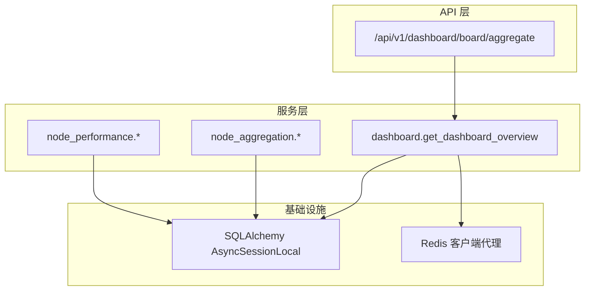
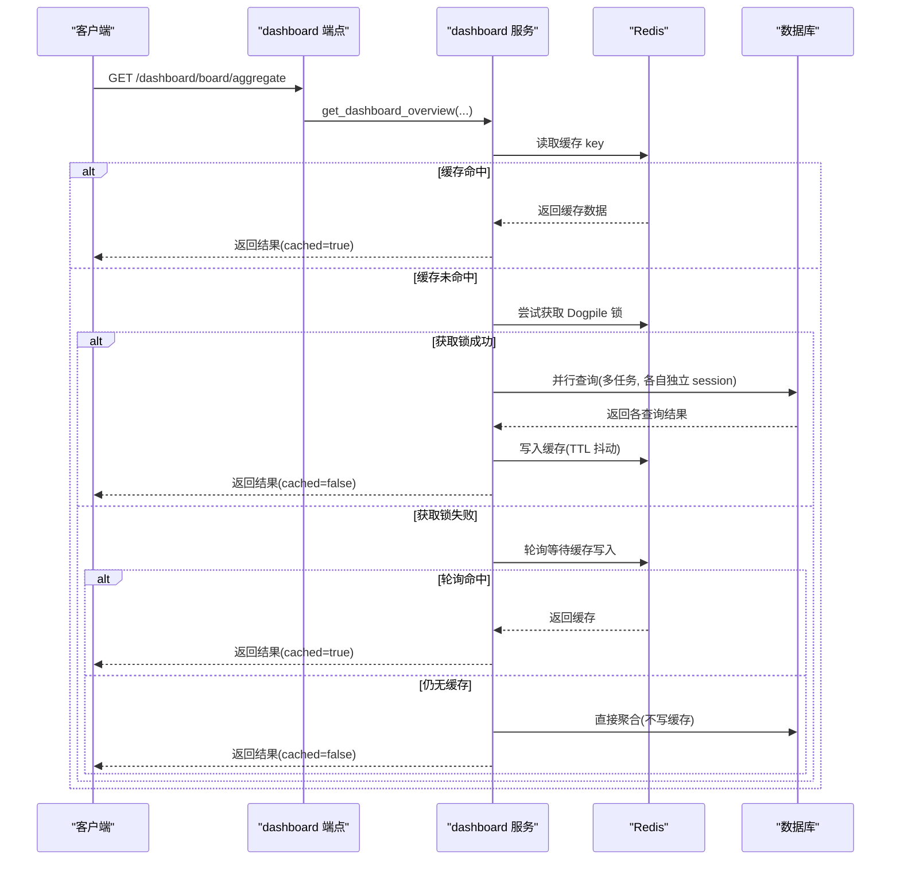
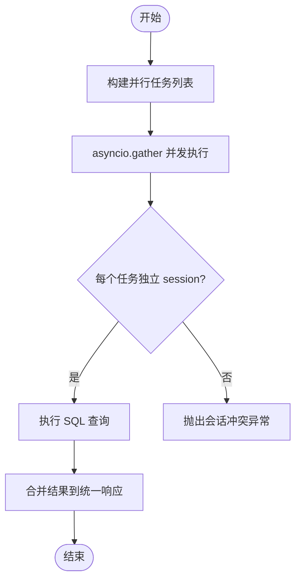
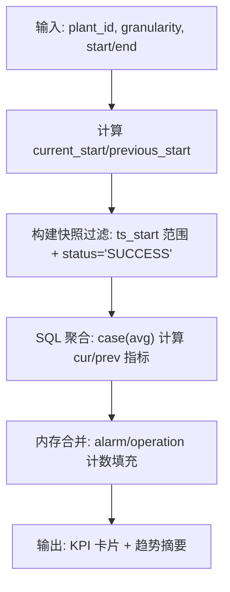
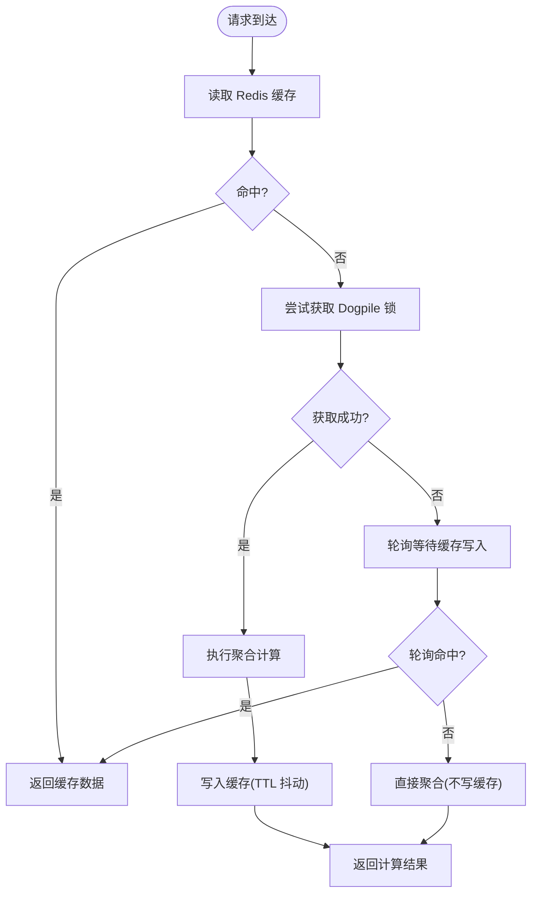
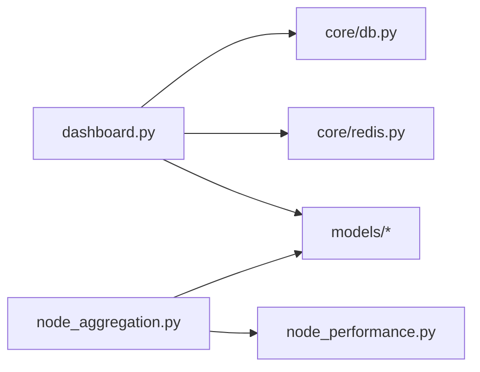

# 看板聚合算法

<cite>
**本文引用的文件**
- [backend/app/services/dashboard.py](file://backend/app/services/dashboard.py)
- [backend/app/core/db.py](file://backend/app/core/db.py)
- [backend/app/core/redis.py](file://backend/app/core/redis.py)
- [backend/app/api/v1/endpoints/dashboard.py](file://backend/app/api/v1/endpoints/dashboard.py)
- [backend/app/services/node_aggregation.py](file://backend/app/services/node_aggregation.py)
- [backend/app/services/node_performance.py](file://backend/app/services/node_performance.py)
- [backend/tests/test_dashboard.py](file://backend/tests/test_dashboard.py)
- [backend/tests/test_node_aggregation.py](file://backend/tests/test_node_aggregation.py)
- [backend/tests/test_concurrency.py](file://backend/tests/test_concurrency.py)
- [perf/locustfile.py](file://perf/locustfile.py)
</cite>

## 目录
1. [简介](#简介)
2. [项目结构](#项目结构)
3. [核心组件](#核心组件)
4. [架构总览](#架构总览)
5. [详细组件分析](#详细组件分析)
6. [依赖关系分析](#依赖关系分析)
7. [性能考量](#性能考量)
8. [故障排查指南](#故障排查指南)
9. [结论](#结论)
10. [附录](#附录)

## 简介
本技术文档围绕“看板聚合算法”展开，聚焦多节点数据汇总机制与加权平均计算、Redis 缓存策略与防惊群设计、角色权限驱动的数据隔离、以及性能优化与降级处理。系统基于 SQLAlchemy 异步会话与连接池，结合 Redis 缓存与 Dogpile 锁，实现高并发下的低延迟看板数据聚合。

## 项目结构
看板聚合涉及以下关键模块：
- 服务层：dashboard 聚合入口、node_aggregation 日/月聚合、node_performance 小时级聚合
- 基础设施：db（异步引擎与会话）、redis（带事件循环适配的客户端）
- API 层：board/aggregate 端点负责节点级递归聚合与窗口加权
- 测试与压测：覆盖并发安全、缓存命中、TTL 抖动、Dogpile 锁等场景

图表来源
- [backend/app/api/v1/endpoints/dashboard.py:554-674](file://backend/app/api/v1/endpoints/dashboard.py#L554-L674)
- [backend/app/services/dashboard.py:56-115](file://backend/app/services/dashboard.py#L56-L115)
- [backend/app/core/db.py:16-42](file://backend/app/core/db.py#L16-L42)
- [backend/app/core/redis.py:29-137](file://backend/app/core/redis.py#L29-L137)

章节来源
- [backend/app/api/v1/endpoints/dashboard.py:554-738](file://backend/app/api/v1/endpoints/dashboard.py#L554-L738)
- [backend/app/services/dashboard.py:56-115](file://backend/app/services/dashboard.py#L56-L115)
- [backend/app/core/db.py:16-42](file://backend/app/core/db.py#L16-L42)
- [backend/app/core/redis.py:29-137](file://backend/app/core/redis.py#L29-L137)

## 核心组件
- 看板聚合入口：get_dashboard_overview，负责缓存读取、Dogpile 锁、并行查询与结果合并
- SQL 聚合：_aggregate_kpi_cards_sql、_aggregate_trend_summary_sql 等使用 case/date_trunc/group by 在数据库侧完成统计
- 节点级聚合：node_aggregation 提供按 loop_count 加权的日/月快照聚合；node_performance 提供小时级回路→节点聚合
- 缓存与锁：Redis 键模板、TTL 抖动、Dogpile 互斥锁与回退逻辑
- 权限与范围：角色集合决定全厂/装置/工厂汇总视图的数据过滤

章节来源
- [backend/app/services/dashboard.py:56-115](file://backend/app/services/dashboard.py#L56-L115)
- [backend/app/services/dashboard.py:244-363](file://backend/app/services/dashboard.py#L244-L363)
- [backend/app/services/node_aggregation.py:87-124](file://backend/app/services/node_aggregation.py#L87-L124)
- [backend/app/services/node_performance.py:300-320](file://backend/app/services/node_performance.py#L300-L320)
- [backend/app/services/dashboard.py:711-762](file://backend/app/services/dashboard.py#L711-L762)

## 架构总览
看板聚合采用“缓存优先 + 并行查询 + 数据库函数聚合”的架构：
- 请求进入 dashboard 端点后，先查 Redis；命中则直接返回
- 未命中时尝试获取 Dogpile 锁，避免大量并发重复计算
- 成功获锁后，通过 asyncio.gather 并行执行多个独立查询任务，每个任务使用独立 AsyncSession
- 查询结果在内存中合并并写入 Redis（带 TTL 抖动），失败则降级为直查不写缓存
- 节点级聚合接口支持递归聚合当前节点及所有下属节点，并提供时间窗口加权模式

图表来源
- [backend/app/services/dashboard.py:56-115](file://backend/app/services/dashboard.py#L56-L115)
- [backend/app/services/dashboard.py:711-762](file://backend/app/services/dashboard.py#L711-L762)
- [backend/app/api/v1/endpoints/dashboard.py:554-674](file://backend/app/api/v1/endpoints/dashboard.py#L554-L674)

## 详细组件分析

### 多节点数据汇总机制（SQLAlchemy 并行查询与异步会话）
- 并行查询：使用 asyncio.gather 并行执行 KPI 卡片、计数、趋势摘要、待处理异常、低效回路等查询组
- 会话隔离：每个并行任务通过 _run_in_session 创建独立 AsyncSession，避免共享会话导致的并发冲突
- 连接池：engine 使用 NullPool，避免跨 event loop 复用连接引发的 Future/loop 错误；单条 SQL 设置 command_timeout=60s 防止慢查询挂死

图表来源
- [backend/app/services/dashboard.py:123-184](file://backend/app/services/dashboard.py#L123-L184)
- [backend/app/services/dashboard.py:208-214](file://backend/app/services/dashboard.py#L208-L214)
- [backend/app/core/db.py:16-42](file://backend/app/core/db.py#L16-L42)

章节来源
- [backend/app/services/dashboard.py:123-184](file://backend/app/services/dashboard.py#L123-L184)
- [backend/app/core/db.py:16-42](file://backend/app/core/db.py#L16-L42)
- [backend/tests/test_concurrency.py:45-75](file://backend/tests/test_concurrency.py#L45-L75)

### 加权平均计算算法（KPI 卡片、时间窗口过滤、状态筛选）
- KPI 卡片聚合：使用 case() 条件聚合在同一查询中计算当前周期与上一周期的平均值，并通过 status="SUCCESS" 过滤有效快照
- 时间窗口过滤：根据 granularity 映射 delta 计算 current_start/previous_start，限制 ts_start 范围
- 节点级窗口加权：board/aggregate 在 timeWindow 模式下对 rate 字段按 evaluated_loops 加权平均，计数字段取窗口内最新快照
- 日/月聚合权重：按 loop_count 加权平均，缺失值跳过，全部 loop_count=0 时退化为简单平均

图表来源
- [backend/app/services/dashboard.py:244-298](file://backend/app/services/dashboard.py#L244-L298)
- [backend/app/services/dashboard.py:317-363](file://backend/app/services/dashboard.py#L317-L363)
- [backend/app/api/v1/endpoints/dashboard.py:639-668](file://backend/app/api/v1/endpoints/dashboard.py#L639-L668)
- [backend/app/services/node_aggregation.py:87-124](file://backend/app/services/node_aggregation.py#L87-L124)

章节来源
- [backend/app/services/dashboard.py:244-363](file://backend/app/services/dashboard.py#L244-L363)
- [backend/app/api/v1/endpoints/dashboard.py:639-668](file://backend/app/api/v1/endpoints/dashboard.py#L639-L668)
- [backend/app/services/node_aggregation.py:87-124](file://backend/app/services/node_aggregation.py#L87-L124)
- [backend/tests/test_node_aggregation.py:501-545](file://backend/tests/test_node_aggregation.py#L501-L545)

### Redis 缓存策略（键构建、TTL 抖动、Dogpile 锁）
- 缓存键：dashboard:overview:{plant_id}:{granularity}:{role}，区分装置、粒度与角色
- TTL 抖动：setex 时 TTL = 基础 TTL ± 随机偏移，避免大批量 key 同时过期引发雪崩
- Dogpile 锁：SET key 1 NX EX 10，成功者执行聚合并写缓存；失败者轮询等待或优雅降级
- 降级：Redis 不可用时读/写均捕获异常并记录日志，直接走数据库查询

图表来源
- [backend/app/services/dashboard.py:711-762](file://backend/app/services/dashboard.py#L711-L762)
- [backend/app/core/redis.py:29-137](file://backend/app/core/redis.py#L29-L137)

章节来源
- [backend/app/services/dashboard.py:711-762](file://backend/app/services/dashboard.py#L711-L762)
- [backend/app/core/redis.py:29-137](file://backend/app/core/redis.py#L29-L137)
- [backend/tests/test_dashboard.py:375-455](file://backend/tests/test_dashboard.py#L375-L455)

### 角色权限控制（数据隔离）
- 角色集合定义：ADMIN/EXPERT 全厂视图、IC_ENGINEER/PE_ENGINEER 装置级视图、SPONSOR 工厂汇总视图
- 数据范围：根据 user_role 与 plant_id 组合，决定查询是否包含 is_kpi_enabled 节点、是否跳过低效回路等
- 前端路由权限：不同页面配置 authority 白名单，确保 UI 可见性与后端数据一致

章节来源
- [backend/app/services/dashboard.py:42-48](file://backend/app/services/dashboard.py#L42-L48)
- [backend/app/services/dashboard.py:171-183](file://backend/app/services/dashboard.py#L171-L183)
- [backend/app/services/auth.py:58-104](file://backend/app/services/auth.py#L58-L104)
- [frontend/apps/web-antd/src/router/routes/modules/reports.ts:30-76](file://frontend/apps/web-antd/src/router/routes/modules/reports.ts#L30-L76)

### 节点级递归聚合与窗口加权（board/aggregate）
- 递归聚合：通过 collect_descendant_loop_ids 获取当前节点及其所有下属节点的回路 ID 集合
- 最新快照模式：未指定 timeWindow 时，每个 node_id 取最新快照
- 窗口加权模式：rate 字段按 evaluated_loops 加权平均，计数字段取窗口内最新快照，evaluated/inconclusive 按窗口边界统计
- 权威口径：优先取当前节点自身的 unit_kpi_summary 行（已持久化递归聚合结果），否则退化为 items 间加权平均

章节来源
- [backend/app/api/v1/endpoints/dashboard.py:554-738](file://backend/app/api/v1/endpoints/dashboard.py#L554-L738)
- [backend/app/api/v1/endpoints/dashboard.py:736-757](file://backend/app/api/v1/endpoints/dashboard.py#L736-L757)

## 依赖关系分析
- dashboard 服务依赖 db 与 redis，并通过 models 引用 KpiSnapshotHourly、LoopLedger、PlantNode
- node_aggregation 依赖 node_performance 的状态判定函数，并使用 KpiNodeSnapshot* 表
- 并发测试验证了多个独立 session 的并行执行安全性与异常隔离

图表来源
- [backend/app/services/dashboard.py:20-27](file://backend/app/services/dashboard.py#L20-L27)
- [backend/app/services/node_aggregation.py:49-59](file://backend/app/services/node_aggregation.py#L49-L59)

章节来源
- [backend/app/services/dashboard.py:20-27](file://backend/app/services/dashboard.py#L20-L27)
- [backend/app/services/node_aggregation.py:49-59](file://backend/app/services/node_aggregation.py#L49-L59)
- [backend/tests/test_concurrency.py:45-75](file://backend/tests/test_concurrency.py#L45-L75)

## 性能考量
- 批量查询避免 N+1：低效回路 Top 10 中批量查询 LoopLedger、PlantNode、诊断标签，减少多次往返
- SQL 函数聚合优化：使用 case/avg/date_trunc/group by 将统计下推到数据库，降低内存压力
- 内存数据处理策略：仅加载必要字段，使用 Decimal 精确计算并按需 round；None 值跳过避免稀释加权
- 连接池与超时：NullPool 避免跨 loop 问题；command_timeout=60s 防止慢查询阻塞
- 压测目标：工作台聚合接口 P95 < 500ms（参考 perf 用例）

章节来源
- [backend/app/services/dashboard.py:480-553](file://backend/app/services/dashboard.py#L480-L553)
- [backend/app/services/dashboard.py:244-363](file://backend/app/services/dashboard.py#L244-L363)
- [backend/app/core/db.py:16-42](file://backend/app/core/db.py#L16-L42)
- [perf/locustfile.py:299-317](file://perf/locustfile.py#L299-L317)

## 故障排查指南
- Redis 不可用：读/写缓存捕获异常并记录日志，自动降级为直接查询；Dogpile 锁获取失败也记录警告
- 会话冲突：确保每个并行任务使用独立 AsyncSession；测试覆盖并发 gather 与异常隔离
- 慢查询：检查 command_timeout 配置与 SQL 索引；必要时拆分查询或使用物化视图
- 缓存雪崩：确认 TTL 抖动生效；监控 Redis 命中率与过期分布

章节来源
- [backend/app/services/dashboard.py:720-762](file://backend/app/services/dashboard.py#L720-L762)
- [backend/tests/test_concurrency.py:139-208](file://backend/tests/test_concurrency.py#L139-L208)
- [backend/app/core/db.py:16-42](file://backend/app/core/db.py#L16-L42)

## 结论
看板聚合算法通过“缓存优先 + 并行查询 + SQL 聚合”的组合策略，在高并发场景下实现了稳定低延迟的 KPI 汇总能力。加权平均在不同层级采用不同权重体系，既保证准确性又兼顾性能。Redis 缓存与 Dogpile 锁提供了良好的抗雪崩与防惊群能力，配合完善的降级与日志记录，提升了系统的鲁棒性。

## 附录
- 关键常量与映射：
  - 时间粒度映射：day/week/month → timedelta
  - 角色集合：全厂/装置/工厂汇总视图
  - 缓存键模板与 TTL
- 相关测试用例：
  - 缓存命中与降级
  - 并发会话独立性
  - 加权平均边界条件（None、零权重）

章节来源
- [backend/app/services/dashboard.py:31-48](file://backend/app/services/dashboard.py#L31-L48)
- [backend/tests/test_dashboard.py:375-455](file://backend/tests/test_dashboard.py#L375-L455)
- [backend/tests/test_node_aggregation.py:501-545](file://backend/tests/test_node_aggregation.py#L501-L545)