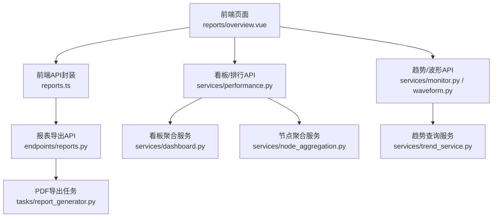
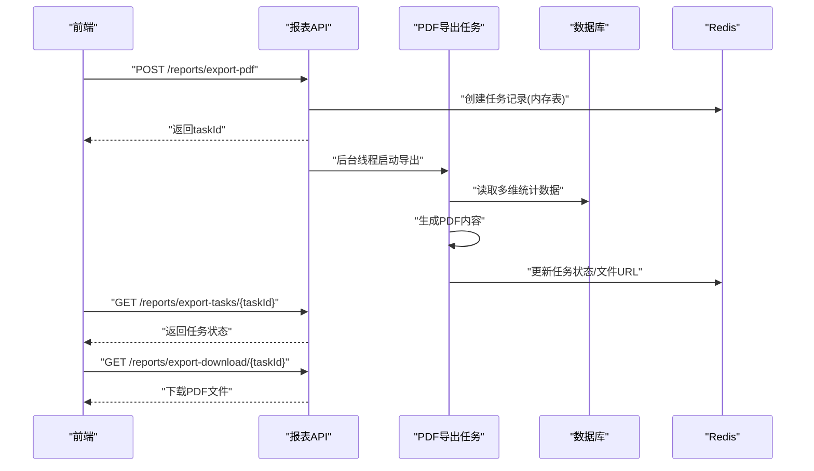
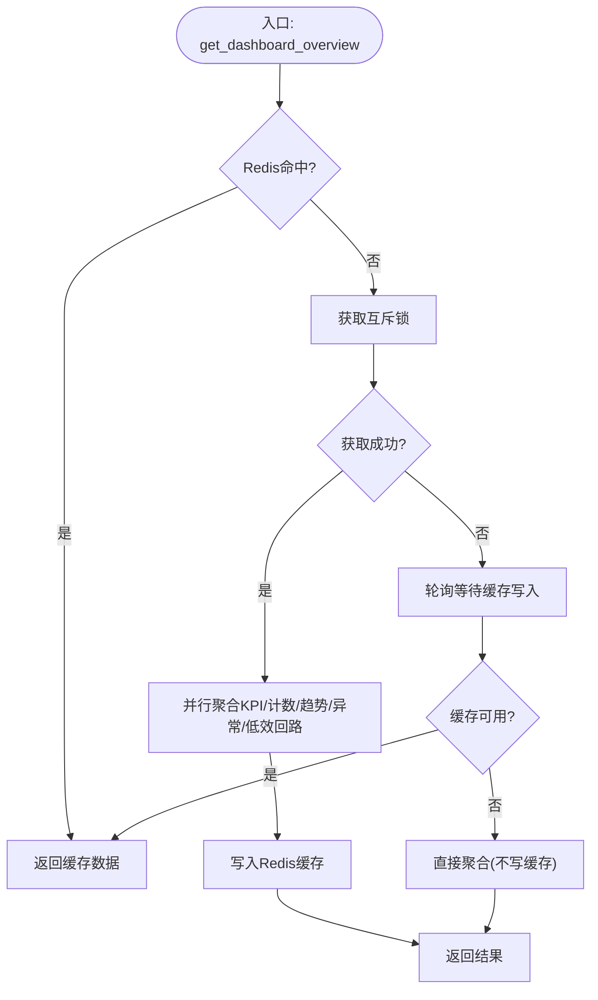
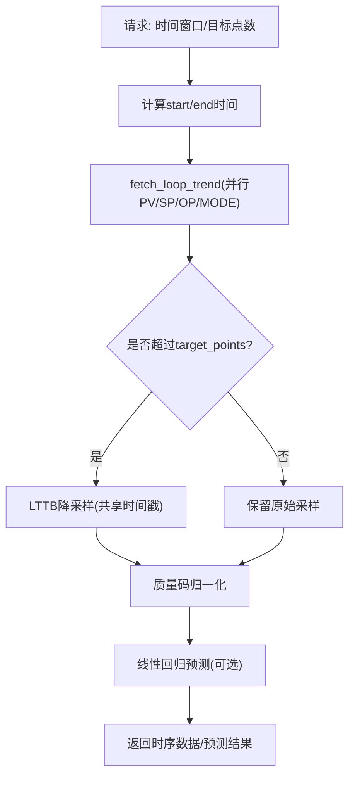
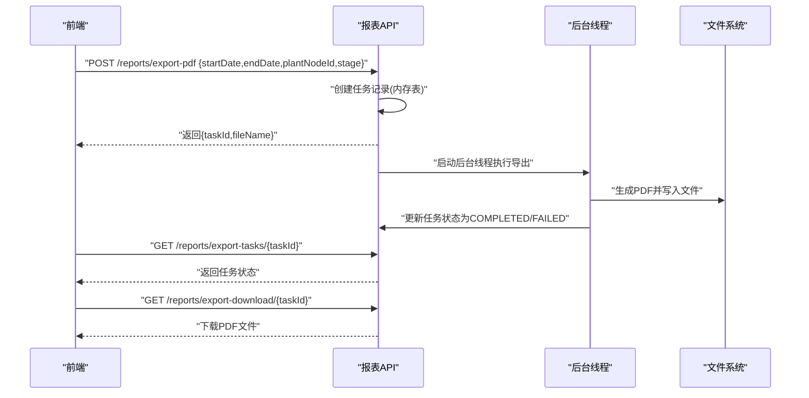
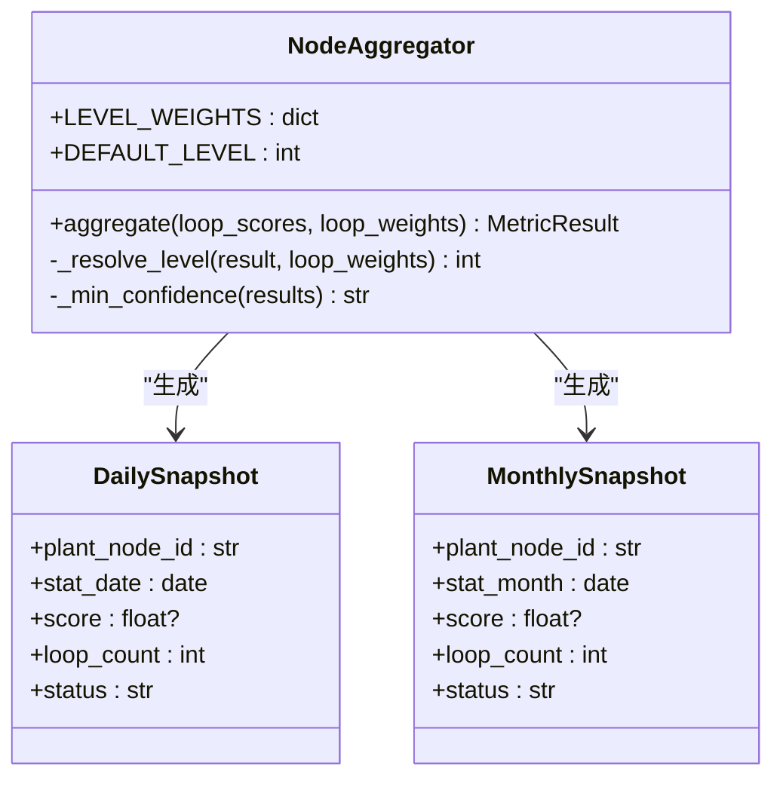
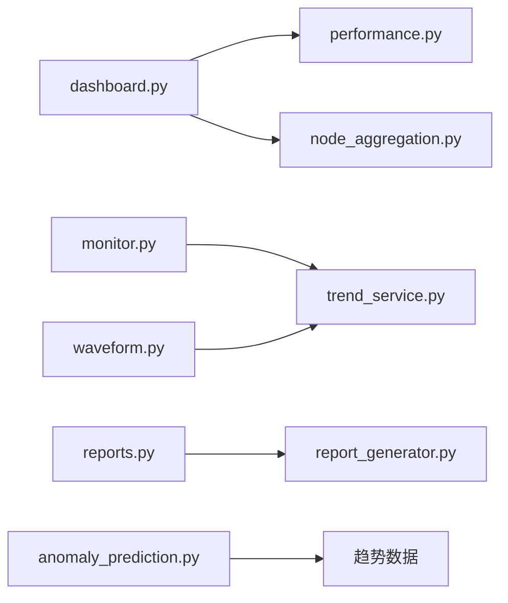

# 统计分析功能

<cite>
**本文引用的文件**
- [backend/app/services/dashboard.py](file://backend/app/services/dashboard.py)
- [backend/app/services/node_aggregation.py](file://backend/app/services/node_aggregation.py)
- [backend/app/services/performance.py](file://backend/app/services/performance.py)
- [backend/app/services/trend_service.py](file://backend/app/services/trend_service.py)
- [backend/app/services/monitor.py](file://backend/app/services/monitor.py)
- [backend/app/services/waveform.py](file://backend/app/services/waveform.py)
- [backend/app/api/v1/endpoints/reports.py](file://backend/app/api/v1/endpoints/reports.py)
- [backend/app/tasks/report_generator.py](file://backend/app/tasks/report_generator.py)
- [frontend/apps/web-antd/src/api/reports.ts](file://frontend/apps/web-antd/src/api/reports.ts)
- [frontend/apps/web-antd/src/views/reports/overview.vue](file://frontend/apps/web-antd/src/views/reports/overview.vue)
- [backend/app/services/anomaly_prediction.py](file://backend/app/services/anomaly_prediction.py)
</cite>

## 目录
1. [简介](#简介)
2. [项目结构](#项目结构)
3. [核心组件](#核心组件)
4. [架构总览](#架构总览)
5. [详细组件分析](#详细组件分析)
6. [依赖关系分析](#依赖关系分析)
7. [性能考虑](#性能考虑)
8. [故障排查指南](#故障排查指南)
9. [结论](#结论)
10. [附录：API 接口文档](#附录api-接口文档)

## 简介
本技术文档围绕统计分析能力，系统阐述以下方面：
- 全局看板聚合算法：多节点数据汇总、加权平均计算、时间序列聚合。
- 低效回路排行算法：排序规则、分页查询、性能优化。
- 趋势分析功能：时间窗口选择、数据采样策略、趋势预测模型。
- 报表生成功能：多维度统计、图表数据准备、CSV/PDF 导出。
- 性能优化策略：数据库查询优化、Redis 缓存、异步计算。
- 统计分析 API 接口的完整文档：请求参数、响应格式、错误处理。
- 数据分析工具：数据探索、异常检测、相关性分析（基于现有服务与可复用能力）。

## 项目结构
统计分析相关代码主要位于后端 services 层与 API endpoints，前端通过 API 调用并渲染报表与可视化。关键模块包括：
- 看板聚合服务：dashboard.py、performance.py
- 节点级日/月聚合：node_aggregation.py
- 趋势查询与采样：trend_service.py、monitor.py、waveform.py
- 报表生成：reports endpoint + report_generator task
- 异常预测：anomaly_prediction.py



**图示来源**
- [backend/app/api/v1/endpoints/reports.py:346-424](file://backend/app/api/v1/endpoints/reports.py#L346-L424)
- [backend/app/tasks/report_generator.py:161-196](file://backend/app/tasks/report_generator.py#L161-L196)
- [backend/app/services/performance.py:313-451](file://backend/app/services/performance.py#L313-L451)
- [backend/app/services/dashboard.py:56-115](file://backend/app/services/dashboard.py#L56-L115)
- [backend/app/services/node_aggregation.py:144-235](file://backend/app/services/node_aggregation.py#L144-L235)
- [backend/app/services/monitor.py:1043-1075](file://backend/app/services/monitor.py#L1043-L1075)
- [backend/app/services/trend_service.py:1-49](file://backend/app/services/trend_service.py#L1-L49)

**章节来源**
- [backend/app/services/dashboard.py:56-115](file://backend/app/services/dashboard.py#L56-L115)
- [backend/app/services/performance.py:313-451](file://backend/app/services/performance.py#L313-L451)
- [backend/app/services/node_aggregation.py:144-235](file://backend/app/services/node_aggregation.py#L144-L235)
- [backend/app/services/trend_service.py:1-49](file://backend/app/services/trend_service.py#L1-L49)
- [backend/app/api/v1/endpoints/reports.py:346-424](file://backend/app/api/v1/endpoints/reports.py#L346-L424)
- [backend/app/tasks/report_generator.py:161-196](file://backend/app/tasks/report_generator.py#L161-L196)

## 核心组件
- 全局看板聚合：按角色与粒度并行聚合 KPI 卡片、计数、趋势摘要、待处理异常与低效回路；使用 Redis 缓存与互斥锁避免惊群。
- 节点级日/月聚合：按 loop_count 加权平均小时/日快照，生成日/月聚合快照，幂等写入。
- 低效回路排行：基于最新快照的 SQL 去重与排序，支持多字段排序与分页，批量关联回路信息与诊断标签。
- 趋势分析：统一趋势查询服务，动态采样间隔、LTTB 降采样、质量码归一化；监控与波形接口复用。
- 报表生成：异步 PDF 导出任务，前端轮询任务状态并下载；支持日期范围与装置筛选。
- 异常预测：对历史快照指标进行线性回归与趋势外推，识别风险指标。

**章节来源**
- [backend/app/services/dashboard.py:56-115](file://backend/app/services/dashboard.py#L56-L115)
- [backend/app/services/node_aggregation.py:87-124](file://backend/app/services/node_aggregation.py#L87-L124)
- [backend/app/services/performance.py:675-800](file://backend/app/services/performance.py#L675-L800)
- [backend/app/services/trend_service.py:1-49](file://backend/app/services/trend_service.py#L1-L49)
- [backend/app/api/v1/endpoints/reports.py:346-424](file://backend/app/api/v1/endpoints/reports.py#L346-L424)
- [backend/app/services/anomaly_prediction.py:390-420](file://backend/app/services/anomaly_prediction.py#L390-L420)

## 架构总览
统计分析在“服务层”完成核心计算，API 层暴露接口，任务层异步执行耗时操作（如 PDF 导出），前端负责交互与展示。



**图示来源**
- [backend/app/api/v1/endpoints/reports.py:346-424](file://backend/app/api/v1/endpoints/reports.py#L346-L424)
- [backend/app/tasks/report_generator.py:161-196](file://backend/app/tasks/report_generator.py#L161-L196)

**章节来源**
- [backend/app/api/v1/endpoints/reports.py:346-424](file://backend/app/api/v1/endpoints/reports.py#L346-L424)
- [backend/app/tasks/report_generator.py:161-196](file://backend/app/tasks/report_generator.py#L161-L196)

## 详细组件分析

### 全局看板聚合算法
- 多节点数据汇总：从节点级快照表取每个节点在时间窗内最新一条快照，未指定节点时仅统计 is_kpi_enabled 节点。
- 加权平均计算：按 loop_count 加权平均各 KPI 字段，缺失值不参与分母累加；综合评分由加权 score 决定。
- 时间序列聚合：平稳率趋势按小时分组求均值；最近 7 天每日综合评分通过 date_trunc('day') + GROUP BY 实现。
- 缓存与并发控制：Redis 缓存 5 分钟，dogpile 互斥锁避免重复计算；角色维度控制数据范围。



**图示来源**
- [backend/app/services/dashboard.py:56-115](file://backend/app/services/dashboard.py#L56-L115)
- [backend/app/services/dashboard.py:123-200](file://backend/app/services/dashboard.py#L123-L200)
- [backend/app/services/dashboard.py:711-761](file://backend/app/services/dashboard.py#L711-L761)

**章节来源**
- [backend/app/services/dashboard.py:56-115](file://backend/app/services/dashboard.py#L56-L115)
- [backend/app/services/dashboard.py:123-200](file://backend/app/services/dashboard.py#L123-L200)
- [backend/app/services/dashboard.py:244-363](file://backend/app/services/dashboard.py#L244-L363)
- [backend/app/services/dashboard.py:711-761](file://backend/app/services/dashboard.py#L711-L761)

### 低效回路排行算法
- 排序规则：默认按综合评分升序（差回路在前），支持 score/steady_rate/good_value_rate/fast_rate 等多字段排序；NULLS LAST 保证空值排后。
- 分页查询：limit/offset 配合子查询去重（DISTINCT ON）取每个回路最新 SUCCESS 快照，避免 N+1 查询。
- 性能优化：批量关联回路基础信息与单元名称；可选预诊断标签（PENDING/IN_PROGRESS）；递归收集节点下属回路 ID 以支持层级筛选。

```mermaid
sequenceDiagram
participant API as "排行API"
participant DB as "数据库"
participant LOOP as "回路信息"
participant DIAG as "诊断标签"
API->>DB : "子查询 : DISTINCT loop_id, 最新SUCCESS快照"
DB-->>API : "快照列表(已排序/分页)"
API->>LOOP : "批量查询回路基础信息"
LOOP-->>API : "loop_map/unit_map"
API->>DIAG : "批量查询预诊断标签(PENDING/IN_PROGRESS)"
DIAG-->>API : "diagnosis_map/action_status_map"
API-->>API : "组装排行项(含诊断标签)"
```

**图示来源**
- [backend/app/services/performance.py:675-800](file://backend/app/services/performance.py#L675-L800)

**章节来源**
- [backend/app/services/performance.py:675-800](file://backend/app/services/performance.py#L675-L800)

### 趋势分析功能
- 时间窗口选择：支持 today/yesterday/last_8_hours/last_24_hours/last_72_hours/last_168_hours/last_7_days/last_30_days/custom。
- 数据采样策略：统一趋势查询服务根据目标点数（默认 ~3600）动态计算采样间隔；超过上限触发 LTTB 降采样；质量码归一化为 Good/Bad/Unknown。
- 趋势预测模型：对历史快照指标（score/osillation_rate/saturation_rate/steady_rate）进行线性回归，计算斜率与截距，外推未来值并标记风险阈值。



**图示来源**
- [backend/app/services/trend_service.py:1-49](file://backend/app/services/trend_service.py#L1-L49)
- [backend/app/services/monitor.py:1043-1075](file://backend/app/services/monitor.py#L1043-L1075)
- [backend/app/services/anomaly_prediction.py:390-420](file://backend/app/services/anomaly_prediction.py#L390-L420)

**章节来源**
- [backend/app/services/trend_service.py:1-49](file://backend/app/services/trend_service.py#L1-L49)
- [backend/app/services/monitor.py:1043-1075](file://backend/app/services/monitor.py#L1043-L1075)
- [backend/app/services/anomaly_prediction.py:390-420](file://backend/app/services/anomaly_prediction.py#L390-L420)

### 报表生成功能
- 多维度统计：支持按 plantNodeId、stage、startDate/endDate 筛选；内部读取多维统计数据用于 PDF 内容。
- 图表数据准备：服务层聚合 KPI 卡片、趋势摘要、低效回路等数据供报表渲染。
- CSV/PDF 导出：前端发起异步导出任务，后端线程执行 PDF 生成并落盘；提供任务状态查询与下载链接。



**图示来源**
- [backend/app/api/v1/endpoints/reports.py:346-424](file://backend/app/api/v1/endpoints/reports.py#L346-L424)
- [backend/app/tasks/report_generator.py:161-196](file://backend/app/tasks/report_generator.py#L161-L196)
- [frontend/apps/web-antd/src/api/reports.ts:226-260](file://frontend/apps/web-antd/src/api/reports.ts#L226-L260)
- [frontend/apps/web-antd/src/views/reports/overview.vue:470-507](file://frontend/apps/web-antd/src/views/reports/overview.vue#L470-L507)

**章节来源**
- [backend/app/api/v1/endpoints/reports.py:346-424](file://backend/app/api/v1/endpoints/reports.py#L346-L424)
- [backend/app/tasks/report_generator.py:161-196](file://backend/app/tasks/report_generator.py#L161-L196)
- [frontend/apps/web-antd/src/api/reports.ts:226-260](file://frontend/apps/web-antd/src/api/reports.ts#L226-L260)
- [frontend/apps/web-antd/src/views/reports/overview.vue:470-507](file://frontend/apps/web-antd/src/views/reports/overview.vue#L470-L507)

### 节点级日/月聚合算法
- 加权平均：按 loop_count 加权平均 AGGREGATE_FIELDS 中各 KPI；缺失值不参与分母；所有 loop_count=0 时退化为简单平均。
- 特殊字段处理：realtime_auto_rate 取当天/当月最后一条小时快照值；loop_count 取最大值；status 由聚合后 score 重新定级。
- 幂等写入：相同 plant_node_id + stat_date/stat_month 覆盖更新；批量聚合遍历启用节点，统计 success/skipped/failed。



**图示来源**
- [backend/app/services/node_aggregation.py:562-714](file://backend/app/services/node_aggregation.py#L562-L714)
- [backend/app/services/node_aggregation.py:144-235](file://backend/app/services/node_aggregation.py#L144-L235)
- [backend/app/services/node_aggregation.py:283-387](file://backend/app/services/node_aggregation.py#L283-L387)

**章节来源**
- [backend/app/services/node_aggregation.py:87-124](file://backend/app/services/node_aggregation.py#L87-L124)
- [backend/app/services/node_aggregation.py:144-235](file://backend/app/services/node_aggregation.py#L144-L235)
- [backend/app/services/node_aggregation.py:283-387](file://backend/app/services/node_aggregation.py#L283-L387)
- [backend/app/services/node_aggregation.py:562-714](file://backend/app/services/node_aggregation.py#L562-L714)

## 依赖关系分析
- dashboard.py 依赖 performance.py 的看板聚合逻辑与 node_aggregation.py 的节点聚合能力。
- trend_service.py 被 monitor.py 与 waveform.py 复用，提供统一的趋势查询与降采样。
- reports endpoint 依赖 report_generator task 执行 PDF 导出，前端通过 reports.ts 与 overview.vue 交互。
- anomaly_prediction.py 基于历史快照数据进行趋势预测，可与趋势服务结合使用。



**图示来源**
- [backend/app/services/dashboard.py:56-115](file://backend/app/services/dashboard.py#L56-L115)
- [backend/app/services/performance.py:313-451](file://backend/app/services/performance.py#L313-L451)
- [backend/app/services/node_aggregation.py:144-235](file://backend/app/services/node_aggregation.py#L144-L235)
- [backend/app/services/trend_service.py:1-49](file://backend/app/services/trend_service.py#L1-L49)
- [backend/app/api/v1/endpoints/reports.py:346-424](file://backend/app/api/v1/endpoints/reports.py#L346-L424)
- [backend/app/tasks/report_generator.py:161-196](file://backend/app/tasks/report_generator.py#L161-L196)
- [backend/app/services/anomaly_prediction.py:390-420](file://backend/app/services/anomaly_prediction.py#L390-L420)

**章节来源**
- [backend/app/services/dashboard.py:56-115](file://backend/app/services/dashboard.py#L56-L115)
- [backend/app/services/performance.py:313-451](file://backend/app/services/performance.py#L313-L451)
- [backend/app/services/node_aggregation.py:144-235](file://backend/app/services/node_aggregation.py#L144-L235)
- [backend/app/services/trend_service.py:1-49](file://backend/app/services/trend_service.py#L1-L49)
- [backend/app/api/v1/endpoints/reports.py:346-424](file://backend/app/api/v1/endpoints/reports.py#L346-L424)
- [backend/app/tasks/report_generator.py:161-196](file://backend/app/tasks/report_generator.py#L161-L196)
- [backend/app/services/anomaly_prediction.py:390-420](file://backend/app/services/anomaly_prediction.py#L390-L420)

## 性能考虑
- 数据库查询优化：
  - 使用 DISTINCT ON 与子查询取最新快照，避免 N+1。
  - 批量关联回路信息与单元名称，减少多次查询。
  - 使用 date_trunc + GROUP BY 进行时间序列聚合。
- Redis 缓存：
  - 看板数据缓存 5 分钟，key 包含 plant_id/granularity/role 或 plant_node_id/time_window。
  - Dogpile 互斥锁避免惊群效应；失败时降级为直接查询。
- 异步计算：
  - PDF 导出通过后台线程异步执行，前端轮询任务状态。
  - 趋势查询并行 PV/SP/OP/MODE 四个 tag，提升吞吐。
- 降采样：
  - LTTB 降采样保持视觉特征，减少前端渲染压力。

**章节来源**
- [backend/app/services/performance.py:675-800](file://backend/app/services/performance.py#L675-L800)
- [backend/app/services/dashboard.py:711-761](file://backend/app/services/dashboard.py#L711-L761)
- [backend/app/api/v1/endpoints/reports.py:346-424](file://backend/app/api/v1/endpoints/reports.py#L346-L424)
- [backend/app/services/trend_service.py:1-49](file://backend/app/services/trend_service.py#L1-L49)

## 故障排查指南
- 看板缓存失效：检查 Redis 连接与 TTL；查看日志中的“读取工作台缓存失败/写入工作台缓存失败”。
- 低效回路为空：确认时间窗口内有 SUCCESS 快照；检查排序字段白名单与分页参数。
- 趋势数据为空：校验时间窗不超过限制；确认 fetch_loop_trend 返回的数据结构与质量码。
- PDF 导出失败：检查任务状态是否为 FAILED；查看后端日志中的“报表生成失败”异常堆栈。
- 节点聚合无数据：确认节点启用 KPI 评估；检查小时/日快照是否存在。

**章节来源**
- [backend/app/services/dashboard.py:720-761](file://backend/app/services/dashboard.py#L720-L761)
- [backend/app/services/performance.py:675-800](file://backend/app/services/performance.py#L675-L800)
- [backend/app/services/waveform.py:169-197](file://backend/app/services/waveform.py#L169-L197)
- [backend/app/tasks/report_generator.py:161-196](file://backend/app/tasks/report_generator.py#L161-L196)
- [backend/app/services/node_aggregation.py:435-492](file://backend/app/services/node_aggregation.py#L435-L492)

## 结论
统计分析功能通过服务层的多维聚合、缓存与异步机制，实现了高效的全局看板、低效回路排行、趋势分析与报表导出。节点级日/月聚合采用 loop_count 加权平均，确保代表性；趋势服务统一采样与降采样策略；报表导出异步化提升用户体验。整体架构清晰、可扩展性强，适合大规模工业场景。

## 附录：API 接口文档

### 全局看板接口
- 路径：GET /performance/board
- 请求参数：
  - plant_node_id: 可选，装置节点 ID
  - time_window: 可选，today/yesterday/last_8_hours/last_24_hours/last_72_hours/last_168_hours/last_7_days/last_30_days/custom
  - start_time: 当 time_window=custom 时必填
  - end_time: 当 time_window=custom 时必填
- 响应格式：
  - filterScope: {plantNodeId, plantNodeName, timeWindow}
  - kpiCards: 数组，每项包含 metricKey/metricName/value/unit/status/algorithmVersion
  - kpiSummary: 对象，包含各 KPI 值、composite_score、auto_loop_ratio、realtime_auto_rate、loop_count、node_count、status、algorithm_version
  - steadyRateTrend: {timestamps, values}
  - partialWarning: {active, inconclusiveCount, partialCount, message}
  - fitnessDistribution: {L0~L4 计数}
- 错误处理：
  - 自定义时间窗缺少 start_time/end_time 时返回错误
  - Redis 不可用时降级为直接查询并记录日志

**章节来源**
- [backend/app/services/performance.py:313-451](file://backend/app/services/performance.py#L313-L451)

### 低效回路排行接口
- 路径：GET /performance/ranking
- 请求参数：
  - plant_node_id: 可选，装置节点 ID
  - time_window: 同上
  - limit: 返回条数，最多 100
  - offset: 偏移量
  - sort_by: score/steady_rate/good_value_rate/fast_rate
  - sort_order: asc/desc
  - start_time/end_time: 当 time_window=custom 时必填
- 响应格式：数组，每项包含回路基本信息、最新快照指标、诊断标签（可选）
- 错误处理：
  - 排序字段不在白名单时回退到默认字段
  - 无数据时返回空数组

**章节来源**
- [backend/app/services/performance.py:675-800](file://backend/app/services/performance.py#L675-L800)

### 趋势查询接口
- 路径：GET /monitor/trend（示例，具体路径依实际定义）
- 请求参数：
  - loop_id: 回路 ID
  - start_time: ISO 8601 UTC
  - end_time: ISO 8601 UTC
  - target_points: 目标点数，默认 3600
- 响应格式：
  - timestamps: 时间戳数组
  - pv/sp/op/mode: 数值数组
  - pvQuality: 质量码数组（Good/Bad/Unknown）
  - sampleInterval: 采样间隔
  - downsampled: 是否降采样
- 错误处理：
  - 时间窗超过 30 天返回错误
  - 趋势数据为空时返回 EMPTY 状态

**章节来源**
- [backend/app/services/monitor.py:1043-1075](file://backend/app/services/monitor.py#L1043-L1075)
- [backend/app/services/waveform.py:169-197](file://backend/app/services/waveform.py#L169-L197)
- [backend/app/services/trend_service.py:1-49](file://backend/app/services/trend_service.py#L1-L49)

### 报表导出接口
- 路径：POST /reports/export-pdf
- 请求体：
  - startDate: 可选，YYYY-MM-DD
  - endDate: 可选，YYYY-MM-DD
  - plantNodeId: 可选，装置节点 ID
  - stage: 可选，阶段筛选
- 响应格式：
  - taskId: 任务 ID
  - fileName: 文件名
- 后续查询：
  - GET /reports/export-tasks/{taskId}: 返回任务状态（PROCESSING/COMPLETED/FAILED）
  - GET /reports/export-download/{taskId}: 下载 PDF 文件
- 错误处理：
  - 任务失败时返回 error 字段
  - 文件不存在时返回 404

**章节来源**
- [backend/app/api/v1/endpoints/reports.py:346-424](file://backend/app/api/v1/endpoints/reports.py#L346-L424)
- [backend/app/tasks/report_generator.py:161-196](file://backend/app/tasks/report_generator.py#L161-L196)
- [frontend/apps/web-antd/src/api/reports.ts:226-260](file://frontend/apps/web-antd/src/api/reports.ts#L226-L260)
- [frontend/apps/web-antd/src/views/reports/overview.vue:470-507](file://frontend/apps/web-antd/src/views/reports/overview.vue#L470-L507)

### 异常检测接口（基于趋势预测）
- 路径：GET /anomaly/predict（示例，具体路径依实际定义）
- 请求参数：
  - loop_id: 回路 ID
  - window: 历史窗口（如 last_7_days）
- 响应格式：
  - trends: 各指标的趋势对象（current_value/slope/projected_value/is_risky）
- 错误处理：
  - 数据不足时返回空趋势
  - 预测失败时返回错误信息

**章节来源**
- [backend/app/services/anomaly_prediction.py:390-420](file://backend/app/services/anomaly_prediction.py#L390-L420)