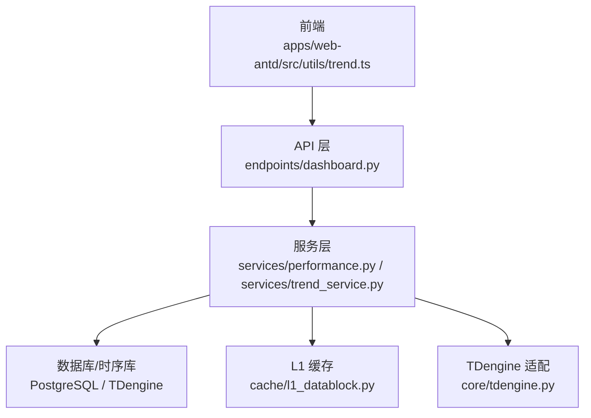
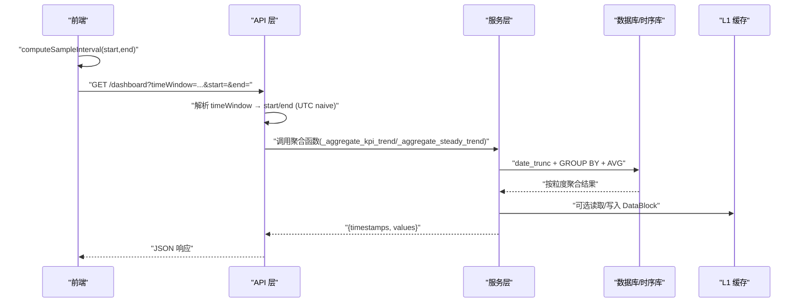
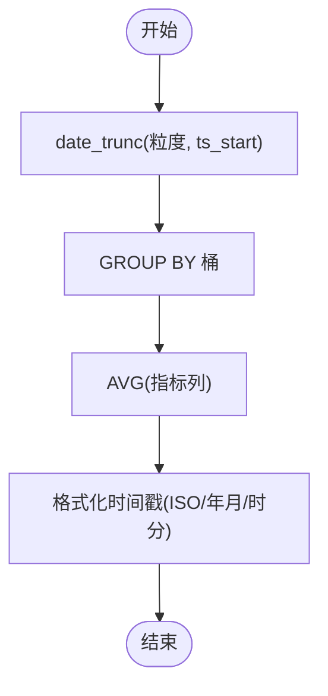
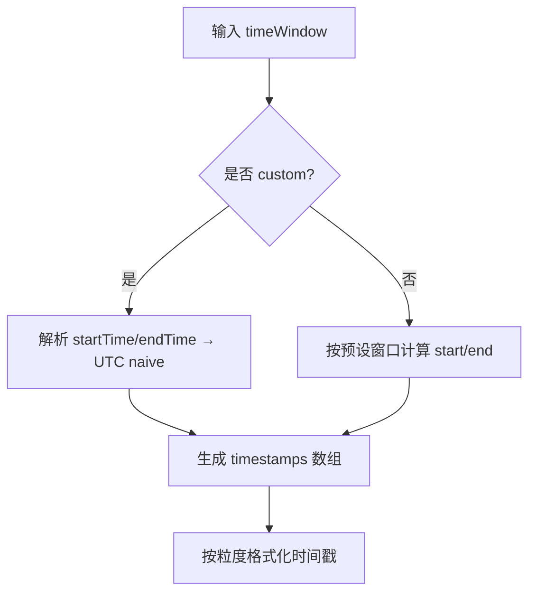
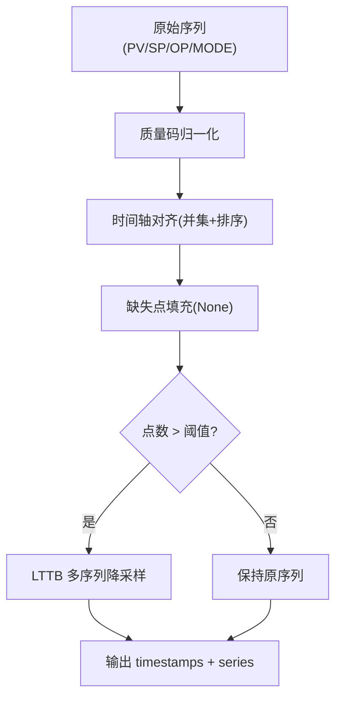
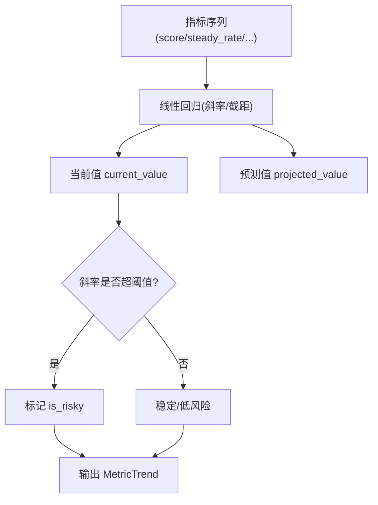
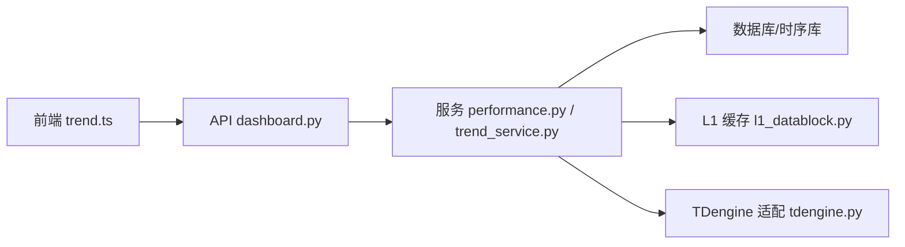

# 趋势分析功能

<cite>
**本文引用的文件**
- [backend/app/services/trend_service.py](file://backend/app/services/trend_service.py)
- [backend/app/api/v1/endpoints/dashboard.py](file://backend/app/api/v1/endpoints/dashboard.py)
- [backend/app/services/performance.py](file://backend/app/services/performance.py)
- [backend/app/services/cache/l1_datablock.py](file://backend/app/services/cache/l1_datablock.py)
- [backend/app/core/tdengine.py](file://backend/app/core/tdengine.py)
- [frontend/apps/web-antd/src/utils/trend.ts](file://frontend/apps/web-antd/src/utils/trend.ts)
- [frontend/apps/web-antd/src/__tests__/trend-sampling.test.ts](file://frontend/apps/web-antd/src/__tests__/trend-sampling.test.ts)
- [backend/tests/test_dashboard_board.py](file://backend/tests/test_dashboard_board.py)
- [backend/app/services/anomaly_prediction.py](file://backend/app/services/anomaly_prediction.py)
</cite>

## 目录
1. [简介](#简介)
2. [项目结构](#项目结构)
3. [核心组件](#核心组件)
4. [架构总览](#架构总览)
5. [详细组件分析](#详细组件分析)
6. [依赖关系分析](#依赖关系分析)
7. [性能考虑](#性能考虑)
8. [故障排查指南](#故障排查指南)
9. [结论](#结论)
10. [附录](#附录)

## 简介
本技术文档聚焦“趋势分析”能力，覆盖时间序列聚合算法、时间窗口选择机制、数据采样策略、趋势计算逻辑与可视化数据准备，以及数据库查询优化、内存处理与缓存策略等性能要点。目标是帮助读者快速理解从数据源到前端可视化的完整链路，并掌握关键实现细节与调优建议。

## 项目结构
后端通过 API 层接收时间窗口参数，服务层执行 SQL 聚合或调用时序数据提供者（如 TDengine）获取原始序列，再经预处理、质量码归一化、对齐与降采样后返回给前端；前端根据时间范围动态计算采样间隔，保证前后端一致的采样策略。

图表来源
- [backend/app/api/v1/endpoints/dashboard.py:200-399](file://backend/app/api/v1/endpoints/dashboard.py#L200-L399)
- [backend/app/services/performance.py:1346-1432](file://backend/app/services/performance.py#L1346-L1432)
- [backend/app/services/trend_service.py:204-424](file://backend/app/services/trend_service.py#L204-L424)
- [backend/app/services/cache/l1_datablock.py:61-202](file://backend/app/services/cache/l1_datablock.py#L61-L202)
- [backend/app/core/tdengine.py:460-484](file://backend/app/core/tdengine.py#L460-L484)
- [frontend/apps/web-antd/src/utils/trend.ts:1-38](file://frontend/apps/web-antd/src/utils/trend.ts#L1-L38)

章节来源
- [backend/app/api/v1/endpoints/dashboard.py:200-399](file://backend/app/api/v1/endpoints/dashboard.py#L200-L399)
- [backend/app/services/performance.py:1346-1432](file://backend/app/services/performance.py#L1346-L1432)
- [backend/app/services/trend_service.py:204-424](file://backend/app/services/trend_service.py#L204-L424)
- [backend/app/services/cache/l1_datablock.py:61-202](file://backend/app/services/cache/l1_datablock.py#L61-L202)
- [backend/app/core/tdengine.py:460-484](file://backend/app/core/tdengine.py#L460-L484)
- [frontend/apps/web-antd/src/utils/trend.ts:1-38](file://frontend/apps/web-antd/src/utils/trend.ts#L1-L38)

## 核心组件
- 时间窗口解析：API 层支持 last_8_hours、last_24_hours、last_72_hours、last_168_hours、today、yesterday、last_7_days、last_30_days、custom 等窗口，统一转换为 UTC naive datetime。
- 时间序列聚合：按小时/日/周/月粒度使用 date_trunc + GROUP BY + AVG 进行聚合，输出时间戳数组与数值数组。
- 采样与降采样：前后端一致计算采样间隔（目标点数 ~3600），后端在超过阈值时触发 LTTB 多序列降采样。
- 质量与缺失值：质量码归一化（GOOD/BAD/UNCERTAIN），BAD 质量点 PV 置空；多 tag 共享时间轴并对齐缺失点。
- 缓存：L1 DataBlock 缓存 zstd 压缩 + Redis Pipeline 批量写入，分层 TTL 控制热/冷数据。
- 趋势风险：基于线性回归斜率判断综合评分与分项指标的趋势风险，结合当前值与阈值评估风险贡献。

章节来源
- [backend/app/api/v1/endpoints/dashboard.py:227-254](file://backend/app/api/v1/endpoints/dashboard.py#L227-L254)
- [backend/app/services/performance.py:1346-1432](file://backend/app/services/performance.py#L1346-L1432)
- [backend/app/services/trend_service.py:204-424](file://backend/app/services/trend_service.py#L204-L424)
- [backend/app/core/tdengine.py:460-484](file://backend/app/core/tdengine.py#L460-L484)
- [backend/app/services/cache/l1_datablock.py:61-202](file://backend/app/services/cache/l1_datablock.py#L61-L202)
- [backend/app/services/anomaly_prediction.py:422-456](file://backend/app/services/anomaly_prediction.py#L422-L456)

## 架构总览
下图展示一次“节点级聚合趋势”请求的端到端流程：前端计算采样间隔 → API 解析时间窗口 → 服务层 SQL 聚合或宽表查询 → 可选 LTTB 降采样 → 返回时间戳与系列数组。

图表来源
- [backend/app/api/v1/endpoints/dashboard.py:227-388](file://backend/app/api/v1/endpoints/dashboard.py#L227-L388)
- [backend/app/services/performance.py:1346-1432](file://backend/app/services/performance.py#L1346-L1432)
- [backend/app/services/cache/l1_datablock.py:128-202](file://backend/app/services/cache/l1_datablock.py#L128-L202)
- [frontend/apps/web-antd/src/utils/trend.ts:28-38](file://frontend/apps/web-antd/src/utils/trend.ts#L28-L38)

## 详细组件分析

### 时间序列聚合算法
- 日期截断函数：使用 SQL 的 date_trunc 将 ts_start 截断为 hour/day/week/month 桶，作为分组键。
- GROUP BY 分组逻辑：对每个桶内记录求平均（AVG），得到该时段指标均值。
- 平均值计算方法：对 KPI 字段（score、steady_rate、accuracy_rate 等）直接取平均；节点级聚合采用加权平均（以 evaluated_loops 为权重）。

图表来源
- [backend/app/services/performance.py:1346-1432](file://backend/app/services/performance.py#L1346-L1432)
- [backend/app/api/v1/endpoints/dashboard.py:297-375](file://backend/app/api/v1/endpoints/dashboard.py#L297-L375)

章节来源
- [backend/app/services/performance.py:1346-1432](file://backend/app/services/performance.py#L1346-L1432)
- [backend/app/api/v1/endpoints/dashboard.py:297-375](file://backend/app/api/v1/endpoints/dashboard.py#L297-L375)

### 时间窗口选择机制
- 最近 7 天：API 层支持 last_7_days，start = now - 7 days，end = now（UTC naive）。
- 时区处理策略：API 层将 ISO 字符串解析为 UTC naive datetime；前端在报表页将本地时间边界转为 UTC ISO 字符串，避免偏移。
- 日期格式化输出：小时粒度输出 "%Y-%m-%dT%H:00:00"，日/月分别输出 "%Y-%m-%d" 与 "%Y-%m"。

图表来源
- [backend/app/api/v1/endpoints/dashboard.py:227-254](file://backend/app/api/v1/endpoints/dashboard.py#L227-L254)
- [backend/app/services/performance.py:1414-1422](file://backend/app/services/performance.py#L1414-L1422)
- [frontend/apps/web-antd/src/views/reports/performance.vue:324-361](file://frontend/apps/web-antd/src/views/reports/performance.vue#L324-L361)

章节来源
- [backend/app/api/v1/endpoints/dashboard.py:227-254](file://backend/app/api/v1/endpoints/dashboard.py#L227-L254)
- [backend/app/services/performance.py:1414-1422](file://backend/app/services/performance.py#L1414-L1422)
- [frontend/apps/web-antd/src/views/reports/performance.vue:324-361](file://frontend/apps/web-antd/src/views/reports/performance.vue#L324-L361)
- [backend/tests/test_dashboard_board.py:137-161](file://backend/tests/test_dashboard_board.py#L137-L161)

### 数据采样策略
- 小时级快照聚合：KPI 趋势默认按小时聚合，必要时扩展至日/周/月。
- 缺失数据处理：多 tag 共享时间轴，缺失点填充 None；PV 质量码 BAD 时置空。
- 异常值过滤：预处理阶段识别异常值并标记 validity；质量码归一化将不同来源质量码映射为 GOOD/BAD/UNCERTAIN。
- 动态采样间隔：前后端一致 computeSampleInterval，目标点数 ~3600；后端在超过阈值时触发 LTTB 降采样。

图表来源
- [backend/app/services/trend_service.py:173-224](file://backend/app/services/trend_service.py#L173-L224)
- [backend/app/services/trend_service.py:226-424](file://backend/app/services/trend_service.py#L226-L424)
- [backend/app/core/tdengine.py:460-484](file://backend/app/core/tdengine.py#L460-L484)
- [frontend/apps/web-antd/src/utils/trend.ts:28-38](file://frontend/apps/web-antd/src/utils/trend.ts#L28-L38)

章节来源
- [backend/app/services/trend_service.py:173-224](file://backend/app/services/trend_service.py#L173-L224)
- [backend/app/services/trend_service.py:226-424](file://backend/app/services/trend_service.py#L226-L424)
- [backend/app/core/tdengine.py:460-484](file://backend/app/core/tdengine.py#L460-L484)
- [frontend/apps/web-antd/src/utils/trend.ts:28-38](file://frontend/apps/web-antd/src/utils/trend.ts#L28-L38)
- [frontend/apps/web-antd/src/__tests__/trend-sampling.test.ts:1-75](file://frontend/apps/web-antd/src/__tests__/trend-sampling.test.ts#L1-L75)

### 趋势计算逻辑
- 综合评分趋势：对 score 序列进行线性回归，得到斜率与预测值；若斜率为负且幅度显著，判定为风险。
- 变化幅度阈值判断：各分项指标（oscillation_rate、saturation_rate、steady_rate）按斜率正负方向设定风险阈值（例如 steady_rate 下降 > -0.01 视为风险）。
- 稳定状态识别：当斜率接近 0 且当前值稳定，可视为稳定；结合置信度与历史波动评估。

图表来源
- [backend/app/services/anomaly_prediction.py:422-456](file://backend/app/services/anomaly_prediction.py#L422-L456)
- [backend/app/services/anomaly_prediction.py:163-186](file://backend/app/services/anomaly_prediction.py#L163-L186)

章节来源
- [backend/app/services/anomaly_prediction.py:163-186](file://backend/app/services/anomaly_prediction.py#L163-L186)
- [backend/app/services/anomaly_prediction.py:422-456](file://backend/app/services/anomaly_prediction.py#L422-L456)

### 可视化数据准备
- 日期数组构建：后端按粒度生成 ISO 时间戳数组；前端在报表页将本地时间边界转为 UTC ISO 字符串，确保窗口一致。
- 分数数组对齐：多 tag 共享时间轴，缺失点填充 None；PV 质量 BAD 时置空。
- 空值填充策略：未命中的小时/日/月返回 None；节点级聚合中 evaluated_loops 为 0 时指标置空。

章节来源
- [backend/app/api/v1/endpoints/dashboard.py:333-375](file://backend/app/api/v1/endpoints/dashboard.py#L333-L375)
- [backend/app/services/performance.py:1414-1422](file://backend/app/services/performance.py#L1414-L1422)
- [backend/app/core/tdengine.py:460-484](file://backend/app/core/tdengine.py#L460-L484)
- [frontend/apps/web-antd/src/views/reports/performance.vue:324-361](file://frontend/apps/web-antd/src/views/reports/performance.vue#L324-L361)

## 依赖关系分析
- API 层依赖服务层聚合函数；服务层依赖数据库/时序库与缓存；前端依赖统一的采样间隔计算工具。
- LTTB 降采样依赖多序列共享时间戳；质量码归一化依赖统一标签映射。

图表来源
- [frontend/apps/web-antd/src/utils/trend.ts:28-38](file://frontend/apps/web-antd/src/utils/trend.ts#L28-L38)
- [backend/app/api/v1/endpoints/dashboard.py:227-388](file://backend/app/api/v1/endpoints/dashboard.py#L227-L388)
- [backend/app/services/performance.py:1346-1432](file://backend/app/services/performance.py#L1346-L1432)
- [backend/app/services/trend_service.py:204-424](file://backend/app/services/trend_service.py#L204-L424)
- [backend/app/services/cache/l1_datablock.py:61-202](file://backend/app/services/cache/l1_datablock.py#L61-L202)
- [backend/app/core/tdengine.py:460-484](file://backend/app/core/tdengine.py#L460-L484)

章节来源
- [frontend/apps/web-antd/src/utils/trend.ts:28-38](file://frontend/apps/web-antd/src/utils/trend.ts#L28-L38)
- [backend/app/api/v1/endpoints/dashboard.py:227-388](file://backend/app/api/v1/endpoints/dashboard.py#L227-L388)
- [backend/app/services/performance.py:1346-1432](file://backend/app/services/performance.py#L1346-L1432)
- [backend/app/services/trend_service.py:204-424](file://backend/app/services/trend_service.py#L204-L424)
- [backend/app/services/cache/l1_datablock.py:61-202](file://backend/app/services/cache/l1_datablock.py#L61-L202)
- [backend/app/core/tdengine.py:460-484](file://backend/app/core/tdengine.py#L460-L484)

## 性能考虑
- 数据库查询优化：使用 date_trunc + GROUP BY + AVG 在数据库侧完成聚合；节点级聚合采用递归 CTE 仅聚合 UNIT 级节点，避免重复累加。
- 内存数据处理：LTTB 降采样仅在超过阈值时触发，减少前端渲染压力；多序列共享时间轴，避免重复对齐。
- 缓存策略应用：L1 DataBlock 缓存 zstd 压缩 + Redis Pipeline 批量写入；分层 TTL（BASE 长周期、高频短周期）；get_or_set 模式减少重复计算。

章节来源
- [backend/app/api/v1/endpoints/dashboard.py:256-375](file://backend/app/api/v1/endpoints/dashboard.py#L256-L375)
- [backend/app/services/trend_service.py:378-424](file://backend/app/services/trend_service.py#L378-L424)
- [backend/app/services/cache/l1_datablock.py:61-202](file://backend/app/services/cache/l1_datablock.py#L61-L202)

## 故障排查指南
- 时间窗口偏移：确认前端将本地时间边界转为 UTC ISO 字符串；API 层解析为 UTC naive datetime。
- 数据缺失：检查质量码归一化与 BAD 点处理；确认多 tag 时间轴对齐逻辑。
- 降采样异常：验证 LTTB 阈值与目标点数；确认参考序列选择（优先 PV）。
- 缓存问题：检查 Key 生成与 TTL 设置；确认序列化/反序列化一致性。

章节来源
- [frontend/apps/web-antd/src/views/reports/performance.vue:324-361](file://frontend/apps/web-antd/src/views/reports/performance.vue#L324-L361)
- [backend/app/services/trend_service.py:173-224](file://backend/app/services/trend_service.py#L173-L224)
- [backend/app/services/cache/l1_datablock.py:128-202](file://backend/app/services/cache/l1_datablock.py#L128-L202)

## 结论
趋势分析功能通过统一的采样间隔计算、SQL 聚合与 LTTB 降采样，实现了高效、准确的时间序列趋势展示。结合质量码归一化、缺失值处理与 L1 缓存策略，系统在大数据量场景下仍保持良好性能。建议在生产环境中持续监控缓存命中率与查询延迟，并根据业务需求调整目标点数与降采样阈值。

## 附录
- 相关测试用例：前端采样间隔单元测试覆盖多种时间范围；后端测试覆盖时间窗口解析与聚合行为。
- 设计依据：FDS、ADS、PRD 中对缓存、聚合与采样的规范约束。

章节来源
- [frontend/apps/web-antd/src/__tests__/trend-sampling.test.ts:1-75](file://frontend/apps/web-antd/src/__tests__/trend-sampling.test.ts#L1-L75)
- [backend/tests/test_dashboard_board.py:137-161](file://backend/tests/test_dashboard_board.py#L137-L161)